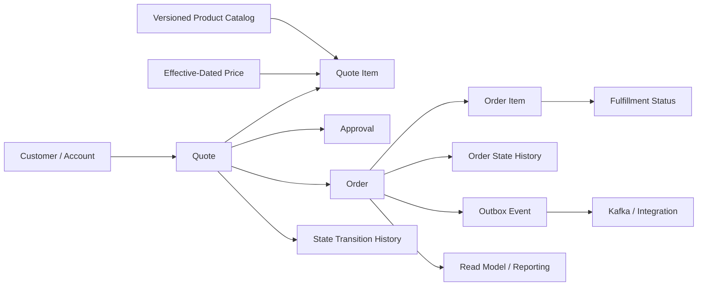
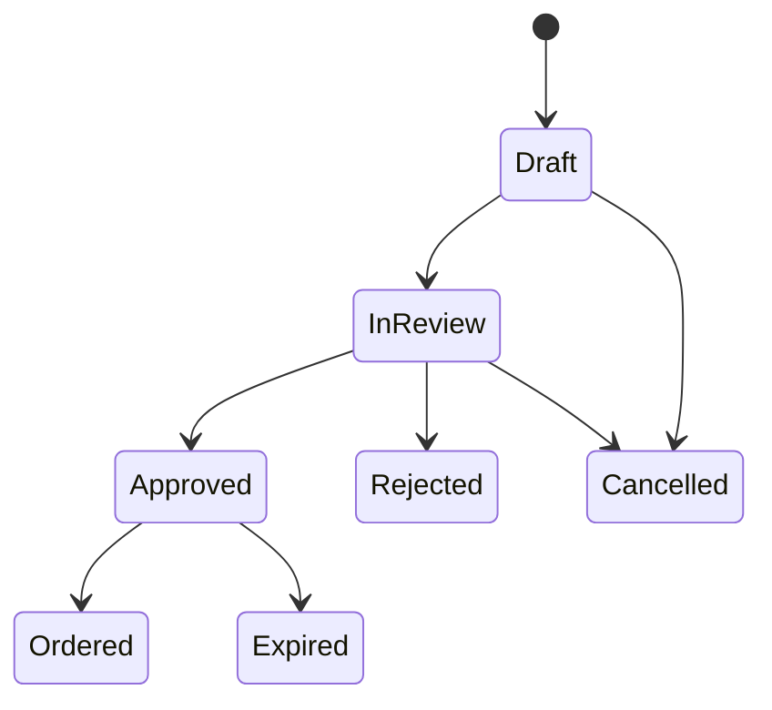

# Part 005 — CPQ and Order Management Data Modelling Context

## 1. Posisi Part Ini Dalam Seri

Part sebelumnya membahas data modelling enterprise secara umum: schema, table, key, constraint, normalization, audit, temporal data, soft delete, dan multi-tenancy.

Part ini menerapkan lensa tersebut ke konteks **CPQ dan order management**.

Fokusnya bukan menebak schema internal CSG. Fokusnya adalah membangun mental model untuk membaca dan mereview model data di domain seperti:

- customer,
- account,
- product catalog,
- product offering,
- product specification,
- price,
- quote,
- quote item,
- order,
- order item,
- contract/agreement,
- approval,
- fulfillment,
- status lifecycle,
- audit/history,
- snapshot,
- outbox,
- reporting/read model.

Dalam sistem CPQ/order management, data model bukan hanya CRUD structure. Data model adalah tempat lifecycle bisnis dikunci.

Contoh pertanyaan yang harus bisa dijawab oleh schema:

- Quote ini dibuat berdasarkan versi catalog yang mana?
- Harga yang dipakai saat quote dibuat apakah tetap immutable walaupun price book berubah?
- Apakah order item masih bisa ditelusuri ke quote item asalnya?
- Apakah approval decision terdokumentasi lengkap?
- Apakah status transition dapat diaudit?
- Apakah fulfillment state dapat direkonsiliasi dengan sistem downstream?
- Apakah event yang dikirim ke Kafka berasal dari transaksi yang sama dengan perubahan database?
- Apakah reporting membaca table OLTP langsung atau read model?

> Prinsip utama: CPQ/order data model harus bisa menjawab **what was configured, what was priced, what was approved, what was ordered, what was fulfilled, what changed, when, by whom, and based on which version of business truth**.

---

## 2. Batasan Penting: Jangan Mengarang Schema Internal

Part ini menggunakan istilah domain umum. Nama table, column, constraint, index, event, dan deployment internal harus diverifikasi di repository dan environment aktual.

Contoh nama konseptual:

```text
customer
account
product_catalog
product_offering
product_specification
price
quote
quote_item
order
order_item
approval
fulfillment_status
state_transition_history
outbox_event
```

Nama di codebase nyata bisa sangat berbeda.

Yang penting bukan nama table-nya, tetapi **invariant** yang diwakili.

| Konsep | Yang perlu dicari di schema aktual |
|---|---|
| Customer | Party, subscriber, organization, billing account, service account |
| Product catalog | Catalog, offering, specification, bundle, feature, option |
| Price | Price book, charge, recurring charge, one-time charge, discount, tax component |
| Quote | Proposal, cart, commercial offer, quote header |
| Quote item | Line item, configured item, product instance proposal |
| Order | Sales order, service order, provisioning order, order header |
| Order item | Order line, fulfillment item, service action |
| Approval | Approval request, decision, workflow task |
| Lifecycle | Status, state machine, transition history |
| Outbox | Event table, integration queue, pending event, CDC source table |
| Read model | Projection, reporting table, materialized view, denormalized table |

> Internal verification checklist selalu lebih penting daripada asumsi domain.

---

## 3. High-Level Domain Map

Secara konseptual, CPQ/order management sering memiliki alur seperti ini:



Alur ini tidak mengatakan bahwa table harus seperti diagram. Diagram ini hanya membantu reasoning:

- customer/account adalah pihak yang dilayani,
- catalog/price adalah sumber aturan komersial,
- quote adalah proposal komersial,
- approval adalah kontrol sebelum commit bisnis,
- order adalah permintaan eksekusi,
- fulfillment adalah realisasi operasional,
- history/audit menjaga traceability,
- outbox/event menjaga integrasi,
- read model menjaga query/reporting tidak merusak OLTP.

---

## 4. Core Modelling Question

Dalam domain CPQ/order, model data harus menjawab tiga kelas pertanyaan.

### 4.1 Current State

Contoh:

- Quote sekarang statusnya apa?
- Order sekarang sedang fulfillment tahap apa?
- Item mana yang aktif?
- Account mana yang memiliki quote ini?

Biasanya disimpan di table utama:

```text
quote.status
order.status
order_item.fulfillment_status
```

Current state penting untuk query cepat dan API response.

### 4.2 Historical State

Contoh:

- Status quote berubah dari apa ke apa?
- Siapa yang approve?
- Kapan order masuk ke fulfillment?
- Apa alasan reject/cancel?

Biasanya butuh history table:

```text
quote_state_history
order_state_history
approval_decision_history
fulfillment_event_history
```

History penting untuk audit, debugging, customer support, dan compliance.

### 4.3 Business Snapshot

Contoh:

- Harga saat quote dibuat berapa?
- Catalog version mana yang dipakai?
- Discount rule mana yang berlaku saat approval?
- Product configuration apa yang disetujui?

Snapshot penting karena source data dapat berubah setelah transaksi bisnis terjadi.

Jika quote hanya menyimpan foreign key ke catalog/price current version, hasil historis bisa berubah ketika catalog/price berubah. Itu berbahaya.

---

## 5. Customer and Account Modelling

Customer/account sering tampak sederhana, tetapi di enterprise telco/BSS-style system biasanya kompleks.

Kemungkinan konsep yang berbeda:

- customer party,
- legal entity,
- billing account,
- service account,
- subscriber,
- contact,
- payer,
- owner,
- tenant,
- reseller/partner.

Jangan langsung menganggap `customer_id` cukup.

### 5.1 Common Modelling Pattern

```sql
CREATE TABLE account (
    id              uuid PRIMARY KEY,
    tenant_id       uuid NOT NULL,
    account_number  text NOT NULL,
    account_type    text NOT NULL,
    status          text NOT NULL,
    created_at      timestamptz NOT NULL DEFAULT now(),
    updated_at      timestamptz NOT NULL DEFAULT now(),
    UNIQUE (tenant_id, account_number)
);
```

Hal yang penting:

- `tenant_id` menjaga boundary multi-tenant,
- `account_number` bisa menjadi natural/business identifier,
- `id` bisa menjadi technical identifier,
- unique constraint mencegah duplicate account number dalam tenant,
- status harus punya lifecycle jelas.

### 5.2 Failure Mode

| Failure | Penyebab | Dampak |
|---|---|---|
| Duplicate customer/account | Tidak ada unique constraint | Quote/order bisa terkait ke entity ambigu |
| Tenant leakage | Query lupa `tenant_id` | Data privacy incident |
| Wrong account type | Tidak ada check/validation | Quote dibuat pada account yang tidak eligible |
| Historical ambiguity | Account berubah tanpa history | Quote/order lama sulit dijelaskan |

### 5.3 Review Lens

Untuk setiap relasi quote/order ke customer/account, tanya:

- Apakah account ini owner, payer, billing account, atau service account?
- Apakah relasi ini bisa berubah setelah quote dibuat?
- Jika account berubah, apakah quote/order lama harus mengikuti perubahan atau tetap snapshot?
- Apakah query selalu membawa tenant/access boundary?

---

## 6. Product Catalog Modelling

Product catalog adalah salah satu sumber complexity terbesar dalam CPQ.

Catalog biasanya berisi:

- product specification,
- product offering,
- bundle,
- feature,
- option,
- compatibility rule,
- eligibility rule,
- lifecycle status,
- effective date,
- version.

### 6.1 Product Specification vs Product Offering

Secara konseptual:

| Konsep | Makna |
|---|---|
| Product specification | Definisi teknis/logis produk |
| Product offering | Produk yang dijual secara komersial |
| Offering price | Harga untuk offering tertentu |
| Catalog version | Snapshot aturan catalog pada periode tertentu |

Contoh:

```text
Product Specification: Fiber Internet Service
Product Offering: Fiber 100 Mbps Business Plan
Price: 12-month contract recurring fee
Catalog Version: 2026-Q3 catalog
```

### 6.2 Versioned Catalog

Catalog production jarang statis. Ia berubah karena:

- produk baru,
- produk retired,
- price change,
- bundling rule berubah,
- regulatory requirement,
- promo campaign,
- region/tenant-specific offering.

Karena itu catalog sering butuh versioning atau effective dating.

Contoh konseptual:

```sql
CREATE TABLE product_offering (
    id              uuid PRIMARY KEY,
    offering_code   text NOT NULL,
    version         integer NOT NULL,
    name            text NOT NULL,
    status          text NOT NULL,
    valid_from      timestamptz NOT NULL,
    valid_to        timestamptz,
    created_at      timestamptz NOT NULL DEFAULT now(),
    UNIQUE (offering_code, version)
);
```

### 6.3 Catalog Correctness Invariant

Beberapa invariant yang biasanya penting:

- offering code tidak duplicate dalam versi yang sama,
- hanya offering aktif yang bisa dipakai untuk quote baru,
- quote lama harus tahu offering version yang dipakai,
- retired offering mungkin tetap valid untuk order lama,
- effective date tidak boleh overlap jika bisnis menuntut satu active version per waktu.

### 6.4 Failure Mode

| Failure | Penyebab | Dampak |
|---|---|---|
| Quote lama berubah makna | Quote hanya FK ke catalog current | Audit dan dispute bermasalah |
| Offering overlap | Tidak ada constraint/validation effective date | Pricing tidak deterministik |
| Retired product masih bisa dijual | Query eligibility salah | Revenue/compliance issue |
| Catalog rule berubah tanpa migration compatibility | JSON/rule schema tidak versioned | Runtime error saat quote lama dibuka |

---

## 7. Price and Effective-Dated Pricing

Pricing di CPQ bukan sekadar angka.

Harga dapat bergantung pada:

- product offering,
- region,
- tenant,
- customer segment,
- contract term,
- quantity,
- discount,
- tax,
- currency,
- promotion,
- effective date,
- approval override.

### 7.1 Price as Temporal Data

Harga harus jelas berlaku kapan.

```sql
CREATE TABLE price_component (
    id                uuid PRIMARY KEY,
    offering_id        uuid NOT NULL,
    price_type         text NOT NULL,
    amount             numeric(18, 4) NOT NULL,
    currency_code      char(3) NOT NULL,
    valid_from         timestamptz NOT NULL,
    valid_to           timestamptz,
    created_at         timestamptz NOT NULL DEFAULT now(),
    CHECK (amount >= 0),
    CHECK (valid_to IS NULL OR valid_to > valid_from)
);
```

### 7.2 Price Snapshot in Quote

Quote item sebaiknya menyimpan hasil pricing yang digunakan saat quote dibuat atau disubmit.

```sql
CREATE TABLE quote_item_price_snapshot (
    id                uuid PRIMARY KEY,
    quote_item_id      uuid NOT NULL,
    price_component_id uuid,
    price_type         text NOT NULL,
    amount             numeric(18, 4) NOT NULL,
    currency_code      char(3) NOT NULL,
    calculation_basis  jsonb,
    created_at         timestamptz NOT NULL DEFAULT now()
);
```

Mengapa snapshot?

Karena price master bisa berubah. Quote yang sudah disetujui tidak boleh berubah hanya karena price book berubah.

### 7.3 Correctness Concern

- Monetary value harus memakai `numeric`, bukan floating point.
- Currency harus eksplisit.
- Rounding policy harus konsisten.
- Tax/discount harus bisa diaudit.
- Override harus punya approval trace.
- Effective date harus memakai waktu yang benar: quote creation time, submission time, approval time, atau requested start date.

### 7.4 Debugging Pricing Issue

Saat ada dispute harga:

1. Cari quote item.
2. Cari price snapshot.
3. Cari catalog/offering version.
4. Cari effective date yang dipakai.
5. Cari discount/override/approval.
6. Cari event yang dikirim downstream.
7. Bandingkan dengan expected pricing rule.

Jika salah satu data tidak tersimpan, debugging akan berubah menjadi tebak-tebakan.

---

## 8. Quote Header Modelling

Quote header biasanya merepresentasikan proposal komersial.

Contoh field konseptual:

```text
quote.id
quote.tenant_id
quote.quote_number
quote.account_id
quote.status
quote.version
quote.currency_code
quote.valid_until
quote.created_by
quote.created_at
quote.submitted_at
quote.approved_at
quote.cancelled_at
```

### 8.1 Quote Number vs ID

Pisahkan:

- technical ID: untuk FK/internal join,
- quote number: business-facing identifier.

```sql
CREATE TABLE quote (
    id             uuid PRIMARY KEY,
    tenant_id      uuid NOT NULL,
    quote_number   text NOT NULL,
    account_id     uuid NOT NULL,
    status         text NOT NULL,
    version        integer NOT NULL DEFAULT 1,
    currency_code  char(3) NOT NULL,
    valid_until    timestamptz,
    created_at     timestamptz NOT NULL DEFAULT now(),
    updated_at     timestamptz NOT NULL DEFAULT now(),
    UNIQUE (tenant_id, quote_number)
);
```

### 8.2 Quote Lifecycle

Quote biasanya punya lifecycle seperti:



Lifecycle aktual harus diverifikasi.

Yang penting:

- state transition harus eksplisit,
- tidak semua transition valid,
- transition harus atomic dengan side effect penting,
- history transition harus tersedia,
- concurrent update harus dicegah.

### 8.3 Optimistic Locking

Quote sering diedit oleh user/process berbeda. Version column berguna.

```sql
UPDATE quote
SET status = 'IN_REVIEW',
    version = version + 1,
    updated_at = now()
WHERE id = #{quoteId}
  AND version = #{expectedVersion}
  AND status = 'DRAFT';
```

Jika row count = 0, kemungkinan:

- quote tidak ada,
- status sudah berubah,
- version conflict,
- tenant/access boundary salah.

Jangan langsung map semua ke 404. Domain error harus dibedakan.

---

## 9. Quote Item Modelling

Quote item merepresentasikan item yang dikonfigurasi dan dihargai.

Quote item bisa sederhana atau kompleks:

- line item datar,
- parent-child bundle,
- nested product configuration,
- add/change/remove action,
- quantity,
- term,
- attribute bag,
- dependency ke existing asset/service.

### 9.1 Parent-Child Item

```sql
CREATE TABLE quote_item (
    id                 uuid PRIMARY KEY,
    quote_id           uuid NOT NULL,
    parent_item_id     uuid,
    line_number        integer NOT NULL,
    offering_id        uuid NOT NULL,
    offering_version   integer NOT NULL,
    action             text NOT NULL,
    quantity           numeric(18, 4) NOT NULL DEFAULT 1,
    configuration      jsonb,
    status             text NOT NULL,
    created_at         timestamptz NOT NULL DEFAULT now(),
    UNIQUE (quote_id, line_number)
);
```

### 9.2 JSONB Configuration

Product configuration sering semi-structured. JSONB dapat berguna untuk:

- feature selection,
- option values,
- technical parameters,
- dynamic form output,
- rule evaluation snapshot.

Tetapi JSONB tidak boleh menjadi tempat membuang semua modelling decision.

Gunakan relational column untuk field yang:

- sering difilter,
- sering di-join,
- butuh constraint kuat,
- dipakai reporting,
- menentukan lifecycle bisnis.

Gunakan JSONB untuk field yang:

- sparse,
- berubah antar product type,
- tidak selalu perlu query global,
- tetap punya schema governance/version.

### 9.3 Failure Mode

| Failure | Penyebab | Dampak |
|---|---|---|
| Bundle rusak | Parent-child tidak valid | Order decomposition salah |
| Duplicate line number | Tidak ada unique constraint | UI/API ambigu |
| Config tidak compatible | JSON schema tidak versioned | Quote lama gagal dibuka |
| Quantity invalid | Tidak ada check/domain validation | Pricing salah |
| Offering version hilang | Hanya simpan offering_id | Historical quote tidak defensible |

---

## 10. Order Header Modelling

Order biasanya lahir dari quote yang approved, tetapi order bukan sekadar copy quote.

Quote adalah proposal. Order adalah commitment untuk dieksekusi.

Order memiliki lifecycle sendiri:

- submitted,
- accepted,
- in progress,
- partially fulfilled,
- completed,
- failed,
- cancelled.

Contoh konseptual:

```sql
CREATE TABLE customer_order (
    id             uuid PRIMARY KEY,
    tenant_id      uuid NOT NULL,
    order_number   text NOT NULL,
    quote_id       uuid,
    account_id     uuid NOT NULL,
    status         text NOT NULL,
    version        integer NOT NULL DEFAULT 1,
    submitted_at   timestamptz,
    completed_at   timestamptz,
    created_at     timestamptz NOT NULL DEFAULT now(),
    updated_at     timestamptz NOT NULL DEFAULT now(),
    UNIQUE (tenant_id, order_number)
);
```

### 10.1 Quote-to-Order Traceability

Order sebaiknya bisa ditelusuri ke quote:

```text
order.quote_id -> quote.id
order_item.quote_item_id -> quote_item.id
```

Tetapi hati-hati:

- Tidak semua order selalu berasal dari quote.
- Order dapat berasal dari external system.
- Order dapat split/merge dari quote item.
- Order decomposition dapat menghasilkan fulfillment item yang lebih granular.

Karena itu traceability harus mendukung model bisnis nyata.

### 10.2 Order Correctness Invariant

- Order number unique per tenant.
- Order status transition valid.
- Order yang completed tidak boleh diedit sembarangan.
- Order item harus konsisten dengan order header.
- Cancellation harus punya reason dan history.
- Retry fulfillment tidak boleh membuat duplicate irreversible action.

---

## 11. Order Item and Fulfillment Modelling

Order item merepresentasikan pekerjaan yang harus dieksekusi.

Di telco/BSS/OSS style system, order item bisa mewakili:

- add service,
- change service,
- disconnect service,
- modify attribute,
- provision resource,
- activate billing,
- notify downstream OSS,
- schedule technician.

### 11.1 Order Item State

```sql
CREATE TABLE order_item (
    id               uuid PRIMARY KEY,
    order_id         uuid NOT NULL,
    quote_item_id    uuid,
    parent_item_id   uuid,
    line_number      integer NOT NULL,
    action           text NOT NULL,
    status           text NOT NULL,
    fulfillment_ref  text,
    created_at       timestamptz NOT NULL DEFAULT now(),
    updated_at       timestamptz NOT NULL DEFAULT now(),
    UNIQUE (order_id, line_number)
);
```

### 11.2 Fulfillment Status History

Current status saja tidak cukup.

```sql
CREATE TABLE order_item_status_history (
    id              uuid PRIMARY KEY,
    order_item_id   uuid NOT NULL,
    from_status     text,
    to_status       text NOT NULL,
    reason_code     text,
    message         text,
    changed_by      text,
    changed_at      timestamptz NOT NULL DEFAULT now()
);
```

History membantu:

- audit,
- customer support,
- RCA,
- integration debugging,
- SLA measurement,
- retry/reconciliation.

### 11.3 Fulfillment Failure Mode

| Failure | Penyebab | Dampak |
|---|---|---|
| Duplicate fulfillment | Retry tidak idempotent | Double provisioning/billing |
| Lost status update | External event tidak correlated | Order stuck |
| Out-of-order update | Event datang tidak berurutan | Status mundur |
| Partial fulfillment tidak termodel | Header hanya punya status tunggal | Customer impact tidak jelas |
| No history | Current status overwrite | RCA sulit |

---

## 12. Contract and Agreement Modelling

Dalam banyak sistem enterprise, quote/order dapat menghasilkan contract/agreement.

Contract/agreement bisa memiliki:

- agreement number,
- term,
- start date,
- end date,
- renewal rule,
- commitment,
- penalty,
- legal entity,
- attached document,
- related order,
- related quote.

Contoh konseptual:

```sql
CREATE TABLE agreement (
    id                uuid PRIMARY KEY,
    tenant_id         uuid NOT NULL,
    agreement_number  text NOT NULL,
    account_id        uuid NOT NULL,
    source_order_id   uuid,
    status            text NOT NULL,
    valid_from        timestamptz NOT NULL,
    valid_to          timestamptz,
    created_at        timestamptz NOT NULL DEFAULT now(),
    UNIQUE (tenant_id, agreement_number),
    CHECK (valid_to IS NULL OR valid_to > valid_from)
);
```

### 12.1 Correctness Concern

- Contract date tidak selalu sama dengan order date.
- Contract term dapat memengaruhi price/discount.
- Agreement amendment butuh versioning.
- Cancel/terminate harus historis.
- Agreement document mungkin disimpan sebagai file/blob metadata, bukan langsung di PostgreSQL.

---

## 13. Approval Modelling

Approval sering menjadi regulatory/commercial control point.

Approval dapat bergantung pada:

- discount threshold,
- credit risk,
- product type,
- customer segment,
- manual override,
- contract term,
- legal requirement,
- policy version.

### 13.1 Approval Request and Decision

```sql
CREATE TABLE approval_request (
    id              uuid PRIMARY KEY,
    quote_id         uuid NOT NULL,
    status          text NOT NULL,
    policy_version  text,
    requested_by    text NOT NULL,
    requested_at    timestamptz NOT NULL DEFAULT now(),
    completed_at    timestamptz
);

CREATE TABLE approval_decision (
    id                  uuid PRIMARY KEY,
    approval_request_id  uuid NOT NULL,
    approver             text NOT NULL,
    decision             text NOT NULL,
    reason               text,
    decided_at           timestamptz NOT NULL DEFAULT now()
);
```

### 13.2 Approval Correctness

- Approval decision harus immutable atau historis.
- Approval harus tahu policy/rule version.
- Approval override harus traceable.
- Re-approval rules harus jelas jika quote berubah setelah approval.
- Concurrent approval decision harus dikontrol.

### 13.3 Failure Mode

| Failure | Penyebab | Dampak |
|---|---|---|
| Quote berubah setelah approval | Tidak ada invalidation/reapproval rule | Unauthorized commercial commitment |
| Approval overwrite | Tidak ada decision history | Audit gagal |
| Double approval race | Concurrent update tanpa lock/version | Status tidak konsisten |
| Policy tidak versioned | Tidak tahu rule apa yang dipakai | Compliance evidence lemah |

---

## 14. State Transition History

Untuk quote/order, current status bukan audit trail.

Current status menjawab: **sekarang apa?**

State history menjawab:

- sebelumnya apa?
- berubah menjadi apa?
- kapan?
- oleh siapa?
- melalui event/API/job apa?
- alasan bisnisnya apa?
- correlation ID-nya apa?

Contoh:

```sql
CREATE TABLE quote_state_transition (
    id              uuid PRIMARY KEY,
    quote_id         uuid NOT NULL,
    from_status      text,
    to_status        text NOT NULL,
    reason_code      text,
    actor_type       text,
    actor_id         text,
    request_id       text,
    correlation_id   text,
    changed_at       timestamptz NOT NULL DEFAULT now()
);
```

### 14.1 State Machine Invariant

Transition harus valid.

```text
DRAFT -> IN_REVIEW      valid
IN_REVIEW -> APPROVED   valid
APPROVED -> ORDERED     valid
ORDERED -> DRAFT        invalid
CANCELLED -> APPROVED   invalid
```

Validasi bisa dilakukan di:

- service layer,
- database constraint terbatas,
- trigger/function,
- workflow engine,
- combination.

Yang penting: satu source of truth untuk transition rule harus jelas.

---

## 15. Audit Trail vs State History

Audit trail dan state history sering tertukar.

| Aspek | State history | Audit trail |
|---|---|---|
| Fokus | Perubahan status bisnis | Perubahan data umum |
| Granularitas | Domain transition | Row/field change |
| Audience | Business/debug/support | Compliance/security/debug |
| Contoh | DRAFT -> APPROVED | amount changed 100 -> 90 |
| Query | Lifecycle timeline | Who changed what |

Audit trail dapat berupa:

- audit table manual,
- trigger-based audit,
- application event log,
- CDC stream,
- external audit platform.

### 15.1 Audit Correctness Concern

- Audit harus immutable atau append-only.
- Actor dan timestamp harus jelas.
- Correlation/request ID harus disimpan.
- Sensitive value harus ditangani hati-hati.
- Audit tidak boleh menyebabkan transaksi utama sering gagal karena storage/logging issue tanpa policy yang jelas.

---

## 16. Immutable Quote Snapshot

Salah satu pattern penting dalam CPQ adalah immutable quote snapshot.

Quote snapshot menyimpan versi data yang dipakai ketika quote disubmit/approved/order-created.

Snapshot dapat mencakup:

- account/customer display data,
- catalog offering version,
- product configuration,
- price components,
- discount/override,
- terms and conditions,
- approval basis,
- calculated totals.

### 16.1 Snapshot Table vs JSONB Snapshot

Ada dua pattern umum.

#### Relational Snapshot

```text
quote_item_price_snapshot
quote_item_attribute_snapshot
quote_term_snapshot
```

Kelebihan:

- queryable,
- constraint lebih kuat,
- reporting lebih mudah.

Kekurangan:

- schema lebih banyak,
- migration lebih berat.

#### JSONB Snapshot

```sql
ALTER TABLE quote
ADD COLUMN approved_snapshot jsonb;
```

Kelebihan:

- fleksibel,
- cocok untuk snapshot kompleks,
- mudah menyimpan payload utuh.

Kekurangan:

- constraint lemah,
- query/reporting lebih sulit,
- butuh schema version,
- TypeHandler dan compatibility harus disiplin.

### 16.2 Senior Heuristic

Gunakan relational snapshot untuk data yang sering diquery dan diaudit secara terstruktur.

Gunakan JSONB snapshot untuk payload historis yang jarang difilter tetapi harus bisa direkonstruksi.

Sering kali kombinasi keduanya paling masuk akal.

---

## 17. Event and Outbox Table

Dalam arsitektur event-driven, perubahan quote/order sering harus dikirim ke Kafka atau integration layer.

Masalah klasik:

```text
1. Update order status di PostgreSQL sukses.
2. Publish event ke Kafka gagal.
3. Database dan event stream tidak sinkron.
```

Transactional outbox menyelesaikan ini dengan menyimpan event dalam transaksi yang sama dengan state change.

```sql
CREATE TABLE outbox_event (
    id              uuid PRIMARY KEY,
    aggregate_type  text NOT NULL,
    aggregate_id    uuid NOT NULL,
    event_type      text NOT NULL,
    event_version   integer NOT NULL,
    payload         jsonb NOT NULL,
    status          text NOT NULL,
    created_at      timestamptz NOT NULL DEFAULT now(),
    published_at    timestamptz,
    correlation_id  text
);
```

Dalam transaksi yang sama:

```sql
UPDATE customer_order
SET status = 'SUBMITTED',
    version = version + 1
WHERE id = #{orderId};

INSERT INTO outbox_event (...)
VALUES (...);
```

Publisher kemudian mengirim event dari outbox ke Kafka.

### 17.1 Outbox Correctness

- Event harus dibuat dalam transaksi yang sama dengan state change.
- Consumer harus idempotent.
- Duplicate event harus diasumsikan mungkin.
- Event ordering harus dipikirkan per aggregate.
- Event schema harus versioned.
- Replay harus aman.
- Reconciliation harus tersedia.

---

## 18. Read Model and Reporting Table

Query reporting sering tidak cocok langsung ke schema OLTP.

Contoh reporting query:

- jumlah quote approved per region,
- order stuck per fulfillment stage,
- average approval duration,
- revenue by product offering,
- quote-to-order conversion,
- aging order item.

Jika query ini membaca banyak table OLTP langsung, risiko:

- slow query,
- lock/IO pressure,
- temp file besar,
- plan regression,
- endpoint transaksi ikut lambat,
- reporting logic tersebar.

### 18.1 Read Model Pattern

```sql
CREATE TABLE order_reporting_snapshot (
    tenant_id             uuid NOT NULL,
    order_id              uuid PRIMARY KEY,
    order_number          text NOT NULL,
    account_id            uuid NOT NULL,
    order_status          text NOT NULL,
    submitted_at          timestamptz,
    completed_at          timestamptz,
    total_item_count      integer NOT NULL,
    failed_item_count     integer NOT NULL,
    last_status_change_at timestamptz,
    updated_at            timestamptz NOT NULL
);
```

Read model dapat diupdate oleh:

- synchronous transaction,
- async projection,
- CDC consumer,
- scheduled batch,
- materialized view refresh.

### 18.2 Staleness Contract

Read model harus punya jawaban untuk:

- seberapa stale data boleh?
- bagaimana mendeteksi projection lag?
- bagaimana rebuild projection?
- bagaimana reconcile dengan source table?
- apakah API boleh membaca read model?
- apakah reporting boleh membaca replica?

---

## 19. Java/JAX-RS Impact

Data model CPQ/order memengaruhi desain Java/JAX-RS service.

### 19.1 Endpoint Bukan Sekadar CRUD

Contoh endpoint buruk:

```text
PUT /quotes/{id}
```

Jika endpoint ini bisa mengubah semua field, lifecycle domain menjadi tidak jelas.

Lebih baik modelkan command eksplisit:

```text
POST /quotes/{id}/submit
POST /quotes/{id}/approve
POST /quotes/{id}/reject
POST /quotes/{id}/convert-to-order
POST /orders/{id}/cancel
POST /orders/{id}/retry-fulfillment
```

Command eksplisit membantu:

- transaction boundary,
- authorization,
- audit,
- state transition validation,
- idempotency,
- event emission,
- error mapping.

### 19.2 Service Transaction Boundary

Contoh submit quote:

```text
JAX-RS resource
  -> validate request
  -> service.submitQuote(command)
       -> begin transaction
       -> load quote for update / optimistic version
       -> validate state transition
       -> validate pricing snapshot
       -> update quote status
       -> insert state transition history
       -> insert outbox event
       -> commit
  -> return response
```

Jika history atau outbox di luar transaksi, correctness melemah.

### 19.3 HTTP Error Mapping

Database state conflict harus dipetakan dengan tepat:

| Kondisi | Kemungkinan HTTP |
|---|---|
| Quote tidak ditemukan | 404 |
| Tenant tidak punya akses | 404 atau 403 sesuai policy |
| Version conflict | 409 |
| Invalid state transition | 409 atau 422 |
| Unique constraint violation | 409 |
| Validation domain gagal | 422 |
| Serialization failure after retry exhausted | 503 atau 409 sesuai semantics |

---

## 20. MyBatis/JDBC Impact

Dalam MyBatis, query domain CPQ/order sering kompleks.

### 20.1 Mapper Boundary

Mapper sebaiknya tidak menyembunyikan business transition terlalu dalam.

Buruk:

```xml
<update id="updateQuote">
  UPDATE quote
  SET status = #{status},
      total_amount = #{totalAmount},
      updated_at = now()
  WHERE id = #{id}
</update>
```

Lebih reviewable:

```xml
<update id="markQuoteSubmitted">
  UPDATE quote
  SET status = 'IN_REVIEW',
      version = version + 1,
      submitted_at = now(),
      updated_at = now()
  WHERE id = #{quoteId}
    AND tenant_id = #{tenantId}
    AND status = 'DRAFT'
    AND version = #{expectedVersion}
</update>
```

### 20.2 ResultMap Caution

CPQ/order object graph bisa besar.

Hati-hati dengan mapper yang memuat:

- quote,
- semua quote item,
- semua price component,
- semua approval,
- semua history,
- semua catalog detail,
- semua account data.

Satu endpoint bisa berubah menjadi query besar atau N+1.

Design query sesuai use case:

- detail screen,
- list screen,
- approval screen,
- export/report,
- internal reconciliation,
- downstream event payload.

Tidak semua use case butuh graph yang sama.

---

## 21. Microservices and Event-Driven Impact

Dalam microservices, CPQ/order data sering berinteraksi dengan service lain:

- catalog service,
- pricing service,
- customer/account service,
- approval/workflow service,
- order service,
- fulfillment/OSS service,
- billing service,
- notification service,
- reporting/analytics service.

### 21.1 Do Not Cross Service Boundary by Database Join

Anti-pattern:

```sql
SELECT *
FROM quote q
JOIN other_service_schema.customer c ON c.id = q.customer_id;
```

Jika schema dimiliki service lain, join ini melanggar ownership.

Alternatif:

- API call,
- replicated reference data,
- event-driven projection,
- read model,
- data warehouse,
- well-defined shared reference data policy.

### 21.2 Reference Data Copy

Order service mungkin perlu menyimpan snapshot customer/account/cost/pricing data agar bisa tetap menjelaskan order historis tanpa bergantung pada service lain.

Ini bukan sekadar denormalization; ini historical correctness.

### 21.3 Eventual Consistency

Jika quote approved event dikirim ke order service, order creation bisa asynchronous.

Pertanyaan penting:

- Apakah user perlu immediate order ID?
- Apakah quote status menunggu order created?
- Bagaimana jika event gagal?
- Bagaimana jika event duplicate?
- Bagaimana jika downstream lambat?
- Bagaimana reconciliation dilakukan?

---

## 22. Kubernetes, Cloud, On-Prem Impact

Data model CPQ/order juga memengaruhi operasi.

### 22.1 Table Growth

Table yang cenderung tumbuh cepat:

- quote item,
- order item,
- state history,
- audit table,
- outbox event,
- integration log,
- fulfillment event,
- reporting snapshot.

Di Kubernetes/cloud/on-prem, growth ini berdampak pada:

- disk usage,
- index bloat,
- vacuum pressure,
- backup size,
- restore time,
- replication lag,
- query latency,
- storage autoscaling,
- partition/retention strategy.

### 22.2 Retention and Archival

History/audit/outbox tidak bisa dibiarkan tumbuh tanpa policy.

Tanya:

- data mana yang harus disimpan selamanya?
- data mana yang bisa diarsip?
- data mana yang bisa dihapus?
- apakah ada regulatory retention?
- apakah archive tetap queryable?
- apakah restore dari backup masih memenuhi RTO?

---

## 23. Common CPQ/Order Data Modelling Failure Modes

| Failure | Root Cause | Signal | Debugging Direction |
|---|---|---|---|
| Quote total berubah setelah price update | Tidak ada price snapshot | Customer dispute | Cek quote item price vs price master history |
| Order stuck | Fulfillment status/event tidak lengkap | Aging order dashboard | Cek order_item history dan integration event |
| Duplicate order | Idempotency key tidak ada | Customer/order duplicate | Cek API retry, unique constraint, outbox duplicate |
| Approval invalid | Quote berubah setelah approval | Audit finding | Cek approval time vs quote version update |
| Search/list lambat | Query list join terlalu banyak table | Slow query log | Cek projection/read model/index |
| Tenant data leak | Predicate tenant hilang | Security incident | Cek mapper dan access boundary |
| Reporting overload | OLAP query di primary OLTP | CPU/IO spike | Cek dashboard/report query source |
| Event missing | DB commit sukses, publish gagal | Downstream inconsistent | Cek outbox/CDC design |
| Event duplicate | Retry tanpa idempotency | Duplicate side effect | Cek event ID, consumer idempotency |
| Historical reconstruction gagal | Snapshot/history tidak lengkap | RCA stuck | Cek audit/state/snapshot coverage |

---

## 24. Detection and Debugging Playbook

### 24.1 When Quote Data Looks Wrong

1. Identify `quote_id`, `quote_number`, `tenant_id`.
2. Load quote header.
3. Load quote items.
4. Load price snapshot.
5. Load catalog/offering version.
6. Load approval request/decision.
7. Load state transition history.
8. Load audit/change history.
9. Load outbox events.
10. Compare all timestamps.

Key question:

```text
Did the wrong data enter the database, or did the API/query reconstruct it incorrectly?
```

### 24.2 When Order Is Stuck

1. Load order header and current status.
2. Load order item status.
3. Load state history.
4. Load fulfillment correlation/reference.
5. Load outbox/inbox/integration events.
6. Check downstream callback/event.
7. Check retry/reconciliation job.
8. Check lock/deadlock/failed transaction logs.

Key question:

```text
Is the order truly waiting for external work, or did the state machine lose a transition?
```

### 24.3 When Reporting Number Is Wrong

1. Identify metric definition.
2. Identify source table or read model.
3. Check stale-data contract.
4. Check projection lag.
5. Recompute from source table.
6. Compare filter predicates.
7. Check timezone/date boundary.
8. Check soft delete/status filters.

Key question:

```text
Is the metric wrong because data is wrong, projection is stale, or query semantics differ?
```

---

## 25. Correctness Concerns

CPQ/order modelling must protect correctness at multiple layers.

### 25.1 Database-Level

- Primary key.
- Unique business identifier.
- Tenant boundary uniqueness.
- NOT NULL for mandatory fields.
- Check constraint for simple invariants.
- FK within ownership boundary.
- Version column for optimistic locking.
- History table for lifecycle.
- Outbox row in same transaction.

### 25.2 Application-Level

- State transition validation.
- Eligibility validation.
- Pricing rule validation.
- Approval policy validation.
- Authorization/access control.
- Idempotency.
- Retry policy.
- Error mapping.

### 25.3 Operational-Level

- Reconciliation jobs.
- Outbox replay.
- Stuck order detection.
- Projection rebuild.
- Audit extraction.
- Retention job.
- Backup/restore drills.

---

## 26. Performance Concerns

### 26.1 Query Shape

Common expensive query shapes:

- quote list with many joins,
- order list sorted by status/date without index,
- history table scan,
- JSONB filter without index,
- reporting aggregation on OLTP table,
- pagination with large OFFSET,
- loading full object graph for list endpoint.

### 26.2 Index Strategy

Potential index candidates depend on query pattern, but common examples:

```sql
CREATE INDEX idx_quote_tenant_account_status_updated
ON quote (tenant_id, account_id, status, updated_at DESC);

CREATE INDEX idx_order_tenant_status_updated
ON customer_order (tenant_id, status, updated_at DESC);

CREATE INDEX idx_order_item_order_status
ON order_item (order_id, status);

CREATE INDEX idx_outbox_status_created
ON outbox_event (status, created_at);
```

These are not universal recommendations. They must be validated with actual queries and `EXPLAIN`.

### 26.3 Hot Rows

Rows that change frequently can become contention points:

- quote header total recalculated many times,
- order header status updated by many workers,
- outbox status updated by many publishers,
- sequence/counter table,
- aggregate summary row.

If many transactions update the same row, index strategy alone will not fix it.

---

## 27. Security and Privacy Concerns

CPQ/order data may contain sensitive data:

- customer identifiers,
- account data,
- contact data,
- pricing/discount data,
- contract terms,
- approval comments,
- fulfillment details,
- audit actor information.

Review questions:

- Are PII fields identified?
- Are sensitive values included in JSONB snapshot?
- Are approval comments safe to expose/log?
- Are event payloads redacted where needed?
- Are tenant predicates mandatory?
- Are read-only/reporting accounts limited?
- Are audit tables protected?
- Are exports tracked?

---

## 28. Observability Concerns

For CPQ/order data, observability should include both database and domain signals.

### 28.1 Database Signals

- slow quote/order queries,
- lock waits,
- deadlocks,
- connection pool pressure,
- table/index bloat,
- outbox backlog,
- replication lag,
- disk growth.

### 28.2 Domain Signals

- quote stuck in review,
- approval duration,
- order stuck in status,
- fulfillment retry count,
- outbox unpublished events,
- projection lag,
- duplicate idempotency key conflict,
- failed state transition attempt.

### 28.3 Correlation

Schema should support correlation:

```text
request_id
correlation_id
causation_id
event_id
aggregate_id
actor_id
source_system
```

Without correlation IDs, production debugging becomes slow.

---

## 29. Internal Verification Checklist

Cek hal berikut di internal CSG/team sebelum menyimpulkan desain aktual.

### Domain Schema

- Table/customer/account yang dipakai quote/order.
- Perbedaan billing account, service account, customer, subscriber, party.
- Table product catalog/offering/specification.
- Versioning catalog.
- Effective dating catalog/price.
- Table quote dan quote item.
- Table order dan order item.
- Table contract/agreement jika ada.
- Table approval/workflow.
- Table fulfillment/status.

### Lifecycle and State Machine

- Status valid untuk quote.
- Status valid untuk order.
- Transition rule source of truth.
- State transition history table.
- Current status vs history strategy.
- Cancel/reject/expire/retry behaviour.
- Concurrent update control.

### Snapshot and Audit

- Quote snapshot strategy.
- Price snapshot strategy.
- Catalog version reference.
- Audit trail mechanism.
- Trigger-based audit jika ada.
- Actor/request/correlation ID storage.
- Retention policy audit/history.

### MyBatis/JDBC

- Mapper quote/order utama.
- Mapper list vs detail.
- ResultMap nested object graph.
- Dynamic SQL untuk filter/search.
- Optimistic locking update.
- State transition update.
- SQLState/error mapping.

### Event and Integration

- Outbox table atau equivalent.
- CDC/Debezium usage.
- Kafka topic/event schema.
- Event payload version.
- Event idempotency key.
- Replay/reconciliation mechanism.
- Outbox backlog dashboard.

### Operations

- Largest CPQ/order tables.
- Growth rate history/audit/outbox.
- Indexes for quote/order list.
- Slow query dashboard.
- Retention/archival jobs.
- Backup/restore implication.
- Read replica/reporting usage.

### Team Questions

- Siapa owner schema quote/order/catalog?
- Apakah DBA review wajib untuk migration?
- Apakah quote snapshot mandatory?
- Apakah JSONB schema versioning ada?
- Apakah status transition dimodelkan di DB, app, atau workflow engine?
- Apakah event harus transactional outbox?
- Apakah reporting boleh query OLTP primary?

---

## 30. PR Review Checklist

Saat mereview perubahan schema/query untuk CPQ/order, tanyakan:

### Modelling

- Apakah entity ini current state, history, snapshot, outbox, atau read model?
- Apakah business identifier dan technical identifier dipisah?
- Apakah tenant/account boundary eksplisit?
- Apakah lifecycle status jelas?
- Apakah transition history diperlukan?

### Correctness

- Apakah constraint cukup untuk invariant penting?
- Apakah race condition dicegah dengan unique constraint/version/lock?
- Apakah quote/order lama tetap bisa dijelaskan setelah catalog/price berubah?
- Apakah approval tetap valid jika quote berubah?
- Apakah idempotency ada untuk command berisiko duplicate?

### Performance

- Query utama apa?
- Apakah list endpoint memuat object graph terlalu besar?
- Apakah index sesuai predicate dan sort?
- Apakah JSONB difilter tanpa index?
- Apakah reporting query membaca OLTP primary?

### Migration

- Apakah migration backward-compatible?
- Apakah perlu backfill?
- Apakah table besar terdampak?
- Apakah constraint baru bisa divalidasi aman?
- Apakah rollback/roll-forward jelas?

### Observability

- Apakah correlation ID tersimpan?
- Apakah outbox/event dapat ditelusuri?
- Apakah stuck state bisa dideteksi?
- Apakah audit/history cukup untuk RCA?

---

## 31. Senior Engineer Heuristics

1. Quote bukan cart biasa; quote adalah commercial evidence.
2. Order bukan copy quote; order adalah execution commitment.
3. Catalog dan price harus versioned atau snapshot-aware.
4. Current status bukan history.
5. Audit column bukan audit trail.
6. Approval tanpa policy/version traceability lemah secara compliance.
7. JSONB snapshot berguna, tetapi harus punya schema version.
8. Outbox event harus satu transaksi dengan state change.
9. Reporting query tidak boleh merusak OLTP latency.
10. Tenant predicate harus dianggap security boundary.
11. State transition harus bisa direkonstruksi dari data, bukan dari ingatan engineer.
12. Jika dispute customer tidak bisa dijawab dari data, modelnya belum cukup defensible.

---

## 32. Ringkasan

Data modelling CPQ/order management di PostgreSQL adalah tentang menjaga commercial truth, lifecycle truth, historical truth, dan integration truth.

Setelah part ini, Anda harus mampu:

- membaca model data customer/account/catalog/price/quote/order secara konseptual,
- membedakan current state, history, audit, snapshot, outbox, dan read model,
- memahami kenapa quote/order butuh traceability dan immutability pada titik tertentu,
- melihat risiko catalog/price berubah terhadap quote historis,
- mendesain state transition history dan approval trace,
- menghubungkan data model ke Java/JAX-RS command endpoint,
- menghubungkan data model ke MyBatis mapper dan transaction boundary,
- memahami event/outbox dalam integrasi Kafka/CDC,
- menilai dampak model terhadap performance, observability, security, retention, dan production debugging,
- membuat internal verification checklist tanpa mengarang detail CSG.

Part berikutnya akan masuk ke **Transactions and MVCC**, yaitu bagaimana PostgreSQL menjaga isolasi, visibility, commit/rollback, concurrent update, serialization failure, dan transaction boundary pada service Java/JAX-RS.
