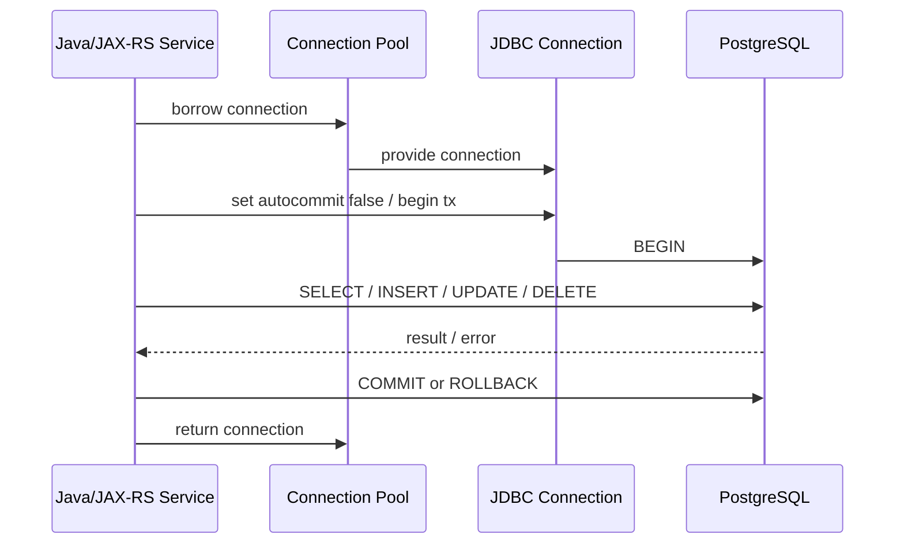

# Part 006 — Transactions and MVCC

## 1. Posisi Part Ini Dalam Seri

Part sebelumnya membahas CPQ/order data modelling: quote, order, catalog, price, approval, history, snapshot, dan outbox.

Sekarang kita masuk ke fondasi yang membuat perubahan data di PostgreSQL aman di tengah concurrency: **transaction** dan **MVCC**.

Dalam backend Java/JAX-RS, transaction bukan detail teknis kecil. Transaction menentukan apakah operasi bisnis terjadi secara utuh, terlihat konsisten, dan aman dari race condition.

Contoh command bisnis:

```text
Submit quote
  -> validate quote status
  -> validate quote items
  -> freeze price snapshot
  -> change quote status
  -> insert state transition history
  -> insert outbox event
```

Semua step itu harus dianggap satu perubahan bisnis atomik.

Jika sebagian berhasil dan sebagian gagal, sistem bisa masuk state yang sulit diperbaiki:

- quote status berubah tetapi history tidak ada,
- order dibuat tetapi event tidak terkirim,
- approval tersimpan tetapi quote sudah berubah,
- stock/resource reserved tetapi transaction rollback,
- user retry menghasilkan duplicate order.

> Prinsip utama: transaction boundary adalah batas correctness. Jangan membiarkan business invariant penting tersebar di beberapa commit tanpa desain consistency yang jelas.

---

## 2. Transaction Mental Model

Transaction adalah unit kerja database yang diperlakukan sebagai satu kesatuan.

Secara konseptual:

```text
BEGIN
  read data
  validate state
  write data
  insert history
  insert event/outbox
COMMIT
```

Jika gagal:

```text
BEGIN
  read data
  write partial data
  error occurs
ROLLBACK
```

Setelah rollback, perubahan dalam transaction tidak terlihat sebagai committed state.

Untuk backend engineer, transaction menjawab pertanyaan:

- Apa saja perubahan yang harus berhasil bersama?
- Data apa yang harus dibaca secara konsisten?
- Kapan lock diambil dan dilepas?
- Kapan event boleh dibuat?
- Apa yang terjadi jika concurrent request menyentuh row yang sama?
- Error mana yang aman diretry?
- Berapa lama transaction boleh hidup?

---

## 3. ACID, Tapi Dengan Lensa Production

ACID sering dijelaskan secara akademis. Untuk production backend, gunakan lensa berikut.

### 3.1 Atomicity

Semua perubahan dalam transaction commit bersama atau rollback bersama.

Contoh:

```text
Update order status + insert order history + insert outbox event
```

Jika outbox insert gagal, status order juga harus rollback, kecuali desain secara eksplisit memperbolehkan recovery lain.

### 3.2 Consistency

Database berpindah dari satu state valid ke state valid lain.

Consistency bukan berarti database mengerti semua business rule. Database hanya menjaga invariant yang diekspresikan melalui:

- constraint,
- foreign key,
- unique key,
- check constraint,
- transaction logic,
- trigger/function jika digunakan,
- application validation di transaction boundary.

Jika rule hanya ada di dokumen atau komentar, database tidak menjaganya.

### 3.3 Isolation

Concurrent transaction tidak boleh saling mengacaukan state secara tidak terkendali.

Isolation bukan berarti semua transaction berjalan serial secara default. PostgreSQL menyediakan beberapa isolation level dengan trade-off.

### 3.4 Durability

Setelah commit sukses, perubahan harus bertahan terhadap crash sesuai durability guarantee PostgreSQL dan konfigurasi WAL/fsync/replication.

Untuk aplikasi, durability berarti jangan menganggap state berubah sebelum commit benar-benar sukses.

---

## 4. Transaction Lifecycle di PostgreSQL

Lifecycle umum:



Pada JDBC, transaction sering dikontrol melalui connection:

```java
connection.setAutoCommit(false);
try {
    // execute statements
    connection.commit();
} catch (SQLException e) {
    connection.rollback();
    throw e;
}
```

Dalam framework enterprise, ini mungkin dibungkus oleh transaction manager. Namun mental model-nya tetap sama: satu connection memegang transaction context.

---

## 5. Autocommit

Autocommit berarti setiap statement menjadi transaction sendiri.

```sql
UPDATE quote SET status = 'IN_REVIEW' WHERE id = '...';
-- auto commit

INSERT INTO quote_state_transition (...);
-- auto commit terpisah
```

Jika statement pertama sukses dan statement kedua gagal, state menjadi tidak lengkap.

Autocommit aman untuk query sederhana atau operasi tunggal, tetapi berbahaya untuk command bisnis multi-step.

### 5.1 Production Rule

Jika operasi bisnis membutuhkan lebih dari satu write yang harus konsisten, jangan bergantung pada autocommit.

Contoh operasi yang harus satu transaction:

- submit quote + insert history + insert outbox,
- approve quote + record approval decision + insert event,
- create order + order items + outbox event,
- update status + release reservation,
- idempotency key insert + command execution.

---

## 6. Commit and Rollback

### 6.1 Commit

Commit membuat perubahan transaction menjadi visible ke transaction lain.

Setelah commit:

- row baru terlihat,
- update terlihat,
- delete terlihat sebagai tidak visible untuk snapshot baru,
- lock dilepas,
- outbox row siap dibaca publisher,
- replication/WAL process melanjutkan durability/replication.

### 6.2 Rollback

Rollback membatalkan perubahan transaction.

Rollback bisa terjadi karena:

- application exception,
- SQL error,
- timeout,
- deadlock,
- serialization failure,
- connection failure,
- explicit rollback.

### 6.3 Key Application Concern

Jangan melakukan irreversible external side effect sebelum commit jika side effect tersebut bergantung pada perubahan database.

Buruk:

```text
1. update order
2. call external provisioning API
3. insert history
4. commit fails
```

External provisioning sudah terjadi, tetapi database rollback.

Lebih aman:

```text
1. update order
2. insert outbox event
3. commit
4. async publisher calls external system
```

---

## 7. Savepoint

Savepoint memungkinkan rollback sebagian dalam transaction.

```sql
BEGIN;

UPDATE quote
SET status = 'IN_REVIEW'
WHERE id = '...';

SAVEPOINT before_optional_audit;

INSERT INTO optional_audit_log (...);

-- jika audit optional gagal
ROLLBACK TO SAVEPOINT before_optional_audit;

COMMIT;
```

Savepoint berguna untuk:

- batch processing,
- partial recovery dalam migration/backfill,
- optional step yang boleh gagal,
- testing transaction behavior.

Namun jangan gunakan savepoint untuk menyembunyikan model bisnis yang tidak jelas. Jika sebuah step penting untuk correctness, failure-nya sebaiknya menggagalkan transaction.

---

## 8. MVCC Mental Model

PostgreSQL menggunakan MVCC: **Multi-Version Concurrency Control**.

Artinya update tidak langsung menimpa row lama secara sederhana. PostgreSQL menyimpan versi row sehingga reader dan writer dapat berjalan bersamaan dengan lebih baik.

Mental model sederhana:

```text
Row version A: quote status = DRAFT
Transaction T1 updates quote to IN_REVIEW
Row version B created
Row version A still visible to transaction lama
Row version B visible to transaction baru setelah commit
```

MVCC membantu:

- reader tidak selalu blocking writer,
- writer tidak selalu blocking reader,
- transaction melihat snapshot konsisten,
- rollback dapat membatalkan versi baru,
- isolation level dapat dibangun dari snapshot visibility.

Tetapi MVCC juga membawa konsekuensi:

- dead tuple,
- vacuum,
- transaction ID wraparound,
- long-running transaction menahan cleanup,
- bloat,
- visibility map,
- index entry bisa menunjuk ke tuple version yang perlu visibility check.

---

## 9. Tuple Visibility: xmin and xmax

Secara internal, tuple PostgreSQL memiliki metadata transaction seperti `xmin` dan `xmax`.

Mental model:

- `xmin`: transaction ID yang membuat tuple version,
- `xmax`: transaction ID yang menghapus/mengganti tuple version jika ada.

Sebuah transaction melihat tuple berdasarkan snapshot-nya:

- Apakah transaction pembuat tuple sudah commit?
- Apakah transaction penghapus/updater sudah commit?
- Apakah perubahan itu terjadi sebelum atau setelah snapshot transaction saat ini?

Anda tidak perlu memakai `xmin/xmax` dalam aplikasi normal. Tetapi memahami konsep ini membantu menjelaskan kenapa:

- update menghasilkan versi row baru,
- delete tidak langsung menghapus fisik,
- vacuum diperlukan,
- long transaction bisa menahan dead tuple,
- query lama bisa melihat data lama.

---

## 10. Snapshot

Snapshot adalah pandangan transaction terhadap database pada titik tertentu.

Pertanyaan yang dijawab snapshot:

```text
Transaction mana yang sudah commit dan boleh saya lihat?
Transaction mana yang masih berjalan dan harus saya abaikan?
Transaction mana yang terjadi setelah snapshot saya dan belum boleh saya lihat?
```

Snapshot behavior bergantung pada isolation level.

Di Read Committed, snapshot biasanya dibuat per statement.

Di Repeatable Read, snapshot dibuat saat transaction mulai membaca dan dipakai konsisten sepanjang transaction.

Di Serializable, PostgreSQL menambah deteksi konflik agar hasil setara dengan eksekusi serial atau gagal dengan serialization error.

---

## 11. Read Phenomena

### 11.1 Dirty Read

Dirty read terjadi jika transaction membaca data transaction lain yang belum commit.

PostgreSQL tidak mengizinkan dirty read. Bahkan jika memakai isolation level `READ UNCOMMITTED`, PostgreSQL memperlakukannya seperti `READ COMMITTED`.

### 11.2 Non-Repeatable Read

Transaction membaca row yang sama dua kali dan mendapat nilai berbeda karena transaction lain commit update di antara dua read.

Contoh di Read Committed:

```text
T1 reads quote status = DRAFT
T2 updates quote status = APPROVED and commits
T1 reads quote again = APPROVED
```

### 11.3 Phantom Read

Transaction membaca range data dua kali dan mendapat row tambahan/hilang karena transaction lain insert/delete row yang cocok.

Contoh:

```text
T1 counts active orders for account = 5
T2 inserts another active order and commits
T1 counts again = 6
```

### 11.4 Lost Update

Dua transaction membaca nilai sama, lalu update berdasarkan nilai lama sehingga salah satu update menimpa yang lain.

Contoh:

```text
T1 reads quote version 1
T2 reads quote version 1
T1 updates amount to 100
T2 updates amount to 120
T2 overwrites T1 without conflict handling
```

Optimistic locking atau row lock dapat mencegah ini.

### 11.5 Write Skew

Dua transaction membaca kondisi global yang sama, lalu masing-masing menulis row berbeda sehingga invariant global rusak.

Contoh konseptual:

```text
Rule: at least one approver must remain active.
T1 sees approver A and B active, disables A.
T2 sees approver A and B active, disables B.
Both commit.
No approver remains active.
```

Serializable isolation atau explicit locking/constraint design dapat diperlukan.

---

## 12. PostgreSQL Isolation Levels

PostgreSQL mendukung beberapa isolation level penting:

- Read Committed,
- Repeatable Read,
- Serializable.

`Read Uncommitted` secara praktis berperilaku seperti Read Committed di PostgreSQL.

### 12.1 Read Committed

Read Committed adalah default yang umum.

Karakteristik:

- setiap statement melihat snapshot baru,
- tidak melihat uncommitted data,
- dapat melihat perubahan committed dari transaction lain antar statement,
- cocok untuk banyak operasi OLTP biasa,
- tetap membutuhkan locking/versioning untuk update correctness.

Contoh risiko:

```text
Statement 1: cek quote masih DRAFT
Transaction lain approve quote
Statement 2: update quote berdasarkan asumsi lama
```

Jika update tidak menyertakan predicate status/version, bug bisa terjadi.

### 12.2 Repeatable Read

Repeatable Read menjaga snapshot konsisten sepanjang transaction.

Karakteristik:

- read yang sama stabil dalam transaction,
- tidak melihat commit baru dari transaction lain setelah snapshot,
- dapat gagal jika concurrent update menyentuh row yang sama dengan konflik tertentu,
- cocok untuk operasi yang butuh consistent read set.

Namun Repeatable Read bukan pengganti semua invariant. Write skew masih perlu dipahami.

### 12.3 Serializable

Serializable mencoba membuat hasil concurrent transaction setara dengan eksekusi satu per satu.

Karakteristik:

- isolation paling kuat,
- dapat menggagalkan transaction dengan serialization failure,
- aplikasi harus punya retry strategy,
- cocok untuk invariant kompleks yang sulit dijaga dengan constraint/lock sederhana,
- overhead dan abort rate harus dipertimbangkan.

---

## 13. Choosing Isolation Level

Jangan menaikkan isolation level sebagai reaksi pertama terhadap bug concurrency. Sering kali solusi lebih tepat adalah:

- unique constraint,
- optimistic locking,
- `SELECT FOR UPDATE`,
- conditional update,
- idempotency key,
- advisory lock,
- better state transition predicate,
- redesign aggregate boundary.

### 13.1 Practical Heuristic

| Use Case | Starting Point |
|---|---|
| Simple read/write by primary key | Read Committed + conditional update/version |
| State transition | Read Committed + row lock or optimistic version |
| Unique creation | Unique constraint + handle conflict |
| Financial/commercial invariant | Constraint/lock carefully; consider Serializable if needed |
| Complex multi-row invariant | Serializable or explicit lock strategy |
| Reporting consistent snapshot | Repeatable Read or replica/snapshot export depending need |
| Backfill | Short transactions with batching, not one huge transaction |

---

## 14. Transaction Boundary in Java/JAX-RS

Transaction boundary sebaiknya berada di service layer, bukan resource/controller dan bukan mapper.

```text
JAX-RS Resource
  -> parse request
  -> authenticate/authorize
  -> call service command
       -> transaction begins
       -> database reads/writes
       -> outbox/history writes
       -> transaction commits
  -> map result to HTTP response
```

### 14.1 Why Not Resource Layer?

Jika transaction dibuka terlalu awal di resource layer:

- transaction hidup selama request parsing/validation,
- bisa mencakup remote API call,
- bisa mencakup serialization response,
- lock ditahan terlalu lama,
- connection pool lebih cepat habis.

### 14.2 Why Not Mapper Layer?

Jika setiap mapper method membuka transaction sendiri:

- business command multi-step tidak atomic,
- history/outbox bisa terpisah commit,
- rollback tidak konsisten,
- service tidak punya kontrol isolation/retry.

### 14.3 Good Boundary

Service method command biasanya boundary yang baik:

```text
submitQuote(command)
approveQuote(command)
createOrderFromQuote(command)
cancelOrder(command)
retryFulfillment(command)
```

Bukan:

```text
updateQuoteTable(row)
insertHistory(row)
insertOutbox(row)
```

---

## 15. Example: Submit Quote Transaction

Contoh konseptual:

```sql
BEGIN;

SELECT id, status, version
FROM quote
WHERE tenant_id = :tenant_id
  AND id = :quote_id
FOR UPDATE;

-- application validates status = DRAFT
-- application validates quote items and pricing readiness

UPDATE quote
SET status = 'IN_REVIEW',
    version = version + 1,
    submitted_at = now(),
    updated_at = now()
WHERE tenant_id = :tenant_id
  AND id = :quote_id
  AND status = 'DRAFT';

INSERT INTO quote_state_transition (
    id, quote_id, from_status, to_status, actor_id, changed_at, correlation_id
) VALUES (
    gen_random_uuid(), :quote_id, 'DRAFT', 'IN_REVIEW', :actor_id, now(), :correlation_id
);

INSERT INTO outbox_event (
    id, aggregate_type, aggregate_id, event_type, event_version, payload, status, created_at, correlation_id
) VALUES (
    gen_random_uuid(), 'QUOTE', :quote_id, 'QUOTE_SUBMITTED', 1, :payload::jsonb, 'PENDING', now(), :correlation_id
);

COMMIT;
```

Key points:

- row dikunci atau update dilakukan conditional,
- transition validasi terjadi sebelum update,
- history dan outbox satu transaction,
- correlation ID disimpan,
- commit adalah titik publikasi state internal.

---

## 16. Optimistic Locking

Optimistic locking cocok jika conflict relatif jarang dan aplikasi bisa mendeteksi perubahan concurrent.

Pattern umum:

```sql
UPDATE quote
SET status = 'IN_REVIEW',
    version = version + 1,
    updated_at = now()
WHERE id = :quote_id
  AND tenant_id = :tenant_id
  AND version = :expected_version
  AND status = 'DRAFT';
```

Jika affected rows = 0:

- quote tidak ada,
- tenant salah,
- version conflict,
- status sudah berubah,
- command tidak valid lagi.

Aplikasi harus membedakan kemungkinan tersebut jika domain/API membutuhkan error detail.

### 16.1 Benefit

- Tidak perlu lock sejak awal.
- Cocok untuk UI edit form.
- Konflik terlihat jelas.
- Bisa map ke HTTP 409 Conflict.

### 16.2 Risk

- Semua update harus disiplin memakai version predicate.
- Bulk update bisa melewati version rule.
- Mapper generic update mudah membuat bug.
- Conflict handling harus jelas.

---

## 17. Pessimistic Locking

Pessimistic locking cocok jika conflict mungkin sering atau jika operasi harus mencegah perubahan concurrent selama validasi.

```sql
SELECT id, status, version
FROM quote
WHERE id = :quote_id
  AND tenant_id = :tenant_id
FOR UPDATE;
```

Lock row akan ditahan sampai commit/rollback.

### 17.1 Benefit

- Mencegah concurrent update pada row yang sama.
- Cocok untuk state transition penting.
- Reasoning lebih sederhana untuk single-row aggregate.

### 17.2 Risk

- Lock wait.
- Deadlock jika urutan lock tidak konsisten.
- Transaction panjang memperburuk contention.
- Endpoint HTTP bisa lambat jika menunggu lock.

### 17.3 NOWAIT and SKIP LOCKED

Untuk beberapa use case:

```sql
SELECT ... FOR UPDATE NOWAIT;
```

Gagal langsung jika row terkunci.

```sql
SELECT ... FOR UPDATE SKIP LOCKED;
```

Lewati row terkunci, berguna untuk job queue/worker pattern.

Detail locking akan dibahas lebih dalam di part berikutnya.

---

## 18. Unique Constraint Race

Application-level check tidak cukup untuk uniqueness.

Buruk:

```text
1. SELECT count(*) WHERE quote_number = X
2. Jika 0, INSERT quote_number X
```

Dua transaction bisa sama-sama melihat 0 lalu insert duplicate jika tidak ada unique constraint.

Benar:

```sql
ALTER TABLE quote
ADD CONSTRAINT uq_quote_tenant_number
UNIQUE (tenant_id, quote_number);
```

Lalu handle unique violation.

Atau gunakan UPSERT jika semantics sesuai:

```sql
INSERT INTO idempotency_key (tenant_id, key, request_hash, created_at)
VALUES (:tenant_id, :key, :request_hash, now())
ON CONFLICT (tenant_id, key) DO NOTHING;
```

Unique constraint adalah concurrency primitive, bukan hanya data hygiene.

---

## 19. Serialization Failure

Serialization failure terjadi ketika PostgreSQL tidak dapat mempertahankan serializable execution untuk transaction concurrent.

Aplikasi harus menganggap serialization failure sebagai error yang mungkin retryable.

SQLSTATE yang umum untuk serialization failure: `40001`.

Deadlock biasanya `40P01`.

Unique violation biasanya `23505`.

Foreign key violation biasanya `23503`.

Check violation biasanya `23514`.

Not-null violation biasanya `23502`.

### 19.1 Retry Strategy

Retry harus dilakukan pada level transaction command, bukan hanya statement terakhir.

Benar:

```text
retry submitQuote(command):
  begin transaction
  load current state
  validate
  update
  insert history
  insert outbox
  commit
```

Salah:

```text
retry only failed UPDATE inside a half-mutated transaction
```

### 19.2 Retry Requirements

Aman retry jika:

- command idempotent atau punya idempotency key,
- external side effect tidak dilakukan sebelum commit,
- transaction function bisa dieksekusi ulang dari awal,
- error class benar-benar retryable,
- ada max retry dan backoff,
- log/correlation ID jelas.

---

## 20. Transaction Timeout and Statement Timeout

Transaction yang terlalu lama buruk untuk PostgreSQL.

Dampak:

- lock ditahan lama,
- connection pool terpakai lama,
- vacuum cleanup tertahan,
- dead tuple menumpuk,
- replication lag bisa meningkat,
- user request menggantung,
- incident sulit ditangani.

Timeout penting:

- statement timeout,
- lock timeout,
- idle-in-transaction timeout,
- connection pool timeout,
- HTTP request timeout,
- job timeout.

Timeout harus konsisten. Jangan sampai HTTP timeout 30 detik, tetapi query masih jalan 10 menit di database.

---

## 21. Long-Running Transaction

Long transaction adalah salah satu sumber masalah PostgreSQL yang sering diremehkan.

Contoh penyebab:

- endpoint membuka transaction lalu memanggil remote service,
- streaming result besar dalam transaction,
- batch job memproses jutaan row dalam satu transaction,
- developer console membuka transaction dan lupa commit,
- migration besar tanpa batching,
- report query memakai repeatable read lama.

### 21.1 Production Impact

- Vacuum tidak bisa membersihkan tuple lama.
- Bloat bertambah.
- Lock bisa tertahan.
- Connection pool habis.
- Replica lag bisa memburuk.
- Query lain terkena wait.

### 21.2 Detection

Cari sinyal seperti:

```sql
SELECT pid,
       state,
       now() - xact_start AS transaction_age,
       wait_event_type,
       wait_event,
       query
FROM pg_stat_activity
WHERE xact_start IS NOT NULL
ORDER BY transaction_age DESC;
```

Query diagnosis harus disesuaikan dengan permission dan environment internal.

---

## 22. Idle in Transaction

`idle in transaction` berarti connection sedang berada dalam transaction terbuka tetapi tidak sedang menjalankan query.

Ini berbahaya karena:

- transaction tetap aktif,
- snapshot tetap menahan vacuum,
- lock mungkin masih dipegang,
- connection pool slot tidak kembali,
- state aplikasi mungkin sudah tidak jelas.

Penyebab umum:

- exception tidak rollback,
- connection tidak ditutup/dikembalikan,
- manual transaction salah,
- debugging session,
- framework transaction tidak dikonfigurasi benar.

### 22.1 Java/JDBC Concern

Pastikan:

- connection selalu ditutup/returned,
- rollback dipanggil saat exception,
- transaction manager meng-handle error,
- mapper tidak menyimpan connection/session terlalu lama,
- streaming result tidak membiarkan transaction terbuka tanpa batas.

---

## 23. MyBatis Transaction Integration

MyBatis dapat dipakai dengan beberapa model transaction:

- manual SqlSession transaction,
- framework-managed transaction,
- container-managed transaction,
- Spring transaction jika stack memakai Spring,
- custom transaction manager.

Yang harus dipahami:

- Satu transaction harus menggunakan connection yang sama.
- Mapper call dalam satu command harus ikut transaction yang sama.
- Commit/rollback harus dikelola oleh satu layer.
- Batch executor punya failure behavior yang harus dipahami.
- SQL exception harus dipetakan dengan benar.

### 23.1 Anti-Pattern

```text
service method
  -> mapperA.update() commits
  -> mapperB.insertHistory() commits
  -> mapperC.insertOutbox() fails
```

Ini bukan satu business transaction.

### 23.2 Better Pattern

```text
transaction manager begins
  -> mapperA.update()
  -> mapperB.insertHistory()
  -> mapperC.insertOutbox()
transaction manager commits
```

---

## 24. Event-Driven Architecture Impact

Transaction dan event adalah area rawan.

### 24.1 Wrong Pattern: Commit Then Publish Inline

```text
BEGIN
  update order
COMMIT
publish Kafka event
```

Jika publish gagal, database sudah berubah tetapi event hilang.

### 24.2 Wrong Pattern: Publish Before Commit

```text
BEGIN
  update order
publish Kafka event
COMMIT fails
```

Event terkirim untuk perubahan yang tidak committed.

### 24.3 Safer Pattern: Transactional Outbox

```text
BEGIN
  update order
  insert outbox event
COMMIT
publisher sends event later
```

Ini tidak membuat distributed transaction magic. Ini hanya membuat database state dan event-intent atomic.

Consumer tetap harus idempotent karena event bisa duplicate.

---

## 25. Microservices Impact

Dalam microservices, transaction biasanya hanya lokal ke database milik service.

Jangan menganggap transaction PostgreSQL bisa menjaga invariant lintas service.

Contoh:

```text
Quote service commits quote approved.
Order service eventually creates order.
Billing service eventually receives order event.
Fulfillment service eventually provisions service.
```

Consistency lintas service dijaga oleh:

- event,
- saga,
- compensation,
- idempotency,
- reconciliation,
- timeout handling,
- status model yang mengakui intermediate state.

### 25.1 Distributed Transaction Avoidance

Two-phase commit jarang menjadi default pilihan di microservices modern karena operational complexity. Namun konsekuensinya adalah desain harus menerima eventual consistency secara eksplisit.

Database transaction tetap penting, tetapi boundary-nya lokal.

---

## 26. Kubernetes and Cloud Impact

Transaction behavior juga terpengaruh deployment.

### 26.1 Kubernetes Replica Count

Jika service memiliki banyak pod, concurrent transaction meningkat.

Contoh:

```text
20 pods x 20 pool connections = 400 potential DB connections
```

Dampak:

- lock contention meningkat,
- connection pressure meningkat,
- deadlock probability meningkat,
- hot row makin panas,
- retry storm mungkin terjadi.

### 26.2 Pod Termination

Jika pod terminated saat transaction berjalan:

- connection putus,
- transaction biasanya rollback,
- external side effect yang sudah dilakukan bisa tidak rollback,
- client mungkin retry,
- idempotency menjadi penting.

### 26.3 Managed Database Failover

Saat failover:

- connection putus,
- in-flight transaction gagal,
- aplikasi harus reconnect,
- pool harus recover,
- command mungkin perlu retry,
- idempotency key mencegah duplicate effect.

---

## 27. Failure Modes

| Failure | Root Cause | Symptom | Prevention/Debugging |
|---|---|---|---|
| Partial business state | Multi-step operation tidak satu transaction | Status berubah tanpa history/event | Cek transaction boundary service |
| Lost update | Update tanpa version/lock | Perubahan user tertimpa | Optimistic locking/SELECT FOR UPDATE |
| Duplicate command effect | Retry tanpa idempotency | Duplicate order/payment/provisioning | Unique idempotency key |
| Long transaction | Remote call/batch/report dalam tx | Vacuum tertahan, locks, pool exhaustion | Batasi transaction scope |
| Idle in transaction | Exception tidak rollback/close | pg_stat_activity idle in transaction | Transaction manager/resource handling |
| Serialization failure unhandled | Serializable conflict | 40001 error ke user | Retry whole transaction |
| Deadlock | Lock order tidak konsisten | 40P01 error | Consistent lock ordering, shorter tx |
| Event missing | Publish tidak atomic dengan DB | Downstream inconsistent | Transactional outbox |
| Event for rolled-back data | Publish before commit | Consumer melihat state yang tidak ada | Publish after outbox commit |
| Retry storm | Semua pod retry cepat | Load spike | Backoff, jitter, max retry |

---

## 28. Detection and Debugging

### 28.1 Find Long Transactions

```sql
SELECT pid,
       usename,
       application_name,
       state,
       now() - xact_start AS xact_age,
       wait_event_type,
       wait_event,
       left(query, 500) AS query_sample
FROM pg_stat_activity
WHERE xact_start IS NOT NULL
ORDER BY xact_age DESC;
```

### 28.2 Find Idle in Transaction

```sql
SELECT pid,
       usename,
       application_name,
       now() - xact_start AS xact_age,
       now() - state_change AS idle_age,
       left(query, 500) AS query_sample
FROM pg_stat_activity
WHERE state = 'idle in transaction'
ORDER BY xact_start ASC;
```

### 28.3 Detect Lock Wait

```sql
SELECT pid,
       wait_event_type,
       wait_event,
       now() - query_start AS query_age,
       left(query, 500) AS query_sample
FROM pg_stat_activity
WHERE wait_event_type = 'Lock'
ORDER BY query_start ASC;
```

### 28.4 Application Logs

Pastikan log memiliki:

- request ID,
- correlation ID,
- command name,
- aggregate ID,
- transaction retry count,
- SQLState,
- elapsed time,
- affected row count,
- idempotency key jika ada.

Tanpa ini, debugging transaction failure sulit.

---

## 29. Transaction Design Checklist

Untuk setiap service command, jawab:

### Boundary

- Apa awal dan akhir transaction?
- Apakah transaction terlalu luas?
- Apakah ada remote call di dalam transaction?
- Apakah ada file/network operation di dalam transaction?
- Apakah response serialization terjadi setelah commit?

### Reads

- Data apa yang dibaca?
- Apakah read perlu lock?
- Apakah read perlu snapshot konsisten?
- Apakah read bisa stale?
- Apakah tenant/access predicate ada?

### Writes

- Row apa yang diinsert/update/delete?
- Apakah update conditional berdasarkan status/version?
- Apakah affected row count dicek?
- Apakah history/outbox ikut transaction?
- Apakah constraint mendukung invariant?

### Concurrency

- Apa yang terjadi jika dua request sama datang bersamaan?
- Apa yang terjadi jika user retry?
- Apa yang terjadi jika pod crash?
- Apa yang terjadi jika failover database?
- Error mana yang diretry?

### Observability

- Apakah SQLState dilog?
- Apakah transaction duration terlihat?
- Apakah lock wait terlihat?
- Apakah retry count terlihat?
- Apakah correlation ID tersimpan di history/outbox?

---

## 30. Transaction PR Review Checklist

Saat mereview PR yang mengubah transaction-sensitive code:

- Apakah service method jelas sebagai command boundary?
- Apakah semua write yang harus atomic berada dalam satu transaction?
- Apakah outbox/history berada dalam transaction yang sama?
- Apakah update memakai status/version predicate?
- Apakah affected row count dicek?
- Apakah unique constraint dipakai untuk race uniqueness?
- Apakah isolation level default cukup?
- Apakah ada retry untuk serialization/deadlock jika diperlukan?
- Apakah retry menjalankan ulang whole transaction?
- Apakah idempotency key digunakan untuk command yang bisa diretry client?
- Apakah transaction tidak mencakup remote call?
- Apakah long-running batch memakai chunking?
- Apakah timeout dikonfigurasi?
- Apakah SQLState dipetakan ke domain/API error?
- Apakah test mencakup concurrent update?

---

## 31. Internal Verification Checklist

Cek hal berikut di internal CSG/team.

### Java/JAX-RS Transaction Boundary

- Layer mana yang membuka transaction.
- Apakah resource/controller pernah membuka transaction langsung.
- Apakah service method menjadi command boundary.
- Apakah ada remote call dalam transaction.
- Apakah ada streaming response dalam transaction.

### JDBC/MyBatis Configuration

- Autocommit default.
- Transaction manager yang digunakan.
- SqlSession lifecycle.
- Executor type MyBatis.
- Exception translation/mapping.
- SQLState handling.

### Database Configuration

- Default isolation level.
- statement_timeout.
- lock_timeout.
- idle_in_transaction_session_timeout.
- deadlock_timeout jika dapat dicek.
- max transaction duration dashboard.

### Domain Commands

- Submit quote transaction.
- Approve/reject quote transaction.
- Convert quote to order transaction.
- Cancel order transaction.
- Retry fulfillment transaction.
- Backfill/migration transaction chunking.

### Concurrency Control

- Optimistic version columns.
- SELECT FOR UPDATE usage.
- Unique idempotency key table.
- Unique business identifier constraint.
- Retry policy for `40001` and `40P01`.
- Deadlock incident notes.

### Event Consistency

- Outbox table/pattern.
- Whether event insert is same transaction as state change.
- Publisher retry behavior.
- Consumer idempotency.
- Reconciliation process.

### Observability

- pg_stat_activity dashboard.
- Long transaction alert.
- Idle-in-transaction alert.
- Lock wait alert.
- Transaction retry metrics.
- SQLState logging.

---

## 32. Senior Engineer Heuristics

1. Transaction boundary should follow business command boundary.
2. Do not hold transaction while waiting for remote systems.
3. Every state transition update should be conditional or locked.
4. Unique constraint is a concurrency tool.
5. Retry must rerun the whole transaction, not the last statement only.
6. Outbox event must be written in the same transaction as the state change.
7. Long transaction is a production smell unless intentionally designed.
8. Idle in transaction is almost always a bug or operational hazard.
9. Read Committed is fine for many systems, but only with explicit concurrency control.
10. Serializable without retry is broken design.
11. Affected row count is part of correctness, not optional plumbing.
12. If you cannot explain what happens on duplicate request, the command is not production-ready.

---

## 33. Ringkasan

Transaction dan MVCC adalah fondasi correctness PostgreSQL di sistem enterprise.

Setelah part ini, Anda harus mampu:

- menjelaskan ACID dengan lensa production,
- memahami transaction lifecycle dari Java/JAX-RS ke JDBC/MyBatis ke PostgreSQL,
- membedakan autocommit, explicit transaction, commit, rollback, dan savepoint,
- memahami MVCC, tuple visibility, snapshot, xmin/xmax secara mental model,
- mengenali dirty read, non-repeatable read, phantom read, lost update, dan write skew,
- memilih isolation level dengan sadar,
- mendesain optimistic/pessimistic concurrency control,
- menangani serialization failure dan deadlock dengan retry strategy yang benar,
- menjaga outbox/event consistency,
- mendeteksi long transaction, idle in transaction, lock wait, dan transaction leak,
- mereview PR yang mengubah transaction-sensitive code.

Part berikutnya akan masuk lebih dalam ke **Locking and Concurrency Control**, termasuk row lock, table lock, lock modes, SELECT FOR UPDATE, SKIP LOCKED, NOWAIT, advisory lock, deadlock diagnosis, dan locking PR review checklist.
