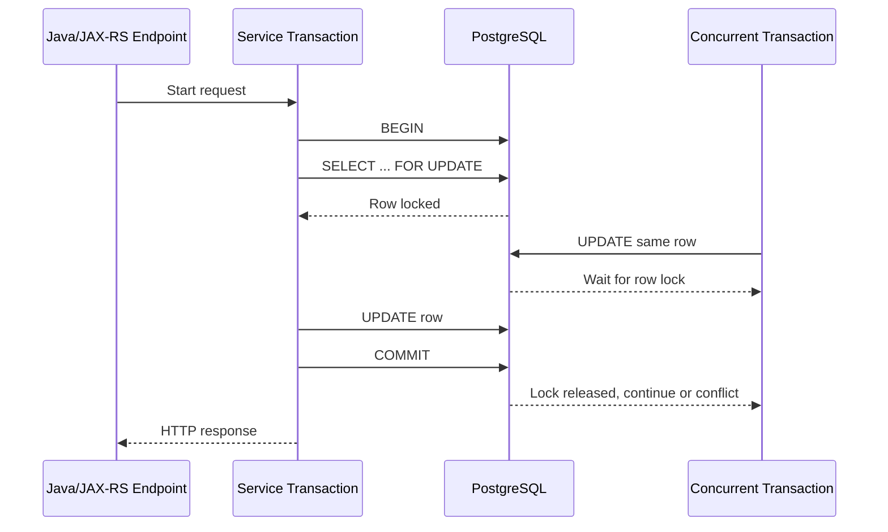
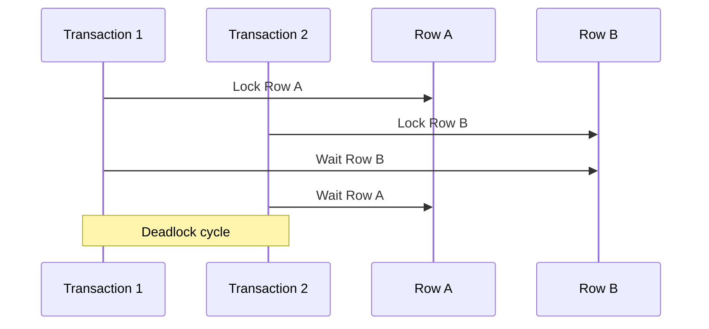

# Part 007 — PostgreSQL Locking and Concurrency Control

Locking adalah mekanisme PostgreSQL untuk menjaga correctness saat banyak transaksi membaca dan menulis data yang sama. MVCC membuat banyak read tidak perlu memblokir write, tetapi bukan berarti sistem bebas lock. Begitu ada update, delete, constraint validation, schema change, `SELECT FOR UPDATE`, unique key race, queue worker, migration, atau long transaction, locking menjadi faktor utama correctness dan production incident.

Untuk senior backend engineer, targetnya bukan menghafal semua lock mode. Targetnya adalah mampu menjawab:

- transaksi mana memegang lock apa;
- transaksi mana menunggu siapa;
- apakah wait ini normal, bug, atau incident;
- apakah retry aman;
- apakah query perlu `FOR UPDATE`, optimistic locking, unique constraint, advisory lock, atau desain ulang;
- apakah perubahan schema/query/migration akan memblokir traffic production.

Dalam aplikasi Java/JAX-RS, locking biasanya muncul dari jalur:

```text
HTTP request
  -> resource/controller
  -> service method
  -> transaction boundary
  -> MyBatis mapper/JDBC PreparedStatement
  -> PostgreSQL executor
  -> row/table/index/constraint lock
  -> commit/rollback
```

Jika service method terlalu panjang, lock juga hidup terlalu lama. Jika endpoint memanggil external service di tengah transaksi, lock ikut menunggu network. Jika batch job memproses ribuan row dalam satu transaksi, lock menumpuk. Jika migration membuat lock kuat saat traffic aktif, aplikasi bisa terlihat "hang" walaupun database tidak down.

---

## 1. Core mental model

PostgreSQL concurrency harus dipikirkan sebagai kombinasi dari empat hal:

1. **MVCC visibility** — transaksi melihat snapshot tertentu.
2. **Row-level conflict** — transaksi yang mengubah row yang sama harus diserialkan.
3. **Table/object lock** — operasi DDL, vacuum tertentu, dan beberapa command butuh lock pada relasi.
4. **Constraint/index arbitration** — unique constraint, foreign key, dan index ikut menentukan konflik concurrent write.

MVCC mengurangi blocking antara reader dan writer, tetapi tidak menghapus kebutuhan locking. Dua transaksi yang sama-sama ingin mengubah row yang sama tetap harus berurutan. Dua transaksi yang sama-sama ingin membuat nilai unique yang sama tetap harus diselesaikan oleh constraint/index. Migration yang mengubah struktur tabel tetap butuh lock objek.

### Rule of thumb

| Situation | Common concurrency boundary |
|---|---|
| Update satu row yang sama | Row lock |
| Insert nilai unique yang sama | Unique index/constraint conflict |
| Ambil job dari queue table | `SELECT ... FOR UPDATE SKIP LOCKED` |
| Validasi state sebelum update | Optimistic version atau `FOR UPDATE` |
| Prevent duplicate API command | Unique constraint pada idempotency key |
| Koordinasi lintas row/tabel | Advisory lock atau redesign invariant |
| Schema migration | Table/object lock |
| Serializable anomaly | Serialization failure + retry |

---

## 2. Lock lifecycle

Lock tidak berdiri sendiri. Lock hidup di dalam lifecycle transaksi.



Lock biasanya dilepas saat transaksi `COMMIT` atau `ROLLBACK`. Semakin lama transaksi hidup, semakin lama lock hidup. Ini alasan utama kenapa service-layer transaction harus pendek.

### Dangerous lifecycle

```text
BEGIN
SELECT ... FOR UPDATE
call external pricing service over HTTP
call another service over Kafka/RPC
perform business validation
UPDATE
COMMIT
```

Masalahnya bukan hanya query. Masalahnya adalah lock dipegang saat aplikasi menunggu network, retry, remote timeout, atau user-level computation. Ini membuat lock duration tidak lagi dikontrol database, tetapi dikontrol latency sistem lain.

---

## 3. Table locks

Table lock melindungi struktur dan operasi tertentu terhadap tabel. DDL seperti `ALTER TABLE`, `DROP TABLE`, `CREATE INDEX` non-concurrent, beberapa bentuk constraint operation, dan maintenance command dapat mengambil lock yang berdampak besar.

Backend engineer tidak harus menghafal semua nama mode lock untuk mulai efektif, tetapi harus paham spektrumnya:

- lock ringan memungkinkan operasi lain tetap berjalan;
- lock kuat bisa memblokir read/write;
- beberapa DDL terlihat kecil tetapi butuh lock yang menyebabkan request production menunggu;
- lock yang menunggu juga bisa membentuk antrean sehingga query normal ikut tertahan di belakang DDL.

### Example: risky migration

```sql
ALTER TABLE quote_item
ADD COLUMN calculated_price numeric(18, 2) NOT NULL DEFAULT 0;
```

Pada PostgreSQL modern, beberapa `ADD COLUMN DEFAULT` sudah lebih murah dibanding versi lama, tetapi bukan berarti semua DDL aman. `NOT NULL`, validasi constraint, rewrite table, index creation, dan FK validation tetap perlu dipahami berdasarkan versi dan bentuk command.

### Safer migration posture

```sql
-- Step 1: add nullable column
ALTER TABLE quote_item
ADD COLUMN calculated_price numeric(18, 2);

-- Step 2: backfill in chunks outside peak traffic
-- Step 3: validate application writes non-null values
-- Step 4: add constraint safely after validation strategy is clear
```

Migration safety akan dibahas lebih dalam di part migration, tetapi locking adalah alasan teknis utama kenapa expand-contract pattern penting.

---

## 4. Row locks

Row lock muncul saat row akan diubah atau sengaja dikunci. Operasi seperti `UPDATE` dan `DELETE` mengunci row yang terdampak. `SELECT` biasa tidak mengambil row lock untuk memblokir writer. `SELECT ... FOR UPDATE` mengambil row lock secara eksplisit.

### Common row-level locking clauses

| Clause | Use case umum | Catatan |
|---|---|---|
| `FOR UPDATE` | Akan mengubah row yang dibaca | Kuat; mencegah transaksi lain update/delete/lock row secara konflik |
| `FOR NO KEY UPDATE` | Update row tanpa mengubah key yang direferensikan FK | Sering cukup untuk update biasa |
| `FOR SHARE` | Membaca row dan ingin mencegah update konflik tertentu | Lebih lemah dari `FOR UPDATE` |
| `FOR KEY SHARE` | Melindungi key untuk FK relationship | Dipakai internal oleh FK checks juga |

Dalam PR review, jangan hanya bertanya "query ini benar?". Tanya:

- apakah row benar-benar perlu dikunci sebelum update;
- apakah lock scope terlalu luas;
- apakah query memakai index sehingga tidak mengunci/menunggu lebih banyak row dari yang diperlukan;
- apakah transaksi setelah lock melakukan pekerjaan non-database yang lambat;
- apakah retry behaviour jelas.

---

## 5. `SELECT FOR UPDATE`

`SELECT FOR UPDATE` digunakan saat aplikasi perlu membaca state saat ini, membuat keputusan, lalu menulis perubahan, dan tidak ingin transaksi lain mengubah row di antaranya.

### Example: quote approval transition

```sql
SELECT id, status, version
FROM quote
WHERE id = #{quoteId}
FOR UPDATE;
```

Setelah row terkunci, service bisa memvalidasi state transition:

```text
DRAFT -> SUBMITTED -> APPROVED -> ORDERED
```

Kemudian update dilakukan dalam transaksi yang sama.

```sql
UPDATE quote
SET status = 'APPROVED',
    approved_by = #{userId},
    approved_at = now(),
    version = version + 1
WHERE id = #{quoteId};
```

### Correctness benefit

Tanpa lock atau optimistic version, dua request concurrent dapat membaca status yang sama dan sama-sama merasa valid melakukan transition. Lock membuat decision dan write berada dalam critical section database.

### Failure mode

Jika endpoint approval juga memanggil service eksternal sebelum commit, row quote terkunci selama panggilan eksternal. Request lain untuk quote yang sama akan menunggu. Jika service eksternal lambat, PostgreSQL terlihat lambat padahal penyebabnya transaksi aplikasi.

---

## 6. `NOWAIT`

`NOWAIT` membuat query gagal segera jika lock tidak bisa diperoleh.

```sql
SELECT id, status
FROM quote
WHERE id = #{quoteId}
FOR UPDATE NOWAIT;
```

Ini berguna saat UX/API lebih baik menerima response konflik daripada menunggu lama.

Contoh mapping API:

| Database result | Domain interpretation | HTTP response candidate |
|---|---|---|
| Lock acquired | Proceed | 200/204 |
| Lock not available | Resource sedang diproses | 409 Conflict atau 423 Locked |
| Statement timeout | Sistem terlalu lambat | 503/504 tergantung boundary |

Gunakan `NOWAIT` jika waiting tidak bernilai. Jangan gunakan jika business flow memang harus antri.

---

## 7. `SKIP LOCKED`

`SKIP LOCKED` membuat query melewati row yang sedang terkunci. Pattern ini sangat berguna untuk worker queue berbasis tabel.

```sql
WITH picked AS (
  SELECT id
  FROM outbox_event
  WHERE status = 'READY'
  ORDER BY created_at
  LIMIT 100
  FOR UPDATE SKIP LOCKED
)
UPDATE outbox_event e
SET status = 'PROCESSING',
    locked_at = now(),
    locked_by = #{workerId}
FROM picked
WHERE e.id = picked.id
RETURNING e.*;
```

Beberapa worker bisa menjalankan query ini bersamaan. Worker tidak saling menunggu row yang sudah diambil worker lain.

### Good use cases

- outbox publisher;
- background job worker;
- retry queue;
- batch processing chunk picker;
- reconciliation worker.

### Failure modes

- row yang selalu terkunci/bermasalah bisa kelihatan seperti hilang sementara;
- `ORDER BY` tidak selalu berarti fairness sempurna saat banyak lock;
- worker crash harus ditangani dengan lease/timeout recovery;
- status `PROCESSING` perlu recovery job;
- query harus punya index yang sesuai, misalnya `(status, created_at)`.

---

## 8. Optimistic locking

Optimistic locking cocok saat konflik relatif jarang dan aplikasi tidak ingin memegang lock sejak awal.

Model umum:

```sql
ALTER TABLE quote
ADD COLUMN version bigint NOT NULL DEFAULT 0;
```

Update:

```sql
UPDATE quote
SET status = #{newStatus},
    version = version + 1,
    updated_at = now()
WHERE id = #{quoteId}
  AND version = #{expectedVersion};
```

Jika affected row = 0, artinya row tidak ditemukan atau version sudah berubah.

### Java/MyBatis interpretation

```java
int updated = quoteMapper.updateStatus(
    quoteId,
    expectedVersion,
    newStatus
);

if (updated == 0) {
    throw new ConcurrentModificationException("Quote was modified by another transaction");
}
```

### When optimistic locking fits

- user edit form;
- API update dengan `If-Match`/version;
- quote/order header update yang tidak terlalu sering konflik;
- configuration update;
- state transition dengan retry/refresh UX.

### When optimistic locking is not enough

- high-contention counter;
- queue worker;
- inventory-like limited resource;
- state transition yang harus mencegah side effect duplicate sebelum update;
- operation yang membaca banyak row dan menulis invariant lintas row.

---

## 9. Pessimistic locking

Pessimistic locking cocok saat konflik kemungkinan besar atau cost conflict terlalu mahal.

```sql
SELECT id, status, total_amount
FROM quote
WHERE id = #{quoteId}
FOR UPDATE;
```

Pola ini membuat transaksi lain menunggu sebelum membuat keputusan terhadap row yang sama.

### Trade-off

| Aspect | Optimistic | Pessimistic |
|---|---|---|
| Conflict handling | Detect at update time | Prevent during critical section |
| Waiting | Minimal until conflict | Possible lock wait |
| Throughput under low conflict | High | Good but extra lock |
| Throughput under high conflict | Many retries/failures | More predictable queueing |
| Failure mode | Lost update if missing version check | Blocking/deadlock if careless |
| Best fit | Rare conflict | Expected conflict or critical invariant |

---

## 10. Unique constraint race

Duplicate check di aplikasi tidak cukup.

Anti-pattern:

```sql
SELECT count(*)
FROM idempotency_key
WHERE tenant_id = #{tenantId}
  AND key = #{key};

-- If count = 0, then insert
INSERT INTO idempotency_key(tenant_id, key, status)
VALUES (#{tenantId}, #{key}, 'PROCESSING');
```

Dua request concurrent bisa sama-sama melihat count = 0, lalu sama-sama insert. Correctness harus ditaruh di unique constraint:

```sql
CREATE UNIQUE INDEX uq_idempotency_key_tenant_key
ON idempotency_key (tenant_id, key);
```

Lalu gunakan insert sebagai arbitration:

```sql
INSERT INTO idempotency_key(tenant_id, key, request_hash, status, created_at)
VALUES (#{tenantId}, #{key}, #{requestHash}, 'PROCESSING', now())
ON CONFLICT (tenant_id, key) DO NOTHING;
```

Jika affected row = 0, request duplicate. Aplikasi harus mengambil existing record dan memutuskan response.

### Senior rule

Jika correctness bergantung pada "tidak boleh ada dua X yang sama", pakai unique constraint/index. Jangan hanya mengandalkan pre-check di service layer.

---

## 11. Foreign key and locking

Foreign key bukan hanya dokumentasi. FK ikut memengaruhi locking dan write path.

Contoh:

```sql
ALTER TABLE quote_item
ADD CONSTRAINT fk_quote_item_quote
FOREIGN KEY (quote_id) REFERENCES quote(id);
```

Saat insert `quote_item`, PostgreSQL perlu memastikan parent `quote` ada. Saat delete/update parent key, PostgreSQL harus memastikan child relationship aman. Ini bisa memunculkan lock/wait jika transaksi lain sedang mengubah parent/child terkait.

### Failure mode umum

- delete parent lambat karena child table besar dan FK column tidak diindex;
- update parent key jarang tapi mahal;
- migration menambah FK tanpa strategi validasi aman;
- batch delete membuat lock panjang.

### PR review question

- Apakah FK column di child table punya index jika query/delete parent membutuhkannya?
- Apakah lifecycle parent-child jelas?
- Apakah cascade delete benar-benar aman secara domain?
- Apakah constraint ditambahkan dengan strategi validasi yang aman untuk tabel besar?

---

## 12. Advisory locks

Advisory lock adalah lock eksplisit berbasis angka/key yang dibuat aplikasi, bukan otomatis terkait row tertentu.

Contoh:

```sql
SELECT pg_try_advisory_xact_lock(hashtext(#{tenantId} || ':' || #{jobName}));
```

Jika hasil `true`, transaksi memegang advisory lock sampai akhir transaksi. Jika `false`, worker lain sedang memegang lock yang sama.

### Use case yang masuk akal

- memastikan hanya satu reconciliation job per tenant berjalan;
- serialisasi job maintenance tertentu;
- guard untuk proses yang tidak punya satu row natural untuk dikunci;
- lightweight leader-like coordination untuk scope kecil.

### Risiko

- tidak terlihat dari schema;
- key collision jika hashing asal-asalan;
- sulit direview kalau convention tidak jelas;
- bisa menjadi distributed lock palsu jika transaction/session lifecycle tidak dipahami;
- tidak menggantikan constraint untuk data correctness.

### Rule

Advisory lock boleh dipakai untuk coordination, bukan sebagai pengganti unique constraint, FK, atau transaction design yang benar.

---

## 13. Deadlock

Deadlock terjadi saat dua atau lebih transaksi saling menunggu lock yang dipegang satu sama lain.



Contoh penyebab klasik:

```text
Transaction 1: update quote id=1, then quote id=2
Transaction 2: update quote id=2, then quote id=1
```

Solusi umum: konsistenkan ordering lock.

```sql
SELECT id
FROM quote
WHERE id = ANY(#{quoteIds})
ORDER BY id
FOR UPDATE;
```

### Deadlock bukan sekadar error database

Deadlock adalah sinyal bahwa aplikasi punya urutan resource acquisition yang tidak konsisten. PostgreSQL akan membatalkan salah satu transaksi. Aplikasi harus menangani error dan, jika aman, retry.

Common SQLSTATE:

| SQLSTATE | Meaning | Typical handling |
|---|---|---|
| `40P01` | deadlock detected | retry jika operation idempotent |
| `40001` | serialization failure | retry transaction |
| `55P03` | lock not available | map to conflict/retry depending API |
| `23505` | unique violation | domain duplicate/idempotency handling |

---

## 14. Lock timeout vs statement timeout

Dua timeout ini sering tertukar.

| Timeout | Meaning | Use |
|---|---|---|
| `lock_timeout` | maksimum waktu menunggu lock | mencegah request/migration menggantung karena lock |
| `statement_timeout` | maksimum durasi statement total | mencegah query terlalu lama |
| transaction timeout di framework | maksimum durasi transaksi aplikasi | mencegah lock hidup terlalu lama |
| connection timeout pool | maksimum menunggu connection | mencegah thread habis menunggu pool |

Contoh setting per transaction/session:

```sql
SET LOCAL lock_timeout = '2s';
SET LOCAL statement_timeout = '30s';
```

Dalam Java, setting bisa dilakukan melalui connection initialization, transaction hook, atau eksplisit pada awal transaksi tergantung framework. Jangan mengatur global tanpa memahami dampak ke batch job, migration, report, dan maintenance.

---

## 15. Detecting lock problems

Saat sistem lambat, jangan langsung menambah index. Lock wait sering terlihat seperti slow query.

Query diagnosis dasar:

```sql
SELECT
  blocked.pid AS blocked_pid,
  blocked.query AS blocked_query,
  blocking.pid AS blocking_pid,
  blocking.query AS blocking_query,
  blocked.wait_event_type,
  blocked.wait_event
FROM pg_stat_activity blocked
JOIN pg_locks blocked_locks
  ON blocked.pid = blocked_locks.pid
JOIN pg_locks blocking_locks
  ON blocking_locks.locktype = blocked_locks.locktype
 AND blocking_locks.database IS NOT DISTINCT FROM blocked_locks.database
 AND blocking_locks.relation IS NOT DISTINCT FROM blocked_locks.relation
 AND blocking_locks.page IS NOT DISTINCT FROM blocked_locks.page
 AND blocking_locks.tuple IS NOT DISTINCT FROM blocked_locks.tuple
 AND blocking_locks.virtualxid IS NOT DISTINCT FROM blocked_locks.virtualxid
 AND blocking_locks.transactionid IS NOT DISTINCT FROM blocked_locks.transactionid
 AND blocking_locks.classid IS NOT DISTINCT FROM blocked_locks.classid
 AND blocking_locks.objid IS NOT DISTINCT FROM blocked_locks.objid
 AND blocking_locks.objsubid IS NOT DISTINCT FROM blocked_locks.objsubid
 AND blocking_locks.pid <> blocked_locks.pid
JOIN pg_stat_activity blocking
  ON blocking.pid = blocking_locks.pid
WHERE NOT blocked_locks.granted
  AND blocking_locks.granted;
```

Untuk PostgreSQL modern, function seperti `pg_blocking_pids(pid)` sering lebih praktis:

```sql
SELECT
  pid,
  usename,
  application_name,
  state,
  wait_event_type,
  wait_event,
  now() - query_start AS query_age,
  pg_blocking_pids(pid) AS blocking_pids,
  query
FROM pg_stat_activity
WHERE cardinality(pg_blocking_pids(pid)) > 0;
```

### Observability signals

- naiknya API latency tanpa CPU tinggi;
- banyak session `active` tapi wait event lock;
- banyak connection pool thread menunggu;
- migration job running lama;
- autovacuum/DDL/batch job bersamaan dengan traffic;
- deadlock error spike;
- `idle in transaction` bertahan lama.

---

## 16. Debugging workflow

Gunakan workflow berurutan, bukan random query.

### Step 1: classify symptom

```text
Is it slow query, lock wait, pool exhaustion, CPU saturation, IO saturation, or application thread starvation?
```

### Step 2: identify blocked session

Cek `pg_stat_activity`, `wait_event_type`, `pg_blocking_pids`.

### Step 3: identify blocker

Cari query blocker, age, state, application_name, client_addr.

### Step 4: map to application

Gunakan:

- `application_name` JDBC;
- correlation ID jika dikirim ke session/log;
- endpoint log;
- deployment version;
- pod name jika tersedia;
- MyBatis mapper ID jika logged;
- migration job ID.

### Step 5: choose action

| Situation | Possible action |
|---|---|
| Short normal transaction | Wait/observe |
| Long idle in transaction | Terminate after escalation policy |
| Bad migration holding lock | Stop/rollback migration |
| Queue workers blocking each other | Add `SKIP LOCKED`/fix status handling |
| Hot row contention | Redesign data/update pattern |
| Deadlock spike | Fix lock ordering/retry |

### Step 6: prevent recurrence

- add timeout;
- shorten transaction;
- split batch;
- add index for lock acquisition query;
- enforce lock ordering;
- change optimistic/pessimistic strategy;
- update migration checklist;
- add dashboard/alert.

---

## 17. MyBatis patterns

### Pessimistic lock mapper

```xml
<select id="findQuoteForUpdate" resultMap="QuoteResultMap">
  SELECT id, status, version, total_amount
  FROM quote
  WHERE tenant_id = #{tenantId}
    AND id = #{quoteId}
  FOR UPDATE
</select>
```

Review questions:

- Is this mapper only called inside a transaction?
- Is the transaction short?
- Does the `WHERE` clause use an index?
- Does the caller handle timeout/deadlock?
- Is the locked row set minimal?

### Optimistic update mapper

```xml
<update id="updateQuoteStatusOptimistic">
  UPDATE quote
  SET status = #{newStatus},
      version = version + 1,
      updated_at = now()
  WHERE tenant_id = #{tenantId}
    AND id = #{quoteId}
    AND version = #{expectedVersion}
</update>
```

Review questions:

- Does caller check affected row count?
- Is version returned in read API?
- Does API expose version/ETag-like mechanism?
- Is retry or user refresh behaviour defined?

### Queue worker mapper

```xml
<select id="pickOutboxEvents" resultMap="OutboxEventResultMap">
  WITH picked AS (
    SELECT id
    FROM outbox_event
    WHERE status = 'READY'
      AND available_at <= now()
    ORDER BY available_at, id
    LIMIT #{limit}
    FOR UPDATE SKIP LOCKED
  )
  UPDATE outbox_event e
  SET status = 'PROCESSING',
      locked_by = #{workerId},
      locked_at = now()
  FROM picked
  WHERE e.id = picked.id
  RETURNING e.*
</select>
```

Review questions:

- Is there an index on `(status, available_at, id)`?
- Is stuck `PROCESSING` recovered?
- Are events idempotent?
- Is batch size bounded?
- Does worker commit before external publish or use safe outbox lifecycle?

---

## 18. Java/JAX-RS transaction boundary

Bad pattern:

```java
@Path("/quotes/{id}/approve")
public Response approve(@PathParam("id") UUID id) {
    transaction.begin();
    Quote quote = mapper.findQuoteForUpdate(id);
    PricingResult pricing = pricingClient.recalculate(quote); // network call while row is locked
    mapper.approve(id, pricing.total());
    transaction.commit();
    return Response.ok().build();
}
```

Better posture:

```java
@Path("/quotes/{id}/approve")
public Response approve(@PathParam("id") UUID id) {
    // Do external read-only work before lock if it does not depend on locked state,
    // or split into explicit phases with revalidation.
    PricingInput input = quoteReadService.loadPricingInput(id);
    PricingResult pricing = pricingClient.recalculate(input);

    approvalService.approveInShortTransaction(id, pricing);
    return Response.ok().build();
}
```

Inside `approveInShortTransaction`, re-read and validate state under lock before writing. The key is not "never call external services". The key is to avoid holding database locks across uncontrolled latency unless the business invariant absolutely requires it and the timeout budget is explicit.

---

## 19. Microservices and event-driven impact

Locking is local to one PostgreSQL database. It does not protect invariants across services unless all services share the same transaction boundary, which is usually avoided in microservices.

### Cross-service anti-pattern

```text
Service A locks quote row.
Service A calls Service B.
Service B locks account row.
Service B calls Service A or waits for event from A.
```

This can create distributed waiting that PostgreSQL cannot see as one deadlock. PostgreSQL can detect deadlock inside one database lock graph, but not logical deadlocks across HTTP/Kafka/service dependencies.

### Better pattern

- keep database lock local and short;
- publish event after commit through outbox;
- make consumers idempotent;
- use saga/compensation for cross-service workflows;
- use reconciliation for eventual consistency;
- avoid holding DB transaction while waiting for Kafka acknowledgement unless design explicitly requires it and failure modes are understood.

---

## 20. Kubernetes, cloud, and on-prem impact

Locking behaviour is PostgreSQL behaviour, but deployment affects symptoms.

### Kubernetes

- More pod replicas can multiply concurrent transactions.
- Rolling deployment can cause old and new versions to run together against same schema.
- Graceful shutdown matters: interrupted workers can leave work in `PROCESSING` if lifecycle is not transactional.
- Pool size multiplied by replicas can overload database and increase lock competition.

### AWS/Azure managed PostgreSQL

- Observability may use CloudWatch, Performance Insights, Azure Monitor, Query Store, or platform dashboards.
- Killing sessions, viewing lock queries, or changing parameters may depend on privileges.
- Read replica does not solve write lock contention on primary.
- Failover can abort transactions; retry semantics matter.

### On-prem/self-managed

- DBA/SRE may have deeper OS-level visibility.
- Lock incidents can interact with backup, maintenance, vacuum, and batch windows.
- Emergency actions must follow operational responsibility boundaries.

---

## 21. Failure modes

| Failure mode | Typical cause | Detection | Mitigation |
|---|---|---|---|
| Long lock wait | Transaction holds row/table lock too long | `pg_stat_activity`, wait event | shorten transaction, timeout, query redesign |
| Deadlock | inconsistent lock ordering | SQLSTATE `40P01`, logs | enforce ordering, retry safe transactions |
| Lost update | missing version/lock | user reports overwritten data | optimistic/pessimistic locking |
| Duplicate command | app-level duplicate check only | duplicate rows/events | unique constraint + idempotency design |
| Queue worker contention | no `SKIP LOCKED` or bad status lifecycle | worker latency, blocking | `SKIP LOCKED`, lease recovery |
| Migration blocking traffic | DDL lock during peak | blocked queries after deployment | safer migration pattern |
| Idle in transaction | connection leaked or transaction not closed | `state = idle in transaction` | fix transaction lifecycle, timeout |
| Hot row | many updates to same row/counter | lock waits on same relation/tuple | shard counter, append events, redesign invariant |

---

## 22. Correctness concerns

Ask these before approving database writes:

- What invariant must remain true under concurrent requests?
- Is invariant enforced by database constraint, lock, isolation level, or application convention?
- What happens if two identical commands arrive at the same time?
- What happens if command is retried after timeout?
- What happens if transaction commits but HTTP response fails?
- What happens if outbox publish fails after DB commit?
- Is operation idempotent?
- Does retry duplicate side effects?
- Can two state transitions race?

---

## 23. Performance concerns

Locking issue often becomes performance issue.

- Lock wait consumes request latency.
- Long transaction blocks vacuum cleanup and increases bloat risk.
- Hot row serializes throughput no matter how many pods are added.
- Missing index can make lock acquisition scan too many rows.
- Large batch transaction creates lock burst.
- DDL lock can block normal OLTP traffic.
- Queue table without proper index becomes both CPU and lock problem.

Scaling pods does not fix hot row contention. It can make it worse.

---

## 24. Security and privacy concerns

Lock diagnosis often exposes query text and parameter patterns. Be careful with:

- PII in SQL literals/logs;
- query logging level;
- who can read `pg_stat_activity`;
- emergency session termination permissions;
- audit trail for manual production intervention;
- multi-tenant data access during troubleshooting.

A senior engineer should debug with enough visibility, but avoid turning observability into privacy leakage.

---

## 25. Observability checklist

Minimum useful signals:

- active connection count;
- blocked session count;
- longest transaction age;
- idle-in-transaction count;
- deadlock count;
- lock wait time if available;
- top waiting queries;
- top blockers;
- slow query log with wait information;
- application_name/pod/version in DB sessions;
- connection pool active/idle/pending metrics;
- endpoint latency correlated with DB wait.

For Java services, set meaningful JDBC `application_name` if possible:

```text
quote-order-service:${podName}:${version}
```

This makes production diagnosis much faster.

---

## 26. PR review checklist

Use this checklist for changes involving transactions, state transition, queue processing, duplicate prevention, or migration.

### Transaction and lock scope

- Is the transaction boundary explicit?
- Are locks held only for the minimum required time?
- Is any external HTTP/Kafka/RPC call executed while a lock is held?
- Is lock acquisition query indexed?
- Does the query lock only necessary rows?

### Correctness

- Is lost update prevented?
- Is duplicate request handled by unique constraint/idempotency key?
- Is state transition safe under concurrent requests?
- Is retry safe?
- Are side effects idempotent?

### Timeout and error handling

- Are `lock_timeout`, `statement_timeout`, and transaction timeout defined?
- Are SQLSTATE `40P01`, `40001`, `55P03`, `23505` mapped correctly?
- Does API return conflict vs retryable technical error appropriately?

### Worker and queue

- Does queue picker use `FOR UPDATE SKIP LOCKED` where appropriate?
- Is stuck work recoverable?
- Is ordering/fairness requirement realistic?
- Is batch size bounded?

### Migration

- Does migration acquire strong table lock?
- Is migration safe for table size and traffic?
- Is expand-contract needed?
- Is rollback/roll-forward clear?

---

## 27. Internal verification checklist

Verify these in the actual CSG/team environment before assuming anything:

- PostgreSQL version and lock-related features available.
- Transaction framework used by Java/JAX-RS services.
- MyBatis transaction integration pattern.
- Default isolation level.
- Existing use of `SELECT FOR UPDATE`, `NOWAIT`, `SKIP LOCKED`, advisory locks.
- Existing optimistic locking/version column convention.
- SQLSTATE/error mapping policy.
- Deadlock/serialization retry policy.
- `lock_timeout`, `statement_timeout`, transaction timeout, and pool timeout configuration.
- Connection pool metrics and dashboard.
- `application_name` convention for JDBC connections.
- Existing outbox/job queue locking pattern.
- Migration tool and DDL lock safety checklist.
- Operational policy for killing blocking sessions.
- Incident notes involving deadlock, blocking, long transaction, or failed migration.
- DBA/SRE escalation path.

---

## 28. Mini exercises

### Exercise 1: diagnose lost update risk

Given this mapper:

```sql
UPDATE quote
SET status = #{status}
WHERE id = #{id};
```

Ask:

- Can two users update same quote concurrently?
- Is there a version column?
- Should this use optimistic locking?
- Is status transition validated under lock?

### Exercise 2: inspect queue worker

Given a worker query:

```sql
SELECT *
FROM outbox_event
WHERE status = 'READY'
ORDER BY created_at
LIMIT 100;
```

Ask:

- What happens with five workers?
- Can they pick same event?
- Should it use `FOR UPDATE SKIP LOCKED`?
- Is there a recovery for worker crash?

### Exercise 3: review migration

Given:

```sql
CREATE INDEX idx_quote_item_quote_id
ON quote_item(quote_id);
```

Ask:

- Is table large?
- Should it be `CREATE INDEX CONCURRENTLY`?
- How is it run by Liquibase/Flyway?
- What happens if deployment rolls back?

---

## 29. Summary

Locking is not a niche DBA topic. It is part of backend correctness. Every state transition, duplicate prevention strategy, worker queue, migration, and retry policy eventually touches concurrency control.

The senior-level posture is:

- keep transactions short;
- enforce invariants in the database where appropriate;
- use optimistic locking for rare conflicts;
- use pessimistic locking for critical sections;
- use `SKIP LOCKED` for concurrent workers;
- use unique constraints for duplicate prevention;
- set timeouts deliberately;
- observe blockers, not only slow queries;
- design retries around idempotency;
- never hold database locks across uncontrolled external latency unless consciously accepted.

---

## References

- PostgreSQL Documentation — Explicit Locking: https://www.postgresql.org/docs/current/explicit-locking.html
- PostgreSQL Documentation — SELECT locking clauses: https://www.postgresql.org/docs/current/sql-select.html
- PostgreSQL Documentation — Transaction Isolation: https://www.postgresql.org/docs/current/transaction-iso.html
- PostgreSQL Documentation — Monitoring Database Activity: https://www.postgresql.org/docs/current/monitoring-stats.html
