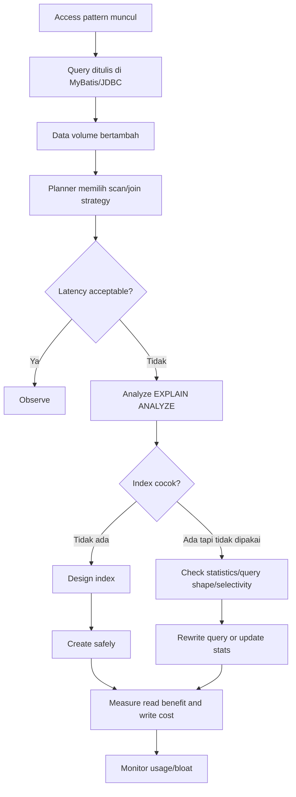

# Part 008 — PostgreSQL Indexing Fundamentals

Index adalah struktur akses yang membantu PostgreSQL menemukan row tanpa harus membaca seluruh tabel. Tetapi index bukan tombol ajaib untuk membuat database cepat. Index adalah trade-off: mempercepat sebagian read path, menambah biaya write path, memakai storage, butuh maintenance, bisa bloat, dan bisa tidak dipakai planner jika query shape/statistics tidak mendukung.

Untuk senior backend engineer, indexing harus dipahami sebagai bagian dari contract antara:

```text
API access pattern
  -> service method
  -> MyBatis SQL
  -> WHERE/JOIN/ORDER BY/GROUP BY
  -> query planner
  -> index access method
  -> heap/table visibility
  -> latency, lock duration, CPU, IO, write overhead
```

Index yang baik lahir dari query pattern nyata, bukan dari tebakan "kolom ini sering dipakai". Index yang buruk membuat write lambat, migration berisiko, disk membengkak, dan planner punya lebih banyak pilihan buruk.

---

## 1. Core mental model

Sebuah index menjawab pertanyaan:

> Dengan predicate dan ordering tertentu, apakah PostgreSQL bisa mengurangi jumlah data yang harus dibaca, disortir, atau divalidasi?

Index biasanya membantu untuk:

- mencari row berdasarkan key;
- mempercepat join;
- menegakkan uniqueness;
- mendukung ordering;
- mendukung range query;
- mendukung filter subset data;
- mendukung full-text/JSON/geospatial/similarity search melalui access method tertentu;
- menghindari heap access pada beberapa index-only scan.

Index tidak otomatis membantu jika:

- query mengambil persentase besar tabel;
- predicate tidak sesuai urutan kolom index;
- function/cast membuat index tidak cocok;
- statistics salah/stale;
- parameter generic plan membuat planner memilih plan berbeda;
- kolom memiliki cardinality rendah dan filter tidak selektif;
- query perlu sort/aggregation yang tidak didukung index order;
- index terlalu besar/bloated.

---

## 2. Index lifecycle



Index lifecycle tidak berhenti setelah `CREATE INDEX`. Index harus dipantau:

- apakah dipakai;
- apakah ukurannya membengkak;
- apakah memperlambat write;
- apakah masih sesuai query terbaru;
- apakah redundant dengan index lain;
- apakah migration/rollback aman.

---

## 3. B-tree index

B-tree adalah default index PostgreSQL dan cocok untuk mayoritas OLTP access pattern.

Common use:

```sql
CREATE INDEX idx_quote_tenant_status_created
ON quote (tenant_id, status, created_at DESC);
```

B-tree cocok untuk:

- equality lookup: `tenant_id = ?`;
- range query: `created_at >= ? AND created_at < ?`;
- ordering: `ORDER BY created_at DESC` jika sesuai index order;
- prefix composite index;
- unique constraint/index;
- primary key;
- foreign key lookup;
- keyset pagination.

### Example: API list endpoint

```sql
SELECT id, status, created_at, customer_id
FROM quote
WHERE tenant_id = #{tenantId}
  AND status = #{status}
ORDER BY created_at DESC, id DESC
LIMIT #{limit};
```

Index candidate:

```sql
CREATE INDEX idx_quote_list_by_status
ON quote (tenant_id, status, created_at DESC, id DESC);
```

Why this fits:

- `tenant_id` narrows tenant boundary;
- `status` filters list category;
- `created_at DESC, id DESC` supports stable ordering;
- `id` acts as tie-breaker.

---

## 4. Hash index

Hash index supports equality lookup. In modern PostgreSQL, hash indexes are WAL-logged, but B-tree remains the default choice for most equality lookup because it is flexible and supports more operations.

Use hash index only after verifying a specific reason. For most enterprise Java services, B-tree is the safer default.

```sql
CREATE INDEX idx_example_hash
ON some_table USING hash (some_key);
```

Review question:

- Why is B-tree not sufficient?
- Is equality-only access guaranteed?
- Is operational support comfortable with hash index?
- Has the benefit been measured?

---

## 5. GIN index

GIN is useful when one row contains multiple searchable elements. Common examples:

- JSONB containment/query;
- arrays;
- full-text search `tsvector`;
- trigram search with extension support.

Example JSONB:

```sql
CREATE INDEX idx_product_config_jsonb
ON product_config USING gin (attributes jsonb_path_ops);
```

Example full-text:

```sql
CREATE INDEX idx_product_search_vector
ON product_search USING gin (search_vector);
```

### Trade-off

GIN can be powerful but write-heavy workloads may pay a noticeable cost. GIN index can also be large. Do not add GIN to every JSONB column by default.

Ask:

- Which JSON path/operator must be accelerated?
- Is containment query common?
- How often is the JSONB column updated?
- Is a relational column or expression index better?
- Is the index size acceptable?

---

## 6. GiST index

GiST is a generalized indexing framework. It is often associated with geometric, range, full-text variants, exclusion constraints, and extension-backed use cases.

Example exclusion-like scheduling pattern:

```sql
-- Requires appropriate extension/operator class depending data type and use case.
-- This is conceptual; verify exact operator class in actual schema.
CREATE INDEX idx_validity_period_gist
ON price_validity USING gist (valid_period);
```

Use GiST when the operator class and query semantics actually require it. Do not choose GiST just because it sounds advanced.

---

## 7. SP-GiST index

SP-GiST supports space-partitioned structures. It is useful for certain data distributions and operator classes such as tries, quadtrees, and some geometric/text-like patterns depending on available operator class.

For most Java/JAX-RS OLTP systems, SP-GiST is less common than B-tree, GIN, GiST, and BRIN. Treat it as specialized: verify query operator, operator class, and measured benefit.

---

## 8. BRIN index

BRIN stores summaries for ranges of table pages. It is small and useful when physical row order correlates with indexed value.

Good candidates:

- append-only event table ordered by time;
- audit/history table;
- outbox/archive table;
- large time-series table;
- monotonically increasing id/timestamp.

Example:

```sql
CREATE INDEX idx_order_event_created_brin
ON order_event USING brin (created_at);
```

BRIN usually does not replace B-tree for selective point lookup. It helps skip large page ranges in very large tables when data is naturally clustered.

### Good fit

```sql
SELECT *
FROM order_event
WHERE created_at >= now() - interval '1 day';
```

If table is append-only and `created_at` follows insertion order, BRIN can be efficient and much smaller than B-tree.

---

## 9. Unique index and unique constraint

Uniqueness is both performance structure and correctness boundary.

```sql
CREATE UNIQUE INDEX uq_quote_tenant_quote_number
ON quote (tenant_id, quote_number);
```

or as constraint:

```sql
ALTER TABLE quote
ADD CONSTRAINT uq_quote_tenant_quote_number
UNIQUE (tenant_id, quote_number);
```

Use unique constraints/indexes for:

- idempotency key;
- natural business key;
- one active record per scope;
- duplicate prevention;
- state table invariant;
- external reference uniqueness.

### Partial unique index

```sql
CREATE UNIQUE INDEX uq_active_quote_external_ref
ON quote (tenant_id, external_reference)
WHERE deleted_at IS NULL;
```

This enforces uniqueness only among active rows. It is useful with soft delete, but must be documented because uniqueness semantics are conditional.

---

## 10. Composite index

Composite index indexes multiple columns in a specific order.

```sql
CREATE INDEX idx_quote_item_quote_line
ON quote_item (tenant_id, quote_id, line_number);
```

Order matters. A B-tree composite index is most useful from the leftmost prefix.

Index `(tenant_id, status, created_at)` can support:

```sql
WHERE tenant_id = ?
WHERE tenant_id = ? AND status = ?
WHERE tenant_id = ? AND status = ? ORDER BY created_at
```

It is less useful for:

```sql
WHERE status = ?
WHERE created_at >= ?
WHERE status = ? AND created_at >= ? -- without tenant_id
```

### Equality before range

Typical pattern:

```text
equality columns first, then range/order columns
```

Example:

```sql
CREATE INDEX idx_order_lookup
ON customer_order (tenant_id, customer_id, status, created_at DESC);
```

Where:

- `tenant_id`, `customer_id`, `status` are equality filters;
- `created_at` supports ordering/range.

This is not universal, but it is a strong default for OLTP list endpoints.

---

## 11. Covering index and INCLUDE columns

A covering index includes extra columns so query can be answered from index more often.

```sql
CREATE INDEX idx_quote_list_covering
ON quote (tenant_id, status, created_at DESC, id DESC)
INCLUDE (customer_id, total_amount);
```

The key columns drive search/order. Included columns are payload stored in index but not part of sort/search key.

### Use case

```sql
SELECT id, created_at, customer_id, total_amount
FROM quote
WHERE tenant_id = #{tenantId}
  AND status = #{status}
ORDER BY created_at DESC, id DESC
LIMIT 50;
```

If visibility conditions allow index-only scan, PostgreSQL may avoid heap access.

### Trade-off

- larger index;
- slower writes;
- more maintenance;
- included columns must be chosen carefully;
- index-only scan depends on visibility map and workload, not just index definition.

---

## 12. Index-only scan

Index-only scan means PostgreSQL can return data from index without fetching heap pages for each row, if visibility information allows.

Important nuance:

```text
Index contains the columns, but PostgreSQL still needs to know row visibility.
```

The visibility map helps PostgreSQL decide whether heap check can be skipped. Heavy updates can reduce index-only scan benefit because pages are not all-visible.

### Review question

If someone proposes a covering index, ask:

- Is the table mostly append/read, or heavily updated?
- Are selected columns stable?
- Is index size worth avoiding heap reads?
- Does `EXPLAIN (ANALYZE, BUFFERS)` show actual benefit?

---

## 13. Partial index

Partial index indexes only rows matching a predicate.

```sql
CREATE INDEX idx_outbox_ready
ON outbox_event (available_at, id)
WHERE status = 'READY';
```

This is excellent for queue/outbox tables where workers only query active subset.

Query must match predicate:

```sql
SELECT id
FROM outbox_event
WHERE status = 'READY'
  AND available_at <= now()
ORDER BY available_at, id
LIMIT 100;
```

### Good use cases

- active rows only;
- soft-delete active subset;
- pending jobs;
- unreconciled records;
- failed records needing retry;
- nullable sparse column where only non-null values are queried.

### Risk

- planner may not use partial index if query predicate does not imply index predicate;
- dynamic SQL must include the predicate consistently;
- future code may query different status set and miss index;
- hidden business semantics in index predicate.

---

## 14. Expression and functional index

Expression index indexes computed expression.

```sql
CREATE INDEX idx_customer_lower_email
ON customer (lower(email));
```

Query must use matching expression:

```sql
SELECT id
FROM customer
WHERE lower(email) = lower(#{email});
```

JSONB expression example:

```sql
CREATE INDEX idx_product_sku_from_json
ON product_config ((attributes->>'sku'));
```

Query:

```sql
SELECT id
FROM product_config
WHERE attributes->>'sku' = #{sku};
```

### Review question

- Is this expression deterministic?
- Is collation/case sensitivity understood?
- Would a real column be better?
- Is JSON path stable and governed?
- Does MyBatis SQL exactly match the expression shape?

---

## 15. Functional index and volatility

A function used in an index must be safe for indexing semantics. PostgreSQL classifies functions by volatility: immutable, stable, volatile. Index expressions require careful function choice.

Bad idea conceptually:

```sql
CREATE INDEX idx_bad_now
ON quote ((now() - created_at));
```

Time changes. Index value would become stale semantically.

Better:

```sql
CREATE INDEX idx_quote_created_at
ON quote (created_at);
```

Then query with dynamic boundary:

```sql
WHERE created_at >= now() - interval '7 days'
```

---

## 16. Sort support and ordering

Index can help avoid sort if index order matches query order.

```sql
CREATE INDEX idx_quote_created_desc
ON quote (tenant_id, created_at DESC, id DESC);
```

Query:

```sql
SELECT id, created_at
FROM quote
WHERE tenant_id = #{tenantId}
ORDER BY created_at DESC, id DESC
LIMIT 50;
```

If order is not deterministic, pagination can duplicate/skip rows when new rows arrive. Always add tie-breaker such as `id`.

Bad pagination order:

```sql
ORDER BY created_at DESC
```

Better:

```sql
ORDER BY created_at DESC, id DESC
```

---

## 17. Keyset pagination index

Offset pagination gets slower as offset grows.

```sql
SELECT id, created_at
FROM quote
WHERE tenant_id = #{tenantId}
ORDER BY created_at DESC, id DESC
LIMIT 50 OFFSET 50000;
```

Keyset pagination uses last seen key:

```sql
SELECT id, created_at
FROM quote
WHERE tenant_id = #{tenantId}
  AND (created_at, id) < (#{lastCreatedAt}, #{lastId})
ORDER BY created_at DESC, id DESC
LIMIT 50;
```

Index:

```sql
CREATE INDEX idx_quote_keyset
ON quote (tenant_id, created_at DESC, id DESC);
```

This is often critical for enterprise list APIs with large customer/order/quote history.

---

## 18. Index selectivity and cardinality

Selectivity measures how much a predicate narrows data.

High selectivity:

```sql
WHERE id = ?
WHERE tenant_id = ? AND quote_number = ?
WHERE external_reference = ?
```

Low selectivity:

```sql
WHERE status = 'ACTIVE'
WHERE is_deleted = false
WHERE tenant_id = ? -- if one tenant owns most data
```

Low-cardinality column alone often makes weak index. But low-cardinality column can be useful as part of composite or partial index.

Example:

```sql
CREATE INDEX idx_quote_tenant_status_created
ON quote (tenant_id, status, created_at DESC);
```

Here `status` alone may be weak, but combined with tenant and order-by can be useful.

---

## 19. Foreign key indexes

PostgreSQL does not automatically create an index on referencing FK columns. The referenced primary/unique key is indexed, but child FK column may need explicit index.

Example:

```sql
CREATE INDEX idx_quote_item_quote_id
ON quote_item (quote_id);
```

Why it matters:

- join from quote to quote_item;
- delete/update parent checks;
- cascade operations;
- query item by parent;
- lock duration during parent modifications.

### Review rule

For every FK, ask:

- Will child be queried by parent?
- Will parent be deleted/updated?
- Is cascade used?
- Is child table large?
- Is tenant_id also needed in index?

Often in multi-tenant systems:

```sql
CREATE INDEX idx_quote_item_tenant_quote
ON quote_item (tenant_id, quote_id);
```

---

## 20. Indexing multi-tenant data

If every query is tenant-scoped, index should usually start with `tenant_id`.

```sql
CREATE INDEX idx_order_tenant_customer_status
ON customer_order (tenant_id, customer_id, status, created_at DESC);
```

But this depends on data distribution.

If `tenant_id` has low selectivity because one tenant dominates data, planner may choose different plans. Still, tenant prefix can be important for correctness, partitioning, and access path consistency.

### Tenant indexing questions

- Is tenant_id present in every business table?
- Is tenant_id included in unique constraints?
- Are cross-tenant admin queries common?
- Does one tenant dominate data volume?
- Is row-level security used?
- Are queries always tenant-scoped in MyBatis?

---

## 21. Indexing state machines

Enterprise order/quote systems often query by lifecycle state.

```sql
SELECT id
FROM order_item
WHERE tenant_id = #{tenantId}
  AND fulfillment_status IN ('PENDING', 'RETRYABLE')
  AND next_attempt_at <= now()
ORDER BY next_attempt_at, id
LIMIT 100;
```

Possible partial index:

```sql
CREATE INDEX idx_order_item_retryable
ON order_item (tenant_id, next_attempt_at, id)
WHERE fulfillment_status IN ('PENDING', 'RETRYABLE');
```

This supports worker/retry pattern but embeds state semantics into index. It must be updated when lifecycle states evolve.

---

## 22. Indexing soft delete

Soft delete often uses `deleted_at IS NULL` or `is_deleted = false`.

```sql
CREATE INDEX idx_customer_active_email
ON customer (tenant_id, lower(email))
WHERE deleted_at IS NULL;
```

This supports active lookup and uniqueness variants.

Partial unique index:

```sql
CREATE UNIQUE INDEX uq_customer_active_email
ON customer (tenant_id, lower(email))
WHERE deleted_at IS NULL;
```

Question: should deleted record allow same email to be recreated? If yes, partial unique is sensible. If no, use non-partial unique or separate canonical identity table.

---

## 23. Indexing JSONB

There are three common approaches.

### Full JSONB GIN index

```sql
CREATE INDEX idx_product_attributes_gin
ON product USING gin (attributes);
```

Useful for broad containment queries, but can be large.

### JSONB path ops GIN

```sql
CREATE INDEX idx_product_attributes_path_gin
ON product USING gin (attributes jsonb_path_ops);
```

Can be smaller/faster for containment-style use cases, but supports fewer operator classes. Verify against actual query operators.

### Expression index on specific field

```sql
CREATE INDEX idx_product_attribute_sku
ON product ((attributes->>'sku'));
```

Best when one JSON field becomes a first-class lookup key.

Senior rule:

> If a JSONB field becomes critical for lookup, filtering, uniqueness, reporting, or joins, consider promoting it to a relational column or expression index with governance.

---

## 24. Indexing full-text search

Full-text search usually uses GIN index on `tsvector`.

```sql
CREATE INDEX idx_product_search_vector
ON product_search USING gin (search_vector);
```

Query:

```sql
SELECT product_id, ts_rank(search_vector, query) AS rank
FROM product_search, websearch_to_tsquery('english', #{term}) query
WHERE search_vector @@ query
ORDER BY rank DESC
LIMIT 20;
```

Search plus filters often needs combined strategy:

- GIN for text match;
- B-tree for tenant/status filters;
- query planner chooses combination or one primary path;
- sometimes denormalized search table is better.

Full-text search gets a dedicated part later; here the key is that GIN index supports the search vector, not arbitrary business filtering.

---

## 25. Index write overhead

Every insert/update/delete must maintain relevant indexes.

Write cost grows with:

- number of indexes on table;
- size of indexed columns;
- random write pattern;
- GIN/GiST complexity;
- update frequency of indexed columns;
- index bloat;
- WAL generation;
- replication/CDC overhead.

A table with ten indexes is not free. In OLTP systems, each new index must justify:

- read latency improvement;
- query frequency;
- endpoint/business importance;
- write overhead;
- storage cost;
- migration risk;
- maintenance cost.

---

## 26. Index bloat

Index bloat happens when index pages contain dead/unused space after updates/deletes. PostgreSQL maintenance can clean, but heavy churn can still produce large indexes.

Symptoms:

- index size much larger than expected;
- slow index scan despite index existing;
- high disk usage;
- slow vacuum/reindex needs;
- write amplification;
- cache pressure.

Mitigation options depend on environment:

- autovacuum tuning;
- reduce unnecessary indexes;
- reindex during maintenance;
- `REINDEX CONCURRENTLY` where supported and appropriate;
- `pg_repack` if allowed;
- partitioning for lifecycle/retention;
- reduce update churn on indexed columns.

Do not run maintenance commands blindly in production. Verify DBA/SRE policy.

---

## 27. CREATE INDEX and production migration

Creating an index can lock or stress production.

Basic:

```sql
CREATE INDEX idx_quote_status
ON quote (status);
```

Concurrent:

```sql
CREATE INDEX CONCURRENTLY idx_quote_status
ON quote (status);
```

`CREATE INDEX CONCURRENTLY` reduces blocking of writes but has trade-offs:

- cannot run inside a normal transaction block;
- takes longer;
- uses more resources while building;
- can leave invalid index if it fails;
- migration tool must support it carefully.

### Liquibase/Flyway caution

Many migration tools wrap migrations in transactions by default. `CREATE INDEX CONCURRENTLY` requires special handling. This must be verified in the actual migration setup.

---

## 28. Why planner may not use an index

Common reasons:

- sequential scan is cheaper for small table or broad result;
- predicate does not match index columns/order;
- function/cast mismatch;
- collation mismatch;
- stale statistics;
- low selectivity;
- parameterized prepared statement generic plan;
- partial index predicate not implied by query;
- index is bloated or expensive;
- query needs many rows then sort/aggregate anyway.

Example function mismatch:

```sql
CREATE INDEX idx_customer_email
ON customer (email);
```

Query:

```sql
WHERE lower(email) = lower(#{email})
```

The normal index on `email` may not help. Need expression index:

```sql
CREATE INDEX idx_customer_lower_email
ON customer (lower(email));
```

---

## 29. EXPLAIN-driven index workflow

Do not create index without plan evidence.

Recommended workflow:

```sql
EXPLAIN (ANALYZE, BUFFERS)
SELECT ...;
```

Look for:

- sequential scan on large table;
- rows estimate vs actual mismatch;
- filter removing many rows;
- sort spilling to disk;
- nested loop repeated many times;
- index scan with high heap fetch;
- bitmap scan combining indexes;
- query time dominated by IO;
- index condition vs filter condition.

### Key distinction

```text
Index Cond: used to navigate index
Filter: applied after rows are fetched
```

If important predicate appears only as `Filter`, index may not be doing what you think.

---

## 30. MyBatis and indexing

MyBatis dynamic SQL can accidentally defeat indexes.

### Dynamic predicate instability

```xml
<select id="searchQuotes" resultMap="QuoteResultMap">
  SELECT id, status, created_at
  FROM quote
  WHERE tenant_id = #{tenantId}
  <if test="status != null">
    AND status = #{status}
  </if>
  <if test="customerId != null">
    AND customer_id = #{customerId}
  </if>
  ORDER BY ${sortColumn} ${sortDirection}
  LIMIT #{limit}
</select>
```

Risks:

- many predicate combinations need different indexes;
- dynamic order cannot all be index-friendly;
- `${sortColumn}` is SQL injection risk unless strictly whitelisted;
- planner behaviour varies by parameter combination;
- generic API search can become unbounded query engine.

### Better posture

- define supported search shapes explicitly;
- whitelist sort fields;
- design indexes for real access paths;
- cap limit;
- use keyset pagination for large lists;
- monitor query by mapper ID if possible.

---

## 31. Indexing for CPQ/order management patterns

### Quote lookup by quote number

```sql
CREATE UNIQUE INDEX uq_quote_tenant_number
ON quote (tenant_id, quote_number);
```

### Active quote list

```sql
CREATE INDEX idx_quote_active_list
ON quote (tenant_id, status, updated_at DESC, id DESC)
WHERE deleted_at IS NULL;
```

### Quote item by quote

```sql
CREATE INDEX idx_quote_item_tenant_quote
ON quote_item (tenant_id, quote_id, line_number);
```

### Order lifecycle worker

```sql
CREATE INDEX idx_order_pending_fulfillment
ON customer_order (tenant_id, next_action_at, id)
WHERE fulfillment_status IN ('PENDING', 'RETRYABLE');
```

### Outbox publisher

```sql
CREATE INDEX idx_outbox_ready_available
ON outbox_event (available_at, id)
WHERE status = 'READY';
```

### Effective-dated pricing

```sql
CREATE INDEX idx_price_effective_lookup
ON price (tenant_id, product_offering_id, valid_from DESC, valid_to);
```

Actual design depends on query semantics, data volume, and temporal correctness rules. Treat these as patterns, not internal CSG schema claims.

---

## 32. Indexing and locking interaction

Indexes reduce how many rows PostgreSQL must inspect to find target rows. This can reduce lock duration and conflict surface.

Example bad worker query:

```sql
SELECT id
FROM outbox_event
WHERE status = 'READY'
ORDER BY available_at
LIMIT 100
FOR UPDATE SKIP LOCKED;
```

Without index on ready/available rows, PostgreSQL may scan many rows to find candidates. Under concurrency this becomes CPU + lock + IO issue.

Better:

```sql
CREATE INDEX idx_outbox_ready_available
ON outbox_event (available_at, id)
WHERE status = 'READY';
```

Indexing is not only about faster response. It can make critical sections shorter.

---

## 33. Indexing and CDC/replication

Indexes affect write amplification and WAL volume. In CDC-heavy systems using logical decoding/Debezium, extra indexes can increase:

- write cost;
- WAL generation;
- replica lag pressure;
- storage usage;
- vacuum/maintenance cost.

Indexes do not directly change logical event content, but they change the cost of producing committed changes.

Review question for event-heavy tables:

- Is table append-only?
- Are many indexes needed on outbox/event table?
- Is retention/partitioning more useful than many indexes?
- Does publisher query need one narrow partial index rather than broad indexes?

---

## 34. Kubernetes/cloud/on-prem implications

### Kubernetes

- More application replicas multiply write load and index maintenance cost.
- Rolling deployments can introduce new query shapes before index migration finishes if ordering is wrong.
- Connection pool per pod can create simultaneous query storms that stress weak indexes.

### AWS/Azure managed PostgreSQL

- Index build consumes IO/CPU credits/capacity.
- Performance dashboards can reveal top SQL and index usage.
- Some extensions/tools for bloat inspection may be limited.
- Storage autoscaling can hide index bloat cost until bill or latency rises.

### On-prem

- Maintenance windows, disk layout, IO saturation, and DBA policy matter.
- Reindex strategy may require operational coordination.
- Hardware cache and storage performance influence scan vs index trade-off.

---

## 35. Security and privacy concerns

Index can store sensitive values. If you index PII, you duplicate it into another structure.

Consider:

- email/phone/name indexes;
- expression indexes on normalized PII;
- JSONB indexes containing sensitive fields;
- audit/search indexes containing user-entered text;
- backup/snapshot exposure;
- access to index metadata and query logs.

For sensitive lookup, discuss with security/DBA whether hashing, tokenization, encryption, or application-level design is needed. Note that encrypted columns often lose normal indexability unless deterministic/tokenized strategies are used, which have their own risks.

---

## 36. Observability for indexes

Useful views:

```sql
SELECT
  schemaname,
  relname AS table_name,
  indexrelname AS index_name,
  idx_scan,
  idx_tup_read,
  idx_tup_fetch
FROM pg_stat_user_indexes
ORDER BY idx_scan ASC;
```

Potentially unused indexes need interpretation. A rarely used unique index may still enforce critical correctness.

Table/index size:

```sql
SELECT
  relname,
  pg_size_pretty(pg_relation_size(relid)) AS table_size,
  pg_size_pretty(pg_indexes_size(relid)) AS indexes_size
FROM pg_catalog.pg_statio_user_tables
ORDER BY pg_indexes_size(relid) DESC;
```

Index usage review should combine:

- query plan;
- endpoint traffic;
- correctness role;
- table size;
- write rate;
- index size;
- business criticality.

---

## 37. Failure modes

| Failure mode | Cause | Detection | Mitigation |
|---|---|---|---|
| Missing index | query pattern not indexed | slow query, seq scan large table | add measured index |
| Wrong composite order | columns ordered poorly | filter not in Index Cond | redesign index |
| Over-indexing | too many speculative indexes | slow writes, high disk/WAL | remove redundant indexes carefully |
| Unused index | old query removed | low `idx_scan` | verify correctness role, drop if safe |
| Bloated index | heavy update/delete churn | size growth, slow scans | vacuum/reindex/partition/reduce churn |
| Partial index not used | query predicate mismatch | EXPLAIN | align query predicate or index |
| Expression index mismatch | query expression differs | EXPLAIN | standardize expression |
| Index build incident | create index blocks/stresses DB | deployment incident | concurrent build/runbook/resource planning |
| Low selectivity index | boolean/status alone | planner ignores index | composite/partial index |
| Pagination degradation | offset deep pages | latency grows with offset | keyset pagination index |

---

## 38. Index design decision matrix

| Query pattern | Candidate index | Notes |
|---|---|---|
| lookup by primary id | primary key B-tree | default |
| lookup by tenant + business key | unique B-tree `(tenant_id, key)` | correctness + speed |
| list by tenant/status/time | composite B-tree `(tenant_id, status, created_at DESC, id DESC)` | supports filter/order |
| active rows only | partial index `WHERE deleted_at IS NULL` | ensure query predicate matches |
| queue ready jobs | partial B-tree on available/order columns | combine with `SKIP LOCKED` |
| JSON containment | GIN on JSONB | verify operator and write cost |
| JSON field lookup | expression B-tree | consider real column |
| full-text search | GIN on tsvector | relevance/ranking separate |
| huge append-only time table | BRIN on timestamp | small, correlation-dependent |
| case-insensitive lookup | expression index on `lower(column)` or `citext` strategy | verify collation/semantics |
| uniqueness with soft delete | partial unique index | domain semantics must be explicit |

---

## 39. PR review checklist

### Query and access pattern

- What exact query will use this index?
- Is query frequency high enough?
- Is table large enough to need it?
- Does query use equality, range, order, join, aggregation, or search?
- Does MyBatis dynamic SQL always include the indexed predicates?

### Index shape

- Are columns in correct order?
- Are equality columns before range/order columns where appropriate?
- Is tenant_id needed?
- Is tie-breaker included for pagination?
- Is it partial/expression/covering for a clear reason?

### Correctness

- Does it enforce uniqueness/invariant?
- Is partial unique predicate aligned with business rule?
- Does it interact with soft delete or temporal validity?
- Is case sensitivity/collation correct?

### Performance

- What does `EXPLAIN (ANALYZE, BUFFERS)` show before/after?
- How much write overhead is added?
- How large will the index be?
- Is index-only scan realistic?
- Could BRIN/partial index be smaller?

### Operations

- How will index be created in production?
- Is `CREATE INDEX CONCURRENTLY` needed?
- Does migration tool support it?
- What is rollback/roll-forward plan?
- How will index usage/bloat be monitored?

### Security/privacy

- Does index duplicate PII/sensitive data?
- Is search index storing user-entered sensitive text?
- Are logs/plans exposing literals?

---

## 40. Internal verification checklist

Verify these in the actual CSG/team environment:

- PostgreSQL version and supported index features.
- Existing primary key/unique/FK index convention.
- Tenant column convention and multi-tenant access pattern.
- Existing large tables and top slow queries.
- Existing unused/duplicate index reports.
- Whether `pg_stat_statements` and index stats are available.
- Migration tool support for `CREATE INDEX CONCURRENTLY`.
- DBA/SRE policy for index creation on production tables.
- Bloat monitoring and reindex policy.
- Existing JSONB/GIN/full-text indexes.
- Outbox/job queue indexes.
- MyBatis mapper query patterns and dynamic SQL shapes.
- Incident notes caused by missing index, bad index, index build, or bloat.
- Security policy for indexing PII/sensitive fields.
- Cloud/on-prem limitations around extensions and maintenance tools.

---

## 41. Mini exercises

### Exercise 1: design index for list API

Query:

```sql
SELECT id, status, created_at
FROM quote
WHERE tenant_id = #{tenantId}
  AND status = #{status}
ORDER BY created_at DESC, id DESC
LIMIT 50;
```

Propose:

```sql
CREATE INDEX idx_quote_tenant_status_created_id
ON quote (tenant_id, status, created_at DESC, id DESC);
```

Then verify with `EXPLAIN (ANALYZE, BUFFERS)`.

### Exercise 2: identify weak index

Existing index:

```sql
CREATE INDEX idx_quote_status
ON quote (status);
```

Question:

- Is `status` selective enough?
- Are queries tenant-scoped?
- Do queries also order by created_at?
- Would partial/composite index be better?

### Exercise 3: review JSONB lookup

Query:

```sql
SELECT id
FROM product_config
WHERE attributes->>'sku' = #{sku};
```

Candidate:

```sql
CREATE INDEX idx_product_config_sku
ON product_config ((attributes->>'sku'));
```

Ask:

- Is SKU stable?
- Should SKU be a real column?
- Is uniqueness required?
- Is JSON schema governed?

---

## 42. Summary

Indexing is workload design, not decoration. A good index reflects a real query, a real invariant, or a real operational need. A bad index is production debt: it slows writes, increases storage, complicates migrations, and can mislead reviewers into thinking performance is solved.

The senior-level posture is:

- start from access pattern and `EXPLAIN`, not guesswork;
- use B-tree as default for OLTP equality/range/order;
- use composite indexes with deliberate column order;
- use partial indexes for active/ready/subset patterns;
- use expression indexes when query expression is stable;
- use GIN/GiST/SP-GiST/BRIN only when access method matches data/query semantics;
- treat unique indexes as correctness boundaries;
- account for write overhead, WAL, CDC, bloat, and migration risk;
- verify usage after deployment;
- remove redundant indexes carefully, not casually.

---

## References

- PostgreSQL Documentation — Index Types: https://www.postgresql.org/docs/current/indexes-types.html
- PostgreSQL Documentation — CREATE INDEX: https://www.postgresql.org/docs/current/sql-createindex.html
- PostgreSQL Documentation — Multicolumn Indexes: https://www.postgresql.org/docs/current/indexes-multicolumn.html
- PostgreSQL Documentation — Indexes and ORDER BY: https://www.postgresql.org/docs/current/indexes-ordering.html
- PostgreSQL Documentation — Index-Only Scans and Covering Indexes: https://www.postgresql.org/docs/current/indexes-index-only-scans.html
- PostgreSQL Documentation — Partial Indexes: https://www.postgresql.org/docs/current/indexes-partial.html
- PostgreSQL Documentation — Indexes on Expressions: https://www.postgresql.org/docs/current/indexes-expressional.html
