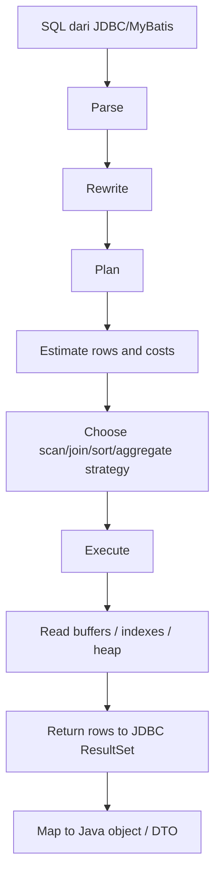
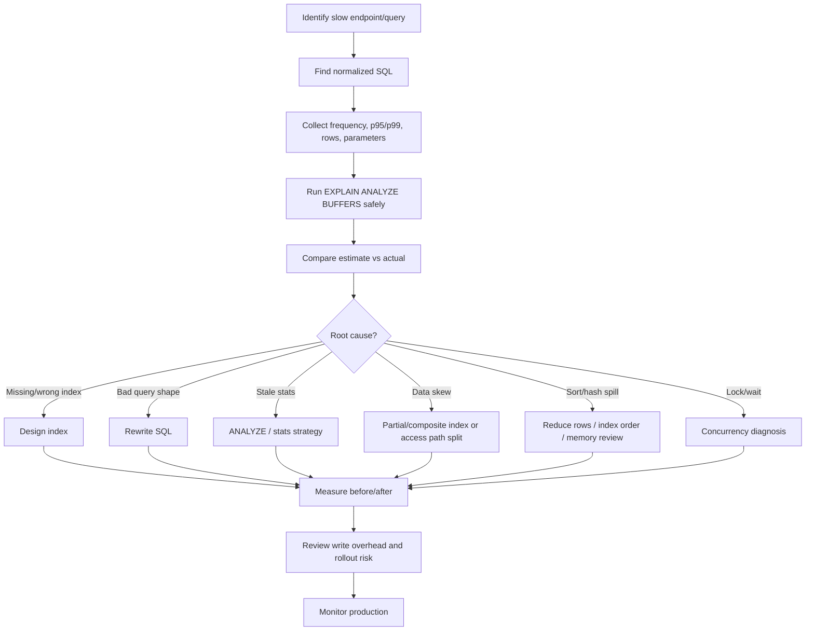

# Part 009 — PostgreSQL Query Planner and EXPLAIN

Query performance tidak bisa direview hanya dengan melihat SQL secara visual. Dua query yang tampak mirip bisa punya latency berbeda karena data distribution, statistics, index shape, join order, parameter value, memory pressure, cache state, dan row visibility.

PostgreSQL tidak menjalankan SQL secara literal seperti urutan teks yang kita tulis. PostgreSQL membuat **execution plan**: rencana bagaimana mengambil row, memilih scan, memilih join, melakukan sort, aggregate, materialize, parallelize, dan mengembalikan hasil.

Untuk senior backend engineer, `EXPLAIN` adalah alat utama untuk menjawab:

> PostgreSQL akan menjalankan query ini dengan cara apa, kenapa memilih cara itu, dan apakah pilihan itu cocok dengan data dan access pattern nyata?

Dalam aplikasi Java/JAX-RS + MyBatis, query planner adalah boundary tersembunyi antara kode backend dan performa production:

```text
HTTP request
  -> JAX-RS resource
  -> service method
  -> transaction boundary
  -> MyBatis mapper / JDBC PreparedStatement
  -> PostgreSQL parser
  -> rewriter
  -> planner
  -> executor
  -> heap/index/buffer/WAL interaction
  -> result set
  -> API response latency
```

Kalau engineer hanya paham SQL syntax tetapi tidak paham planner, tuning akan berubah menjadi tebak-tebakan: tambah index, rewrite query, ubah config, atau naikkan resource tanpa tahu bottleneck sebenarnya.

---

## 1. Core mental model

Planner memilih plan berdasarkan estimasi.

Estimasi itu dibangun dari:

- query shape;
- table statistics;
- index statistics;
- column distribution;
- estimated row count;
- estimated cost;
- available indexes;
- enabled planner features;
- join alternatives;
- sorting/aggregation alternatives;
- parallelism possibility;
- parameterized query behavior;
- database configuration.

Planner tidak tahu business intent. Planner tidak tahu bahwa `status = 'ACTIVE'` adalah kondisi umum atau langka kecuali statistics cukup merepresentasikannya. Planner juga tidak tahu bahwa endpoint tertentu adalah hot path kecuali kita mengukurnya dari workload.

Query plan adalah hipotesis planner. `EXPLAIN ANALYZE` adalah pembuktian dengan eksekusi nyata.

---

## 2. Lifecycle query di PostgreSQL



Tahap penting untuk tuning ada di dua tempat:

1. **Plan time**: apakah planner memilih strategi yang masuk akal?
2. **Execution time**: apakah real execution sesuai estimasi planner?

Masalah umum:

- plan terlihat masuk akal, tetapi execution lambat karena IO/cache/lock;
- plan buruk karena statistics stale atau tidak cukup detail;
- plan berubah setelah data distribution berubah;
- plan buruk hanya untuk parameter tertentu;
- query cepat di local/dev tetapi lambat di production karena volume dan distribution berbeda;
- query cepat saat diuji sendiri tetapi lambat saat concurrent workload.

---

## 3. `EXPLAIN` vs `EXPLAIN ANALYZE`

`EXPLAIN` menampilkan rencana tanpa menjalankan query.

```sql
EXPLAIN
SELECT q.id, q.status, q.created_at
FROM quote q
WHERE q.tenant_id = $1
  AND q.status = $2
ORDER BY q.created_at DESC
LIMIT 50;
```

`EXPLAIN ANALYZE` menjalankan query dan menampilkan runtime metrics.

```sql
EXPLAIN (ANALYZE, BUFFERS, VERBOSE)
SELECT q.id, q.status, q.created_at
FROM quote q
WHERE q.tenant_id = $1
  AND q.status = $2
ORDER BY q.created_at DESC
LIMIT 50;
```

Gunakan `EXPLAIN` untuk:

- melihat plan tanpa side effect;
- query write yang tidak boleh dieksekusi;
- review awal PR;
- membandingkan kemungkinan plan.

Gunakan `EXPLAIN ANALYZE` untuk:

- mengukur actual execution;
- melihat actual rows vs estimated rows;
- melihat loops;
- melihat buffer access;
- mendeteksi temp file/sort spill;
- memvalidasi apakah index benar-benar membantu.

Untuk `INSERT`, `UPDATE`, `DELETE`, `EXPLAIN ANALYZE` benar-benar mengeksekusi statement. Jika harus diuji, lakukan di environment aman atau bungkus dalam transaksi lalu rollback:

```sql
BEGIN;

EXPLAIN (ANALYZE, BUFFERS)
UPDATE quote
SET status = 'EXPIRED'
WHERE status = 'DRAFT'
  AND valid_until < now();

ROLLBACK;
```

Jangan menjalankan `EXPLAIN ANALYZE` untuk write query di production tanpa prosedur yang jelas.

---

## 4. Anatomy output EXPLAIN

Contoh konseptual:

```text
Limit  (cost=0.42..18.37 rows=50 width=48)
  ->  Index Scan using idx_quote_tenant_status_created on quote q
      (cost=0.42..9132.84 rows=25431 width=48)
      Index Cond: ((tenant_id = $1) AND (status = $2))
      Order By: created_at DESC
```

Komponen penting:

| Field | Arti | Kenapa penting |
|---|---|---|
| Node type | Operasi plan, misalnya Seq Scan, Index Scan, Hash Join | Menunjukkan strategi utama |
| cost | Estimasi biaya planner, bukan milliseconds | Dipakai membandingkan alternatif plan |
| rows | Estimasi jumlah row keluar dari node | Kunci membaca cardinality error |
| width | Estimasi ukuran row | Berpengaruh ke memory/sort/hash |
| actual time | Waktu aktual saat `ANALYZE` | Membaca node lambat |
| actual rows | Row aktual | Bandingkan dengan estimate |
| loops | Berapa kali node dijalankan | Penting untuk nested loop dan subquery |
| buffers | Page hit/read/dirtied/written | Membaca IO/cache behavior |

Rule praktis:

- Jangan hanya lihat total time.
- Cari node dengan actual time tinggi, rows besar, loops besar, atau buffer read besar.
- Cari gap ekstrem antara `rows=` estimate dan `actual rows=`.
- Jangan otomatis menyalahkan `Seq Scan`; kadang sequential scan memang benar.
- Jangan otomatis senang melihat `Index Scan`; index scan bisa buruk jika loop sangat banyak.

---

## 5. Cost model

Cost di PostgreSQL adalah satuan relatif, bukan waktu real.

Contoh:

```text
cost=0.42..9132.84
```

Artinya:

- startup cost: biaya sebelum row pertama keluar;
- total cost: biaya sampai semua row keluar.

Planner memakai cost untuk memilih alternatif termurah menurut modelnya.

Faktor yang memengaruhi cost:

- jumlah page table/index;
- jumlah row yang diperkirakan;
- selectivity predicate;
- CPU per tuple;
- random vs sequential IO;
- sort/hash memory;
- parallelism;
- join order;
- index correlation;
- configuration seperti `random_page_cost`, `seq_page_cost`, `cpu_tuple_cost`, `effective_cache_size`.

Jangan mulai tuning dengan mengubah cost parameter. Mulai dari query, statistics, index, dan data distribution. Mengubah cost parameter secara global bisa memperbaiki satu query tetapi merusak banyak query lain.

---

## 6. Statistics

Planner sangat bergantung pada statistics.

Statistics membantu menjawab:

- berapa row dalam tabel;
- berapa page table/index;
- berapa banyak distinct value;
- nilai apa yang paling sering muncul;
- distribusi nilai;
- seberapa berkorelasi physical order dengan index order;
- apakah kombinasi kolom punya dependency tertentu jika extended statistics tersedia.

Tanpa statistics yang baik, planner bisa salah besar.

Contoh masalah:

```sql
SELECT *
FROM quote
WHERE tenant_id = $1
  AND status = 'APPROVED'
  AND created_at >= now() - interval '7 days';
```

Jika planner salah memperkirakan jumlah `APPROVED` quote dalam tenant tertentu, ia bisa memilih:

- nested loop padahal hasil besar;
- sequential scan padahal hasil kecil;
- index scan yang terlalu banyak random IO;
- hash join dengan ukuran hash yang salah;
- sort yang spill ke disk.

---

## 7. ANALYZE and stale statistics

`ANALYZE` memperbarui statistics yang dipakai planner.

```sql
ANALYZE quote;
```

Autovacuum biasanya menjalankan analyze otomatis, tetapi pada production system tertentu statistics bisa tetap tertinggal, terutama setelah:

- bulk load;
- large backfill;
- migration besar;
- perubahan distribusi status;
- tenant besar baru masuk;
- data archival/retention job;
- partition attach/detach;
- mass update.

Gejala stale statistics:

- plan berubah buruk setelah data migration;
- estimate rows jauh dari actual rows;
- index tidak dipakai padahal terlihat cocok;
- join strategy salah;
- query tiba-tiba lambat setelah batch job.

Checklist cepat:

```sql
-- Lihat kapan table terakhir dianalisis.
SELECT
  schemaname,
  relname,
  last_analyze,
  last_autoanalyze,
  n_live_tup,
  n_dead_tup
FROM pg_stat_user_tables
WHERE relname = 'quote';
```

---

## 8. Extended statistics

Single-column statistics tidak selalu cukup.

Contoh:

```sql
WHERE tenant_id = $1
  AND account_id = $2
```

Jika `account_id` sangat tergantung pada `tenant_id`, planner bisa salah memperkirakan selectivity gabungan jika hanya memakai statistik per kolom.

Extended statistics dapat membantu untuk:

- dependency antar kolom;
- ndistinct kombinasi kolom;
- most common values kombinasi kolom.

Contoh konseptual:

```sql
CREATE STATISTICS st_quote_tenant_status
ON tenant_id, status
FROM quote;

ANALYZE quote;
```

Gunakan hanya jika ada bukti estimation error pada kombinasi kolom penting. Jangan membuat extended statistics secara acak.

---

## 9. Sequential scan

Sequential scan membaca tabel secara berurutan.

```text
Seq Scan on quote
```

Sequential scan bisa benar jika:

- query membaca sebagian besar tabel;
- tabel kecil;
- predicate tidak selektif;
- index tidak cocok;
- membaca berurutan lebih murah daripada banyak random lookup;
- aggregation/reporting memang butuh banyak row.

Sequential scan bermasalah jika:

- terjadi pada tabel besar untuk endpoint OLTP hot path;
- query seharusnya mengambil sedikit row;
- filter memiliki index yang cocok tapi tidak digunakan;
- statistics salah;
- predicate memakai function/cast yang merusak index usability.

Anti-pattern:

```sql
-- Bisa membuat index pada created_at tidak terpakai dengan baik.
WHERE date(created_at) = date '2026-07-11'
```

Lebih baik:

```sql
WHERE created_at >= timestamp '2026-07-11 00:00:00+00'
  AND created_at <  timestamp '2026-07-12 00:00:00+00'
```

---

## 10. Index scan

Index scan memakai index untuk menemukan row, lalu biasanya membaca heap untuk mengambil row penuh dan mengecek visibility.

```text
Index Scan using idx_quote_tenant_status_created on quote
```

Index scan cocok jika:

- predicate selektif;
- index order mendukung `ORDER BY`;
- LIMIT kecil;
- query mengambil row sedikit;
- heap access tidak terlalu mahal.

Index scan bisa lambat jika:

- result banyak;
- heap access random terlalu besar;
- index bloat;
- table bloat;
- cache miss tinggi;
- query mengambil banyak column besar;
- visibility map tidak mendukung index-only scan.

---

## 11. Index-only scan

Index-only scan bisa mengembalikan data dari index tanpa membaca heap untuk setiap row, jika:

- semua column yang dibutuhkan ada di index;
- visibility map menunjukkan page cukup visible untuk transaksi;
- query shape cocok.

Contoh index covering:

```sql
CREATE INDEX idx_quote_tenant_status_created_cover
ON quote (tenant_id, status, created_at DESC)
INCLUDE (id, quote_number);
```

Query:

```sql
SELECT id, quote_number, created_at
FROM quote
WHERE tenant_id = $1
  AND status = $2
ORDER BY created_at DESC
LIMIT 50;
```

Index-only scan bukan jaminan. Jika visibility map belum mendukung karena banyak update/dead tuple, PostgreSQL tetap perlu heap fetch.

Checklist:

- Apakah query benar-benar hanya butuh kolom di index?
- Apakah table sering update?
- Apakah autovacuum berjalan baik?
- Apakah index menjadi terlalu besar karena INCLUDE terlalu banyak?

---

## 12. Bitmap scan

Bitmap scan biasanya muncul saat PostgreSQL mengumpulkan row pointer dari index, lalu membaca heap page secara lebih efisien.

```text
Bitmap Heap Scan on quote
  Recheck Cond: ...
  -> Bitmap Index Scan on idx_quote_status
```

Bitmap scan cocok saat:

- result tidak sangat kecil tetapi juga tidak mayoritas tabel;
- beberapa index bisa digabung;
- random heap access perlu dikelompokkan per page.

Gejala yang perlu dicek:

- `Rows Removed by Index Recheck` tinggi;
- bitmap heap scan membaca banyak page;
- predicate tidak selektif;
- index kurang cocok;
- work memory tidak cukup untuk bitmap besar.

---

## 13. Nested loop join

Nested loop menjalankan inner operation untuk setiap row outer.

```text
Nested Loop
  -> Index Scan on quote
  -> Index Scan on quote_item
```

Nested loop bagus jika:

- outer row sedikit;
- inner lookup memakai index yang selektif;
- LIMIT kecil;
- join bersifat point lookup.

Nested loop buruk jika:

- outer row ternyata besar;
- inner scan mahal;
- estimate outer row salah;
- terjadi pola N+1 di level database;
- loops sangat tinggi.

Tanda bahaya:

```text
actual rows=50000 loops=1
...
actual rows=10 loops=50000
```

Jika inner node dieksekusi puluhan ribu kali, cek apakah join strategy perlu berubah, index perlu diperbaiki, atau query perlu dipecah/diubah.

---

## 14. Hash join

Hash join membuat hash table dari salah satu input, lalu mencocokkan row dari input lain.

```text
Hash Join
  Hash Cond: (qi.quote_id = q.id)
```

Hash join bagus untuk:

- join result cukup besar;
- equality join;
- tidak ada ordering requirement;
- input bisa masuk memory.

Hash join bisa bermasalah jika:

- hash table besar dan spill ke disk;
- estimate rows terlalu rendah;
- work memory tidak cukup;
- join condition tidak selektif;
- query berjalan concurrent sehingga memory pressure meningkat.

Cek:

- actual rows;
- batches;
- memory usage;
- temp file;
- buffer read.

---

## 15. Merge join

Merge join menyortir kedua input atau memakai input yang sudah ordered, lalu melakukan join secara berurutan.

```text
Merge Join
  Merge Cond: (a.key = b.key)
```

Merge join cocok jika:

- kedua input sudah terurut oleh index;
- result besar;
- join key equality/range-compatible;
- sort cost lebih murah daripada hash/nested loop.

Cek apakah sort terjadi sebelum merge join. Jika sort besar spill ke disk, merge join bisa menjadi mahal.

---

## 16. Sort

Sort muncul untuk:

- `ORDER BY`;
- merge join preparation;
- aggregate/grouping tertentu;
- DISTINCT;
- window function.

Contoh:

```text
Sort
  Sort Key: q.created_at DESC
  Sort Method: external merge  Disk: 102400kB
```

Tanda bahaya:

- `external merge` berarti sort spill ke disk;
- sort rows jauh lebih besar dari LIMIT karena ordering tidak didukung index;
- sort dilakukan berulang dalam nested loop;
- sort key tidak sesuai index order.

Solusi umum:

- index yang mendukung filter + order;
- keyset pagination;
- kurangi row sebelum sort;
- pre-aggregate/read model;
- hati-hati menaikkan `work_mem`.

---

## 17. Aggregate

Aggregate muncul untuk:

- `COUNT`;
- `SUM`;
- `GROUP BY`;
- `DISTINCT`;
- reporting query.

Plan umum:

- `HashAggregate`;
- `GroupAggregate`;
- `Aggregate`;
- parallel aggregate.

Masalah umum:

- aggregate membaca terlalu banyak row;
- grouping cardinality tinggi;
- hash aggregate spill ke disk;
- aggregate dijalankan di OLTP primary pada jam sibuk;
- query reporting tidak punya read model.

Untuk sistem CPQ/order, aggregate atas history/order/item besar harus diperlakukan sebagai workload serius, bukan query tambahan ringan.

---

## 18. Materialize

`Materialize` menyimpan hasil intermediate agar bisa dibaca ulang.

```text
Materialize
  -> Index Scan ...
```

Materialize bisa membantu jika subplan dipakai berulang, tetapi bisa menjadi masalah jika:

- hasil intermediate besar;
- memory tidak cukup;
- plan terbentuk karena join shape kurang baik;
- row estimate salah.

Jangan langsung menghapus CTE/subquery karena melihat `Materialize`. Pahami dulu kenapa planner membutuhkannya.

---

## 19. Parallel query

PostgreSQL bisa memakai parallel plan untuk scan/join/aggregate tertentu.

```text
Gather
  Workers Planned: 2
  Workers Launched: 2
```

Parallel query berguna untuk query besar, tetapi tidak selalu cocok untuk OLTP latency rendah.

Cek:

- apakah worker benar-benar launched;
- apakah overhead parallelism lebih besar dari manfaat;
- apakah query berjalan di primary production saat traffic tinggi;
- apakah parallel query memperebutkan CPU dengan workload API.

Parallelism bukan pengganti index/query modelling.

---

## 20. Rows estimate vs actual rows

Ini salah satu sinyal paling penting.

Contoh buruk:

```text
Index Scan ... (cost=0.42..8.44 rows=1 width=64)
              (actual time=0.041..311.882 rows=125000 loops=1)
```

Planner mengira 1 row, ternyata 125.000 row. Dampaknya:

- join strategy bisa salah;
- memory estimate salah;
- nested loop bisa meledak;
- sort/hash bisa spill;
- index scan bisa lebih buruk daripada sequential scan.

Penyebab umum:

- statistics stale;
- data skew;
- correlation antar kolom;
- tenant besar berbeda dari tenant kecil;
- status distribution tidak merata;
- predicate memakai expression/function;
- generic prepared statement plan;
- parameter value sangat bervariasi.

---

## 21. Buffers

Gunakan `BUFFERS` untuk melihat page access.

```sql
EXPLAIN (ANALYZE, BUFFERS)
SELECT ...;
```

Contoh output:

```text
Buffers: shared hit=1200 read=350 dirtied=0 written=0
```

Arti umum:

- `hit`: page ditemukan di shared buffers;
- `read`: page dibaca dari disk/storage;
- `dirtied`: page dimodifikasi;
- `written`: page ditulis.

Interpretasi:

- banyak `read` bisa menunjukkan IO bottleneck atau cache miss;
- banyak `hit` tetap bisa mahal jika jumlah page sangat besar;
- write query dengan banyak dirtied page bisa memberi pressure ke checkpoint/WAL;
- query yang tampak CPU-bound bisa sebenarnya membaca terlalu banyak buffer.

Jangan hanya melihat latency. Lihat berapa banyak data yang disentuh.

---

## 22. Timing

`EXPLAIN ANALYZE` timing membantu melihat node lambat, tetapi hati-hati:

- timing bisa berubah karena cache;
- timing bisa dipengaruhi concurrent workload;
- timing bisa berbeda antara staging dan production;
- timing overhead bisa ada;
- query pertama setelah restart/cache cold bisa berbeda dari query berikutnya.

Untuk PR review, gunakan plan shape dan row estimates. Untuk incident, gunakan plan + runtime metrics + database wait/IO/lock signal.

---

## 23. Plan regression

Plan regression adalah kondisi query yang sama atau mirip tiba-tiba memilih plan lebih buruk.

Penyebab umum:

- data volume bertambah;
- data distribution berubah;
- statistics berubah;
- index baru membuat planner memilih alternatif buruk;
- index lama dihapus;
- PostgreSQL version upgrade;
- parameter value berubah;
- table bloat/index bloat;
- config berubah;
- prepared statement berubah dari custom ke generic plan;
- partition bertambah banyak.

Gejala:

- endpoint latency naik tanpa perubahan kode jelas;
- query sama cepat untuk tenant kecil, lambat untuk tenant besar;
- `pg_stat_statements` menunjukkan mean/max time naik;
- plan lama dan plan baru berbeda;
- incident muncul setelah migration/backfill.

Praktik baik:

- simpan EXPLAIN untuk query kritikal sebelum migration besar;
- ukur query dengan data distribution mendekati production;
- cek plan setelah index/migration;
- pantau query fingerprint di `pg_stat_statements`.

---

## 24. Prepared statement plan behavior

Aplikasi Java biasanya memakai prepared statement melalui JDBC/MyBatis.

Prepared statement punya dua sisi:

- aman dari SQL injection jika parameter binding benar;
- memungkinkan reuse statement;
- tetapi plan selection bisa dipengaruhi parameterization.

Masalah yang sering disebut mirip “parameter sniffing”:

```sql
SELECT *
FROM quote
WHERE tenant_id = $1
  AND status = $2;
```

Jika tenant kecil punya 100 quote dan tenant besar punya 100 juta quote, plan terbaik bisa berbeda. Generic plan yang “rata-rata” bisa buruk untuk tenant tertentu.

Gejala:

- query lambat hanya untuk parameter tertentu;
- SQL literal cepat, prepared statement lambat;
- plan di psql berbeda dari plan aplikasi;
- endpoint tenant besar lambat tetapi tenant kecil normal.

Yang perlu dicek:

- JDBC driver prepared statement threshold/config;
- PgBouncer mode jika digunakan;
- generic vs custom plan behavior;
- data skew per tenant/status;
- apakah query butuh index partial/composite yang lebih tepat;
- apakah access pattern perlu dipisah.

Jangan langsung memaksa planner. Pertama validasi data distribution dan query shape.

---

## 25. Query planner and MyBatis

MyBatis membuat SQL eksplisit terlihat di mapper. Ini bagus untuk review, tetapi dynamic SQL bisa menghasilkan banyak bentuk query.

Contoh dynamic filter:

```xml
<select id="searchQuotes" resultMap="QuoteResultMap">
  SELECT id, quote_number, status, created_at
  FROM quote
  WHERE tenant_id = #{tenantId}
  <if test="status != null">
    AND status = #{status}
  </if>
  <if test="accountId != null">
    AND account_id = #{accountId}
  </if>
  ORDER BY created_at DESC
  LIMIT #{limit}
</select>
```

Setiap kombinasi filter bisa butuh plan dan index berbeda.

Review checklist:

- Kombinasi filter mana yang paling sering?
- Filter mana yang optional tetapi sangat selektif?
- Apakah ORDER BY selalu sama?
- Apakah LIMIT kecil?
- Apakah query bisa jatuh ke full scan saat optional filter kosong?
- Apakah dynamic ORDER BY aman?
- Apakah query punya test dengan data besar?
- Apakah EXPLAIN diuji untuk kombinasi filter penting?

---

## 26. Query tuning workflow

Gunakan workflow yang disiplin:



Jangan tuning hanya dari satu query execution. Gabungkan:

- query plan;
- pg_stat_statements;
- logs;
- database metrics;
- application traces;
- parameter distribution;
- data volume;
- concurrency behavior.

---

## 27. Example: bad pagination plan

Query:

```sql
SELECT id, quote_number, status, created_at
FROM quote
WHERE tenant_id = $1
ORDER BY created_at DESC
LIMIT 50 OFFSET 500000;
```

Masalah:

- PostgreSQL tetap harus menemukan/melewati 500.000 row;
- index bisa membantu order, tetapi offset besar tetap mahal;
- latency bertambah seiring page number;
- user bisa membuat query semakin mahal.

Plan mungkin terlihat memakai index, tetapi tetap lambat karena jumlah row yang dilewati besar.

Solusi lebih stabil:

```sql
SELECT id, quote_number, status, created_at
FROM quote
WHERE tenant_id = $1
  AND created_at < $2
ORDER BY created_at DESC
LIMIT 50;
```

Dengan index:

```sql
CREATE INDEX idx_quote_tenant_created_desc
ON quote (tenant_id, created_at DESC);
```

Ini akan dibahas lebih detail di Part 010.

---

## 28. Example: wrong join estimate

Query:

```sql
SELECT q.id, qi.id, qi.product_code
FROM quote q
JOIN quote_item qi ON qi.quote_id = q.id
WHERE q.tenant_id = $1
  AND q.status = 'APPROVED';
```

Jika planner mengira hanya 10 quote approved tetapi aktualnya 100.000, nested loop ke `quote_item` bisa menjadi sangat mahal.

Diagnosis:

- cek `actual rows` pada node quote;
- cek `loops` pada quote_item;
- cek statistics tenant/status;
- cek index `quote(tenant_id, status)` dan `quote_item(quote_id)`;
- cek apakah tenant tertentu skew;
- cek apakah query sebenarnya butuh semua item atau hanya summary.

---

## 29. Failure modes

| Failure mode | Gejala | Penyebab umum | Arah debugging |
|---|---|---|---|
| Planner memilih seq scan di hot path | Endpoint lambat saat data besar | Predicate tidak selektif, index tidak cocok, stats stale | EXPLAIN BUFFERS, cek index/query shape |
| Index tidak dipakai | Index ada tetapi plan scan table | Function/cast, low selectivity, stale stats | Rewrite predicate, ANALYZE, expression index |
| Nested loop meledak | loops sangat tinggi | Estimate outer row salah | Cek actual vs estimate, join index, stats |
| Sort spill | Temp file tinggi | ORDER BY besar, work_mem tidak cukup | Index order, reduce rows, keyset pagination |
| Hash spill | Temp file tinggi, hash batch | Hash input lebih besar dari estimate | Stats, work_mem review, reduce dataset |
| Plan regression | Query tiba-tiba lambat | Data distribution/index/stats/version berubah | Compare old/new plan, pg_stat_statements |
| Parameter-sensitive query | Lambat hanya untuk tenant/status tertentu | Generic plan/data skew | Test parameter variants, index/data model review |
| Fast locally slow in prod | Dev data kecil | Volume/distribution beda | Test with realistic data |

---

## 30. Detection signals

Cari sinyal dari beberapa layer.

Application layer:

- endpoint p95/p99 naik;
- timeout meningkat;
- thread blocked menunggu JDBC;
- error statement timeout;
- slow request trace menunjukkan DB span dominan.

Database layer:

- `pg_stat_statements` mean/max time naik;
- shared blocks read tinggi;
- temp blocks read/write tinggi;
- rows returned/rows scanned tidak seimbang;
- slow query log muncul;
- wait event IO/lock;
- CPU tinggi;
- connection pile-up.

Code review layer:

- query tanpa tenant filter;
- optional filter bisa kosong;
- OFFSET besar;
- dynamic SQL tidak punya bounded result;
- sorting tanpa index support;
- mapper nested select;
- query reporting di endpoint synchronous.

---

## 31. Debugging checklist

Saat menemukan slow query:

1. Ambil normalized SQL.
2. Ambil parameter representatif, termasuk parameter worst-case.
3. Jalankan `EXPLAIN (ANALYZE, BUFFERS)` di environment aman.
4. Baca plan dari node paling mahal dan row mismatch terbesar.
5. Bandingkan estimated vs actual rows.
6. Cek scan type.
7. Cek join type dan loops.
8. Cek sort/hash spill.
9. Cek buffer hit/read.
10. Cek index yang tersedia.
11. Cek statistics freshness.
12. Cek data skew tenant/status/time range.
13. Cek apakah query shape berasal dari MyBatis dynamic SQL.
14. Cek apakah prepared statement/generic plan relevan.
15. Uji perubahan query/index dengan before/after plan.
16. Review write overhead dari index baru.
17. Rencanakan migration index secara aman.
18. Pantau setelah deploy.

---

## 32. Java/JAX-RS impact

Query plan buruk muncul di API sebagai:

- response time tinggi;
- request timeout;
- connection pool exhaustion;
- thread starvation;
- retry storm;
- circuit breaker open;
- memory pressure karena result set besar;
- degraded dependency untuk service lain.

Design implication:

- endpoint harus punya bounded result;
- pagination harus scalable;
- filter harus dirancang sesuai index;
- read-heavy query perlu read model/replica bila perlu;
- query reporting jangan sembarang masuk request synchronous;
- timeout harus eksplisit;
- slow DB call harus muncul di tracing.

---

## 33. MyBatis/JDBC impact

Hal yang perlu diperhatikan:

- prepared statement parameterization dapat memengaruhi plan;
- dynamic SQL menghasilkan banyak query shape;
- nested select mapping bisa membuat banyak query kecil;
- fetch size memengaruhi streaming result;
- batch operation bisa membuat lock dan WAL besar;
- TypeHandler/cast dapat memengaruhi index usage;
- mapper XML harus mudah di-copy ke EXPLAIN.

Review praktis:

- setiap mapper query kompleks harus bisa dijalankan sebagai SQL standalone;
- setiap query hot path harus punya EXPLAIN evidence;
- setiap dynamic query harus punya daftar kombinasi filter utama;
- setiap query yang mengambil list harus punya LIMIT atau boundary yang jelas.

---

## 34. Microservices and event-driven impact

Dalam microservices, query planner issue sering berubah menjadi masalah sistemik:

- satu service lambat menahan event processing;
- consumer lag naik karena query per event lambat;
- outbox publisher lambat karena polling query buruk;
- read model refresh tertahan;
- saga/reconciliation job memperberat DB;
- API gateway melihat timeout meskipun akar masalah ada di query plan.

Query tuning untuk event-driven workload harus mempertimbangkan:

- batch size;
- polling interval;
- index untuk status + created_at/id;
- `SKIP LOCKED` pattern;
- cleanup/retention;
- partitioning;
- idempotency lookup;
- duplicate detection index.

---

## 35. Kubernetes/AWS/Azure/on-prem impact

Planner tetap sama secara konsep, tetapi environment memengaruhi gejala:

- Kubernetes replica bertambah bisa menggandakan query pressure;
- connection pool total bisa mengubah concurrency dan cache pressure;
- managed DB punya storage latency dan parameter limitation;
- read replica punya replication lag;
- cloud metrics harus digabung dengan `EXPLAIN`;
- on-prem storage layout bisa membuat random IO lebih mahal;
- noisy neighbor bisa membuat plan yang sama punya runtime berbeda.

Jangan menyimpulkan plan buruk hanya dari latency. Cek apakah latency berasal dari plan, lock, IO, CPU, connection pool, network, atau replica lag.

---

## 36. Production-safe query tuning rules

- Jangan menambah index tanpa query evidence.
- Jangan menghapus index tanpa usage evidence dan rollback plan.
- Jangan menjalankan `EXPLAIN ANALYZE` write query di production sembarangan.
- Jangan menaikkan `work_mem` global hanya karena satu query spill.
- Jangan memaksa planner kecuali benar-benar paham dampak globalnya.
- Jangan menganggap query cepat di dev berarti aman di production.
- Jangan membuat query list tanpa bounded result.
- Jangan melakukan tuning tanpa memantau setelah deploy.
- Jangan lupa write overhead dan migration risk dari index baru.

---

## 37. Internal verification checklist

Verifikasi di internal CSG/team:

- Versi PostgreSQL yang digunakan di setiap environment.
- Apakah `pg_stat_statements` aktif.
- Apakah slow query log aktif dan threshold-nya.
- Apakah ada dashboard query latency/top SQL.
- Apakah ada standar menyertakan EXPLAIN untuk PR query/index besar.
- Apakah MyBatis mapper hot path sudah dipetakan.
- Apakah query search/list/reporting punya index evidence.
- Apakah ada policy `EXPLAIN ANALYZE` di production.
- Apakah ada plan baseline untuk query kritikal.
- Apakah ada incident historis karena plan regression.
- Apakah ada data skew tenant/customer besar.
- Apakah prepared statement/PgBouncer digunakan.
- Apakah statistics/autovacuum/analyze dimonitor.
- Apakah migration besar menjalankan `ANALYZE` setelah data berubah.
- Apakah query outbox/inbox/CDC polling sudah diuji dengan volume besar.
- Apakah DBA/SRE punya runbook untuk bad query plan.

---

## 38. PR review checklist

Saat review query atau index:

- Apa access pattern API/event/job yang dilayani?
- Berapa expected cardinality?
- Apakah query bounded?
- Apakah filter wajib cukup selektif?
- Apakah ORDER BY didukung index?
- Apakah JOIN key diindeks di sisi yang tepat?
- Apakah EXPLAIN menunjukkan estimate masuk akal?
- Apakah `actual rows` dekat dengan estimate?
- Apakah ada sort/hash spill?
- Apakah query bisa lambat untuk tenant besar?
- Apakah dynamic SQL punya kombinasi filter yang diuji?
- Apakah index baru menambah write overhead besar?
- Apakah migration index aman untuk tabel besar?
- Apakah ada observability setelah deploy?
- Apakah rollback/roll-forward jelas?

---

## 39. Senior engineer heuristics

Heuristik yang berguna:

- Query cepat karena data kecil bukan query scalable.
- Index dipakai bukan berarti query optimal.
- Sequential scan bukan selalu salah.
- Row estimate mismatch adalah sinyal utama.
- `loops` tinggi sering lebih berbahaya daripada node yang terlihat kecil.
- `ORDER BY + LIMIT` hanya cepat jika PostgreSQL bisa menemukan row dalam order yang tepat.
- Pagination offset besar adalah hutang performa.
- Query planner issue sering berasal dari data distribution, bukan syntax.
- Index untuk read path harus dibayar di write path.
- Query tuning tanpa observability adalah spekulasi.

---

## 40. Summary

PostgreSQL query planner adalah komponen yang mengubah SQL menjadi strategi eksekusi. Untuk backend engineer, `EXPLAIN` dan `EXPLAIN ANALYZE` adalah bahasa kerja untuk berdiskusi tentang performa query secara objektif.

Kemampuan inti setelah part ini:

- membaca plan dasar;
- membedakan scan/join/sort/aggregate strategy;
- memahami cost sebagai estimasi relatif;
- membaca estimated vs actual rows;
- memakai `BUFFERS` untuk melihat IO/cache signal;
- mengenali plan regression;
- memahami prepared statement plan sensitivity;
- melakukan tuning workflow yang aman;
- mereview query MyBatis/JDBC dengan evidence.

Part berikutnya akan memakai planner knowledge ini untuk membahas **Query Performance Patterns**: pagination, N+1, batching, large IN clause, EXISTS vs IN, CTE, aggregation, sorting, work memory, hot row, hot index, timeout, dan PR checklist.
