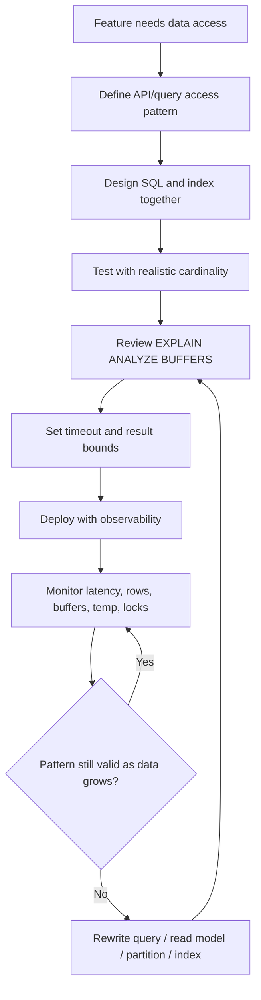

# Part 010 — PostgreSQL Query Performance Patterns

Query performance bukan sekadar “tambahkan index”. Query yang lambat biasanya lahir dari kombinasi:

- access pattern API yang tidak bounded;
- query shape yang tidak cocok dengan index;
- pagination yang salah;
- N+1 query di mapper/service layer;
- data distribution yang skew;
- sorting/aggregation terlalu besar;
- dynamic SQL yang sulit diprediksi;
- work memory spill;
- hot row/hot index contention;
- timeout yang tidak eksplisit;
- observability yang kurang.

Part ini membahas pattern yang paling sering muncul pada Java/JAX-RS + MyBatis + PostgreSQL production system.

Core mental model:

```text
Performance = query shape + data volume + data distribution + index shape + concurrency + memory + IO + lock behavior + application usage pattern
```

Jika hanya melihat SQL secara terpisah, kita akan melewatkan fakta bahwa query tersebut dijalankan ribuan kali per menit, untuk tenant besar, dalam transaksi panjang, oleh banyak pod Kubernetes, dengan connection pool besar, dan mungkin ikut menahan outbox/event processing.

---

## 1. Performance lifecycle



Performance harus dipikirkan sejak access pattern, bukan setelah endpoint lambat di production.

---

## 2. Start with measurement

Sebelum tuning, jawab dulu:

- Query mana yang lambat?
- Dipanggil dari endpoint/job/consumer mana?
- Berapa frekuensinya?
- Berapa p50/p95/p99 latency?
- Berapa row yang dikembalikan?
- Berapa row yang discan?
- Parameter apa yang lambat?
- Apakah hanya tenant/customer tertentu?
- Apakah lambat karena CPU, IO, lock, connection, atau query plan?

Sumber bukti:

- application tracing;
- slow query log;
- `pg_stat_statements`;
- `EXPLAIN (ANALYZE, BUFFERS)`;
- `pg_stat_activity`;
- `pg_locks`;
- database CPU/IO metrics;
- connection pool metrics;
- MyBatis mapper log jika aman;
- incident timeline.

Tanpa measurement, optimasi biasanya berubah menjadi perubahan acak.

---

## 3. Bounded result set

Setiap endpoint list/search harus punya batas eksplisit.

Buruk:

```sql
SELECT id, quote_number, status, created_at
FROM quote
WHERE tenant_id = #{tenantId}
ORDER BY created_at DESC;
```

Masalah:

- result bisa tumbuh tanpa batas;
- JDBC bisa memuat terlalu banyak row;
- response payload membesar;
- transaction/connection tertahan lama;
- sort bisa besar;
- API bisa menjadi query export tanpa sengaja.

Lebih aman:

```sql
SELECT id, quote_number, status, created_at
FROM quote
WHERE tenant_id = #{tenantId}
ORDER BY created_at DESC
LIMIT #{limit};
```

Tetapkan maximum limit di service layer, bukan hanya percaya input client.

```java
int safeLimit = Math.min(request.limit(), 100);
```

Untuk enterprise API, bounded result adalah correctness dan reliability control, bukan sekadar performance optimization.

---

## 4. Offset pagination

Offset pagination umum dan mudah:

```sql
SELECT id, quote_number, status, created_at
FROM quote
WHERE tenant_id = $1
ORDER BY created_at DESC
LIMIT 50 OFFSET 5000;
```

Masalah offset:

- PostgreSQL tetap harus melewati row sebelumnya;
- semakin jauh page, semakin mahal;
- result bisa tidak stabil jika data berubah;
- user/bot bisa memicu offset sangat besar;
- index tidak menghilangkan biaya melewati row;
- latency page 1 dan page 10.000 sangat berbeda.

Offset masih bisa diterima untuk:

- data kecil;
- admin screen low traffic;
- report dengan batas jelas;
- UX yang butuh page number dan volume terkendali.

Offset berbahaya untuk:

- tabel order/quote besar;
- tenant besar;
- public/high-traffic endpoint;
- infinite scroll;
- event processing;
- export besar.

PR question:

> Apa worst-case OFFSET yang bisa diminta client, dan apa rencana saat data 10x lebih besar?

---

## 5. Keyset pagination

Keyset pagination memakai posisi terakhir, bukan nomor page.

Contoh:

```sql
SELECT id, quote_number, status, created_at
FROM quote
WHERE tenant_id = $1
  AND created_at < $2
ORDER BY created_at DESC
LIMIT 50;
```

Index pendukung:

```sql
CREATE INDEX idx_quote_tenant_created_desc
ON quote (tenant_id, created_at DESC);
```

Untuk ordering stabil, gunakan tie-breaker:

```sql
SELECT id, quote_number, status, created_at
FROM quote
WHERE tenant_id = $1
  AND (created_at, id) < ($2, $3)
ORDER BY created_at DESC, id DESC
LIMIT 50;
```

Index:

```sql
CREATE INDEX idx_quote_tenant_created_id_desc
ON quote (tenant_id, created_at DESC, id DESC);
```

Kelebihan:

- stabil untuk deep pagination;
- cocok untuk infinite scroll;
- latency lebih konstan;
- memanfaatkan index order;
- lebih aman untuk table besar.

Trade-off:

- tidak mudah lompat ke page arbitrary;
- cursor token perlu didesain;
- ordering harus deterministic;
- filter dan order harus konsisten;
- backward pagination lebih kompleks.

---

## 6. Cursor design for API

Cursor API sebaiknya tidak mengekspos detail internal mentah tanpa governance.

Contoh cursor payload konseptual:

```json
{
  "createdAt": "2026-07-11T03:10:00Z",
  "id": "9c2f2d6a-...",
  "direction": "next"
}
```

Bisa di-encode sebagai opaque token.

Hal yang perlu dijaga:

- cursor harus mengandung sort key;
- sort key harus immutable atau cukup stabil;
- cursor harus terikat pada filter yang sama;
- cursor jangan bisa dimanipulasi untuk bypass tenant/security;
- cursor perlu backward compatibility;
- cursor perlu expiry jika mengandung state sensitif;
- query harus tetap memakai index.

Untuk JAX-RS:

```text
GET /quotes?limit=50&cursor=opaque-token
```

Response:

```json
{
  "items": [],
  "nextCursor": "opaque-token"
}
```

---

## 7. Streaming large result

Kadang API/job perlu membaca banyak row, misalnya export, reconciliation, atau backfill.

Masalah jika semua row dimuat ke memory:

- heap Java naik;
- GC pressure;
- connection tertahan lama;
- transaction panjang;
- PostgreSQL snapshot lama;
- autovacuum terhambat;
- timeout meningkat.

Gunakan strategi:

- pagination/chunking;
- server-side cursor/fetch size bila sesuai;
- streaming response dengan batas;
- async export job;
- read replica untuk reporting/export;
- checkpoint/resume untuk job.

JDBC/MyBatis concern:

- cek fetch size;
- cek autocommit behavior;
- cek driver behavior;
- cek mapper tidak menampung semua result ke list besar;
- cek transaction timeout;
- cek HTTP timeout jika streaming via API.

Jangan membuat endpoint synchronous untuk export besar tanpa runbook dan limit.

---

## 8. N+1 query

N+1 terjadi saat aplikasi mengambil parent list, lalu query child satu per parent.

Contoh buruk:

```text
SELECT * FROM quote WHERE tenant_id = ? LIMIT 50;

-- lalu 50 kali:
SELECT * FROM quote_item WHERE quote_id = ?;
```

Gejala:

- endpoint lambat linear terhadap jumlah parent;
- database melihat banyak query kecil;
- connection pool sibuk;
- tracing menunjukkan banyak span DB;
- local/dev terlihat baik karena data kecil.

Solusi umum:

1. Join fetch jika cardinality aman.
2. Batch fetch child dengan `WHERE quote_id IN (...)`.
3. Dua-step query dengan grouping di aplikasi.
4. Read model denormalized.
5. Aggregate child summary saja jika detail tidak diperlukan.

Contoh batch fetch:

```sql
SELECT *
FROM quote_item
WHERE quote_id = ANY($1);
```

Atau:

```sql
SELECT *
FROM quote_item
WHERE quote_id IN (...);
```

Pastikan index:

```sql
CREATE INDEX idx_quote_item_quote_id
ON quote_item (quote_id);
```

---

## 9. MyBatis nested select risk

MyBatis `association` atau `collection` bisa memicu nested select.

Contoh konseptual:

```xml
<collection property="items"
            column="id"
            select="selectItemsByQuoteId" />
```

Ini bisa menjadi N+1 jika parent list banyak.

Review checklist:

- Apakah nested select dipakai untuk list endpoint?
- Apakah jumlah parent bounded kecil?
- Apakah lazy loading aktif?
- Apakah tracing menunjukkan query berulang?
- Apakah lebih baik batch fetch?
- Apakah result map join menyebabkan row explosion?

Nested mapping bukan salah secara mutlak, tetapi harus dikendalikan.

---

## 10. Batch fetching

Batch fetching mengurangi round trip.

Pattern:

```text
1. Query parent IDs with limit.
2. Query children for all parent IDs.
3. Group children by parent ID in Java.
4. Assemble DTO.
```

Contoh:

```sql
SELECT id, quote_number, status
FROM quote
WHERE tenant_id = $1
ORDER BY created_at DESC
LIMIT 50;
```

```sql
SELECT quote_id, id, product_code, quantity
FROM quote_item
WHERE quote_id = ANY($1)
ORDER BY quote_id, line_number;
```

Kelebihan:

- menghindari N+1;
- query tetap sederhana;
- mudah diobservasi;
- bisa memakai index child;
- lebih predictable daripada join besar.

Trade-off:

- perlu assembly di Java;
- list parent harus bounded;
- array/list parameter terlalu besar tetap bermasalah;
- order child harus eksplisit.

---

## 11. Large IN clause

`IN` dengan sedikit value biasanya aman. `IN` dengan ribuan/puluhan ribu value bisa bermasalah.

Masalah:

- SQL text besar;
- parse/plan overhead;
- network payload besar;
- plan bisa buruk;
- memory pressure;
- parameter limit/driver overhead;
- log menjadi bising.

Alternatif:

### 11.1 Use array parameter

```sql
SELECT *
FROM quote_item
WHERE quote_id = ANY($1);
```

### 11.2 Use temporary/staging table

Untuk batch besar:

```sql
CREATE TEMP TABLE tmp_quote_ids (id uuid) ON COMMIT DROP;

-- bulk insert ids

SELECT qi.*
FROM quote_item qi
JOIN tmp_quote_ids t ON t.id = qi.quote_id;
```

### 11.3 Chunking

Pecah batch menjadi ukuran aman:

```text
10.000 ids -> 20 batch x 500 ids
```

Pilih berdasarkan evidence. Array parameter lebih sederhana, temp table lebih kuat untuk batch besar/complex join.

---

## 12. EXISTS vs IN

Gunakan `EXISTS` ketika ingin mengecek keberadaan row terkait.

Contoh:

```sql
SELECT q.id, q.quote_number
FROM quote q
WHERE q.tenant_id = $1
  AND EXISTS (
    SELECT 1
    FROM quote_item qi
    WHERE qi.quote_id = q.id
      AND qi.product_code = $2
  );
```

`EXISTS` bagus karena secara mental adalah semi-join: cari parent yang punya child sesuai kondisi.

`IN` juga bisa dioptimasi PostgreSQL, tetapi semantik dan readability penting.

```sql
SELECT q.id, q.quote_number
FROM quote q
WHERE q.id IN (
  SELECT qi.quote_id
  FROM quote_item qi
  WHERE qi.product_code = $1
);
```

Rule praktis:

- Untuk existence check, tulis `EXISTS`.
- Untuk anti-existence, gunakan `NOT EXISTS`.
- Hati-hati `NOT IN` jika ada `NULL`.
- Validasi dengan EXPLAIN, jangan debat gaya tanpa plan.

---

## 13. JOIN vs subquery

JOIN bukan selalu lebih cepat dari subquery. PostgreSQL planner sering bisa mengubah bentuk logis menjadi plan serupa.

Pertanyaan yang lebih penting:

- Apakah query mengembalikan row yang benar?
- Apakah join menyebabkan duplicate parent?
- Apakah butuh child detail atau hanya existence?
- Apakah aggregate diperlukan?
- Apakah filter bisa didorong lebih awal?
- Apakah index mendukung join key?

Contoh risk:

```sql
SELECT q.*
FROM quote q
JOIN quote_item qi ON qi.quote_id = q.id
WHERE qi.product_code = $1;
```

Jika satu quote punya banyak item matching, quote bisa duplicate. Kadang `EXISTS` lebih benar.

Correctness lebih dulu, performance setelah itu.

---

## 14. CTE materialization considerations

CTE membuat query lebih readable.

```sql
WITH recent_quotes AS (
  SELECT id, tenant_id, status
  FROM quote
  WHERE created_at >= now() - interval '30 days'
)
SELECT *
FROM recent_quotes
WHERE tenant_id = $1;
```

Namun CTE bisa memengaruhi optimization tergantung versi PostgreSQL dan penggunaan `MATERIALIZED` / `NOT MATERIALIZED`.

Gunakan CTE untuk:

- readability;
- recursive query;
- memecah logic kompleks;
- memastikan intermediate dipakai ulang;
- membatasi evaluasi tertentu jika memang diperlukan.

Hindari CTE sebagai “temp table mental model” tanpa memahami plan.

Cek:

```sql
EXPLAIN (ANALYZE, BUFFERS)
WITH ...
SELECT ...;
```

Jika CTE memproses row besar sebelum filter, pertimbangkan rewrite atau `NOT MATERIALIZED` bila sesuai.

---

## 15. Aggregation performance

Aggregation umum di dashboard, reporting, count, summary, approval queue, fulfillment summary.

Contoh:

```sql
SELECT status, count(*)
FROM quote
WHERE tenant_id = $1
GROUP BY status;
```

Masalah muncul saat:

- table besar;
- filter tidak selektif;
- grouping cardinality tinggi;
- aggregate sering dipanggil dari API;
- aggregate join banyak tabel;
- aggregate berjalan di primary saat traffic tinggi.

Optimasi:

- index filter utama;
- partial index untuk subset penting;
- pre-aggregation table;
- materialized view;
- read replica;
- cache dengan invalidation jelas;
- batasi dashboard refresh rate;
- gunakan approximate/read model jika business mengizinkan.

Jangan membuat dashboard real-time dengan query OLTP berat tanpa memahami cost.

---

## 16. COUNT performance

`COUNT(*)` atas tabel besar bisa mahal jika harus menghitung banyak row sesuai visibility.

```sql
SELECT count(*)
FROM quote
WHERE tenant_id = $1;
```

Pertanyaan design:

- Apakah UI benar-benar butuh exact count?
- Apakah count harus real-time?
- Apakah approximate cukup?
- Apakah count bisa dibatasi?
- Apakah count bisa diambil dari summary table?
- Apakah count endpoint lebih mahal daripada list endpoint?

Untuk pagination, hindari memaksa exact total count pada setiap request jika data besar.

Pattern yang sering lebih baik:

```json
{
  "items": [],
  "nextCursor": "...",
  "hasMore": true
}
```

bukan selalu:

```json
{
  "items": [],
  "page": 1000,
  "totalItems": 918273645
}
```

---

## 17. Sorting performance

`ORDER BY` bisa mahal jika PostgreSQL harus menyortir banyak row.

Buruk:

```sql
SELECT *
FROM quote
WHERE tenant_id = $1
ORDER BY updated_at DESC
LIMIT 50;
```

Jika tidak ada index yang mendukung `(tenant_id, updated_at DESC)`, PostgreSQL mungkin harus mengambil banyak row lalu sort.

Index:

```sql
CREATE INDEX idx_quote_tenant_updated_desc
ON quote (tenant_id, updated_at DESC);
```

Rule praktis:

- Index harus mendukung filter dan order bersama-sama.
- `ORDER BY` dengan `LIMIT` bisa sangat cepat jika index cocok.
- `ORDER BY` atas expression perlu expression index jika hot path.
- Sorting banyak row bisa spill ke disk.
- Sorting dalam subquery/nested loop bisa berulang dan mahal.

---

## 18. Temporary file and sort/hash spill

PostgreSQL membuat temporary file saat operasi seperti sort/hash tidak cukup memory.

Gejala:

- query lambat saat data besar;
- temp file usage naik;
- `EXPLAIN ANALYZE` menunjukkan external merge atau hash batch;
- disk IO tinggi;
- beberapa query concurrent membuat IO spike.

Contoh output:

```text
Sort Method: external merge  Disk: 204800kB
```

Solusi tidak selalu menaikkan `work_mem`.

Urutan berpikir:

1. Kurangi row sebelum sort/hash.
2. Tambahkan index yang mendukung ordering/filter.
3. Ubah query shape.
4. Gunakan pre-aggregation/read model.
5. Baru review memory setting dengan DBA/SRE.

---

## 19. Work memory

`work_mem` dipakai untuk operasi seperti sort, hash join, hash aggregate, materialization tertentu.

Bahaya utama:

> `work_mem` bukan total per database. Nilainya dapat dipakai per operasi, per query, per connection.

Jika `work_mem` dinaikkan terlalu besar secara global, banyak query concurrent bisa menyebabkan memory pressure.

Contoh risiko:

```text
100 connections x 4 operations/query x 64MB = 25.6GB potential memory demand
```

Praktik aman:

- jangan ubah global tanpa capacity analysis;
- gunakan session/local setting hanya untuk job tertentu jika disetujui;
- prioritaskan query/index rewrite;
- pantau temp file usage;
- diskusikan dengan DBA/SRE.

---

## 20. Query timeout

Timeout adalah safety guard.

Jenis timeout yang relevan:

- HTTP request timeout;
- application client timeout;
- JDBC query timeout;
- PostgreSQL `statement_timeout`;
- lock timeout;
- transaction timeout framework;
- connection pool timeout.

Tanpa timeout:

- query buruk bisa berjalan terlalu lama;
- connection pool habis;
- transaction panjang menahan vacuum;
- cascading failure ke service lain;
- user retry memperparah beban.

Dengan timeout yang tidak selaras:

- aplikasi timeout dulu tetapi query tetap berjalan di database;
- database membatalkan query tetapi aplikasi retry storm;
- lock timeout terlalu pendek untuk operasi normal;
- transaction rollback tidak dipahami.

Checklist:

- Apakah statement timeout diset?
- Apakah timeout berbeda untuk OLTP vs batch/report?
- Apakah cancellation dari aplikasi sampai ke PostgreSQL?
- Apakah retry hanya untuk error yang aman?
- Apakah timeout tercatat di logs/metrics?

---

## 21. Read-heavy pattern

Read-heavy endpoint biasanya berupa:

- quote search;
- order list;
- catalog lookup;
- approval queue;
- customer/account lookup;
- dashboard summary.

Optimasi read-heavy:

- index sesuai filter/order;
- keyset pagination;
- covering index jika cocok;
- cache untuk reference data;
- read replica jika acceptable lag;
- read model denormalized;
- materialized view untuk summary;
- query result bound;
- avoid N+1.

Trade-off:

- index menambah write overhead;
- cache menambah consistency concern;
- replica menambah staleness;
- read model menambah synchronization logic;
- materialized view menambah refresh/stale data issue.

---

## 22. Write-heavy pattern

Write-heavy workload muncul pada:

- quote item bulk update;
- order state transition;
- outbox insert;
- event processing;
- idempotency table;
- audit trail;
- status update;
- backfill.

Masalah umum:

- terlalu banyak index memperlambat write;
- hot row update;
- lock contention;
- WAL generation tinggi;
- autovacuum tertinggal;
- bloat;
- FK check mahal;
- unique constraint contention;
- batch terlalu besar.

Optimasi:

- minimalkan index di table write-heavy;
- batch dengan ukuran aman;
- gunakan idempotent chunking;
- hindari update row yang sama berkali-kali;
- pisahkan append-only event/history dari mutable aggregate;
- partition table besar jika lifecycle cocok;
- pantau WAL/dead tuple/autovacuum.

---

## 23. Hot row

Hot row adalah row yang sering diupdate banyak transaksi.

Contoh:

```sql
UPDATE quota_counter
SET used = used + 1
WHERE tenant_id = $1;
```

Jika banyak request update row tenant yang sama, transaksi akan antre pada row lock.

Gejala:

- lock wait naik;
- endpoint lambat meskipun query memakai primary key;
- CPU tidak selalu tinggi;
- throughput tidak naik meski replica/pod ditambah;
- deadlock atau timeout meningkat.

Solusi:

- sharded counter;
- append event lalu aggregate async;
- optimistic update dengan retry terbatas;
- move counter to specialized store jika sesuai;
- reduce update frequency;
- batch update;
- rethink invariant.

Index tidak menyelesaikan hot row. Ini masalah concurrency design.

---

## 24. Hot index

Hot index muncul saat banyak write menuju area index yang sama.

Contoh:

- monotonically increasing timestamp/id insert;
- outbox insert dengan status sama;
- queue table dengan status pending;
- index pada low-cardinality status yang sering berubah;
- unique key yang sering diperebutkan.

Gejala:

- write latency naik;
- WAL tinggi;
- bloat;
- lock/latch contention;
- index size cepat tumbuh;
- autovacuum/maintenance berat.

Mitigasi:

- partial index untuk subset yang benar-benar dibaca;
- composite index dengan discriminator yang lebih menyebar;
- partitioning jika lifecycle cocok;
- queue claiming pattern dengan index tepat;
- cleanup/retention;
- hindari index yang tidak dipakai pada table write-heavy.

---

## 25. Outbox query performance

Outbox table sering menjadi bottleneck karena terus ditulis, dibaca, diupdate, dan dibersihkan.

Polling query umum:

```sql
SELECT id, aggregate_id, event_type, payload
FROM outbox_event
WHERE status = 'PENDING'
ORDER BY created_at ASC
LIMIT 100
FOR UPDATE SKIP LOCKED;
```

Index yang sering dibutuhkan:

```sql
CREATE INDEX idx_outbox_pending_created
ON outbox_event (created_at ASC)
WHERE status = 'PENDING';
```

Atau jika tenant/partition key relevan:

```sql
CREATE INDEX idx_outbox_pending_tenant_created
ON outbox_event (tenant_id, created_at ASC)
WHERE status = 'PENDING';
```

Concern:

- status update membuat index churn;
- pending rows kecil tetapi table total besar;
- cleanup/retention harus jelas;
- publisher concurrency perlu `SKIP LOCKED` dengan hati-hati;
- ordering global sering mahal dan kadang tidak benar-benar dibutuhkan;
- failed/retry status perlu index berbeda.

---

## 26. Idempotency lookup performance

Idempotency table biasanya hot path untuk API command atau event consumer.

Pattern:

```sql
INSERT INTO idempotency_key (tenant_id, key, request_hash, status, created_at)
VALUES ($1, $2, $3, 'IN_PROGRESS', now())
ON CONFLICT (tenant_id, key) DO NOTHING;
```

Index/constraint:

```sql
ALTER TABLE idempotency_key
ADD CONSTRAINT uq_idempotency_tenant_key UNIQUE (tenant_id, key);
```

Concern:

- unique constraint race harus dipahami;
- key cardinality harus tinggi;
- retention harus ada;
- table bisa tumbuh cepat;
- repeated duplicate request bisa menjadi hot key;
- response replay perlu storage strategy.

Performance bukan hanya lookup cepat, tetapi juga lifecycle data idempotency.

---

## 27. Dynamic search query

Search screen enterprise biasanya punya banyak optional filters.

Contoh:

```sql
SELECT id, quote_number, status, account_id, created_at
FROM quote
WHERE tenant_id = $1
  AND ($2 IS NULL OR status = $2)
  AND ($3 IS NULL OR account_id = $3)
  AND ($4 IS NULL OR created_at >= $4)
ORDER BY created_at DESC
LIMIT 50;
```

Pattern `($param IS NULL OR column = $param)` bisa sulit untuk planner dan index.

Alternatif dengan MyBatis dynamic SQL:

```xml
WHERE tenant_id = #{tenantId}
<if test="status != null">
  AND status = #{status}
</if>
<if test="accountId != null">
  AND account_id = #{accountId}
</if>
<if test="createdFrom != null">
  AND created_at &gt;= #{createdFrom}
</if>
ORDER BY created_at DESC
LIMIT #{limit}
```

Tetap perlu review:

- kombinasi filter paling umum;
- index untuk kombinasi penting;
- fallback saat filter terlalu kosong;
- minimum filter requirement;
- query plan untuk tenant besar;
- maximum date range.

---

## 28. Avoid accidental full table scan

Accidental full scan sering datang dari:

- tenant filter lupa;
- dynamic filter kosong semua;
- search by text tanpa index;
- cast/function pada indexed column;
- wildcard prefix `ILIKE '%abc%'`;
- OR condition luas;
- date extraction function;
- JSONB field tanpa expression/GIN index;
- `ORDER BY random()`;
- admin/export query masuk endpoint biasa.

Guardrail:

- wajib tenant/account scope;
- minimum filter untuk search;
- hard limit;
- statement timeout;
- query review;
- EXPLAIN untuk query baru;
- feature flag untuk endpoint berat;
- rate limiting jika exposed.

---

## 29. `SELECT *` risk

`SELECT *` nyaman tetapi berbahaya.

Masalah:

- mengambil kolom besar yang tidak diperlukan;
- query berubah saat schema berubah;
- index-only scan sulit;
- network payload lebih besar;
- mapping Java lebih berat;
- accidental exposure data sensitif;
- performance regression saat kolom baru ditambah.

Lebih baik:

```sql
SELECT id, quote_number, status, created_at
FROM quote
WHERE tenant_id = $1
ORDER BY created_at DESC
LIMIT 50;
```

Dalam mapper, pilih kolom sesuai DTO/use case. Persistence model tidak harus selalu mengambil semua kolom.

---

## 30. Payload size and row width

Query performance juga dipengaruhi ukuran row.

Kolom yang bisa memperbesar row:

- JSONB payload besar;
- text description panjang;
- audit metadata;
- blob/large object reference;
- denormalized snapshot;
- embedded request/response payload.

Dampak:

- lebih banyak IO;
- lebih banyak memory;
- ResultSet lebih besar;
- serialization JSON API lebih mahal;
- network latency naik;
- cache efficiency turun.

Pattern:

- list endpoint ambil summary columns;
- detail endpoint ambil full payload;
- pisahkan payload besar ke table lain jika lifecycle/access pattern berbeda;
- gunakan projection DTO;
- jangan ikutkan JSONB besar dalam query list.

---

## 31. Query timeout and retry interaction

Query timeout buruk bisa memicu retry storm.

Skenario:

```text
Query lambat -> API timeout -> client retry -> query bertambah -> DB makin lambat -> pool exhaustion
```

Mitigasi:

- timeout eksplisit;
- retry hanya untuk error aman;
- idempotency key untuk command;
- circuit breaker/bulkhead;
- load shedding;
- rate limit;
- backpressure;
- observability query timeout;
- jangan retry slow read secara agresif.

Untuk write operation, retry tanpa idempotency bisa menciptakan duplicate side effect.

---

## 32. Read model pattern

Jika query terlalu kompleks untuk OLTP path, buat read model.

Read model cocok untuk:

- dashboard;
- search result summary;
- approval queue;
- order status overview;
- reporting list;
- cross-entity projection;
- event-driven materialization.

Trade-off:

- data bisa stale;
- perlu sync process;
- perlu reconciliation;
- perlu backfill;
- perlu schema/versioning;
- write path lebih kompleks;
- observability tambahan.

Pertanyaan penting:

> Apakah business butuh data real-time strongly consistent, atau read model eventually consistent sudah cukup?

---

## 33. Cache is not first solution

Cache bisa membantu, tetapi cache bukan pengganti query modelling.

Cache cocok jika:

- data sering dibaca;
- perubahan jarang;
- staleness acceptable;
- invalidation jelas;
- key cardinality terkendali;
- fallback aman.

Cache berbahaya jika:

- data correctness kritikal;
- invalidation tidak jelas;
- cache key tidak memasukkan tenant/permission;
- data sensitif tersimpan tanpa policy;
- cache stampede tidak ditangani;
- cache menutupi query buruk sampai incident besar.

Optimasi urutan sehat:

1. Correct query.
2. Correct index.
3. Correct access pattern.
4. Correct timeout/limit.
5. Then consider cache/read model.

---

## 34. Performance patterns in Kubernetes

Di Kubernetes, query pattern buruk diperbesar oleh horizontal scaling.

Contoh:

```text
1 pod: pool 20 -> 20 possible DB connections
10 pods: pool 20 -> 200 possible DB connections
```

Jika setiap request menjalankan query berat, menambah pod bisa memperburuk database pressure.

Checklist:

- total pool size semua replica;
- max_connections PostgreSQL;
- p95 query latency saat scale out;
- readiness saat DB slow;
- retry/circuit breaker;
- HPA metric jangan hanya CPU app;
- rollout bertahap untuk query/index-sensitive change;
- job concurrency limit.

---

## 35. AWS/Azure/on-prem considerations

Managed cloud:

- storage latency bisa berbeda antar tier;
- read replica punya lag;
- parameter tuning dibatasi;
- metrics tersedia via CloudWatch/Azure Monitor;
- Performance Insights/Query Store bisa membantu;
- maintenance/upgrade bisa mengubah behavior.

On-prem:

- disk layout dan filesystem lebih eksplisit;
- DBA/SRE mungkin punya custom HA/backup;
- monitoring stack berbeda;
- network/storage bottleneck harus dicek manual;
- patch/upgrade responsibility lebih besar.

Hybrid:

- network latency antar service dan DB penting;
- DNS/failover behavior harus dipahami;
- cross-region query path berbahaya;
- reporting/replication topology perlu dicek.

Query performance selalu harus dilihat bersama deployment topology.

---

## 36. Failure modes

| Failure mode | Gejala | Penyebab umum | Debugging direction |
|---|---|---|---|
| Deep offset lambat | Page jauh timeout | OFFSET besar | Keyset pagination |
| N+1 query | Banyak query kecil per request | Nested mapper/service loop | Batch fetch/join/read model |
| Large IN lambat | Parse/plan/network overhead | Ribuan IDs | Array/temp table/chunk |
| Sort spill | Temp file tinggi | ORDER BY banyak row | Index order/reduce rows/work_mem review |
| Hash aggregate spill | Disk IO tinggi | Grouping besar | Pre-aggregate/read model/stats |
| Hot row | Lock wait tinggi | Counter/status row sering diupdate | Shard/append/async aggregate |
| Hot index | Write latency naik | Write-heavy low-cardinality index | Partial index/retention/review index |
| Query timeout storm | Retry memperburuk DB | Timeout + retry tanpa backoff | Backpressure/idempotency/circuit breaker |
| Reporting kills OLTP | API latency naik saat report | Heavy aggregate on primary | Replica/materialized view/read model |
| Select star regression | Payload tiba-tiba besar | Kolom baru/besar ikut terbaca | Projection DTO |

---

## 37. Debugging workflow

Saat query performance issue muncul:

1. Identifikasi endpoint/job/consumer.
2. Ambil SQL aktual dari mapper/log/tracing.
3. Ambil parameter lambat.
4. Cek apakah result bounded.
5. Cek query frequency.
6. Cek p95/p99 dan max latency.
7. Jalankan `EXPLAIN (ANALYZE, BUFFERS)` aman.
8. Cek rows estimate vs actual.
9. Cek scan/join/sort/aggregate node.
10. Cek temp file/sort spill.
11. Cek lock wait.
12. Cek index support filter/order/join.
13. Cek N+1 dari tracing.
14. Cek pool metrics.
15. Cek data skew tenant/customer.
16. Tentukan fix: query rewrite, index, pagination, batching, read model, timeout, capacity.
17. Ukur before/after.
18. Deploy bertahap.
19. Pantau metric setelah deploy.

---

## 38. Java/JAX-RS design checklist

Untuk endpoint yang menyentuh PostgreSQL:

- Apakah endpoint list punya hard limit?
- Apakah pagination scalable?
- Apakah query detail tidak memakai `SELECT *` berlebihan?
- Apakah export besar async?
- Apakah response DTO sesuai projection?
- Apakah transaction tidak terlalu panjang?
- Apakah timeout eksplisit?
- Apakah retry aman?
- Apakah trace menunjukkan DB span?
- Apakah error database dipetakan dengan benar?
- Apakah endpoint heavy dilindungi rate limit/permission?

---

## 39. MyBatis/JDBC checklist

Untuk mapper:

- Apakah dynamic SQL bisa menghasilkan full scan?
- Apakah nested select menciptakan N+1?
- Apakah IN clause bisa terlalu besar?
- Apakah ORDER BY memakai `${}` dengan aman?
- Apakah parameter binding memakai `#{}`?
- Apakah fetch size diperlukan untuk streaming?
- Apakah ResultMap mengambil kolom terlalu banyak?
- Apakah TypeHandler menambahkan cast yang mengganggu index?
- Apakah batch executor punya ukuran batch aman?
- Apakah mapper query bisa di-EXPLAIN secara mandiri?

---

## 40. Microservices/event-driven checklist

Untuk event-driven workload:

- Apakah consumer query idempotency cepat?
- Apakah outbox polling query punya partial index?
- Apakah retry event memperberat DB?
- Apakah replay event akan menyebabkan query storm?
- Apakah read model refresh punya throttle?
- Apakah DLQ/reconciliation query bounded?
- Apakah saga step membuka transaksi terlalu lama?
- Apakah CDC slot lag bisa naik karena query/update berat?
- Apakah cleanup/retention table event jelas?

---

## 41. Internal verification checklist

Verifikasi di internal CSG/team:

- Daftar endpoint PostgreSQL hot path.
- Daftar MyBatis mapper paling sering dipanggil.
- Query list/search yang masih memakai offset pagination.
- Query dengan nested select/N+1.
- Query dengan large IN clause.
- Query reporting yang berjalan di primary database.
- Usage `SELECT *` di mapper hot path.
- Statement timeout dan lock timeout policy.
- HikariCP/pool metrics per service.
- Total pool size across Kubernetes replicas.
- `pg_stat_statements` top query by total time/mean/max.
- Temp file usage dashboard.
- Slow query log threshold.
- Outbox/inbox/idempotency index strategy.
- Read replica/read model usage.
- Incident notes terkait slow query atau pool exhaustion.
- Review process untuk query/index migration.

---

## 42. Performance PR checklist

Saat review PR yang menambah/mengubah query:

- Apa use case dan access pattern?
- Apakah result bounded?
- Apakah filter wajib cukup selektif?
- Apakah pagination offset atau keyset?
- Apakah ORDER BY deterministic?
- Apakah index mendukung WHERE + ORDER BY?
- Apakah query bisa menjadi N+1?
- Apakah IN clause bisa membesar?
- Apakah query mengambil kolom yang diperlukan saja?
- Apakah count exact diperlukan?
- Apakah aggregate/reporting cocok di OLTP path?
- Apakah query diuji dengan data besar/skew?
- Apakah EXPLAIN disediakan untuk case penting?
- Apakah timeout diset?
- Apakah observability tersedia?
- Apakah fix menambah write overhead?
- Apakah rollback/roll-forward jelas?

---

## 43. Senior engineer heuristics

- Query list tanpa limit adalah incident yang belum terjadi.
- Offset pagination adalah debt jika data bisa tumbuh besar.
- N+1 sering tersembunyi di mapping layer, bukan SQL utama.
- Exact count sering lebih mahal dari value bisnisnya.
- Cache tidak memperbaiki model query yang salah.
- Index untuk read-heavy table bisa bagus; index berlebihan di write-heavy table bisa merusak throughput.
- Hot row tidak diselesaikan dengan index.
- Work memory global bukan knob aman untuk satu query buruk.
- Dynamic search harus punya minimum filter dan plan untuk kombinasi utama.
- Performance review harus menyertakan growth scenario.

---

## 44. Summary

Part ini membahas pattern query performance yang sering menentukan apakah PostgreSQL tetap stabil saat data, traffic, tenant, dan deployment scale bertambah.

Kemampuan inti setelah part ini:

- memilih offset vs keyset pagination;
- mendesain cursor API yang aman;
- mendeteksi dan memperbaiki N+1 query;
- memilih strategi batch fetching;
- menghindari large IN clause yang tidak terkendali;
- memahami EXISTS vs IN dan JOIN vs subquery dari sisi correctness dan plan;
- memahami risiko CTE materialization;
- membaca masalah sort/hash spill;
- memperlakukan `work_mem` dengan hati-hati;
- mengenali hot row dan hot index;
- menghubungkan query performance dengan Java/JAX-RS, MyBatis, Kubernetes, cloud, event-driven workload, dan PR review.

Part berikutnya akan membahas **PostgreSQL JSON and JSONB**: kapan JSONB tepat, kapan berbahaya, bagaimana indexing-nya, bagaimana schema governance-nya, dan bagaimana menggunakannya untuk catalog/rules/config tanpa membuat relational model rusak.
