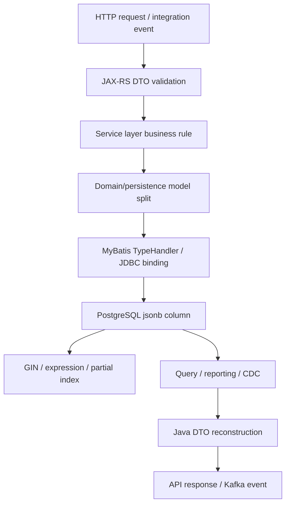

# Part 011 — PostgreSQL JSON and JSONB

JSONB adalah salah satu fitur PostgreSQL yang sangat kuat, tetapi juga salah satu sumber technical debt paling halus di enterprise backend system.

Di tangan yang tepat, JSONB memungkinkan evolusi schema yang lebih fleksibel, penyimpanan configuration/rule/catalog payload yang berubah-ubah, dan hybrid model antara relational integrity dan document-like attribute.

Di tangan yang salah, JSONB berubah menjadi “database tanpa schema” di dalam relational database: sulit divalidasi, sulit diindeks, sulit direport, sulit dimigrasi, dan rawan performance regression.

Untuk engineer Java/JAX-RS + MyBatis, pertanyaan utamanya bukan:

> Bisa tidak menyimpan JSON di PostgreSQL?

Pertanyaan yang lebih penting:

> Bagian mana dari data yang harus tetap relational karena memengaruhi correctness, query, constraint, lifecycle, dan integration contract; dan bagian mana yang cukup aman menjadi JSONB?

Dalam enterprise CPQ/order management, JSONB sering menggoda untuk:

- product attribute;
- pricing rule configuration;
- quote calculation context;
- external integration payload;
- dynamic form/configuration;
- feature flag atau tenant configuration;
- audit detail;
- event payload;
- catalog extension;
- read model payload.

Semua use case itu valid dalam kondisi tertentu. Tetapi JSONB harus diperlakukan sebagai desain arsitektur, bukan shortcut migration.

---

## 1. Core mental model

PostgreSQL memiliki dua tipe utama untuk data JSON:

| Tipe | Mental model | Kapan relevan |
|---|---|---|
| `json` | Menyimpan teks JSON dan memvalidasi bahwa input valid JSON | Ketika fidelity teks asli penting |
| `jsonb` | Menyimpan representasi binary yang sudah diproses | Hampir semua use case query/index/manipulasi JSON |

Dalam aplikasi backend, default yang paling sering benar adalah `jsonb`, bukan `json`.

Alasannya:

- `jsonb` mendukung indexing yang lebih praktis;
- operator pencarian lebih banyak dipakai secara production;
- equality dan containment lebih berguna;
- whitespace/order key tidak dipertahankan seperti teks asli;
- lebih cocok untuk query nested attribute.

Tetapi `jsonb` bukan pengganti relational modelling.

Relational column memberi:

- type constraint;
- NOT NULL;
- foreign key;
- unique constraint;
- check constraint;
- stable query plan;
- clearer statistics;
- easier migration;
- easier reporting;
- easier review.

JSONB memberi:

- flexibility;
- payload extensibility;
- nested representation;
- optional attributes;
- per-tenant/per-product variability;
- easier backward-compatible envelope;
- integration payload preservation.

Senior engineer harus bisa menyeimbangkan keduanya.

---

## 2. Lifecycle JSONB dalam Java/JAX-RS system



Risk muncul ketika salah satu boundary tidak jelas:

- API menerima payload bebas tanpa validation;
- service layer tidak tahu field mana yang wajib;
- MyBatis menyimpan `Map<String, Object>` tanpa contract;
- database tidak punya check constraint minimal;
- query mengakses nested key tanpa index;
- downstream consumer menganggap key selalu ada;
- migration mengubah struktur JSON tanpa compatibility plan.

JSONB bukan hanya format data. JSONB adalah contract lintas layer.

---

## 3. JSON vs JSONB secara praktis

### `json`

`json` menyimpan input text JSON.

Karakteristik:

- validasi bahwa input adalah JSON valid;
- mempertahankan whitespace dan key order;
- parsing dilakukan saat operasi;
- indexing untuk query umum tidak sekuat `jsonb`;
- jarang menjadi pilihan utama untuk application state.

Use case yang relatif masuk akal:

- menyimpan payload mentah untuk audit forensic;
- perlu mempertahankan representasi original;
- jarang/query tidak berdasarkan isi JSON.

### `jsonb`

`jsonb` menyimpan representasi binary yang dinormalisasi.

Karakteristik:

- key order tidak dipertahankan;
- duplicate key dapat hilang sesuai representasi akhir;
- mendukung containment query;
- mendukung GIN index;
- cocok untuk query nested attribute;
- cocok untuk hybrid relational-document pattern.

Use case yang umum:

- product/catalog attributes;
- dynamic rule/config;
- event payload envelope;
- optional integration metadata;
- read model denormalized payload;
- audit detail yang perlu dicari sebagian.

Rule praktis:

> Gunakan `jsonb` ketika aplikasi perlu membaca, mencari, memfilter, atau mengindeks isi JSON. Gunakan `json` hanya ketika bentuk teks original lebih penting daripada queryability.

---

## 4. Kapan JSONB tepat

JSONB cocok jika attribute:

- bervariasi antar product/tenant/integration;
- tidak selalu ada;
- berubah lebih cepat dari core schema;
- lebih sering dibaca sebagai payload utuh;
- hanya sebagian kecil key yang difilter;
- tidak menjadi foreign key target;
- tidak menjadi basis state machine utama;
- tidak perlu unique constraint kompleks;
- bisa divalidasi di application layer atau check constraint terbatas;
- punya versioned schema contract.

Contoh relatif sehat:

```sql
CREATE TABLE product_offering_extension (
    product_offering_id uuid PRIMARY KEY,
    tenant_id uuid NOT NULL,
    attributes jsonb NOT NULL,
    schema_version integer NOT NULL,
    created_at timestamptz NOT NULL DEFAULT now(),
    updated_at timestamptz NOT NULL DEFAULT now(),
    CHECK (jsonb_typeof(attributes) = 'object')
);
```

Kenapa ini lebih sehat:

- identity dan ownership tetap relational;
- tenant tetap relational;
- schema version eksplisit;
- payload JSONB dibatasi minimal sebagai object;
- field operasional tetap queryable.

---

## 5. Kapan JSONB tidak tepat

JSONB berbahaya jika dipakai untuk data yang seharusnya relational.

Hindari JSONB untuk:

- primary identifier;
- foreign key relationship;
- state utama order/quote;
- money/price yang perlu constraint dan aggregation;
- lifecycle timestamp penting;
- tenant identifier;
- frequently filtered column;
- frequently joined value;
- value yang harus unique;
- permission/security boundary;
- PII tanpa classification;
- data yang menjadi contract utama antar service.

Anti-pattern:

```sql
CREATE TABLE quote (
    id uuid PRIMARY KEY,
    data jsonb NOT NULL
);
```

Lalu seluruh aplikasi melakukan:

```sql
WHERE data->>'tenantId' = ?
  AND data->>'status' = ?
  AND data->>'customerId' = ?
```

Masalahnya:

- tenant isolation tersembunyi;
- status tidak punya enum/check constraint;
- customer relationship tidak punya FK;
- statistics lemah;
- index harus expression-based;
- query readability buruk;
- migration sulit;
- audit dan reporting mahal;
- correctness bergantung pada disiplin aplikasi.

Versi lebih sehat:

```sql
CREATE TABLE quote (
    id uuid PRIMARY KEY,
    tenant_id uuid NOT NULL,
    customer_id uuid NOT NULL,
    status text NOT NULL,
    quote_number text NOT NULL,
    calculation_context jsonb NOT NULL,
    created_at timestamptz NOT NULL DEFAULT now(),
    updated_at timestamptz NOT NULL DEFAULT now(),
    CHECK (status IN ('DRAFT', 'SUBMITTED', 'APPROVED', 'REJECTED', 'EXPIRED')),
    CHECK (jsonb_typeof(calculation_context) = 'object')
);
```

Core lifecycle tetap relational. Context yang memang fleksibel disimpan sebagai JSONB.

---

## 6. Hybrid relational + JSONB model

Pattern paling berguna di enterprise system adalah hybrid model.

```text
Relational columns:
  - identity
  - ownership
  - tenant
  - lifecycle state
  - key dates
  - foreign keys
  - money/currency when aggregated
  - searchable dimensions
  - compliance-sensitive classification

JSONB columns:
  - optional attributes
  - integration details
  - calculation trace
  - UI configuration
  - rule payload
  - immutable snapshot extension
  - future-compatible metadata
```

Contoh quote item:

```sql
CREATE TABLE quote_item (
    id uuid PRIMARY KEY,
    quote_id uuid NOT NULL REFERENCES quote(id),
    tenant_id uuid NOT NULL,
    product_offering_id uuid NOT NULL,
    quantity numeric(18, 4) NOT NULL CHECK (quantity > 0),
    unit_price numeric(18, 4) NOT NULL CHECK (unit_price >= 0),
    currency_code char(3) NOT NULL,
    status text NOT NULL,
    pricing_snapshot jsonb NOT NULL,
    attributes jsonb NOT NULL DEFAULT '{}'::jsonb,
    created_at timestamptz NOT NULL DEFAULT now(),
    updated_at timestamptz NOT NULL DEFAULT now(),
    CHECK (jsonb_typeof(pricing_snapshot) = 'object'),
    CHECK (jsonb_typeof(attributes) = 'object')
);
```

`unit_price`, `currency_code`, `quantity`, dan `status` tidak disembunyikan di JSONB karena sering dipakai untuk correctness dan query. `pricing_snapshot` bisa JSONB karena snapshot pricing mungkin kompleks dan perlu dipertahankan sebagai historical evidence.

---

## 7. JSONB operators yang sering dipakai

Contoh table:

```sql
CREATE TABLE product_config (
    id uuid PRIMARY KEY,
    tenant_id uuid NOT NULL,
    product_code text NOT NULL,
    config jsonb NOT NULL
);
```

### Access field sebagai JSON

```sql
SELECT config -> 'pricing'
FROM product_config;
```

`->` mengembalikan JSON/JSONB value.

### Access field sebagai text

```sql
SELECT config ->> 'billingCycle'
FROM product_config;
```

`->>` mengembalikan text.

Ini sering dipakai di WHERE:

```sql
SELECT id
FROM product_config
WHERE config ->> 'billingCycle' = 'MONTHLY';
```

### Nested access

```sql
SELECT config #> '{pricing,discounts}'
FROM product_config;

SELECT config #>> '{pricing,currency}'
FROM product_config;
```

### Containment

```sql
SELECT id
FROM product_config
WHERE config @> '{"billingCycle": "MONTHLY"}'::jsonb;
```

`@>` berarti JSONB kiri mengandung JSONB kanan.

### Key existence

```sql
SELECT id
FROM product_config
WHERE config ? 'billingCycle';
```

Untuk array key:

```sql
SELECT id
FROM product_config
WHERE config ?| array['billingCycle', 'contractTerm'];
```

Semua key:

```sql
SELECT id
FROM product_config
WHERE config ?& array['billingCycle', 'contractTerm'];
```

---

## 8. JSON path

JSON path berguna untuk query nested yang lebih ekspresif.

Contoh:

```sql
SELECT id
FROM product_config
WHERE config @@ '$.pricing.amount > 100';
```

Atau:

```sql
SELECT jsonb_path_query(config, '$.pricing.discounts[*]')
FROM product_config;
```

Gunakan JSON path dengan hati-hati:

- query bisa sulit dibaca di mapper;
- tidak semua expression mudah dioptimalkan;
- index support bergantung operator dan operator class;
- dynamic JSON path raw string bisa membuka injection-style bug jika dirangkai sembarangan.

Dalam MyBatis, hindari membuat JSON path dari input user tanpa whitelist.

Bad:

```xml
<select id="findByDynamicJsonPath" resultType="ProductConfig">
  SELECT *
  FROM product_config
  WHERE config @@ '${jsonPath}'
</select>
```

Better:

```java
enum ProductConfigFilter {
    BILLING_CYCLE,
    CONTRACT_TERM,
    REGION
}
```

Lalu mapper memilih SQL fragment dari whitelist, bukan raw user input.

---

## 9. JSONB indexing strategy

### 9.1 GIN index pada seluruh JSONB

```sql
CREATE INDEX idx_product_config_config_gin
ON product_config
USING gin (config);
```

Cocok untuk containment dan key existence query yang bervariasi.

Trade-off:

- index bisa besar;
- write overhead meningkat;
- tidak semua query memanfaatkannya;
- update JSONB dapat memicu maintenance index mahal;
- cardinality/selectivity tetap perlu dicek dengan `EXPLAIN ANALYZE`.

### 9.2 `jsonb_ops` vs `jsonb_path_ops`

Default GIN operator class untuk JSONB adalah `jsonb_ops`. Operator class `jsonb_path_ops` mendukung lebih sedikit operator, tetapi dapat lebih kecil dan lebih cepat untuk containment-style query tertentu.

Contoh:

```sql
CREATE INDEX idx_product_config_config_path_ops
ON product_config
USING gin (config jsonb_path_ops);
```

Decision rule:

| Query pattern | Kandidat index |
|---|---|
| Banyak operator JSONB berbeda | default `jsonb_ops` |
| Dominan containment `@>` | evaluasi `jsonb_path_ops` |
| Filter key tertentu berulang | expression index |
| Filter hanya subset rows | partial expression index |
| Sorting by extracted value | expression index + tipe sesuai |

Jangan memilih operator class hanya karena “lebih cepat”. Pilih berdasarkan operator yang benar-benar digunakan.

### 9.3 Expression index pada key tertentu

Jika query sering memfilter field tertentu:

```sql
CREATE INDEX idx_product_config_billing_cycle
ON product_config ((config ->> 'billingCycle'));
```

Query:

```sql
SELECT id
FROM product_config
WHERE config ->> 'billingCycle' = 'MONTHLY';
```

Ini sering lebih tepat daripada GIN seluruh document jika field itu hot path.

### 9.4 Expression index dengan casting

Jika value numerik tersimpan di JSONB:

```sql
CREATE INDEX idx_product_config_contract_term_months
ON product_config (((config ->> 'contractTermMonths')::integer));
```

Query harus match expression:

```sql
SELECT id
FROM product_config
WHERE (config ->> 'contractTermMonths')::integer >= 12;
```

Risk:

- cast gagal jika data tidak valid;
- query bisa error karena satu row buruk;
- constraint/validation harus menjamin format.

Tambahkan check constraint jika field wajib valid:

```sql
ALTER TABLE product_config
ADD CONSTRAINT chk_contract_term_months_numeric
CHECK (
    NOT (config ? 'contractTermMonths')
    OR (config ->> 'contractTermMonths') ~ '^[0-9]+$'
);
```

### 9.5 Partial index

Jika hanya sebagian row butuh index:

```sql
CREATE INDEX idx_product_config_enterprise_region
ON product_config ((config ->> 'region'))
WHERE product_code LIKE 'ENT-%';
```

Cocok saat:

- hanya status tertentu yang sering dicari;
- hanya tenant tertentu tidak boleh menjadi alasan utama, tetapi bisa jadi subset operasional;
- hanya row active/current yang dipakai API hot path.

Contoh:

```sql
CREATE INDEX idx_quote_active_external_ref
ON quote ((metadata ->> 'externalRef'))
WHERE status IN ('DRAFT', 'SUBMITTED', 'APPROVED');
```

---

## 10. JSONB statistics dan planner limitation

Planner lebih mudah memahami column relational biasa daripada nested JSONB field.

Jika query penting memakai:

```sql
WHERE config ->> 'billingCycle' = 'MONTHLY'
```

planner perlu memperkirakan selectivity expression tersebut. Untuk hot path, expression index bisa membantu, tetapi tetap perlu validasi plan.

Gunakan:

```sql
EXPLAIN (ANALYZE, BUFFERS)
SELECT id
FROM product_config
WHERE config ->> 'billingCycle' = 'MONTHLY';
```

Yang dicari:

- apakah index digunakan;
- actual rows vs estimated rows;
- buffer read/hit;
- apakah function/cast membuat index tidak dipakai;
- apakah query melakukan seq scan pada tabel besar.

Jika field JSONB menjadi filter utama di banyak endpoint, itu sinyal kuat bahwa field tersebut mungkin harus dipromosikan menjadi column relational.

---

## 11. JSONB mutation

PostgreSQL menyediakan fungsi seperti `jsonb_set` untuk update nested field.

Contoh:

```sql
UPDATE product_config
SET config = jsonb_set(
    config,
    '{pricing,currency}',
    '"USD"'::jsonb,
    true
)
WHERE id = $1;
```

Masalah production:

- update JSONB mengganti nilai column secara logis;
- row version baru dibuat karena MVCC;
- index terkait JSONB perlu di-maintain;
- update field kecil dalam JSONB besar tetap bisa mahal;
- concurrent update pada field berbeda tetap konflik pada row yang sama;
- WAL bisa besar;
- TOAST bisa terlibat untuk JSONB besar.

Jika aplikasi sering update nested key berbeda secara concurrent, JSONB besar di satu row bisa menjadi hot row.

Contoh buruk:

```text
tenant_config row tunggal
  config jsonb besar
  banyak endpoint update key berbeda
  semua update menunggu row lock yang sama
```

Solusi yang lebih sehat:

- pecah config menjadi beberapa row/domain;
- relational table untuk config yang sering berubah;
- optimistic locking dengan version;
- event-sourced config change jika perlu audit kuat;
- batasi ukuran JSONB.

---

## 12. JSONB dan MVCC/locking

JSONB tetap berada dalam row PostgreSQL. Artinya concurrency mengikuti row-level MVCC/locking, bukan path-level locking.

Jika dua transaksi update key berbeda di JSONB row yang sama:

```text
T1 update config.pricing.currency
T2 update config.ui.theme
```

Mereka tetap konflik pada row yang sama.

Pattern berisiko:

```sql
UPDATE tenant_config
SET config = jsonb_set(config, '{featureA}', 'true'::jsonb)
WHERE tenant_id = $1;
```

Jika semua config tenant berada dalam satu row dan banyak proses update config, row tersebut bisa menjadi hotspot.

Untuk Java/JAX-RS:

- jangan lakukan read-modify-write JSONB besar tanpa version check;
- gunakan optimistic locking untuk config update;
- jangan mengambil JSON lama, modify di Java, lalu overwrite seluruh JSON tanpa mendeteksi concurrent change;
- pertimbangkan patch semantic yang jelas.

Contoh optimistic update:

```sql
UPDATE tenant_config
SET config = jsonb_set(config, '{featureA}', 'true'::jsonb),
    version = version + 1,
    updated_at = now()
WHERE tenant_id = $1
  AND version = $2;
```

Jika affected row = 0, return conflict ke API.

---

## 13. JSONB schema governance

JSONB bukan berarti schema-free. JSONB berarti schema berada di tempat lain.

Kemungkinan lokasi schema:

- Java DTO/class;
- JSON Schema file;
- validation library;
- database check constraint;
- integration contract;
- OpenAPI schema;
- event schema registry;
- documentation;
- migration/backfill logic.

Governance minimal untuk JSONB production:

```text
For every JSONB column:
  - owner jelas
  - use case jelas
  - schema version jelas
  - required keys jelas
  - allowed evolution jelas
  - validation location jelas
  - indexed keys jelas
  - PII classification jelas
  - migration strategy jelas
  - compatibility strategy jelas
```

Tambahkan `schema_version` jika struktur bisa berubah:

```sql
ALTER TABLE product_config
ADD COLUMN config_schema_version integer NOT NULL DEFAULT 1;
```

Atau simpan di envelope JSON:

```json
{
  "schemaVersion": 2,
  "pricing": {
    "currency": "USD",
    "billingCycle": "MONTHLY"
  }
}
```

Namun schema version sebagai relational column lebih mudah difilter dan dimigrasi.

---

## 14. Backward-compatible JSON evolution

Perubahan JSONB harus mengikuti rule evolusi contract.

Safe changes:

- menambah optional field;
- menambah field dengan default di reader;
- menambah nested object optional;
- menambah enum value jika consumer siap;
- menyimpan field baru tetapi tetap membaca field lama sementara.

Risky changes:

- rename key;
- menghapus key;
- mengubah type value;
- mengubah semantic field;
- memindahkan nested path;
- mengubah enum value;
- mengubah unit/currency/timezone;
- mengubah array menjadi object atau sebaliknya.

Expand-contract untuk JSONB:

```text
1. Reader supports old + new structure.
2. Writer starts writing both or new structure with fallback.
3. Backfill old rows.
4. Validate no old structure remains.
5. Remove old reader path.
6. Remove old writer compatibility.
```

Contoh rename `billingCycle` ke `billing_period`:

Buruk:

```sql
UPDATE product_config
SET config = config - 'billingCycle' || jsonb_build_object('billing_period', config -> 'billingCycle');
```

Tanpa compatibility, versi lama aplikasi bisa rusak.

Lebih aman:

```text
Release A:
  read billing_period, fallback billingCycle
  write both billing_period and billingCycle

Backfill:
  populate billing_period for all old rows

Release B:
  read billing_period only after validation
  stop writing billingCycle

Cleanup:
  remove billingCycle after old app versions impossible running
```

---

## 15. JSONB and MyBatis/JDBC integration

### 15.1 Binding JSONB safely

Dengan PostgreSQL JDBC, JSONB biasanya dibind menggunakan `PGobject` atau TypeHandler custom.

Contoh konsep TypeHandler:

```java
public final class JsonbTypeHandler extends BaseTypeHandler<JsonNode> {
    @Override
    public void setNonNullParameter(
            PreparedStatement ps,
            int i,
            JsonNode parameter,
            JdbcType jdbcType
    ) throws SQLException {
        PGobject jsonObject = new PGobject();
        jsonObject.setType("jsonb");
        jsonObject.setValue(parameter.toString());
        ps.setObject(i, jsonObject);
    }

    @Override
    public JsonNode getNullableResult(ResultSet rs, String columnName) throws SQLException {
        String value = rs.getString(columnName);
        return value == null ? null : parse(value);
    }

    private JsonNode parse(String value) {
        // use ObjectMapper; handle exception deliberately
        throw new UnsupportedOperationException("example only");
    }
}
```

Production concerns:

- serialization/deserialization exception harus dipetakan jelas;
- unknown field policy harus eksplisit;
- date/time dalam JSON harus distandardisasi;
- numeric precision harus dijaga;
- jangan simpan money sebagai floating number tanpa policy;
- jangan menerima arbitrary JSON tanpa size limit.

### 15.2 MyBatis mapper untuk JSONB filter

```xml
<select id="findByBillingCycle" resultMap="ProductConfigResultMap">
  SELECT id, tenant_id, product_code, config
  FROM product_config
  WHERE tenant_id = #{tenantId}
    AND config ->> 'billingCycle' = #{billingCycle}
  ORDER BY product_code
  LIMIT #{limit}
</select>
```

Aman karena value dibind sebagai parameter.

Berbahaya:

```xml
WHERE config ->> '${key}' = #{value}
```

Key tidak bisa selalu dibind seperti value. Jika perlu dynamic key, gunakan whitelist di Java dan generate SQL fragment dari enum yang terkendali.

---

## 16. JSONB and SQL injection-like risk

SQL injection bukan hanya soal value. Dynamic identifier, operator, path, dan ORDER BY juga berisiko.

Risky inputs:

- JSON key;
- JSON path expression;
- sort field;
- operator;
- containment object string;
- raw filter expression.

Bad:

```xml
<select id="searchByJsonPath" resultType="ProductConfig">
  SELECT *
  FROM product_config
  WHERE config @@ '${jsonPath}'
</select>
```

Better:

```text
Input: filterType = BILLING_CYCLE
Application maps it to static SQL:
  config ->> 'billingCycle' = #{value}
```

Rule:

> JSONB flexibility must not turn user input into SQL syntax.

---

## 17. JSONB for product catalog/rules/config

Dalam CPQ, product catalog dan pricing rule sering punya variasi besar.

JSONB bisa berguna untuk:

- non-core product attributes;
- UI metadata;
- eligibility rule parameters;
- integration-specific metadata;
- calculation trace;
- immutable pricing snapshot;
- quote configuration snapshot.

Tetapi tetap pisahkan:

| Data | Lebih cocok |
|---|---|
| product offering id | relational column |
| product code | relational column |
| effective date | relational column |
| currency | relational column jika difilter/diaggregasi |
| base price | relational column jika dihitung/direport |
| optional display attributes | JSONB |
| complex calculation trace | JSONB |
| integration-specific metadata | JSONB |
| variable rule parameters | JSONB dengan schema version |

Contoh pricing snapshot:

```json
{
  "schemaVersion": 3,
  "catalogVersion": "2026-Q3",
  "priceComponents": [
    {
      "code": "BASE_MONTHLY",
      "amount": "49.99",
      "currency": "USD"
    },
    {
      "code": "LOYALTY_DISCOUNT",
      "amount": "-5.00",
      "currency": "USD"
    }
  ],
  "rulesApplied": ["LOYALTY_24M", "REGION_US"],
  "calculatedAt": "2026-07-11T10:15:30Z"
}
```

Catatan:

- money sebagai string sering lebih aman untuk precision dalam JSON;
- currency tetap eksplisit;
- calculatedAt gunakan UTC;
- schemaVersion dan catalogVersion membantu audit.

---

## 18. JSONB and CDC/outbox

JSONB sering dipakai untuk event payload di outbox table.

Contoh:

```sql
CREATE TABLE outbox_event (
    id uuid PRIMARY KEY,
    aggregate_type text NOT NULL,
    aggregate_id uuid NOT NULL,
    event_type text NOT NULL,
    event_version integer NOT NULL,
    payload jsonb NOT NULL,
    status text NOT NULL,
    created_at timestamptz NOT NULL DEFAULT now(),
    published_at timestamptz
);
```

Ini pattern yang masuk akal karena event payload memang contract eksternal/antar service dan sering perlu evolution.

Tetapi harus ada governance:

- event_version jelas;
- payload schema terdokumentasi;
- backward/forward compatibility;
- PII classification;
- payload size limit;
- idempotency key/correlation id;
- event replay compatibility.

Jika memakai Debezium/CDC, pikirkan:

- payload JSONB akan muncul dalam change event;
- perubahan struktur payload memengaruhi consumer;
- large JSONB meningkatkan volume WAL/change stream;
- update kecil tetap bisa terlihat sebagai perubahan column besar;
- schema registry mungkin tidak memahami struktur dalam JSONB tanpa custom contract.

---

## 19. JSONB performance pitfalls

### Pitfall 1 — Semua data dimasukkan ke JSONB

Efek:

- query sulit dioptimalkan;
- constraint hilang;
- reporting mahal;
- migration sulit.

Solusi:

- promote hot fields ke relational column;
- gunakan JSONB hanya untuk flexible extension.

### Pitfall 2 — GIN index besar tanpa query pattern jelas

Efek:

- write latency naik;
- storage naik;
- vacuum/index maintenance berat.

Solusi:

- ukur dengan `pg_stat_user_indexes`;
- cek `EXPLAIN ANALYZE`;
- pilih expression/partial index untuk hot path.

### Pitfall 3 — Cast nested value tanpa validation

```sql
WHERE (config ->> 'term')::integer > 12
```

Jika ada row `term = "N/A"`, query error.

Solusi:

- check constraint;
- data cleanup;
- generated column jika field penting;
- promote to relational column.

### Pitfall 4 — JSONB besar sering diupdate

Efek:

- row bloat;
- WAL besar;
- TOAST overhead;
- lock contention;
- GIN maintenance.

Solusi:

- pecah table;
- immutable snapshot;
- append-only history;
- update relational fields terpisah.

### Pitfall 5 — Query JSONB tanpa tenant/status relational filter

Buruk:

```sql
SELECT *
FROM quote
WHERE metadata @> '{"externalStatus": "READY"}'::jsonb;
```

Lebih baik:

```sql
SELECT *
FROM quote
WHERE tenant_id = $1
  AND status = 'SUBMITTED'
  AND metadata @> '{"externalStatus": "READY"}'::jsonb;
```

Relational filter membantu mempersempit search dan menjaga isolation.

---

## 20. Generated column as bridge

Jika JSONB key sering difilter, tetapi masih ingin menyimpan payload utuh, generated column bisa menjadi bridge.

Contoh:

```sql
ALTER TABLE product_config
ADD COLUMN billing_cycle text
GENERATED ALWAYS AS (config ->> 'billingCycle') STORED;

CREATE INDEX idx_product_config_billing_cycle_generated
ON product_config (tenant_id, billing_cycle);
```

Keuntungan:

- query lebih readable;
- statistics lebih baik sebagai column;
- index lebih jelas;
- mapper lebih sederhana;
- bisa menjadi tahap transisi sebelum fully relational.

Trade-off:

- migration lebih kompleks;
- generated expression harus immutable/stable sesuai requirement;
- perubahan struktur JSON bisa memengaruhi generated column;
- tetap perlu governance JSON.

---

## 21. Check constraints for JSONB

PostgreSQL tidak menerapkan JSON Schema secara native sebagai core feature, tetapi check constraint dapat memberi guardrail minimal.

Contoh memastikan object:

```sql
CHECK (jsonb_typeof(config) = 'object')
```

Memastikan key ada:

```sql
CHECK (config ? 'schemaVersion')
```

Memastikan value enum:

```sql
CHECK ((config ->> 'billingCycle') IN ('MONTHLY', 'ANNUAL'))
```

Memastikan numeric string:

```sql
CHECK (
    NOT (config ? 'contractTermMonths')
    OR (config ->> 'contractTermMonths') ~ '^[0-9]+$'
)
```

Hati-hati:

- check constraint terlalu kompleks sulit dibaca;
- constraint dapat memperlambat write;
- constraint harus backward-compatible saat deploy;
- JSONB schema validation berat sebaiknya tetap di application layer atau dedicated validation path.

---

## 22. JSONB and API contract

Dalam JAX-RS API, jangan bocorkan JSONB internal secara mentah tanpa contract.

Bad:

```text
GET /quotes/{id}
returns metadata JSONB directly from database
```

Masalah:

- internal key menjadi public API;
- migration internal menjadi breaking API;
- PII bisa bocor;
- consumer bergantung pada struktur tak terdokumentasi.

Better:

```text
Database JSONB -> service maps to response DTO -> explicit OpenAPI contract
```

Untuk internal service-to-service pun tetap perlu contract. “Internal” bukan alasan untuk payload liar.

---

## 23. JSONB and privacy/security

JSONB sering menjadi tempat data sensitif tersembunyi.

Risiko:

- PII masuk ke metadata tanpa classification;
- log mencetak seluruh JSON;
- CDC mengirim payload ke Kafka tanpa redaction;
- support tooling menampilkan payload penuh;
- masking hanya berlaku pada relational column, bukan nested JSON;
- access control tidak mempertimbangkan nested field.

Checklist privacy:

```text
For every JSONB column:
  - Apakah boleh berisi PII?
  - Apakah ada field sensitif nested?
  - Apakah log mencetak payload penuh?
  - Apakah payload ikut CDC/event?
  - Apakah backup/export/reporting membaca field ini?
  - Apakah redaction/masking mencakup nested keys?
  - Apakah retention/deletion mencakup JSONB?
```

Jika JSONB berisi PII, governance-nya harus sama serius dengan column relational.

---

## 24. Observability for JSONB usage

Yang perlu diamati:

- query latency untuk JSONB filter;
- index usage GIN/expression;
- index size;
- table bloat;
- WAL growth akibat update JSONB besar;
- slow query dengan JSON path;
- temp file akibat sorting/filtering extracted value;
- error cast nested field;
- deserialization error di aplikasi;
- payload size distribution.

Query eksplorasi index size:

```sql
SELECT
    schemaname,
    tablename,
    indexname,
    pg_size_pretty(pg_relation_size(indexrelid)) AS index_size
FROM pg_stat_user_indexes
WHERE indexname LIKE '%json%'
   OR indexname LIKE '%gin%'
ORDER BY pg_relation_size(indexrelid) DESC;
```

Cek JSONB column size:

```sql
SELECT
    percentile_disc(0.50) WITHIN GROUP (ORDER BY pg_column_size(config)) AS p50_size,
    percentile_disc(0.95) WITHIN GROUP (ORDER BY pg_column_size(config)) AS p95_size,
    percentile_disc(0.99) WITHIN GROUP (ORDER BY pg_column_size(config)) AS p99_size
FROM product_config;
```

Ukuran JSONB penting karena memengaruhi IO, memory, WAL, network, dan response size.

---

## 25. Debugging JSONB issue

### Scenario A — Query JSONB lambat

Langkah:

1. Ambil SQL final dari MyBatis/log.
2. Jalankan `EXPLAIN (ANALYZE, BUFFERS)` di environment aman.
3. Cek apakah filter JSONB memakai index.
4. Cek actual rows vs estimated rows.
5. Cek apakah relational filter cukup selektif.
6. Cek ukuran JSONB dan index.
7. Evaluasi expression/partial index atau promote field ke column.

### Scenario B — API error karena JSON deserialization

Langkah:

1. Ambil row bermasalah.
2. Cek schema version.
3. Cek field missing/type mismatch.
4. Cek deploy version writer vs reader.
5. Cek migration/backfill belum selesai.
6. Tambahkan fallback reader jika compatibility issue.

### Scenario C — Concurrent update hilang

Langkah:

1. Cek apakah app read-modify-write seluruh JSON.
2. Cek version column.
3. Cek affected rows pada optimistic update.
4. Cek lock wait/hot row.
5. Pecah JSON/config jika update path berbeda sering konflik.

### Scenario D — CDC consumer rusak

Langkah:

1. Cek event/schema version.
2. Cek perubahan payload JSONB.
3. Cek backward compatibility.
4. Cek consumer yang tidak tolerate unknown/missing field.
5. Cek replay behaviour.

---

## 26. PR review checklist

Gunakan checklist ini saat review perubahan yang menyentuh JSONB.

### Modelling

- Apakah field ini seharusnya relational column?
- Apakah data ini perlu FK/unique/check constraint?
- Apakah field ini sering difilter, di-join, di-sort, atau direport?
- Apakah JSONB hanya dipakai untuk optional/flexible payload?
- Apakah schema version jelas?

### Query and index

- Query JSONB apa yang akan hot path?
- Apakah ada `EXPLAIN ANALYZE`?
- Apakah index sesuai operator?
- Apakah perlu GIN, expression index, partial index, atau generated column?
- Apakah index write overhead diterima?

### Java/MyBatis

- Apakah TypeHandler jelas?
- Apakah serialization/deserialization error ditangani?
- Apakah dynamic JSON key/path memakai whitelist?
- Apakah value dibind aman dengan `#{}`?
- Apakah DTO validation cukup?

### Migration

- Apakah perubahan JSON backward-compatible?
- Apakah perlu expand-contract?
- Apakah perlu backfill?
- Apakah reader mendukung old + new structure?
- Apakah cleanup old key aman?

### Performance

- Berapa ukuran JSONB p95/p99?
- Apakah JSONB sering diupdate?
- Apakah ada GIN index besar?
- Apakah update akan menghasilkan WAL besar?
- Apakah ada hot row risk?

### Security/privacy

- Apakah JSONB bisa berisi PII?
- Apakah field nested ikut masking/redaction?
- Apakah payload masuk log/event/CDC?
- Apakah access control mempertimbangkan field nested?
- Apakah retention/deletion mencakup JSONB?

### Observability

- Apakah slow query log bisa mengidentifikasi query JSONB?
- Apakah index usage bisa dipantau?
- Apakah payload size dipantau?
- Apakah deserialization error punya metric/log?
- Apakah migration compatibility error terdeteksi?

---

## 27. Internal verification checklist

Cek hal-hal berikut di internal CSG/team, tanpa mengasumsikan detail yang belum diverifikasi:

### Schema and usage

- Kolom `json`/`jsonb` apa saja yang ada di schema aktual?
- Untuk setiap JSONB column, siapa owner-nya?
- Apakah JSONB dipakai untuk catalog, quote, order, config, audit, event, atau integration payload?
- Apakah ada JSONB yang menyimpan tenant/customer/status/price yang seharusnya relational?
- Apakah ada schema version untuk JSONB penting?

### MyBatis/JDBC

- TypeHandler apa yang dipakai untuk JSONB?
- Apakah mapper memakai dynamic JSON key/path?
- Apakah ada penggunaan `${}` di query JSONB?
- Apakah ObjectMapper config konsisten?
- Apakah deserialization error dipetakan ke domain/technical error yang jelas?

### Index and performance

- GIN index apa saja yang ada?
- Apakah memakai `jsonb_ops` atau `jsonb_path_ops`?
- Apakah ada expression index pada JSONB key?
- Apakah index digunakan menurut `pg_stat_user_indexes` dan `EXPLAIN`?
- Apakah ada slow query yang memfilter nested JSONB?

### Migration and compatibility

- Bagaimana perubahan struktur JSONB dilakukan?
- Apakah ada expand-contract process?
- Apakah backfill JSONB pernah gagal?
- Apakah old app version bisa membaca new JSONB payload?
- Apakah event payload JSONB punya versioning?

### Security/privacy

- Apakah JSONB column bisa berisi PII?
- Apakah log redaction mencakup nested JSON?
- Apakah CDC/Kafka payload mengandung JSONB sensitif?
- Apakah support/export/reporting tools membuka JSONB penuh?
- Apakah retention/deletion policy mencakup JSONB?

### Operations

- Apakah ada dashboard payload size/index size?
- Apakah JSONB update menyebabkan WAL growth?
- Apakah ada table bloat dari update JSONB besar?
- Apakah ada incident terkait JSON payload compatibility?
- Apakah DBA/SRE punya policy tentang GIN index dan JSONB usage?

---

## 28. Summary mental model

JSONB adalah alat untuk fleksibilitas, bukan izin untuk menghapus modelling discipline.

Gunakan relational column untuk data yang menjadi:

- identity;
- ownership;
- relationship;
- lifecycle state;
- tenant boundary;
- frequently queried dimension;
- financial correctness;
- security/privacy boundary;
- reporting dimension.

Gunakan JSONB untuk data yang:

- optional;
- bervariasi;
- extensible;
- snapshot-like;
- integration-specific;
- jarang difilter;
- punya schema governance;
- punya compatibility strategy.

Rule senior engineer:

> JSONB yang sehat adalah JSONB yang tetap punya owner, schema, version, validation, index strategy, migration path, privacy classification, dan observability.

Jika tidak, JSONB hanya memindahkan technical debt dari migration file ke production incident.

---

## References

- PostgreSQL Documentation — JSON Types: https://www.postgresql.org/docs/current/datatype-json.html
- PostgreSQL Documentation — JSON Functions and Operators: https://www.postgresql.org/docs/current/functions-json.html
- PostgreSQL Documentation — GIN Indexes: https://www.postgresql.org/docs/current/gin.html
- PostgreSQL Documentation — Index Types: https://www.postgresql.org/docs/current/indexes-types.html
