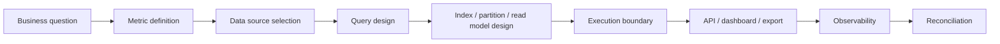

# Part 015 — Analytical and OLAP-Oriented Patterns

PostgreSQL sering dipakai sebagai database transaksi.

Namun dalam enterprise product, database transaksi hampir selalu ikut dipakai untuk kebutuhan analitik:

- dashboard order volume;
- quote conversion rate;
- approval SLA;
- fulfilment status summary;
- revenue estimate;
- product catalog usage;
- failed order trend;
- operational monitoring;
- customer support search;
- reconciliation report;
- audit export;
- backlog and ageing report.

Masalahnya bukan karena query analytics itu salah.

Masalahnya adalah ketika analytical workload diperlakukan sama seperti OLTP workload.

OLTP query biasanya kecil, selective, dan latency-sensitive.

OLAP/reporting query biasanya besar, scan-heavy, aggregation-heavy, sort-heavy, dan kadang toleran terhadap stale data.

Kalau keduanya dicampur tanpa boundary, production failure-nya sering terlihat seperti ini:

- endpoint transaksi tiba-tiba lambat karena dashboard scan table besar;
- CPU database naik karena aggregation mahal;
- query membuat temp file besar karena sort/hash tidak muat memory;
- connection pool habis karena export report berjalan lama;
- autovacuum tertahan oleh long-running reporting transaction;
- read replica lag karena query berat;
- materialized view stale tetapi dianggap real-time;
- report salah karena join ke mutable domain table tanpa snapshot semantics;
- dashboard query memakai `offset` besar;
- MyBatis mapper mengembalikan jutaan row ke memory aplikasi;
- support membuat ad-hoc query di production tanpa limit dan timeout.

Senior backend engineer tidak harus menjadi data warehouse engineer.

Tetapi harus mampu membedakan:

- query transaksi;
- query operasional;
- query reporting;
- query analytical;
- query export;
- query reconciliation;
- read model yang memang disiapkan;
- query yang seharusnya pindah ke warehouse/lake/search platform.

---

## 1. Core mental model

PostgreSQL bisa menjalankan query analitik.

Tetapi PostgreSQL tetap harus dilindungi sebagai system of record untuk transaksi.

Pertanyaan utama bukan:

> Bisa tidak query ini ditulis di PostgreSQL?

Pertanyaan yang lebih benar:

> Apakah query ini aman dijalankan di database transaksi dengan data size, concurrency, SLA, dan operational constraints yang ada?

OLAP-oriented pattern di PostgreSQL berarti menggunakan PostgreSQL untuk membaca data besar secara terstruktur, tetapi tetap menjaga:

- correctness;
- bounded resource usage;
- predictable latency;
- isolation dari request transaksi;
- refresh lifecycle;
- observability;
- rollback strategy;
- failure containment.

---

## 2. OLTP vs OLAP

| Aspect | OLTP | OLAP/reporting |
|---|---|---|
| Goal | Menjalankan transaksi bisnis | Menjawab pertanyaan agregat/histori |
| Query shape | Selective lookup/update | Scan, join, aggregate, sort |
| Latency expectation | Low latency | Bisa lebih lama, tapi bounded |
| Data freshness | Biasanya real-time | Bisa real-time, near-real-time, atau scheduled |
| Rows touched | Sedikit | Banyak |
| Result size | Kecil | Medium/besar/export |
| Concurrency | Banyak request pendek | Lebih sedikit tetapi berat |
| Index pattern | Lookup path | Filter + grouping + sorting + partition pruning |
| Failure impact | User transaction gagal | Dashboard/report/export gagal atau stale |
| Correctness model | Transactional correctness | Metric definition + snapshot correctness |

Contoh OLTP:

```sql
select *
from quote
where quote_id = #{quoteId};
```

Contoh OLAP/reporting:

```sql
select
    date_trunc('day', submitted_at) as submitted_day,
    status,
    count(*) as order_count
from sales_order
where submitted_at >= #{from}
  and submitted_at < #{to}
group by 1, 2
order by 1, 2;
```

Query kedua bisa benar secara SQL, tetapi belum tentu aman untuk production jika:

- `sales_order` sangat besar;
- `submitted_at` tidak indexed atau tidak partitioned;
- rentang tanggal terlalu lebar;
- query berjalan di primary;
- endpoint membuka connection terlalu lama;
- hasil dipakai dashboard yang di-refresh setiap beberapa detik.

---

## 3. Reporting query is not just SQL

Reporting query memiliki lifecycle.



Kalau langsung lompat dari business question ke SQL, biasanya muncul bug seperti:

- metric tidak punya definisi jelas;
- filter tenant tidak konsisten;
- timezone bucket salah;
- cancelled order ikut terhitung;
- quote revision double-counted;
- order item dihitung sebagai order;
- status mutable mengubah histori report;
- join menghilangkan row karena inner join yang salah;
- dashboard angka berbeda dari reconciliation report.

Senior engineer harus memaksa metric definition sebelum query optimization.

Query cepat tetapi salah tetap salah.

---

## 4. Analytical pattern categories

Dalam PostgreSQL-backed backend, analytical patterns biasanya masuk salah satu kategori berikut.

| Pattern | Use case | Data freshness | Risk |
|---|---|---|---|
| Direct query on OLTP tables | Small admin/report query | Real-time | Bisa membebani transaksi |
| Indexed reporting query | Filtered operational dashboard | Real-time | Index/write overhead |
| Read model table | API/dashboard read-heavy | Near-real-time | Data duplication/staleness |
| Materialized view | Aggregated report | Scheduled/on-demand | Stale data/refresh cost |
| Rollup table | Time bucket metrics | Incremental | Reconciliation complexity |
| Export job | CSV/large extract | Async | Long transaction/memory |
| Replica reporting | Heavy read isolation | Replica freshness | Replication lag |
| Warehouse/lake | Cross-service historical analytics | Delayed | Data pipeline ownership |

Tidak ada pattern universal.

Yang penting adalah memilih boundary yang sesuai dengan SLA, data size, dan correctness requirement.

---

## 5. Direct reporting query on OLTP tables

Direct query masih masuk akal jika:

- dataset kecil;
- query selective;
- query hanya untuk internal admin;
- frekuensi rendah;
- range waktu dibatasi;
- index mendukung filter;
- timeout diset;
- hasil terbatas;
- query plan sudah dicek.

Contoh aman relatif:

```sql
select
    order_id,
    status,
    submitted_at,
    customer_id
from sales_order
where tenant_id = #{tenantId}
  and submitted_at >= #{from}
  and submitted_at < #{to}
order by submitted_at desc
limit #{limit};
```

Query ini masih bisa memakai index seperti:

```sql
create index idx_sales_order_tenant_submitted_at
on sales_order (tenant_id, submitted_at desc);
```

Tetapi direct query menjadi berbahaya ketika:

- filter tidak bounded;
- range tanggal default terlalu besar;
- query melakukan aggregation global;
- join banyak table besar;
- dipanggil oleh dashboard auto-refresh;
- query berjalan di request HTTP synchronous tanpa limit waktu;
- tidak ada observability.

### PR review question

Untuk setiap reporting query yang langsung membaca OLTP table, tanyakan:

> Apakah query ini tetap aman saat data 10x lebih besar?

Kalau jawabannya tidak jelas, query itu butuh read model, materialized view, partitioning, replica, atau async job.

---

## 6. Read model pattern

Read model adalah table yang sengaja didesain untuk kebutuhan baca tertentu.

Bukan semua data harus selalu dalam normal form transaksi.

Contoh transaksi normalized:

```text
quote
quote_item
quote_price_component
approval_request
approval_decision
```

Contoh read model:

```sql
create table quote_summary_read_model (
    tenant_id uuid not null,
    quote_id uuid not null,
    quote_number text not null,
    customer_name text not null,
    status text not null,
    total_amount numeric(18,2) not null,
    currency_code char(3) not null,
    submitted_at timestamptz,
    approved_at timestamptz,
    last_updated_at timestamptz not null,
    primary key (tenant_id, quote_id)
);
```

Read model mengorbankan beberapa hal:

- data duplication;
- refresh/update lifecycle;
- possible staleness;
- reconciliation effort;
- extra storage;
- extra write path.

Sebagai gantinya, read path menjadi lebih sederhana:

```sql
select quote_id, quote_number, customer_name, status, total_amount, currency_code
from quote_summary_read_model
where tenant_id = #{tenantId}
  and status = #{status}
order by submitted_at desc
limit #{limit};
```

Read model tepat jika:

- query sering dipanggil;
- join asli terlalu mahal;
- UI/API butuh shape khusus;
- data bisa near-real-time;
- ada lifecycle update yang jelas;
- ada reconciliation query.

Read model buruk jika:

- tidak ada owner;
- tidak ada refresh semantics;
- tidak ada reconciliation;
- semua query dibuat read model tanpa disiplin;
- read model dianggap source of truth.

---

## 7. Denormalized reporting table

Denormalized table mirip read model, tetapi biasanya lebih dekat ke reporting/analytics.

Contoh:

```sql
create table order_reporting_fact (
    tenant_id uuid not null,
    order_id uuid not null,
    order_item_id uuid not null,
    customer_id uuid not null,
    product_offering_id uuid not null,
    order_status text not null,
    item_status text not null,
    submitted_at timestamptz not null,
    submitted_date date not null,
    completed_at timestamptz,
    currency_code char(3) not null,
    recurring_amount numeric(18,2) not null,
    one_time_amount numeric(18,2) not null,
    created_at timestamptz not null default now(),
    updated_at timestamptz not null default now(),
    primary key (tenant_id, order_item_id)
);
```

Keuntungan:

- query report lebih cepat;
- dashboard lebih sederhana;
- join lebih sedikit;
- metric lebih konsisten;
- dapat dipartisi berdasarkan `submitted_date`;
- bisa diindeks sesuai access pattern reporting.

Risiko:

- angka bisa berbeda dari source table;
- update lifecycle harus jelas;
- correction/backfill harus aman;
- late event harus ditangani;
- duplicate fact harus dicegah;
- semantic drift bisa terjadi.

### Rule of thumb

Denormalization bukan pengganti modelling.

Denormalization adalah cache data bisnis yang harus punya:

- owner;
- source-of-truth reference;
- refresh/update rule;
- reconciliation mechanism;
- observability;
- backfill strategy;
- retention policy.

---

## 8. Materialized view pattern

PostgreSQL materialized view menyimpan hasil query secara fisik dan bisa di-refresh kemudian.

Secara mental model:

```text
View              = query definition, executed when referenced
Materialized view = query result stored like table, refreshed explicitly
```

Contoh:

```sql
create materialized view order_daily_status_summary as
select
    tenant_id,
    date_trunc('day', submitted_at)::date as submitted_date,
    status,
    count(*) as order_count
from sales_order
group by tenant_id, date_trunc('day', submitted_at)::date, status;
```

Query API/dashboard:

```sql
select submitted_date, status, order_count
from order_daily_status_summary
where tenant_id = #{tenantId}
  and submitted_date >= #{fromDate}
  and submitted_date < #{toDate}
order by submitted_date, status;
```

Index materialized view seperti table:

```sql
create unique index ux_order_daily_status_summary
on order_daily_status_summary (tenant_id, submitted_date, status);
```

### Refresh lifecycle

```sql
refresh materialized view order_daily_status_summary;
```

Untuk mengurangi blocking pembaca, PostgreSQL mendukung concurrent refresh dengan syarat tertentu. Dalam praktik production, syarat index unik dan detail perilakunya harus dicek terhadap versi PostgreSQL yang digunakan.

```sql
refresh materialized view concurrently order_daily_status_summary;
```

### Kapan cocok

Materialized view cocok jika:

- query mahal tetapi definisinya stabil;
- hasil boleh stale;
- refresh periodik cukup;
- dashboard membaca data agregat;
- source table tidak berubah terlalu sering untuk refresh cost yang tersedia;
- ada index pada materialized view.

### Kapan tidak cocok

Materialized view tidak cocok jika:

- butuh real-time strict;
- refresh penuh terlalu mahal;
- data berubah terus dan besar;
- query definition sering berubah;
- refresh gagal tidak dimonitor;
- staleness tidak dikomunikasikan ke user;
- report butuh correction granular.

### Staleness must be explicit

Tambahkan metadata refresh.

Contoh:

```sql
create table reporting_refresh_state (
    report_name text primary key,
    refreshed_at timestamptz not null,
    refresh_status text not null,
    row_count bigint,
    error_message text
);
```

API bisa mengembalikan:

```json
{
  "data": [...],
  "refreshedAt": "2026-07-11T10:15:00Z",
  "freshness": "SCHEDULED"
}
```

Tanpa freshness metadata, user akan menganggap report sebagai real-time.

---

## 9. Incremental aggregation pattern

Materialized view refresh sering bersifat full refresh.

Untuk table besar, lebih aman memakai incremental aggregation.

Contoh rollup table:

```sql
create table order_daily_rollup (
    tenant_id uuid not null,
    business_date date not null,
    status text not null,
    order_count bigint not null,
    total_amount numeric(18,2) not null,
    updated_at timestamptz not null default now(),
    primary key (tenant_id, business_date, status)
);
```

Update incremental:

```sql
insert into order_daily_rollup (
    tenant_id,
    business_date,
    status,
    order_count,
    total_amount,
    updated_at
)
values (
    #{tenantId},
    #{businessDate},
    #{status},
    #{orderCountDelta},
    #{amountDelta},
    now()
)
on conflict (tenant_id, business_date, status)
do update set
    order_count = order_daily_rollup.order_count + excluded.order_count,
    total_amount = order_daily_rollup.total_amount + excluded.total_amount,
    updated_at = now();
```

Ini cepat, tetapi correctness lebih sulit.

Masalah yang harus dipikirkan:

- Bagaimana jika order berubah status?
- Bagaimana jika order dibatalkan?
- Bagaimana jika amount dikoreksi?
- Bagaimana jika event diproses dua kali?
- Bagaimana jika event datang terlambat?
- Bagaimana jika backfill mengulang data lama?
- Bagaimana reconcile rollup dengan source of truth?

Incremental aggregation harus idempotent atau punya correction model.

Untuk financial/reporting-sensitive metrics, jangan hanya menambah delta tanpa audit dan reconciliation.

---

## 10. Window functions for analytics

Window function berguna untuk analytics tanpa menghilangkan detail row.

Contoh menghitung urutan status change:

```sql
select
    order_id,
    old_status,
    new_status,
    changed_at,
    lag(new_status) over (
        partition by order_id
        order by changed_at
    ) as previous_recorded_status,
    row_number() over (
        partition by order_id
        order by changed_at
    ) as transition_sequence
from order_status_history
where tenant_id = #{tenantId}
  and changed_at >= #{from}
  and changed_at < #{to};
```

Contoh menghitung duration antar state:

```sql
with transitions as (
    select
        order_id,
        new_status,
        changed_at,
        lead(changed_at) over (
            partition by order_id
            order by changed_at
        ) as next_changed_at
    from order_status_history
    where tenant_id = #{tenantId}
)
select
    new_status,
    avg(extract(epoch from (coalesce(next_changed_at, now()) - changed_at))) as avg_seconds_in_status
from transitions
group by new_status;
```

Window function powerful, tetapi bisa mahal karena sering membutuhkan sort besar.

Checklist:

- Apakah `partition by` dan `order by` didukung index?
- Apakah range data dibatasi?
- Apakah query menghasilkan temp file?
- Apakah query cocok untuk request synchronous?
- Apakah hasilnya perlu materialized view?

---

## 11. Star schema-lite thinking

Untuk reporting internal, kadang tidak perlu full data warehouse.

Tetapi fact/dimension thinking tetap berguna.

Fact adalah peristiwa atau ukuran yang dihitung.

Dimension adalah konteks untuk slicing/filtering.

Contoh fact:

- quote submitted;
- quote approved;
- order submitted;
- order item completed;
- approval decision;
- fulfilment failure;
- price component generated.

Contoh dimension:

- tenant;
- customer;
- product offering;
- region;
- channel;
- status;
- business date;
- catalog version.

Star schema-lite table bisa seperti:

```sql
create table order_item_fact (
    tenant_id uuid not null,
    order_item_id uuid not null,
    order_id uuid not null,
    customer_id uuid not null,
    product_offering_id uuid not null,
    channel_code text,
    submitted_date date not null,
    completed_date date,
    status text not null,
    recurring_amount numeric(18,2) not null,
    one_time_amount numeric(18,2) not null,
    primary key (tenant_id, order_item_id)
);
```

Query:

```sql
select
    submitted_date,
    product_offering_id,
    count(*) as item_count,
    sum(recurring_amount) as recurring_amount
from order_item_fact
where tenant_id = #{tenantId}
  and submitted_date >= #{fromDate}
  and submitted_date < #{toDate}
group by submitted_date, product_offering_id
order by submitted_date, product_offering_id;
```

This is not a full warehouse.

It is a deliberate production read model for bounded operational analytics.

---

## 12. Querying large history tables

History tables grow forever unless retention or archival exists.

Examples:

- order status history;
- quote revision history;
- approval history;
- audit log;
- outbox event;
- inbox event;
- integration message log;
- job execution log.

The default bug is to query them like small tables.

Bad:

```sql
select *
from order_status_history
where tenant_id = #{tenantId}
order by changed_at desc;
```

Better:

```sql
select *
from order_status_history
where tenant_id = #{tenantId}
  and changed_at >= #{from}
  and changed_at < #{to}
order by changed_at desc
limit #{limit};
```

Better with partitioning:

```sql
-- Query includes the partition key / time range.
where changed_at >= #{from}
  and changed_at < #{to}
```

For analytical/reporting query, a time predicate is not optional.

It is a safety boundary.

---

## 13. Partition pruning for analytics

Partition pruning means PostgreSQL can ignore partitions that cannot match query predicates.

For analytics over time-series/history data, this is critical.

If a table is partitioned by month on `submitted_at`, this query can prune partitions:

```sql
select status, count(*)
from sales_order
where submitted_at >= timestamp '2026-07-01 00:00:00+00'
  and submitted_at < timestamp '2026-08-01 00:00:00+00'
group by status;
```

This query may not prune effectively:

```sql
select status, count(*)
from sales_order
where date_trunc('month', submitted_at) = date '2026-07-01'
group by status;
```

The second query wraps the partition key in a function.

For partitioned tables, write predicates in a way the planner can reason about.

Prefer range predicates:

```sql
submitted_at >= #{from}
and submitted_at < #{to}
```

Avoid application convenience that destroys planner visibility.

---

## 14. Approximate analytics

Approximate analytics may be useful for exploratory dashboards.

Examples:

- approximate unique customer count;
- approximate active account count;
- approximate volume trend;
- approximate large-table row count.

But approximation is dangerous when used for:

- billing;
- compliance;
- audit;
- contractual SLA;
- financial reconciliation;
- customer-facing numbers with legal meaning.

PostgreSQL core has planner statistics that can estimate row counts, but those are not metric truth.

Extensions can provide approximate algorithms, but allowed extension policy must be verified internally.

### Rule

Approximate analytics must be labelled as approximate and must not silently replace authoritative metrics.

---

## 15. When PostgreSQL is enough

PostgreSQL is often enough when:

- data volume is moderate;
- reports are operational, not enterprise BI-scale;
- query range is bounded;
- partitioning/read model exists;
- refresh schedule is acceptable;
- concurrency is controlled;
- query timeout exists;
- export runs asynchronously;
- observability exists;
- workload is isolated via replica or schedule;
- DBA/SRE agrees capacity is sufficient.

Examples:

- internal operational dashboard;
- support search over recent orders;
- daily status summary;
- SLA ageing queue;
- tenant-level report with date range;
- materialized view refreshed hourly;
- reconciliation query run by controlled job.

---

## 16. When external warehouse/lake is better

Move beyond primary PostgreSQL when:

- queries scan huge history across years;
- reports join many services/domains;
- analysts need ad-hoc exploration;
- dashboards have high concurrency;
- latency tolerance is seconds/minutes but workload is heavy;
- data is append-heavy and historical;
- retention differs from OLTP retention;
- BI tools hit production directly;
- cross-service reporting requires many source systems;
- cost/performance is better in warehouse/lake;
- production DB capacity is threatened.

Possible targets:

- cloud data warehouse;
- data lake/lakehouse;
- CDC pipeline into analytics store;
- Kafka topic to warehouse sink;
- ELT pipeline;
- read replica dedicated for reporting;
- search/index platform for search-like workloads.

The decision is architectural, not only technical.

It changes ownership, freshness, reconciliation, security, and incident response.

---

## 17. Java/JAX-RS API design for reporting

Reporting endpoints must not behave like simple CRUD endpoints.

A report API should define:

- required filters;
- maximum date range;
- tenant boundary;
- pagination strategy;
- max result size;
- timeout;
- freshness semantics;
- async export option;
- correlation ID;
- observability tags;
- authorization boundary;
- privacy constraints.

Bad API:

```http
GET /orders/report
```

Better API:

```http
GET /orders/report?from=2026-07-01&to=2026-07-31&status=SUBMITTED&limit=100
```

Better for heavy exports:

```http
POST /order-reports
Content-Type: application/json

{
  "from": "2026-07-01",
  "to": "2026-07-31",
  "format": "CSV"
}
```

Then return job ID:

```http
202 Accepted
Location: /order-reports/{reportJobId}
```

Heavy reports should often be async.

Do not hold an HTTP request, database connection, and application thread open for a long-running export unless the system is explicitly designed for streaming and cancellation.

---

## 18. MyBatis and JDBC concerns

Reporting query risks in Java are often not SQL-only.

They are result-handling risks.

### Common mistakes

- MyBatis maps millions of rows into a `List`.
- JDBC fetch size is not configured for streaming.
- Connection stays open for entire CSV generation.
- Transaction is not read-only.
- Endpoint has no timeout.
- Mapper has no tenant filter.
- Dynamic SQL allows unbounded range.
- `ORDER BY ${sort}` is not allowlisted.
- `count(*)` is executed repeatedly for pagination.
- Export query runs on primary during peak traffic.

### Safer posture

- Use required filters.
- Use bounded date ranges.
- Use keyset/cursor for large result sets.
- Use streaming carefully.
- Use async job for large export.
- Set statement timeout.
- Set transaction read-only where appropriate.
- Map to dedicated reporting DTO.
- Avoid loading full result set into memory.
- Add query name/comment/correlation where supported by convention.

Example MyBatis guard concept:

```xml
<select id="findOrderReportRows" resultMap="OrderReportRowMap">
  select
    order_id,
    order_number,
    status,
    submitted_at,
    total_amount
  from order_report_read_model
  where tenant_id = #{tenantId}
    and submitted_at >= #{from}
    and submitted_at &lt; #{to}
  order by submitted_at desc, order_id desc
  limit #{limit}
</select>
```

Do not make `from` and `to` optional for large tables.

---

## 19. Production impact of analytical queries

Analytical queries can hurt production in multiple ways.

| Impact | Cause | Symptom |
|---|---|---|
| CPU spike | Aggregation, join, sort | DB CPU high |
| IO spike | Large scan | Disk read high |
| Temp file growth | Sort/hash spills | Temp bytes increase |
| Pool exhaustion | Long-running reports | API timeouts |
| Lock interference | DDL/refresh/backfill | Blocking queries |
| Autovacuum delay | Long transaction | Bloat increases |
| Replica lag | Heavy replica query | stale reads |
| Memory pressure | high `work_mem` × concurrency | OOM risk |
| WAL pressure | refresh/backfill writes | replication lag |
| Cache pollution | full scans | OLTP latency worsens |

A report can be "read-only" and still be production-dangerous.

Read-only does not mean resource-free.

---

## 20. Failure modes

### Failure mode 1: dashboard kills OLTP latency

Cause:

- dashboard runs heavy aggregation on primary every few seconds.

Detection:

- `pg_stat_statements` shows high total time query;
- CPU high;
- cache hit ratio changes;
- OLTP endpoint latency increases.

Fix:

- cache dashboard;
- use materialized view/read model;
- reduce refresh frequency;
- run on replica;
- add required filters;
- set timeout.

---

### Failure mode 2: report is fast but wrong

Cause:

- metric definition unclear;
- join duplicates fact rows;
- status mutation overwrites history;
- timezone bucket wrong;
- cancelled/revised records not excluded.

Detection:

- mismatch with source-of-truth reconciliation;
- different dashboards show different numbers;
- customer/support escalation.

Fix:

- define metric contract;
- use fact table/read model;
- include status lifecycle semantics;
- add reconciliation query;
- document timezone/business date rule.

---

### Failure mode 3: materialized view stale

Cause:

- refresh job failed;
- refresh took too long;
- no freshness metadata;
- API does not expose refreshed_at.

Detection:

- `reporting_refresh_state` old;
- scheduler failure;
- dashboard discrepancy.

Fix:

- track refresh state;
- alert on stale report;
- expose freshness;
- use concurrent refresh if appropriate;
- move to incremental rollup if full refresh too expensive.

---

### Failure mode 4: export loads entire database result into JVM memory

Cause:

- MyBatis returns `List<ReportRow>` for millions of rows.

Detection:

- JVM memory spike;
- GC pressure;
- application OOM;
- long connection hold time.

Fix:

- async export job;
- streaming cursor/fetch size;
- chunked processing;
- output file storage;
- cancellation and timeout.

---

### Failure mode 5: replica report shows stale data

Cause:

- reporting reads from replica;
- replication lag during write spike.

Detection:

- replica lag metric;
- mismatch primary vs replica;
- stale support dashboard.

Fix:

- expose freshness;
- route critical reads to primary;
- bound acceptable lag;
- alert on lag;
- design report as eventually consistent.

---

## 21. Debugging workflow

When an analytical query causes concern:

1. Identify query fingerprint in `pg_stat_statements`.
2. Capture SQL with representative parameters.
3. Run `EXPLAIN (ANALYZE, BUFFERS)` in safe environment if possible.
4. Check estimated vs actual rows.
5. Check whether query spills to temp files.
6. Check index usage and partition pruning.
7. Check date range and tenant filter.
8. Check result cardinality.
9. Check connection duration in app.
10. Check whether query runs on primary or replica.
11. Check whether materialized view/read model can replace it.
12. Check business correctness before optimizing.

Do not tune blind.

A bad analytical query may need a data product boundary, not only an index.

---

## 22. Internal verification checklist

Verify these in CSG/team context before applying assumptions:

- Which reports/dashboard endpoints read primary PostgreSQL directly?
- Are reporting queries tagged or identifiable in logs/`pg_stat_statements`?
- Are BI tools allowed to connect to production PostgreSQL?
- Is there a read replica for reporting?
- Are materialized views used?
- Are refresh jobs monitored?
- Is report freshness exposed to users?
- Are heavy exports synchronous or async?
- Are date ranges bounded by API validation?
- Are report queries tenant-scoped?
- Are slow query logs enabled?
- Are there previous incidents caused by dashboard/report query?
- Are read models built by application writes, jobs, CDC, or triggers?
- Is there a warehouse/lake/analytics platform downstream?
- Are metric definitions documented?
- Are report numbers reconciled against source-of-truth tables?
- Are privacy rules applied to report/export data?
- Are report queries reviewed by DBA/SRE for high-volume paths?

---

## 23. PR review checklist

For analytical/reporting changes, review:

### Correctness

- Is the metric definition explicit?
- Is tenant boundary enforced?
- Is timezone/business date rule explicit?
- Are mutable statuses handled correctly?
- Are quote/order revisions deduplicated?
- Is stale data acceptable and documented?
- Is reconciliation possible?

### Performance

- Is data range bounded?
- Is index/partition strategy aligned?
- Was `EXPLAIN` checked?
- Could sort/hash spill to disk?
- Does query scan large history table?
- Is result size bounded?
- Does API use pagination/async export?

### Operational readiness

- Does query run on primary or replica?
- Is timeout configured?
- Is query observable?
- Is refresh job monitored?
- Is failure visible?
- Is there rollback plan?

### Java/MyBatis

- Does mapper load huge result into memory?
- Are dynamic filters safe?
- Is `ORDER BY` allowlisted?
- Is transaction read-only where applicable?
- Is DTO/report model separate from domain entity?

### Security/privacy

- Does report expose PII?
- Is export access authorized?
- Are logs redacted?
- Is data retention respected?

---

## 24. Senior engineer heuristics

Use these heuristics in architecture discussion:

- A report query is a workload, not just SQL.
- Freshness is a product decision and an engineering contract.
- Real-time dashboards are expensive; ask whether near-real-time is enough.
- Denormalization without reconciliation is future incident debt.
- Materialized view without refresh observability is hidden stale data.
- Read-only query can still take down production.
- Warehouse/lake is not failure avoidance; it is an ownership and pipeline trade-off.
- The fastest incorrect report is still incorrect.
- The safest report query is bounded, observable, and aligned with data ownership.

---

## 25. Practical summary

PostgreSQL can support many operational analytics needs.

But you need clear boundaries:

- direct OLTP table query for small, bounded, low-frequency reads;
- indexed reporting query for operational dashboards;
- read model for high-frequency API/dashboard reads;
- materialized view for scheduled aggregate snapshots;
- rollup table for incremental metrics;
- async export for large result sets;
- replica or warehouse for heavy analytical workload;
- reconciliation for correctness;
- observability for production safety.

In enterprise CPQ/order systems, analytical data is not neutral.

It affects operational decisions, customer support, audit, capacity planning, and sometimes commercial outcomes.

Treat reporting as production engineering.

---

## References

- PostgreSQL Documentation — Materialized Views: https://www.postgresql.org/docs/current/rules-materializedviews.html
- PostgreSQL Documentation — CREATE MATERIALIZED VIEW: https://www.postgresql.org/docs/current/sql-creatematerializedview.html
- PostgreSQL Documentation — Table Partitioning: https://www.postgresql.org/docs/current/ddl-partitioning.html
- PostgreSQL Documentation — EXPLAIN: https://www.postgresql.org/docs/current/using-explain.html
