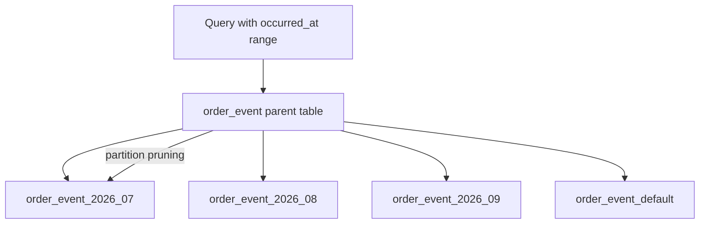
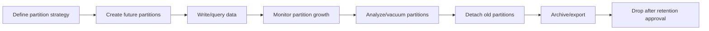
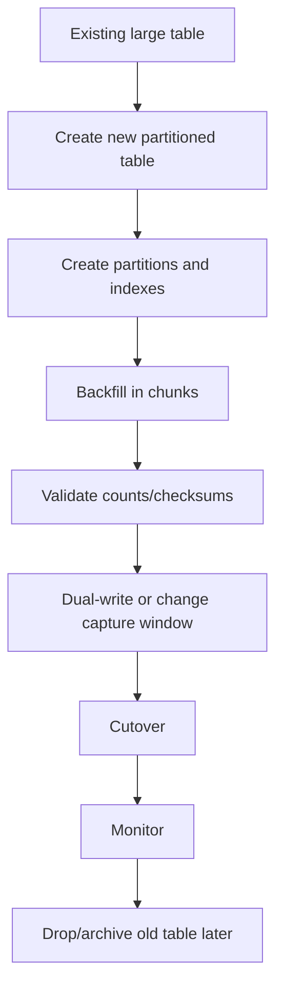

# Part 016 — Partitioning and Large Table Management

Large tables are not a problem because they are large.

Large tables become a problem when their lifecycle is unmanaged.

In enterprise systems, some tables naturally grow forever:

- order status history;
- quote revision history;
- approval decision history;
- audit log;
- outbox event;
- inbox event;
- integration message log;
- job execution log;
- API access log;
- product catalog version history;
- price history;
- fulfilment event history;
- reconciliation records.

At small scale, one table and a few indexes feel fine.

At production scale, the same table can create:

- slow range queries;
- huge indexes;
- painful vacuum;
- long retention delete;
- expensive backfill;
- blocking DDL;
- index bloat;
- planner misestimation;
- backup/restore growth;
- replica lag;
- long maintenance windows;
- dangerous ad-hoc queries;
- operational fear around schema change.

Partitioning is one tool for this problem.

It is not magic.

It does not automatically make all queries faster.

It makes large-table lifecycle manageable when the data has a natural partitioning dimension and queries can use it.

---

## 1. Core mental model

A partitioned table is a logical table split into multiple physical child tables called partitions.

Application code can query the parent table:

```sql
select *
from order_event
where occurred_at >= #{from}
  and occurred_at < #{to};
```

PostgreSQL can route reads/writes to relevant partitions when partition key rules are clear.



Partitioning gives you:

- smaller physical tables;
- smaller local indexes;
- partition pruning;
- easier retention by detach/drop partition;
- easier archival;
- easier maintenance per partition;
- better operational blast-radius control.

Partitioning does not give you:

- automatic sharding;
- automatic global uniqueness without constraints;
- automatic performance improvement for unbounded queries;
- automatic cross-partition index efficiency;
- free writes;
- free maintenance;
- simpler application semantics.

---

## 2. When partitioning is useful

Partitioning is useful when these are true:

- table is large or expected to become large;
- data has natural slicing dimension;
- queries usually filter by partition key;
- retention/archival is important;
- indexes are becoming too large;
- vacuum on full table is painful;
- backfill/maintenance needs smaller units;
- history is append-heavy;
- old data becomes cold;
- operational lifecycle differs by data age or tenant/category.

Common partition keys:

| Partition key | Good for | Risk |
|---|---|---|
| Time | history, events, audit, outbox | queries must include time range |
| Tenant | tenant isolation, large tenant split | tenant skew |
| Region | data locality, regulatory boundary | region changes are hard |
| Status | queue/workflow table | skew and row movement |
| Hash ID | write distribution | weak retention benefit |

For CPQ/order systems, time-based partitioning is often the first candidate for history/event/audit tables.

Tenant partitioning can be useful only if tenant cardinality and skew justify it.

---

## 3. When partitioning is not useful

Do not partition just because a table feels important.

Partitioning is often wrong when:

- table is small;
- queries do not filter by partition key;
- partition key is unstable;
- every query spans all partitions;
- partition count will explode;
- operational team cannot maintain partitions;
- uniqueness requirements conflict with partition design;
- schema migrations across partitions are not understood;
- application code hides partition key behind functions;
- partitioning is used to avoid fixing bad query/index design.

Bad justification:

> This table is business critical, so let's partition it.

Better justification:

> This table grows by 50 million rows/month, queries are almost always by tenant and month, retention drops data older than 7 years, and current delete/vacuum/index maintenance is unsafe. Partitioning by month gives bounded maintenance units and enables partition pruning.

---

## 4. Declarative partitioning

Modern PostgreSQL supports declarative partitioning.

You declare a parent table and define child partitions.

### Range partition

Range partition is common for time-series/history tables.

```sql
create table order_event (
    tenant_id uuid not null,
    order_event_id uuid not null,
    order_id uuid not null,
    event_type text not null,
    payload jsonb not null,
    occurred_at timestamptz not null,
    created_at timestamptz not null default now(),
    primary key (tenant_id, order_event_id, occurred_at)
) partition by range (occurred_at);
```

Monthly partitions:

```sql
create table order_event_2026_07
partition of order_event
for values from ('2026-07-01 00:00:00+00')
         to ('2026-08-01 00:00:00+00');

create table order_event_2026_08
partition of order_event
for values from ('2026-08-01 00:00:00+00')
         to ('2026-09-01 00:00:00+00');
```

Range boundaries should be non-overlapping and complete for expected writes.

### List partition

List partition is useful for fixed categories.

```sql
create table integration_message (
    tenant_id uuid not null,
    message_id uuid not null,
    integration_type text not null,
    payload jsonb not null,
    created_at timestamptz not null default now()
) partition by list (integration_type);

create table integration_message_billing
partition of integration_message
for values in ('BILLING');

create table integration_message_fulfillment
partition of integration_message
for values in ('FULFILLMENT');
```

Risk: categories evolve.

If new values appear without partition/default handling, inserts fail.

### Hash partition

Hash partition distributes data across fixed buckets.

```sql
create table tenant_work_item (
    tenant_id uuid not null,
    work_item_id uuid not null,
    status text not null,
    created_at timestamptz not null default now(),
    primary key (tenant_id, work_item_id)
) partition by hash (tenant_id);

create table tenant_work_item_p0
partition of tenant_work_item
for values with (modulus 4, remainder 0);

create table tenant_work_item_p1
partition of tenant_work_item
for values with (modulus 4, remainder 1);

create table tenant_work_item_p2
partition of tenant_work_item
for values with (modulus 4, remainder 2);

create table tenant_work_item_p3
partition of tenant_work_item
for values with (modulus 4, remainder 3);
```

Hash partitioning can reduce per-partition size, but it is less useful for retention because old data is spread across all partitions.

---

## 5. Choosing a partition key

Partition key is an architecture decision.

Bad partition key creates years of pain.

Evaluate:

1. Does most important query filter by this key?
2. Is the key stable after insert?
3. Does the key support retention/archival?
4. Does the key avoid extreme skew?
5. Does uniqueness requirement include this key?
6. Can application/API require this filter?
7. Can MyBatis mapper consistently include this predicate?
8. Can migration/backfill populate this key safely?
9. Can SRE/DBA maintain partition lifecycle?
10. Does cloud/on-prem operational model support this partition count?

### Time partition key

Good for:

- append-only event/history/audit;
- retention by date;
- reporting by date range;
- monthly/daily lifecycle.

Risk:

- queries without date range scan all partitions;
- late-arriving events need old partitions writable;
- timezone boundary must be clear;
- too many small partitions increase overhead.

### Tenant partition key

Good for:

- strong tenant isolation;
- very large tenants;
- tenant-level archival/export;
- tenant-specific maintenance.

Risk:

- tenant skew;
- too many tenants;
- cross-tenant reporting scans many partitions;
- tenant migration is hard.

### Composite partitioning

PostgreSQL supports sub-partitioning patterns, but complexity rises quickly.

Example idea:

```text
range by month
  then hash by tenant
```

Use only when justified by data size and operational maturity.

Complex partitioning without automation becomes operational debt.

---

## 6. Partition pruning

Partition pruning is the main read-performance benefit.

The planner can skip partitions that cannot contain matching rows.

Good predicate:

```sql
where occurred_at >= #{from}
  and occurred_at < #{to}
```

Bad predicate:

```sql
where date(occurred_at) = #{businessDate}
```

Bad predicate wraps partition key with a function.

Better:

```sql
where occurred_at >= #{businessDateStart}
  and occurred_at < #{businessDateEnd}
```

### MyBatis implication

Your mapper must make partition key predicates easy and mandatory.

Bad dynamic SQL:

```xml
<if test="from != null">
  and occurred_at &gt;= #{from}
</if>
<if test="to != null">
  and occurred_at &lt; #{to}
</if>
```

This allows unbounded query.

Better for large partitioned history table:

```xml
where tenant_id = #{tenantId}
  and occurred_at &gt;= #{from}
  and occurred_at &lt; #{to}
```

Validate `from` and `to` at API/service layer.

---

## 7. Local indexes and global index limitation awareness

PostgreSQL partition indexes are generally local to partitions.

When you create an index on the partitioned parent, PostgreSQL creates corresponding indexes on partitions.

Example:

```sql
create index idx_order_event_tenant_occurred_at
on order_event (tenant_id, occurred_at desc);
```

This supports queries like:

```sql
select *
from order_event
where tenant_id = #{tenantId}
  and occurred_at >= #{from}
  and occurred_at < #{to}
order by occurred_at desc
limit #{limit};
```

Global uniqueness across partitions has important limitations and version-specific details.

A practical rule: if you need a unique or primary key on a partitioned table, design it with partition key awareness and verify PostgreSQL version behaviour.

Example:

```sql
primary key (tenant_id, order_event_id, occurred_at)
```

This includes the partition key `occurred_at`.

If business wants `order_event_id` globally unique regardless of partition, options include:

- use UUID generated by application and accept probabilistic uniqueness;
- maintain separate registry table;
- include partition key in PK and enforce ID generation discipline;
- avoid partitioning that table;
- redesign access pattern;
- verify PostgreSQL version-specific constraints.

Do not discover uniqueness limitation during migration deployment.

---

## 8. Default partition

A default partition catches rows that do not match existing partitions.

```sql
create table order_event_default
partition of order_event
default;
```

Default partition can prevent insert failure.

But it can also hide broken partition maintenance.

Failure pattern:

- monthly partition for August was not created;
- all August rows go into default partition;
- default partition grows huge;
- partition pruning becomes less effective;
- later moving rows is painful.

If using default partition:

- monitor row count;
- alert when non-zero unexpectedly;
- drain rows into correct partitions;
- create future partitions before time boundary;
- test partition creation job.

Default partition is safety net, not lifecycle strategy.

---

## 9. Partition maintenance lifecycle

Partitioning requires automation.

Lifecycle:



Tasks:

- create future partitions;
- verify partition bounds;
- create indexes on partitions;
- analyze partitions;
- monitor default partition;
- detach old partitions;
- archive old partitions;
- drop after retention;
- adjust privileges;
- test restore;
- update runbooks.

This belongs in migration/job/ops process, not in someone's memory.

---

## 10. Attach and detach partitions

Partition attach/detach can support migration and retention.

Example detach for archival:

```sql
alter table order_event
detach partition order_event_2024_01;
```

After detach, the old partition becomes a standalone table.

You can then:

- export it;
- archive it;
- move it to cheaper storage;
- keep it read-only;
- drop it after retention period.

Example attach:

```sql
alter table order_event
attach partition order_event_2026_10
for values from ('2026-10-01 00:00:00+00')
         to ('2026-11-01 00:00:00+00');
```

Attach requires the table structure and partition bounds to match.

For large tables, use CHECK constraints to help PostgreSQL validate attach efficiently; verify exact procedure against team DBA/version.

---

## 11. Data retention with partitions

Without partitioning, retention often means:

```sql
delete from order_event
where occurred_at < now() - interval '7 years';
```

For huge tables, this is painful:

- many row deletes;
- WAL generation;
- index updates;
- vacuum needed;
- bloat risk;
- long transaction risk;
- replication lag.

With time partitions, retention can be:

```sql
alter table order_event detach partition order_event_2019_01;
-- archive/export if required
 drop table order_event_2019_01;
```

Dropping a partition is often much cheaper than deleting millions of rows.

But retention is not only technical.

Verify:

- legal retention;
- customer contract;
- audit requirement;
- support needs;
- backup retention;
- restore implications;
- warehouse/lake copy;
- PII deletion requirements.

---

## 12. Archival pattern

Archive before drop if data may still be needed.

Possible archive flow:

1. Mark partition as eligible for archival.
2. Stop writes to that time range if applicable.
3. Validate row count and checksum summary.
4. Detach partition.
5. Export to archive storage.
6. Validate archive readability.
7. Register archive metadata.
8. Drop local partition after approval.
9. Update retention ledger.

Archive metadata table:

```sql
create table partition_archive_registry (
    table_name text not null,
    partition_name text not null,
    range_start timestamptz not null,
    range_end timestamptz not null,
    archived_at timestamptz not null,
    archive_location text not null,
    row_count bigint not null,
    checksum_summary text,
    status text not null,
    primary key (table_name, partition_name)
);
```

This gives operations evidence.

---

## 13. Large table migration to partitioning

Migrating an existing large table to partitioning is high risk.

You usually cannot treat it like a small DDL change.

Possible strategy:



Depending on system constraints, strategy may involve:

- maintenance window;
- blue/green database object switch;
- logical replication;
- application dual-write;
- trigger-based sync;
- CDC-based sync;
- batch backfill;
- view compatibility layer;
- lock-minimized rename;
- rollback plan.

There is no universal safe migration.

Do not invent CSG-specific migration process.

Use `Internal verification checklist` and involve DBA/SRE/backend lead.

---

## 14. Chunked backfill

Backfill into partitioned table should be chunked.

Bad:

```sql
insert into order_event_new
select * from order_event_old;
```

Better concept:

```sql
insert into order_event_new
select *
from order_event_old
where occurred_at >= #{chunkStart}
  and occurred_at < #{chunkEnd};
```

Add validation:

```sql
select count(*)
from order_event_old
where occurred_at >= #{chunkStart}
  and occurred_at < #{chunkEnd};

select count(*)
from order_event_new
where occurred_at >= #{chunkStart}
  and occurred_at < #{chunkEnd};
```

For critical data, count is not enough.

Use checksums/summaries by key range/date range where practical.

Backfill must be:

- resumable;
- idempotent;
- throttled;
- observable;
- cancellable;
- validated;
- reversible or roll-forward safe.

---

## 15. Vacuum and analyze on partitioned tables

Partitioning changes maintenance shape.

Instead of one huge table, you have many smaller tables.

This can help vacuum and analyze, but it does not remove the need for them.

Consider:

- hot current partition gets most writes;
- old partitions may be read-only;
- autovacuum settings may need per-table tuning;
- statistics exist per partition and parent-level planning also matters;
- long transactions still block cleanup;
- index bloat can happen per partition;
- analyze after large load/backfill.

After loading a partition:

```sql
analyze order_event_2026_07;
```

For production, coordinate with DBA/SRE before manual maintenance commands.

---

## 16. Query planner with partitions

Partitioning can improve query plans through pruning.

But it can also make planning more complex if there are too many partitions.

Potential issues:

- query scans all partitions because predicate is missing;
- predicate is written in non-prunable form;
- generic prepared statement plan behaves poorly;
- statistics differ across partitions;
- too many partitions increase planning time;
- joins against partitioned tables produce complex plans;
- partitionwise join/aggregate settings may matter by version/configuration.

Always inspect plans.

Example:

```sql
explain (analyze, buffers)
select status, count(*)
from order_event
where occurred_at >= timestamp '2026-07-01 00:00:00+00'
  and occurred_at < timestamp '2026-08-01 00:00:00+00'
group by status;
```

Look for:

- only expected partition scanned;
- index usage where expected;
- row estimate reasonable;
- temp file usage absent or acceptable;
- buffers not excessive;
- execution time bounded.

---

## 17. Java/JAX-RS API implication

Partitioning works only if application access patterns cooperate.

API should require filters aligned with partition key.

Bad:

```http
GET /order-events?tenantId=...
```

Better:

```http
GET /order-events?tenantId=...&from=2026-07-01T00:00:00Z&to=2026-08-01T00:00:00Z
```

Service-layer validation:

- `from` required;
- `to` required;
- max range enforced;
- timezone conversion explicit;
- tenant boundary required;
- limit required;
- sort stable;
- export async if range too large.

If API allows unbounded queries, partitioning cannot save you.

---

## 18. MyBatis mapper implication

Mapper should not hide unsafe optional filters.

Bad:

```xml
<select id="searchOrderEvents" resultMap="OrderEventMap">
  select *
  from order_event
  where tenant_id = #{tenantId}
  <if test="eventType != null">
    and event_type = #{eventType}
  </if>
  order by occurred_at desc
  limit #{limit}
</select>
```

This scans across all time partitions.

Better:

```xml
<select id="searchOrderEvents" resultMap="OrderEventMap">
  select
    tenant_id,
    order_event_id,
    order_id,
    event_type,
    payload,
    occurred_at
  from order_event
  where tenant_id = #{tenantId}
    and occurred_at &gt;= #{from}
    and occurred_at &lt; #{to}
  <if test="eventType != null">
    and event_type = #{eventType}
  </if>
  order by occurred_at desc, order_event_id desc
  limit #{limit}
</select>
```

Partition key predicate should be part of mapper contract.

---

## 19. Partitioning anti-patterns

### Anti-pattern 1: partitioning without query filter alignment

If most queries do not filter by partition key, partitioning adds complexity without pruning benefit.

### Anti-pattern 2: too many partitions

Thousands of partitions can increase planning and maintenance overhead.

Choose granularity carefully.

Daily partition might be too many.

Monthly partition might be enough.

The right answer depends on data volume and maintenance needs.

### Anti-pattern 3: partitioning mutable status

Partitioning by status can cause row movement on status updates.

For workflow/state machine tables, this can be expensive and surprising.

### Anti-pattern 4: default partition as garbage bin

Default partition silently accumulates data when future partitions are missing.

### Anti-pattern 5: ignoring unique constraint implications

Primary key/unique constraints on partitioned tables require careful design.

### Anti-pattern 6: no automation

Manual partition creation eventually fails.

### Anti-pattern 7: partitioning instead of indexing

If the table needs a simple composite index, partitioning may be overkill.

### Anti-pattern 8: no retention policy

Partitioning without retention/archival objective may only add complexity.

---

## 20. Failure modes

### Failure mode 1: missing future partition

Cause:

- partition creation job failed;
- migration not deployed;
- month boundary reached.

Symptom:

- inserts fail;
- or rows fall into default partition;
- error appears in application logs.

Detection:

- default partition row count;
- failed insert errors;
- partition maintenance alert.

Fix:

- create missing partition;
- move rows from default partition if needed;
- add future partition monitoring;
- improve runbook.

---

### Failure mode 2: query scans all partitions

Cause:

- missing partition key predicate;
- function wraps partition key;
- optional filters omit time range;
- prepared statement/generic plan issue.

Detection:

- `EXPLAIN` shows many partitions scanned;
- high execution time;
- high buffers;
- slow query logs.

Fix:

- require range predicate;
- rewrite predicate;
- add API validation;
- adjust mapper;
- inspect planner behaviour.

---

### Failure mode 3: partition count explosion

Cause:

- daily/hourly partitioning without need;
- subpartitioning too granular;
- tenant-per-partition for many tenants.

Detection:

- planning time increases;
- catalog operations slow;
- maintenance scripts slow;
- migration time increases.

Fix:

- redesign granularity;
- consolidate partitions if possible;
- limit subpartitioning;
- use hash partition only when justified.

---

### Failure mode 4: retention drop removes data still needed

Cause:

- retention policy misunderstood;
- partition range wrong;
- timezone boundary error;
- archive validation skipped.

Detection:

- support/customer escalation;
- audit lookup missing;
- backup restore request.

Fix:

- restore from backup/archive if possible;
- strengthen approval workflow;
- add partition registry;
- verify legal/business retention.

---

### Failure mode 5: migration to partitioned table causes long outage

Cause:

- large table rewrite;
- blocking DDL;
- no chunking;
- no rollback plan;
- indexes built unsafely.

Detection:

- lock wait;
- application timeouts;
- migration pipeline stuck;
- replication lag.

Fix:

- stop migration if safe;
- rollback/roll-forward per runbook;
- redesign as online migration;
- involve DBA/SRE.

---

## 21. Debugging workflow

When partitioning-related performance issue appears:

1. Identify query and parameters.
2. Check whether query includes partition key predicate.
3. Run `EXPLAIN` and verify partitions scanned.
4. Check if predicate is prunable.
5. Check indexes on relevant partitions.
6. Check row count by partition.
7. Check default partition row count.
8. Check stale statistics.
9. Check current vs old partitions write pattern.
10. Check autovacuum/analyze activity.
11. Check if partition count is excessive.
12. Check application mapper/API validation.
13. Check recent migrations or missing future partitions.

Partition issue is often application-query-shape issue.

Do not debug PostgreSQL alone; debug the API and mapper contract too.

---

## 22. Observability queries

Examples to discuss with DBA/SRE and adapt to team standards.

List partitions:

```sql
select
    nmsp_parent.nspname as parent_schema,
    parent.relname as parent_table,
    child.relname as partition_table
from pg_inherits
join pg_class parent on pg_inherits.inhparent = parent.oid
join pg_class child on pg_inherits.inhrelid = child.oid
join pg_namespace nmsp_parent on nmsp_parent.oid = parent.relnamespace
order by parent.relname, child.relname;
```

Approximate row counts from stats:

```sql
select
    relname,
    n_live_tup,
    n_dead_tup,
    last_vacuum,
    last_autovacuum,
    last_analyze,
    last_autoanalyze
from pg_stat_user_tables
where relname like 'order_event_%'
order by relname;
```

Table size by partition:

```sql
select
    relname,
    pg_size_pretty(pg_total_relation_size(relid)) as total_size
from pg_catalog.pg_statio_user_tables
where relname like 'order_event_%'
order by pg_total_relation_size(relid) desc;
```

These are diagnostic examples, not a complete observability solution.

---

## 23. Internal verification checklist

Verify these in CSG/team context:

- Which tables are already partitioned?
- Which large tables are candidates for partitioning?
- What is the growth rate per table?
- What is the largest table by row count and total size?
- Which tables have retention requirements?
- Which queries filter by time/tenant/status?
- Are API filters aligned with partition keys?
- Are MyBatis mappers requiring partition key predicates?
- Is there a future partition creation job?
- Is default partition used?
- Is default partition monitored?
- How are old partitions archived/dropped?
- Who approves retention deletion?
- Are partition maintenance jobs in CI/CD, scheduler, GitOps, or DBA process?
- Are indexes created consistently across partitions?
- Are partition stats analyzed after load/backfill?
- Are there incidents caused by missing partitions or full partition scans?
- Are cloud-managed PostgreSQL limitations relevant?
- Are backup/restore implications understood?

---

## 24. Partitioning review checklist

### Design

- Is partitioning actually needed?
- What problem does it solve: query, retention, maintenance, archival, or write distribution?
- What is the partition key?
- Is partition key stable?
- Do key queries filter by it?
- Is partition granularity justified?
- Is partition count bounded?

### Correctness

- Do primary/unique constraints work with partition strategy?
- Are time boundaries correct?
- Is timezone semantics explicit?
- Is default partition policy clear?
- Are late-arriving events supported?
- Is retention legally/business approved?

### Performance

- Does `EXPLAIN` show pruning?
- Are local indexes aligned with query pattern?
- Is planning time acceptable?
- Are old partitions read-only/cold?
- Is backfill throttled?

### Operations

- Are future partitions created automatically?
- Are partition jobs monitored?
- Is detach/drop/archive runbook documented?
- Is default partition monitored?
- Are analyze/vacuum settings reviewed?
- Is restore drill aware of partitioned tables?

### Java/MyBatis

- Do APIs require partition key filters?
- Do mappers include required predicates?
- Are date ranges bounded?
- Are exports async for large ranges?
- Are query timeouts configured?

### Migration

- Is migration online/offline decision explicit?
- Is backfill resumable?
- Is cutover plan documented?
- Is rollback/roll-forward plan clear?
- Are counts/checksums validated?

---

## 25. Senior engineer heuristics

Use these heuristics:

- Partitioning is a lifecycle tool, not only a speed tool.
- If queries do not include partition key, partitioning will disappoint you.
- Retention by partition drop is often safer than huge deletes.
- Default partition should be monitored like an error queue.
- Partition key is harder to change than an index.
- Too many partitions can be worse than one large table.
- Application API contract must enforce partition-friendly filters.
- MyBatis dynamic SQL must not make critical predicates optional.
- Large table migration is an incident-risk project, not a normal migration.
- Archive and restore requirements matter as much as query speed.

---

## 26. Practical summary

Partitioning helps when large data naturally divides into operational units.

For PostgreSQL-backed enterprise systems, the most common practical use cases are:

- time-based history tables;
- audit/event logs;
- outbox/inbox event tables;
- large reporting facts;
- retention-heavy datasets;
- cold/hot data separation;
- controlled archival.

But partitioning requires discipline:

- choose partition key based on access and lifecycle;
- ensure query predicates enable pruning;
- keep partition count reasonable;
- understand index and uniqueness implications;
- automate future partition creation;
- monitor default partition;
- plan retention/archive;
- validate migration/backfill;
- involve DBA/SRE for production rollouts.

Partitioning done well reduces blast radius.

Partitioning done casually creates a more complex table that still performs badly.

---

## References

- PostgreSQL Documentation — Table Partitioning: https://www.postgresql.org/docs/current/ddl-partitioning.html
- PostgreSQL Documentation — Declarative Partitioning: https://www.postgresql.org/docs/current/ddl-partitioning.html#DDL-PARTITIONING-DECLARATIVE
- PostgreSQL Documentation — Partition Pruning: https://www.postgresql.org/docs/current/ddl-partitioning.html#DDL-PARTITION-PRUNING
- PostgreSQL Documentation — ALTER TABLE / ATTACH PARTITION: https://www.postgresql.org/docs/current/sql-altertable.html
- PostgreSQL Documentation — `pg_partitioned_table`: https://www.postgresql.org/docs/current/catalog-pg-partitioned-table.html
