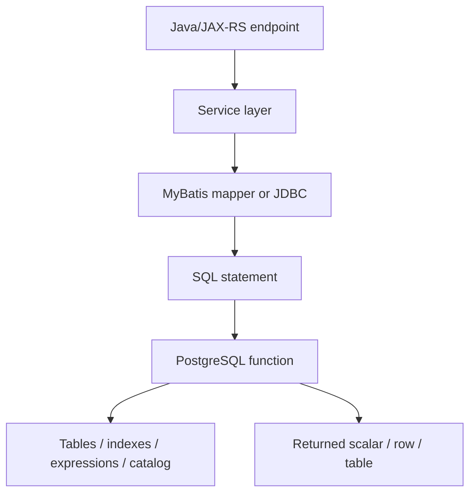
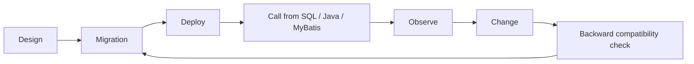

# Part 017 — PostgreSQL Functions

A PostgreSQL function is not just a reusable SQL snippet.

A function is executable database logic that becomes part of the data platform contract.

That means a function can improve correctness, reduce duplication, enforce reusable computation, and support advanced indexing.

It can also hide business rules, bypass service-layer observability, create security holes, make migrations brittle, and surprise Java/JAX-RS code that thinks it is only running a simple query.

For a senior backend engineer, the right question is not:

> Can PostgreSQL do this in a function?

The better question is:

> Should this logic live inside the database contract, or should it remain visible in the service layer?

This part focuses on PostgreSQL functions as production database objects in enterprise Java/JAX-RS systems using JDBC, MyBatis, migrations, Kafka/outbox patterns, and operational runbooks.

---

## 1. Core mental model

A function is a named executable object stored in PostgreSQL.

It accepts parameters, executes logic, and returns a value or a result set.



A function can be used from:

- `SELECT` statements;
- `WHERE` clauses;
- `JOIN` expressions;
- default expressions;
- generated columns;
- expression indexes;
- check constraints in limited cases;
- triggers;
- views;
- materialized views;
- MyBatis mapper queries;
- migration scripts;
- operational SQL;
- reporting queries.

This makes functions powerful.

It also means function behaviour can affect query planning, locking, security, performance, testability, and deployment safety.

---

## 2. Function is part of the database API

Once application code calls a function, that function becomes an API.

The API surface is not HTTP.

It is SQL.

```sql
select calculate_quote_total(#{quoteId});
```

From the Java side, this looks small.

From the database side, it may involve:

- reading quote header;
- reading quote items;
- reading catalog snapshot;
- applying discount rules;
- checking effective dates;
- applying tax or fee logic;
- returning a numeric total;
- throwing an exception if data is inconsistent.

That hidden behaviour matters during code review.

A function has a signature:

```sql
calculate_quote_total(quote_id uuid) returns numeric
```

But it also has an implicit contract:

- which tables it reads;
- whether it writes;
- whether it is deterministic;
- whether it depends on current time;
- whether it depends on session configuration;
- whether it is safe in parallel queries;
- whether it can be used in an index;
- which privileges it runs with;
- what errors it may raise;
- what null handling it uses;
- what version of the domain rules it encodes.

Senior review must include both the explicit signature and the implicit operational contract.

---

## 3. Why functions exist

Functions exist because some logic is closer to data than to application code.

Good use cases:

- reusable derived value calculation;
- normalization of database-specific expression;
- encapsulating complex SQL that must be reused consistently;
- expression index support;
- generated search vector calculation;
- lightweight data validation helper;
- trigger function implementation;
- migration helper logic;
- operational repair script support;
- data reconciliation query support;
- PostgreSQL-specific type conversion;
- database-side utility that is not core business workflow.

Weak use cases:

- hiding service orchestration;
- implementing large business workflows;
- replacing domain services;
- bypassing authorization logic;
- performing cross-service coordination;
- publishing Kafka events directly from database logic;
- doing network calls from database extensions;
- turning PostgreSQL into an application server;
- avoiding proper application refactoring.

The strongest boundary:

> Use functions for data-local invariants and reusable database computation. Avoid functions for process orchestration and business workflow state machines unless the team explicitly owns that as database-side architecture.

---

## 4. Function vs application method

A Java method is visible to application tooling:

- unit tests;
- code coverage;
- dependency injection;
- tracing;
- logging;
- feature flags;
- IDE refactoring;
- static analysis;
- service-level observability.

A PostgreSQL function is visible to database tooling:

- `pg_proc` catalog;
- `pg_depend` dependencies;
- execution plans;
- migration history;
- database permissions;
- database logs;
- SQL-level tests;
- `pg_stat_statements` if called through SQL.

Neither is universally better.

The placement decision should consider:

| Question | Prefer application code | Prefer PostgreSQL function |
|---|---|---|
| Needs external service call | Yes | No |
| Needs HTTP/user context | Yes | Usually no |
| Needs strict data-local consistency | Maybe | Often yes |
| Used in expression index | No | Yes |
| Used by multiple SQL objects | Maybe | Often yes |
| Needs complex orchestration | Yes | Usually no |
| Needs DB privilege escalation | No | Sometimes, carefully |
| Needs easy unit testing | Yes | Maybe |
| Needs planner-visible immutability | No | Yes |
| Needs zero hidden side effect | Yes | Only if pure |

---

## 5. Basic SQL function

A SQL function is useful when the body can be expressed as SQL.

Example: normalize a business key.

```sql
create or replace function normalize_external_ref(value text)
returns text
language sql
immutable
strict
as $$
    select nullif(lower(trim(value)), '')
$$;
```

Potential use:

```sql
select normalize_external_ref('  ABC-123  ');
```

Result:

```text
abc-123
```

This function is small, deterministic, and easy to reason about.

It may be acceptable in:

- expression indexes;
- generated columns;
- uniqueness enforcement;
- mapper query normalization;
- migration cleanup queries.

Example expression index:

```sql
create unique index uq_customer_external_ref_normalized
on customer (tenant_id, normalize_external_ref(external_ref));
```

The purpose is not to hide logic.

The purpose is to make normalization consistent wherever the database must enforce uniqueness.

---

## 6. PL/pgSQL function

PL/pgSQL is PostgreSQL's procedural language.

It adds:

- variables;
- conditionals;
- loops;
- exception blocks;
- dynamic SQL;
- diagnostics;
- structured multi-step logic.

Example:

```sql
create or replace function quote_item_count(p_quote_id uuid)
returns integer
language plpgsql
stable
as $$
declare
    v_count integer;
begin
    select count(*)
    into v_count
    from quote_item
    where quote_id = p_quote_id
      and deleted_at is null;

    return v_count;
end;
$$;
```

This is readable, but it already introduces more weight than a simple SQL expression.

Before accepting PL/pgSQL, ask:

- does this need procedural control flow;
- can this be a plain SQL query;
- does this hide too much domain logic;
- how will it be tested;
- how will it be migrated;
- how will it be observed;
- does it need versioning;
- does Java code understand its errors and null semantics.

---

## 7. Function lifecycle

A function has a lifecycle.



Important lifecycle points:

1. Function signature becomes a contract.
2. `CREATE OR REPLACE FUNCTION` can replace the body but not all signature changes safely.
3. Parameter type changes can break callers.
4. Return type changes can break MyBatis ResultMap.
5. Function volatility affects planner behaviour.
6. Security mode affects privilege boundary.
7. Dependency graph can block dropping or replacing objects.
8. Application code may call old and new function versions during rolling deployment.
9. Repeatable migrations must be controlled carefully.
10. Test data must cover nulls, missing rows, invalid state, and large data.

A function is not just code.

It is deployed database state.

---

## 8. Function signature design

A function signature includes:

- function name;
- schema;
- input parameter names and types;
- output parameter names and types;
- return type;
- language;
- volatility;
- strict/null behaviour;
- security mode;
- parallel safety;
- cost/rows estimates when relevant;
- body.

Bad signature:

```sql
create function calculate(id text)
returns text
...
```

Problems:

- vague name;
- generic parameter;
- generic return type;
- no domain context;
- hard to search;
- hard to version;
- hard to review.

Better signature:

```sql
create function quote.calculate_quote_total(p_quote_id uuid)
returns numeric(19, 4)
...
```

Better properties:

- schema-qualified domain context;
- explicit business object;
- typed ID;
- explicit numeric precision;
- easier code search;
- clearer ownership.

---

## 9. Schema qualification

Always think about schema.

```sql
select quote.calculate_quote_total(#{quoteId});
```

Schema qualification reduces ambiguity.

It also matters for security.

Functions using `SECURITY DEFINER` should not rely on unsafe `search_path` assumptions.

A safe style is to schema-qualify table references inside sensitive functions:

```sql
select q.status
into v_status
from quote.quote q
where q.id = p_quote_id;
```

Do not assume the default search path is stable across:

- local development;
- CI;
- migration runner;
- production;
- connection pool sessions;
- DBA sessions;
- PgBouncer modes;
- managed cloud configuration.

---

## 10. Volatility categories

PostgreSQL functions declare volatility.

The category is a promise to the optimizer.

Common categories:

- `IMMUTABLE`;
- `STABLE`;
- `VOLATILE`.

### IMMUTABLE

`IMMUTABLE` means the same inputs always produce the same output.

Example candidates:

```sql
lower(trim(value))
```

or deterministic formatting that does not depend on database state, time, locale, current user, or configuration.

Use with care.

If a function reads a table, it is not immutable.

If a function depends on `now()`, it is not immutable.

If a function depends on tenant config table, it is not immutable.

If a function depends on current setting or timezone, be careful.

### STABLE

`STABLE` means the function returns the same result within a single statement for the same inputs.

It may read database state.

Example:

```sql
create function quote_exists(p_quote_id uuid)
returns boolean
language sql
stable
as $$
    select exists (
        select 1
        from quote
        where id = p_quote_id
    )
$$;
```

### VOLATILE

`VOLATILE` is the default when the function may change data, depend on time, depend on random values, or produce different results across calls.

Examples:

- writes rows;
- calls `nextval`;
- depends on `clock_timestamp()`;
- logs audit rows;
- changes state;
- reads non-stable external state through extension.

Incorrect volatility is dangerous.

It can cause wrong plans, wrong cached assumptions, invalid expression index behaviour, or surprising query results.

---

## 11. Volatility review checklist

For every function, ask:

- Does it read tables?
- Does it write tables?
- Does it depend on current time?
- Does it depend on current user?
- Does it depend on search path?
- Does it depend on database settings?
- Does it depend on locale/collation?
- Does it call another function with weaker volatility?
- Is it used in an index?
- Is it used in a generated column?
- Is it used in a query predicate?
- Is the volatility declaration honest?

Bad example:

```sql
create function current_tenant_id()
returns uuid
language sql
immutable
as $$
    select current_setting('app.tenant_id')::uuid
$$;
```

This should not be `IMMUTABLE` because it depends on session setting.

---

## 12. STRICT and null handling

`STRICT` means PostgreSQL does not call the function if any input argument is null; it returns null immediately.

Example:

```sql
create or replace function normalize_code(value text)
returns text
language sql
immutable
strict
as $$
    select upper(trim(value))
$$;
```

This avoids writing manual null checks.

But it is also a contract.

If business meaning differs between:

- input is null;
- input is empty;
- input is blank;
- input is invalid;

then `STRICT` may hide important distinction.

For enterprise data correctness, null semantics must be intentional.

---

## 13. Return scalar

A scalar-returning function returns one value.

```sql
create function is_quote_editable(p_status text)
returns boolean
language sql
immutable
strict
as $$
    select p_status in ('DRAFT', 'REJECTED')
$$;
```

This can be useful if status rules are small and data-local.

But be careful.

If quote editability also depends on:

- approval state;
- user role;
- tenant policy;
- catalog version;
- integration status;
- lock ownership;
- time window;
- product-specific rule;

then a tiny-looking function may become a hidden business-rule trap.

---

## 14. Return table

A function can return a table.

```sql
create or replace function quote.find_quote_summary(p_customer_id uuid)
returns table (
    quote_id uuid,
    quote_number text,
    status text,
    item_count integer,
    updated_at timestamptz
)
language sql
stable
as $$
    select q.id,
           q.quote_number,
           q.status,
           count(qi.id)::integer as item_count,
           q.updated_at
    from quote q
    left join quote_item qi on qi.quote_id = q.id
    where q.customer_id = p_customer_id
    group by q.id, q.quote_number, q.status, q.updated_at
$$;
```

This looks convenient for MyBatis mapping.

But treat it like a view-like contract.

Changing returned columns can break callers.

Adding columns is usually safer than changing or removing columns.

Changing column type is risky.

Changing row semantics is risky even if signature stays the same.

---

## 15. Set-returning functions

A set-returning function returns multiple rows.

It may be useful for reusable database-side query composition.

But it can also confuse performance review because the cost is hidden behind a function call.

Review questions:

- How many rows can it return?
- Does it filter by tenant?
- Does it filter by time range?
- Does it use indexes?
- Does it hide joins?
- Does it allocate temporary data?
- Does it cause repeated execution per outer row?
- Does it appear in a lateral join?

Avoid set-returning functions that silently scan huge tables.

---

## 16. Function in expression index

Functions are often useful for expression indexes.

Example normalized lookup:

```sql
create index idx_customer_email_norm
on customer (lower(email));
```

Or with a function:

```sql
create index idx_product_code_norm
on product (normalize_external_ref(product_code));
```

Then query must match the expression:

```sql
select *
from product
where normalize_external_ref(product_code) = normalize_external_ref(#{productCode});
```

Rules:

- function must be immutable for expression index use;
- query expression must match index expression sufficiently;
- hidden casts can prevent index use;
- collation differences can matter;
- function changes require index rebuild consideration.

Failure mode:

1. Team creates function.
2. Team creates expression index using function.
3. Later function body changes.
4. Index expression semantics are no longer aligned with expected output.
5. Lookups return surprising results or require reindex strategy.

Migration review must include index dependency.

---

## 17. Function and generated columns

A generated column may use immutable expressions.

Example:

```sql
alter table customer
add column email_normalized text
generated always as (lower(trim(email))) stored;
```

If using function:

```sql
alter table product
add column product_code_normalized text
generated always as (normalize_external_ref(product_code)) stored;
```

Generated column trade-off:

- improves query simplicity;
- centralizes derived value;
- can be indexed;
- adds write-time cost;
- requires careful migration/backfill for existing rows;
- depends on function immutability and stability of semantics.

Do not put tenant-dependent or time-dependent logic into generated columns.

---

## 18. Function security model

By default, functions run as `SECURITY INVOKER`.

That means the function executes with privileges of the caller.

`SECURITY DEFINER` makes the function execute with privileges of the function owner.

That can be useful.

It is also dangerous.

Use cases where `SECURITY DEFINER` may be justified:

- controlled access to restricted table through narrow function;
- migration helper run by limited account;
- administrative operation exposed through carefully audited function;
- encapsulated operation requiring elevated permission but narrow input.

Risks:

- privilege escalation;
- unsafe search path;
- malicious object shadowing;
- accidental access to sensitive data;
- bypassing row-level security expectation;
- application account gaining more power than intended;
- audit gaps.

A `SECURITY DEFINER` function should be treated like privileged code.

---

## 19. SECURITY DEFINER safety checklist

For any `SECURITY DEFINER` function:

- Is it truly needed?
- Who owns the function?
- Is owner a controlled role, not a personal user?
- Is `search_path` locked down?
- Are table references schema-qualified?
- Are dynamic SQL identifiers safely quoted?
- Are inputs validated?
- Are privileges granted narrowly?
- Is execution logged/auditable if sensitive?
- Does it expose PII?
- Does it bypass tenant isolation?
- Does it interact with row-level security?
- Is function body reviewed by DBA/security?

Example safer pattern:

```sql
create or replace function admin.get_customer_public_snapshot(p_customer_id uuid)
returns table (
    customer_id uuid,
    display_name text,
    status text
)
language sql
security definer
set search_path = admin, public, pg_temp
stable
as $$
    select c.id, c.display_name, c.status
    from app.customer c
    where c.id = p_customer_id
$$;
```

The exact `search_path` policy should be verified internally.

---

## 20. Function permissions

Creating a function is not enough.

You also need to manage who can execute it.

```sql
revoke all on function quote.calculate_quote_total(uuid) from public;

grant execute on function quote.calculate_quote_total(uuid) to app_quote_service;
```

Permission review matters especially when:

- multiple services share a database;
- read-only accounts exist;
- migration account differs from runtime account;
- reporting users exist;
- functions expose sensitive data;
- functions perform writes;
- procedures/functions are callable by broad roles.

Do not leave privileged functions executable by `public` by accident.

---

## 21. Function dependency

A function may depend on:

- table columns;
- types;
- schemas;
- other functions;
- views;
- extensions;
- operators;
- collations;
- domains;
- enum values.

Dependency means migrations can break.

Example:

```sql
create function quote_status_label(p_status quote_status)
returns text
...
```

If the enum changes, the function may need review.

If a column type changes, function body may fail.

If a table is renamed, function body may fail depending on how it references objects.

Internal verification should include dependency search.

Useful catalog concepts:

```sql
select p.proname,
       n.nspname as schema_name,
       pg_get_functiondef(p.oid) as function_definition
from pg_proc p
join pg_namespace n on n.oid = p.pronamespace
where n.nspname not in ('pg_catalog', 'information_schema');
```

For dependency analysis, DBAs may use catalog queries around `pg_depend` and `pg_proc`.

---

## 22. Function versioning

Function versioning is harder than Java method versioning.

During rolling deployment, old and new application pods may run concurrently.

If function signature changes in-place, one version may break.

Safer patterns:

### Add new function name

```sql
quote.calculate_quote_total_v2(p_quote_id uuid)
```

Then migrate application callers.

Later remove v1.

### Add optional parameter carefully

In PostgreSQL, overloaded functions and default arguments can become ambiguous.

Avoid clever overloading unless the team has a strong convention.

### Keep return contract backward-compatible

For table returns, adding nullable columns may be safer than changing existing columns.

But MyBatis mappings must still be checked.

### Avoid destructive replacement during active rollout

Do not replace a function body with incompatible semantics while old pods are still running.

This is especially important when blue/green, canary, or rolling Kubernetes deployments are used.

---

## 23. Function migration strategy

Functions are commonly migrated using repeatable migrations.

That is convenient.

It is also risky.

Risks:

- function body changes without clear version history;
- checksum changes every edit;
- deployment order breaks callers;
- function replaced before dependent app version is deployed;
- rollback does not restore old function body;
- permission grants are forgotten;
- signature changes require drop/recreate;
- dependent views/materialized views break.

Good migration discipline:

1. Separate function creation from permission grants when useful.
2. Use schema-qualified names.
3. Include volatility/security declarations explicitly.
4. Include comments explaining ownership and intended use.
5. Version incompatible functions.
6. Add tests before application rollout.
7. Validate on staging with production-like data volume.
8. Include rollback or roll-forward plan.
9. Include internal verification checklist in PR.

Example comment:

```sql
comment on function quote.calculate_quote_total(uuid)
is 'Calculates quote total from persisted quote item rows. Does not apply external pricing calls. Owned by Quote service.';
```

---

## 24. Java/JAX-RS impact

A JAX-RS endpoint may look simple:

```java
@GET
@Path("/{quoteId}/total")
public QuoteTotalResponse getTotal(@PathParam("quoteId") UUID quoteId) {
    return quoteService.getTotal(quoteId);
}
```

But if service calls a PostgreSQL function:

```java
BigDecimal total = quoteMapper.calculateQuoteTotal(quoteId);
```

then database-side logic becomes part of API behaviour.

Review implications:

- Does endpoint transaction include the function call?
- Does function read data changed earlier in same transaction?
- Does function acquire locks?
- Does function throw database exceptions?
- Does function return null for not found?
- Does service distinguish not found vs invalid state?
- Does function use current timestamp differently from application clock?
- Does function depend on tenant context stored in session variables?
- Does observability show function latency separately?
- Does API timeout exceed statement timeout?

A function call is not free just because Java sees one mapper method.

---

## 25. MyBatis calling scalar function

Simple mapper XML:

```xml
<select id="calculateQuoteTotal" resultType="java.math.BigDecimal">
  select quote.calculate_quote_total(#{quoteId, jdbcType=OTHER})
</select>
```

Issues to verify:

- UUID binding is correct;
- numeric precision maps to `BigDecimal`;
- null return is handled;
- SQLState errors are mapped;
- mapper method name reveals database function call;
- transaction boundary is clear;
- query timeout applies;
- function schema is explicit.

Better naming:

```java
BigDecimal calculateQuoteTotalUsingDatabaseFunction(UUID quoteId);
```

That is verbose, but useful in code review.

It prevents hiding database-side execution behind a generic method name.

---

## 26. MyBatis calling table-returning function

Example:

```xml
<select id="findQuoteSummaries" resultMap="QuoteSummaryResultMap">
  select *
  from quote.find_quote_summary(#{customerId, jdbcType=OTHER})
  order by updated_at desc
</select>
```

Risks:

- function already sorts internally;
- outer query adds more sort;
- returned columns change;
- function scans too much data;
- tenant filter missing;
- pagination applied outside function after too many rows are produced;
- result map silently ignores new columns;
- MyBatis mapping breaks if column type changes.

For result-set functions, prefer explicit columns:

```xml
<select id="findQuoteSummaries" resultMap="QuoteSummaryResultMap">
  select quote_id,
         quote_number,
         status,
         item_count,
         updated_at
  from quote.find_quote_summary(#{customerId, jdbcType=OTHER})
  order by updated_at desc
  limit #{limit}
</select>
```

Even better, push required filters into the function only if they are part of the function contract.

---

## 27. Error handling in functions

A function can raise exceptions.

```sql
raise exception 'Quote % is not editable', p_quote_id
using errcode = 'P0001';
```

Be careful.

Database exceptions cross into Java as `SQLException` or framework-specific data access exceptions.

If business errors are raised from database functions, application code must map them intentionally.

Bad pattern:

- database raises generic exception;
- Java catches generic persistence exception;
- API returns 500;
- user sees internal server error for a valid business conflict.

Better pattern:

- define known SQLState/domain error mapping;
- keep error messages safe;
- avoid exposing sensitive data;
- map to proper HTTP response;
- log internal context server-side;
- include correlation ID.

For example:

| Database condition | Application response |
|---|---|
| Unique violation | 409 Conflict |
| Check violation | 400 or 409 depending contract |
| Not found from function | 404 if resource lookup |
| Invalid state transition | 409 |
| Serialization failure | retry then 503/409 depending operation |
| Unexpected function error | 500 with internal alert |

---

## 28. Functions and transactions

Functions execute inside the transaction of the calling statement.

They do not create independent business transactions.

If Java code does:

```java
transaction.begin();
quoteMapper.updateQuoteStatus(id, "APPROVED");
quoteMapper.calculateQuoteTotal(id);
transaction.commit();
```

The function sees changes visible inside the current transaction.

Implications:

- function can see uncommitted changes from same transaction;
- function errors can abort the transaction;
- function reads participate in transaction isolation;
- function writes, if allowed, happen in caller transaction;
- long-running functions extend transaction duration;
- locks held inside function may block others until outer transaction ends.

Do not assume function work is isolated from service transaction.

---

## 29. Functions that write data

Functions can write data if declared with a language/body that performs DML.

Example:

```sql
create function audit.log_quote_access(p_quote_id uuid, p_actor_id uuid)
returns void
language plpgsql
volatile
as $$
begin
    insert into audit.quote_access_log(quote_id, actor_id, accessed_at)
    values (p_quote_id, p_actor_id, now());
end;
$$;
```

This may be acceptable for audit helper logic.

But writing functions have risks:

- hidden side effects;
- harder idempotency;
- unexpected lock acquisition;
- unexpected trigger activation;
- harder testing;
- surprising rollback semantics;
- function called from SELECT may mutate data;
- observability gap.

If a function writes, its name should make that obvious.

Bad:

```sql
select quote.validate_quote(#{quoteId});
```

If it writes audit rows, the name is misleading.

Better:

```sql
select audit.log_quote_validation_attempt(#{quoteId}, #{actorId});
```

---

## 30. Functions and outbox/event-driven architecture

Be careful with functions that write outbox events.

Possible pattern:

```sql
create function quote.enqueue_quote_event(...)
returns uuid
...
```

This can centralize outbox insert structure.

But it can also hide event production from service code.

Review questions:

- Is outbox insert in same transaction as aggregate change?
- Is event schema version explicit?
- Is event id deterministic or generated?
- Is duplicate event prevented?
- Is event ordering understood?
- Is tenant/account context included?
- Is payload built in database or application?
- Is JSON payload schema governed?
- Does Debezium/publisher expect this table shape?
- Does the function hide event side effects from domain service review?

For enterprise systems, outbox consistency is more important than convenience.

---

## 31. Functions in microservices

In microservices, function ownership must follow data ownership.

Bad pattern:

- Service A owns quote tables.
- Service B calls Service A database function directly.
- Function becomes cross-service API.
- Schema change breaks Service B.
- Service boundary is bypassed.

Better pattern:

- only owning service calls its database functions;
- other services call service API or consume events;
- reporting uses approved read model or replica path;
- cross-service read needs explicit architecture decision.

A PostgreSQL function is not a safe shortcut around service boundaries.

---

## 32. Cloud, Kubernetes, and on-prem considerations

Functions are stored inside the database.

That makes them portable in one sense and operationally specific in another.

### Managed cloud PostgreSQL

Verify:

- function language support;
- extension dependency support;
- superuser restrictions;
- SECURITY DEFINER policy;
- logging visibility;
- parameter restrictions;
- migration runner permission;
- backup/restore behaviour for function definitions;
- cross-region restore compatibility.

### Kubernetes

If PostgreSQL runs in Kubernetes, verify:

- migration job ordering;
- operator backup captures function definitions;
- restore tests include database objects;
- function changes are not tied to ephemeral pod state;
- connection pool session settings do not break function assumptions.

### On-prem

Verify:

- DBA ownership model;
- schema deployment process;
- extension policy;
- audit requirements;
- privileged function approval;
- patch/upgrade compatibility.

---

## 33. Observability gap

Function execution is often less visible than Java code execution.

Application traces may only show:

```text
Mapper.calculateQuoteTotal: 850ms
```

They may not show:

- which tables were scanned;
- which internal query was slow;
- which function branch ran;
- whether locks were acquired;
- whether temp files were used;
- whether nested functions were called;
- whether errors were swallowed;
- whether row estimates were wrong.

To improve observability:

- use `pg_stat_statements`;
- log slow SQL;
- use `EXPLAIN ANALYZE` on function queries where possible;
- expose mapper-level timers;
- avoid huge opaque functions;
- split complex logic into reviewable SQL;
- include `RAISE LOG` only when operationally justified;
- include correlation IDs at application layer;
- avoid logging PII inside database functions.

---

## 34. Performance concerns

Functions can hurt performance when they:

- run once per row in a large query;
- hide non-indexed table access;
- prevent predicate pushdown;
- contain loops instead of set-based SQL;
- use dynamic SQL repeatedly;
- perform unbounded scans;
- call other functions deeply;
- return large result sets without pagination;
- misdeclare volatility;
- use exception blocks for normal control flow;
- allocate temporary tables in hot paths;
- perform writes in read paths;
- are called from expression indexes with expensive computation.

Bad pattern:

```sql
select q.id,
       quote.calculate_quote_total(q.id)
from quote q
where q.customer_id = #{customerId};
```

If this calls internal queries per quote, it may become N+1 inside PostgreSQL.

Better pattern may be one set-based query:

```sql
select q.id,
       sum(qi.quantity * qi.unit_price) as total
from quote q
join quote_item qi on qi.quote_id = q.id
where q.customer_id = #{customerId}
group by q.id;
```

A database function does not automatically make an algorithm set-based.

---

## 35. Correctness concerns

Function correctness risks:

- null handling mismatch;
- timezone dependency;
- current time usage mismatch with application clock;
- tenant filter omission;
- status rule duplication;
- stale business rule hidden in DB;
- inconsistent rounding;
- numeric precision loss;
- enum value not handled;
- soft-deleted rows included accidentally;
- effective-dated rows selected incorrectly;
- snapshot vs live data confusion;
- isolation anomaly inside read-modify-write logic;
- function used outside intended transaction boundary;
- incorrect volatility causing planner assumptions.

For CPQ/order systems, correctness errors are often worse than slow queries.

A wrong price, wrong quote snapshot, or wrong order state can become contractual damage.

---

## 36. Security and privacy concerns

Function security risks:

- broad execute grant;
- `SECURITY DEFINER` privilege escalation;
- unsafe `search_path`;
- dynamic SQL injection;
- PII leakage through return value;
- PII leakage through error message;
- bypassing application authorization;
- bypassing tenant isolation;
- audit log omission;
- function owner tied to personal account;
- migration account owning runtime privileged function.

Dynamic SQL example to avoid:

```sql
execute 'select count(*) from ' || p_table_name;
```

Safer pattern uses quoting and strict validation:

```sql
execute format('select count(*) from %I.%I', p_schema_name, p_table_name);
```

Even then, verify whether dynamic SQL is necessary.

---

## 37. Testing functions

Function tests should cover:

- valid input;
- null input;
- missing row;
- duplicate row;
- invalid status;
- soft-deleted row;
- tenant mismatch;
- timezone boundary;
- effective-date boundary;
- large data volume;
- concurrent update if function writes;
- permission failure;
- rollback behaviour;
- MyBatis mapping behaviour;
- migration upgrade path.

Testing levels:

1. SQL-level test with controlled fixtures.
2. Migration test to ensure function creates cleanly.
3. Integration test through MyBatis/JDBC.
4. API test through JAX-RS endpoint if function affects API contract.
5. Performance test for realistic row counts.

Do not test only the happy path.

---

## 38. Debugging function behaviour

When a function behaves incorrectly:

1. Identify exact function signature.
2. Check schema and search path.
3. Get function definition.
4. Identify caller query.
5. Check parameter values.
6. Run minimal reproduction in transaction.
7. Inspect underlying table rows.
8. Check isolation and transaction state.
9. Check dependent functions/types/views.
10. Check permissions.
11. Check recent migrations.
12. Check query plan for internal SQL if possible.
13. Check application mapper mapping.
14. Check SQLState/error mapping.
15. Check production logs and correlation ID.

Useful introspection:

```sql
select pg_get_functiondef('quote.calculate_quote_total(uuid)'::regprocedure);
```

List functions in a schema:

```sql
select n.nspname as schema_name,
       p.proname as function_name,
       pg_get_function_arguments(p.oid) as arguments,
       pg_get_function_result(p.oid) as result_type
from pg_proc p
join pg_namespace n on n.oid = p.pronamespace
where n.nspname = 'quote'
order by p.proname;
```

---

## 39. Anti-patterns

Avoid these patterns unless there is an explicit architecture decision:

### Hidden business workflow

```sql
select process_order_submission(#{orderId});
```

If this validates order, reserves inventory, creates outbox events, updates many tables, and changes state, it is not just a function.

It is a hidden service.

### Generic dynamic function

```sql
select update_any_table(table_name, id, field_name, value);
```

This destroys reviewability and security.

### Function as authorization substitute

Do not assume a function alone replaces application authorization unless the security architecture is explicitly database-centric.

### Per-row function in big query

A function that internally queries tables can become an invisible N+1.

### Overloaded ambiguous functions

Too many overloads make MyBatis/JDBC calls brittle due to casts and type inference.

### Unversioned incompatible replacement

Replacing function semantics while app versions are rolling can break production.

---

## 40. PR review checklist

For any PR adding or changing a PostgreSQL function, ask:

### Ownership

- Which service owns this function?
- Which schema owns it?
- Is it part of public database contract or internal helper?
- Who is allowed to call it?

### Signature

- Is name domain-specific?
- Are parameter types precise?
- Is return type precise?
- Are null semantics documented?
- Is schema qualification used?

### Behaviour

- Does it read data?
- Does it write data?
- Does it call other functions?
- Does it depend on current time/session/user?
- Does it hide business workflow?

### Planner

- Is volatility correct?
- Is parallel safety relevant?
- Is function used in an index?
- Does function run per row?
- Are internal queries indexed?

### Transaction

- Does it rely on caller transaction?
- Does it acquire locks?
- Can it fail halfway?
- Does error abort the caller transaction?

### Security

- Is SECURITY DEFINER used?
- Is search path safe?
- Are grants narrow?
- Does it expose sensitive data?
- Does it bypass tenant isolation?

### Migration

- Is function creation ordered correctly?
- Is backward compatibility preserved?
- Is rollback or roll-forward clear?
- Are permissions included?
- Are dependent objects handled?

### Java/MyBatis

- Is mapper explicit?
- Is result mapping stable?
- Are SQLState errors mapped?
- Are timeouts applied?
- Are tests covering mapper integration?

### Observability

- Can slow execution be detected?
- Does function hide expensive SQL?
- Are failures logged safely?
- Is there dashboard visibility?

---

## 41. Internal verification checklist

For CSG/team verification, do not assume internal architecture.

Check these directly:

### Codebase

- Search for `create function` in migration repositories.
- Search for `select *.function_name(` in mapper XML.
- Search for function calls in plain JDBC code.
- Search for `CallableStatement` usage.
- Search for custom MyBatis TypeHandler interacting with function return values.

### Database schema

- List non-system functions from `pg_proc`.
- Identify schemas containing functions.
- Identify function owners.
- Identify functions with `SECURITY DEFINER`.
- Identify functions returning tables or sets.
- Identify functions used by triggers.
- Identify functions used in expression indexes.

### Migration process

- Check whether functions are versioned or repeatable migrations.
- Check rollback policy for function changes.
- Check deployment order with application pods.
- Check whether permissions are recreated after replacement.
- Check whether function body changes require DBA approval.

### Runtime

- Check application role execute grants.
- Check slow query logs involving function calls.
- Check pg_stat_statements for function-heavy queries.
- Check incident notes involving functions.
- Check whether function errors are mapped to domain/API errors.

### Security/compliance

- Check function access to PII.
- Check privileged functions.
- Check audit requirements.
- Check tenant isolation assumptions.
- Check search_path configuration.

### Team discussion

Ask DBA/platform/backend team:

- Are database functions encouraged, tolerated, or discouraged?
- Which use cases are acceptable?
- Who owns production function changes?
- Are SECURITY DEFINER functions allowed?
- Are function changes reviewed by DBA?
- How are functions tested in CI?
- How are function changes rolled back?

---

## 42. Practical exercises

### Exercise 1 — Function inventory

Run or request a function inventory for non-system schemas.

Classify each function:

- pure utility;
- derived value;
- reporting helper;
- trigger helper;
- audit helper;
- migration helper;
- business logic;
- privileged access wrapper;
- unknown.

Unknown is a risk category.

### Exercise 2 — Mapper trace

Pick one MyBatis mapper that calls a function.

Trace:

```text
JAX-RS endpoint
  -> service method
  -> transaction boundary
  -> mapper method
  -> SQL function
  -> underlying table/index
  -> returned value/error
  -> HTTP response
```

Document hidden assumptions.

### Exercise 3 — Volatility audit

Pick three functions and verify volatility.

For each:

- does it read tables;
- does it write tables;
- does it depend on time/session;
- does it call other functions;
- is declaration correct.

### Exercise 4 — SECURITY DEFINER audit

List privileged functions.

Check:

- owner;
- grants;
- search path;
- dynamic SQL;
- table references;
- PII exposure.

### Exercise 5 — Performance reproduction

Find a function used in a query over many rows.

Compare:

- function-per-row pattern;
- equivalent set-based SQL;
- execution plan;
- latency;
- buffer usage.

---

## 43. Senior engineer heuristics

Use a function when:

- logic is data-local;
- logic is stable and reusable;
- database enforcement is needed;
- expression index/generation requires it;
- service boundary remains clear;
- tests and migrations are disciplined;
- security is explicitly reviewed.

Avoid a function when:

- it hides business workflow;
- it replaces service orchestration;
- it needs external context;
- it requires broad privileges;
- it complicates deployment;
- it makes observability worse;
- it creates cross-service database API;
- it is used to avoid application refactoring.

A PostgreSQL function should make the system simpler to reason about.

If it makes the system harder to reason about, it is probably in the wrong place.

---

## 44. References

Primary references to verify while studying this part:

- PostgreSQL Documentation — `CREATE FUNCTION`
- PostgreSQL Documentation — Function Volatility Categories
- PostgreSQL Documentation — Function Security
- PostgreSQL Documentation — PL/pgSQL Overview
- PostgreSQL Documentation — PL/pgSQL Structure
- PostgreSQL Documentation — System Catalogs, especially `pg_proc`, `pg_namespace`, and dependency-related catalogs

---

## 45. Key takeaway

Functions are powerful because they move logic close to data.

That is also why they are dangerous.

For enterprise Java/JAX-RS systems, a PostgreSQL function should be treated as a database API with lifecycle, ownership, security, performance, observability, and migration consequences.

The senior engineer's job is not to ban functions.

The job is to make sure every function has a clear reason to exist, a clear owner, a safe contract, and a production-ready operating model.
