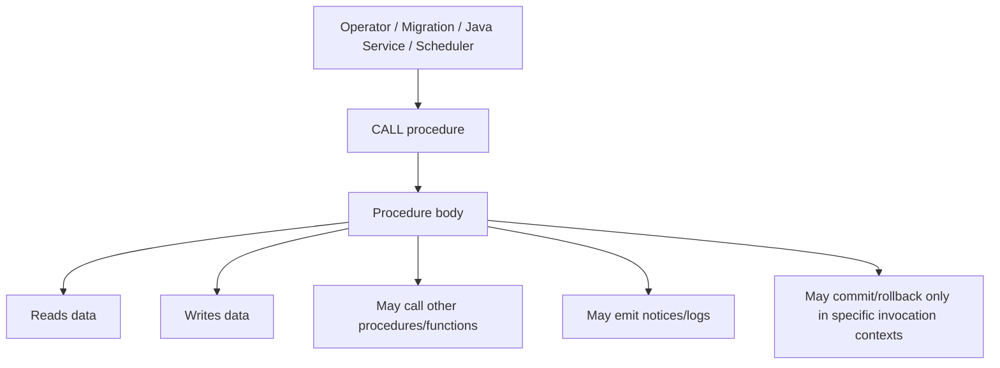
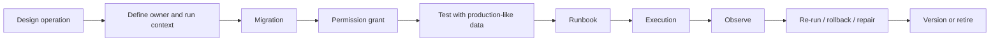

# Part 018 — PostgreSQL Procedures

A PostgreSQL procedure looks similar to a function.

That similarity is dangerous.

A function is normally used as an expression that returns something.

A procedure is normally called as an operation.

The distinction matters because procedures are often used for:

- operational jobs;
- batch processing;
- migration helpers;
- data repair routines;
- administrative workflows;
- database-side maintenance tasks;
- controlled multi-step data changes.

In enterprise systems, procedure design is less about syntax and more about operational responsibility.

A procedure can become a hidden batch engine inside the database.

That may be valid.

It may also become one of the most difficult things to debug during a production incident.

---

## 1. Core mental model

A procedure is a named executable database object invoked with `CALL`.

```sql
call quote.recalculate_quote_rollups(p_tenant_id := '...');
```

At a high level:



A procedure should be read as an operation, not a value expression.

Function mindset:

> Given input, return output.

Procedure mindset:

> Given input, perform controlled work.

---

## 2. Procedure vs function

| Dimension | Function | Procedure |
|---|---|---|
| Invocation | `SELECT function(...)` | `CALL procedure(...)` |
| Main purpose | Compute/return value | Perform operation |
| Return | Scalar/table/set/void | No ordinary expression return; may have OUT params |
| Used in query expression | Yes | No |
| Used in index expression | Yes, if valid | No |
| Transaction control | Function cannot commit/rollback independently | Possible only in specific `CALL` contexts |
| Common use | reusable computation, trigger helper | batch, maintenance, operational routine |
| Java integration | `SELECT` or callable | `CallableStatement` / MyBatis statement |
| Review lens | correctness + planner + contract | operation + side effect + transaction + runbook |

The practical rule:

- use function when you need a value;
- use procedure when you need a controlled operation;
- use application service when you need business workflow orchestration with external context.

---

## 3. Why procedures exist

Procedures exist because some database-side work is operational and multi-step.

Examples:

- recalculate derived rollup tables;
- repair data after an incident;
- migrate data in controlled chunks;
- archive old partitions;
- rebuild read model rows;
- reconcile outbox event status;
- backfill normalized columns;
- perform DBA-approved maintenance operation;
- encapsulate repeatable operational steps.

A procedure is a good fit when:

- the work is close to data;
- the operation is mostly SQL;
- the operation benefits from database-side batching;
- the team has runbook and observability;
- the procedure is not part of latency-sensitive API path;
- the procedure is explicitly owned and reviewed.

A procedure is a weak fit when:

- it implements end-user business workflow;
- it requires authorization context from the application;
- it needs external service calls;
- it publishes Kafka messages directly outside outbox discipline;
- it hides large side effects behind a small API call;
- no one owns its runtime behaviour;
- it cannot be tested safely.

---

## 4. Basic procedure syntax

Example procedure for a controlled maintenance task:

```sql
create or replace procedure ops.mark_stale_quote_drafts(
    p_before timestamptz,
    p_limit integer default 1000
)
language plpgsql
as $$
declare
    v_rows integer;
begin
    update quote
    set status = 'EXPIRED',
        updated_at = now()
    where id in (
        select id
        from quote
        where status = 'DRAFT'
          and updated_at < p_before
        order by updated_at
        limit p_limit
        for update skip locked
    );

    get diagnostics v_rows = row_count;

    raise notice 'Marked % stale quote drafts as expired', v_rows;
end;
$$;
```

Call:

```sql
call ops.mark_stale_quote_drafts(now() - interval '90 days', 500);
```

This is intentionally operational.

It has:

- explicit schema;
- explicit limit;
- bounded batch;
- visible side effect;
- lock-aware pattern;
- diagnostic logging.

Even then, it needs review.

---

## 5. Procedure lifecycle

A procedure lifecycle is operationally heavier than a function lifecycle.



A procedure must answer:

- Who may call it?
- When may it run?
- Is it safe to re-run?
- Is it idempotent?
- Does it commit internally?
- Does it need a maintenance window?
- Does it lock large tables?
- Does it throttle itself?
- Does it emit progress?
- How is it stopped?
- How is partial completion handled?
- How is success validated?
- How is rollback or roll-forward handled?

If those questions are not answered, the procedure is not production-ready.

---

## 6. Transaction control nuance

Procedures can perform transaction control only in specific contexts.

This is one of the most important differences from functions.

But do not overgeneralize.

Transaction control inside procedures is constrained by how the procedure is invoked.

If a Java service calls a procedure inside an already-managed transaction, database-side transaction control may not behave as expected or may be disallowed.

Senior rule:

> Do not design application-request procedures that depend on internal COMMIT/ROLLBACK unless the team has explicitly verified the exact invocation context, driver behaviour, framework transaction management, and PostgreSQL rules.

For most Java/JAX-RS service paths, keep transaction control in the service/application transaction boundary.

Use procedures with internal transaction control primarily for controlled operational contexts where invocation is designed for it.

---

## 7. Procedure inside application transaction

Typical Java service flow:

```java
@Transactional
public void expireDrafts(Instant before) {
    quoteMapper.callMarkStaleDrafts(before, 500);
}
```

The procedure call participates in the application's transaction.

Implications:

- locks are held until the outer transaction commits;
- errors can mark the transaction rollback-only;
- procedure cannot be reasoned about independently;
- statement timeout applies to the call;
- connection pool timeout still matters;
- retry must be handled by application or job runner;
- observability should include procedure call latency.

If the procedure updates 1000 rows but Java transaction stays open for additional work, lock duration increases.

Keep the transaction short.

---

## 8. Procedure from migration runner

Procedures are sometimes used as migration helpers.

Example flow:

1. Add new nullable column.
2. Create helper procedure to backfill in chunks.
3. Run procedure repeatedly through migration/job.
4. Validate row counts.
5. Add constraint/index.
6. Drop helper procedure later.

This can be useful.

But beware of migration runners that execute everything in one transaction.

If the migration tool wraps the entire migration in a transaction, a procedure that tries transaction control may fail or be pointless.

Internal verification must check:

- Liquibase/Flyway transaction setting;
- whether migration is run by app pod, init container, job, or CI/CD;
- lock timeout and statement timeout;
- rollback behaviour;
- visibility of progress;
- whether production uses the same execution mode as lower environments.

---

## 9. Procedure parameters

Procedure parameters should be explicit and bounded.

Good parameters:

- tenant ID;
- time range;
- batch limit;
- dry-run flag;
- operation ID;
- resume checkpoint;
- actor/admin identifier;
- reason/comment;
- maximum runtime hint if enforced externally;
- safety threshold.

Bad parameters:

- raw table name from app user;
- arbitrary SQL fragment;
- unbounded boolean that changes too much;
- vague text mode;
- implicit tenant from session without clear policy;
- no limit for large operation.

Example safer operational procedure:

```sql
create or replace procedure ops.backfill_quote_search_text(
    p_tenant_id uuid,
    p_after_id uuid default null,
    p_limit integer default 1000,
    p_dry_run boolean default true
)
language plpgsql
as $$
begin
    if p_limit <= 0 or p_limit > 10000 then
        raise exception 'Invalid p_limit: %', p_limit;
    end if;

    if p_dry_run then
        raise notice 'Dry run only for tenant %, after %, limit %', p_tenant_id, p_after_id, p_limit;
        return;
    end if;

    -- real bounded update would go here
end;
$$;
```

A procedure should make dangerous operation difficult to run accidentally.

---

## 10. OUT parameters

Procedures may have output parameters.

Example:

```sql
create or replace procedure ops.reconcile_outbox_batch(
    p_limit integer,
    out p_processed integer,
    out p_failed integer
)
language plpgsql
as $$
begin
    p_processed := 0;
    p_failed := 0;

    -- procedure body
end;
$$;
```

Call:

```sql
call ops.reconcile_outbox_batch(1000, null, null);
```

For application integration, output parameters complicate mapper configuration.

Prefer simple observable table-based result for long-running operational jobs:

- operation log table;
- checkpoint table;
- job execution table;
- metrics dashboard;
- explicit validation query.

OUT params are fine for small operations.

They are not a substitute for runbook observability.

---

## 11. Procedure as batch operation

Batch procedures must be bounded.

Bad:

```sql
call ops.recalculate_all_quotes();
```

This is operationally scary.

Better:

```sql
call ops.recalculate_quote_batch(
    p_tenant_id := '...',
    p_from_id := '...',
    p_limit := 1000,
    p_operation_id := '...'
);
```

Batch safety properties:

- bounded row count;
- deterministic ordering;
- resume token;
- idempotency;
- progress tracking;
- lock timeout;
- statement timeout;
- deadlock retry strategy;
- validation query;
- ability to stop safely;
- no unbounded transaction;
- no large table rewrite;
- no surprise trigger cascade.

---

## 12. Procedure as data repair tool

Data repair procedures are high risk.

They usually exist after:

- incident;
- migration defect;
- integration bug;
- duplicate events;
- incorrect status transition;
- bad pricing/currency/rounding rule;
- partial deployment;
- failed backfill.

A data repair procedure must include:

- incident/problem reference;
- precise scope;
- dry-run mode;
- before/after count;
- audit trail;
- backup/PITR awareness;
- approval path;
- rollback or compensating plan;
- customer-impact review;
- evidence for RCA.

Do not keep one-off repair procedures callable forever unless they become supported operational tools.

Drop or revoke them after use if appropriate.

---

## 13. Procedure as read-model rebuild

For materialized read models, a procedure may rebuild rows.

Example use cases:

- rebuild quote summary table;
- refresh order status rollup;
- recompute customer account metrics;
- rebuild search vector table;
- reconcile reporting table.

Procedure design must define:

- source tables;
- target tables;
- isolation expectation;
- idempotency;
- whether rebuild is full or incremental;
- whether readers see partial state;
- swap strategy if full rebuild;
- lock strategy;
- validation query;
- failure recovery.

For production read models, avoid visible partial rebuild unless explicitly acceptable.

---

## 14. Procedure and locking

Procedures that update many rows can create serious locking issues.

Common risks:

- row locks held too long;
- table lock from DDL inside procedure;
- deadlocks from inconsistent ordering;
- lock queue buildup;
- blocking API traffic;
- autovacuum blocked;
- replication lag from large transaction;
- WAL spike;
- index bloat from mass update.

Safer patterns:

- process in small batches;
- order consistently;
- use `FOR UPDATE SKIP LOCKED` for queue-like work;
- set `lock_timeout`;
- set `statement_timeout`;
- avoid DDL in hot procedures;
- avoid large single transaction;
- avoid updating rows that do not need changes;
- run during maintenance window when needed.

Example lock-aware chunk selection:

```sql
with candidate as (
    select id
    from quote
    where status = 'DRAFT'
      and updated_at < p_before
    order by updated_at, id
    limit p_limit
    for update skip locked
)
update quote q
set status = 'EXPIRED',
    updated_at = now()
from candidate c
where q.id = c.id;
```

---

## 15. Procedure and WAL impact

Large procedures can generate large WAL volume.

This affects:

- replication lag;
- WAL disk usage;
- archive storage;
- backup/PITR stream;
- CDC/Debezium lag;
- failover recovery time;
- IO pressure;
- cloud cost.

A procedure that updates millions of rows is not just a CPU/query problem.

It is a replication and recovery problem.

Review should include:

- expected rows changed;
- expected WAL volume;
- replica lag tolerance;
- CDC consumer capacity;
- maintenance window;
- throttling plan;
- monitoring plan.

---

## 16. Procedure and CDC/outbox

If a procedure updates tables captured by CDC, it can generate large event bursts.

Examples:

- backfill updates on order table;
- status repair across many rows;
- read model rebuild on captured table;
- audit table insert storm;
- outbox reconciliation update.

Risks:

- Debezium lag;
- Kafka topic spike;
- consumer overload;
- duplicate downstream processing;
- out-of-order downstream view update;
- reconciliation backlog;
- alert storm.

Before running a procedure on CDC-tracked tables:

- identify captured tables;
- estimate row changes;
- notify platform/data teams;
- throttle batches;
- monitor replication slot lag;
- monitor Kafka lag;
- prepare consumer replay strategy;
- avoid meaningless updates.

---

## 17. Java/JAX-RS integration

Calling a procedure from an API request is possible.

But it should be rare for heavy operations.

Bad request path:

```text
POST /admin/rebuild-read-model
  -> JAX-RS resource
  -> service transaction
  -> CALL ops.rebuild_all_read_models()
  -> 15 minutes
  -> HTTP timeout
```

Better pattern:

```text
POST /admin/rebuild-read-model
  -> validate request
  -> create operation record
  -> enqueue job/outbox event
  -> worker executes bounded batches
  -> API returns operation id
```

Use procedure from Java when:

- operation is short and bounded;
- transaction semantics are understood;
- timeout is configured;
- error mapping is explicit;
- procedure is owned by the same service;
- observability exists.

For long-running work, prefer async job orchestration with database procedure only as a bounded worker step.

---

## 18. JDBC CallableStatement

JDBC can call procedures using `CallableStatement`.

Conceptual example:

```java
try (CallableStatement stmt = connection.prepareCall("call ops.mark_stale_quote_drafts(?, ?)")) {
    stmt.setTimestamp(1, Timestamp.from(before));
    stmt.setInt(2, limit);
    stmt.execute();
}
```

Review points:

- connection transaction state;
- autocommit mode;
- query timeout;
- lock timeout/session settings;
- exception mapping;
- resource closing;
- OUT parameter handling;
- connection pool leak detection;
- observability of procedure name and duration.

Do not hide a heavy procedure behind a generic DAO method like:

```java
maintenanceDao.run();
```

Use explicit names.

---

## 19. MyBatis procedure call

Depending on configuration, MyBatis can call procedures through callable statements.

Conceptual mapper:

```xml
<select id="markStaleQuoteDrafts" statementType="CALLABLE">
  { call ops.mark_stale_quote_drafts(
      #{before, jdbcType=TIMESTAMP},
      #{limit, jdbcType=INTEGER}
    ) }
</select>
```

For PostgreSQL, teams often also use plain SQL `CALL` statements.

```xml
<update id="markStaleQuoteDrafts">
  call ops.mark_stale_quote_drafts(
    #{before, jdbcType=TIMESTAMP},
    #{limit, jdbcType=INTEGER}
  )
</update>
```

Internal verification is required because behaviour depends on:

- driver version;
- MyBatis configuration;
- transaction manager;
- connection pool;
- PostgreSQL version;
- whether OUT params are used;
- whether framework expects result sets.

Mapper review questions:

- Is procedure schema-qualified?
- Is statement type correct?
- Is timeout configured?
- Is transaction boundary explicit?
- Are parameters bounded?
- Are SQLState errors mapped?
- Is this safe in an API request?
- Is there integration test against PostgreSQL?

---

## 20. Error handling

Procedures can fail from:

- constraint violation;
- deadlock;
- lock timeout;
- statement timeout;
- serialization failure;
- invalid input;
- missing data;
- unexpected row count;
- permission error;
- trigger error;
- function error;
- disk full;
- out of memory;
- dynamic SQL error.

Procedure error handling should distinguish:

- expected business/validation errors;
- expected operational limits;
- retryable database errors;
- non-retryable data corruption symptoms;
- programming errors;
- infrastructure failures.

Inside PL/pgSQL, exception blocks are available.

But avoid swallowing errors silently.

Bad:

```sql
exception when others then
    -- ignore
end;
```

Better:

```sql
exception when others then
    raise exception 'Failed to process operation %, SQLSTATE %, message %',
        p_operation_id, sqlstate, sqlerrm;
end;
```

Even better for production repair:

- record failed row ID;
- record SQLSTATE;
- continue only if safe;
- summarize failures;
- make retry/reconciliation explicit.

---

## 21. Logging and diagnostics

PL/pgSQL supports notices and diagnostics.

Example:

```sql
get diagnostics v_rows = row_count;
raise notice 'Updated % rows for operation %', v_rows, p_operation_id;
```

Use notices carefully.

They are useful during manual operations but not always captured cleanly by application logs.

For durable operational visibility, prefer operation tables:

```sql
create table ops.operation_log (
    operation_id uuid primary key,
    operation_name text not null,
    status text not null,
    started_at timestamptz not null,
    finished_at timestamptz,
    processed_count bigint default 0,
    failed_count bigint default 0,
    last_checkpoint text,
    error_message text
);
```

Then procedure can update progress.

But updating progress too frequently adds write overhead.

Balance visibility and cost.

---

## 22. Procedure observability

A production-grade procedure should be observable.

At minimum, know:

- when it started;
- who started it;
- parameters used;
- how many rows it processed;
- how long it ran;
- whether it completed;
- whether it failed;
- where it failed;
- whether it is safe to rerun;
- what validation query proves success.

Database-level signals:

- `pg_stat_activity`;
- wait events;
- locks;
- slow query logs;
- WAL generation;
- replication lag;
- temp file usage;
- dead tuples;
- table/index bloat;
- CPU/IO metrics.

Application-level signals:

- procedure call latency;
- operation ID;
- job status;
- retry count;
- exception mapping;
- alert correlation.

---

## 23. Procedure testing

Test categories:

### Unit-like SQL tests

Use controlled fixtures and assert table state after call.

### Integration tests

Call through MyBatis/JDBC and verify transaction/error behaviour.

### Migration tests

Ensure procedure creates cleanly in empty and upgraded database.

### Data-volume tests

Run against realistic row counts.

### Concurrency tests

Run two procedure calls concurrently when relevant.

### Failure injection

Test:

- invalid parameter;
- lock timeout;
- duplicate data;
- missing row;
- partial failure;
- rerun after failure.

### Security tests

Verify runtime role can only call approved procedures.

Verify unauthorized role cannot call privileged operation.

---

## 24. Idempotency

A procedure is idempotent if running it multiple times produces safe results.

Many operational procedures should be idempotent.

Example idempotent update:

```sql
update quote
set search_text = computed.search_text
from computed
where quote.id = computed.quote_id
  and quote.search_text is distinct from computed.search_text;
```

This avoids rewriting rows unnecessarily.

Benefits:

- lower WAL;
- fewer trigger activations;
- less bloat;
- safer rerun;
- easier reconciliation.

If procedure is not idempotent, document why and enforce safeguards.

Non-idempotent examples:

- inserting audit rows on every run;
- incrementing counters;
- generating new event IDs;
- changing state based on current state without guard;
- deleting rows without checkpoint.

---

## 25. Dry-run mode

For risky operational procedures, dry-run mode can prevent incidents.

Dry-run should report:

- target row count;
- sample target IDs;
- expected changes;
- safety threshold check;
- validation query;
- estimated batch count.

Dry-run should not:

- acquire long locks;
- mutate data;
- create outbox events;
- update audit rows as if real;
- give false confidence with different query path.

Example:

```sql
if p_dry_run then
    select count(*) into v_count
    from quote
    where status = 'DRAFT'
      and updated_at < p_before;

    raise notice 'Dry run: % rows would be affected', v_count;
    return;
end if;
```

For large tables, even dry-run `count(*)` may be expensive.

Design dry-run carefully.

---

## 26. Procedure versioning

Like functions, procedures need versioning.

Risky pattern:

```sql
create or replace procedure ops.repair_order_state(...)
```

Then body changes repeatedly across incidents.

No one knows which version ran.

Better patterns:

- include operation ID;
- include migration ID;
- include procedure version in comment/log;
- use incident-specific procedure names for one-off repairs;
- retire/drop after use;
- keep reusable operational procedures stable;
- record procedure version in operation log.

Example:

```sql
comment on procedure ops.backfill_quote_search_text(uuid, uuid, integer, boolean)
is 'Backfills quote.search_text in bounded batches. Version 2026-07-11. Safe to rerun when p_dry_run=false due to IS DISTINCT FROM guard.';
```

---

## 27. Procedure permissions

Procedures can be dangerous if broadly executable.

Permission review:

```sql
revoke all on procedure ops.mark_stale_quote_drafts(timestamptz, integer) from public;

grant execute on procedure ops.mark_stale_quote_drafts(timestamptz, integer) to app_quote_maintenance;
```

Separate roles may exist for:

- runtime API service;
- background worker;
- migration runner;
- DBA/operator;
- read-only reporting;
- incident repair.

Do not let normal API runtime role execute powerful ops procedures unless required.

---

## 28. Procedure security risks

Security risks include:

- broad execute grants;
- dynamic SQL injection;
- privileged owner misuse;
- unsafe search path;
- tenant boundary bypass;
- PII exposure in notices/logs;
- unaudited data repair;
- procedure callable from app path unexpectedly;
- permission drift after migration.

Dynamic SQL in procedures must be reviewed aggressively.

Bad:

```sql
execute 'delete from ' || p_table || ' where id = ' || p_id;
```

Safer but still review carefully:

```sql
execute format('delete from %I.%I where id = $1', p_schema, p_table)
using p_id;
```

Even with quoting, dynamic table operations should usually be restricted to DBA-owned maintenance procedures.

---

## 29. Procedure anti-patterns

### Unbounded all-table operation

```sql
call ops.fix_everything();
```

No scope, no limit, no runbook.

### Procedure as hidden service

```sql
call order.submit_order(#{orderId});
```

If this performs full business workflow, it bypasses application service architecture.

### Procedure with implicit tenant

```sql
call ops.repair_customer_data();
```

If tenant is read from session setting, verify session setting lifecycle in connection pool.

### Procedure that commits unpredictably

Internal transaction control without clear invocation context is dangerous.

### Procedure that swallows errors

Silent partial failure is worse than loud failure.

### Procedure that emits Kafka indirectly without outbox discipline

Database-side event behaviour must respect event consistency architecture.

### Procedure that cannot be rerun

Operational jobs fail. Rerun strategy is not optional.

---

## 30. Procedures in microservices

Procedure ownership must not cross service boundaries casually.

Bad:

- Billing service calls Order DB procedure directly.
- Fulfillment service calls Quote DB procedure directly.
- Reporting job updates service-owned tables through procedure without owner approval.

Better:

- owning service owns procedures in its schema;
- other services request operation through API/event;
- cross-service data repair is coordinated through architecture/runbook;
- reporting rebuild uses approved read model path;
- procedure access grants reflect service ownership.

A procedure is a write-capable database API.

Treat it as a service boundary risk.

---

## 31. Cloud-managed PostgreSQL considerations

On AWS/Azure managed PostgreSQL, verify:

- PostgreSQL version supports required procedure behaviour;
- parameter permissions;
- logging visibility for `NOTICE`/errors;
- superuser restrictions;
- extension dependencies;
- timeout settings;
- maintenance window constraints;
- replica/CDC impact;
- backup/PITR before risky operation;
- monitoring dashboards.

Managed database does not remove procedure risk.

It changes who owns certain controls.

---

## 32. Kubernetes considerations

If procedures are triggered from Kubernetes jobs:

- ensure job restart policy does not duplicate unsafe work;
- use operation ID for idempotency;
- store checkpoint in database;
- set resource limits carefully;
- configure active deadline;
- avoid many jobs calling same procedure concurrently unless designed;
- use leader election or locking if needed;
- inject secrets safely;
- capture logs;
- expose metrics;
- coordinate with deployment waves.

If app pods call procedures:

- calculate max concurrent procedure calls across replicas;
- protect with application-level rate limit or job queue;
- avoid procedure storms during startup;
- ensure liveness/readiness probes do not trigger database work.

---

## 33. On-prem considerations

On-prem/self-managed environments require explicit operational agreement:

- who can deploy procedure;
- who can execute procedure;
- whether DBA approval is required;
- whether procedure runs during maintenance window;
- where logs are captured;
- how backup is verified before risky call;
- how PITR works;
- how failover affects running procedure;
- how audit evidence is retained;
- how air-gapped deployments receive procedure changes.

In regulated enterprise systems, execution evidence may matter as much as SQL correctness.

---

## 34. Failure modes

Common procedure failure modes:

### Lock failure

Procedure waits behind active API transactions or blocks them.

### Timeout

Statement timeout kills the call halfway.

### Deadlock

Procedure updates rows in order conflicting with application path.

### Partial completion

Procedure updates some rows then fails.

### Non-idempotent rerun

Retry duplicates effects.

### WAL spike

Large update creates replication/CDC lag.

### Hidden trigger cascade

Procedure update fires triggers that perform unexpected work.

### Constraint violation

Data does not satisfy assumptions.

### Permission failure

Migration created procedure but forgot grant.

### Wrong tenant scope

Procedure updates more data than intended.

### Bad dynamic SQL

Procedure executes wrong object or unsafe SQL.

### Observability failure

No one knows what happened or how far it got.

---

## 35. Detection and debugging

When a procedure misbehaves:

1. Identify exact procedure signature.
2. Check who called it and when.
3. Check parameters.
4. Check transaction context.
5. Check current `pg_stat_activity`.
6. Check locks and blockers.
7. Check wait events.
8. Check rows affected if logged.
9. Check operation log/checkpoint.
10. Check database logs for errors/notices.
11. Check application logs around procedure call.
12. Check recent migrations.
13. Check triggers on touched tables.
14. Check replication/CDC lag.
15. Check WAL/disk growth.
16. Check validation query.
17. Decide rerun, rollback, or repair.

Useful introspection:

```sql
select pg_get_functiondef('ops.mark_stale_quote_drafts(timestamptz, integer)'::regprocedure);
```

Procedures are stored in function catalogs internally, so function introspection tools often apply.

List procedures:

```sql
select n.nspname as schema_name,
       p.proname as procedure_name,
       pg_get_function_arguments(p.oid) as arguments
from pg_proc p
join pg_namespace n on n.oid = p.pronamespace
where p.prokind = 'p'
order by n.nspname, p.proname;
```

---

## 36. Procedure runbook template

Every risky production procedure should have a runbook.

Template:

```md
# Procedure Runbook: <schema.procedure_name>

## Purpose
What problem does this procedure solve?

## Owner
Service/team/DBA owner.

## Scope
Which tenant/table/time range/data set?

## Preconditions
- backup/PITR status
- maintenance window
- approvals
- expected row count
- CDC/replica impact reviewed

## Dry run
SQL command and expected output.

## Execution
Exact CALL statement.

## Monitoring
- pg_stat_activity
- locks
- replication lag
- WAL/disk
- app/job logs
- operation table

## Success validation
Queries proving success.

## Failure handling
What to do on timeout, deadlock, partial failure.

## Rerun safety
Is it idempotent? How to resume?

## Rollback / roll-forward
Concrete plan.

## Communication
Who to notify before/during/after.
```

A procedure without a runbook should not be used for risky production operations.

---

## 37. PR review checklist

For a procedure PR, ask:

### Intent

- Why is this a procedure instead of application code?
- Is this operational, batch, migration, or business workflow?
- Who owns it?
- Is it temporary or permanent?

### Scope

- Is tenant/time/key scope explicit?
- Is batch limit required?
- Is dry-run supported?
- Is operation ID supported?
- Is there a safety threshold?

### Transaction

- Does it rely on internal transaction control?
- How is it invoked?
- Is framework transaction behaviour verified?
- Are locks held too long?
- Is rerun safe after partial failure?

### Performance

- How many rows can it touch?
- Are queries indexed?
- Is order deterministic?
- Does it generate large WAL?
- Does it affect replication/CDC?
- Does it create bloat?

### Locking

- Does it use consistent ordering?
- Is `SKIP LOCKED` appropriate?
- Are lock/statement timeouts set?
- Does it conflict with hot API paths?

### Security

- Who can execute it?
- Are grants narrow?
- Does it use dynamic SQL?
- Does it expose PII in logs/notices?
- Does it bypass tenant isolation?

### Observability

- Is progress visible?
- Are row counts logged?
- Is operation status stored?
- Are failure details captured safely?
- Is there a dashboard/alert impact?

### Migration

- Is creation ordered correctly?
- Are grants included?
- Is rollback/roll-forward clear?
- Should the procedure be dropped after use?
- Is version/comment included?

### Java/MyBatis

- Is mapper explicit?
- Is timeout configured?
- Is transaction boundary clear?
- Are exceptions mapped?
- Is there integration test?

---

## 38. Internal verification checklist

For CSG/team verification, check rather than assume.

### Repository and migrations

- Search for `create procedure`.
- Search for `call ` in mapper XML and SQL scripts.
- Search for `statementType="CALLABLE"`.
- Search for migration helper procedures.
- Search for incident repair SQL.
- Search for scheduled DB jobs or Kubernetes jobs calling procedures.

### Database catalog

- List `pg_proc` where `prokind = 'p'`.
- Identify schemas containing procedures.
- Identify owners.
- Identify grants.
- Identify procedures using dynamic SQL.
- Identify procedures touching large/hot tables.

### Runtime

- Check whether procedures are called by API path, worker, migration, scheduler, or DBA manually.
- Check procedure call frequency.
- Check slow query logs.
- Check procedure-related incident notes.
- Check lock/deadlock history.
- Check CDC/replication lag during past procedure runs.

### Platform/operations

- Check runbook existence.
- Check backup/PITR requirement before risky procedures.
- Check approval path.
- Check maintenance window policy.
- Check observability dashboard.
- Check emergency stop/rollback process.

### Java/MyBatis

- Check transaction manager behaviour.
- Check autocommit mode.
- Check query timeout.
- Check exception mapping.
- Check integration tests.
- Check whether procedure call is hidden behind generic DAO names.

### Security/compliance

- Check who can execute ops procedures.
- Check whether runtime app role has excessive execute privileges.
- Check PII handling in notices/logs.
- Check audit evidence for data repair.
- Check separation between migration account and runtime account.

### Team discussion

Ask DBA/platform/backend team:

- Are procedures allowed in product code?
- Are they only for operations/migrations?
- Who approves procedure changes?
- Can procedures perform transaction control?
- Are application services allowed to call procedures?
- What runbook standard is required?
- How are procedure executions audited?

---

## 39. Practical exercises

### Exercise 1 — Procedure inventory

List all procedures.

Classify each:

- operational;
- batch;
- migration helper;
- data repair;
- read-model rebuild;
- business workflow;
- unknown.

Unknown is a production risk.

### Exercise 2 — Runbook review

Pick one procedure that changes data.

Write a runbook using the template above.

If you cannot fill it in, the procedure is not operationally mature.

### Exercise 3 — Transaction context test

Call a procedure through:

- direct psql session;
- migration runner;
- MyBatis integration test;
- application service transaction.

Compare behaviour.

### Exercise 4 — Idempotency test

Run a procedure twice against test data.

Verify:

- no duplicate side effects;
- row counts make sense;
- audit/event behaviour is expected;
- retry after simulated failure is safe.

### Exercise 5 — CDC impact review

For a procedure updating many rows, estimate:

- rows changed;
- WAL generated;
- CDC messages generated;
- downstream consumer impact;
- throttling needed.

---

## 40. Senior engineer heuristics

Use a procedure when:

- the operation is data-local;
- the operation is bounded;
- the operation is operational/batch/migration-oriented;
- ownership is explicit;
- runbook exists;
- idempotency or resume strategy exists;
- observability exists;
- security grants are narrow;
- invocation context is verified.

Avoid a procedure when:

- it hides business workflow;
- it runs unbounded work;
- it depends on unclear transaction control;
- it bypasses application authorization;
- it produces events outside the outbox/CDC design;
- it cannot be safely retried;
- it has no runbook;
- it has no owner;
- it is called synchronously from latency-sensitive API paths.

A good procedure makes dangerous operational work safer.

A bad procedure makes dangerous operational work invisible.

---

## 41. References

Primary references to verify while studying this part:

- PostgreSQL Documentation — `CREATE PROCEDURE`
- PostgreSQL Documentation — `CALL`
- PostgreSQL Documentation — PL/pgSQL Transaction Management
- PostgreSQL Documentation — PL/pgSQL Basic Statements
- PostgreSQL Documentation — Function and Procedure Security
- PostgreSQL Documentation — System Catalogs, especially `pg_proc`

---

## 42. Key takeaway

Procedures are not just functions with a different keyword.

They represent database-side operations.

That means the review lens must include transaction behaviour, side effects, locks, WAL, CDC, runbook, permissions, retry, observability, and production blast radius.

For Java/JAX-RS enterprise systems, procedures should be used deliberately: mostly for bounded data-local operational work, not as hidden service-layer workflow.
