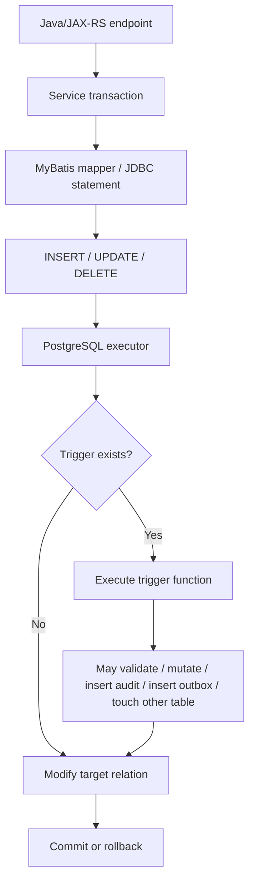
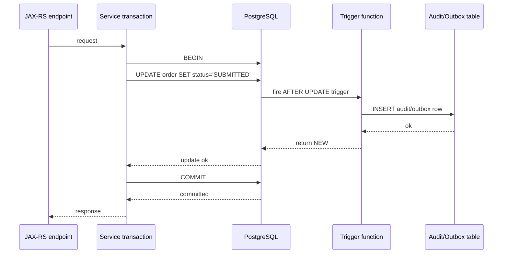
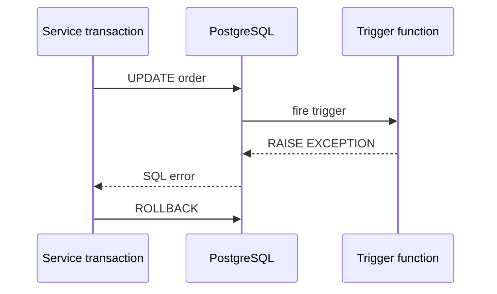
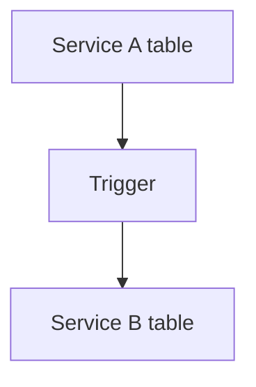

# Part 019 — PostgreSQL Triggers and Database-Side Automation

> Goal: understand PostgreSQL triggers as **implicit write-path automation**. A trigger can protect invariants and reduce duplication, but it can also hide side effects, create performance cliffs, and make Java/JAX-RS behavior harder to reason about.

This part is not about memorizing trigger syntax. It is about knowing when a trigger is the right boundary, when it is a production hazard, and how to review/debug it in an enterprise Java + PostgreSQL system.

---

## 1. Executive mental model

A trigger is database code that PostgreSQL executes automatically when a table or view operation happens.

In application terms:



The key point: **your Java code may execute one SQL statement, but the database may perform more work than that statement visibly says.**

That is useful when the trigger enforces an invariant that must never be bypassed. It is dangerous when the trigger hides business workflow, calls expensive logic, or writes to tables the service owner does not expect.

---

## 2. What a PostgreSQL trigger is

A PostgreSQL trigger has two parts:

1. **Trigger function**
   - The function that contains logic.
   - Commonly written in PL/pgSQL.
   - Must return `trigger` for normal DML triggers.

2. **Trigger binding**
   - The trigger attached to a table or view.
   - Defines when it fires: `BEFORE`, `AFTER`, or `INSTEAD OF`.
   - Defines which event fires it: `INSERT`, `UPDATE`, `DELETE`, or `TRUNCATE`.
   - Defines granularity: row-level or statement-level.
   - May include a `WHEN` condition.

Minimal shape:

```sql
CREATE FUNCTION audit_quote_update()
RETURNS trigger
LANGUAGE plpgsql
AS $$
BEGIN
  INSERT INTO quote_audit (
    quote_id,
    operation,
    changed_at,
    changed_by
  )
  VALUES (
    NEW.id,
    TG_OP,
    now(),
    current_setting('app.user_id', true)
  );

  RETURN NEW;
END;
$$;

CREATE TRIGGER trg_quote_audit_update
AFTER UPDATE ON quote
FOR EACH ROW
EXECUTE FUNCTION audit_quote_update();
```

The syntax is simple. The hard part is deciding whether this logic belongs in a trigger at all.

---

## 3. Trigger timing: BEFORE, AFTER, INSTEAD OF

### 3.1 BEFORE trigger

A `BEFORE` trigger fires before PostgreSQL applies the row change.

Common use cases:

- Normalize or derive column values before insert/update.
- Validate a row and reject invalid state.
- Fill fields not supplied by application.
- Prevent forbidden transitions.

Example:

```sql
CREATE FUNCTION normalize_quote_code()
RETURNS trigger
LANGUAGE plpgsql
AS $$
BEGIN
  NEW.quote_code := upper(trim(NEW.quote_code));
  RETURN NEW;
END;
$$;

CREATE TRIGGER trg_normalize_quote_code
BEFORE INSERT OR UPDATE OF quote_code ON quote
FOR EACH ROW
EXECUTE FUNCTION normalize_quote_code();
```

Important behavior:

- It can modify `NEW` before the row is stored.
- Returning `NULL` from a row-level `BEFORE` trigger skips the row operation.
- It runs inside the same transaction as the caller.

### 3.2 AFTER trigger

An `AFTER` trigger fires after PostgreSQL has performed the row operation.

Common use cases:

- Write audit records.
- Write outbox records.
- Maintain derived tables.
- Enforce cross-row/cross-table logic after the row exists.

Example:

```sql
CREATE FUNCTION insert_quote_outbox_event()
RETURNS trigger
LANGUAGE plpgsql
AS $$
BEGIN
  INSERT INTO outbox_event (
    aggregate_type,
    aggregate_id,
    event_type,
    payload,
    created_at
  )
  VALUES (
    'QUOTE',
    NEW.id,
    'QuoteUpdated',
    jsonb_build_object('quoteId', NEW.id, 'status', NEW.status),
    clock_timestamp()
  );

  RETURN NEW;
END;
$$;

CREATE TRIGGER trg_quote_outbox_update
AFTER UPDATE OF status ON quote
FOR EACH ROW
WHEN (OLD.status IS DISTINCT FROM NEW.status)
EXECUTE FUNCTION insert_quote_outbox_event();
```

Important behavior:

- It cannot modify the already-written target row by changing `NEW`.
- It can perform other SQL operations.
- Failures in the trigger fail the whole statement/transaction.

### 3.3 INSTEAD OF trigger

An `INSTEAD OF` trigger is commonly used on views to make writes against a view possible.

Common use cases:

- Updatable API-like view.
- Compatibility facade during migration.
- Controlled write interface over multiple tables.

Example shape:

```sql
CREATE TRIGGER trg_write_quote_view
INSTEAD OF INSERT ON quote_write_view
FOR EACH ROW
EXECUTE FUNCTION insert_quote_from_view();
```

Use with caution. It makes the database surface look simpler than the real write path. That can be useful as a compatibility layer, but it can also make debugging much harder.

---

## 4. Trigger granularity: row-level vs statement-level

### 4.1 Row-level trigger

A row-level trigger executes once per affected row.

```sql
CREATE TRIGGER trg_quote_item_audit
AFTER UPDATE ON quote_item
FOR EACH ROW
EXECUTE FUNCTION audit_quote_item_update();
```

If an update modifies 50,000 rows, this trigger fires 50,000 times.

Use row-level triggers when logic depends on `OLD` and `NEW` row values.

### 4.2 Statement-level trigger

A statement-level trigger executes once per SQL statement.

```sql
CREATE TRIGGER trg_quote_bulk_touch
AFTER UPDATE ON quote_item
FOR EACH STATEMENT
EXECUTE FUNCTION refresh_quote_summary_after_bulk_change();
```

Use statement-level triggers when:

- You only need to know that a table changed.
- You want to schedule or mark aggregate refresh.
- Per-row work would be too expensive.

### 4.3 Transition tables

For `AFTER` triggers, PostgreSQL supports transition tables in some cases, allowing access to sets of affected rows.

Conceptual example:

```sql
CREATE TRIGGER trg_quote_item_bulk_audit
AFTER UPDATE ON quote_item
REFERENCING OLD TABLE AS old_rows NEW TABLE AS new_rows
FOR EACH STATEMENT
EXECUTE FUNCTION audit_quote_item_bulk_update();
```

This can be cleaner than row-by-row trigger logic for bulk operations, but it requires careful testing.

---

## 5. Trigger metadata variables

Inside a trigger function, PostgreSQL exposes special variables.

Common variables:

| Variable | Meaning |
|---|---|
| `NEW` | New row for `INSERT`/`UPDATE` row-level triggers |
| `OLD` | Old row for `UPDATE`/`DELETE` row-level triggers |
| `TG_OP` | Operation: `INSERT`, `UPDATE`, `DELETE`, `TRUNCATE` |
| `TG_TABLE_NAME` | Table name |
| `TG_TABLE_SCHEMA` | Schema name |
| `TG_NAME` | Trigger name |
| `TG_WHEN` | `BEFORE`, `AFTER`, or `INSTEAD OF` |
| `TG_LEVEL` | `ROW` or `STATEMENT` |

Example:

```sql
CREATE FUNCTION prevent_invalid_order_transition()
RETURNS trigger
LANGUAGE plpgsql
AS $$
BEGIN
  IF TG_OP = 'UPDATE'
     AND OLD.status = 'CANCELLED'
     AND NEW.status <> 'CANCELLED' THEN
    RAISE EXCEPTION 'cancelled order cannot transition to %', NEW.status
      USING ERRCODE = '23514';
  END IF;

  RETURN NEW;
END;
$$;
```

---

## 6. Common enterprise trigger patterns

## 6.1 Audit trigger

Audit triggers capture what changed.

They may store:

- Table name.
- Primary key.
- Operation.
- Old row snapshot.
- New row snapshot.
- Changed fields.
- Actor/user id.
- Request id/correlation id.
- Transaction timestamp.

Example:

```sql
CREATE FUNCTION audit_row_change()
RETURNS trigger
LANGUAGE plpgsql
AS $$
DECLARE
  v_actor text := current_setting('app.user_id', true);
  v_request_id text := current_setting('app.request_id', true);
BEGIN
  INSERT INTO audit_log (
    table_schema,
    table_name,
    operation,
    row_pk,
    old_data,
    new_data,
    actor,
    request_id,
    changed_at
  )
  VALUES (
    TG_TABLE_SCHEMA,
    TG_TABLE_NAME,
    TG_OP,
    COALESCE(to_jsonb(NEW)->>'id', to_jsonb(OLD)->>'id'),
    CASE WHEN TG_OP IN ('UPDATE', 'DELETE') THEN to_jsonb(OLD) END,
    CASE WHEN TG_OP IN ('INSERT', 'UPDATE') THEN to_jsonb(NEW) END,
    v_actor,
    v_request_id,
    clock_timestamp()
  );

  RETURN COALESCE(NEW, OLD);
END;
$$;
```

Why it exists:

- Audit must not depend on every application code path remembering to write audit rows.
- Direct database writes should still be audited.
- Compliance evidence may require write traceability.

Risks:

- Audit table grows very fast.
- JSON snapshots may contain sensitive data.
- Heavy audit trigger can slow all writes.
- Missing application context makes audit records less useful.

Java/JAX-RS impact:

- The service should set session-local context before DML.
- Example: `SET LOCAL app.user_id = ?`, `SET LOCAL app.request_id = ?` inside the transaction.
- With connection pooling, use `SET LOCAL`, not session-persistent `SET`, unless carefully reset.

## 6.2 Derived column trigger

A trigger can populate derived values.

Example:

```sql
CREATE FUNCTION quote_item_compute_total()
RETURNS trigger
LANGUAGE plpgsql
AS $$
BEGIN
  NEW.total_amount := NEW.quantity * NEW.unit_price;
  RETURN NEW;
END;
$$;

CREATE TRIGGER trg_quote_item_compute_total
BEFORE INSERT OR UPDATE OF quantity, unit_price ON quote_item
FOR EACH ROW
EXECUTE FUNCTION quote_item_compute_total();
```

Alternative:

- Use generated columns if expression is deterministic and simple.
- Use application logic if value depends on domain workflow.
- Use materialized/read model if value is aggregate-heavy.

Review question:

> Is this derived value a pure data invariant, or business policy that belongs in service/domain logic?

## 6.3 Validation trigger

A trigger can reject writes that violate complex rules.

Example:

```sql
CREATE FUNCTION reject_negative_quote_total()
RETURNS trigger
LANGUAGE plpgsql
AS $$
BEGIN
  IF NEW.total_amount < 0 THEN
    RAISE EXCEPTION 'quote total cannot be negative'
      USING ERRCODE = '23514';
  END IF;

  RETURN NEW;
END;
$$;
```

Prefer built-in constraints when possible:

```sql
ALTER TABLE quote_item
ADD CONSTRAINT ck_quote_item_total_non_negative
CHECK (total_amount >= 0);
```

Trigger validation is justified when:

- Rule needs cross-table lookup.
- Rule depends on operation type.
- Rule depends on transition from `OLD` to `NEW`.
- Rule cannot be expressed as a regular constraint.

But remember: trigger validation may be harder for application engineers to discover than table constraints.

## 6.4 Outbox trigger

An outbox trigger writes event records when data changes.

Example:

```sql
CREATE FUNCTION order_status_outbox()
RETURNS trigger
LANGUAGE plpgsql
AS $$
BEGIN
  IF OLD.status IS DISTINCT FROM NEW.status THEN
    INSERT INTO outbox_event (
      aggregate_type,
      aggregate_id,
      event_type,
      payload,
      created_at
    ) VALUES (
      'ORDER',
      NEW.id,
      'OrderStatusChanged',
      jsonb_build_object(
        'orderId', NEW.id,
        'oldStatus', OLD.status,
        'newStatus', NEW.status
      ),
      clock_timestamp()
    );
  END IF;

  RETURN NEW;
END;
$$;
```

Why it exists:

- The event record is committed atomically with the database change.
- The application does not need dual-write to Kafka inside the transaction.
- A CDC or polling publisher can later publish to Kafka.

Risks:

- Event schema is hidden in trigger code.
- Every data fix/update may emit events unless guarded.
- Backfill scripts can accidentally produce massive event streams.
- Trigger-based outbox can bypass application-level event versioning conventions.

Safer pattern:

- Use outbox table as a first-class domain artifact.
- Keep event schema explicit and versioned.
- Add trigger only if the team deliberately chooses database-side event capture.
- Provide a way to disable/suppress event emission for controlled maintenance only if governance allows it.

## 6.5 Updated-at trigger

Common pattern:

```sql
CREATE FUNCTION set_updated_at()
RETURNS trigger
LANGUAGE plpgsql
AS $$
BEGIN
  NEW.updated_at := clock_timestamp();
  RETURN NEW;
END;
$$;
```

This is simple but not always harmless.

Questions:

- Should `updated_at` change on every update, including no-op updates?
- Should system backfills preserve historical timestamp?
- Should business effective date be separate from technical update timestamp?
- Does the application also set `updated_at`, causing conflicting ownership?

## 6.6 Soft-delete trigger

Some systems use triggers to convert delete into update.

```sql
-- Conceptual. Use carefully.
CREATE FUNCTION prevent_delete_and_soft_delete()
RETURNS trigger
LANGUAGE plpgsql
AS $$
BEGIN
  UPDATE quote
  SET deleted_at = clock_timestamp()
  WHERE id = OLD.id;

  RETURN NULL;
END;
$$;
```

This is often a smell.

Why:

- Application thinks it deleted a row.
- FK/cascade behavior becomes confusing.
- ORM/mapper expectations may break.
- Bulk delete semantics become surprising.

Prefer explicit soft-delete operation in application/service logic unless there is a strong compatibility reason.

---

## 7. Trigger lifecycle in a PostgreSQL transaction

A trigger executes inside the same transaction as the statement that fired it.



If the trigger fails:



Important consequences:

- Trigger writes roll back if the outer transaction rolls back.
- Trigger exceptions abort the statement and usually the transaction.
- Trigger cost is part of request latency.
- Trigger locks are part of transaction locking behavior.
- Trigger-generated rows can participate in deadlocks.

---

## 8. How triggers affect Java/JAX-RS services

From Java code, a mapper call may look simple:

```java
orderMapper.updateStatus(orderId, Status.SUBMITTED);
```

But the actual database work may be:

1. Update `order`.
2. Fire validation trigger.
3. Insert audit row.
4. Insert outbox event.
5. Update derived summary.
6. Acquire locks on other tables.
7. Raise exception if state transition invalid.

This affects:

- Latency budget.
- Transaction duration.
- Error mapping.
- Retry behavior.
- Test expectations.
- Observability.
- Data repair operations.

### 8.1 Error mapping

A trigger may raise errors that surface as `SQLException` or framework-specific database exceptions.

Example PL/pgSQL:

```sql
RAISE EXCEPTION 'invalid order transition from % to %', OLD.status, NEW.status
  USING ERRCODE = '23514';
```

Application review question:

> Does Java map this SQLState to a domain-safe API response, or does it become a generic 500?

### 8.2 Request context propagation

Audit/outbox triggers often need actor, tenant, or request id.

Do not rely on global session state with connection pools unless you reset it correctly.

Prefer transaction-local settings:

```sql
SET LOCAL app.user_id = 'u-123';
SET LOCAL app.request_id = 'req-456';
```

Then inside trigger:

```sql
current_setting('app.request_id', true)
```

Caution:

- `SET LOCAL` only works inside a transaction.
- With autocommit, each statement is its own transaction.
- If the pool uses PgBouncer transaction pooling, session assumptions become even more dangerous.

---

## 9. How triggers affect MyBatis/JDBC

MyBatis executes SQL explicitly, but triggers add implicit behavior.

Common issues:

### 9.1 Returned row is not what application expects

A `BEFORE` trigger may modify columns. If the application wants generated/modified values, it must fetch them.

Use `RETURNING` where appropriate:

```sql
INSERT INTO quote (quote_code, status)
VALUES (#{quoteCode}, #{status})
RETURNING id, quote_code, status, created_at, updated_at
```

### 9.2 Row count surprises

A trigger may skip a row by returning `NULL` from a `BEFORE` row-level trigger. This can make update counts surprising.

In general, avoid triggers that silently skip application-requested writes unless there is a strong reason and tests cover it.

### 9.3 Batch operation amplification

A MyBatis batch update that touches 100,000 rows may execute one logical mapper operation but fire 100,000 row-level triggers.

Review question:

> Is this mapper safe for bulk operation if triggers fire once per row?

### 9.4 Hidden SQL injection risk via dynamic trigger code

If trigger functions use dynamic SQL, verify `quote_ident`, `quote_literal`, `format('%I', ...)`, and parameter binding with `EXECUTE ... USING`.

This belongs to PL/pgSQL review, but the risk may be triggered by application-provided values.

---

## 10. Triggers in microservices and event-driven architecture

Triggers can violate service boundaries if used carelessly.

Bad pattern:



Why it is dangerous:

- Service A writes cause hidden changes in Service B data.
- Ownership becomes unclear.
- Deployment/migration coordination becomes fragile.
- Incident blast radius crosses service boundaries.

Better patterns:

1. Trigger only writes within the same service-owned schema.
2. Cross-service effects happen through outbox + Kafka/event contract.
3. Read models are explicitly owned and rebuildable.
4. Reporting projections are documented as derived data.

If a trigger writes to another service's table, treat it as an architecture smell requiring explicit ADR review.

---

## 11. Triggers in Kubernetes, AWS, Azure, on-prem, and hybrid environments

Trigger behavior is the same PostgreSQL conceptually, but operations differ by environment.

### 11.1 Kubernetes/self-managed

Verify:

- Trigger-heavy workloads affect CPU/IO on primary pod.
- Backups include functions/triggers.
- Restore drills preserve triggers.
- Migration ordering creates functions before triggers.
- Operator-based upgrades preserve extension/function compatibility.

### 11.2 AWS RDS/Aurora PostgreSQL-compatible

Verify:

- Permission model for creating functions/triggers.
- Extension availability if trigger uses extension features.
- Performance Insights visibility for trigger-driven statements may be indirect.
- Logical replication/CDC interaction if triggers write outbox tables.

### 11.3 Azure Database for PostgreSQL

Verify:

- Role privileges for function/trigger creation.
- Server parameter constraints.
- Query Store/monitoring visibility.
- Backup/restore behavior for database objects.

### 11.4 On-prem/hybrid

Verify:

- DBA governance for database-side code.
- Deployment order across app/database releases.
- Backup validation includes database functions/triggers.
- Audit/compliance policies for trigger-maintained data.

---

## 12. Failure modes

## 12.1 Hidden side effect

Symptom:

- Java executes one mapper update, but another table changes unexpectedly.

Cause:

- Trigger writes to audit/outbox/summary/state table.

Detection:

```sql
SELECT
  event_object_schema,
  event_object_table,
  trigger_name,
  action_timing,
  event_manipulation,
  action_statement
FROM information_schema.triggers
ORDER BY event_object_schema, event_object_table, trigger_name;
```

## 12.2 Trigger causes slow write

Symptom:

- Simple update becomes slow.
- Bulk job takes much longer than expected.

Cause:

- Row-level trigger performs query per row.
- Trigger updates aggregate table causing contention.
- Trigger writes large JSON audit row.

Detection:

- Compare performance with trigger disabled in lower environment.
- Inspect trigger function code.
- Use `EXPLAIN` on queries inside trigger.
- Check wait events and locks.

## 12.3 Trigger causes deadlock

Symptom:

- Deadlock errors from update/insert that look harmless.

Cause:

- Trigger touches tables in different order from application code.
- Two transactions update target table and trigger-updated table in opposite order.

Mitigation:

- Standardize table access order.
- Avoid cross-table writes in triggers unless necessary.
- Keep trigger logic short.
- Add retry for deadlock-safe operations.

## 12.4 Trigger emits unintended events during backfill

Symptom:

- Kafka/outbox volume spikes during data migration.
- Consumers process historical updates as live business events.

Cause:

- Backfill updates rows that fire outbox trigger.

Mitigation:

- Plan event emission explicitly.
- Use migration mode only with governance.
- Add `WHEN` clause to trigger.
- Backfill using dedicated controlled path.
- Reconcile event stream after migration.

## 12.5 Trigger breaks migration

Symptom:

- Migration fails because trigger references dropped/renamed column.
- Application deploy succeeds but writes fail.

Cause:

- Database object dependency not considered.

Detection:

```sql
SELECT
  dependent_ns.nspname AS dependent_schema,
  dependent_view.relname AS dependent_object,
  source_ns.nspname AS source_schema,
  source_table.relname AS source_object
FROM pg_depend d
JOIN pg_rewrite r ON r.oid = d.objid
JOIN pg_class dependent_view ON dependent_view.oid = r.ev_class
JOIN pg_class source_table ON source_table.oid = d.refobjid
JOIN pg_namespace dependent_ns ON dependent_ns.oid = dependent_view.relnamespace
JOIN pg_namespace source_ns ON source_ns.oid = source_table.relnamespace;
```

For trigger-specific inspection, check `pg_trigger`, `pg_proc`, and migration scripts.

## 12.6 Trigger recursion

Symptom:

- Update fires trigger, trigger updates same table, trigger fires again.

Mitigation:

- Avoid self-updating triggers where possible.
- Use `WHEN` conditions.
- Use `pg_trigger_depth()` carefully if needed.
- Prefer generated columns or explicit application logic for simple derived values.

## 12.7 Missing application context

Symptom:

- Audit rows show null actor/request id.

Cause:

- Application did not set transaction-local context.
- Connection pool reused connection with wrong session variable.
- Autocommit prevented `SET LOCAL` from applying as expected.

Mitigation:

- Enforce request context setup in transaction middleware.
- Add test for audit context.
- Use `current_setting(..., true)` and handle null explicitly.

---

## 13. Debugging trigger behavior

## 13.1 List triggers on a table

```sql
SELECT
  t.tgname AS trigger_name,
  c.relname AS table_name,
  n.nspname AS schema_name,
  p.proname AS function_name,
  pg_get_triggerdef(t.oid) AS trigger_definition
FROM pg_trigger t
JOIN pg_class c ON c.oid = t.tgrelid
JOIN pg_namespace n ON n.oid = c.relnamespace
JOIN pg_proc p ON p.oid = t.tgfoid
WHERE NOT t.tgisinternal
  AND n.nspname = 'public'
  AND c.relname = 'quote'
ORDER BY t.tgname;
```

## 13.2 Inspect trigger function source

```sql
SELECT
  n.nspname AS schema_name,
  p.proname AS function_name,
  pg_get_functiondef(p.oid) AS function_definition
FROM pg_proc p
JOIN pg_namespace n ON n.oid = p.pronamespace
WHERE p.proname = 'audit_row_change';
```

## 13.3 Add temporary diagnostic logging

Inside PL/pgSQL:

```sql
RAISE NOTICE 'trigger %, op %, table %.%', TG_NAME, TG_OP, TG_TABLE_SCHEMA, TG_TABLE_NAME;
```

Use carefully. Excessive `RAISE NOTICE` can create noisy logs and affect performance.

## 13.4 Check trigger enablement state

```sql
SELECT
  t.tgname,
  t.tgenabled,
  pg_get_triggerdef(t.oid)
FROM pg_trigger t
WHERE NOT t.tgisinternal;
```

Trigger enablement values include normal enabled/disabled states and replication-related modes.

## 13.5 Reproduce in a transaction

Use explicit transaction in lower environment:

```sql
BEGIN;

SET LOCAL app.user_id = 'debug-user';
SET LOCAL app.request_id = 'debug-request';

UPDATE quote
SET status = 'APPROVED'
WHERE id = '...';

SELECT * FROM audit_log WHERE request_id = 'debug-request';
SELECT * FROM outbox_event WHERE aggregate_id = '...';

ROLLBACK;
```

This lets you inspect trigger side effects without committing.

---

## 14. Testing strategy

Trigger tests should not only test syntax. They should test behavior.

Minimum tests:

1. Insert/update/delete fires expected trigger.
2. Trigger does not fire when `WHEN` condition is false.
3. Audit/outbox payload contains required context.
4. Invalid transition is rejected.
5. Bulk update performance is acceptable.
6. Migration creates function before trigger.
7. Rollback rolls back trigger side effects.
8. Backfill path does not accidentally emit business events unless intended.

Example test scenario:

```sql
BEGIN;

SET LOCAL app.user_id = 'test-user';
SET LOCAL app.request_id = 'test-request';

INSERT INTO quote (id, status) VALUES ('00000000-0000-0000-0000-000000000001', 'DRAFT');

UPDATE quote
SET status = 'APPROVED'
WHERE id = '00000000-0000-0000-0000-000000000001';

SELECT count(*)
FROM audit_log
WHERE request_id = 'test-request';

ROLLBACK;
```

For Java/MyBatis integration tests, verify:

- The mapper call observes database-derived fields correctly.
- Trigger exceptions map to expected domain errors.
- Transaction rollback removes trigger-created rows.
- Connection pool does not leak session context.

---

## 15. Design decision framework

Before adding a trigger, ask these questions:

### 15.1 Is the invariant purely data-level?

Good trigger/constraint candidate:

- Audit every update to a regulated table.
- Maintain technical updated timestamp.
- Reject impossible row transition.

Poor trigger candidate:

- Complex approval workflow.
- Product eligibility rules that change frequently.
- Cross-service orchestration.

### 15.2 Can a built-in database feature do it better?

Prefer:

- `CHECK` constraint over validation trigger.
- `FOREIGN KEY` over lookup trigger.
- `GENERATED` column over simple derived trigger.
- `DEFAULT` over insert trigger for simple default.
- Application service over hidden workflow trigger.

### 15.3 Is the side effect obvious to maintainers?

If future engineers cannot discover the trigger during PR review, the trigger is risky.

Document it in:

- Migration file.
- Architecture decision record.
- Table documentation.
- Runbook.
- PR checklist.

### 15.4 What happens during backfill?

Every trigger design should answer:

- Should backfill fire this trigger?
- If yes, is the volume safe?
- If no, what controlled bypass exists?
- Who approves bypass?
- How do we validate data afterward?

### 15.5 What happens during restore/replay?

For audit/outbox triggers:

- Will replay create duplicate audit/outbox rows?
- Will CDC publish restored historical rows?
- Is there idempotency or dedupe?

---

## 16. Correctness concerns

Triggers can improve correctness by centralizing invariants, but they can also weaken correctness if invisible.

Watch for:

- Application and trigger both owning same field.
- Trigger mutating data without application awareness.
- Trigger relying on current time when business effective time is required.
- Trigger emitting events for internal maintenance updates.
- Trigger enforcing business rules differently from service layer.
- Trigger reading data without proper locks under concurrency.
- Trigger assuming row update order.

Rule of thumb:

> Use triggers for database invariants and unavoidable database-side automation. Avoid triggers as a hidden domain workflow engine.

---

## 17. Performance concerns

Trigger performance is write-path performance.

Risky patterns:

- Row-level trigger with queries against large tables.
- Trigger that aggregates child rows on every child update.
- Trigger that updates a hot parent summary row.
- Trigger that serializes large JSON snapshots.
- Trigger that calls volatile functions repeatedly.
- Trigger that inserts into unpartitioned audit table with high volume.

Mitigation:

- Use `WHEN` clauses.
- Keep trigger logic minimal.
- Use statement-level triggers where possible.
- Partition high-volume audit/outbox tables.
- Index trigger-written tables appropriately.
- Move heavy aggregation to async read model refresh.
- Measure bulk update impact before production migration.

---

## 18. Security and privacy concerns

Trigger code runs with privileges determined by function security settings and caller context.

Review:

- Does the trigger function use `SECURITY DEFINER`?
- Is `search_path` controlled inside security definer functions?
- Does audit trigger copy sensitive columns into JSON logs?
- Are audit/outbox payloads encrypted or redacted if needed?
- Can application roles bypass triggers by writing to different tables/views?
- Who can disable triggers?
- Are migration roles too powerful?

Security definer example hardening pattern:

```sql
CREATE FUNCTION secure_audit_row_change()
RETURNS trigger
LANGUAGE plpgsql
SECURITY DEFINER
SET search_path = app_schema, pg_temp
AS $$
BEGIN
  -- function body
  RETURN COALESCE(NEW, OLD);
END;
$$;
```

Do not use `SECURITY DEFINER` casually. It changes the privilege model.

---

## 19. Observability concerns

Triggers are not always obvious in application traces.

Minimum observability expectations:

- Slow writes identify whether trigger cost is involved.
- Audit/outbox tables have volume metrics.
- Trigger exceptions are mapped and logged with SQLState.
- Migration logs include object creation order.
- Incident runbooks include trigger inspection query.
- pg_stat_statements is available for statements inside functions where visible.

Recommended dashboards/checks:

- Write latency per table/endpoint.
- Outbox growth rate.
- Audit table growth rate.
- Deadlock count.
- Lock wait time.
- Trigger-owned table bloat.
- Failed migration count.

---

## 20. Migration discipline for triggers

Database object ordering matters.

Safe ordering:

1. Create or replace trigger function.
2. Create trigger binding.
3. Deploy application code that depends on behavior.
4. Validate trigger behavior.
5. Remove old trigger only after compatibility window.

For breaking changes:

- Use expand-contract.
- Version functions if needed.
- Avoid changing trigger output/event schema in place without consumer compatibility.
- Keep old and new triggers temporarily only if duplicate side effects are controlled.
- Document rollback/roll-forward plan.

Example migration guard:

```sql
DROP TRIGGER IF EXISTS trg_quote_audit_update ON quote;

CREATE TRIGGER trg_quote_audit_update
AFTER UPDATE ON quote
FOR EACH ROW
WHEN (OLD.* IS DISTINCT FROM NEW.*)
EXECUTE FUNCTION audit_row_change();
```

Be careful with `CREATE OR REPLACE FUNCTION`: replacing a function changes behavior for all triggers using it.

---

## 21. Trigger review checklist

Use this checklist during PR/ADR review.

### Purpose

- What invariant or automation does this trigger enforce?
- Why cannot this be a constraint/default/generated column/application service?
- Is the trigger part of domain logic, audit, outbox, validation, or compatibility?

### Scope

- Which table/view owns the trigger?
- Does it write to other tables?
- Does it cross service/schema ownership boundary?
- Does it fire per row or per statement?

### Correctness

- What happens on INSERT/UPDATE/DELETE?
- Does it handle NULLs correctly?
- Does it handle no-op updates?
- Does it handle bulk updates?
- Does it handle rollback?
- Does it handle retry/idempotency?

### Concurrency

- Does it acquire locks beyond the target row?
- Can it deadlock with application code?
- Does it read data that should be locked?
- Does it update hot summary rows?

### Performance

- Is it row-level on high-volume tables?
- Does it query large tables?
- Does it write large JSON payloads?
- Is the trigger-written table indexed/partitioned?
- Has bulk operation impact been tested?

### Java/JAX-RS and MyBatis

- Does the mapper know trigger-mutated fields?
- Does application fetch `RETURNING` values if needed?
- Are trigger exceptions mapped to domain/API errors?
- Is request context set with `SET LOCAL`?
- Is connection pooling safe?

### Operations

- Is there a way to inspect/debug it?
- Is it included in migration order?
- Is rollback/roll-forward documented?
- Does backfill intentionally fire or bypass it?
- Is it visible in runbooks and dashboards?

### Security/privacy

- Does it use `SECURITY DEFINER`?
- Is `search_path` safe?
- Does audit/outbox payload contain PII?
- Who can disable/alter the trigger?

---

## 22. Internal verification checklist

Verify these in the actual CSG/team environment. Do not assume.

### Database objects

- List all non-internal triggers.
- Identify trigger functions and owning schema.
- Identify tables/views with triggers.
- Identify triggers on high-write tables.
- Identify trigger functions using dynamic SQL.

### Codebase and migration repository

- Locate migration files that create triggers/functions.
- Check naming conventions for trigger/function objects.
- Check whether `CREATE OR REPLACE FUNCTION` is used safely.
- Check rollback/roll-forward strategy.
- Check whether object dependencies are documented.

### Java/JAX-RS and MyBatis

- Find mapper operations on trigger-owned tables.
- Check whether application expects trigger-mutated values.
- Check whether `RETURNING` is used where required.
- Check SQLState/domain error mapping.
- Check transaction-local context setup for audit.

### CI/CD and GitOps

- Check migration execution order.
- Check whether database object changes are tested in CI.
- Check whether trigger tests run with integration database.
- Check whether GitOps repository contains DB object manifests/scripts if applicable.

### Observability and operations

- Check dashboards for trigger-heavy table write latency.
- Check audit/outbox table growth.
- Check slow query logs involving trigger functions.
- Check incident notes for hidden side effects/deadlocks.
- Check runbook for disabling/re-enabling triggers if policy allows it.

### DBA/SRE/backend team discussion

Ask:

- Are triggers allowed for domain logic?
- Are triggers allowed for audit/outbox?
- Who approves trigger changes?
- How are triggers tested and rolled back?
- What is the policy for disabling triggers during backfill?
- How are trigger side effects documented for service owners?

---

## 23. Practical heuristics

- Prefer constraints for simple invariants.
- Prefer generated columns for simple deterministic derived values.
- Prefer application service logic for business workflow.
- Prefer explicit outbox writes when event schema is application-owned.
- Use triggers when invariants must hold regardless of write path.
- Keep trigger functions small.
- Avoid cross-service writes.
- Treat trigger changes as architecture changes, not just SQL changes.
- Test bulk operations, not only single-row happy path.
- Make trigger side effects observable and documented.

---

## 24. Senior-engineer takeaway

Triggers are neither bad nor magical. They are **implicit execution paths inside the database transaction**.

A senior engineer should be able to answer:

- What fires this trigger?
- What does it read and write?
- What locks can it acquire?
- How does it affect application latency?
- How does it behave during rollback/retry/backfill?
- How is it tested?
- How is it observed?
- How is it migrated safely?
- How can it fail in production?

If the team cannot answer those questions, the trigger is a production risk.

---

## 25. References for deeper study

- PostgreSQL documentation: `CREATE TRIGGER`
- PostgreSQL documentation: Trigger Functions
- PostgreSQL documentation: PL/pgSQL
- PostgreSQL documentation: System catalogs `pg_trigger`, `pg_proc`
- PostgreSQL documentation: Explicit locking
- PostgreSQL documentation: Event triggers, if schema-level event automation becomes relevant
