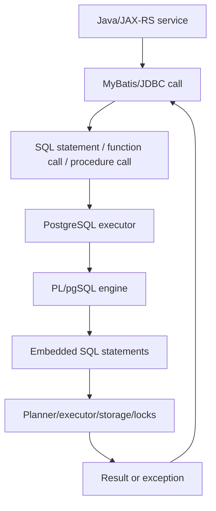

# Part 020 — PL/pgSQL Deep Dive

> Goal: learn PL/pgSQL as **production database code**, not just procedural SQL. PL/pgSQL can be valuable for data-local operations, migrations, validation, and operational routines, but it can also become an opaque second application layer if not governed carefully.

This part assumes you already understand functions, procedures, and triggers at a conceptual level. Now we go deeper into how PL/pgSQL works, how to write it safely, how to debug it, and how to decide whether it should exist.

---

## 1. Executive mental model

PL/pgSQL is PostgreSQL's procedural language for writing server-side logic.

It lets you combine:

- SQL statements.
- Variables.
- Conditional logic.
- Loops.
- Exception handling.
- Dynamic SQL.
- Diagnostics.
- Function/procedure/trigger logic.

Mental model:



PL/pgSQL does not escape PostgreSQL's rules. It still participates in:

- Transactions.
- Locks.
- MVCC.
- Query planning.
- Permissions.
- Search path.
- WAL generation.
- Replication behavior.
- Observability constraints.

The most important senior-engineer question:

> Is this logic better placed in PostgreSQL because it is data-local and invariant-oriented, or is it application/domain workflow disguised as database code?

---

## 2. When PL/pgSQL is appropriate

Good uses:

- Trigger functions for audit, derived data, validation, or outbox patterns.
- Migration helper functions for controlled backfill or data transformation.
- Operational procedures that need to run close to data.
- Data repair routines with strict transaction semantics.
- Small reusable data-local functions.
- Security-definer wrappers when carefully governed.
- Complex SQL orchestration that would otherwise require excessive client-server roundtrips.

Risky uses:

- Core business workflow hidden from Java service layer.
- Large procedural application inside the database.
- Long-running batch procedure without checkpoint/resume.
- Dynamic SQL based on unsafe user input.
- Function that performs queries per row in high-volume trigger.
- Error handling that swallows data corruption.
- Logic that bypasses service authorization/audit model.

Rule of thumb:

> PL/pgSQL is best for database-local invariants and operational data work. It is dangerous as an undocumented replacement for the application service layer.

---

## 3. Basic PL/pgSQL block structure

A PL/pgSQL function body is organized as a block:

```sql
CREATE FUNCTION example_function(p_quote_id uuid)
RETURNS text
LANGUAGE plpgsql
AS $$
DECLARE
  v_status text;
BEGIN
  SELECT status
  INTO v_status
  FROM quote
  WHERE id = p_quote_id;

  RETURN v_status;
END;
$$;
```

Block sections:

| Section | Purpose |
|---|---|
| `DECLARE` | Local variables, cursors, aliases |
| `BEGIN` | Executable statements |
| `EXCEPTION` | Optional error handling |
| `END` | End of block |

Nested blocks are allowed:

```sql
BEGIN
  -- outer block
  DECLARE
    v_inner_count integer;
  BEGIN
    -- inner block
  END;
END;
```

Nested blocks can isolate exception handling or variable scope, but excessive nesting quickly hurts readability.

---

## 4. Variables and assignment

Declare variables in the `DECLARE` section:

```sql
DECLARE
  v_quote_id uuid;
  v_total numeric(18,2) := 0;
  v_status text := 'DRAFT';
  v_now timestamptz := clock_timestamp();
```

Assignment:

```sql
v_total := v_total + 100;
```

Selecting into variables:

```sql
SELECT status, total_amount
INTO v_status, v_total
FROM quote
WHERE id = p_quote_id;
```

Important: if `SELECT INTO` returns no rows, variables become null unless strict behavior is used.

Use `STRICT` if exactly one row is required:

```sql
SELECT status
INTO STRICT v_status
FROM quote
WHERE id = p_quote_id;
```

`STRICT` raises an exception when:

- No row is returned.
- More than one row is returned.

Production guidance:

- Use `STRICT` when uniqueness is part of the invariant.
- Avoid silently treating missing rows as null unless that is intentional.
- Prefer explicit exception mapping when the caller needs a domain error.

---

## 5. Row and record variables

You can store a table row or generic record.

```sql
DECLARE
  v_quote quote%ROWTYPE;
  v_any record;
BEGIN
  SELECT *
  INTO STRICT v_quote
  FROM quote
  WHERE id = p_quote_id;
END;
```

`%ROWTYPE` tracks table shape. This is convenient but can make functions sensitive to table changes.

Trade-off:

- `%ROWTYPE` reduces repetitive column declarations.
- Explicit variables make dependencies clearer.

For migration-heavy systems, explicit columns often make review safer.

---

## 6. Function parameters

Basic parameters:

```sql
CREATE FUNCTION get_quote_status(p_quote_id uuid)
RETURNS text
LANGUAGE plpgsql
AS $$
DECLARE
  v_status text;
BEGIN
  SELECT status INTO STRICT v_status
  FROM quote
  WHERE id = p_quote_id;

  RETURN v_status;
END;
$$;
```

Input/output parameters:

```sql
CREATE FUNCTION compute_quote_summary(
  p_quote_id uuid,
  OUT item_count integer,
  OUT total_amount numeric
)
LANGUAGE plpgsql
AS $$
BEGIN
  SELECT count(*), coalesce(sum(amount), 0)
  INTO item_count, total_amount
  FROM quote_item
  WHERE quote_id = p_quote_id;
END;
$$;
```

Use parameter naming conventions such as:

- `p_` for parameters.
- `v_` for variables.
- `r_` for row/record variables.

This avoids ambiguity between column names and variable names.

Bad:

```sql
WHERE id = id
```

Better:

```sql
WHERE quote.id = p_quote_id
```

---

## 7. Control flow: IF, CASE, and guard clauses

### 7.1 IF

```sql
IF v_status = 'APPROVED' THEN
  RAISE EXCEPTION 'approved quote cannot be modified';
ELSIF v_status = 'EXPIRED' THEN
  RAISE EXCEPTION 'expired quote cannot be modified';
ELSE
  -- allowed
END IF;
```

### 7.2 CASE expression

```sql
v_priority := CASE v_status
  WHEN 'DRAFT' THEN 10
  WHEN 'APPROVED' THEN 50
  WHEN 'SUBMITTED' THEN 100
  ELSE 0
END;
```

### 7.3 Guard clause style

For production readability, prefer guard clauses for validation:

```sql
IF p_quote_id IS NULL THEN
  RAISE EXCEPTION 'quote id is required'
    USING ERRCODE = '22004';
END IF;

IF v_status = 'CANCELLED' THEN
  RAISE EXCEPTION 'cancelled quote cannot be changed'
    USING ERRCODE = '23514';
END IF;
```

This keeps the happy path less nested.

---

## 8. Loops

PL/pgSQL supports several loop styles.

### 8.1 Simple LOOP

```sql
LOOP
  EXIT WHEN v_done;
  -- work
END LOOP;
```

### 8.2 WHILE loop

```sql
WHILE v_remaining > 0 LOOP
  -- work
  v_remaining := v_remaining - 1;
END LOOP;
```

### 8.3 Integer FOR loop

```sql
FOR i IN 1..10 LOOP
  RAISE NOTICE 'iteration %', i;
END LOOP;
```

### 8.4 Query FOR loop

```sql
FOR r_item IN
  SELECT id, amount
  FROM quote_item
  WHERE quote_id = p_quote_id
LOOP
  -- process r_item
END LOOP;
```

Production warning:

> Row-by-row loops are often slower than set-based SQL.

Bad pattern:

```sql
FOR r IN SELECT id FROM quote_item WHERE quote_id = p_quote_id LOOP
  UPDATE quote_item
  SET status = 'PROCESSED'
  WHERE id = r.id;
END LOOP;
```

Prefer set-based SQL:

```sql
UPDATE quote_item
SET status = 'PROCESSED'
WHERE quote_id = p_quote_id;
```

Use loops when:

- Each row needs independent error handling.
- You need chunking/checkpointing.
- You call an operation that cannot be expressed set-wise.
- You need controlled throttling in a maintenance routine.

---

## 9. Cursors

A cursor lets you process result rows incrementally.

Example shape:

```sql
DECLARE
  cur_items CURSOR FOR
    SELECT id, amount
    FROM quote_item
    WHERE quote_id = p_quote_id;
  r_item record;
BEGIN
  OPEN cur_items;

  LOOP
    FETCH cur_items INTO r_item;
    EXIT WHEN NOT FOUND;

    -- process r_item
  END LOOP;

  CLOSE cur_items;
END;
```

Use cursors carefully. In many cases, a set-based statement is better.

Cursors are useful for:

- Controlled batch processing.
- Large result processing where memory matters.
- Procedural migration logic.

But they can:

- Hold transaction resources longer.
- Keep snapshots open.
- Delay vacuum cleanup if transaction runs too long.

For very large backfills, prefer chunked external jobs or resumable procedures instead of one huge cursor transaction.

---

## 10. Exception handling

PL/pgSQL supports exception blocks.

```sql
BEGIN
  INSERT INTO quote_reference (quote_code)
  VALUES (p_quote_code);
EXCEPTION
  WHEN unique_violation THEN
    RAISE EXCEPTION 'quote code already exists: %', p_quote_code
      USING ERRCODE = '23505';
END;
```

Exception blocks create subtransaction-like overhead. Do not put exception handling inside tight loops unless necessary.

### 10.1 Common conditions

Examples:

- `unique_violation`
- `foreign_key_violation`
- `check_violation`
- `not_null_violation`
- `no_data_found`
- `too_many_rows`
- `division_by_zero`
- `others`

### 10.2 Avoid swallowing exceptions

Bad:

```sql
EXCEPTION
  WHEN others THEN
    RETURN;
```

This hides corruption and makes incidents hard to debug.

Better:

```sql
EXCEPTION
  WHEN unique_violation THEN
    RAISE EXCEPTION 'duplicate quote reference for quote %', p_quote_id
      USING ERRCODE = '23505';
  WHEN others THEN
    RAISE;
END;
```

### 10.3 Add context without losing SQLState

```sql
EXCEPTION
  WHEN foreign_key_violation THEN
    RAISE EXCEPTION 'invalid quote reference during quote migration: quote_id=%', p_quote_id
      USING ERRCODE = SQLSTATE;
END;
```

Be careful: not every rewritten exception preserves the original diagnostic context. For production debugging, prefer re-raising when you do not need domain mapping.

---

## 11. RAISE and diagnostics

`RAISE` supports levels:

- `DEBUG`
- `LOG`
- `INFO`
- `NOTICE`
- `WARNING`
- `EXCEPTION`

Example:

```sql
RAISE NOTICE 'processing quote %', p_quote_id;
```

Exception with detail/hint:

```sql
RAISE EXCEPTION 'invalid state transition'
  USING
    ERRCODE = '23514',
    DETAIL = format('quote_id=%s, old=%s, new=%s', p_quote_id, v_old_status, v_new_status),
    HINT = 'Check allowed quote state transition matrix';
```

Use diagnostic logging carefully:

- Temporary `NOTICE` is useful in lower environments.
- Excessive logging in production can create noise and overhead.
- Do not log PII or secrets.
- Include correlation/request id if available through `current_setting`.

### 11.1 GET DIAGNOSTICS

After DML, you can inspect affected row count:

```sql
GET DIAGNOSTICS v_row_count = ROW_COUNT;

IF v_row_count <> 1 THEN
  RAISE EXCEPTION 'expected 1 row, updated % rows', v_row_count;
END IF;
```

This is useful in data repair and migration scripts.

---

## 12. Dynamic SQL

Dynamic SQL executes SQL built at runtime.

```sql
EXECUTE 'SELECT count(*) FROM ' || quote_ident(p_table_name)
INTO v_count;
```

Prefer `format` with identifier quoting:

```sql
EXECUTE format('SELECT count(*) FROM %I.%I', p_schema_name, p_table_name)
INTO v_count;
```

Use parameters with `USING` for values:

```sql
EXECUTE format('UPDATE %I.%I SET status = $1 WHERE id = $2', p_schema_name, p_table_name)
USING p_status, p_id;
```

Important distinction:

- Identifiers such as table/column names must be safely quoted with `%I` or `quote_ident`.
- Values should be passed using `USING`, not string concatenation.

Bad:

```sql
EXECUTE 'UPDATE quote SET status = ''' || p_status || ''' WHERE id = ''' || p_id || '''';
```

Better:

```sql
EXECUTE 'UPDATE quote SET status = $1 WHERE id = $2'
USING p_status, p_id;
```

Dynamic SQL is justified when:

- You operate on partition/table names dynamically.
- You write admin/migration utilities.
- You build generic audit/repair tools.

Dynamic SQL is risky when:

- It is driven by end-user input.
- It bypasses normal mapper parameterization.
- It hides dependencies from static review.
- It changes query shape unpredictably.

---

## 13. Temporary tables

PL/pgSQL can use temporary tables for staged processing.

```sql
CREATE TEMP TABLE tmp_quote_backfill (
  quote_id uuid PRIMARY KEY,
  computed_total numeric(18,2)
) ON COMMIT DROP;
```

Use cases:

- Multi-step migration.
- Data reconciliation.
- Complex transformation pipeline.
- Bulk staging.

Concerns:

- Temporary table schema exists per session.
- Connection pooling can complicate temp table assumptions.
- Large temp tables consume disk/temp space.
- Long transactions hold resources.
- In managed databases, temp file usage may affect storage pressure.

For Java/JAX-RS request path, avoid temp-table-heavy logic unless there is a strong reason. For migration/admin routines, temp tables can be very useful.

---

## 14. Transaction nuance

### 14.1 Functions run inside caller transaction

A PostgreSQL function does not independently commit or roll back.

If Java does:

```sql
BEGIN;
SELECT perform_quote_update(...);
ROLLBACK;
```

All writes inside the function roll back.

### 14.2 Procedures can perform transaction control in limited contexts

Procedures invoked with `CALL` can perform transaction control only when called in a context that allows it. In many application-managed transaction setups, letting a procedure control commits is undesirable.

For enterprise Java systems, prefer:

- Application/service controls transaction boundary.
- Database functions/procedures do deterministic internal work.
- Long-running maintenance jobs have explicit runbooks.

### 14.3 Exception blocks and subtransactions

Exception blocks use internal subtransaction behavior. This is useful but not free.

Avoid:

```sql
FOR r IN SELECT ... LOOP
  BEGIN
    -- risky operation
  EXCEPTION WHEN others THEN
    -- continue
  END;
END LOOP;
```

unless you deliberately need per-row failure isolation and have measured cost.

---

## 15. Set-based thinking vs procedural thinking

The biggest PL/pgSQL performance mistake is writing procedural loops where SQL would do.

Procedural mindset:

```sql
FOR r IN SELECT id FROM quote WHERE status = 'EXPIRED' LOOP
  UPDATE quote SET status = 'ARCHIVED' WHERE id = r.id;
END LOOP;
```

Set-based mindset:

```sql
UPDATE quote
SET status = 'ARCHIVED'
WHERE status = 'EXPIRED';
```

Why set-based is usually better:

- Fewer executor invocations.
- Better planner optimization.
- Lower context switching.
- Cleaner lock behavior.
- Easier to reason about row count.

Use procedural logic when the procedure itself is the value, not as a substitute for SQL fluency.

---

## 16. PL/pgSQL with triggers

A trigger function must return `trigger`.

Typical pattern:

```sql
CREATE FUNCTION enforce_quote_status_transition()
RETURNS trigger
LANGUAGE plpgsql
AS $$
BEGIN
  IF TG_OP = 'UPDATE'
     AND OLD.status = 'APPROVED'
     AND NEW.status = 'DRAFT' THEN
    RAISE EXCEPTION 'cannot move approved quote back to draft'
      USING ERRCODE = '23514';
  END IF;

  RETURN NEW;
END;
$$;
```

Trigger-specific concerns:

- `NEW` is null for DELETE.
- `OLD` is null for INSERT.
- Row-level triggers can execute many times.
- Statement-level triggers do not have `NEW`/`OLD` row values.
- `BEFORE` triggers can modify `NEW`.
- `AFTER` triggers are better for audit/outbox side effects.

---

## 17. PL/pgSQL with Java/JAX-RS and MyBatis

### 17.1 Calling a function

MyBatis mapper SQL shape:

```sql
SELECT compute_quote_total(#{quoteId})
```

For returning table:

```sql
SELECT *
FROM get_quote_summary(#{quoteId})
```

### 17.2 Calling a procedure

```sql
CALL rebuild_quote_summary(#{quoteId})
```

### 17.3 Error propagation

A PL/pgSQL exception becomes a database error surfaced through JDBC.

Review:

- SQLState mapping.
- Message safety.
- Domain vs technical error boundary.
- Retryability.
- Logging/correlation id.

### 17.4 Type mapping

Watch for:

- `uuid` to Java `UUID`.
- `numeric` to `BigDecimal`.
- `timestamptz` to `OffsetDateTime` or equivalent policy.
- `jsonb` to JSON object/string with TypeHandler.
- PostgreSQL enum to Java enum mapping.
- Arrays to Java collections.

### 17.5 Observability gap

Application traces may show one mapper call while database performs many internal statements. For critical PL/pgSQL routines:

- Add structured audit rows if appropriate.
- Emit safe diagnostic logs during admin jobs.
- Record job run id/checkpoint rows for backfills.
- Measure function/procedure duration externally.

---

## 18. PL/pgSQL in migrations and backfills

PL/pgSQL is often useful for migration helper logic.

Example chunked backfill helper:

```sql
CREATE TABLE IF NOT EXISTS quote_backfill_checkpoint (
  job_name text PRIMARY KEY,
  last_id uuid,
  updated_at timestamptz NOT NULL DEFAULT clock_timestamp()
);
```

Conceptual function:

```sql
CREATE FUNCTION backfill_quote_totals(p_limit integer)
RETURNS integer
LANGUAGE plpgsql
AS $$
DECLARE
  v_count integer;
BEGIN
  WITH candidate AS (
    SELECT q.id
    FROM quote q
    WHERE q.total_amount IS NULL
    ORDER BY q.id
    LIMIT p_limit
  ), updated AS (
    UPDATE quote q
    SET total_amount = s.total_amount
    FROM (
      SELECT quote_id, sum(amount) AS total_amount
      FROM quote_item
      WHERE quote_id IN (SELECT id FROM candidate)
      GROUP BY quote_id
    ) s
    WHERE q.id = s.quote_id
    RETURNING q.id
  )
  SELECT count(*) INTO v_count FROM updated;

  RETURN v_count;
END;
$$;
```

Production migration concerns:

- Is the function idempotent?
- Can it resume?
- Does it lock too much?
- Does it fire triggers?
- Does it emit outbox/audit rows?
- Does it have validation/reconciliation queries?
- Does it have rollback or roll-forward plan?
- Is it removed after migration if temporary?

Temporary migration helper functions should usually be dropped after use unless they are operationally supported.

---

## 19. Debugging PL/pgSQL

### 19.1 Inspect function definition

```sql
SELECT pg_get_functiondef('app_schema.compute_quote_total(uuid)'::regprocedure);
```

### 19.2 Search functions by name

```sql
SELECT
  n.nspname AS schema_name,
  p.proname AS function_name,
  pg_get_function_arguments(p.oid) AS args,
  pg_get_function_result(p.oid) AS result_type
FROM pg_proc p
JOIN pg_namespace n ON n.oid = p.pronamespace
WHERE p.proname ILIKE '%quote%'
ORDER BY n.nspname, p.proname;
```

### 19.3 Find functions using a table name

This is text-based but useful:

```sql
SELECT
  n.nspname,
  p.proname
FROM pg_proc p
JOIN pg_namespace n ON n.oid = p.pronamespace
WHERE pg_get_functiondef(p.oid) ILIKE '%quote_item%';
```

### 19.4 Add RAISE diagnostics

```sql
RAISE NOTICE 'job %, processed rows %', p_job_name, v_count;
```

### 19.5 Validate row counts

```sql
GET DIAGNOSTICS v_row_count = ROW_COUNT;
RAISE NOTICE 'updated % rows', v_row_count;
```

### 19.6 Reproduce inside transaction

```sql
BEGIN;

SELECT backfill_quote_totals(100);

-- inspect results
SELECT count(*) FROM quote WHERE total_amount IS NULL;

ROLLBACK;
```

This allows safe behavior inspection in non-production/lower environments.

---

## 20. Performance caveats

PL/pgSQL performance issues often come from embedded SQL, not the procedural language itself.

Common problems:

1. Loop executes query per row.
2. Function called per row in a large query.
3. Trigger function performs aggregate query per updated row.
4. Dynamic SQL prevents stable plan expectations.
5. Function volatility prevents optimization.
6. Exception handling inside tight loop creates overhead.
7. Large temporary tables create temp file pressure.
8. Long-running function holds transaction snapshot.

Review function usage:

```sql
SELECT expensive_function(col)
FROM huge_table;
```

If `huge_table` has 10 million rows, the function may execute 10 million times.

For functions in indexes:

- Function must be immutable for expression index semantics.
- Incorrect volatility classification can create wrong results.
- Do not mark a function `IMMUTABLE` just for performance if it reads tables, settings, time, or external state.

---

## 21. Security model

PL/pgSQL functions normally run with caller privileges unless marked `SECURITY DEFINER`.

### 21.1 SECURITY INVOKER

Default behavior. Function runs with permissions of caller.

This is usually safer.

### 21.2 SECURITY DEFINER

Function runs with privileges of function owner.

Use cases:

- Controlled access wrapper.
- Audited administrative routine.
- Limited privilege escalation for a specific operation.

Risks:

- Search path hijacking.
- Privilege escalation.
- Unsafe dynamic SQL.
- Excessive owner privileges.

Hardening:

```sql
CREATE FUNCTION app_schema.secure_operation(p_id uuid)
RETURNS void
LANGUAGE plpgsql
SECURITY DEFINER
SET search_path = app_schema, pg_temp
AS $$
BEGIN
  -- controlled logic
END;
$$;
```

Additional checks:

- Revoke public execute if not intended.
- Grant execute only to specific roles.
- Keep owner role minimal.
- Fully qualify sensitive object names.
- Avoid unsafe dynamic SQL.

---

## 22. Privacy and audit concerns

PL/pgSQL routines may accidentally expose or duplicate sensitive data.

Watch for:

- `RAISE NOTICE` logging PII.
- Audit function copying full rows into JSON.
- Outbox payload containing sensitive data.
- Data repair function writing before/after snapshots to unrestricted table.
- SECURITY DEFINER function allowing access to hidden columns.

Governance questions:

- What data classification applies to tables touched by this function?
- Are logs redacted?
- Are audit/outbox payloads reviewed?
- Is function execution auditable?
- Can support roles execute data repair functions?

---

## 23. Coding standard for production PL/pgSQL

Recommended standard:

### Naming

- Function name describes action and domain object.
- Parameters use `p_` prefix.
- Variables use `v_` prefix.
- Records use `r_` prefix.
- Trigger functions use clear `trg_` or action naming convention.

### Structure

- Short functions preferred.
- Guard clauses before main path.
- Explicit column list in SQL.
- Avoid `SELECT *` except intentional row snapshot logic.
- Fully qualify tables in shared/multi-schema environments.
- Use `STRICT` when expecting exactly one row.
- Use `GET DIAGNOSTICS` when row count matters.

### Errors

- Do not swallow `others`.
- Use meaningful SQLSTATE where appropriate.
- Include safe details, not secrets/PII.
- Preserve original errors unless domain mapping is intentional.

### Dynamic SQL

- Use `format('%I', identifier)` for identifiers.
- Use `EXECUTE ... USING` for values.
- Never concatenate raw user input.

### Performance

- Prefer set-based SQL.
- Avoid per-row query loops.
- Avoid heavy work in triggers.
- Measure large operations.
- Keep transactions short.

### Security

- Avoid `SECURITY DEFINER` unless necessary.
- Set safe `search_path` for security definer functions.
- Grant execute deliberately.
- Review dynamic SQL closely.

### Lifecycle

- Migration creates dependencies in order.
- Temporary helper functions are dropped after use.
- Function versioning strategy exists for breaking changes.
- Tests cover behavior, not just compilation.

---

## 24. Anti-patterns

## 24.1 Database as hidden application server

Symptom:

- Most business workflows live in PL/pgSQL.
- Java service becomes thin pass-through.
- Product behavior is hard to find in code review.

Risk:

- Weak testability.
- Weak observability.
- Harder deployment coordination.
- DBA/backend ownership confusion.

## 24.2 Row-by-row processing for set problem

Symptom:

- Loops update rows one at a time.

Fix:

- Use set-based SQL or chunked set-based updates.

## 24.3 Catch-all exception swallowing

Symptom:

```sql
EXCEPTION WHEN others THEN
  -- ignore
END;
```

Risk:

- Silent data corruption.
- Impossible incident reconstruction.

## 24.4 Unsafe dynamic SQL

Symptom:

- SQL strings concatenate input values.

Fix:

- Quote identifiers.
- Bind values with `USING`.

## 24.5 SECURITY DEFINER without search_path hardening

Risk:

- Search path attack.
- Privilege escalation.

## 24.6 Temporary migration function left permanently

Risk:

- Unsupported code remains callable.
- Future engineers misuse it.
- Security surface grows.

## 24.7 Function volatility lies

Symptom:

- Function marked `IMMUTABLE` but reads table/current time/session setting.

Risk:

- Wrong cached/indexed results.
- Planner assumptions break correctness.

---

## 25. Java/JAX-RS architecture implications

PL/pgSQL should not make the application boundary ambiguous.

Review questions:

- Does service layer still own transaction boundary?
- Does Java code know function/procedure side effects?
- Does MyBatis mapper name reveal that database-side logic runs?
- Are exceptions mapped to HTTP/domain errors?
- Is retry behavior correct for errors raised inside function?
- Does PL/pgSQL duplicate validation already in Java?
- If Java and PL/pgSQL validation differ, which is authoritative?

Good mapper naming:

```java
quoteMaintenanceMapper.backfillQuoteTotals(limit);
```

Risky mapper naming:

```java
quoteMapper.update(id);
```

when it actually calls a procedure that updates many related tables.

Names should reveal side effects.

---

## 26. Microservices and event-driven concerns

PL/pgSQL should respect service data ownership.

Avoid:

- Function in Service A schema writing Service B schema.
- Procedure that coordinates multi-service business transaction.
- Database routine publishing cross-service state without event contract.

Prefer:

- Function operates inside one service-owned schema.
- Outbox event schema is explicit and versioned.
- Cross-service communication happens through Kafka/events/API.
- Reporting/read model routines are clearly marked as derived/projection logic.

If PL/pgSQL crosses service boundary, require explicit ADR.

---

## 27. Cloud/Kubernetes/on-prem operational concerns

### 27.1 Managed cloud PostgreSQL

Verify:

- Permission to create functions/procedures.
- Extension availability.
- Logging visibility for PL/pgSQL errors.
- Performance monitoring for routines.
- Backup/restore includes database objects.
- Upgrade compatibility.

### 27.2 Kubernetes/self-managed

Verify:

- Migration job creates functions in correct order.
- Database operator upgrade does not break language/extension assumptions.
- Resource limits handle batch procedures.
- Long functions do not block liveness/readiness operations.

### 27.3 On-prem/hybrid

Verify:

- DBA governance.
- Patch/upgrade compatibility.
- Air-gapped deployment migration process.
- Backup/restore validation.
- Operational ownership of stored code.

---

## 28. Testing PL/pgSQL

Minimum test dimensions:

1. Function compiles.
2. Happy path returns expected result.
3. Missing data behavior is expected.
4. Duplicate/multiple-row behavior is expected.
5. Constraint violation maps correctly.
6. Transaction rollback works.
7. Security permissions work.
8. Dynamic SQL handles unusual identifiers safely.
9. Bulk volume performance is acceptable.
10. Migration creates/drops functions correctly.

Integration test example shape:

```sql
BEGIN;

SELECT compute_quote_summary('00000000-0000-0000-0000-000000000001');

ROLLBACK;
```

For Java integration tests:

- Test MyBatis mapping.
- Test SQLState mapping.
- Test transaction rollback.
- Test connection pool context if function depends on session settings.

---

## 29. PL/pgSQL PR review checklist

### Purpose

- Why does this need PL/pgSQL?
- Is the logic data-local or business workflow?
- Can plain SQL, constraint, generated column, or application code do this better?

### Correctness

- Are nulls handled?
- Are no-row/multiple-row cases handled?
- Are row counts verified when needed?
- Are concurrency and locking considered?
- Is function volatility correct?

### Performance

- Is logic set-based?
- Are loops justified?
- Is it used in row-level trigger?
- Could it execute once per row on large table?
- Are embedded queries indexed?
- Has large-data behavior been tested?

### Transactions

- Who owns commit/rollback?
- Does it run inside application transaction?
- Does it use exception blocks inside loops?
- Can it leave partial work?
- Is retry behavior clear?

### Security

- Is `SECURITY DEFINER` used?
- Is `search_path` safe?
- Are grants explicit?
- Is dynamic SQL safe?
- Does it expose sensitive data?

### Java/MyBatis

- Is mapper call explicit about side effects?
- Are parameters and return types mapped safely?
- Are SQLStates mapped to domain errors?
- Does app fetch modified/generated data if needed?

### Migration

- Is object creation order correct?
- Is rollback/roll-forward documented?
- Are temporary helper functions dropped?
- Are dependent triggers/views updated safely?
- Is function versioning needed?

### Observability

- Can failures be diagnosed?
- Are logs safe and useful?
- Is there a job id/checkpoint for backfills?
- Does runbook mention this routine?

---

## 30. Internal verification checklist

Verify these in the actual CSG/team environment.

### Database object inventory

- List PL/pgSQL functions and procedures.
- Identify trigger functions.
- Identify SECURITY DEFINER functions.
- Identify functions using dynamic SQL.
- Identify functions called by MyBatis/JDBC.
- Identify temporary migration helper functions left behind.

### Codebase and repository

- Search MyBatis mappers for `SELECT function_name(...)` and `CALL`.
- Search migration files for `CREATE FUNCTION`, `CREATE PROCEDURE`, `CREATE TRIGGER`.
- Check function naming/versioning conventions.
- Check whether function definitions are repeatable migrations.
- Check whether tests cover database-side logic.

### Runtime behavior

- Check slow query logs for function-heavy statements.
- Check pg_stat_statements for expensive function/procedure calls.
- Check deadlock/lock incidents involving routines.
- Check long-running transactions from procedures/jobs.
- Check temp file usage during routines.

### Security/privacy

- Check grants on functions/procedures.
- Check SECURITY DEFINER owner roles.
- Check `search_path` hardening.
- Check whether routines log/copy PII.
- Check DBA/security approval process.

### Operations

- Check runbooks for database routines.
- Check backfill/data repair procedure documentation.
- Check rollback/roll-forward playbooks.
- Check restore drill includes functions/procedures/triggers.
- Check cloud/on-prem restrictions for procedural objects.

### Team discussion

Ask DBA/SRE/backend leads:

- What is the policy for PL/pgSQL business logic?
- Are stored routines encouraged, tolerated, or restricted?
- Who owns database-side code?
- How are routines tested before production?
- How are emergency data repair routines approved?
- How are function/procedure changes deployed in rolling releases?

---

## 31. Practical heuristics

- Prefer plain SQL over procedural SQL when possible.
- Prefer constraints over validation functions when possible.
- Prefer application service for business workflow.
- Use PL/pgSQL for data-local invariants and operational routines.
- Keep routines short and explicit.
- Use set-based operations.
- Make dynamic SQL rare and reviewed.
- Never swallow unknown exceptions.
- Treat SECURITY DEFINER as high-risk.
- Test with realistic data volume.
- Document function side effects.
- Remove temporary migration helpers after use.

---

## 32. Senior-engineer takeaway

PL/pgSQL is powerful because it runs where the data, locks, and transaction state live. That is also why it can be dangerous.

A senior engineer should ask:

- Why is this logic in PostgreSQL instead of Java?
- What data does it read and write?
- What transaction owns it?
- What locks can it acquire?
- How does it fail?
- How does Java observe the failure?
- How is it tested?
- How is it migrated?
- How is it secured?
- How is it debugged at 2 AM?

If those answers are unclear, the PL/pgSQL routine is not production-ready.

---

## 33. References for deeper study

- PostgreSQL documentation: PL/pgSQL structure
- PostgreSQL documentation: PL/pgSQL declarations
- PostgreSQL documentation: PL/pgSQL control structures
- PostgreSQL documentation: PL/pgSQL errors and messages
- PostgreSQL documentation: Dynamic commands in PL/pgSQL
- PostgreSQL documentation: Function volatility categories
- PostgreSQL documentation: `CREATE FUNCTION`
- PostgreSQL documentation: `CREATE PROCEDURE`
