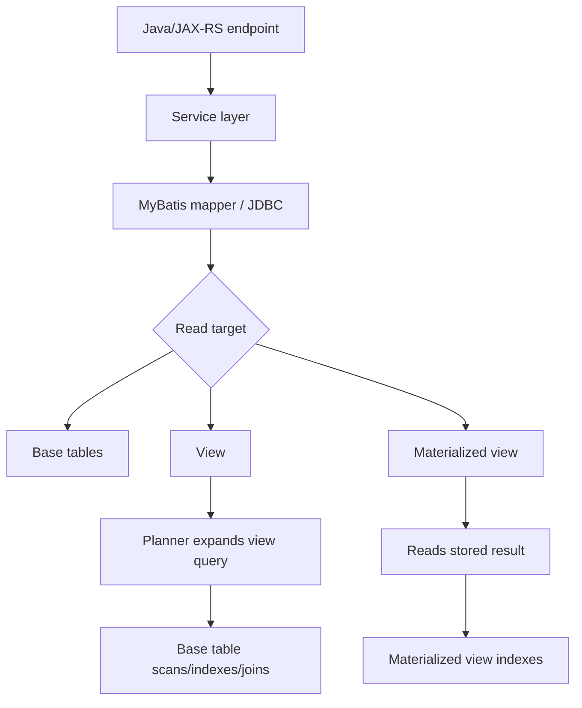
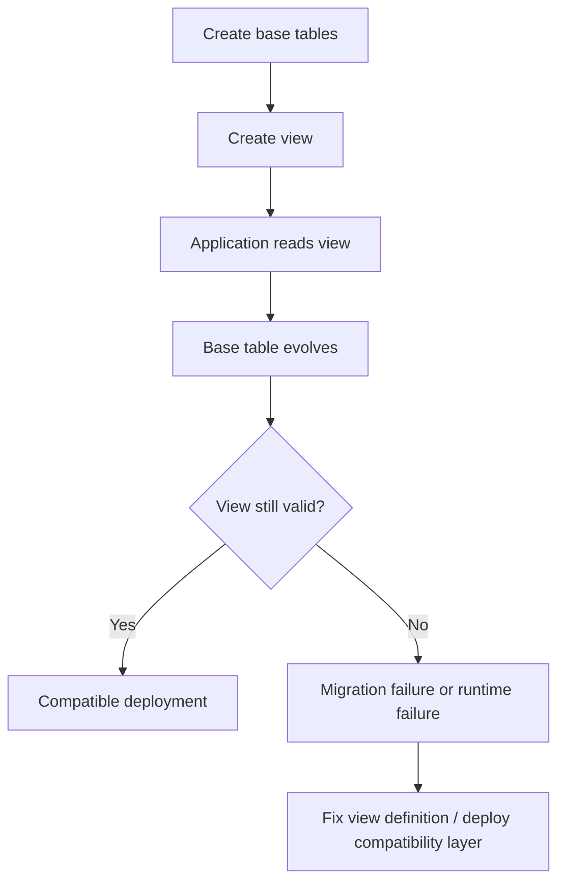
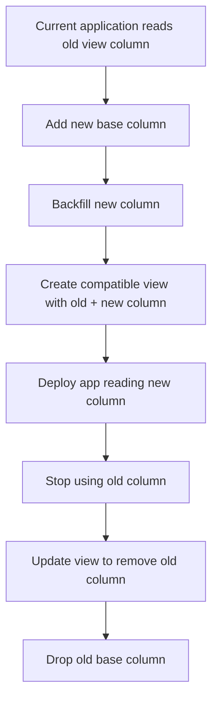
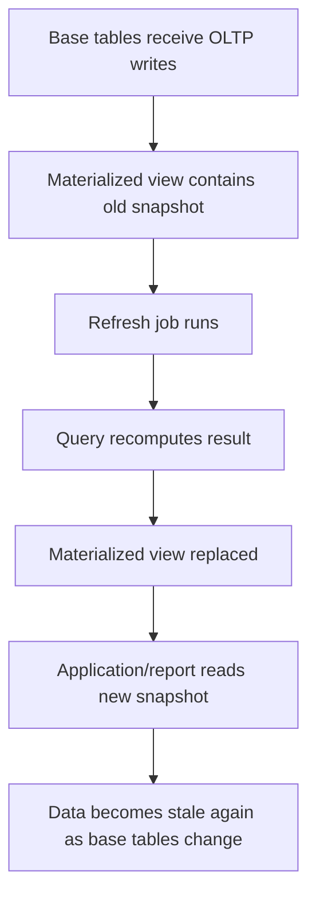

# Part 021 — Views and Materialized Views

> Goal: understand views and materialized views as **database read contracts**, not merely convenient SQL shortcuts. In enterprise Java/JAX-RS systems, they can simplify read paths, stabilize reporting contracts, and isolate query complexity, but they can also hide performance problems, migration coupling, stale data, and security issues.

This part connects PostgreSQL views/materialized views to Java/JAX-RS services, MyBatis mapper design, reporting/read-model architecture, migration discipline, and production operations.

---

## 1. Executive mental model

A PostgreSQL view is a named query.

A PostgreSQL materialized view is a named query whose result is physically stored and must be refreshed.

That single difference changes almost everything.



Mental distinction:

| Object | Stores data? | Query freshness | Main benefit | Main risk |
|---|---:|---|---|---|
| Table | Yes | Current | Source of truth | Modelling mistakes become permanent |
| View | No | Current at query time | Stable read contract / query reuse | Hidden complexity and poor plans |
| Materialized view | Yes | Stale until refresh | Fast derived read model | Refresh cost, stale data, operational coupling |

A senior engineer should ask:

> Is this object a correctness boundary, a read contract, a performance cache, a reporting model, or a convenience wrapper?

Those are different design intents.

---

## 2. Why views exist

Views exist to give a query a reusable name and expose it as a relation-like object.

They help when you need to:

- Reuse complex joins.
- Hide internal table structure from consumers.
- Present a stable read interface while base tables evolve.
- Restrict visible columns or rows.
- Centralize derived read logic.
- Support reporting queries.
- Reduce duplicated SQL in MyBatis mappers.
- Separate write schema from read schema.

Example:

```sql
CREATE VIEW quote_summary_v AS
SELECT
  q.id AS quote_id,
  q.quote_number,
  q.status,
  q.customer_id,
  c.name AS customer_name,
  q.created_at,
  q.updated_at,
  COUNT(qi.id) AS item_count,
  SUM(qi.net_amount) AS net_total
FROM quote q
JOIN customer c ON c.id = q.customer_id
LEFT JOIN quote_item qi ON qi.quote_id = q.id
GROUP BY
  q.id,
  q.quote_number,
  q.status,
  q.customer_id,
  c.name,
  q.created_at,
  q.updated_at;
```

A Java service can now read:

```sql
SELECT *
FROM quote_summary_v
WHERE quote_id = #{quoteId};
```

That looks clean, but the database still has to execute the underlying join and aggregation unless the view is materialized.

---

## 3. What a normal view is not

A normal PostgreSQL view is not automatically a cache.

It is not automatically faster than writing the query directly.

It is not automatically indexed.

It is not automatically a safe abstraction boundary.

It is not automatically stable under schema change.

A normal view is usually expanded into the outer query by the planner. That means:

```sql
SELECT *
FROM quote_summary_v
WHERE quote_id = '...';
```

is conceptually closer to:

```sql
SELECT *
FROM (
  -- view definition
) v
WHERE quote_id = '...';
```

The optimizer may push predicates into the view definition, but you must verify with `EXPLAIN`.

Production implication:

> A view can improve maintainability while doing nothing for performance. Treat it as a query contract first, not as an optimization.

---

## 4. View lifecycle

Basic lifecycle:



View lifecycle concerns:

- Base table column removal can break view definition.
- Type changes can break consumers.
- Rename operations can break dependencies.
- Permission changes can break runtime access.
- Dropping dependent objects can fail due to dependency graph.
- View changes can break MyBatis result mappings.
- A seemingly small view change can change API response shape.

Rule:

> Treat a view used by application code as a versioned contract, not an internal refactor detail.

---

## 5. View as read contract

A view is useful when the application needs a stable read shape.

For example, quote screens may need a summary projection:

```sql
CREATE VIEW api_quote_summary_v AS
SELECT
  q.id,
  q.quote_number,
  q.status,
  q.customer_id,
  c.name AS customer_name,
  q.valid_from,
  q.valid_to,
  q.total_amount,
  q.currency_code,
  q.version,
  q.updated_at
FROM quote q
JOIN customer c ON c.id = q.customer_id;
```

A MyBatis mapper can map this to a read DTO:

```xml
<select id="findQuoteSummary" resultMap="QuoteSummaryResultMap">
  SELECT
    id,
    quote_number,
    status,
    customer_id,
    customer_name,
    valid_from,
    valid_to,
    total_amount,
    currency_code,
    version,
    updated_at
  FROM api_quote_summary_v
  WHERE id = #{quoteId}
</select>
```

This avoids repeating joins across many mappers.

But it creates a contract:

- Column names matter.
- Column types matter.
- Nullability matters.
- Cardinality matters.
- Security assumptions matter.
- Performance assumptions matter.

If the view is consumed by multiple services, jobs, reports, or integration pipelines, changing it is a breaking change unless managed carefully.

---

## 6. View naming discipline

Suggested naming intent:

| Pattern | Meaning |
|---|---|
| `*_v` | Normal view |
| `*_mv` | Materialized view |
| `api_*_v` | Application/API read contract |
| `report_*_v` | Reporting/query convenience |
| `internal_*_v` | Internal database helper |
| `security_*_v` | Security-filtered view |

The exact naming convention must follow the team standard.

What matters is that the name communicates purpose.

Bad names:

```sql
CREATE VIEW quote_data AS ...;
CREATE VIEW new_quote_view AS ...;
CREATE VIEW temp_report AS ...;
```

Better names:

```sql
CREATE VIEW api_quote_summary_v AS ...;
CREATE VIEW report_monthly_order_revenue_v AS ...;
CREATE MATERIALIZED VIEW report_daily_quote_conversion_mv AS ...;
```

A view name should answer:

- Who consumes this?
- Is it API-facing or reporting-only?
- Is it fresh or potentially stale?
- Is it safe to change?

---

## 7. View dependency model

PostgreSQL tracks dependencies between views and base objects.

That is useful because it prevents accidental drops that would break dependent objects.

But it also means migrations can fail when dependency order is wrong.

Example:

```sql
ALTER TABLE quote DROP COLUMN legacy_status;
```

This can fail if a view still references `legacy_status`.

Migration-safe approach:



For production systems, do not treat view modification as harmless DDL.

View migration can break:

- MyBatis result maps.
- Report definitions.
- BI dashboards.
- Batch jobs.
- CDC consumers if views are used in export workflows.
- Permissions if a new owner or schema is introduced.

---

## 8. Updatable views

Some PostgreSQL views can be automatically updatable when they are simple enough.

Usually this means they map clearly to one base table without complex constructs such as aggregation, grouping, DISTINCT, set operations, or complex joins.

Example:

```sql
CREATE VIEW active_customer_v AS
SELECT id, name, status, updated_at
FROM customer
WHERE status = 'ACTIVE';
```

An update may be possible:

```sql
UPDATE active_customer_v
SET name = 'New Name'
WHERE id = '...';
```

But production guidance is conservative:

> Avoid writing through views from Java services unless the team has an explicit policy and tests for it.

Reasons:

- Write semantics are less obvious to application developers.
- Constraints and triggers may behave indirectly.
- MyBatis mapper intent becomes less clear.
- Debugging write paths becomes harder.
- Security rules can be misunderstood.

Prefer writing to base tables through explicit command mappers and using views for reads.

---

## 9. Security barrier views

A security barrier view is used when a view is intended to enforce row or column filtering safely.

Conceptually:

```sql
CREATE VIEW tenant_quote_v
WITH (security_barrier = true)
AS
SELECT *
FROM quote
WHERE tenant_id = current_setting('app.tenant_id')::uuid;
```

This pattern must be treated carefully.

Risks:

- Session variable misconfiguration.
- Connection pool leakage of session settings.
- Bypass through base table permissions.
- Confusion with row-level security.
- Search path or function volatility issues.
- Hard-to-test authorization behavior.

For Java/JAX-RS services, tenant/security context is usually carried through application code. If pushed into database session state, every connection checkout must initialize and clean up that state reliably.

Senior-engineer rule:

> A security view is not security unless permissions prevent bypassing the underlying table and the application reliably sets the required context.

---

## 10. Permissions on views

Views can be used to expose limited data while hiding base tables.

Example:

```sql
GRANT SELECT ON api_quote_summary_v TO quote_service_readonly;
REVOKE SELECT ON quote FROM quote_service_readonly;
```

This can help enforce read boundaries.

But verify:

- Who owns the view?
- What privileges does the owner have?
- Can the service still access base tables directly?
- Are functions used by the view safe?
- Is `search_path` controlled?
- Are default privileges configured for future views?

Security is not just the `GRANT`; it is the entire access path.

---

## 11. View performance mental model

Views can make queries look simple while hiding expensive work.

Example mapper:

```sql
SELECT *
FROM api_quote_summary_v
WHERE customer_id = #{customerId}
ORDER BY updated_at DESC
LIMIT 50;
```

The apparent query is small.

The real query may involve:

- Multiple joins.
- Aggregation.
- Sorting.
- Filtering after aggregation.
- Large base table scans.
- Temporary files.
- Work memory pressure.
- Bad cardinality estimates.

Always inspect:

```sql
EXPLAIN (ANALYZE, BUFFERS)
SELECT *
FROM api_quote_summary_v
WHERE customer_id = '...'
ORDER BY updated_at DESC
LIMIT 50;
```

Questions:

- Was the predicate pushed down?
- Did the query use indexes on base tables?
- Did it aggregate too many rows before filtering?
- Did it sort a large intermediate result?
- Are estimates close to actual rows?
- Is the view hiding a cartesian multiplication?

---

## 12. Common view anti-patterns

### 12.1 View stacking

```sql
CREATE VIEW v1 AS SELECT ...;
CREATE VIEW v2 AS SELECT ... FROM v1;
CREATE VIEW v3 AS SELECT ... FROM v2;
CREATE VIEW v4 AS SELECT ... FROM v3;
```

This creates an abstraction tower that becomes hard to debug.

Failure modes:

- Query plans become unreadable.
- Dependencies become fragile.
- Small changes propagate unpredictably.
- Developers no longer know the real base tables.

Use view stacking sparingly.

### 12.2 View as dumping ground

One giant view with every possible column for every possible consumer is usually a design smell.

Symptoms:

- Hundreds of columns.
- Many left joins.
- Conditional expressions everywhere.
- Consumers use only a small subset.
- Any change risks breaking many consumers.

Prefer smaller purpose-specific read contracts.

### 12.3 View hiding N+1 query pattern

A mapper may execute a view per parent row:

```java
for (UUID quoteId : quoteIds) {
    mapper.findQuoteSummary(quoteId);
}
```

The view may be complex, so the N+1 pattern becomes expensive quickly.

Fix with batch query:

```sql
SELECT *
FROM api_quote_summary_v
WHERE id = ANY(#{quoteIds});
```

Or use a proper batch mapper with bounded input size.

### 12.4 View without ownership

If no team owns a view, it becomes a shared artifact nobody safely changes.

Every production view should have:

- Owner team.
- Consumer list.
- Purpose.
- Migration policy.
- Performance expectations.
- Test coverage if application-critical.

---

## 13. Materialized view mental model

A materialized view stores query output physically.

```sql
CREATE MATERIALIZED VIEW report_daily_quote_conversion_mv AS
SELECT
  date_trunc('day', created_at)::date AS report_date,
  tenant_id,
  COUNT(*) FILTER (WHERE status = 'DRAFT') AS draft_count,
  COUNT(*) FILTER (WHERE status = 'APPROVED') AS approved_count,
  COUNT(*) FILTER (WHERE status = 'ORDERED') AS ordered_count
FROM quote
GROUP BY 1, 2;
```

The materialized view behaves like a table for reads:

```sql
SELECT *
FROM report_daily_quote_conversion_mv
WHERE report_date >= CURRENT_DATE - INTERVAL '30 days';
```

But it is not automatically current.

It must be refreshed:

```sql
REFRESH MATERIALIZED VIEW report_daily_quote_conversion_mv;
```

This is a cache-like read model inside PostgreSQL.

Key question:

> How stale is this allowed to be, and who owns refreshing it?

---

## 14. Materialized view lifecycle



Lifecycle decisions:

- Initial creation with data or no data.
- Index creation after materialized view creation.
- Refresh method.
- Refresh schedule.
- Refresh owner.
- Staleness SLA.
- Failure handling.
- Backfill strategy.
- Dependency migration.
- Access permissions.
- Observability.

A materialized view is operational infrastructure, not just SQL.

---

## 15. Creating materialized views safely

Basic creation:

```sql
CREATE MATERIALIZED VIEW report_order_revenue_mv AS
SELECT
  date_trunc('day', o.created_at)::date AS report_date,
  o.tenant_id,
  o.currency_code,
  SUM(o.total_amount) AS total_revenue,
  COUNT(*) AS order_count
FROM customer_order o
WHERE o.status = 'COMPLETED'
GROUP BY 1, 2, 3;
```

For large datasets, consider:

```sql
CREATE MATERIALIZED VIEW report_order_revenue_mv AS
SELECT ...
WITH NO DATA;
```

Then populate intentionally:

```sql
REFRESH MATERIALIZED VIEW report_order_revenue_mv;
```

Why this matters:

- Creating with data can run a large query during migration.
- Migration time may exceed deployment windows.
- Base table locks and resource pressure may affect production.
- Initial population may need to run as an operational job.

Production guidance:

> Avoid creating and fully populating large materialized views in the same migration unless you have measured the cost on production-like data.

---

## 16. Refresh strategies

### 16.1 Manual refresh

```sql
REFRESH MATERIALIZED VIEW report_order_revenue_mv;
```

Simple, but can block reads depending on usage.

Good for:

- Small views.
- Maintenance windows.
- One-off repair.
- Non-critical reporting.

Risk:

- Stale data if forgotten.
- Operational inconsistency.

### 16.2 Concurrent refresh

```sql
REFRESH MATERIALIZED VIEW CONCURRENTLY report_order_revenue_mv;
```

Concurrent refresh allows reads to continue while refresh runs, subject to PostgreSQL requirements.

Important production constraints:

- The materialized view must already be populated.
- It requires an appropriate unique index on the materialized view.
- It is usually slower and more resource-intensive than a non-concurrent refresh.
- Only one refresh of a materialized view can run at a time.

Example unique index:

```sql
CREATE UNIQUE INDEX report_order_revenue_mv_uq
ON report_order_revenue_mv (report_date, tenant_id, currency_code);
```

Senior-engineer question:

> What uniquely identifies one row in this materialized read model?

If you cannot answer that, the materialized view may not have a stable business grain.

### 16.3 Scheduled refresh

Refresh may be triggered by:

- Cron job.
- Kubernetes CronJob.
- Application scheduler.
- Airflow-like orchestrator.
- Database job framework if available.
- Manual runbook.

For enterprise systems, prefer refresh ownership to be explicit.

Bad:

> “It gets refreshed somewhere.”

Good:

> “This materialized view is refreshed every 15 minutes by job X. Alerts fire if refresh age exceeds 30 minutes.”

### 16.4 Event-driven refresh

Sometimes a materialized view is refreshed after specific events.

Be careful.

If every quote/order write triggers a refresh, you have turned a reporting cache into a write-path bottleneck.

Usually better:

- Batch refresh.
- Incremental table maintained by application/outbox consumer.
- Partitioned rollup table.
- External analytics pipeline.

---

## 17. Staleness as a first-class design property

Materialized views introduce stale reads.

This is not a bug if it is intentional.

Define:

| Question | Example answer |
|---|---|
| Maximum acceptable staleness | 5 minutes, 1 hour, daily close |
| Consumer expectation | Dashboard, export, API read model, internal report |
| Refresh trigger | Schedule, manual, event, pipeline |
| Failure behavior | Show stale with warning, block report, fallback query |
| Observability | last_refresh_at, job status, alert |

Add refresh metadata when needed:

```sql
CREATE TABLE materialized_view_refresh_log (
  view_name text PRIMARY KEY,
  last_started_at timestamptz,
  last_finished_at timestamptz,
  last_status text NOT NULL,
  last_error text,
  refreshed_by text
);
```

Application/API guidance:

- Do not expose materialized view data as real-time unless refresh SLA supports it.
- Include `asOf` or `lastRefreshedAt` when users may interpret data as current.
- Document stale-read semantics in API contracts.

---

## 18. Indexing materialized views

Materialized views can have indexes.

That is one of their biggest advantages.

Example:

```sql
CREATE INDEX report_order_revenue_mv_date_idx
ON report_order_revenue_mv (report_date DESC);

CREATE INDEX report_order_revenue_mv_tenant_date_idx
ON report_order_revenue_mv (tenant_id, report_date DESC);
```

Index strategy depends on read pattern:

| Query pattern | Index candidate |
|---|---|
| Filter by tenant and date range | `(tenant_id, report_date)` |
| Sort latest first | `(report_date DESC)` or composite with tenant |
| Lookup by business grain | unique index on grain columns |
| Filter by status/category | composite or partial index |

Remember:

- Indexes speed reads but slow refresh/rebuild.
- Too many indexes make refresh expensive.
- Concurrent refresh may require a unique index.
- Materialized view indexes need review like table indexes.

---

## 19. Materialized view vs denormalized table

A materialized view is not always the best read model.

| Option | Best when | Risk |
|---|---|---|
| Materialized view | Derived data can be recomputed from base tables | Expensive refresh, stale snapshot |
| Denormalized table | Incremental updates are needed | More write-path complexity |
| Outbox-fed read model | Cross-service/event-driven projection | Event ordering/replay complexity |
| External warehouse | Large analytics / heavy BI | Data latency and pipeline complexity |

Use materialized view when:

- Query result is recomputable.
- Staleness is acceptable.
- Refresh cost is bounded.
- Query is mostly read-heavy.
- Operational ownership is clear.

Avoid materialized view when:

- Near-real-time correctness is required.
- Refresh scans huge OLTP tables too frequently.
- Incremental semantics are complex.
- The data grain is unclear.
- Consumers need row-level write/update semantics.

---

## 20. Views/materialized views in CPQ and order systems

Potential legitimate uses:

### Quote summary read model

- Quote header.
- Customer/account summary.
- Total item count.
- Current approval state.
- Last modified timestamp.

Usually a normal view or application query may be enough.

### Order lifecycle reporting

- Order count by status.
- Average time in state.
- Fulfillment backlog.
- Failed fulfillment transitions.

Often materialized view or rollup table.

### Catalog effective-date projection

- Active offerings at a given time.
- Price validity window.
- Product configuration availability.

Be careful: effective-date correctness is more important than query convenience.

### Audit/reporting projections

- State transition history.
- Approval trail.
- SLA reporting.

May require materialized views, partitioning, or external analytics.

Internal warning:

> Do not assume CSG uses these exact tables or patterns. Treat them as generic CPQ/order-management examples and verify actual schema internally.

---

## 21. Java/JAX-RS impact

Views affect Java service design in several ways.

### 21.1 DTO vs entity separation

A view often maps naturally to a read DTO, not a domain entity.

Good:

```java
public record QuoteSummaryDto(
    UUID id,
    String quoteNumber,
    String status,
    UUID customerId,
    String customerName,
    BigDecimal totalAmount,
    OffsetDateTime updatedAt
) {}
```

Avoid treating a view result as a mutable aggregate if it is only a projection.

### 21.2 Command/query separation

Use base tables for command/write paths.

Use views/materialized views for read paths when appropriate.

```mermaid
graph TD
  A[POST /quotes/{id}/approve] --> B[Command service]
  B --> C[Base tables + transaction]
  D[GET /quotes/{id}/summary] --> E[Query service]
  E --> F[View / materialized view / read model]
```

This separation makes transaction, locking, and stale-read semantics clearer.

### 21.3 Error mapping

View-related failures may surface as:

- Undefined column.
- Permission denied.
- Type mismatch.
- Missing relation.
- Timeout.
- Stale materialized data.

Do not leak raw database errors to API clients.

Map them to:

- 500 for internal contract break.
- 503 if dependency temporarily unavailable.
- Domain-specific response only when the failure is expected and modelled.

---

## 22. MyBatis impact

Views can simplify mapper SQL:

```xml
<select id="searchQuoteSummaries" resultMap="QuoteSummaryResultMap">
  SELECT
    id,
    quote_number,
    customer_name,
    status,
    total_amount,
    updated_at
  FROM api_quote_summary_v
  WHERE tenant_id = #{tenantId}
  <if test="status != null">
    AND status = #{status}
  </if>
  ORDER BY updated_at DESC, id DESC
  LIMIT #{limit}
</select>
```

But mapper review must still ask:

- What is behind the view?
- Does the view preserve cardinality?
- Are filters pushed down?
- Does ordering use an index on base tables or materialized view?
- Does result mapping depend on nullable derived columns?
- Is this view stable enough to be a mapper dependency?

For materialized views:

- Map stale-read semantics explicitly.
- Consider adding `last_refreshed_at` to response metadata.
- Do not use materialized views for command validation unless staleness is acceptable.

---

## 23. Migration patterns for views

### 23.1 Replace view safely

PostgreSQL supports `CREATE OR REPLACE VIEW`, but it has limitations and can still be risky.

Safe pattern:

1. Add new base columns/tables first.
2. Create or replace view in backward-compatible shape.
3. Deploy application that can read new shape.
4. Remove old application dependency.
5. Remove old view columns later.

Example:

```sql
CREATE OR REPLACE VIEW api_quote_summary_v AS
SELECT
  q.id,
  q.quote_number,
  q.status,
  q.customer_id,
  c.name AS customer_name,
  q.total_amount,
  q.currency_code,
  q.updated_at,
  q.new_pricing_model -- added compatibly
FROM quote q
JOIN customer c ON c.id = q.customer_id;
```

Do not remove columns in the same deployment that still may run old code.

### 23.2 Versioned views

For high-risk changes:

```sql
CREATE VIEW api_quote_summary_v1 AS ...;
CREATE VIEW api_quote_summary_v2 AS ...;
```

Then migrate consumers gradually.

Cost:

- More objects.
- More maintenance.
- More documentation required.

Benefit:

- Safer rollout.
- Better compatibility.
- Easier rollback.

### 23.3 Materialized view migration

Changing materialized view definition often requires recreate/rebuild.

Typical approach:

1. Create new materialized view with new name.
2. Populate it outside critical deployment path.
3. Create indexes.
4. Validate counts/results.
5. Switch application/report to new view.
6. Drop old view later.

This avoids a long blocking migration.

---

## 24. Observability for views and materialized views

Normal views do not have separate runtime statistics in the same way tables do. You usually observe the queries that reference them.

Observe:

- `pg_stat_statements` for queries against views.
- Execution plans after view expansion.
- Base table scans and index usage.
- Temp file usage.
- Slow query logs.
- Lock waits during materialized view refresh.
- Refresh job duration/failure.
- Materialized view staleness.

Suggested refresh log query:

```sql
SELECT
  view_name,
  last_started_at,
  last_finished_at,
  last_status,
  now() - last_finished_at AS age
FROM materialized_view_refresh_log
ORDER BY last_finished_at NULLS FIRST;
```

Suggested dependency inspection:

```sql
SELECT
  dependent_ns.nspname AS dependent_schema,
  dependent_view.relname AS dependent_view,
  source_ns.nspname AS source_schema,
  source_table.relname AS source_table
FROM pg_depend d
JOIN pg_rewrite r ON r.oid = d.objid
JOIN pg_class dependent_view ON dependent_view.oid = r.ev_class
JOIN pg_namespace dependent_ns ON dependent_ns.oid = dependent_view.relnamespace
JOIN pg_class source_table ON source_table.oid = d.refobjid
JOIN pg_namespace source_ns ON source_ns.oid = source_table.relnamespace
WHERE dependent_view.relkind IN ('v', 'm')
ORDER BY dependent_schema, dependent_view;
```

Use catalog queries carefully; validate them against your PostgreSQL version.

---

## 25. Failure modes

| Failure mode | Symptom | Likely cause | Response |
|---|---|---|---|
| View breaks after migration | Runtime SQL error | Dropped/renamed column | Restore compatibility or fix view |
| Query against view is slow | API latency / timeout | Hidden join/aggregation | Run `EXPLAIN ANALYZE` on expanded query |
| Materialized view stale | Wrong report/API data | Refresh failed or delayed | Check refresh job/log/SLA |
| Concurrent refresh fails | Refresh job error | Missing unique index or unpopulated MV | Add correct index/populate first |
| Permission denied | Runtime failure | Grant missing on view/schema/function | Fix role/privilege model |
| View returns duplicate rows | API duplicates | Join cardinality bug | Fix view grain and constraints |
| Materialized view refresh overloads DB | CPU/IO spike | Full recompute too frequent | Reduce frequency, incremental model, replica |
| Rollback fails | Old app expects old view shape | Breaking view change | Use versioned/compatible view migration |

---

## 26. Debugging workflow

When a view-backed query is slow:

1. Identify the exact SQL from logs or `pg_stat_statements`.
2. Run `EXPLAIN (ANALYZE, BUFFERS)` in a safe environment.
3. Identify base tables accessed by the view.
4. Check whether predicates are pushed down.
5. Check join cardinality and row estimates.
6. Check indexes on base tables.
7. Check sorting, temp files, and aggregation cost.
8. Compare with direct query against base tables.
9. Decide whether to tune indexes, rewrite view, or materialize.

When a materialized view is stale:

1. Check last refresh timestamp.
2. Check refresh job status.
3. Check lock waits or failures.
4. Check refresh duration trend.
5. Check whether refresh reads too much data.
6. Check whether consumers know the staleness SLA.
7. Decide whether to refresh manually, degrade response, or switch source.

When a migration involving views fails:

1. Inspect dependency graph.
2. Identify old application versions still running.
3. Restore backward-compatible view definition.
4. Reorder migration if needed.
5. Avoid `CASCADE` unless blast radius is fully understood.

---

## 27. Correctness concerns

Views/materialized views can introduce correctness issues:

- Duplicate rows due to wrong join grain.
- Missing rows due to inner join where left join is required.
- Null semantics hidden by derived columns.
- Stale materialized view data used as if current.
- Effective-date logic implemented inconsistently.
- Timezone conversion hidden in view.
- Security filter bypassed through base table permission.
- View definition not aligned with domain lifecycle.

Review question:

> What is the grain of one row returned by this view?

If the grain is unclear, the view is dangerous.

Examples of grain:

- One row per quote.
- One row per quote item.
- One row per order state transition.
- One row per tenant per day per status.
- One row per product offering per effective-date window.

---

## 28. Performance concerns

Views:

- Can hide expensive joins.
- Can encourage over-fetching.
- Can obscure missing indexes.
- Can cause repeated computation.
- Can make plan analysis harder if stacked.

Materialized views:

- Improve read latency.
- Shift cost to refresh time.
- Consume storage.
- Require indexing.
- Can add operational jobs.
- Can overload primary DB during refresh.
- Can create stale-read bugs.

Performance rule:

> A materialized view does not remove cost; it moves cost from request time to refresh time.

---

## 29. Security and privacy concerns

Views are often used to hide sensitive data.

Example:

```sql
CREATE VIEW customer_public_profile_v AS
SELECT
  id,
  display_name,
  account_status
FROM customer;
```

But verify:

- Base table access is revoked.
- View does not expose PII accidentally.
- Derived fields cannot leak sensitive information.
- Functions used by the view are safe.
- Security-definer functions are audited.
- Search path is controlled.
- Logs do not expose view query parameters.

For materialized views:

- Sensitive data is duplicated physically.
- Retention/deletion policy must include the materialized copy.
- Backup/restore includes the materialized data.
- Access grants must be reviewed separately.

---

## 30. View review checklist

Use this during PR review.

### Purpose

- What problem does the view solve?
- Is it a read contract, security filter, reporting helper, or convenience wrapper?
- Who owns it?
- Who consumes it?

### Correctness

- What is the row grain?
- Can joins multiply rows?
- Are null semantics correct?
- Is effective-date/timezone logic correct?
- Are filters domain-correct?

### Performance

- Has `EXPLAIN` been checked?
- Are base table indexes sufficient?
- Are predicates pushed down?
- Is the view stacked on other views?
- Does it hide aggregation/sort over large data?

### Migration

- Is the change backward-compatible?
- Are old app versions still running?
- Are dependent reports/jobs known?
- Is a versioned view needed?
- Is rollback safe?

### Security/privacy

- Does it expose PII?
- Are grants correct?
- Can consumers bypass via base tables?
- Are functions/search path safe?

---

## 31. Materialized view review checklist

### Design

- What is the materialized view grain?
- Why is a materialized view better than a normal view, table, or external read model?
- What is the maximum acceptable staleness?
- Who owns refresh?

### Refresh

- Is refresh manual, scheduled, or event-driven?
- Is concurrent refresh needed?
- Is the required unique index present?
- How long does refresh take on production-like data?
- What happens if refresh fails?

### Performance

- What base tables are scanned?
- Can refresh overload the primary?
- Are indexes on the materialized view justified?
- Is storage growth acceptable?

### Operations

- Is last refresh observable?
- Are alerts configured?
- Is there a manual refresh runbook?
- Is refresh safe during deployments?

### Correctness

- Are consumers aware of stale reads?
- Is `asOf` metadata needed?
- Does refresh preserve tenant/security constraints?
- Does deletion/privacy policy include materialized data?

---

## 32. Internal verification checklist

Verify in the actual CSG/team environment:

- Which PostgreSQL views exist.
- Which materialized views exist.
- Which services/jobs/reports consume each view.
- Whether any MyBatis mapper depends on views.
- Whether views are treated as API/database contracts.
- Naming convention for views/materialized views.
- Ownership of each view.
- Grants and privileges on views.
- Whether base tables are directly accessible to service roles.
- Whether security barrier views or RLS are used.
- View dependency graph.
- Migration ordering for view changes.
- Whether `CREATE OR REPLACE VIEW` is used safely.
- Whether versioned views exist.
- Materialized view refresh schedule.
- Refresh job owner and runtime.
- Refresh failure alerting.
- Last refresh metadata.
- Unique indexes required for concurrent refresh.
- Materialized view storage size.
- Slow queries involving views.
- Incident history involving stale reports or broken views.

---

## 33. Practical exercises

### Exercise 1 — Find view consumers

Pick one view in the repository.

Find:

- Migration that creates it.
- MyBatis mapper that reads it.
- Tests that depend on it.
- Dashboards/reports that use it.
- Owner team.

Document whether it is a contract or convenience wrapper.

### Exercise 2 — Explain a view-backed query

Run:

```sql
EXPLAIN (ANALYZE, BUFFERS)
SELECT ...
FROM some_view
WHERE ...;
```

Answer:

- What base tables are accessed?
- Which indexes are used?
- Are estimates accurate?
- Is there a hidden sort/aggregate?
- Would a direct query be clearer?

### Exercise 3 — Materialized view staleness review

For one materialized view, identify:

- Refresh frequency.
- Last refresh timestamp.
- Refresh duration.
- Staleness SLA.
- Consumer expectations.
- Failure behavior.

If no materialized view exists, design what you would require before approving one.

---

## 34. Senior-engineer heuristics

- A view is a query contract, not a magic performance feature.
- A materialized view is a physical read model with operational lifecycle.
- Every view needs a grain.
- Every materialized view needs a staleness SLA.
- Avoid view stacks unless the dependency graph is intentionally managed.
- Do not write through views unless explicitly governed.
- Do not use stale materialized view data for command validation unless correctness allows it.
- Materialized view refresh must be observable.
- Treat view changes like API changes when application code depends on them.
- Always run `EXPLAIN` on the consuming query, not just the view definition.

---

## 35. Key takeaways

Views and materialized views are powerful because they let PostgreSQL expose derived relational shapes.

But they are different tools:

- A normal view improves query reuse and contract stability.
- A materialized view improves read performance by storing derived results.
- A view can hide complexity.
- A materialized view can hide staleness.
- Both can create migration coupling.
- Both require ownership, observability, and review discipline.

For senior Java/JAX-RS engineers, the important skill is not merely knowing `CREATE VIEW` syntax. It is knowing when a view should become a contract, when a materialized view should become an operational read model, and when both should be rejected in favor of clearer application queries, denormalized tables, or external analytics pipelines.
