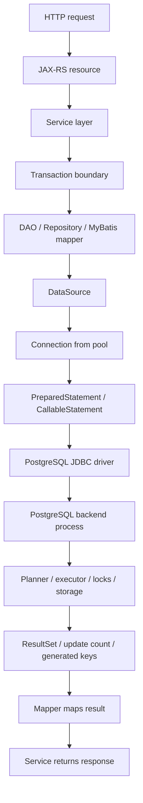
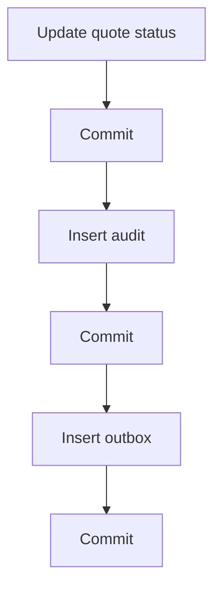
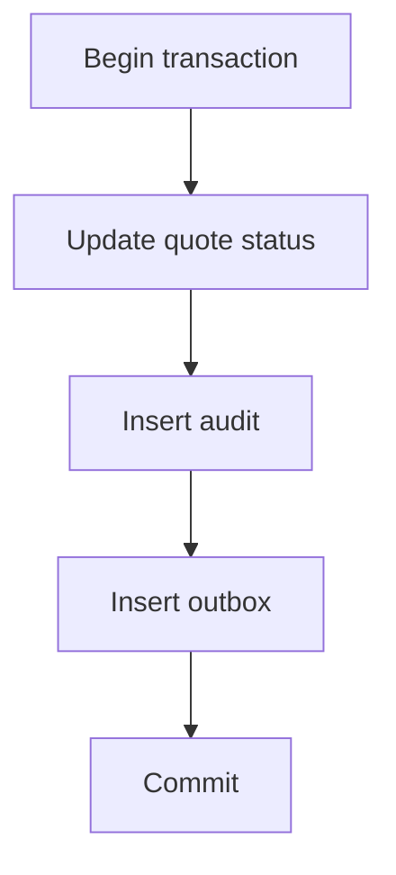
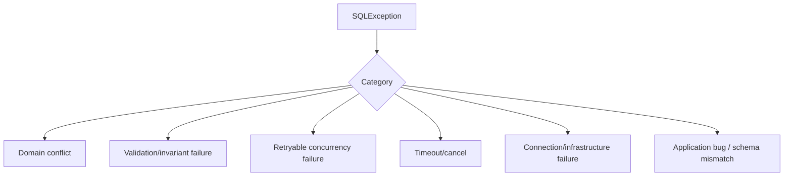
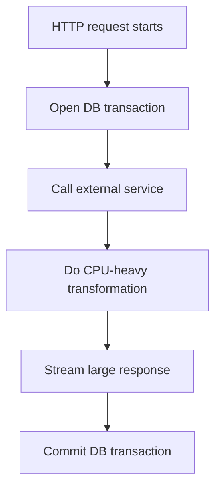
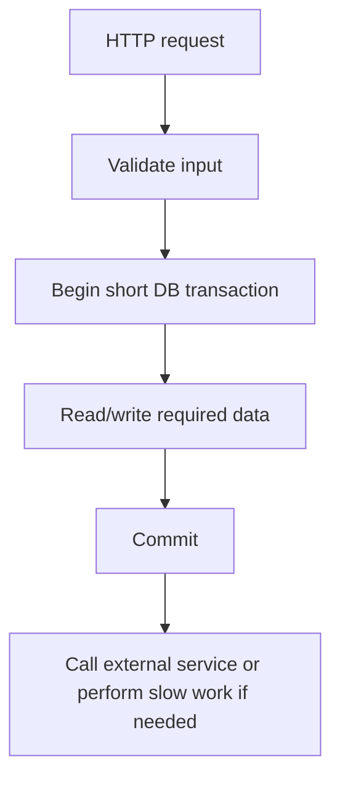
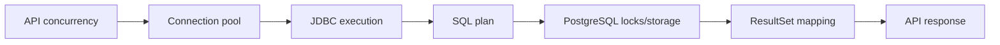

# Part 022 — JDBC Lifecycle

> Goal: understand JDBC as the **runtime bridge** between Java/JAX-RS services and PostgreSQL. Every SQL query, MyBatis mapper, transaction, lock, timeout, streaming result, generated key, and SQL exception eventually flows through JDBC-level behavior.

This part is not a generic Java tutorial. It focuses on the parts of JDBC that matter for PostgreSQL correctness, performance, failure handling, and production debugging.

---

## 1. Executive mental model

A typical Java/JAX-RS request that reads or writes PostgreSQL follows this path:



JDBC is not just plumbing. It controls:

- Connection acquisition.
- Autocommit behavior.
- Transaction boundaries.
- Prepared statement execution.
- Parameter binding.
- Batch execution.
- Generated keys.
- ResultSet streaming.
- Timeout behavior.
- SQL exception shape.
- Type mapping.
- Resource cleanup.

Senior-engineer framing:

> When a PostgreSQL issue appears in Java, the failure may be in SQL, transaction design, connection pool configuration, driver behavior, mapper mapping, or resource lifecycle. JDBC is where those layers meet.

---

## 2. JDBC object lifecycle

Core JDBC objects:

| Object | Role | Production concern |
|---|---|---|
| `Driver` | Implements database protocol support | Version compatibility, security fixes |
| `DataSource` | Provides connections, usually backed by pool | Pool config, credentials, timeouts |
| `Connection` | Session with PostgreSQL backend | Transaction state, session settings, leaks |
| `PreparedStatement` | Parameterized SQL execution | Binding, plan behavior, timeout |
| `CallableStatement` | Function/procedure call support | IN/OUT params, transaction semantics |
| `ResultSet` | Cursor-like result reader | Memory, streaming, resource closing |
| `SQLException` | Database/driver error | SQLState mapping, retry classification |

Basic lifecycle:

```java
try (Connection connection = dataSource.getConnection();
     PreparedStatement statement = connection.prepareStatement(
         "SELECT id, quote_number FROM quote WHERE id = ?")) {

    statement.setObject(1, quoteId);

    try (ResultSet rs = statement.executeQuery()) {
        if (rs.next()) {
            UUID id = rs.getObject("id", UUID.class);
            String quoteNumber = rs.getString("quote_number");
        }
    }
}
```

In framework code, you may not write this directly because MyBatis or transaction managers abstract it.

But the lifecycle still exists.

---

## 3. Driver

The PostgreSQL JDBC driver, commonly pgJDBC, implements communication between Java and PostgreSQL.

The driver affects:

- Protocol behavior.
- Type mapping.
- Prepared statement handling.
- ResultSet fetching.
- SSL/TLS configuration.
- Authentication support.
- Error and SQLState representation.
- Batch behavior.
- Performance characteristics.

Internal verification:

- Which pgJDBC version is used?
- Is it pinned in dependency management?
- Are there known issues for that version?
- Does the driver version support the PostgreSQL server version?
- Are SSL/authentication features configured intentionally?

Do not treat the driver as invisible. Driver upgrades can change behavior around prepared statements, timestamps, batching, SSL, or edge-case protocol handling.

---

## 4. DataSource

`DataSource` is the application entry point for acquiring connections.

In production, `DataSource` is almost always backed by a connection pool such as HikariCP or an application-server pool.

```java
Connection connection = dataSource.getConnection();
```

This does not necessarily create a new physical database connection. It usually checks out an existing pooled connection.

Important implications:

- Session state may persist across checkouts if not reset.
- Connection acquisition can block if pool is exhausted.
- Connection close usually returns to pool, not closes socket.
- Pool-level timeout may fail before PostgreSQL sees any query.
- Database max connection is shared across all service replicas.

This is why connection pooling deserves its own part later. Here, focus on the JDBC lifecycle.

---

## 5. Connection as PostgreSQL session

A JDBC `Connection` maps to a PostgreSQL session, typically served by one backend process.

Session state can include:

- Current transaction state.
- Autocommit setting.
- Isolation level.
- Read-only flag.
- Search path.
- Time zone.
- Prepared statements.
- Temporary tables.
- Advisory locks.
- Session variables.
- Role settings.
- Statement timeout if set at session level.

This matters with connection pooling.

Bad pattern:

```sql
SET app.tenant_id = 'tenant-a';
```

Then connection is returned to pool without reset.

Next request might accidentally inherit tenant context.

Safer pattern:

- Use transaction-local settings when possible.
- Ensure pool/framework resets session state.
- Avoid session state for security unless rigorously controlled.

Example transaction-local setting:

```sql
SET LOCAL app.tenant_id = '...';
```

`SET LOCAL` lasts for the current transaction.

---

## 6. Autocommit

JDBC connections default to autocommit true unless configured otherwise.

With autocommit true:

```java
connection.setAutoCommit(true);
```

Each statement is its own transaction.

```sql
UPDATE quote SET status = 'APPROVED' WHERE id = ?;
-- committed automatically if successful
```

With autocommit false:

```java
connection.setAutoCommit(false);
try {
    // multiple statements
    connection.commit();
} catch (SQLException e) {
    connection.rollback();
    throw e;
}
```

Production implications:

- Multi-statement business operations require explicit transaction boundary.
- Leaving a transaction open can hold locks and snapshots.
- Forgetting rollback can poison pooled connection state.
- Framework-managed transactions must be clearly understood.

In Java/JAX-RS services, transaction boundaries should usually live at the service/use-case layer, not inside each low-level mapper method.

---

## 7. Transaction boundary in JDBC

Manual JDBC transaction:

```java
Connection connection = dataSource.getConnection();
try {
    connection.setAutoCommit(false);

    updateQuote(connection, quoteId);
    insertAuditEvent(connection, quoteId);
    insertOutboxEvent(connection, quoteId);

    connection.commit();
} catch (SQLException e) {
    connection.rollback();
    throw e;
} finally {
    connection.close();
}
```

Transaction boundary should match business invariant.

Example invariant:

> If quote status changes, audit trail and outbox event must be committed atomically.

That means these writes belong in one database transaction.

Bad split:



Failure between commits creates inconsistent state.

Good boundary:



---

## 8. Isolation level

JDBC can set transaction isolation:

```java
connection.setTransactionIsolation(Connection.TRANSACTION_READ_COMMITTED);
```

Common levels mapped conceptually:

| JDBC isolation | PostgreSQL behavior |
|---|---|
| `READ_COMMITTED` | Default; each statement sees a fresh committed snapshot |
| `REPEATABLE_READ` | Transaction-level snapshot; stronger consistency |
| `SERIALIZABLE` | Serializable isolation with possible serialization failures |

Do not set isolation casually.

Higher isolation can improve correctness for some invariants, but may increase retries or contention.

If using framework-managed transactions, isolation may be configured outside direct JDBC code.

Internal verification:

- What is the default isolation level?
- Do any services override it?
- Are serialization failures retried?
- Are isolation assumptions documented in code or ADRs?

---

## 9. PreparedStatement

`PreparedStatement` is the normal way to execute parameterized SQL.

```java
PreparedStatement ps = connection.prepareStatement(
    "SELECT id, status FROM quote WHERE id = ?"
);
ps.setObject(1, quoteId);
```

Benefits:

- Safe parameter binding.
- Avoids SQL injection for values.
- Lets driver/server handle parameters separately from SQL text.
- Supports batching.
- Supports generated keys.

Important distinction:

Safe:

```sql
WHERE status = ?
```

Unsafe if user-controlled:

```java
"ORDER BY " + request.getSortColumn()
```

Prepared statements bind values, not SQL identifiers or SQL keywords.

Dynamic ORDER BY must use allowlisted columns:

```java
String orderBy = switch (request.sort()) {
    case UPDATED_AT -> "updated_at";
    case QUOTE_NUMBER -> "quote_number";
};
```

---

## 10. Parameter binding and type correctness

Parameter binding affects correctness and planner behavior.

Examples:

```java
ps.setObject(1, quoteId);                // UUID
ps.setString(2, status);                 // text/varchar
ps.setBigDecimal(3, totalAmount);        // numeric
ps.setObject(4, offsetDateTime);         // timestamptz mapping depends on driver/type
```

Be careful with:

- UUID as string vs UUID type.
- Timestamp/timezone mapping.
- Numeric precision.
- JSONB mapping.
- PostgreSQL enum mapping.
- Arrays.
- Null values without explicit type.

Null binding can be ambiguous:

```java
ps.setNull(1, Types.VARCHAR);
```

or with specific object type depending on framework.

In MyBatis, TypeHandlers often hide these details. That is convenient, but review TypeHandlers for correctness.

---

## 11. ResultSet

`ResultSet` reads query results.

```java
try (ResultSet rs = ps.executeQuery()) {
    while (rs.next()) {
        UUID id = rs.getObject("id", UUID.class);
        String status = rs.getString("status");
    }
}
```

Production concerns:

- Large ResultSet can consume memory.
- Fetch size affects streaming/cursor behavior.
- Column name/type mismatch can fail at runtime.
- Null handling must be explicit for primitives.
- ResultSet must be closed.
- Connection must not be returned to pool before processing completes.

Bad:

```java
List<Row> rows = mapper.findAllRows(); // millions of rows loaded into memory
```

Better:

- Use pagination.
- Use keyset pagination.
- Use streaming carefully.
- Use server-side cursor/fetch size where appropriate.
- Export through controlled batch job, not request thread.

---

## 12. Fetch size and streaming results

By default, many JDBC operations may fetch/cache all result rows client-side.

For large result sets, this can cause:

- High heap usage.
- Long GC pauses.
- Request timeout.
- Connection held too long.
- Transaction held too long.
- PostgreSQL snapshot retained too long.

With pgJDBC, cursor-based fetching requires appropriate fetch size and transaction settings.

Conceptual pattern:

```java
connection.setAutoCommit(false);

try (PreparedStatement ps = connection.prepareStatement(
        "SELECT id, payload FROM large_export WHERE tenant_id = ?")) {
    ps.setObject(1, tenantId);
    ps.setFetchSize(500);

    try (ResultSet rs = ps.executeQuery()) {
        while (rs.next()) {
            // stream/process row
        }
    }

    connection.commit();
}
```

Trade-off:

- Lower memory usage.
- But transaction stays open while streaming.
- Long streaming can hold snapshots and affect vacuum.
- If HTTP client disconnects, cleanup must be reliable.

Senior guidance:

> Streaming large database results through an HTTP request is an operational design decision, not merely a JDBC setting.

Prefer asynchronous export jobs for very large exports.

---

## 13. Statement timeout and query timeout

There are multiple timeout layers:

| Timeout | Layer | Meaning |
|---|---|---|
| Connection acquisition timeout | Pool | Time waiting for a connection |
| Query timeout | JDBC/statement | Driver attempts to cancel long query |
| `statement_timeout` | PostgreSQL | Server cancels long-running statement |
| Transaction timeout | Framework/app | Transaction exceeds allowed duration |
| HTTP timeout | API gateway/client | Request timed out |

Example JDBC query timeout:

```java
ps.setQueryTimeout(10); // seconds
```

Example PostgreSQL setting:

```sql
SET LOCAL statement_timeout = '10s';
```

Production guidance:

- Prefer server-side `statement_timeout` for reliable database cancellation.
- Use transaction-local settings to avoid leaking to pooled connections.
- Align HTTP timeout, transaction timeout, and DB timeout.
- Do not let database queries continue long after client request is gone.

---

## 14. Generated keys

For inserts using identity/sequence-generated keys:

```java
PreparedStatement ps = connection.prepareStatement(
    "INSERT INTO quote (quote_number, status) VALUES (?, ?)",
    Statement.RETURN_GENERATED_KEYS
);
```

Then:

```java
try (ResultSet keys = ps.getGeneratedKeys()) {
    if (keys.next()) {
        long id = keys.getLong(1);
    }
}
```

In PostgreSQL, `RETURNING` is often clearer:

```sql
INSERT INTO quote (quote_number, status)
VALUES (?, ?)
RETURNING id;
```

Advantages of `RETURNING`:

- Explicit returned columns.
- Works for UUID/default/generated columns.
- Can return multiple fields.
- Maps naturally in MyBatis.

Example MyBatis:

```xml
<select id="insertQuote" resultType="java.util.UUID">
  INSERT INTO quote (quote_number, status)
  VALUES (#{quoteNumber}, #{status})
  RETURNING id
</select>
```

Internal rule should be consistent: generated keys via JDBC API or explicit `RETURNING`.

---

## 15. Batch execution

JDBC supports batching multiple statements.

```java
try (PreparedStatement ps = connection.prepareStatement(
    "INSERT INTO quote_item (quote_id, product_id, quantity) VALUES (?, ?, ?)")) {

    for (QuoteItem item : items) {
        ps.setObject(1, item.quoteId());
        ps.setObject(2, item.productId());
        ps.setInt(3, item.quantity());
        ps.addBatch();
    }

    int[] counts = ps.executeBatch();
}
```

Batching reduces roundtrips.

But it introduces failure questions:

- What happens if row 357 fails?
- Is the whole batch inside one transaction?
- Are partial successes possible?
- Are unique violations mapped clearly?
- Is retry safe?
- Is batch size bounded?

Production guidance:

- Use bounded batch sizes.
- Wrap related batch in explicit transaction.
- Make batch idempotent when retrying.
- Log enough context to repair failures.
- Avoid enormous batches that generate long locks/WAL spikes.

---

## 16. CallableStatement

`CallableStatement` is used for stored procedures/functions through JDBC.

Example conceptual pattern:

```java
try (CallableStatement cs = connection.prepareCall("{ call recalculate_quote(?) }")) {
    cs.setObject(1, quoteId);
    cs.execute();
}
```

For PostgreSQL, many teams prefer ordinary SQL calls through `PreparedStatement`:

```sql
SELECT recalculate_quote(?);
```

or:

```sql
CALL recalculate_quote(?);
```

Review concerns:

- Who owns the database-side logic?
- Does it control transactions internally?
- How are errors mapped?
- How is it tested?
- How is it versioned in migrations?
- Does it hide business workflow from Java service code?

Callable usage should be intentional, not accidental.

---

## 17. SQLState and SQLException

PostgreSQL errors surface through `SQLException` with SQLState codes.

Examples of important categories:

| Situation | Example SQLState class/code | Handling idea |
|---|---|---|
| Unique violation | `23505` | Map to conflict/domain duplicate |
| Foreign key violation | `23503` | Map to invalid reference or internal data issue |
| Check violation | `23514` | Map to validation/domain invariant |
| Not null violation | `23502` | Usually application bug or bad input mapping |
| Serialization failure | `40001` | Retry if operation is idempotent/safe |
| Deadlock detected | `40P01` | Retry carefully and investigate lock ordering |
| Query canceled | `57014` | Timeout/cancel; map to timeout/dependency failure |
| Connection failure | class `08` | Infrastructure/dependency issue |

Example:

```java
catch (SQLException e) {
    String sqlState = e.getSQLState();
    if ("23505".equals(sqlState)) {
        throw new DuplicateQuoteNumberException(e);
    }
    throw e;
}
```

Do not parse localized error messages as primary logic. Use SQLState and constraint names where possible.

Better domain mapping includes constraint name when available through PostgreSQL-specific exception details, if your framework exposes it.

---

## 18. Error classification

A useful classification:



Examples:

| Category | Example | API response idea |
|---|---|---|
| Domain conflict | duplicate quote number | `409 Conflict` |
| Validation/invariant | invalid FK from request | `400` or domain-specific error |
| Retryable concurrency | serialization failure | retry internally; if exhausted, `409`/`503` depending semantics |
| Timeout | statement timeout | `503` or internal timeout response |
| Infrastructure | DB unavailable | `503` |
| Application bug | column missing | `500` and alert |

Mapping must follow product/API standards.

Internal verification:

- Is SQLState mapped centrally?
- Are constraint names used to produce domain errors?
- Are retryable errors retried safely?
- Are raw SQL messages hidden from clients?

---

## 19. Type mapping

Common PostgreSQL-to-Java mapping concerns:

| PostgreSQL type | Java type candidate | Concern |
|---|---|---|
| `uuid` | `UUID` | Avoid treating as string everywhere |
| `text`/`varchar` | `String` | Length constraints may be domain-level |
| `numeric` | `BigDecimal` | Precision/scale correctness |
| `integer`/`bigint` | `Integer`/`Long` | Overflow and null handling |
| `boolean` | `Boolean` | Primitive `boolean` hides null issue |
| `date` | `LocalDate` | No time zone |
| `timestamp` | `LocalDateTime` | No time zone; dangerous for global systems |
| `timestamptz` | `OffsetDateTime`/`Instant` | Normalize policy required |
| `jsonb` | `String`, `PGobject`, DTO via TypeHandler | Serialization/schema governance |
| `text[]`/arrays | Java array/List via TypeHandler | Driver/framework mapping details |
| enum type | Java enum/String/TypeHandler | Compatibility during enum evolution |

Timestamp policy is especially important.

For enterprise systems, prefer an explicit UTC/timezone policy and test it.

---

## 20. JSONB mapping

PostgreSQL JSONB can be mapped several ways:

### String mapping

```java
String payloadJson = rs.getString("payload");
```

Simple, but pushes parsing/validation elsewhere.

### PGobject mapping

```java
PGobject jsonObject = new PGobject();
jsonObject.setType("jsonb");
jsonObject.setValue(jsonString);
ps.setObject(1, jsonObject);
```

More PostgreSQL-specific.

### MyBatis TypeHandler

A custom TypeHandler can map JSONB to a Java DTO.

Review TypeHandler for:

- Serialization library.
- Unknown field handling.
- Backward compatibility.
- Null handling.
- Error handling.
- Performance.
- Logging redaction for sensitive JSON.

JSONB mapping is not just a technical conversion. It is part of schema governance.

---

## 21. Array mapping

PostgreSQL arrays can be useful but should be used carefully.

Example JDBC array:

```java
Array sqlArray = connection.createArrayOf("uuid", quoteIds.toArray());
ps.setArray(1, sqlArray);
```

SQL:

```sql
SELECT *
FROM quote
WHERE id = ANY(?);
```

Concerns:

- Very large arrays can create planning/performance issues.
- MyBatis handling may need TypeHandler.
- Empty arrays must be handled explicitly.
- Arrays should not replace proper relational modelling for core entities.

For large input sets, consider temporary table, staging table, or chunked queries.

---

## 22. Large objects and binary data

PostgreSQL supports binary data via `bytea` and large object APIs.

For enterprise backend services, storing large files directly in PostgreSQL is a design decision.

Common alternatives:

- Store metadata in PostgreSQL.
- Store binary object in object storage.
- Reference object key/checksum/version in database.

Pattern:

```sql
CREATE TABLE document_metadata (
  id uuid PRIMARY KEY,
  tenant_id uuid NOT NULL,
  object_key text NOT NULL,
  checksum text NOT NULL,
  content_type text NOT NULL,
  size_bytes bigint NOT NULL,
  created_at timestamptz NOT NULL DEFAULT now()
);
```

JDBC concern:

- Avoid loading huge blobs into heap unintentionally.
- Stream carefully.
- Coordinate DB transaction with object storage write semantics.

---

## 23. Resource closing

Resource leaks create production incidents.

Always close:

- ResultSet.
- Statement.
- Connection.

Use try-with-resources:

```java
try (Connection c = dataSource.getConnection();
     PreparedStatement ps = c.prepareStatement(SQL);
     ResultSet rs = ps.executeQuery()) {
    while (rs.next()) {
        // map row
    }
}
```

In pooled environments:

- Closing a connection returns it to the pool.
- Not closing it leaks a pool slot.
- A leaked transaction may hold locks.
- A leaked ResultSet may hold server resources.

Symptoms:

- Pool exhaustion.
- Rising active connections.
- Requests waiting for connection.
- Idle in transaction sessions.
- Lock waits.

---

## 24. Connection state cleanup

When returning a connection to the pool, state must be clean.

Dangerous leftover state:

- Open transaction.
- Changed autocommit.
- Changed isolation level.
- Changed read-only flag.
- Changed search path.
- Session variables.
- Temporary tables.
- Advisory locks.
- Prepared statements if incompatible with pooling mode.

Most mature pools reset common state, but do not assume every application-level setting is reset.

Internal verification:

- Does the pool reset autocommit/isolation/read-only?
- Are session variables used?
- Are `SET LOCAL` and transaction boundaries enforced?
- Are advisory locks released?
- Are connection customizers safe?

---

## 25. Prepared statement server behavior

Prepared statements exist at multiple levels:

- Java `PreparedStatement` object.
- Driver-side statement caching.
- PostgreSQL server-side prepared statement.
- Planner generic/custom plan behavior.

This can affect performance.

Potential issues:

- A query performs well with literal values but poorly as prepared statement.
- Generic plan is bad for skewed parameter distributions.
- PgBouncer transaction pooling may interact poorly with server-side prepared statements unless configured correctly.
- Prepared statement cache consumes client/server memory.

Debugging question:

> Is this slow query using a plan optimized for actual parameter values, or a generic plan that ignores selectivity skew?

Do not overfit too early, but be aware when diagnosing plan regressions.

---

## 26. JDBC and MyBatis

MyBatis sits on top of JDBC.

Mapper XML:

```xml
<select id="findById" resultMap="QuoteResultMap">
  SELECT id, quote_number, status, updated_at
  FROM quote
  WHERE id = #{id}
</select>
```

At runtime, MyBatis roughly does:

1. Acquire session/connection.
2. Prepare statement.
3. Bind parameters.
4. Execute query/update.
5. Iterate ResultSet.
6. Map rows into Java objects.
7. Close resources according to session/transaction lifecycle.

That means MyBatis issues are often JDBC issues with a mapper abstraction layer.

Review mapper for:

- Parameter binding safety.
- ResultMap correctness.
- TypeHandler correctness.
- Transaction integration.
- Fetch size for large reads.
- Batch executor behavior.
- Exception translation.

---

## 27. JDBC in JAX-RS request lifecycle

A risky pattern:



Problems:

- Transaction held while waiting on external service.
- Row locks may be held too long.
- MVCC snapshot held too long.
- Connection pool slot held too long.
- HTTP timeout may leave DB work running.

Better pattern:



For command operations, place only the atomic database invariant inside the transaction.

---

## 28. Observability

Observe JDBC/database interaction at multiple layers:

### Application metrics

- Connection acquisition latency.
- Active/idle pool connections.
- Query latency by mapper/operation.
- Transaction duration.
- Error count by SQLState.
- Timeout count.
- Batch size and duration.

### PostgreSQL metrics

- `pg_stat_activity`.
- `pg_stat_statements`.
- Lock waits.
- Wait events.
- Idle in transaction.
- Long-running query.
- Connection count.
- Statement timeout/cancel events.

### Logs

- Slow query logs.
- Application query identifiers.
- Correlation/request IDs.
- SQLState and constraint names.
- Redacted parameters.

Avoid logging sensitive SQL parameters.

A useful practice is to tag mapper operations in application logs:

```text
operation=QuoteMapper.findById sqlState=23505 durationMs=42 requestId=...
```

---

## 29. Failure modes

| Failure mode | Symptom | Likely cause | Response |
|---|---|---|---|
| Connection leak | Pool exhausted | Connection not closed / transaction stuck | Enable leak detection, inspect active stack traces |
| Idle in transaction | Vacuum blocked, locks retained | Transaction opened but not closed | Find session, fix transaction lifecycle |
| OutOfMemory during query | JVM heap spike | Huge ResultSet loaded | Pagination/streaming/export job |
| SQL injection | Data exposure/modification | Unsafe dynamic SQL | Use binding and allowlists |
| Wrong timestamp | Timezone bug | Bad type mapping/policy | Standardize timestamptz/UTC handling |
| Duplicate conflict not mapped | 500 error | SQLState not translated | Map constraint violation to domain error |
| Retry causes duplicate side effect | Duplicate event/write | Non-idempotent retry | Add idempotency key/outbox discipline |
| Query continues after HTTP timeout | DB load spike | Timeout mismatch/cancel not configured | Align HTTP/app/DB timeouts |
| Batch partial failure confusion | Unknown committed rows | Autocommit/transaction unclear | Explicit transaction and reconciliation |
| Session state leak | Cross-tenant/security bug | Pooled connection reused with state | Use `SET LOCAL`, reset state, test |

---

## 30. Debugging workflow

### 30.1 Request is slow

1. Identify endpoint and request ID.
2. Identify service method and mapper.
3. Check connection acquisition latency.
4. Check query execution time.
5. Check transaction duration.
6. Check PostgreSQL `pg_stat_activity` wait event.
7. Check `pg_stat_statements` for matching SQL.
8. Run `EXPLAIN` for the query shape.
9. Check ResultSet size and mapping cost.
10. Check whether external calls are inside transaction.

### 30.2 Pool exhausted

1. Check active vs idle connections.
2. Check request concurrency.
3. Check long-running transactions.
4. Check leaked connections.
5. Check streaming/export endpoints.
6. Check database max connections.
7. Check number of Kubernetes replicas.
8. Reduce leak/long transaction before increasing pool size.

### 30.3 SQL exception spike

1. Group by SQLState.
2. Group by mapper/operation.
3. Identify constraint names.
4. Separate domain conflicts from infrastructure failures.
5. Check recent deployments/migrations.
6. Check whether retries increased load.
7. Add targeted tests for mapped errors.

---

## 31. Correctness concerns

JDBC-level correctness issues often appear subtle:

- Autocommit commits partial business operation.
- Transaction rollback missing after error.
- Retry repeats non-idempotent insert/event.
- Timestamp mapping shifts time.
- Null primitive mapping hides missing data.
- Dynamic SQL bypasses validation.
- JSONB TypeHandler accepts incompatible schema.
- Batch failure leaves unknown state.
- Session state leaks across tenants.
- Generated key retrieval assumes wrong column.

Correctness rule:

> Treat JDBC code as part of the transaction and data-contract layer, not as low-level boilerplate.

---

## 32. Performance concerns

Common JDBC performance problems:

- Too many roundtrips.
- N+1 mapper calls.
- Large ResultSet loaded into heap.
- Missing fetch size for export-like reads.
- Overly large batch size.
- Prepared statement/generic plan issue.
- Connection pool too small or too large.
- Long transaction holding connection.
- Slow row mapping due to reflection or nested mapping.
- JSON serialization/deserialization overhead.

Do not tune JDBC in isolation.

The full chain is:



---

## 33. Security and privacy concerns

JDBC security concerns:

- SQL injection through unsafe dynamic SQL.
- Credentials in config/logs.
- TLS disabled or misconfigured.
- Overprivileged service account.
- Raw SQL errors exposed to API client.
- Sensitive parameters logged.
- Session state leak across requests.
- Search path manipulation.
- SECURITY DEFINER function call exposure.

Rules:

- Bind values.
- Allowlist identifiers.
- Redact logs.
- Use least-privilege service roles.
- Keep secrets in approved secret manager.
- Use TLS where required by environment.
- Centralize exception mapping.

---

## 34. JDBC PR review checklist

### Connection lifecycle

- Are connections always closed or framework-managed?
- Can a transaction remain open after exception?
- Are session settings reset or transaction-local?
- Is connection acquisition inside a tight loop?

### Transaction

- Is autocommit behavior known?
- Does transaction boundary match business invariant?
- Are external calls inside transaction?
- Is rollback guaranteed on failure?
- Are retryable errors handled safely?

### SQL execution

- Are values parameter-bound?
- Is dynamic SQL allowlisted?
- Are timeouts configured?
- Is fetch size needed?
- Is batch size bounded?

### Result mapping

- Are nulls handled correctly?
- Are timestamps mapped according to policy?
- Are JSONB/array/enum TypeHandlers tested?
- Are generated keys retrieved reliably?

### Error handling

- Is SQLState mapped?
- Are constraint names used where useful?
- Are raw errors hidden from clients?
- Are retries idempotent?

### Observability

- Is mapper/query latency measured?
- Are SQLState and operation names logged?
- Are sensitive parameters redacted?
- Can this query be found in `pg_stat_statements`?

---

## 35. Internal verification checklist

Verify in the actual CSG/team environment:

- PostgreSQL JDBC driver version.
- JDBC URL and driver properties.
- DataSource implementation.
- Connection pool provider.
- Default autocommit behavior.
- Framework-managed transaction configuration.
- Default transaction isolation level.
- Read-only transaction usage.
- Statement/query timeout policy.
- Server-side `statement_timeout` policy.
- Fetch size policy for large reads.
- Streaming/export endpoint patterns.
- Generated key pattern: JDBC generated keys vs PostgreSQL `RETURNING`.
- Batch executor usage.
- SQLState exception mapping.
- Constraint-name-to-domain-error mapping.
- JSONB TypeHandlers.
- enum TypeHandlers.
- array TypeHandlers.
- timestamp/timezone mapping policy.
- Connection leak detection.
- Session variable usage.
- Search path configuration.
- TLS/authentication settings.
- Secret management for DB credentials.
- Application metrics for query latency and pool usage.
- Slow query correlation between app logs and PostgreSQL logs.

---

## 36. Practical exercises

### Exercise 1 — Trace one endpoint

Pick one JAX-RS endpoint that reads or writes PostgreSQL.

Trace:

- Resource method.
- Service method.
- Transaction boundary.
- MyBatis mapper.
- SQL statement.
- Connection acquisition.
- Error mapping.
- API response.

Draw the lifecycle.

### Exercise 2 — Classify SQL exceptions

Find recent PostgreSQL-related application errors.

Group them by:

- SQLState.
- Constraint name.
- Mapper/operation.
- Domain vs technical failure.
- Retryable vs non-retryable.

Identify whether mapping is correct.

### Exercise 3 — Review a large read

Find a query/export that can return many rows.

Check:

- Pagination or streaming strategy.
- Fetch size.
- Transaction duration.
- Memory usage.
- HTTP timeout.
- Client disconnect behavior.

Decide whether it should be an async export job.

---

## 37. Senior-engineer heuristics

- JDBC is where application lifecycle meets database lifecycle.
- Closing a connection is not optional; in pools, it returns capacity.
- Autocommit is a correctness decision.
- Transaction boundaries should match business invariants.
- Fetch size reduces memory but can lengthen transaction duration.
- SQLState is more reliable than parsing error text.
- `RETURNING` is often clearer than generic generated keys in PostgreSQL.
- Session state and connection pooling are a dangerous combination unless controlled.
- Do not stream huge results from OLTP endpoints casually.
- MyBatis hides JDBC ceremony, not JDBC consequences.

---

## 38. Key takeaways

JDBC is the operational bridge between Java/JAX-RS and PostgreSQL.

To be effective with PostgreSQL in enterprise backend systems, you must understand:

- How connections are acquired and released.
- How transactions begin, commit, and rollback.
- How parameters are bound.
- How results are fetched and mapped.
- How large result sets affect memory and transactions.
- How SQL exceptions become domain/API errors.
- How session state interacts with pooling.
- How MyBatis builds on top of JDBC.

Most production database incidents are not caused by PostgreSQL alone. They happen at the boundary between application behavior and database behavior. JDBC is one of the most important boundaries to understand.
