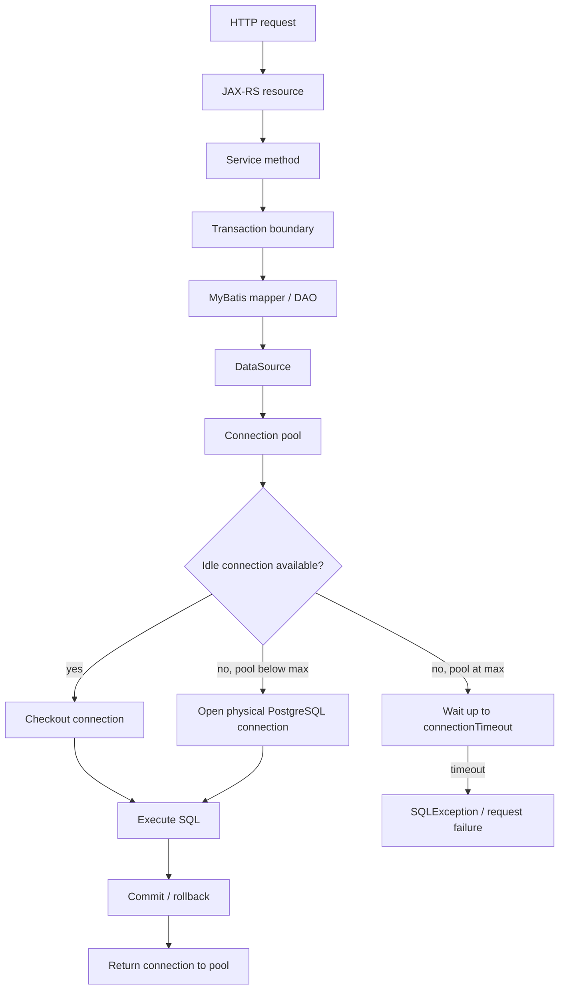
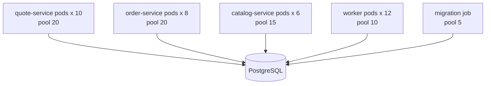
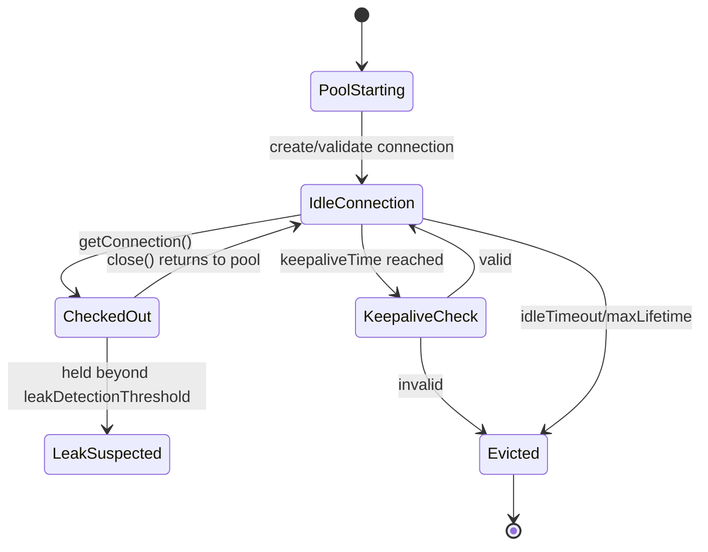
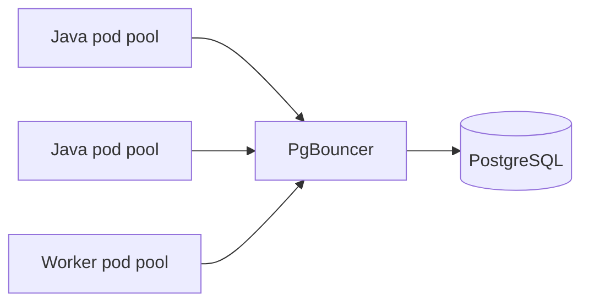
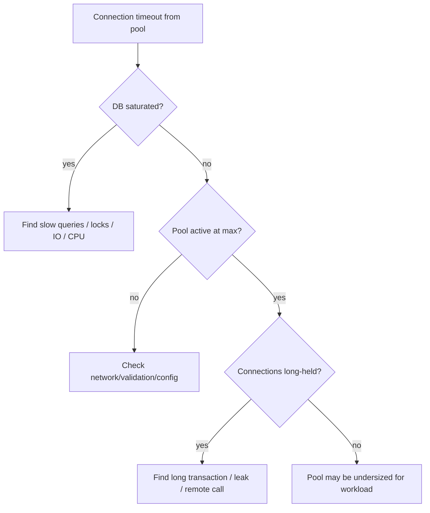

# Part 023 — Connection Pooling

> Goal: understand connection pooling as the **runtime pressure valve** between Java/JAX-RS services and PostgreSQL. A connection pool is not just a performance optimization. It is a concurrency control mechanism, a failure amplifier when misconfigured, and one of the most important operational contracts between application replicas and the database.

This part focuses on PostgreSQL-backed Java/JAX-RS systems using JDBC, MyBatis, HikariCP or equivalent pools, Kubernetes replicas, cloud-managed PostgreSQL, on-prem PostgreSQL, and optional poolers such as PgBouncer.

---

## 1. Executive mental model

A Java service rarely opens a new PostgreSQL connection for every SQL statement. Instead, the service checks out a connection from a local pool, uses it for a short unit of work, then returns it.



The pool is a bounded queue in front of PostgreSQL.

If the pool is too small, application threads wait even when PostgreSQL could still do work.

If the pool is too large, service replicas can overwhelm PostgreSQL with too many backend sessions, too much memory, too many active queries, too much lock contention, and too much context switching.

Senior-engineer framing:

> Connection pool sizing is a capacity allocation decision. It must be sized against PostgreSQL, all application replicas, background jobs, migration tools, admin access, CDC tools, and emergency reserve connections — not against a single service instance in isolation.

---

## 2. Why connection pooling exists

Opening a database connection is not free.

A PostgreSQL connection implies:

- TCP connection establishment.
- Authentication.
- Optional TLS negotiation.
- Backend process/session allocation on PostgreSQL.
- Session memory structures.
- Server-side state.
- Driver-side state.
- Possible prepared statement cache behavior.

Without pooling, high-traffic Java services would repeatedly create and close physical connections. This causes:

- Connection setup latency on normal requests.
- Authentication overhead.
- Connection storms during traffic spikes.
- Load balancer/NAT/socket churn.
- PostgreSQL backend process churn.
- Poor tail latency.
- Higher failure probability during transient network or database saturation.

Pooling solves this by reusing connections.

But pooling also introduces a new class of failures:

- Pool exhaustion.
- Connection leak.
- Idle-in-transaction sessions.
- Stale socket issues.
- Max connection exhaustion at PostgreSQL.
- Startup storms from many Kubernetes pods.
- Misaligned timeouts between app, pool, database, and infrastructure.
- Session state leakage between requests.

A pool is useful only if its lifecycle is disciplined.

---

## 3. Connection pool as a bounded resource

A pool has a maximum size.

At runtime, connections are usually in one of these states:

| State | Meaning | Production concern |
|---|---|---|
| Idle | Open physical connection waiting in pool | Consumes PostgreSQL connection slot |
| Active / in-use | Checked out by application code | Long usage blocks other requests |
| Pending / waiting | Thread waiting for available connection | User-facing latency or timeout |
| Creating | Pool opening new physical connection | Startup storm risk |
| Closing / evicting | Pool retiring connection | Max lifetime, network failure, validation failure |
| Leaked | Checked out but not returned | Pool exhaustion |

A pool hides physical connection creation from business code, but it does not create infinite database capacity.

The key invariant:

> Total possible physical connections from all workloads must be less than PostgreSQL's safe connection budget.

Not merely less than `max_connections`.

Safe budget excludes:

- Superuser/reserved connections.
- DBA/admin sessions.
- Migration tool connections.
- Batch jobs.
- CDC/logical replication consumers.
- Monitoring agents.
- Read-only/reporting workloads.
- Emergency incident access.
- Other services sharing the same PostgreSQL instance.

---

## 4. PostgreSQL max_connections is not a target

`max_connections` defines an upper bound on concurrent connections accepted by PostgreSQL. It is not a recommendation to use all available slots.

Bad mental model:

> `max_connections = 500`, therefore application pools can consume 500 connections.

Better mental model:

> `max_connections` is the hard ceiling. The application should consume a planned subset, leaving headroom for operations, failover, maintenance, DBA access, monitoring, CDC, and burst recovery.

Practical budgeting shape:

```text
db_max_connections
  - superuser/reserved/admin/emergency reserve
  - monitoring/backup/replication/cdc/migration budget
  - other service budgets
  = application service connection budget
```

Then:

```text
max_pool_size_per_pod <= floor(application_service_connection_budget / max_pod_count)
```

If autoscaling can increase pods from 4 to 20, size against the maximum realistic pod count, not only today's steady-state count.

---

## 5. Kubernetes makes pool sizing multiplicative

In a monolith deployed as one process, a pool size of 30 means at most 30 connections from that process.

In Kubernetes, the same config is multiplied by replicas.

```text
service max pool size = 30
replicas = 12
possible database connections = 360
```

If five services share the same PostgreSQL instance, each with its own pool, total connection pressure is the sum across services.



Total possible connections:

```text
quote-service  = 10 * 20 = 200
order-service  =  8 * 20 = 160
catalog-service=  6 * 15 =  90
worker         = 12 * 10 = 120
migration      =  1 *  5 =   5
---------------------------------
total possible = 575
```

If PostgreSQL max safe application budget is 300, this deployment is already structurally unsafe even if current traffic is low.

Internal verification must check actual runtime replica counts, HPA limits, canary/blue-green overlap, and job concurrency.

---

## 6. HikariCP mental model

HikariCP is a common high-performance JDBC connection pool used in Java services.

The lifecycle looks like this:



Important point:

> In pooled JDBC, `connection.close()` usually means “return to pool”, not “close the physical PostgreSQL connection”.

Therefore, application code must still close connections promptly, even though the pool keeps the physical socket alive.

---

## 7. Important HikariCP settings

| Setting | Meaning | Production concern |
|---|---|---|
| `maximumPoolSize` | Maximum idle + active connections in pool | Multiplies by Kubernetes replicas |
| `minimumIdle` | Minimum idle connections to keep | Can create unnecessary idle pressure |
| `connectionTimeout` | How long caller waits for connection | User-facing failure when pool saturated |
| `idleTimeout` | How long idle connection may stay before retirement | Only relevant when `minimumIdle < maximumPoolSize` |
| `maxLifetime` | Maximum lifetime of a physical connection | Should be lower than infrastructure/database connection lifetime |
| `keepaliveTime` | Periodic keepalive for idle connections | Helps avoid stale connection/network timeout issues |
| `validationTimeout` | Time allowed for validation | Must be shorter than `connectionTimeout` |
| `leakDetectionThreshold` | Logs if connection held too long | Useful during debugging, not a substitute for code discipline |
| `autoCommit` | Default auto-commit mode | Must align with transaction framework |
| `transactionIsolation` | Default isolation if set | Avoid global setting unless intentionally required |
| `readOnly` | Default read-only mode | Useful only with clear semantics |
| `connectionInitSql` | SQL executed when new connection is created | Risky if used for hidden session state |
| `registerMbeans` / metrics | Exposes pool metrics | Important for observability |

Do not cargo-cult Hikari settings. Each parameter must map to a failure mode.

---

## 8. Baseline HikariCP configuration shape

Example only. Do not copy blindly.

```yaml
postgres:
  datasource:
    jdbcUrl: jdbc:postgresql://postgres.internal:5432/quote_order
    username: quote_order_app
    password: ${DB_PASSWORD}
    maximumPoolSize: 12
    minimumIdle: 12
    connectionTimeout: 2000
    validationTimeout: 1000
    idleTimeout: 600000
    maxLifetime: 1740000
    keepaliveTime: 300000
    leakDetectionThreshold: 0
    autoCommit: true
```

Interpretation:

- `maximumPoolSize: 12` means each pod can open up to 12 PostgreSQL sessions.
- `minimumIdle: 12` makes the pool behave like a fixed-size pool.
- `connectionTimeout: 2000` fails fast enough to avoid thread pile-up.
- `maxLifetime` is slightly less than 30 minutes, a common default lifetime pattern, but must be aligned to your infrastructure.
- `keepaliveTime` helps detect dead/stale idle connections.
- `leakDetectionThreshold` disabled by default; enable temporarily during leak investigation.

Better production practice:

- Keep config explicit.
- Set values through environment/config map/secret management.
- Expose pool metrics.
- Size based on database budget and pod count.
- Revisit after load testing.

---

## 9. Pool sizing: the wrong way

Wrong ways to size a pool:

- Equal to HTTP thread count.
- Equal to CPU core count without considering query latency.
- Equal to PostgreSQL `max_connections` divided by one service only.
- Copied from another service.
- Increased every time pool exhaustion happens.
- Left at default without checking pod count.
- Tuned only in dev environment.

Increasing pool size can make symptoms disappear temporarily while making PostgreSQL worse.

Example:

```text
Symptom: requests wait for connections.
Bad fix: increase pool from 20 to 100.
Actual root cause: one query holds connection for 4 seconds due to missing index.
Result: more concurrent slow queries overload PostgreSQL.
```

Pool exhaustion is often a symptom, not the root cause.

---

## 10. Pool sizing: a better workflow

A better workflow:

1. Determine database safe connection budget.
2. Determine all consumers of the database.
3. Determine maximum pod count per service, including deployments and jobs.
4. Allocate connection budget per service based on criticality and workload.
5. Set `maximumPoolSize` per pod.
6. Load test with realistic concurrency and data volume.
7. Observe pool wait time, active connections, database CPU/IO/locks, query latency.
8. Adjust query/index/transaction design before increasing pool size.
9. Add PgBouncer or architectural isolation only when the bottleneck is connection fan-out, not query inefficiency.

A useful sizing formula:

```text
pool_size_per_pod = floor(service_connection_budget / maximum_number_of_pods)
```

Then validate:

```text
expected_active_connections <= pool_size_per_pod * pod_count
```

and:

```text
p95_connection_wait_time should remain near zero under normal load
```

If connection wait time rises while PostgreSQL is idle, the pool may be too small.

If PostgreSQL CPU/IO/lock pressure rises and pool wait time also rises, the database is saturated; increasing the pool is dangerous.

---

## 11. Throughput, latency, and Little's Law intuition

A rough way to reason about connection demand:

```text
concurrent_db_work ≈ request_rate * db_time_per_request
```

If a service handles 200 requests/sec and each request spends 25 ms actively using a DB connection:

```text
200 * 0.025 = 5 active DB connections on average
```

But average is not enough. You need p95/p99, burst, transaction duration, retries, and batch jobs.

If a request performs multiple sequential queries while holding the same transaction open, DB connection hold time increases.

Example:

```text
HTTP handler time: 250 ms
DB connection held: 220 ms
```

This service is database-connection heavy.

Another endpoint:

```text
HTTP handler time: 250 ms
DB connection held: 20 ms
```

This service can handle much more HTTP concurrency with the same pool size.

The pool is sized against connection hold time, not endpoint wall-clock time alone.

---

## 12. Connection hold time matters more than query count

A connection is held for the entire transaction, not only while a query is actively running.

Bad pattern:

```java
@Transactional
public QuoteResponse approveQuote(UUID quoteId) {
    Quote quote = mapper.findForUpdate(quoteId);

    externalPricingClient.recalculate(quote); // remote call inside transaction

    mapper.updateStatus(quoteId, "APPROVED");
    outboxMapper.insertEvent(...);
    return response;
}
```

Problem:

- Connection is held while waiting for external service.
- Row lock may be held too.
- Pool capacity is consumed by network latency.
- Deadlock/blocking risk increases.
- Transaction duration increases.

Better pattern:

```java
public QuoteResponse approveQuote(UUID quoteId) {
    PricingResult pricing = externalPricingClient.recalculate(quoteId);

    return transactionTemplate.execute(tx -> {
        Quote quote = mapper.findForUpdate(quoteId);
        validateStillApprovingAllowed(quote, pricing);
        mapper.updateStatus(quoteId, "APPROVED");
        outboxMapper.insertEvent(...);
        return response;
    });
}
```

The connection pool is protected by keeping transaction scope short.

---

## 13. Connection timeout vs statement timeout vs transaction timeout

These timeouts solve different problems.

| Timeout | Layer | Meaning | Failure it catches |
|---|---|---|---|
| `connectionTimeout` | Pool | Wait time to acquire connection | Pool exhaustion |
| `validationTimeout` | Pool | Time to test connection liveness | Bad/stale connection validation |
| `statement_timeout` | PostgreSQL/session | Max execution time for SQL statement | Slow/hung query |
| Transaction timeout | Application/framework | Max time for transaction block | Long transaction |
| HTTP timeout | API/gateway/client | Max request duration | User-visible latency |
| Lock timeout | PostgreSQL/session | Max wait for lock | Blocking/lock contention |

Do not use one timeout as a substitute for all others.

Example failure:

```text
connectionTimeout fires
```

This means the app could not acquire a connection from the pool. PostgreSQL may never have seen the SQL.

Example failure:

```text
statement_timeout fires
```

This means the connection was acquired and PostgreSQL cancelled the statement after it exceeded the allowed execution time.

Different diagnostics. Different remediation.

---

## 14. Pool exhaustion

Pool exhaustion occurs when all pool connections are checked out and new callers wait until `connectionTimeout`.

Symptoms:

- Hikari timeout errors acquiring connection.
- Increased request latency.
- Thread pool saturation.
- Many active connections in pool metrics.
- Pending connection acquisition count > 0.
- PostgreSQL may or may not be saturated.

Common root causes:

| Root cause | Signal | Fix direction |
|---|---|---|
| Slow query | Long active DB time, slow query logs | Tune SQL/index/data model |
| Long transaction | Long `xact_start` in `pg_stat_activity` | Shorten transaction scope |
| Connection leak | Active pool count never returns | Fix resource lifecycle |
| Remote call inside transaction | App traces show external wait | Move remote call outside transaction |
| Batch job monopolizes pool | Spikes during batch window | Separate pool/job throttling |
| Too small pool | DB idle but connection wait high | Increase within DB budget |
| DB saturated | High DB CPU/IO/locks | Do not increase pool first |
| Startup storm | Many pods creating connections | Stagger rollout, PgBouncer, lower pool |

Pool exhaustion diagnosis must answer:

1. Are connections active or leaked?
2. What SQL or transaction is holding them?
3. Is PostgreSQL saturated?
4. Is this local to one service or shared DB-wide?
5. Did deployment/autoscaling/batch job change connection demand?

---

## 15. Connection leak

A connection leak means application code checked out a connection and failed to return it.

In raw JDBC, this means `close()` was not called.

In framework code, it may mean:

- Session lifecycle not closed.
- Manual transaction path skipped cleanup.
- Exception path leaked resource.
- Streaming result not consumed/closed.
- Custom integration bypassed transaction manager.
- Async code used connection outside managed scope.

Bad raw JDBC:

```java
Connection connection = dataSource.getConnection();
PreparedStatement statement = connection.prepareStatement("select ...");
ResultSet rs = statement.executeQuery();
// exception before close
```

Better:

```java
try (Connection connection = dataSource.getConnection();
     PreparedStatement statement = connection.prepareStatement("select ...");
     ResultSet rs = statement.executeQuery()) {
    // read result
}
```

With MyBatis, verify the framework owns session lifecycle. Avoid opening manual `SqlSession` without `try/finally`.

Leak detection is a diagnostic tool. It logs suspiciously long checkout duration, but it does not automatically fix the leak.

---

## 16. Idle in transaction

`idle in transaction` means a session began a transaction and is now waiting without actively running a query.

This is dangerous because it can:

- Hold row/table locks.
- Prevent vacuum from cleaning old tuples.
- Increase bloat.
- Keep old MVCC snapshots alive.
- Block migrations or DDL.
- Cause pool exhaustion if connection remains checked out.

Diagnosis query:

```sql
SELECT
  pid,
  usename,
  application_name,
  state,
  now() - xact_start AS xact_age,
  now() - state_change AS idle_age,
  query
FROM pg_stat_activity
WHERE state = 'idle in transaction'
ORDER BY xact_start NULLS LAST;
```

Application causes:

- Transaction opened too early.
- Remote call inside transaction.
- Streaming response from DB while transaction remains open.
- Exception swallowed without rollback/close.
- Manual transaction management bug.
- Debugger breakpoint in transaction during non-production environment.

Production invariant:

> No HTTP request should leave a transaction idle while waiting for user input, remote service, message broker, file IO, or long CPU work.

---

## 17. Connection storm

A connection storm occurs when many application instances try to open many database connections at once.

Triggers:

- Kubernetes rollout.
- Autoscaling event.
- Node restart.
- Database failover.
- Network partition recovery.
- Pool misconfiguration with large `minimumIdle`.
- Blue/green deployment with old and new versions overlapping.
- Batch job start time synchronized across pods.

Failure pattern:

```text
1. DB/network blip occurs.
2. Connections are dropped.
3. Many pods attempt reconnect simultaneously.
4. PostgreSQL authentication/backend creation spikes.
5. App threads wait for connections.
6. Readiness probes may fail.
7. Kubernetes restarts pods.
8. Restart amplifies connection storm.
```

Mitigations:

- Keep pool size bounded.
- Stagger rollouts.
- Use readiness probes carefully.
- Avoid huge `minimumIdle` during mass startup.
- Use connection backoff where available.
- Consider PgBouncer/RDS Proxy/managed proxy where appropriate.
- Ensure database can handle failover reconnect behavior.
- Avoid aggressive liveness probes that restart healthy-but-waiting pods.

---

## 18. PgBouncer mental model

PgBouncer is an external PostgreSQL connection pooler. It sits between application pools and PostgreSQL.



It can reduce PostgreSQL backend connection pressure by multiplexing many client connections onto fewer server connections.

But PgBouncer changes session assumptions.

Pooling modes:

| Mode | Meaning | Compatibility |
|---|---|---|
| Session pooling | Client keeps same server connection for session | Most compatible, less multiplexing |
| Transaction pooling | Server connection assigned only during transaction | Better multiplexing, session-state caveats |
| Statement pooling | Server connection assigned per statement | Most restrictive |

Transaction pooling is powerful but can break code that assumes stable session state.

Caveats to verify:

- Prepared statement behavior.
- Session-level `SET` variables.
- Temporary tables.
- LISTEN/NOTIFY semantics.
- Advisory locks scoped to session.
- Server-side cursors.
- Search path assumptions.
- Connection-level role changes.
- MyBatis/JDBC prepared statement settings.

Safer practice:

- Use transaction-local settings such as `SET LOCAL` where possible.
- Avoid session state as request context.
- Test prepared statements through PgBouncer mode actually used.
- Keep application pool smaller when PgBouncer is present.
- Monitor both app pool and PgBouncer pool.

---

## 19. Prepared statements and poolers

JDBC/MyBatis commonly uses prepared statements.

Prepared statements interact with:

- PostgreSQL server-side prepared statements.
- pgJDBC prepared statement threshold/cache behavior.
- Hikari pooled connections.
- PgBouncer transaction pooling.

Problems appear when code assumes a prepared statement exists on a specific server connection, but a pooler assigns a different server connection.

Modern PgBouncer has support for tracking protocol-level prepared statements when configured, but the exact behavior depends on PgBouncer version and configuration.

Internal verification checklist:

- Is PgBouncer used?
- Which pooling mode?
- Which PgBouncer version?
- Is prepared statement support enabled/configured?
- What is pgJDBC `prepareThreshold`?
- Are SQL-level `PREPARE`/`EXECUTE` used manually?
- Are there errors like “prepared statement does not exist” or “already exists”?

Do not assume prepared statement behavior. Verify it in the actual environment.

---

## 20. Session state leakage

Connection pooling means the same physical session may serve different requests over time.

Dangerous session state:

```sql
SET search_path = tenant_a, public;
SET ROLE elevated_role;
SET app.current_user = 'alice';
CREATE TEMP TABLE tmp_quote (...);
SELECT pg_advisory_lock(123);
```

If not reset, the next request may inherit unexpected state.

Risk examples:

- Tenant data isolation bug.
- Wrong schema queried.
- Elevated role persists.
- Advisory lock remains held.
- Temporary table name collision.
- Wrong timezone or locale.
- Statement timeout unexpectedly changed.

Safer options:

- Prefer explicit query predicates over hidden session state.
- Prefer `SET LOCAL` inside transaction for temporary settings.
- Ensure pool/framework resets connections.
- Avoid session-level tenant context unless security review approves it.
- Add integration tests that reuse connections across requests.

---

## 21. Statement timeout and lock timeout setup

Many systems set timeouts at connection initialization or transaction start.

Example:

```sql
SET statement_timeout = '5s';
SET lock_timeout = '1s';
SET idle_in_transaction_session_timeout = '30s';
```

But blindly setting this globally can break legitimate batch/reporting operations.

Better:

- Default conservative timeout for OLTP endpoints.
- Separate pool or role for batch/reporting if required.
- Endpoint-specific timeout through transaction/local setting if supported.
- Avoid infinite query runtime.
- Ensure timeout errors are mapped as technical failures, not domain validation failures.

Example transaction-local setting:

```sql
SET LOCAL statement_timeout = '3s';
SET LOCAL lock_timeout = '500ms';
```

This keeps timeout scope within the transaction.

---

## 22. Separate pools for different workloads

Not all database work should share the same pool.

Potential separate pools:

- OLTP request pool.
- Background job pool.
- Reporting/read-only pool.
- Migration/admin pool.
- CDC/outbox publisher pool.

Why separate?

- Prevent reporting query from starving API requests.
- Prevent batch job from consuming all OLTP connections.
- Use different statement timeouts.
- Use different read-only settings.
- Use different credentials/privileges.
- Improve observability by pool name/application name.

But separate pools also increase total connection budget. They must be included in capacity calculations.

---

## 23. Application name and observability

Set a meaningful PostgreSQL `application_name`.

Example JDBC URL:

```text
jdbc:postgresql://db:5432/quote_order?ApplicationName=quote-service-api
```

This helps in:

- `pg_stat_activity`.
- slow query logs.
- lock diagnosis.
- incident triage.
- distinguishing API vs worker vs migration sessions.

If using multiple pools, name them distinctly:

```text
quote-service-api
quote-service-worker
quote-service-outbox-publisher
quote-service-reporting
```

Pool metrics to expose:

- Active connections.
- Idle connections.
- Pending threads waiting for connection.
- Total connections.
- Connection acquire time.
- Connection usage time.
- Connection creation time.
- Timeout count.
- Leak detection logs.

Database metrics to correlate:

- `pg_stat_activity` connection count by application.
- query latency.
- locks/wait events.
- CPU/IO.
- WAL generation.
- transaction age.
- dead tuples/autovacuum.

---

## 24. Useful PostgreSQL diagnostic queries

Connection count by application:

```sql
SELECT
  application_name,
  state,
  count(*) AS connections
FROM pg_stat_activity
GROUP BY application_name, state
ORDER BY connections DESC;
```

Long transactions:

```sql
SELECT
  pid,
  application_name,
  state,
  now() - xact_start AS xact_age,
  wait_event_type,
  wait_event,
  query
FROM pg_stat_activity
WHERE xact_start IS NOT NULL
ORDER BY xact_start;
```

Active queries by age:

```sql
SELECT
  pid,
  application_name,
  now() - query_start AS query_age,
  wait_event_type,
  wait_event,
  query
FROM pg_stat_activity
WHERE state = 'active'
ORDER BY query_start;
```

Blocked sessions:

```sql
SELECT
  blocked.pid AS blocked_pid,
  blocked.application_name AS blocked_app,
  now() - blocked.query_start AS blocked_for,
  blocker.pid AS blocker_pid,
  blocker.application_name AS blocker_app,
  blocker.query AS blocker_query,
  blocked.query AS blocked_query
FROM pg_stat_activity blocked
JOIN pg_locks blocked_locks
  ON blocked.pid = blocked_locks.pid
JOIN pg_locks blocker_locks
  ON blocker_locks.locktype = blocked_locks.locktype
 AND blocker_locks.database IS NOT DISTINCT FROM blocked_locks.database
 AND blocker_locks.relation IS NOT DISTINCT FROM blocked_locks.relation
 AND blocker_locks.page IS NOT DISTINCT FROM blocked_locks.page
 AND blocker_locks.tuple IS NOT DISTINCT FROM blocked_locks.tuple
 AND blocker_locks.virtualxid IS NOT DISTINCT FROM blocked_locks.virtualxid
 AND blocker_locks.transactionid IS NOT DISTINCT FROM blocked_locks.transactionid
 AND blocker_locks.classid IS NOT DISTINCT FROM blocked_locks.classid
 AND blocker_locks.objid IS NOT DISTINCT FROM blocked_locks.objid
 AND blocker_locks.objsubid IS NOT DISTINCT FROM blocked_locks.objsubid
 AND blocker_locks.pid <> blocked_locks.pid
JOIN pg_stat_activity blocker
  ON blocker.pid = blocker_locks.pid
WHERE NOT blocked_locks.granted
  AND blocker_locks.granted;
```

Use these carefully. In managed environments, permissions may restrict visibility.

---

## 25. Java/JAX-RS request lifecycle impact

Connection pooling affects API design.

Bad endpoint shape:

```text
HTTP request starts
  open transaction
  select row for update
  call remote service
  perform CPU-heavy calculation
  insert audit rows
  publish Kafka directly
  commit
HTTP response
```

This holds a connection too long.

Better endpoint shape:

```text
HTTP request starts
  validate request without DB where possible
  call remote dependency outside DB transaction if safe
  open short transaction
    lock/read current state
    validate invariant
    write state transition
    insert outbox event
  commit
  return response
```

API design principles:

- Keep transactions short.
- Avoid remote calls inside transaction.
- Avoid waiting for Kafka publish inside transaction.
- Use outbox for event consistency.
- Avoid streaming large responses while holding write transaction.
- Use read-only transaction for pure reads if framework supports it.
- Use pagination/keyset for large result sets.
- Separate command and query path where useful.

---

## 26. MyBatis integration concerns

MyBatis usually obtains JDBC connections from a `DataSource`, either directly or through a framework integration.

Verify:

- Who manages transaction boundaries?
- Who opens/closes `SqlSession`?
- Is `SqlSession` request-scoped, transaction-scoped, or manually managed?
- Are batch executors used?
- Are streaming cursors used?
- Are mappers called inside remote-call-heavy service methods?
- Are exceptions properly triggering rollback?

Common failure:

```java
SqlSession session = sqlSessionFactory.openSession();
mapper.doWork();
// missing session.close() on exception
```

Prefer framework-managed session lifecycle where possible.

If manual sessions are necessary:

```java
try (SqlSession session = sqlSessionFactory.openSession()) {
    QuoteMapper mapper = session.getMapper(QuoteMapper.class);
    mapper.insertQuote(...);
    session.commit();
} catch (RuntimeException e) {
    // rollback may be needed depending on openSession mode
    throw e;
}
```

---

## 27. Batch jobs and pool starvation

Batch jobs often use the same database but different access pattern:

- Long-running transactions.
- Large scans.
- Chunked updates.
- Bulk inserts.
- Retry loops.
- Backfills.
- Report generation.

If they share the same pool as API traffic, they can starve user requests.

Better:

- Separate worker pool.
- Smaller pool for batch job.
- Explicit throttling.
- Chunked transactions.
- Statement timeout tuned for batch.
- Application name identifying job.
- Backpressure based on DB metrics.
- Runbook for pause/resume.

Bad:

```text
batch worker replicas = 20
pool size per worker = 20
total possible worker connections = 400
```

This can overwhelm PostgreSQL even if each worker is “just doing background work”.

---

## 28. Read replica and pool routing

Some systems route read-only queries to read replicas.

Connection pool implications:

- Separate writer pool and reader pool.
- Different JDBC URLs.
- Different credentials.
- Different consistency expectations.
- Replica lag awareness.
- Failover behavior.
- Read-after-write correctness.

Danger:

```text
POST /quote/{id}/approve writes to primary
immediately GET /quote/{id} reads from replica
replica lag causes stale response
```

Design options:

- Read own writes from primary.
- Use primary for consistency-sensitive reads.
- Use replica only for reporting/search/read-heavy non-critical views.
- Include replica lag guardrails.
- Avoid routing inside mapper invisibly.

Pool review must include whether each pool targets primary or replica.

---

## 29. Failure modes

| Failure mode | Symptom | Likely cause | First check |
|---|---|---|---|
| Pool exhausted | Hikari timeout acquiring connection | Slow query, long transaction, leak, undersized pool | Pool active/pending metrics |
| DB max connections exhausted | `too many connections` | Too many pods/pools/jobs | `pg_stat_activity` count by app |
| Connection leak | Active connections never return | Missing close/session cleanup | Leak logs, traces |
| Idle in transaction | Bloat/locks/vacuum delay | Transaction opened and left idle | `pg_stat_activity` |
| Startup storm | Failures during rollout | Many pods connect at once | Deployment timeline |
| Stale connection | Intermittent socket errors | Network/LB idle timeout mismatch | maxLifetime/keepalive |
| Prepared statement errors | Prepared statement not found/existing | PgBouncer/driver interaction | PgBouncer mode/config |
| Session state leak | Wrong tenant/schema/role | SET/session variable persists | connection reset behavior |
| Batch starvation | API latency during jobs | Shared pool consumed by batch | pool by workload |
| Lock wait timeout | update fails waiting lock | concurrent transaction | `pg_locks`, blockers |

---

## 30. Debugging workflow for pool incidents

When API errors show connection acquisition timeout:

1. Check pool metrics for the affected service.
2. Confirm active, idle, pending, total connections.
3. Check whether active connections return to normal.
4. Check `pg_stat_activity` grouped by `application_name`.
5. Identify long-running queries and long transactions.
6. Check recent deployments/autoscaling/batch jobs.
7. Check database CPU/IO/lock wait metrics.
8. Check slow query logs and `pg_stat_statements`.
9. Check for connection leak logs.
10. Avoid increasing pool size until root cause is understood.

Decision tree:



---

## 31. Production configuration checklist

For every Java/JAX-RS service using PostgreSQL:

- `maximumPoolSize` is explicitly set.
- Pool size is calculated against maximum replica count.
- HPA max replicas are included.
- Blue/green/canary overlap is included.
- Batch workers have separate budget.
- Migration jobs have separate budget.
- `connectionTimeout` is explicit.
- `maxLifetime` is lower than database/network connection lifetime.
- `keepaliveTime` is intentional.
- `leakDetectionThreshold` strategy is documented.
- Pool metrics are exported.
- PostgreSQL `application_name` is set.
- Statement/lock/transaction timeout policy exists.
- PgBouncer/proxy behavior is documented if present.
- Session state usage is reviewed.
- Read replica routing is explicit if used.

---

## 32. PR review checklist

Ask these questions when reviewing changes affecting database usage:

- Does this endpoint increase DB connection hold time?
- Does this code open manual JDBC/MyBatis sessions?
- Are resources closed on all exception paths?
- Does this transaction include remote calls or slow CPU work?
- Does this query stream large results while holding a connection?
- Does this batch job share the OLTP pool?
- Does this change increase pod count or pool size?
- Does this service already consume a safe database connection budget?
- Are statement and lock timeouts appropriate?
- Does code rely on session state that may leak through pooling?
- Does PgBouncer mode support this usage?
- Is `application_name` clear enough for debugging?
- Are pool metrics available in dashboards?

---

## 33. Internal verification checklist

Verify in the actual CSG/team environment:

- Which connection pool implementation is used: HikariCP, app-server pool, custom, or other.
- Current pool config per service: `maximumPoolSize`, `minimumIdle`, `connectionTimeout`, `idleTimeout`, `maxLifetime`, `keepaliveTime`, `validationTimeout`, `leakDetectionThreshold`.
- PostgreSQL `max_connections`, reserved connections, and managed-service limits.
- Number of service replicas in normal, peak, failover, rollout, and canary states.
- HPA min/max replicas.
- Whether blue/green deployments double connection demand temporarily.
- Whether background jobs share API pools.
- Whether outbox/CDC publishers use separate pools.
- Whether migration jobs run inside app startup or separate pipeline.
- Whether PgBouncer, RDS Proxy, Azure proxy, or other pooler is used.
- PgBouncer pooling mode and prepared statement configuration if used.
- Whether `application_name` is set and visible in `pg_stat_activity`.
- Whether pool metrics are exported to dashboards.
- Whether slow query logs can be correlated to service/pod/request.
- Whether incident notes mention pool exhaustion, DB max connection, connection leak, or idle-in-transaction.
- Whether database access policies differ across cloud/on-prem/hybrid deployments.

---

## 34. Common anti-patterns

- Increasing pool size whenever latency rises.
- Pool size larger than PostgreSQL safe budget.
- Ignoring Kubernetes replica multiplication.
- Same pool for API, batch, reporting, and migration.
- Remote API call inside database transaction.
- Streaming large response while holding transaction.
- Manual connection/session lifecycle without `try/finally`.
- Using session-level tenant context without reset guarantees.
- No `application_name`.
- No pool metrics.
- No timeout strategy.
- Assuming PgBouncer transaction pooling behaves like direct PostgreSQL connections.
- Treating `max_connections` as capacity target.
- Letting batch jobs create unbounded worker/database concurrency.

---

## 35. Practical exercises

1. Find the pool config of one service.
2. Calculate possible database connections from that service using current and maximum replica counts.
3. Compare it to known PostgreSQL connection budget.
4. Check whether `application_name` appears in `pg_stat_activity`.
5. Find the dashboard showing active/idle/pending pool metrics.
6. Locate one endpoint with a transaction and determine how long the connection is held.
7. Look for remote calls inside transaction boundaries.
8. Identify whether batch jobs share the API pool.
9. Check whether PgBouncer/proxy is used.
10. Review the last incident involving pool exhaustion, slow query, or too many connections.

---

## 36. Senior-engineer summary

Connection pooling is where application concurrency becomes database concurrency.

A correct pool configuration must satisfy these invariants:

- It respects PostgreSQL's safe connection budget.
- It accounts for all service replicas and all workloads.
- It keeps transaction/connection hold time short.
- It fails fast enough to avoid unlimited thread buildup.
- It exposes enough metrics for production diagnosis.
- It does not hide session state bugs.
- It does not amplify database saturation by increasing concurrency blindly.

When a pool incident happens, do not ask only “is the pool too small?”

Ask:

- Why are connections held?
- Which SQL holds them?
- Which transaction holds them?
- Which workload owns them?
- Is PostgreSQL healthy?
- Did deployment topology change?
- Are we seeing capacity shortage or inefficient usage?

That is the difference between tuning a knob and engineering a reliable data layer.

---

## References

- PostgreSQL Documentation — Connections and Authentication: https://www.postgresql.org/docs/current/runtime-config-connection.html
- HikariCP Configuration: https://github.com/brettwooldridge/HikariCP
- PgBouncer Configuration: https://www.pgbouncer.org/config.html
