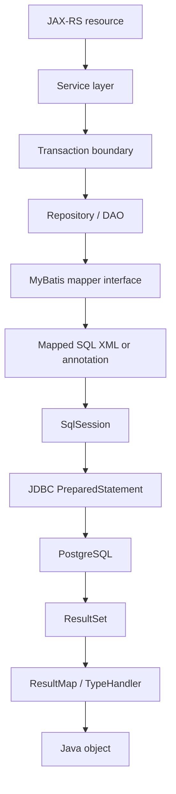
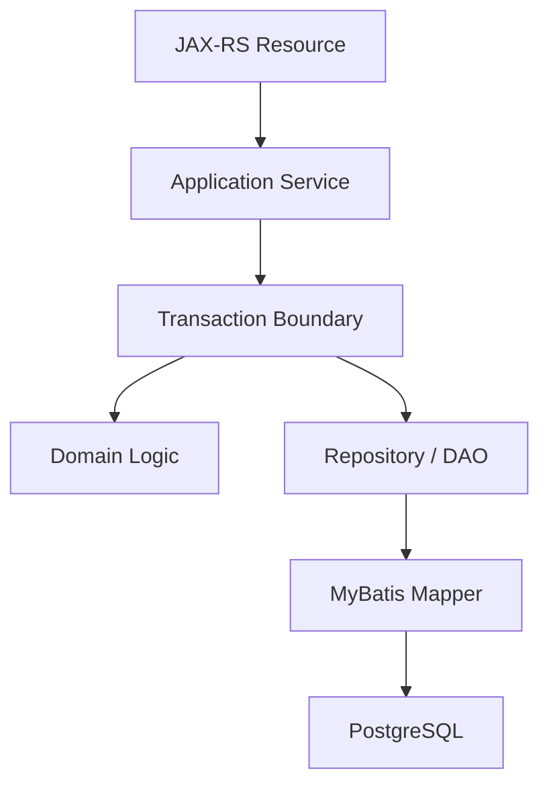

# Part 024 — MyBatis Fundamentals

> Goal: understand MyBatis as an **explicit SQL mapping layer** between Java/JAX-RS services and PostgreSQL. MyBatis is not an ORM that hides SQL. It is a persistence framework that makes SQL a first-class part of the application architecture.

This part focuses on MyBatis fundamentals in enterprise PostgreSQL systems: mapper interface, mapper XML, `SqlSession`, `SqlSessionFactory`, `ResultMap`, parameter mapping, `TypeHandler`, dynamic SQL, mapper organization, test strategy, and production review concerns.

---

## 1. Executive mental model

MyBatis sits between Java code and JDBC.



MyBatis removes much JDBC boilerplate, but it does not remove database responsibility.

You still own:

- SQL shape.
- Index compatibility.
- Join correctness.
- Transaction boundaries.
- Locking behavior.
- Pagination strategy.
- Mapping correctness.
- SQL injection safety.
- Error handling.
- PostgreSQL type mapping.
- Test coverage.
- Migration compatibility.

Senior-engineer framing:

> With MyBatis, SQL is code. Mapper files deserve the same review discipline as Java service logic, migration scripts, and public API contracts.

---

## 2. What MyBatis is

MyBatis is a SQL mapper framework.

It maps:

- Java method calls to SQL statements.
- Java parameters to SQL parameters.
- SQL result sets to Java objects.
- PostgreSQL types to Java types through JDBC and `TypeHandler`s.

It supports:

- Custom SQL.
- Stored procedure calls.
- Advanced result mappings.
- XML-based mappings.
- Annotation-based mappings.
- Dynamic SQL.
- Mapper interfaces.

Unlike JPA/Hibernate, MyBatis does not try to maintain a persistence context or automatically generate most SQL for you. This is a strength when you want precise control over PostgreSQL query shape.

But precision comes with responsibility.

---

## 3. MyBatis vs JDBC vs JPA/Hibernate

| Dimension | Raw JDBC | MyBatis | JPA/Hibernate |
|---|---|---|---|
| SQL control | Full | Full / explicit | Often generated, can be custom |
| Boilerplate | High | Medium-low | Low for simple CRUD |
| Mapping | Manual | Configured via ResultMap/TypeHandler | Entity mapping/persistence context |
| Query visibility | High | High | Sometimes hidden |
| N+1 risk | Manual mistake | Mapper design mistake | Common if lazy loading misused |
| Transaction integration | Manual/framework | Framework/manual | Framework-managed |
| PostgreSQL-specific SQL | Easy | Easy | Possible but sometimes awkward |
| Learning curve | JDBC API | SQL + mapper semantics | Entity lifecycle + ORM semantics |
| Best use case | Low-level control | SQL-centric enterprise systems | Domain object persistence with ORM fit |

MyBatis is often a good fit when:

- Query shape matters.
- PostgreSQL-specific SQL is used.
- Stored functions/procedures are used.
- Complex reporting/read queries exist.
- The team wants SQL visible in PRs.
- The data model is not a simple object graph.
- Performance tuning requires direct SQL control.

MyBatis is a poor fit when the team treats mapper SQL as copy-paste text without review.

---

## 4. Core MyBatis components

| Component | Role | Production concern |
|---|---|---|
| Mapper interface | Java interface called by service/DAO | Method naming and boundary clarity |
| Mapper XML | SQL and result mapping definitions | SQL readability, injection safety |
| `SqlSessionFactory` | Creates `SqlSession` | Lifecycle/config correctness |
| `SqlSession` | Executes mapped statements | Must be transaction/session scoped correctly |
| `ResultMap` | Maps result columns to object graph | Incorrect mapping can silently corrupt response |
| Parameter mapping | Binds Java parameters to SQL | Must use safe binding |
| `TypeHandler` | Converts JDBC/PostgreSQL types to Java | Critical for UUID, JSONB, enum, timestamp, arrays |
| Dynamic SQL | Builds conditional SQL | Injection and plan-shape risk |
| Cache | Local/second-level cache options | Staleness risk in transactional systems |

---

## 5. Mapper interface

A mapper interface defines the Java contract.

```java
public interface QuoteMapper {
    QuoteRow findById(@Param("id") UUID id);

    List<QuoteSummaryRow> searchQuotes(@Param("tenantId") UUID tenantId,
                                        @Param("status") String status,
                                        @Param("limit") int limit,
                                        @Param("afterId") UUID afterId);

    int updateStatus(@Param("id") UUID id,
                     @Param("expectedVersion") long expectedVersion,
                     @Param("newStatus") String newStatus);
}
```

Good mapper method traits:

- Name describes database operation, not HTTP action.
- Parameters are explicit.
- Return type is clear.
- It does not hide transaction assumptions.
- It does not imply business invariants that are not enforced.
- It is close to the SQL it maps to.

Bad mapper method:

```java
void process(Quote quote);
```

Why bad:

- Unknown whether it inserts, updates, locks, deletes, calls procedure, or emits side effects.
- Hard to review from service code.
- Hidden transaction/locking semantics.

Better:

```java
int transitionQuoteStatus(@Param("quoteId") UUID quoteId,
                          @Param("fromStatus") String fromStatus,
                          @Param("toStatus") String toStatus,
                          @Param("expectedVersion") long expectedVersion);
```

---

## 6. Mapper XML

Mapper XML maps statements to Java interface methods.

Example:

```xml
<mapper namespace="com.example.quote.QuoteMapper">

  <select id="findById" resultMap="QuoteRowResultMap">
    SELECT
      q.id,
      q.quote_number,
      q.status,
      q.version,
      q.created_at,
      q.updated_at
    FROM quote q
    WHERE q.id = #{id}
  </select>

</mapper>
```

The `namespace` should match the mapper interface.

The `id` should match the mapper method name.

Production rules:

- SQL should be formatted for review.
- Column list should be explicit; avoid `SELECT *`.
- Aliases should be stable and intentional.
- Query should map to indexes and constraints.
- Dynamic fragments should not obscure final SQL shape.
- Security-sensitive filters such as tenant ID must be obvious.
- Locking clauses must be visible.

---

## 7. `#{}` vs `${}`

This is one of the most important MyBatis fundamentals.

`#{}` creates a safely bound JDBC parameter.

```xml
WHERE q.id = #{id}
```

This becomes a prepared statement parameter.

`${}` performs string substitution.

```xml
ORDER BY ${sortColumn}
```

This can be dangerous if the value comes from user input.

Rule:

> Use `#{}` for values. Use `${}` only for carefully whitelisted SQL identifiers or fragments that cannot be bound as parameters.

Bad:

```xml
WHERE q.status = '${status}'
```

Better:

```xml
WHERE q.status = #{status}
```

Dynamic ordering needs whitelisting:

```java
public enum QuoteSortColumn {
    CREATED_AT("q.created_at"),
    UPDATED_AT("q.updated_at"),
    QUOTE_NUMBER("q.quote_number");

    private final String sql;
}
```

Then mapper receives only a server-side whitelisted SQL fragment, not raw request text.

---

## 8. Parameter mapping

Use `@Param` for multi-argument mapper methods.

```java
List<QuoteRow> findByStatus(@Param("tenantId") UUID tenantId,
                            @Param("status") String status,
                            @Param("limit") int limit);
```

Mapper:

```xml
<select id="findByStatus" resultMap="QuoteRowResultMap">
  SELECT
    q.id,
    q.quote_number,
    q.status,
    q.created_at
  FROM quote q
  WHERE q.tenant_id = #{tenantId}
    AND q.status = #{status}
  ORDER BY q.created_at DESC, q.id DESC
  LIMIT #{limit}
</select>
```

Avoid ambiguous parameter names like `param1`, `param2` in production mapper XML.

For complex search criteria, use a request object:

```java
public record QuoteSearchCriteria(
    UUID tenantId,
    String status,
    Instant createdAfter,
    Instant createdBefore,
    int limit
) {}
```

Mapper:

```xml
<select id="search" parameterType="QuoteSearchCriteria" resultMap="QuoteRowResultMap">
  SELECT
    q.id,
    q.quote_number,
    q.status,
    q.created_at
  FROM quote q
  WHERE q.tenant_id = #{tenantId}
  <if test="status != null">
    AND q.status = #{status}
  </if>
  <if test="createdAfter != null">
    AND q.created_at &gt;= #{createdAfter}
  </if>
  <if test="createdBefore != null">
    AND q.created_at &lt; #{createdBefore}
  </if>
  ORDER BY q.created_at DESC, q.id DESC
  LIMIT #{limit}
</select>
```

---

## 9. Result mapping

Simple mapping can use `resultType`.

```xml
<select id="countByStatus" resultType="long">
  SELECT count(*)
  FROM quote
  WHERE status = #{status}
</select>
```

For production row objects, prefer `resultMap` when mapping is non-trivial.

```xml
<resultMap id="QuoteRowResultMap" type="com.example.quote.QuoteRow">
  <id property="id" column="id" />
  <result property="quoteNumber" column="quote_number" />
  <result property="status" column="status" />
  <result property="version" column="version" />
  <result property="createdAt" column="created_at" />
  <result property="updatedAt" column="updated_at" />
</resultMap>
```

Why `resultMap` matters:

- It makes mapping explicit.
- It handles column/property naming mismatch.
- It supports nested associations/collections.
- It reduces silent mapping surprises.
- It provides a stable review surface.

Potential failure:

```sql
SELECT id, status FROM quote
```

mapped to:

```java
QuoteRow(UUID id, String quoteNumber, String status)
```

If constructor mapping or aliases are wrong, fields can be null or misplaced.

Mapper tests must catch this.

---

## 10. Result object design

Do not always map directly into domain objects.

Common object types:

| Type | Purpose | Example |
|---|---|---|
| Persistence row | Mirrors selected database columns | `QuoteRow` |
| Read model DTO | API/query projection | `QuoteSummaryView` |
| Domain model | Business behavior/invariants | `Quote` |
| Command result | Mutation result | `UpdatedQuoteVersion` |
| Aggregate report row | Reporting output | `QuoteStatusCountRow` |

Avoid making one Java object serve every query.

Bad:

```java
class Quote {
    // 80 fields, used by all queries
}
```

Problems:

- Queries fetch unnecessary columns.
- Mapper becomes fragile.
- API DTO leaks persistence details.
- Domain object becomes an anemic row container.
- Small schema changes affect unrelated endpoints.

Better:

- Use narrow projection classes for read queries.
- Use domain objects where behaviour/invariants matter.
- Use separate command result objects for mutations.

---

## 11. PostgreSQL type mapping concerns

PostgreSQL types often need explicit mapping decisions.

| PostgreSQL type | Java type | Concern |
|---|---|---|
| `uuid` | `UUID` | Usually supported through pgJDBC |
| `timestamptz` | `Instant` / `OffsetDateTime` | Timezone correctness |
| `timestamp` | `LocalDateTime` | Dangerous if instant semantics needed |
| `jsonb` | `String`, `JsonNode`, custom type | Needs TypeHandler discipline |
| `numeric` | `BigDecimal` | Scale/rounding correctness |
| `text` | `String` | Large values and indexing |
| enum type | Java enum/string | Migration/version compatibility |
| array | Java array/List/custom | TypeHandler may be needed |
| `bytea` | `byte[]` | Large object memory risk |

Do not let type mapping be accidental.

Example JSONB TypeHandler concept:

```java
public class JsonNodeTypeHandler extends BaseTypeHandler<JsonNode> {
    @Override
    public void setNonNullParameter(PreparedStatement ps, int i, JsonNode parameter, JdbcType jdbcType)
            throws SQLException {
        PGobject object = new PGobject();
        object.setType("jsonb");
        object.setValue(parameter.toString());
        ps.setObject(i, object);
    }

    @Override
    public JsonNode getNullableResult(ResultSet rs, String columnName) throws SQLException {
        String json = rs.getString(columnName);
        return json == null ? null : parse(json);
    }
}
```

Production concerns:

- JSON parsing errors.
- Backward-compatible JSON evolution.
- Null vs empty object semantics.
- Large JSON payload memory.
- Index/query compatibility.

---

## 12. Generated keys and PostgreSQL `RETURNING`

PostgreSQL supports `RETURNING` for inserts/updates/deletes.

Example:

```sql
INSERT INTO quote (tenant_id, quote_number, status)
VALUES (?, ?, 'DRAFT')
RETURNING id, version, created_at;
```

In MyBatis, teams commonly use one of these patterns:

- JDBC generated keys where appropriate.
- `selectKey` pattern.
- Explicit `RETURNING` mapped as a select/insert result, depending on configuration and mapper style.

The key is consistency.

Review questions:

- Are generated IDs database-generated or application-generated?
- Is UUID generated by app, database function, or default expression?
- Are returned fields required for optimistic locking?
- Are audit columns returned to avoid re-query?
- Does mapper support PostgreSQL `RETURNING` correctly in your framework version?

Avoid insert-then-select by non-unique natural fields when `RETURNING` can provide deterministic output.

---

## 13. MyBatis and transactions

MyBatis can be used with manual transaction management or integrated with frameworks.

In enterprise Java/JAX-RS systems, transaction ownership must be explicit.

Questions:

- Does the service layer own transaction boundaries?
- Does MyBatis participate in framework-managed transactions?
- Are multiple mapper calls in one transaction?
- Are mapper calls accidentally autocommitted one by one?
- Are batch operations committed in chunks?
- Does exception handling trigger rollback?

Bad service shape:

```java
public void approveQuote(UUID id) {
    quoteMapper.updateStatus(id, "APPROVED");
    outboxMapper.insertEvent(...);
}
```

If no transaction wraps both calls, state can be updated without outbox event.

Better:

```java
@Transactional
public void approveQuote(UUID id) {
    int updated = quoteMapper.transitionStatus(id, "PENDING_APPROVAL", "APPROVED");
    if (updated != 1) {
        throw new ConcurrentModificationException();
    }
    outboxMapper.insertEvent(...);
}
```

The mapper should not silently decide transaction scope.

---

## 14. Mapper organization

Organize mapper files by domain/data ownership, not by random SQL categories.

Possible structure:

```text
src/main/java/com/example/quote/persistence/
  QuoteMapper.java
  QuoteItemMapper.java
  QuoteApprovalMapper.java
  QuoteOutboxMapper.java

src/main/resources/mappers/quote/
  QuoteMapper.xml
  QuoteItemMapper.xml
  QuoteApprovalMapper.xml
  QuoteOutboxMapper.xml
```

Guidelines:

- Mapper namespace matches interface.
- One mapper owns a coherent table/aggregate/read model area.
- Shared SQL fragments are limited and readable.
- Avoid giant “CommonMapper” files.
- Avoid hiding cross-domain writes inside mapper helper methods.
- Keep query names stable and searchable.

Bad:

```text
DatabaseMapper.xml
CommonMapper.xml
QueryMapper.xml
```

These become dumping grounds.

Better:

```text
QuoteCommandMapper.xml
QuoteQueryMapper.xml
QuoteReadModelMapper.xml
OutboxMapper.xml
```

Separation depends on team style, but ownership must be clear.

---

## 15. SQL readability in mapper XML

Mapper SQL should be optimized for PR review.

Good style:

```xml
<select id="findQuoteSummaryByTenant" resultMap="QuoteSummaryResultMap">
  SELECT
    q.id,
    q.quote_number,
    q.status,
    q.created_at,
    q.updated_at,
    count(qi.id) AS item_count
  FROM quote q
  LEFT JOIN quote_item qi
    ON qi.quote_id = q.id
  WHERE q.tenant_id = #{tenantId}
    AND q.deleted_at IS NULL
  GROUP BY
    q.id,
    q.quote_number,
    q.status,
    q.created_at,
    q.updated_at
  ORDER BY q.created_at DESC, q.id DESC
  LIMIT #{limit}
</select>
```

Review-friendly traits:

- Explicit column list.
- Table aliases are meaningful.
- Join predicates are visible.
- Tenant/security predicates are visible.
- Soft-delete predicate is visible.
- Sort order is deterministic.
- Limit is bounded.
- Result map matches selected aliases.

Bad style:

```xml
<select id="search" resultType="map">
  select * from quote q left join quote_item i on q.id=i.quote_id ${where} ${order}
</select>
```

This hides too much.

---

## 16. MyBatis cache caution

MyBatis has local and second-level caching capabilities.

For enterprise transactional systems, cache usage must be intentional.

Risk areas:

- Stale reads after updates.
- Cross-tenant leakage if cache keys are wrong.
- Inconsistency across application nodes.
- External database changes not reflected.
- Confusion with PostgreSQL transaction isolation.
- Hard-to-debug read anomalies.

Default local session cache is usually less dangerous than second-level cache, but still understand how your framework config behaves.

In many mission-critical systems, second-level mapper cache is avoided unless there is a clear invalidation strategy and test coverage.

Internal verification:

- Is MyBatis second-level cache enabled?
- Are mapper cache settings explicit?
- Are mutable tables cached?
- Is tenant included in cache keys?
- How are updates invalidating cache?

---

## 17. Dynamic SQL overview

Dynamic SQL is useful for optional filters.

Example:

```xml
<select id="searchQuotes" parameterType="QuoteSearchCriteria" resultMap="QuoteSummaryResultMap">
  SELECT
    q.id,
    q.quote_number,
    q.status,
    q.created_at
  FROM quote q
  <where>
    q.tenant_id = #{tenantId}
    <if test="status != null">
      AND q.status = #{status}
    </if>
    <if test="createdAfter != null">
      AND q.created_at &gt;= #{createdAfter}
    </if>
    <if test="createdBefore != null">
      AND q.created_at &lt; #{createdBefore}
    </if>
  </where>
  ORDER BY q.created_at DESC, q.id DESC
  LIMIT #{limit}
</select>
```

Dynamic SQL risks:

- Accidental full table scan when filters absent.
- Query plan instability due to many shapes.
- SQL injection through `${}`.
- Unbounded result sets.
- Dynamic ORDER BY without whitelist.
- Huge `IN` lists.
- Complex XML that nobody can reason about.

Dynamic SQL deserves its own deeper part later. For now, remember:

> Dynamic does not mean uncontrolled. Every possible SQL shape must be safe.

---

## 18. MyBatis with PostgreSQL locking clauses

Mapper SQL may include locking.

Example:

```xml
<select id="findQuoteForUpdate" resultMap="QuoteRowResultMap">
  SELECT
    q.id,
    q.status,
    q.version
  FROM quote q
  WHERE q.id = #{id}
  FOR UPDATE
</select>
```

Review questions:

- Is this mapper always called inside a transaction?
- Is the transaction short?
- Is lock ordering consistent across code paths?
- Is `NOWAIT` or `SKIP LOCKED` more appropriate?
- Is the locked row count bounded?
- Are lock timeout and statement timeout configured?

Bad:

```xml
SELECT * FROM quote WHERE status = 'PENDING' FOR UPDATE
```

This may lock many rows and cause serious contention.

Better for job queue pattern:

```xml
<select id="claimPendingJobs" resultMap="JobRowResultMap">
  SELECT
    j.id,
    j.payload
  FROM job_queue j
  WHERE j.status = 'PENDING'
  ORDER BY j.created_at, j.id
  LIMIT #{batchSize}
  FOR UPDATE SKIP LOCKED
</select>
```

Only use if the transaction and update pattern are correct.

---

## 19. Error handling fundamentals

MyBatis ultimately receives JDBC `SQLException`s.

PostgreSQL errors should be mapped carefully.

Common database errors:

| PostgreSQL scenario | Typical handling direction |
|---|---|
| Unique constraint violation | Domain conflict / duplicate request / idempotency handling |
| Foreign key violation | Application bug or invalid reference depending boundary |
| Check constraint violation | Domain invariant failure or application bug |
| Serialization failure | Retry if operation is safe/idempotent |
| Deadlock detected | Retry carefully after inspecting lock pattern |
| Lock timeout | Technical conflict / retry / 409 depending API semantics |
| Statement timeout | Technical timeout, not domain validation |
| Connection acquisition timeout | Infrastructure/capacity failure |

Do not map every database exception to HTTP 500 without classification.

Also do not map every constraint violation to user-friendly validation. Some constraint failures mean application code violated an invariant that should have been checked earlier.

---

## 20. Mapper testing strategy

Mapper tests should run against PostgreSQL, not only mocks.

Why:

- SQL syntax is PostgreSQL-specific.
- JSONB operators need real PostgreSQL.
- `RETURNING` behavior must be verified.
- Timezone/timestamp mapping must be verified.
- Constraint violations need real SQLState.
- Query plans depend on PostgreSQL.
- MyBatis XML errors surface at runtime.

Recommended test layers:

| Test type | Purpose |
|---|---|
| Mapper integration test | SQL syntax, mapping, constraints |
| Migration + mapper compatibility test | Schema and mapper evolve together |
| Transaction test | rollback/commit/locking behavior |
| Concurrency test | optimistic/pessimistic locking correctness |
| TypeHandler test | JSONB/enum/timestamp/array mapping |
| Query plan smoke test | critical query index usage |

Testcontainers or equivalent local PostgreSQL can be useful, but verify team tooling.

---

## 21. Migration compatibility

Mapper SQL and schema migration are coupled.

Changing a column name, type, constraint, index, function, or view can break mapper code.

Safe migration workflow:

1. Add new nullable/backward-compatible column.
2. Deploy application that can read/write both if needed.
3. Backfill data.
4. Switch reads/writes.
5. Enforce NOT NULL/constraint.
6. Remove old column after all old versions are gone.

Mapper review questions:

- Does the mapper still work with old and new schema during rolling deployment?
- Are selected columns still present?
- Are result aliases unchanged?
- Are TypeHandlers compatible with new type?
- Are constraints introduced after data is clean?
- Are views/materialized views updated in correct order?

MyBatis makes SQL explicit, which helps — but only if migration and mapper PRs are reviewed together.

---

## 22. MyBatis in Java/JAX-RS architecture

A clean architecture shape:



Boundary rules:

- Resource layer handles HTTP parsing/response mapping.
- Service layer owns use case and transaction boundary.
- Domain logic owns business rules.
- Repository/DAO coordinates persistence operations.
- Mapper owns SQL execution and row mapping.
- Mapper should not own HTTP semantics.
- Mapper should not publish Kafka events directly.
- Mapper should not hide cross-service calls.

Bad mapper responsibility:

```text
approveQuoteAndNotifyCustomerAndPublishKafkaEvent
```

Better:

```text
transitionQuoteStatus
insertOutboxEvent
```

The service composes these operations inside a transaction.

---

## 23. Multi-tenant and security filters

In multi-tenant systems, mapper SQL must make tenant boundaries visible.

Example:

```xml
<select id="findByTenantAndId" resultMap="QuoteRowResultMap">
  SELECT
    q.id,
    q.tenant_id,
    q.quote_number,
    q.status
  FROM quote q
  WHERE q.tenant_id = #{tenantId}
    AND q.id = #{id}
</select>
```

Review concerns:

- Is tenant ID required in every query?
- Are joins tenant-safe?
- Are update/delete statements tenant-scoped?
- Are dynamic filters able to omit tenant predicate?
- Are administrative queries clearly separated?
- Is row-level security used or not?
- Is tenant ID hidden in session state? If yes, how is it reset?

Dangerous update:

```xml
<update id="deleteQuote">
  UPDATE quote
  SET deleted_at = now()
  WHERE id = #{id}
</update>
```

Better:

```xml
<update id="deleteQuote">
  UPDATE quote
  SET deleted_at = now()
  WHERE tenant_id = #{tenantId}
    AND id = #{id}
</update>
```

---

## 24. Internal verification checklist

Verify in the actual CSG/team environment:

- Whether MyBatis is used directly or through a framework integration.
- Mapper interface/XML organization.
- `SqlSessionFactory` configuration.
- Transaction management integration.
- Whether mapper sessions are framework-managed or manually opened.
- PostgreSQL JDBC driver version.
- TypeHandlers for UUID, JSONB, enum, array, timestamp/timestamptz.
- Dynamic SQL conventions.
- Use of `${}` and whether all occurrences are whitelisted.
- Mapper testing strategy.
- Whether mapper tests run against real PostgreSQL.
- Whether second-level cache is enabled.
- Whether mapper SQL includes tenant/security predicates.
- Whether mapper SQL uses `SELECT *`.
- Whether mapper SQL includes locking clauses.
- Whether resultMap aliases match migration history.
- Whether generated key/`RETURNING` usage is standardized.
- Whether mapper PRs are reviewed with query plan/index awareness.
- Whether migration PRs include mapper compatibility checks.

---

## 25. PR review checklist

When reviewing a MyBatis mapper PR, ask:

- Is the SQL readable and formatted?
- Are selected columns explicit?
- Are joins correct and bounded?
- Are tenant/security predicates present?
- Is pagination deterministic and bounded?
- Does the query match existing indexes?
- Could this query cause N+1 behavior?
- Is dynamic SQL safe for all possible shapes?
- Are all values bound with `#{}`?
- Are all `${}` fragments whitelisted?
- Is `ResultMap` correct?
- Are PostgreSQL-specific types mapped intentionally?
- Is transaction/locking behavior documented by usage?
- Are mapper methods named clearly?
- Are batch operations chunked and transactional?
- Are constraint violations handled correctly?
- Does a migration need to accompany this mapper change?
- Are tests using real PostgreSQL?

---

## 26. Common anti-patterns

- Treating MyBatis as “just XML”.
- Putting business workflow inside mapper method names.
- `SELECT *` in production mappers.
- Returning `Map<String, Object>` for important domain queries.
- Using `${}` with request-derived values.
- Dynamic WHERE that can remove all selective predicates.
- Dynamic ORDER BY without whitelist.
- Huge mapper XML files with unrelated queries.
- No mapper integration tests.
- Mapping directly to giant domain objects for every query.
- Hiding tenant predicate in reusable fragments that reviewers miss.
- Mapper SQL changed without checking indexes.
- Schema migration changed without mapper compatibility review.
- Using MyBatis second-level cache without invalidation strategy.
- Calling mappers outside transaction when multiple writes must be atomic.

---

## 27. Practical exercises

1. Open one mapper XML file and identify every SQL statement.
2. Find all `${}` usages and classify whether they are safe.
3. Pick one query and identify which index supports it.
4. Pick one `ResultMap` and verify each selected column alias maps correctly.
5. Find one mapper method that updates data and check transaction boundary.
6. Find one query with pagination and verify deterministic ordering.
7. Find one mapper involving JSONB or enum and inspect TypeHandler usage.
8. Find one mapper integration test and verify it uses PostgreSQL.
9. Find one migration that changed a column used by mapper SQL.
10. Review whether mapper organization matches domain ownership.

---

## 28. Senior-engineer summary

MyBatis gives senior backend engineers something valuable: explicit control over SQL.

But explicit SQL is not automatically good SQL.

A production-grade MyBatis layer must satisfy these invariants:

- SQL is readable and reviewable.
- Parameters are safely bound.
- Result mapping is explicit and tested.
- PostgreSQL-specific types are handled intentionally.
- Transaction boundaries are owned by service/application layer.
- Mapper methods do not hide business workflow or side effects.
- Dynamic SQL has bounded, safe query shapes.
- Mapper changes are reviewed with schema, index, transaction, and migration impact.
- Tests run against real PostgreSQL behavior.

The best MyBatis codebase feels like a curated SQL handbook embedded in the application.

The worst MyBatis codebase feels like an untyped string concatenation layer with production access.

Your job as a senior engineer is to make the first one true.

---

## References

- MyBatis 3 Introduction: https://mybatis.org/mybatis-3/
- MyBatis 3 Mapper XML Files: https://mybatis.org/mybatis-3/sqlmap-xml.html
- PostgreSQL Documentation: https://www.postgresql.org/docs/current/
