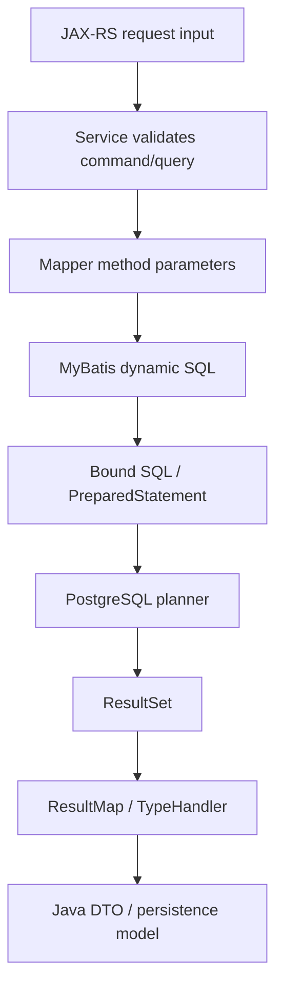

# Part 025 — MyBatis Mapping and Dynamic SQL

> Goal: understand advanced MyBatis mapping and dynamic SQL as a **production SQL contract**, not as string templating convenience.

This part focuses on `ResultMap`, nested mapping, association, collection, constructor mapping, discriminator, `TypeHandler`, JSONB mapping, enum mapping, dynamic `WHERE`, dynamic `ORDER BY`, dynamic pagination, `IN` clause handling, bulk insert/update, SQL injection risk, safe parameter binding, and mapper review discipline for PostgreSQL-backed Java/JAX-RS systems.

---

## 1. Executive mental model

MyBatis gives you direct control over SQL, but that control has two halves:

1. **Mapping correctness** — does the SQL result become the Java object you think it becomes?
2. **Dynamic SQL safety** — can runtime inputs change the SQL shape in unsafe, unbounded, or unreviewable ways?



The important invariant:

> MyBatis dynamic SQL may be dynamic at runtime, but the set of valid SQL shapes must be bounded, reviewable, indexed, tested, and safe.

A senior engineer does not ask only “does this mapper work?”

A senior engineer asks:

- What SQL shapes can this mapper generate?
- Are all values safely bound?
- Are identifiers and sort clauses whitelisted?
- Can predicates disappear and cause a full scan?
- Does the generated SQL still match available indexes?
- Does the result mapping survive nulls, aliases, joins, and schema changes?
- Does the mapper hide side effects or transaction requirements?

---

## 2. Why advanced mapping matters

Simple CRUD mapping is rarely the problem.

Production enterprise systems usually contain queries like:

- Quote summary with account, status, latest approval, and price totals.
- Order details with order item hierarchy.
- Catalog offering with effective-dated price rows.
- Config or product attribute JSONB projected into Java objects.
- Search results with optional filters, pagination, and sort order.
- Audit history assembled from multiple related tables.
- Reporting read model from denormalized or materialized data.

These queries often involve:

- Joins.
- Nullable relationships.
- One-to-many relationships.
- Column aliasing.
- Optional predicates.
- Dynamic sort.
- JSONB fields.
- Enum values.
- Pagination.
- Aggregation.

If mapping is careless, the application may return subtly corrupted objects while the SQL appears to run successfully.

That is worse than a hard failure.

---

## 3. ResultMap as a contract

A `ResultMap` is a mapping contract between SQL result columns and Java object fields.

Basic shape:

```xml
<resultMap id="QuoteSummaryResultMap" type="com.example.quote.QuoteSummary">
  <id property="quoteId" column="quote_id" />
  <result property="quoteNumber" column="quote_number" />
  <result property="status" column="quote_status" />
  <result property="accountId" column="account_id" />
  <result property="totalAmount" column="total_amount" />
  <result property="createdAt" column="created_at" />
</resultMap>
```

Senior-engineer rule:

> Every selected column in a non-trivial mapper should have a deliberate alias and an explicit mapping.

Avoid relying on accidental naming conventions in complex joins.

Bad:

```sql
SELECT q.id, a.id, q.status, a.status
FROM quote q
JOIN account a ON a.id = q.account_id
```

The result set has ambiguous semantic meaning. Even if column names are technically distinct by driver metadata, the mapper intent is unclear.

Better:

```sql
SELECT
  q.id AS quote_id,
  q.status AS quote_status,
  a.id AS account_id,
  a.status AS account_status
FROM quote q
JOIN account a ON a.id = q.account_id
```

The mapper now describes the domain meaning of every column.

---

## 4. ResultMap invariants

A production `ResultMap` should satisfy these invariants:

- Every primary object has an `<id>` mapping.
- Joined columns use stable aliases.
- Nullable joined data is handled explicitly.
- One-to-many mappings do not duplicate parent objects incorrectly.
- Enum fields use controlled mapping.
- JSONB fields use a tested `TypeHandler` or explicit string/object mapping.
- Timestamp fields preserve timezone semantics.
- Numeric fields preserve precision.
- The Java target type matches query intent.
- Mapper tests fail when an alias or column is changed incorrectly.

A mapper result is not “just a DTO”. It is a database contract consumed by application logic.

---

## 5. Nested mapping mental model

Nested mapping is used when a row contains data for multiple related Java objects.

Example result object:

```java
public record QuoteDetail(
    UUID quoteId,
    String quoteNumber,
    AccountSummary account,
    List<QuoteItemSummary> items
) {}
```

There are two broad ways to populate it:

1. **Join-based nested result mapping**.
2. **Separate select-based nested mapping**.

Each has different failure modes.

---

## 6. Association mapping

`association` maps one nested object.

Example:

```xml
<resultMap id="QuoteDetailResultMap" type="com.example.quote.QuoteDetail">
  <id property="quoteId" column="quote_id" />
  <result property="quoteNumber" column="quote_number" />

  <association property="account" javaType="com.example.account.AccountSummary">
    <id property="accountId" column="account_id" />
    <result property="accountNumber" column="account_number" />
    <result property="accountName" column="account_name" />
  </association>
</resultMap>
```

Use `association` when:

- The relationship is logically one-to-one or many-to-one.
- The joined data is needed with the parent.
- The row count will not explode.
- The nested object is small and stable.

Failure modes:

- Missing aliases cause fields to map incorrectly.
- Nullable joined object becomes partially initialized.
- Joining too much data bloats every row.
- Mapper silently maps duplicate semantic columns.

Review question:

> Can the nested object be absent? If yes, how does the mapper distinguish absent object from object with nullable fields?

---

## 7. Collection mapping

`collection` maps one-to-many data.

Example:

```xml
<resultMap id="QuoteWithItemsResultMap" type="com.example.quote.QuoteWithItems">
  <id property="quoteId" column="quote_id" />
  <result property="quoteNumber" column="quote_number" />

  <collection property="items" ofType="com.example.quote.QuoteItemSummary">
    <id property="itemId" column="quote_item_id" />
    <result property="productOfferingId" column="product_offering_id" />
    <result property="quantity" column="quantity" />
    <result property="lineAmount" column="line_amount" />
  </collection>
</resultMap>
```

Collection mapping is useful, but it is easy to abuse.

If a parent has 100 children and you join three one-to-many collections, the result can become multiplicative:

```text
quote × items × approvals × notes
```

This creates:

- Duplicate parent rows.
- Duplicate child rows.
- Large network payloads.
- High memory mapping cost.
- Complex de-duplication behavior.
- Hard-to-debug object graph corruption.

Rule:

> Join at most one high-cardinality collection in a single mapper unless the cardinality is bounded and tested.

For multiple collections, consider:

- Separate queries inside one transaction.
- Explicit batch loading by parent IDs.
- Read model table.
- Materialized view.
- API response split.

---

## 8. Nested select mapping and N+1 risk

MyBatis can load nested objects with additional select statements.

Example:

```xml
<collection
  property="items"
  column="quote_id"
  select="selectQuoteItemsByQuoteId" />
```

This is convenient, but dangerous.

If the parent query returns 100 quotes, and each quote loads items separately, you get:

```text
1 parent query + 100 child queries
```

That is N+1.

N+1 is not a style issue. It is a latency multiplier and connection pool pressure amplifier.

Production symptoms:

- Endpoint latency grows linearly with result size.
- Database query count spikes per request.
- Connection pool utilization rises under moderate traffic.
- `pg_stat_statements` shows many repeated tiny queries.
- API appears fast in dev but slow in production.

Preferred alternatives:

- Fetch children with `WHERE parent_id = ANY(...)`.
- Use a batch query with bounded parent IDs.
- Assemble parent-child structure in Java.
- Use a read model for common response shape.

---

## 9. Constructor mapping

Constructor mapping is useful for immutable DTOs and Java records.

Example:

```xml
<resultMap id="QuoteSummaryRecordMap" type="com.example.quote.QuoteSummary">
  <constructor>
    <idArg column="quote_id" javaType="java.util.UUID" />
    <arg column="quote_number" javaType="String" />
    <arg column="quote_status" javaType="String" />
    <arg column="total_amount" javaType="java.math.BigDecimal" />
  </constructor>
</resultMap>
```

Good use cases:

- Read-only query DTOs.
- API projections.
- Immutable persistence projections.
- Testable mapping contracts.

Risks:

- Constructor argument order mistakes.
- Nullability mismatch with primitive types.
- Schema alias change breaks mapping.
- Too many constructor arguments reduce readability.

Review question:

> Is this DTO stable enough to be constructor-mapped, or should it be split into smaller projections?

---

## 10. Discriminator mapping

`discriminator` maps rows to different object types based on a column value.

Use carefully.

Example conceptual use case:

- Quote item can be product item, discount item, fee item, or adjustment item.

```xml
<discriminator javaType="string" column="item_type">
  <case value="PRODUCT" resultMap="ProductQuoteItemMap" />
  <case value="DISCOUNT" resultMap="DiscountQuoteItemMap" />
</discriminator>
```

This can be useful when the database model has a legitimate type column.

But it can also hide polymorphic business logic inside mapper configuration.

Risks:

- Adding a new type requires mapper changes.
- Unknown type may fail late or map incorrectly.
- Type-specific columns can become sparse and unclear.
- Domain lifecycle rules may be split between Java and XML.

Rule:

> Use discriminator for mapping representation, not for implementing business decision logic.

---

## 11. TypeHandler mental model

A `TypeHandler` converts between JDBC values and Java values.

Examples:

- PostgreSQL enum text → Java enum.
- JSONB → Java object.
- PostgreSQL array → Java list.
- `timestamptz` → `OffsetDateTime` or `Instant`.
- Numeric → `BigDecimal`.

A `TypeHandler` is a correctness boundary.

Bad type handling can cause:

- Enum drift.
- Timezone bugs.
- Silent precision loss.
- JSON compatibility breaks.
- Null handling bugs.
- Driver-specific behavior surprises.

---

## 12. JSONB TypeHandler

A common pattern is mapping `jsonb` to a Java object using Jackson.

Example conceptual Java shape:

```java
public final class JsonbTypeHandler<T> extends BaseTypeHandler<T> {
  private final ObjectMapper objectMapper;
  private final Class<T> targetType;

  @Override
  public void setNonNullParameter(
      PreparedStatement ps,
      int i,
      T parameter,
      JdbcType jdbcType
  ) throws SQLException {
    try {
      PGobject jsonObject = new PGobject();
      jsonObject.setType("jsonb");
      jsonObject.setValue(objectMapper.writeValueAsString(parameter));
      ps.setObject(i, jsonObject);
    } catch (JsonProcessingException e) {
      throw new SQLException("Failed to serialize JSONB parameter", e);
    }
  }

  @Override
  public T getNullableResult(ResultSet rs, String columnName) throws SQLException {
    String value = rs.getString(columnName);
    if (value == null) return null;
    try {
      return objectMapper.readValue(value, targetType);
    } catch (JsonProcessingException e) {
      throw new SQLException("Failed to deserialize JSONB column: " + columnName, e);
    }
  }
}
```

Production rules:

- JSON structure must be versioned or backward compatible.
- Unknown fields must be handled intentionally.
- Required fields must be validated at application boundary.
- Avoid large JSONB payloads in hot query paths.
- Do not deserialize more JSON than the endpoint needs.
- Index frequently queried JSONB fields explicitly.
- Avoid using JSONB as an excuse to skip modelling core entities.

JSONB TypeHandler review questions:

- What happens when JSON contains an older shape?
- What happens when JSON contains a newer shape?
- Are unknown fields ignored, rejected, or preserved?
- Is the JSONB object validated before persistence?
- Can the field be queried efficiently?
- Does the mapper select the full JSONB payload unnecessarily?

---

## 13. Enum TypeHandler

Enum mapping looks simple, but it is a common production footgun.

Risky assumptions:

- Java enum name always equals database value.
- Database enum value lifecycle matches Java deployment lifecycle.
- New enum values are deployed atomically with all services.
- Old application versions will never read new values.

Safer model:

- Treat enum values as external persisted codes.
- Store stable string codes where appropriate.
- Avoid ordinal mapping.
- Handle unknown values deliberately.
- Coordinate enum migration with rolling deployments.

Example:

```java
public enum QuoteStatus {
  DRAFT("DRAFT"),
  APPROVAL_PENDING("APPROVAL_PENDING"),
  APPROVED("APPROVED"),
  REJECTED("REJECTED"),
  EXPIRED("EXPIRED");

  private final String code;

  QuoteStatus(String code) {
    this.code = code;
  }

  public String code() {
    return code;
  }
}
```

Review question:

> What happens if PostgreSQL contains a status value this application version does not know yet?

---

## 14. Dynamic SQL mental model

Dynamic SQL should be treated as a small query generator.

That generator must have:

- Bounded input domain.
- Predictable output SQL shapes.
- Safe value binding.
- Whitelisted identifiers.
- Index-aware predicates.
- Deterministic ordering.
- Tests for important combinations.

Bad dynamic SQL is effectively ad-hoc query construction with production credentials.

---

## 15. `#{}` vs `${}`

This distinction is critical.

`#{}` creates a JDBC bind parameter.

```xml
WHERE quote_number = #{quoteNumber}
```

This becomes conceptually:

```sql
WHERE quote_number = ?
```

The value is bound safely by JDBC.

`${}` performs textual substitution.

```xml
ORDER BY ${sortColumn}
```

This inserts raw text into SQL.

Use `${}` only when substituting SQL identifiers or fragments that cannot be bind parameters, and only after strict whitelist validation.

Never do this with user input:

```xml
WHERE customer_name = '${name}'
```

or:

```xml
ORDER BY ${request.sort}
```

Safe pattern:

```java
public enum QuoteSortField {
  CREATED_AT("q.created_at"),
  QUOTE_NUMBER("q.quote_number"),
  STATUS("q.status");

  private final String sqlExpression;
}
```

Then pass only trusted server-side enum-derived SQL fragments.

---

## 16. Dynamic WHERE

Dynamic filters are common in search/list endpoints.

Example:

```xml
<select id="searchQuotes" resultMap="QuoteSummaryResultMap">
  SELECT
    q.id AS quote_id,
    q.quote_number AS quote_number,
    q.status AS quote_status,
    q.account_id AS account_id,
    q.created_at AS created_at
  FROM quote q
  <where>
    <if test="tenantId != null">
      q.tenant_id = #{tenantId}
    </if>
    <if test="status != null">
      AND q.status = #{status}
    </if>
    <if test="createdFrom != null">
      AND q.created_at &gt;= #{createdFrom}
    </if>
    <if test="createdTo != null">
      AND q.created_at &lt; #{createdTo}
    </if>
  </where>
  ORDER BY q.created_at DESC, q.id DESC
  LIMIT #{limit}
</select>
```

Important concern:

If every predicate is optional, the generated query may scan a large table.

For enterprise systems, usually some predicates must be mandatory:

- `tenant_id`.
- account/customer boundary.
- date range.
- status subset.
- visibility/authorization filter.

Rule:

> Dynamic WHERE must have minimum selectivity guarantees.

Add service-layer validation:

```java
if (query.tenantId() == null) {
  throw new BadRequestException("tenantId is required");
}
if (query.hasNoSelectiveFilter() && !query.isExplicitExportMode()) {
  throw new BadRequestException("At least one selective filter is required");
}
```

---

## 17. Dynamic WHERE failure modes

Common failure modes:

- Missing tenant predicate leaks data or scans globally.
- Empty filter triggers full table scan.
- Optional status filter changes index usefulness.
- Optional date filter causes unstable plan selection.
- Conditional join changes row cardinality unexpectedly.
- `OR` predicates destroy index selectivity.
- Generated SQL is not tested for all major combinations.

Debugging signals:

- Slow query appears only for certain filter combinations.
- `pg_stat_statements` shows many normalized query variants.
- `EXPLAIN ANALYZE` differs strongly by parameter values.
- Rows estimate diverges from actual rows.
- Endpoint latency is correlated with missing filter values.

---

## 18. Dynamic ORDER BY

JDBC bind parameters cannot bind SQL identifiers.

This is wrong:

```sql
ORDER BY ?
```

That binds a value, not a column name.

For dynamic sort, use whitelist mapping.

Bad:

```xml
ORDER BY ${sortBy} ${sortDirection}
```

Better conceptual pattern:

```xml
<choose>
  <when test="sortBy == 'CREATED_AT'">
    ORDER BY q.created_at
  </when>
  <when test="sortBy == 'QUOTE_NUMBER'">
    ORDER BY q.quote_number
  </when>
  <otherwise>
    ORDER BY q.created_at
  </otherwise>
</choose>
<choose>
  <when test="sortDirection == 'ASC'">ASC</when>
  <otherwise>DESC</otherwise>
</choose>
, q.id DESC
```

Even better, validate sort field and direction before mapper invocation.

Production rules:

- Sort fields must be whitelisted.
- Sort direction must be whitelisted.
- Add deterministic tie-breaker.
- Ensure index compatibility for common sorts.
- Avoid allowing sort on expensive expressions unless intentionally indexed.

---

## 19. Dynamic pagination

Pagination has correctness and performance concerns.

Offset pagination:

```sql
ORDER BY q.created_at DESC, q.id DESC
LIMIT #{limit}
OFFSET #{offset}
```

Problems:

- Large offsets get slower.
- Rows can shift between pages during concurrent writes.
- API can skip or duplicate rows.

Keyset pagination:

```sql
WHERE
  (
    q.created_at &lt; #{lastCreatedAt}
    OR (q.created_at = #{lastCreatedAt} AND q.id &lt; #{lastId})
  )
ORDER BY q.created_at DESC, q.id DESC
LIMIT #{limit}
```

Better for large ordered datasets.

Mapper rules:

- Always specify deterministic ordering.
- Cap `limit` at service boundary.
- Prefer keyset for high-volume lists.
- Use offset only where bounded and acceptable.
- Match index to sort and filter pattern.

Typical index:

```sql
CREATE INDEX idx_quote_tenant_created_id
ON quote (tenant_id, created_at DESC, id DESC);
```

---

## 20. Dynamic IN clause

MyBatis `foreach` is often used for `IN` clauses.

```xml
<if test="quoteIds != null and quoteIds.size() &gt; 0">
  AND q.id IN
  <foreach collection="quoteIds" item="id" open="(" separator="," close=")">
    #{id}
  </foreach>
</if>
```

Risks:

- Empty list changes semantics.
- Very large list creates huge SQL.
- Planner may choose poor plan.
- Request payload can pressure DB and network.
- Duplicates waste bind slots.

Rules:

- Define empty-list behavior explicitly.
- Cap list size.
- Deduplicate IDs.
- For very large lists, consider temporary table, staging table, `COPY`, or array binding pattern.
- For PostgreSQL, consider `= ANY(#{ids})` with proper array handling when supported by your stack.

Service-layer guard:

```java
if (ids.isEmpty()) {
  return List.of();
}
if (ids.size() > MAX_BATCH_LOOKUP_SIZE) {
  throw new BadRequestException("Too many IDs");
}
```

---

## 21. Dynamic JOIN

Dynamic joins appear when optional filters require related tables.

Example:

- If filtering by account name, join account.
- If filtering by product offering, join quote item.
- If filtering by approval status, join approval table.

Risk:

The result cardinality changes when the join appears.

Bad pattern:

```xml
<if test="productOfferingId != null">
  JOIN quote_item qi ON qi.quote_id = q.id
</if>
```

If a quote has multiple matching items, parent rows can duplicate unless you use `EXISTS`, `DISTINCT`, or proper aggregation.

Often better:

```sql
AND EXISTS (
  SELECT 1
  FROM quote_item qi
  WHERE qi.quote_id = q.id
    AND qi.product_offering_id = #{productOfferingId}
)
```

Review question:

> Is this dynamic join changing filtering semantics, projection semantics, or both?

---

## 22. Bulk insert

Bulk insert reduces round trips, but has limits.

Example:

```xml
<insert id="insertQuoteItems">
  INSERT INTO quote_item (
    id,
    quote_id,
    product_offering_id,
    quantity,
    created_at
  )
  VALUES
  <foreach collection="items" item="item" separator=",">
    (
      #{item.id},
      #{item.quoteId},
      #{item.productOfferingId},
      #{item.quantity},
      #{item.createdAt}
    )
  </foreach>
</insert>
```

Rules:

- Chunk large batches.
- Validate batch size.
- Use one transaction for atomic logical unit.
- Avoid gigantic SQL statements.
- Consider JDBC batch executor for repeated statements.
- Capture generated IDs intentionally if needed.
- Understand partial failure behavior.

Failure modes:

- One bad row fails entire statement.
- Batch exceeds parameter/packet/memory limits.
- Large transaction creates lock/WAL pressure.
- Insert hot spot on index or FK parent.

---

## 23. Bulk update

Bulk update can be more dangerous than bulk insert.

Bad:

```xml
UPDATE quote_item
SET status = #{status}
WHERE quote_id = #{quoteId}
```

This may be correct if all items must change. But for enterprise order/quote systems, bulk updates often need lifecycle validation.

Safer pattern:

```sql
UPDATE quote_item
SET status = #{targetStatus},
    updated_at = #{now},
    version = version + 1
WHERE quote_id = #{quoteId}
  AND status = #{expectedCurrentStatus}
```

Then verify affected row count.

Rules:

- Always know expected cardinality.
- Use predicates that encode lifecycle assumptions.
- Check affected row count.
- Avoid unbounded updates.
- Chunk large updates.
- Consider lock and WAL impact.
- Pair with reconciliation query for data migration style updates.

---

## 24. Dynamic UPDATE with optional fields

Example:

```xml
<update id="patchQuote">
  UPDATE quote
  <set>
    <if test="status != null">status = #{status},</if>
    <if test="description != null">description = #{description},</if>
    <if test="validUntil != null">valid_until = #{validUntil},</if>
    updated_at = #{updatedAt},
    version = version + 1
  </set>
  WHERE id = #{quoteId}
    AND version = #{expectedVersion}
</update>
```

Risks:

- Null may mean “do not update” or “set to null”.
- Patch request semantics may be ambiguous.
- Empty patch still increments version.
- Updated columns may bypass domain invariants.
- Optimistic lock failure must be handled.

Rule:

> Partial update semantics belong in the service/application contract, not accidentally in mapper XML.

---

## 25. Safe parameter binding checklist

Use `#{}` for:

- Values.
- UUIDs.
- Strings.
- Numbers.
- Timestamps.
- Enum codes.
- JSONB values through TypeHandler.
- Status filters.
- IDs.
- Pagination limit/offset after validation.

Use `${}` only for:

- Whitelisted column names.
- Whitelisted direction keywords.
- Whitelisted SQL fragments generated by server-side code.
- Controlled object names in migration/admin tooling, not request-driven paths.

Never use `${}` for:

- User-provided search text.
- IDs.
- Status values.
- Date values.
- JSON values.
- Free-form filter expressions.
- Raw request parameters.

---

## 26. SQL injection risk in MyBatis

MyBatis can be safe if used correctly.

It can also be unsafe if used as string substitution.

Dangerous example:

```xml
<select id="unsafeSearch" resultMap="QuoteSummaryResultMap">
  SELECT *
  FROM quote
  WHERE quote_number LIKE '%${keyword}%'
</select>
```

Safe version:

```xml
<select id="safeSearch" resultMap="QuoteSummaryResultMap">
  SELECT
    q.id AS quote_id,
    q.quote_number AS quote_number
  FROM quote q
  WHERE q.quote_number ILIKE '%' || #{keyword} || '%'
</select>
```

But even the safe version may be slow without trigram/full-text strategy.

Security and performance are separate checks.

A query can be injection-safe and still production-dangerous.

---

## 27. Mapper readability standard

Production mapper SQL should be formatted for review.

Recommended conventions:

- One selected column per line for non-trivial queries.
- Always alias duplicate/semantic columns.
- Prefix columns with table aliases.
- Use stable alias names matching result map.
- Keep dynamic blocks small.
- Extract reusable fragments only when they remain obvious.
- Avoid deeply nested `<choose>` blocks.
- Keep write statements explicit.
- Put lifecycle assumptions in `WHERE` clauses.
- Add comments only for non-obvious business or planner reasons.

Bad readability often hides correctness bugs.

---

## 28. Mapper and PostgreSQL planner interaction

Dynamic SQL can produce different query texts.

Different query shapes can lead to:

- Different plans.
- Different indexes.
- Different join strategies.
- Different row estimates.
- Different temp file usage.
- Different lock behavior.

Review generated SQL, not only mapper XML.

For important dynamic mappers, collect examples:

- Minimal filter.
- Typical filter.
- Heavy filter.
- Search filter.
- Date range filter.
- Sort by each supported field.
- Offset pagination.
- Keyset pagination.

Run `EXPLAIN ANALYZE` on representative shapes in a realistic database.

---

## 29. Failure modes

Mapping failure modes:

- Wrong alias maps wrong field.
- Missing `<id>` causes duplicate objects.
- Nullable association creates partially invalid object.
- One-to-many join duplicates parent/child rows.
- Constructor argument order mismatch.
- Enum unknown value fails in production.
- JSONB deserialization fails after schema evolution.
- Timestamp type maps with wrong timezone semantics.

Dynamic SQL failure modes:

- Missing predicate causes full scan.
- Dynamic sort enables SQL injection.
- Empty `IN` list generates invalid SQL or wrong semantics.
- Large `IN` list creates huge SQL and bad plan.
- Dynamic join changes cardinality.
- Patch update changes unintended fields.
- Bulk operation creates too much WAL or lock pressure.

Operational failure modes:

- Slow endpoint only for certain filters.
- Pool exhaustion from N+1.
- Memory pressure from huge result mapping.
- Lock waits from wide bulk update.
- Data leak from missing tenant predicate.
- Incident caused by mapper change without migration/index review.

---

## 30. Debugging workflow

When a MyBatis mapper misbehaves:

1. Capture the mapper method and parameters.
2. Enable safe SQL logging with parameter awareness, avoiding sensitive data leakage.
3. Inspect the generated SQL shape.
4. Verify the SQL manually in PostgreSQL.
5. Run `EXPLAIN` / `EXPLAIN ANALYZE` for performance issues.
6. Check result set columns and aliases.
7. Verify `ResultMap` mapping.
8. Check TypeHandler behavior.
9. Check transaction boundary if writes are involved.
10. Check affected row count for update/delete.
11. Check `pg_stat_statements` for frequency and latency.
12. Add or fix mapper integration tests.

Do not debug only from Java object output. Inspect the SQL contract.

---

## 31. Testing strategy

Unit tests are not enough for mapper behavior.

Use integration tests with real PostgreSQL for:

- ResultMap correctness.
- JSONB TypeHandler.
- Enum TypeHandler.
- Dynamic WHERE combinations.
- Dynamic ORDER BY whitelist.
- Pagination stability.
- Empty and large IN lists.
- Bulk insert/update.
- Optimistic locking affected row count.
- Constraint violation behavior.

Test data should include:

- Null joined rows.
- Multiple child rows.
- Unknown/edge enum values where possible.
- JSONB older/newer shape.
- Timezone-sensitive timestamps.
- Multiple tenants/accounts.
- Large enough row count to expose bad plans.

---

## 32. Internal verification checklist

Verify in CSG/team/codebase:

- Which modules use MyBatis mapper XML vs annotations.
- Whether mapper SQL uses `#{}` consistently for values.
- Every `${}` usage and its whitelist source.
- Dynamic `ORDER BY` implementation.
- Dynamic search/list endpoints with optional filters.
- Mandatory tenant/account/customer predicates.
- ResultMap conventions and aliasing standards.
- Nested mapping usage and N+1 risk.
- JSONB TypeHandler implementation.
- Enum TypeHandler implementation.
- Timestamp mapping policy.
- Bulk insert/update mapper patterns.
- Mapper integration test strategy.
- SQL logging policy and PII redaction.
- PostgreSQL version and JDBC driver behavior.
- Mapper changes in recent incidents or slow query reports.
- DBA/SRE review expectations for mapper PRs.

---

## 33. Mapper PR review checklist

Ask these before approving mapper changes:

- Is SQL readable and explicitly aliased?
- Does every selected column serve the response/use case?
- Does the ResultMap match selected aliases?
- Are nested mappings bounded and tested?
- Is there any N+1 risk?
- Are all values bound with `#{}`?
- Are all `${}` fragments whitelisted?
- Can optional filters disappear and cause large scans?
- Is tenant/security predicate mandatory?
- Is dynamic sort deterministic and index-aware?
- Is pagination stable under concurrent writes?
- Are IN clauses bounded and empty-list semantics defined?
- Are bulk operations chunked and cardinality-checked?
- Are JSONB/enum/timestamp mappings tested?
- Does this mapper require schema/index migration?
- Does this mapper interact with transaction/locking behavior?
- Is affected row count checked for writes?
- Does logging avoid leaking sensitive values?

---

## 34. Practical exercises

1. Search the codebase for `${}` in mapper XML and classify each usage.
2. Pick one dynamic list endpoint and enumerate all SQL shapes it can generate.
3. For each sort field, identify the supporting index or explain why no index is needed.
4. Pick one ResultMap with joins and verify all aliases.
5. Pick one collection mapping and check whether it can duplicate rows.
6. Find one JSONB TypeHandler and test old/new JSON shapes.
7. Find one enum mapping and check unknown value behavior.
8. Pick one bulk update and verify affected row count handling.
9. Run `EXPLAIN ANALYZE` for a typical generated query.
10. Add one mapper integration test that catches a real mapping risk.

---

## 35. Senior-engineer summary

Advanced MyBatis is powerful because it keeps SQL visible.

It is dangerous when that visibility becomes a false sense of control.

The core discipline is this:

- Mapping must be explicit.
- Dynamic SQL must be bounded.
- User values must be bound.
- SQL identifiers must be whitelisted.
- Optional filters must still protect the database.
- ResultMap must be tested against real PostgreSQL.
- Bulk operations must have cardinality and lock awareness.
- JSONB, enum, and timestamp mappings must be treated as correctness boundaries.

In a production PostgreSQL-backed Java/JAX-RS system, MyBatis mapper XML is not peripheral infrastructure.

It is part of the domain contract, performance contract, and security boundary.

Review it accordingly.

---

## References

- MyBatis 3 Mapper XML Files: https://mybatis.org/mybatis-3/sqlmap-xml.html
- MyBatis 3 Dynamic SQL XML Elements: https://mybatis.org/mybatis-3/dynamic-sql.html
- MyBatis 3 Configuration and TypeHandlers: https://mybatis.org/mybatis-3/configuration.html
- PostgreSQL JSON Types: https://www.postgresql.org/docs/current/datatype-json.html
- PostgreSQL Indexes: https://www.postgresql.org/docs/current/indexes.html
