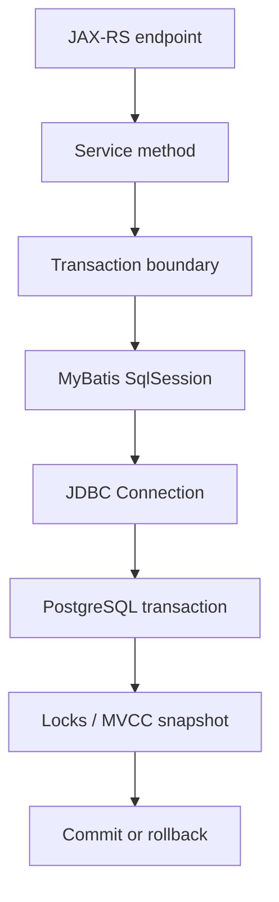
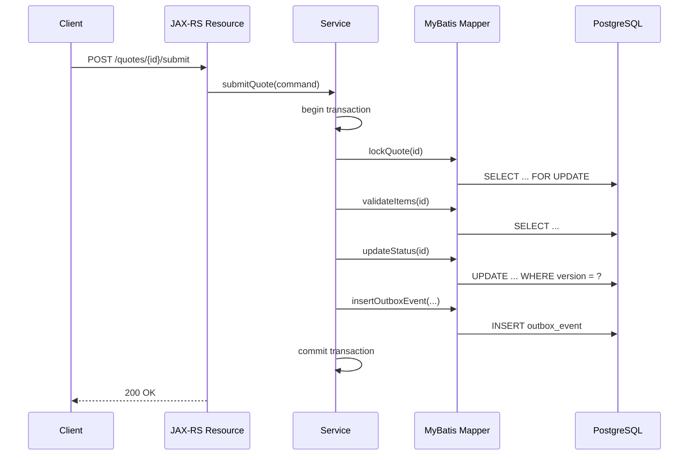

# Part 026 — MyBatis Transactions, Isolation, Locking, and Error Handling

> Goal: understand how MyBatis participates in transaction boundaries, PostgreSQL isolation, locking, retries, SQL errors, and rollback behavior in production Java/JAX-RS services.

This part focuses on transaction integration, manual transaction, framework-managed transaction, isolation level, propagation, locking query, `SELECT FOR UPDATE`, retry on serialization failure, deadlock handling, unique constraint violation, SQLState mapping, domain error mapping, technical error mapping, MyBatis batch executor, partial failure, rollback behavior, and transaction PR review.

---

## 1. Executive mental model

MyBatis does not magically make database operations safe.

It executes mapped SQL through a `SqlSession`, which ultimately uses JDBC connections and PostgreSQL transactions.



The service layer must answer:

- When does the transaction begin?
- Which mapper calls are inside it?
- What isolation level is used?
- Which locks can be taken?
- What happens on PostgreSQL error?
- Is the whole logical operation rolled back?
- Is retry safe?
- How is database failure mapped to API/domain error?

Senior-engineer invariant:

> A mapper write is not a complete business operation. The business transaction boundary lives above the mapper.

---

## 2. Transaction ownership

In a Java/JAX-RS backend, transaction ownership usually belongs to the service/application layer.

Not the resource method.

Not the mapper.

Not each individual SQL statement.

Typical flow:



Everything needed for atomic business consistency must be in the same transaction.

Examples:

- Update quote status + insert outbox event.
- Insert order + insert order items + insert audit history.
- Reserve sequence/business number + persist aggregate.
- Apply approval decision + append state transition history.
- Mark inbox event consumed + apply idempotent state change.

---

## 3. Manual vs framework-managed transaction

There are two broad models.

### Manual transaction

Application code directly opens `SqlSession`, commits, rolls back, and closes.

Conceptual example:

```java
try (SqlSession session = sqlSessionFactory.openSession(false)) {
  QuoteMapper quoteMapper = session.getMapper(QuoteMapper.class);
  OutboxMapper outboxMapper = session.getMapper(OutboxMapper.class);

  quoteMapper.updateStatus(quoteId, "SUBMITTED");
  outboxMapper.insertEvent(event);

  session.commit();
} catch (RuntimeException e) {
  // session close will roll back if not committed, but explicit rollback is often clearer
  throw e;
}
```

Manual transactions give control but are easy to get wrong.

Risks:

- Commit forgotten.
- Rollback forgotten.
- Session leaked.
- Multiple sessions accidentally used.
- Mapper called outside intended transaction.
- Exception swallowed after partial work.

### Framework-managed transaction

A transaction manager owns connection/session lifecycle.

Conceptual example:

```java
@Transactional
public void submitQuote(SubmitQuoteCommand command) {
  Quote quote = quoteMapper.lockById(command.quoteId());
  quote.validateCanSubmit();

  int updated = quoteMapper.markSubmitted(command.quoteId(), quote.version());
  if (updated != 1) {
    throw new OptimisticLockException();
  }

  outboxMapper.insert(QuoteSubmittedEvent.from(quote));
}
```

Risks:

- Annotation not applied due to proxy/self-invocation issue.
- Transaction scope too large.
- Read-only flag misunderstood.
- Wrong propagation behavior.
- Checked exception does not trigger rollback in some frameworks unless configured.
- Mapper used from async thread outside transaction.

Internal verification is required because transaction framework differs by codebase.

---

## 4. Autocommit and MyBatis

PostgreSQL and JDBC can run in autocommit mode.

In autocommit mode, each statement is its own transaction.

That may be fine for a single independent read.

It is dangerous for multi-step business operations.

Bad conceptual flow:

```text
UPDATE quote SET status = 'SUBMITTED' WHERE id = ?;      -- commits
INSERT INTO outbox_event (...) VALUES (...);             -- fails
```

Result:

- Quote status changed.
- No event emitted.
- Downstream system never observes the state transition.

Correct flow:

```text
BEGIN;
UPDATE quote SET status = 'SUBMITTED' WHERE id = ?;
INSERT INTO outbox_event (...) VALUES (...);
COMMIT;
```

Rule:

> Multi-statement business invariants require explicit transaction boundary.

---

## 5. Isolation level mental model

Isolation level controls what a transaction can observe and how PostgreSQL handles concurrent transactions.

PostgreSQL supports the SQL isolation level names, but internally `READ UNCOMMITTED` behaves like `READ COMMITTED`.

Common practical levels:

- `READ COMMITTED`
- `REPEATABLE READ`
- `SERIALIZABLE`

Most application workloads use `READ COMMITTED` unless there is a specific reason otherwise.

But `READ COMMITTED` does not automatically prevent all business races.

You may still need:

- Unique constraints.
- Optimistic locking.
- `SELECT FOR UPDATE`.
- Serializable transactions with retry.
- Idempotency keys.
- State transition predicates.

Isolation is not a replacement for modelling invariants.

---

## 6. JDBC isolation mapping

JDBC exposes isolation constants such as:

```java
Connection.TRANSACTION_READ_COMMITTED
Connection.TRANSACTION_REPEATABLE_READ
Connection.TRANSACTION_SERIALIZABLE
```

Frameworks may expose them through annotations/configuration.

Example conceptual annotation:

```java
@Transactional(isolation = Isolation.SERIALIZABLE)
public void recalculateAccountBalance(UUID accountId) {
  // operation requiring stronger anomaly prevention
}
```

Do not raise isolation level globally without evidence.

Higher isolation can increase:

- Serialization failures.
- Retry requirement.
- Predicate lock memory/pressure.
- Latency under contention.

Prefer targeted isolation for operations that truly need it.

---

## 7. Propagation mental model

Propagation defines what happens when a transactional method calls another transactional method.

Common conceptual modes:

- Join existing transaction.
- Start new transaction.
- Run without transaction.
- Fail if no transaction exists.

The exact naming depends on the framework.

Risky cases:

- Audit insert starts a new transaction and commits even if main transaction rolls back.
- Outbox insert accidentally runs outside transaction.
- Validation query runs in a different transaction and observes different state.
- Helper method annotation is not applied because of self-invocation.

Senior-engineer rule:

> Propagation should be an explicit design choice for business consistency, not incidental framework behavior.

---

## 8. Transaction scope

Transactions should be short and purposeful.

Avoid holding transactions across:

- External HTTP calls.
- Kafka/RabbitMQ publish call outside outbox pattern.
- Long CPU computation.
- User interaction.
- File upload/download streaming.
- Large report generation.
- Sleep/retry loops.

Bad:

```text
BEGIN;
SELECT ... FOR UPDATE;
call external pricing service;
UPDATE ...;
COMMIT;
```

The lock is held while waiting for an external dependency.

Better:

- Fetch external data before transaction if it does not need lock-protected state.
- Use short transaction for state change.
- Use outbox for asynchronous publication.
- Use compensation/reconciliation for distributed workflows.

---

## 9. Locking queries in MyBatis

MyBatis does not care whether SQL locks rows. PostgreSQL does.

Example mapper:

```xml
<select id="lockQuoteForUpdate" resultMap="QuoteResultMap">
  SELECT
    q.id AS quote_id,
    q.status AS quote_status,
    q.version AS version
  FROM quote q
  WHERE q.id = #{quoteId}
  FOR UPDATE
</select>
```

This row lock lasts until transaction end.

If no transaction boundary exists, the lock may be released immediately after the statement.

That means `SELECT FOR UPDATE` outside a real transaction is usually meaningless for multi-step logic.

Rule:

> Every locking mapper must document its required transaction context.

---

## 10. `SELECT FOR UPDATE` pattern

Use `SELECT FOR UPDATE` when you need to lock existing rows before making a decision.

Example use cases:

- Transition quote status.
- Allocate from limited inventory/capacity.
- Prevent concurrent approval decisions.
- Process a queue row.
- Update aggregate state based on current persisted value.

Pattern:

```java
@Transactional
public void approveQuote(UUID quoteId, UUID approverId) {
  QuoteRow quote = quoteMapper.lockQuoteForUpdate(quoteId);

  if (!quote.status().equals("APPROVAL_PENDING")) {
    throw new InvalidStateTransitionException();
  }

  int updated = quoteMapper.markApproved(quoteId, approverId);
  if (updated != 1) {
    throw new ConcurrentModificationException();
  }

  outboxMapper.insert(QuoteApprovedEvent.from(quoteId));
}
```

The lock protects the read-decision-write sequence.

---

## 11. `NOWAIT` and `SKIP LOCKED`

`NOWAIT` fails immediately if the row is locked.

Useful when waiting is worse than failing fast:

```sql
SELECT *
FROM quote
WHERE id = #{quoteId}
FOR UPDATE NOWAIT
```

`SKIP LOCKED` skips locked rows.

Useful for worker/job queue patterns:

```sql
SELECT id
FROM outbox_event
WHERE status = 'PENDING'
ORDER BY created_at
FOR UPDATE SKIP LOCKED
LIMIT #{batchSize}
```

Rules:

- `NOWAIT` requires error handling for lock-not-available.
- `SKIP LOCKED` can cause starvation if not monitored.
- Both require an active transaction.
- Both should have clear operational semantics.

---

## 12. Optimistic locking with version column

Optimistic locking avoids holding locks during user think time or API round trips.

Table concept:

```sql
ALTER TABLE quote ADD COLUMN version bigint NOT NULL DEFAULT 0;
```

Mapper update:

```xml
<update id="updateQuoteStatusOptimistic">
  UPDATE quote
  SET status = #{newStatus},
      version = version + 1,
      updated_at = #{now}
  WHERE id = #{quoteId}
    AND version = #{expectedVersion}
</update>
```

Service rule:

```java
int updated = quoteMapper.updateQuoteStatusOptimistic(command);
if (updated != 1) {
  throw new OptimisticLockException("Quote was modified by another transaction");
}
```

Do not ignore affected row count.

Affected row count is part of the correctness contract.

---

## 13. State transition predicates

Version columns are useful, but state transition predicates are also powerful.

Example:

```sql
UPDATE quote
SET status = 'SUBMITTED',
    version = version + 1,
    updated_at = #{now}
WHERE id = #{quoteId}
  AND status = 'DRAFT'
```

This encodes the state machine in the write predicate.

If affected row count is zero, either:

- Quote does not exist.
- Quote is not in expected state.
- Concurrent transaction changed it.

Service must resolve the reason if the API contract requires precise response.

Rule:

> Critical lifecycle transitions should be guarded by database predicates, not only Java if-statements.

---

## 14. Unique constraint race

Application-level “check then insert” is race-prone.

Bad:

```text
SELECT count(*) WHERE quote_number = ?;
-- count = 0
INSERT quote_number = ?;
```

Two concurrent requests can both observe zero.

Correct protection:

```sql
CREATE UNIQUE INDEX uq_quote_tenant_quote_number
ON quote (tenant_id, quote_number);
```

Then handle PostgreSQL unique violation.

Mapper insert:

```xml
<insert id="insertQuote">
  INSERT INTO quote (id, tenant_id, quote_number, status, created_at)
  VALUES (#{id}, #{tenantId}, #{quoteNumber}, #{status}, #{createdAt})
</insert>
```

Service error mapping:

```java
try {
  quoteMapper.insertQuote(row);
} catch (DuplicateKeyException e) {
  throw new ConflictException("Quote number already exists");
}
```

Rule:

> Database constraint is the concurrency-safe source of truth. Application pre-check is only for user experience, not correctness.

---

## 15. Retry strategy

Some PostgreSQL failures are retryable.

Important retry candidates:

- Serialization failure: SQLSTATE `40001`.
- Deadlock detected: SQLSTATE `40P01`.
- Sometimes lock not available: SQLSTATE `55P03`, depending on semantics.

But retry is safe only if the whole transaction can be repeated.

Do not retry only the failed statement if earlier statements in the transaction already influenced application behavior.

Correct retry unit:

```text
retry entire transaction function
```

Not:

```text
retry only mapper.updateSomething()
```

---

## 16. Retryable transaction wrapper

Conceptual pattern:

```java
public <T> T runWithTransactionRetry(Supplier<T> operation) {
  int attempt = 0;
  while (true) {
    attempt++;
    try {
      return transactionTemplate.execute(status -> operation.get());
    } catch (DataAccessException e) {
      if (!isRetryablePostgresError(e) || attempt >= MAX_ATTEMPTS) {
        throw e;
      }
      sleepWithJitter(attempt);
    }
  }
}
```

Rules:

- Retry entire transaction.
- Use bounded attempts.
- Use jitter/backoff.
- Retry only known safe errors.
- Ensure operation is idempotent from external side-effect perspective.
- Do not publish external messages inside retry body unless using outbox.
- Capture retry metrics.

---

## 17. External side effects and retry

Retry becomes dangerous when transaction body performs external side effects.

Bad:

```text
BEGIN;
UPDATE quote;
publish Kafka event directly;
COMMIT fails with serialization failure;
retry transaction;
publish Kafka event again;
```

Correct pattern:

```text
BEGIN;
UPDATE quote;
INSERT outbox_event;
COMMIT;
separate publisher publishes event after commit;
```

The outbox row participates in the same PostgreSQL transaction.

External publishing becomes retryable/idempotent separately.

---

## 18. SQLState mapping

PostgreSQL errors carry SQLSTATE codes.

Useful examples:

| SQLSTATE | Meaning | Typical API/domain mapping |
|---|---|---|
| `23505` | unique_violation | 409 Conflict / duplicate business key |
| `23503` | foreign_key_violation | 400/409 depending on API contract |
| `23502` | not_null_violation | 500 if app bug, 400 if exposed validation path missed |
| `23514` | check_violation | 400/409 if business rule, 500 if app invariant bug |
| `40001` | serialization_failure | retry transaction, then 409/503 if exhausted depending use case |
| `40P01` | deadlock_detected | retry transaction, alert if frequent |
| `55P03` | lock_not_available | 409/423/503 depending semantics |
| `57014` | query_canceled | timeout/cancel; map to 503/504 or internal timeout policy |
| `53300` | too_many_connections | 503; platform capacity issue |
| `42P01` | undefined_table | deployment/migration bug |
| `42703` | undefined_column | deployment/migration bug |

Do not map all SQL exceptions to 500 blindly.

Also do not expose raw database messages to clients.

---

## 19. Domain error vs technical error

A database error can represent either:

1. **Expected domain conflict**.
2. **Unexpected technical failure**.

Example: unique violation on idempotency key.

It may mean:

- Duplicate request should return previous result.
- Duplicate business key should return 409 Conflict.
- Application generated duplicate UUID, which is a serious bug.

The SQLSTATE alone is not enough. You also need constraint name and operation context.

Pattern:

```java
if (isUniqueViolation(e, "uq_quote_tenant_quote_number")) {
  throw new ConflictException("Quote number already exists");
}
if (isUniqueViolation(e, "uq_idempotency_key")) {
  return idempotencyService.loadExistingResult(command.key());
}
throw e;
```

Rule:

> Map database errors by SQLSTATE + constraint/object name + use case context.

---

## 20. Constraint names matter

Constraint names are part of operability.

Good:

```sql
ALTER TABLE quote
ADD CONSTRAINT uq_quote_tenant_quote_number
UNIQUE (tenant_id, quote_number);
```

Bad:

```sql
ALTER TABLE quote
ADD UNIQUE (tenant_id, quote_number);
```

The database will generate a name, but it may be less stable or less meaningful.

Meaningful constraint names help:

- Error mapping.
- Incident debugging.
- Log analysis.
- Migration review.
- DBA communication.

---

## 21. MyBatis batch executor

MyBatis supports batch execution modes.

Batching can reduce round trips, but introduces complexity.

Risks:

- Errors appear at flush/commit time, not at the mapper call that queued them.
- Partial success semantics depend on driver/database behavior and transaction boundary.
- Generated keys may be harder to reason about.
- Large batches increase memory usage.
- Constraint violation may require mapping back to a specific item.

Rules:

- Use explicit transaction boundary.
- Chunk large batches.
- Flush intentionally.
- Treat batch failure as failure of the logical batch unless designed otherwise.
- Validate data before batch where practical.
- Prefer database constraints for final correctness.
- Add reconciliation for large operational backfills.

---

## 22. Partial failure

Partial failure can occur at different layers:

- Java validation accepts some rows and rejects others.
- Batch executor queues many operations, one fails on flush.
- PostgreSQL statement updates fewer rows than expected.
- Transaction commits but external publish fails.
- Client times out while database transaction commits successfully.

For each write path, define:

- Atomicity unit.
- Expected row count.
- Failure response.
- Retry behavior.
- Idempotency behavior.
- Reconciliation strategy.

Example write invariant:

> Submitting a quote is atomic: quote status update, transition history insert, and outbox event insert must commit or roll back together.

---

## 23. Rollback behavior

Rollback must be understood at the framework level.

Questions to verify internally:

- Which exceptions trigger rollback?
- Are checked exceptions rolled back?
- Are domain exceptions runtime exceptions?
- Does catching an exception mark transaction rollback-only?
- Are nested transactions actually savepoints or independent transactions?
- Does async execution lose transaction context?
- Are mapper calls ever made after transaction is marked rollback-only?

Dangerous pattern:

```java
@Transactional
public void process() {
  try {
    mapper.updateSomething();
  } catch (Exception e) {
    log.warn("Ignoring failure", e);
  }
  mapper.updateSomethingElse();
}
```

This can produce confusing behavior depending on exception type and transaction manager state.

Rule:

> Do not catch and continue inside a transaction unless the failure is explicitly part of the business design.

---

## 24. Savepoints

Savepoints allow partial rollback inside a transaction.

Conceptual SQL:

```sql
BEGIN;
INSERT INTO import_job (...);
SAVEPOINT before_row_42;
INSERT INTO import_row (...);
ROLLBACK TO SAVEPOINT before_row_42;
COMMIT;
```

Use cases:

- Import processing where invalid rows are isolated.
- Batch jobs with per-record error capture.
- Administrative repair tooling.

Risks:

- Business semantics become complex.
- Long transactions still hold resources.
- Error handling becomes hard to test.
- Savepoint use may hide data quality issues.

For online request paths, prefer clear transaction atomicity over clever savepoint handling.

---

## 25. Timeouts

Important timeout layers:

- HTTP client timeout.
- JAX-RS server request timeout.
- Application transaction timeout.
- Connection pool acquisition timeout.
- PostgreSQL `statement_timeout`.
- PostgreSQL `lock_timeout`.
- PostgreSQL idle transaction timeout, if configured.

Timeouts must be aligned.

Bad timeout chain:

```text
HTTP request timeout: 5s
statement_timeout: 60s
```

The client gives up, but the database query may continue for much longer.

Better:

- Database statement timeout should be lower than or aligned with upstream timeout for request paths.
- Lock timeout should prevent unbounded blocking.
- Batch jobs may use different timeout policy.
- Long reports should not share OLTP timeout assumptions blindly.

---

## 26. Error handling in JAX-RS

Database errors should be translated before reaching HTTP response.

Conceptual mapping:

```java
@Provider
public class PersistenceExceptionMapper implements ExceptionMapper<PersistenceException> {
  @Override
  public Response toResponse(PersistenceException exception) {
    DatabaseError error = databaseErrorClassifier.classify(exception);
    return switch (error.kind()) {
      case DUPLICATE_BUSINESS_KEY -> conflict(error.publicMessage());
      case OPTIMISTIC_LOCK_FAILURE -> conflict("Resource was modified concurrently");
      case LOCK_TIMEOUT -> status(423, "Resource is currently locked");
      case QUERY_TIMEOUT -> status(504, "Database operation timed out");
      default -> internalServerError("Unexpected persistence failure");
    };
  }
}
```

Rules:

- Do not expose SQL text or raw database messages.
- Log enough context for debugging, without PII leakage.
- Preserve correlation/request ID.
- Include constraint name internally if safe.
- Separate user-facing error from operational diagnostic data.

---

## 27. Observability for transaction failures

Track:

- Serialization failure count.
- Deadlock count.
- Lock timeout count.
- Query timeout count.
- Constraint violation count by constraint.
- Optimistic lock failure count by endpoint/use case.
- Transaction duration.
- Rollback count.
- Retry attempts and exhaustion.
- Batch failure count.
- Pool acquisition timeout.

Useful logs should include:

- Correlation ID.
- Endpoint/use case.
- Mapper method.
- SQLSTATE.
- Constraint name.
- Retry attempt.
- Transaction duration.
- Redacted business key if allowed.

Avoid logging:

- Raw PII.
- Full SQL with sensitive literal values.
- Secrets.
- Large JSON payloads.

---

## 28. Common transaction failure scenarios

### Scenario A — outbox inconsistency

Symptom:

- Database state changed but no Kafka event emitted.

Likely cause:

- Direct publish outside transaction or outbox insert outside transaction.

Fix direction:

- Put outbox insert in same transaction as state change.
- Make publisher idempotent.
- Add reconciliation for missing events.

### Scenario B — optimistic lock ignored

Symptom:

- Concurrent update overwrites user change.

Likely cause:

- Update does not include version predicate.
- Affected row count ignored.

Fix direction:

- Add version column predicate.
- Map zero rows to conflict.

### Scenario C — deadlocks after new feature

Symptom:

- `40P01` appears after deployment.

Likely cause:

- Transactions lock tables/rows in inconsistent order.

Fix direction:

- Standardize lock ordering.
- Reduce transaction scope.
- Add retry for safe operations.
- Inspect blocking/lock graph.

### Scenario D — duplicate business key

Symptom:

- Occasional duplicate quote/order number attempts.

Likely cause:

- Check-then-insert race.

Fix direction:

- Enforce unique constraint.
- Map `23505` by constraint name.
- Make number allocation transactional.

### Scenario E — timeout but committed

Symptom:

- Client receives timeout, retry creates duplicate action.

Likely cause:

- Client timeout occurs after database commit or while commit result is unknown.

Fix direction:

- Use idempotency key.
- Store request result.
- Make retry safe.

---

## 29. Debugging workflow

When a transaction/locking/error issue appears:

1. Identify endpoint/use case.
2. Identify transaction boundary.
3. List mapper calls inside the transaction.
4. Determine isolation level.
5. Capture SQLSTATE and constraint name.
6. Check affected row counts.
7. Check whether retry happened.
8. Check whether external side effects occurred inside transaction.
9. Inspect PostgreSQL locks if blocking is involved.
10. Inspect `pg_stat_activity` and wait events.
11. Inspect `pg_stat_statements` for slow or frequent SQL.
12. Reproduce with concurrent test if possible.
13. Add regression test around the concurrency scenario.

For concurrency bugs, single-threaded tests are usually insufficient.

---

## 30. Concurrency test patterns

Useful tests:

- Two concurrent updates with same expected version.
- Two concurrent inserts with same business key.
- Two concurrent state transitions from same source state.
- Worker queue selection with `SKIP LOCKED`.
- Serialization failure retry at transaction boundary.
- Deadlock retry if operation is safe.
- Timeout behavior for locked row.
- Outbox insert rollback when main update fails.

Conceptual test structure:

```java
ExecutorService executor = Executors.newFixedThreadPool(2);
CountDownLatch ready = new CountDownLatch(2);
CountDownLatch start = new CountDownLatch(1);

Future<Result> first = executor.submit(() -> runConcurrentUpdate(ready, start));
Future<Result> second = executor.submit(() -> runConcurrentUpdate(ready, start));

ready.await();
start.countDown();

Result r1 = first.get();
Result r2 = second.get();

assertExactlyOneSuccess(r1, r2);
```

Run against real PostgreSQL, not an in-memory substitute.

---

## 31. Internal verification checklist

Verify in CSG/team/codebase:

- Transaction framework used by services.
- Whether MyBatis sessions are framework-managed or manual.
- Where transaction boundaries are declared.
- Default isolation level.
- Any use of custom isolation level.
- Propagation behavior and conventions.
- Rollback rules for checked/domain exceptions.
- Mapper methods that require active transaction.
- Mapper methods using `SELECT FOR UPDATE`, `NOWAIT`, or `SKIP LOCKED`.
- Optimistic locking version columns.
- State transition update predicates.
- Affected row count handling.
- SQLState/constraint error mapping.
- Retry logic for `40001` and `40P01`.
- Idempotency key implementation.
- Outbox transaction boundary.
- Batch executor usage.
- Timeout settings across HTTP, transaction, pool, and PostgreSQL.
- Observability for rollbacks/retries/deadlocks/lock timeout.
- Recent incidents involving duplicate writes, deadlocks, or missing events.

---

## 32. Transaction PR review checklist

Ask these before approving transaction-sensitive changes:

- What is the atomic business operation?
- Where does the transaction begin and end?
- Are all required mapper calls inside the same transaction?
- Is any external side effect inside the transaction?
- Is isolation level default or intentionally changed?
- Does the operation need pessimistic or optimistic locking?
- Are locking queries executed inside an active transaction?
- Is lock ordering consistent with other flows?
- Are update/delete affected row counts checked?
- Are lifecycle transitions encoded in write predicates?
- Are uniqueness assumptions enforced by constraints?
- Are SQLSTATE and constraint names mapped correctly?
- Is retry applied to the whole transaction?
- Is retry safe with respect to external side effects?
- Are timeouts aligned?
- Are rollback rules verified?
- Are batch operations chunked and failure-aware?
- Are concurrency tests included?
- Is observability sufficient for production debugging?

---

## 33. Practical exercises

1. Pick one write endpoint and draw its transaction boundary.
2. List every mapper call inside that transaction.
3. Find one mapper using `SELECT FOR UPDATE` and verify active transaction context.
4. Find one update mapper and check whether affected row count is used.
5. Find one unique constraint violation mapping and verify constraint-name handling.
6. Find one outbox write and confirm it commits with the business state change.
7. Search for retry logic and verify it retries the whole transaction.
8. Check transaction timeout vs statement timeout vs HTTP timeout.
9. Find one batch executor usage and inspect partial failure handling.
10. Add a two-thread concurrency test for a critical state transition.

---

## 34. Senior-engineer summary

MyBatis transaction safety is not located in mapper XML alone.

It emerges from the alignment of:

- Service-layer transaction boundary.
- JDBC connection lifecycle.
- PostgreSQL isolation level.
- Locking SQL.
- Constraints.
- Affected row count checks.
- Error classification.
- Retry discipline.
- Timeout alignment.
- Observability.
- Tests against real concurrency.

The most important production rule:

> Retry, rollback, and external side effects must be reasoned about at the level of the whole business transaction, not individual SQL statements.

For enterprise CPQ/order systems, this is the difference between “the query ran” and “the business state is correct, observable, and recoverable.”

---

## References

- MyBatis 3 Java API: https://mybatis.org/mybatis-3/java-api.html
- MyBatis-Spring Transactions: https://mybatis.org/spring/transactions.html
- MyBatis-Spring SqlSession: https://mybatis.org/spring/sqlsession.html
- PostgreSQL Transaction Isolation: https://www.postgresql.org/docs/current/transaction-iso.html
- PostgreSQL Serialization Failure Handling: https://www.postgresql.org/docs/current/mvcc-serialization-failure-handling.html
- PostgreSQL Explicit Locking: https://www.postgresql.org/docs/current/explicit-locking.html
- PostgreSQL Error Codes: https://www.postgresql.org/docs/current/errcodes-appendix.html
