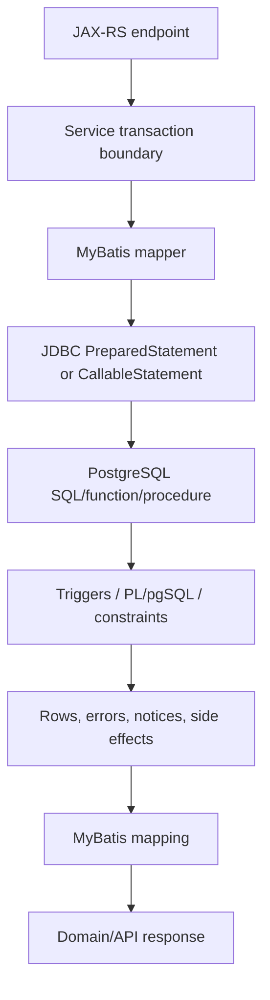
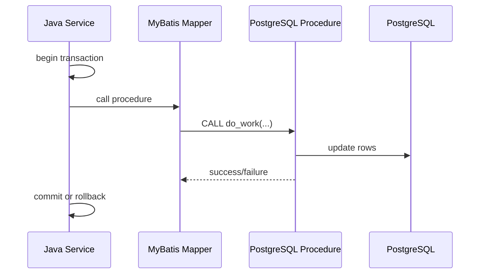
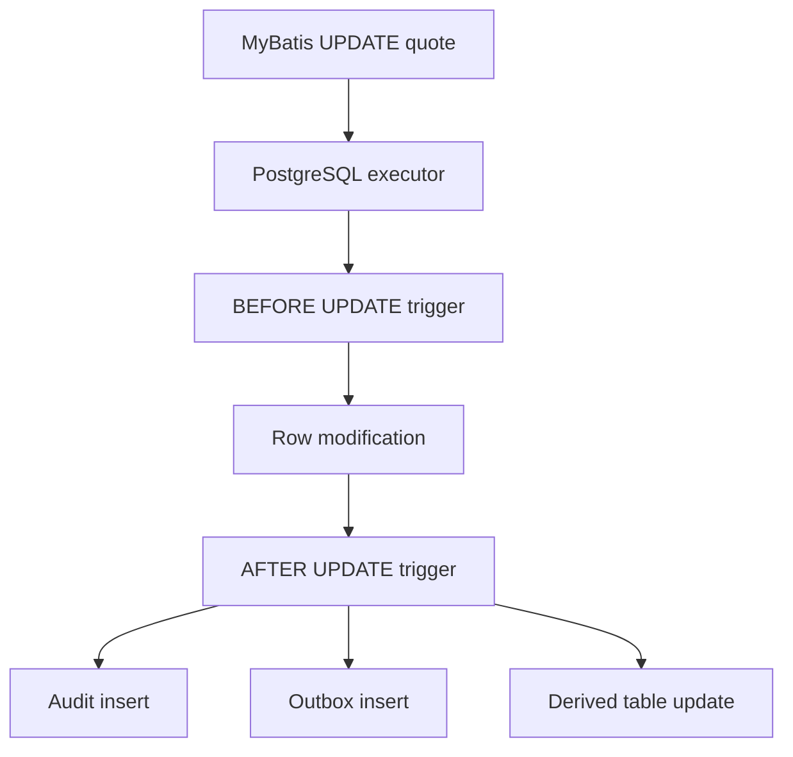
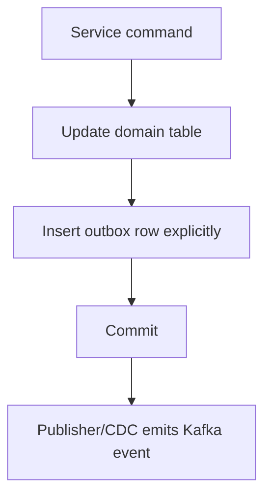
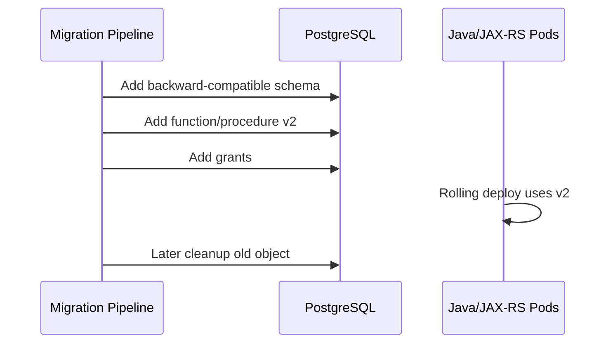

# Part 027 — MyBatis with PostgreSQL Functions, Procedures, Triggers, and PL/pgSQL

> Goal: understand how MyBatis interacts with PostgreSQL database-side logic without losing transaction clarity, testability, migration safety, observability, or business-rule ownership.

This part focuses on calling functions from MyBatis, calling procedures from MyBatis, mapping return tables, mapping refcursor if relevant, using callable statements, input/output parameters, error handling, function/procedure versioning, transaction boundary, trigger side effect awareness, testing database-side logic, migration ordering, observability gaps, and internal verification checklist.

---

## 1. Executive mental model

MyBatis can call PostgreSQL functions and procedures, but that does not mean every rule belongs in the database.

Database-side logic should be treated as production code with a different runtime:



The critical senior-engineer invariant:

> Database-side logic must not become invisible business logic.

A function, procedure, or trigger must have:

- Clear ownership.
- Clear transaction semantics.
- Clear migration/versioning path.
- Clear test coverage.
- Clear observability strategy.
- Clear failure mapping to the Java service.
- Clear rule for when the logic should instead live in application code.

---

## 2. Function vs procedure vs trigger from the MyBatis perspective

From a MyBatis mapper, database-side logic usually appears in one of four forms:

| Database construct | Mapper shape | Typical use | Main risk |
|---|---|---|---|
| SQL function returning scalar | `SELECT function(...)` | Calculation, lookup, normalization, generated value | Hidden cost, wrong volatility, hard-to-test rule |
| SQL/PLpgSQL function returning table | `SELECT * FROM function(...)` | Read model, encapsulated query, search helper | Poor plan visibility, mapping fragility |
| Procedure | `{ call procedure(...) }` or `CALL procedure(...)` | Operational batch, maintenance, controlled database routine | Transaction ambiguity, output mapping complexity |
| Trigger | No direct mapper call; fires as side effect | Audit, derived data, validation, outbox automation | Hidden side effect, surprise writes, debugging gap |

MyBatis does not make these safer by default. It only provides a bridge.

The safety comes from design discipline.

---

## 3. When database-side logic is reasonable

Database-side logic can be appropriate when the rule is fundamentally close to the data.

Good candidates:

- Data integrity rule that must hold regardless of application path.
- Audit row generation that must occur on every write path.
- Lightweight derived value that must remain consistent with stored rows.
- Search normalization helper.
- Read-model helper used by multiple SQL consumers.
- Operational batch routine with strong database locality.
- Migration helper used once or during a controlled rollout.
- Constraint-like rule that cannot be expressed as a simple declarative constraint.

Weak candidates:

- Complex business workflow.
- Customer-facing state transition policy.
- Rule that must be explained in API/domain layer.
- Rule requiring external service calls.
- Rule requiring feature flags owned by application layer.
- Logic requiring rich application telemetry.
- Logic whose lifecycle must follow Java release train.

Rule of thumb:

> Put invariants close to the database. Put business decisions close to the application/service boundary.

---

## 4. Calling a scalar function from MyBatis

A scalar function can be called through a normal `SELECT`.

Example PostgreSQL function:

```sql
CREATE OR REPLACE FUNCTION normalize_quote_number(raw_value text)
RETURNS text
LANGUAGE sql
IMMUTABLE
AS $$
  SELECT upper(regexp_replace(trim(raw_value), '\s+', '', 'g'))
$$;
```

Example MyBatis mapper XML:

```xml
<select id="normalizeQuoteNumber" parameterType="string" resultType="string">
  SELECT normalize_quote_number(#{rawValue})
</select>
```

This is simple, but review must still ask:

- Is the function deterministic?
- Is the volatility label correct?
- Does it depend on locale, timezone, current user, or database setting?
- Can it throw errors for valid application inputs?
- Does it perform hidden table reads?
- Does it run per row inside a large query?
- Is it covered by database tests?

Do not hide expensive work behind a harmless-looking function name.

---

## 5. Function volatility matters to query planning

PostgreSQL function volatility is a promise to the optimizer.

Common categories:

- `IMMUTABLE`: same inputs always produce same output.
- `STABLE`: same result within a single statement, but can change between statements.
- `VOLATILE`: can change at any time; default if not specified.

This affects index usage, expression indexes, query optimization, and whether the planner can reuse results.

Examples:

```sql
-- Potentially safe as IMMUTABLE if it truly depends only on input.
CREATE FUNCTION normalize_code(value text)
RETURNS text
LANGUAGE sql
IMMUTABLE
AS $$ SELECT upper(trim(value)) $$;
```

```sql
-- Must not be IMMUTABLE because result depends on current time.
CREATE FUNCTION is_expired(expiry timestamptz)
RETURNS boolean
LANGUAGE sql
STABLE
AS $$ SELECT expiry < now() $$;
```

Danger:

```sql
CREATE FUNCTION lookup_current_tax_rate(region text)
RETURNS numeric
LANGUAGE sql
IMMUTABLE -- wrong if it reads a table or configuration
AS $$
  SELECT rate FROM tax_rate WHERE tax_rate.region = lookup_current_tax_rate.region
$$;
```

A wrong volatility declaration can create incorrect results or misleading plans.

Internal rule:

> Every function used in an index, predicate, generated column, or frequently executed query needs explicit volatility review.

---

## 6. Mapping a function returning a table

PostgreSQL functions can return table-shaped results.

Example:

```sql
CREATE OR REPLACE FUNCTION find_quote_candidates(
  p_account_id uuid,
  p_status text,
  p_limit int
)
RETURNS TABLE (
  quote_id uuid,
  quote_number text,
  quote_status text,
  created_at timestamptz
)
LANGUAGE sql
STABLE
AS $$
  SELECT
    q.id AS quote_id,
    q.quote_number,
    q.status AS quote_status,
    q.created_at
  FROM quote q
  WHERE q.account_id = p_account_id
    AND (p_status IS NULL OR q.status = p_status)
  ORDER BY q.created_at DESC, q.id DESC
  LIMIT p_limit
$$;
```

MyBatis mapping:

```xml
<resultMap id="QuoteCandidateResultMap" type="com.example.quote.QuoteCandidate">
  <id property="quoteId" column="quote_id" />
  <result property="quoteNumber" column="quote_number" />
  <result property="status" column="quote_status" />
  <result property="createdAt" column="created_at" />
</resultMap>

<select id="findQuoteCandidates" resultMap="QuoteCandidateResultMap">
  SELECT *
  FROM find_quote_candidates(
    #{accountId, jdbcType=OTHER},
    #{status, jdbcType=VARCHAR},
    #{limit, jdbcType=INTEGER}
  )
</select>
```

This pattern is acceptable when the function is a stable database read contract.

But review must ask:

- Why is this not just a mapper SQL query?
- Is the function shared by multiple clients?
- Does it hide dynamic filtering that belongs in the mapper?
- Can `EXPLAIN` still show useful internals?
- Is the return table versioned safely?
- What happens if a returned column is renamed?
- Are consuming mappers covered by integration tests?

---

## 7. Avoid using functions to bypass mapper review

A database function can make a bad query look clean in Java.

Bad mapper:

```xml
<select id="searchQuotes" resultMap="QuoteSearchResultMap">
  SELECT * FROM search_quotes_everything(#{keyword}, #{accountId}, #{status}, #{limit}, #{offset})
</select>
```

This mapper looks simple, but hides:

- Join strategy.
- Optional predicates.
- Sort behavior.
- Pagination method.
- Index requirements.
- Data visibility policy.
- Security assumptions.
- Error conditions.

A mapper is not automatically clean because it contains only one line.

The SQL still exists. It just moved somewhere harder to review.

---

## 8. Calling a procedure from MyBatis

PostgreSQL procedures are called with `CALL`.

A MyBatis mapper can call a procedure using a normal statement or a callable statement, depending on the desired parameter behavior and framework configuration.

Simple `CALL` shape:

```xml
<update id="rebuildQuoteReadModel">
  CALL rebuild_quote_read_model(#{quoteId, jdbcType=OTHER})
</update>
```

Callable statement shape:

```xml
<select id="runMaintenanceProcedure" statementType="CALLABLE">
  { call run_quote_maintenance(
      #{tenantId, mode=IN, jdbcType=OTHER},
      #{processedCount, mode=OUT, jdbcType=INTEGER}
    ) }
</select>
```

Use `CALLABLE` only when the procedure contract needs it.

For simple procedure invocation, plain `CALL` is often easier to reason about.

Review questions:

- Does the procedure commit or rollback internally?
- Is it allowed to run inside the application transaction?
- Does the Java transaction manager know what happened?
- Are OUT/INOUT parameters mapped correctly?
- Can the procedure run long enough to exceed HTTP timeout?
- Is this an online request path or an operational/batch path?
- How is failure surfaced to the service layer?

---

## 9. Procedure transaction boundary trap

Procedures can create confusion because they may be associated with transaction control capabilities in PostgreSQL.

In enterprise Java systems, application code often expects one service method to own the transaction boundary.



If a procedure has internal transaction control or is intended to run outside a transaction block, mixing it with framework-managed Java transactions can become unsafe or invalid.

Practical rule:

> Application request transactions should normally call database routines that participate in the caller transaction, not routines that independently decide commit/rollback.

If a procedure is operational and controls its own transaction lifecycle, it should usually run as a separate administrative job, migration, or controlled batch process—not inside a normal JAX-RS request path.

---

## 10. OUT and INOUT parameter discipline

Stored procedure/function parameter mapping needs explicit contracts.

Bad contract:

```xml
<select id="submitQuote" statementType="CALLABLE">
  { call submit_quote(#{quoteId}, #{result}) }
</select>
```

This hides direction, type, and expected values.

Better:

```xml
<select id="submitQuote" statementType="CALLABLE">
  { call submit_quote(
      #{quoteId, mode=IN, jdbcType=OTHER},
      #{resultCode, mode=OUT, jdbcType=VARCHAR},
      #{resultMessage, mode=OUT, jdbcType=VARCHAR}
    ) }
</select>
```

But even this should be questioned.

If the routine performs a domain operation like submitting a quote, ask why the state transition is not expressed in the Java service layer with explicit SQL writes and an outbox event.

A procedure output code can become a second hidden API contract.

---

## 11. Refcursor mapping if relevant

Some database designs return cursors from functions/procedures.

This pattern can appear in legacy or Oracle-influenced systems.

Conceptually:

```sql
CREATE OR REPLACE FUNCTION open_quote_cursor(p_account_id uuid)
RETURNS refcursor
LANGUAGE plpgsql
AS $$
DECLARE
  c refcursor;
BEGIN
  OPEN c FOR
    SELECT id, quote_number, status
    FROM quote
    WHERE account_id = p_account_id;
  RETURN c;
END;
$$;
```

Use with caution in Java/MyBatis systems.

Risks:

- Cursor lifecycle tied to transaction/session.
- PgBouncer transaction pooling may break assumptions.
- Resource cleanup becomes harder.
- Mapper behavior is less transparent.
- Streaming semantics need careful timeout handling.

Prefer normal `SELECT` or set-returning functions unless there is a strong reason.

Internal verification checklist should confirm whether refcursor is used at all.

---

## 12. Trigger side effect awareness

Triggers are not called directly from MyBatis.

They fire because a mapper executes `INSERT`, `UPDATE`, or `DELETE`.

Example mapper:

```xml
<update id="updateQuoteStatus">
  UPDATE quote
  SET status = #{status}, updated_at = now()
  WHERE id = #{quoteId}
</update>
```

This mapper may appear to update one table.

But triggers may also:

- Insert audit history.
- Update derived summary rows.
- Insert outbox events.
- Reject the write with an exception.
- Modify `NEW` row values.
- Cascade changes to other tables.
- Call functions that read or write more data.

Actual runtime shape:



Senior review question:

> Does the mapper name describe only the SQL text, or the full database effect?

If the full effect includes triggers, tests and observability must cover triggers too.

---

## 13. Trigger-generated outbox: useful but dangerous

A trigger-generated outbox can guarantee that event rows are inserted whenever base table changes occur.

Example idea:

```sql
CREATE OR REPLACE FUNCTION quote_status_outbox_trigger()
RETURNS trigger
LANGUAGE plpgsql
AS $$
BEGIN
  IF NEW.status IS DISTINCT FROM OLD.status THEN
    INSERT INTO outbox_event(entity_type, entity_id, event_type, payload, created_at)
    VALUES ('QUOTE', NEW.id, 'QUOTE_STATUS_CHANGED', jsonb_build_object(
      'quoteId', NEW.id,
      'oldStatus', OLD.status,
      'newStatus', NEW.status
    ), now());
  END IF;

  RETURN NEW;
END;
$$;
```

This may be useful for consistency.

But it creates risks:

- Event schema hidden in PL/pgSQL.
- Event emission may occur for maintenance updates unexpectedly.
- Java service may not know which event was emitted.
- Replays/backfills may generate unwanted events.
- Schema evolution must coordinate trigger, outbox table, Kafka schema, and consumer contract.
- Debugging requires database-level visibility.

Safer alternative in many application flows:



A trigger outbox is not wrong. It is just a high-governance pattern.

---

## 14. Error handling from function/procedure/trigger

Database routines can fail through:

- Constraint violation.
- `RAISE EXCEPTION`.
- Null handling bug.
- Cast/type error.
- Lock timeout.
- Statement timeout.
- Deadlock.
- Serialization failure.
- Missing privilege.
- Search path issue.
- Function/procedure not found after migration mismatch.

Java/MyBatis will usually see a `SQLException` or framework-wrapped exception.

Do not parse human-readable messages as the main contract.

Prefer:

- SQLSTATE class/code mapping.
- Constraint name mapping.
- Controlled application-side validation before database call.
- Domain-specific error mapping at service layer.
- Database exceptions reserved for invariant violations.

Example service-side shape:

```java
try {
    mapper.applyQuoteTransition(command.quoteId(), command.targetStatus());
} catch (PersistenceException ex) {
    DatabaseError dbError = databaseErrorClassifier.classify(ex);
    if (dbError.isUniqueViolation("uq_quote_transition")) {
        throw new ConflictException("Duplicate quote transition");
    }
    if (dbError.isCheckViolation("ck_quote_status")) {
        throw new BadRequestException("Invalid quote status");
    }
    throw ex;
}
```

But if a trigger raises arbitrary messages, mapping becomes fragile.

---

## 15. Versioning database-side logic

Database code has a lifecycle just like Java code.

Versioning questions:

- Is the function changed using `CREATE OR REPLACE FUNCTION`?
- Is the procedure signature changed?
- Are old application versions still calling the old signature?
- Does the return shape change?
- Does a trigger function change event payload shape?
- Is the object deployed before or after Java code?
- Is rollback possible?
- Are grants preserved?
- Are dependent views/indexes affected?

Signature changes are especially dangerous.

Bad rollout:

```sql
-- Old Java still calls calculate_price(quote_id uuid)
DROP FUNCTION calculate_price(uuid);
CREATE FUNCTION calculate_price(quote_id uuid, tenant_id uuid) RETURNS numeric ...;
```

During rolling deployment, old pods fail.

Safer rollout:

```sql
-- Add new function while old function remains.
CREATE FUNCTION calculate_price_v2(quote_id uuid, tenant_id uuid) RETURNS numeric ...;

-- Deploy Java using v2.

-- Later remove old function after all callers are gone.
DROP FUNCTION calculate_price(uuid);
```

Database object compatibility matters in rolling deployments.

---

## 16. Migration ordering for functions, procedures, and triggers

Database-side logic must be migrated in dependency order.

Common order:

1. Create/alter tables and columns needed by the function.
2. Create helper types/domains if needed.
3. Create or replace functions.
4. Create or replace procedures.
5. Create triggers that depend on trigger functions.
6. Apply grants.
7. Deploy application code that calls the new object.
8. Remove old objects only after old application versions are gone.

Mermaid rollout view:



Do not deploy a mapper that calls a function before the function exists in all target environments.

Do not drop a function while older pods may still call it.

---

## 17. Search path and security risk

Database routines can be affected by `search_path`.

This becomes security-sensitive with `SECURITY DEFINER` functions.

Unsafe pattern:

```sql
CREATE FUNCTION privileged_action(...)
RETURNS void
LANGUAGE plpgsql
SECURITY DEFINER
AS $$
BEGIN
  INSERT INTO audit_log(...) VALUES (...);
END;
$$;
```

If object references are unqualified and `search_path` is unsafe, an attacker or misconfigured role could potentially affect resolution of referenced objects.

Safer discipline:

- Schema-qualify referenced objects where appropriate.
- Set a safe `search_path` for security-definer routines.
- Avoid dynamic SQL unless necessary.
- Quote identifiers carefully when dynamic SQL is unavoidable.
- Grant execute only to intended roles.
- Review owner role privileges.

For MyBatis callers, the risk appears as “mapper calls a harmless function,” but the privilege model may be much broader.

---

## 18. Testing database-side logic

Database-side logic needs tests at the database boundary.

Test levels:

| Test type | What it proves |
|---|---|
| Function unit-style SQL test | Given inputs, routine returns expected output |
| Trigger behavior test | Insert/update/delete causes expected side effects |
| Mapper integration test | MyBatis call maps inputs/outputs correctly |
| Transaction test | Routine participates in rollback/commit as expected |
| Migration test | Fresh database and upgraded database both contain correct objects |
| Regression test | Signature, return shape, grants, and trigger behavior do not break |

Example integration test intent:

```java
@Test
void updateQuoteStatus_rollsBackTriggerAuditWhenTransactionFails() {
    transactionTemplate.executeWithoutResult(status -> {
        mapper.updateQuoteStatus(quoteId, "SUBMITTED");
        mapper.insertInvalidRowToForceFailure();
        status.setRollbackOnly();
    });

    assertThat(auditMapper.findByQuoteId(quoteId)).isEmpty();
}
```

The important question is not only “did the trigger fire?”

The important question is “did the trigger side effect obey the same transaction boundary?”

---

## 19. Observability gap

Application telemetry usually sees mapper method timing.

It may not see detailed function/procedure/trigger internals.

Example application trace:

```text
POST /quotes/123/submit
  QuoteService.submitQuote: 850ms
    QuoteMapper.submitQuoteProcedure: 820ms
```

This trace does not reveal:

- Which SQL statements the procedure ran.
- Which trigger fired.
- Which table was locked.
- Which row waited.
- Whether temp files were created.
- Whether a nested query caused the delay.

Bridging the gap requires database observability:

- `pg_stat_statements` for query fingerprints.
- `pg_stat_activity` for active sessions and waits.
- `pg_locks` for blocking.
- PostgreSQL logs for slow statements/errors.
- Application correlation IDs set as session/application name if supported.
- Explicit logging around operational procedure calls.
- Metrics around routine duration and failure rate.

If a database routine is critical, it deserves first-class observability.

---

## 20. Application name and correlation discipline

For debugging, the database should help identify which service/pod/action created a session.

Useful practices:

- Set JDBC `ApplicationName` or equivalent driver property.
- Include service name and environment.
- Avoid high-cardinality values in the application name.
- Put request correlation IDs in application logs, not necessarily database session names.
- For operational jobs, include job name.

Example conceptual JDBC URL:

```text
jdbc:postgresql://db.example:5432/appdb?ApplicationName=quote-order-service
```

Then database views can show clearer context:

```sql
SELECT application_name, state, wait_event_type, wait_event, query
FROM pg_stat_activity
WHERE datname = current_database();
```

This matters when a procedure or trigger causes blocking but the app trace only says “mapper timeout.”

---

## 21. MyBatis mapper design for database routines

Mapper methods that call database routines should be named honestly.

Weak naming:

```java
void updateQuote(QuoteUpdateRequest request);
```

Better naming:

```java
void callRepriceQuoteProcedure(UUID quoteId);
List<QuoteCandidate> findQuoteCandidatesViaFunction(QuoteCandidateQuery query);
void applyQuoteStatusUpdateThatFiresAuditTrigger(QuoteStatusUpdate update);
```

You do not need absurdly long method names, but the code should make unusual database behavior visible.

A mapper that calls a procedure should not look like a normal row update.

---

## 22. Avoid mixing database-side state machine with Java state machine

A dangerous pattern in order/quote systems is splitting state transition logic between Java and PL/pgSQL.

Example anti-pattern:

- Java validates `DRAFT -> SUBMITTED`.
- PL/pgSQL validates `SUBMITTED -> APPROVED`.
- Trigger auto-reverts status under certain conditions.
- Another mapper directly updates status for batch correction.

This creates inconsistent lifecycle ownership.

Better:

- Define one authoritative state transition boundary.
- Use database constraints for impossible states.
- Use database triggers only for mechanical side effects, if needed.
- Keep business transition policy in one visible place.
- Test every transition path.

For CPQ/order management, state correctness is business correctness.

Hidden transition logic is a production risk.

---

## 23. Database-side logic and event-driven architecture

Functions, procedures, and triggers often touch event consistency.

Common cases:

- Procedure updates aggregate and inserts outbox event.
- Trigger inserts outbox event on row change.
- Function builds JSONB payload for event.
- Backfill procedure emits repair events.
- CDC reads changes produced by trigger or procedure.

Questions to ask:

- Does the outbox event live in the same transaction as the data change?
- Does the event payload come from Java or database code?
- Who owns event schema evolution?
- Can a replay/backfill accidentally emit duplicate events?
- Can maintenance updates suppress event generation if needed?
- Does CDC see the intended rows?
- Is event ordering deterministic enough?

Do not treat database-side events as “free.”

They become part of the integration contract.

---

## 24. Failure modes

| Failure mode | Typical cause | Detection | Prevention |
|---|---|---|---|
| Function not found | Migration not applied, wrong schema/search_path, signature changed | MyBatis exception, database logs | Backward-compatible rollout, schema-qualified calls |
| Procedure commits unexpectedly | Procedure transaction control conflicts with Java transaction model | Inconsistent rollback behavior | Keep request-path routines transaction-participating |
| Trigger hidden write | Mapper update fires trigger writing other tables | Unexpected rows/events | Trigger inventory, tests, mapper docs |
| Wrong output mapping | OUT parameter/result columns not mapped correctly | Nulls/wrong Java values | Explicit result maps and integration tests |
| Event duplication | Trigger/outbox fires during backfill | Duplicate Kafka events | Maintenance mode policy, idempotent consumers |
| Security escalation | SECURITY DEFINER/search_path/grants issue | Audit/security review | Least privilege, safe search_path, grants review |
| Slow routine | Hidden SQL, bad plan, row-by-row loop | Slow query logs, pg_stat_statements | EXPLAIN routine internals, avoid loops |
| Broken rolling deploy | Old pods call removed signature | Runtime errors after deploy | Expand-contract object versioning |
| Observability blind spot | Procedure/trigger internals not traced | Generic mapper timeout | DB metrics/logs + app correlation |

---

## 25. Debugging workflow

When a mapper call to database-side logic fails:

1. Identify whether the mapper executes normal SQL, function, procedure, or write that fires triggers.
2. Find the exact SQL sent by MyBatis.
3. Confirm current database search path and target schema.
4. Check function/procedure signature.
5. Check migration history in the target environment.
6. Check grants/permissions.
7. Reproduce with the same role if possible.
8. Check `pg_stat_activity` while running.
9. Check `pg_locks` if waiting.
10. Check PostgreSQL logs for raised exceptions.
11. Check trigger list on modified tables.
12. Check generated side-effect rows.
13. Check Java transaction rollback behavior.
14. Classify SQLSTATE/constraint error.
15. Add regression test for the failure.

Useful inspection queries:

```sql
-- Find functions by name.
SELECT n.nspname AS schema_name,
       p.proname AS function_name,
       pg_get_function_identity_arguments(p.oid) AS args,
       pg_get_function_result(p.oid) AS result_type
FROM pg_proc p
JOIN pg_namespace n ON n.oid = p.pronamespace
WHERE p.proname ILIKE '%quote%'
ORDER BY n.nspname, p.proname;
```

```sql
-- Find triggers on a table.
SELECT trigger_name,
       event_manipulation,
       action_timing,
       action_statement
FROM information_schema.triggers
WHERE event_object_table = 'quote'
ORDER BY trigger_name;
```

```sql
-- Active routine-related sessions.
SELECT pid, application_name, state, wait_event_type, wait_event, query
FROM pg_stat_activity
WHERE query ILIKE '%quote%'
ORDER BY query_start;
```

---

## 26. PR review checklist

When reviewing a MyBatis mapper that calls database-side logic, ask:

### Mapper contract

- Does the mapper clearly show it calls a function/procedure?
- Are parameters bound safely with correct JDBC types?
- Are OUT/INOUT parameters explicit?
- Are result maps explicit and covered by tests?
- Is the method name honest about side effects?

### Transaction correctness

- Does the routine participate in the service transaction?
- Can Java rollback undo all database-side effects?
- Does the routine do internal commit/rollback?
- Is retry behavior safe?
- Are locks and timeouts understood?

### Migration safety

- Is the database object created before application code calls it?
- Is rolling deploy compatibility preserved?
- Are old signatures kept during transition?
- Are grants included?
- Are trigger dependencies ordered correctly?

### Performance

- Does the function hide a complex query?
- Has the routine been explained or benchmarked?
- Does it loop row-by-row where set-based SQL is better?
- Does it run in an HTTP request path?
- Are statement timeouts appropriate?

### Observability

- Can slow routine execution be diagnosed?
- Are database logs/metrics sufficient?
- Is application name/correlation available?
- Are raised errors classifiable?

### Ownership

- Who owns the routine?
- Is it DBA-owned, backend-owned, or platform-owned?
- Is the business rule visible to reviewers?
- Is there a policy for database-side logic?

---

## 27. Internal verification checklist

Verify these in the real CSG/team environment before applying assumptions:

### Codebase and mapper usage

- Which MyBatis mappers call PostgreSQL functions?
- Which MyBatis mappers call PostgreSQL procedures?
- Which mapper statements use `statementType="CALLABLE"`?
- Are routines called through XML mapper, annotations, or direct JDBC?
- Are `jdbcType`, `mode=IN/OUT/INOUT`, and result maps explicit?

### Database objects

- List functions in application schemas.
- List procedures in application schemas.
- List triggers on quote/order/catalog/outbox/audit tables.
- Check trigger functions and their side effects.
- Check use of `SECURITY DEFINER`.
- Check function volatility categories.
- Check grants on functions/procedures.

### Migration repository

- How are functions/procedures/triggers versioned?
- Is `CREATE OR REPLACE FUNCTION` used safely?
- Are signature changes backward-compatible?
- Are grants included in migration scripts?
- Are triggers created after trigger functions?
- Are old routines removed only after caller migration?

### Transaction and runtime

- Are procedure calls made inside Java-managed transactions?
- Do any procedures perform internal transaction control?
- Are trigger side effects rolled back with the parent write?
- Are routines used in HTTP request paths or batch jobs?
- Are timeout settings appropriate?

### Observability and operations

- Can slow functions/procedures be seen in `pg_stat_statements`?
- Are errors from routines visible in logs?
- Are routine failures mapped to domain/API errors?
- Are there dashboards for lock wait/statement timeout/deadlock?
- Are historical incidents related to functions/procedures/triggers documented?

### Team policy

- Is there a team rule for when logic may live in PostgreSQL?
- Does DBA/SRE review database-side logic?
- Are event/outbox triggers allowed?
- Are operational procedures allowed in production?
- Is there a testing standard for PL/pgSQL and triggers?

---

## 28. Practical decision matrix

| Situation | Prefer |
|---|---|
| Simple query used by one service | MyBatis SQL mapper |
| Complex read query shared by multiple SQL consumers | View or carefully versioned function |
| Mandatory invariant independent of application path | Constraint first, trigger/function only if constraint insufficient |
| Audit row for every table change | Trigger may be acceptable with tests and visibility |
| Domain state transition | Java service layer plus explicit SQL/outbox |
| Operational database maintenance routine | Procedure or controlled job, outside normal request path |
| One-time migration helper | Function/procedure in migration, removed after use if possible |
| Event emission tied to data change | Explicit outbox usually clearer; trigger outbox requires strong governance |
| External service integration | Application code, not database routine |
| Highly observable production workflow | Application service/workflow engine, not hidden PL/pgSQL |

---

## 29. Senior-engineer heuristics

Use these heuristics during design review:

- A database routine is production code, not just SQL decoration.
- A trigger is a hidden subscriber to table writes.
- A function in a predicate can be a performance trap.
- A function used in an index must be volatility-correct.
- A procedure in a request path must not surprise the transaction manager.
- A mapper calling a procedure should be visibly different from a normal CRUD mapper.
- A database object signature is an API contract.
- A trigger-generated event is an integration contract.
- A routine without tests is a production liability.
- A routine without observability is hard to debug under pressure.

---

## 30. Key takeaways

- MyBatis can call PostgreSQL functions and procedures, but it does not solve ownership, transaction, migration, or observability problems.
- Database-side logic is appropriate for data-local invariants, audit, operational routines, and carefully governed read contracts.
- Complex business workflow should usually remain visible in the Java service/application layer.
- Triggers create side effects that mappers do not show directly; they require inventory, tests, and debugging visibility.
- Function/procedure signatures must be treated as compatibility contracts during rolling deployment.
- The safest database-side logic is boring, explicit, tested, observable, and deliberately versioned.

---

## References for further study

- PostgreSQL documentation: `CREATE FUNCTION`
- PostgreSQL documentation: function volatility categories
- PostgreSQL documentation: `CREATE PROCEDURE` and PL/pgSQL transaction management
- PostgreSQL documentation: `CREATE TRIGGER` and trigger functions
- MyBatis documentation: Mapper XML files and `statementType="CALLABLE"`
- MyBatis documentation: Java API and `SqlSession`
