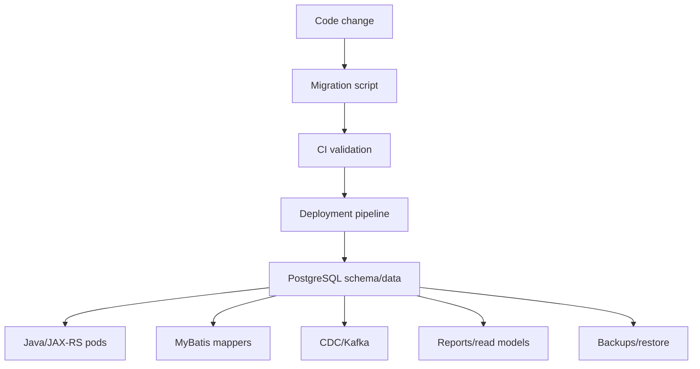
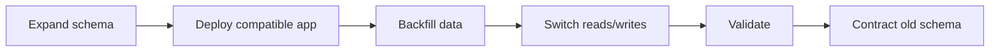
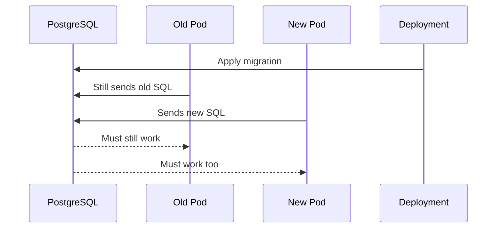
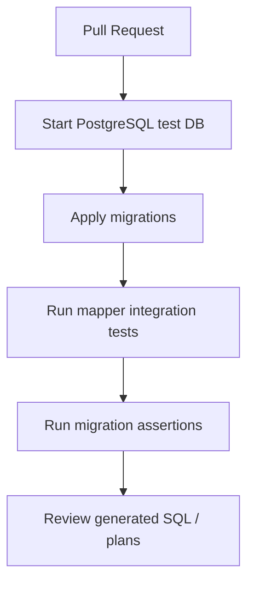

# Part 028 — Database Migration Fundamentals

> Goal: understand database migration as controlled production change management, not as a folder of SQL scripts.

This part focuses on schema migration, data migration, versioned migration, repeatable migration, baseline, checksum, migration ordering, migration idempotency, rollback, roll-forward, expand-contract migration, backward-compatible migration, breaking migration, zero-downtime deployment, migration in CI/CD, migration in GitOps, and migration review checklist.

---

## 1. Executive mental model

A database migration changes the shape, meaning, or content of the system of record.

Application deployment can usually be rolled back by replacing pods.

Database migration is different:

- It mutates persistent state.
- It may lock tables.
- It may rewrite large data.
- It may break old application versions.
- It may affect replicas, CDC, reports, and backups.
- It may be hard or impossible to reverse without data loss.

Senior-engineer invariant:

> A database migration must be compatible with production traffic, rolling deployment, operational recovery, and future schema evolution.

Migration is not only a SQL concern. It is an architecture concern.



---

## 2. Migration changes more than schema

A migration can affect:

- Tables.
- Columns.
- Constraints.
- Indexes.
- Views.
- Materialized views.
- Functions.
- Procedures.
- Triggers.
- Grants.
- Row-level security policies.
- Reference data.
- Existing business data.
- Outbox/inbox/event tables.
- Reporting/read models.
- Java DTOs and persistence models.
- MyBatis mapper SQL and result maps.
- CDC payload shape.
- Backup/restore expectations.

That means migration review must include more than “does the SQL run locally?”

---

## 3. Schema migration vs data migration

### Schema migration

Changes database structure.

Examples:

```sql
ALTER TABLE quote ADD COLUMN submitted_at timestamptz;
CREATE INDEX idx_quote_account_status ON quote(account_id, status);
ALTER TABLE quote ADD CONSTRAINT ck_quote_status CHECK (status IN ('DRAFT', 'SUBMITTED', 'APPROVED'));
```

### Data migration

Changes existing rows.

Examples:

```sql
UPDATE quote
SET submitted_at = updated_at
WHERE status = 'SUBMITTED'
  AND submitted_at IS NULL;
```

Schema migration and data migration often need different risk controls.

| Migration type | Primary risk |
|---|---|
| Add nullable column | Usually low risk, but application compatibility still matters |
| Add NOT NULL column | Can require backfill and validation sequence |
| Add index | Can consume IO/CPU and lock depending on method |
| Add constraint | Can scan table and fail on old data |
| Drop column | Breaks old pods, mappers, views, reports, CDC consumers |
| Rename column | Usually breaking unless compatibility layer exists |
| Backfill large table | Locks, WAL growth, replication lag, long runtime |
| Rewrite table | High blast radius |

---

## 4. Versioned migration

A versioned migration is applied once in a defined order.

Example naming concepts:

```text
V001__create_quote_table.sql
V002__add_quote_status_index.sql
V003__add_quote_submitted_at.sql
```

Versioned migrations are good for:

- Creating tables.
- Adding columns.
- Adding constraints.
- Adding indexes.
- Adding stable reference data.
- One-way schema evolution.

Invariants:

- Version identifiers must be unique.
- Already-applied migrations should not be edited casually.
- Migration history must be reproducible.
- Local, CI, staging, and production must converge to the same schema.

If a migration was already applied in shared environments, treat it as immutable unless the team has a specific repair policy.

---

## 5. Repeatable migration

A repeatable migration is re-applied when its content changes.

Common use cases:

- Views.
- Materialized view definitions.
- Functions.
- Procedures.
- Trigger functions.
- Some grants/policies.

Example concept:

```text
R__quote_summary_view.sql
R__calculate_quote_price_function.sql
```

Repeatable migrations are useful for database objects whose source definition is replaced as a whole.

Risks:

- Re-applying object definitions can affect dependencies.
- Changes may not be backward-compatible with running application versions.
- Grants may be lost depending on object replacement method.
- Function signature changes may create new objects rather than replace old ones.
- Order among repeatable migrations matters when objects depend on each other.

Do not use repeatable migrations as a way to avoid version discipline.

---

## 6. Baseline

A baseline tells the migration tool where to start managing an existing database.

This is common when:

- A system already exists before migration tooling is introduced.
- A new environment is created from a production snapshot.
- A legacy schema is adopted by a new service.

Baseline risk:

- Tool history may not represent the real historical changes.
- Drift can exist between environments.
- Future migrations assume objects exist exactly as expected.

Baseline requires validation:

- Compare expected schema vs actual schema.
- Confirm object ownership and grants.
- Confirm extensions.
- Confirm reference data.
- Confirm migration history table state.

A baseline is not just a number. It is an agreement about reality.

---

## 7. Checksum

Migration tools commonly use checksums to detect whether a migration changed after it was recorded.

This protects against accidental mutation of historical migrations.

Why it matters:

- Production may already have run the old content.
- Editing the file locally does not change production state.
- CI/staging/prod may diverge.
- Debugging becomes difficult when history is not immutable.

If a checksum mismatch occurs, do not blindly “fix the checksum.”

Ask:

- Was the migration already applied anywhere shared?
- Was it edited after apply?
- Is the database state already different from the file?
- Should we create a new migration instead?
- Is there an approved repair process?

Senior rule:

> Prefer roll-forward migrations over rewriting applied history.

---

## 8. Migration ordering

Migration order is a compatibility contract.

For a typical Java/JAX-RS + MyBatis service, order may involve:

1. Add database objects in backward-compatible form.
2. Deploy application code that can use both old and new shape.
3. Backfill data if needed.
4. Switch reads/writes to new shape.
5. Validate constraints.
6. Remove old code paths.
7. Drop old database objects later.

Bad ordering example:

```text
1. Drop column old_status.
2. Deploy Java that no longer reads old_status.
```

During rolling deployment, old pods may still read `old_status`.

Safer ordering:

```text
1. Add new column status_v2 nullable.
2. Deploy code that writes both old_status and status_v2.
3. Backfill status_v2.
4. Deploy code that reads status_v2.
5. Validate status_v2 completeness.
6. Stop writing old_status.
7. Drop old_status in a later release.
```

---

## 9. Idempotency

Idempotency means a migration operation can be safely retried without producing incorrect state.

Be careful: not every migration should be written with `IF EXISTS` or `IF NOT EXISTS` everywhere.

Useful idempotency cases:

- Backfill job that can resume.
- Reference data upsert.
- Operational repair script.
- Repeatable object grant script.

Dangerous idempotency masking:

```sql
CREATE TABLE IF NOT EXISTS quote (...);
```

This may hide that the existing table has the wrong shape.

Better approach:

- Use migration tool history for versioned schema changes.
- Use preconditions/validation where appropriate.
- Use explicit checks for assumptions.
- Fail loudly when reality differs from expected state.

Idempotency should protect retry. It should not hide drift.

---

## 10. Rollback vs roll-forward

Rollback sounds comforting, but database rollback is complicated.

Types of rollback:

| Type | Meaning | Risk |
|---|---|---|
| Transaction rollback | Migration fails before commit | Usually safe if operation is transactional |
| Tool rollback script | Explicit reverse migration | May lose data or be incomplete |
| Application rollback | Revert Java code | May not match migrated schema |
| Restore from backup | Restore database to earlier time | Data loss/RPO impact |
| Roll-forward fix | New migration repairs issue | Often preferred in production |

Examples:

Adding a nullable column can be rolled back by dropping the column only if no data worth keeping exists.

Dropping a column cannot be fully rolled back unless data is restored.

Updating millions of rows cannot be simply rolled back after commit unless old values were preserved.

Senior rule:

> For production, design migrations with roll-forward recovery first. Use rollback only when the reverse path is proven safe.

---

## 11. Expand-contract migration

Expand-contract is the core pattern for zero-downtime schema evolution.

It splits a breaking change into safe phases.



Example: rename column `status` to `lifecycle_status`.

Do not rename directly in production if old pods still reference `status`.

Expand-contract version:

### Phase 1 — Expand

```sql
ALTER TABLE quote ADD COLUMN lifecycle_status text;
```

### Phase 2 — Dual write

Application writes both columns.

```sql
UPDATE quote
SET status = #{status},
    lifecycle_status = #{status}
WHERE id = #{quoteId};
```

### Phase 3 — Backfill

```sql
UPDATE quote
SET lifecycle_status = status
WHERE lifecycle_status IS NULL;
```

For large tables, this should be chunked, not one massive update.

### Phase 4 — Switch reads

Application reads `lifecycle_status`.

### Phase 5 — Validate

```sql
SELECT count(*)
FROM quote
WHERE lifecycle_status IS NULL;
```

### Phase 6 — Contract

```sql
ALTER TABLE quote DROP COLUMN status;
```

The contract phase should happen in a later release after old versions are gone.

---

## 12. Backward-compatible migration

A migration is backward-compatible when both old and new application versions can run safely against the migrated database.

Usually safe examples:

- Add nullable column.
- Add table not used by old code.
- Add index.
- Add function with new name/signature.
- Add trigger that does not break old write paths.
- Add constraint as `NOT VALID` where appropriate and validate later.

Potentially breaking examples:

- Drop column.
- Rename column.
- Change column type.
- Make nullable column NOT NULL without backfill.
- Change function signature used by old code.
- Remove enum value expected by old code.
- Add trigger that rejects writes old code still makes.
- Change view columns used by old code.

Compatibility must be judged against all live consumers, not just the service being changed.

Consumers may include:

- Old pods during rolling deployment.
- Batch jobs.
- Reporting jobs.
- CDC connectors.
- Data repair scripts.
- DBA/SRE operational scripts.
- Downstream services consuming events shaped by database rows.

---

## 13. Breaking migration

A breaking migration changes the database in a way that old code or other consumers cannot tolerate.

Breaking migrations are sometimes necessary, but they require controlled rollout.

Examples:

```sql
ALTER TABLE quote DROP COLUMN quote_number;
ALTER TABLE quote RENAME COLUMN status TO lifecycle_status;
ALTER TABLE quote ALTER COLUMN total_amount TYPE bigint;
DROP FUNCTION calculate_quote_total(uuid);
```

Before approving a breaking migration, require:

- Consumer inventory.
- Deployment order.
- Rollback/roll-forward plan.
- Backfill/reconciliation plan.
- Maintenance window if needed.
- Observability/alert plan.
- DBA/SRE/platform review if production impact is significant.

Breaking migrations should be explicit, not accidental.

---

## 14. PostgreSQL DDL and locking awareness

DDL can take locks.

Even fast DDL can block if another transaction holds a conflicting lock.

A simple migration can become an incident if it waits behind a long transaction and blocks new traffic.

Examples requiring caution:

- `ALTER TABLE` on hot tables.
- Adding constraints on large tables.
- Creating indexes without concurrent strategy.
- Dropping/rebuilding indexes.
- Changing column types.
- Setting `NOT NULL` after scanning table.
- Rewriting table storage.

Before large DDL:

- Understand lock level.
- Test on production-like data volume.
- Set `lock_timeout` where appropriate.
- Set `statement_timeout` deliberately.
- Run during low-traffic window if needed.
- Monitor `pg_locks` and `pg_stat_activity`.

Example guard:

```sql
SET lock_timeout = '5s';
SET statement_timeout = '10min';

ALTER TABLE quote ADD COLUMN submitted_at timestamptz;
```

Do not use timeouts blindly. Use them intentionally.

---

## 15. Index migration safety

Adding an index can improve reads but hurt writes and consume IO.

For large/hot tables, prefer concurrent index creation where appropriate:

```sql
CREATE INDEX CONCURRENTLY idx_quote_account_status
ON quote(account_id, status);
```

Trade-offs:

- Concurrent index creation reduces blocking of writes.
- It can take longer.
- It cannot run inside a normal transaction block in some contexts.
- It can fail and leave an invalid index that needs cleanup.
- Migration tooling may need special configuration to run it outside transaction.

Review questions:

- Is the index justified by query plans or production workload?
- Is it redundant with existing indexes?
- What is write overhead?
- Is concurrent creation required?
- Can the migration tool run it correctly?
- Is there a rollback/cleanup path if index creation fails?

---

## 16. Constraint migration safety

Constraints encode correctness.

But adding them to existing tables can fail if old data violates the rule.

Common pattern:

1. Add nullable column or unconstrained state.
2. Backfill valid data.
3. Add constraint in a safe way.
4. Validate.
5. Update application to rely on constraint.

Example using `NOT VALID` for certain table constraints:

```sql
ALTER TABLE quote
ADD CONSTRAINT ck_quote_status_valid
CHECK (status IN ('DRAFT', 'SUBMITTED', 'APPROVED', 'REJECTED'))
NOT VALID;

ALTER TABLE quote
VALIDATE CONSTRAINT ck_quote_status_valid;
```

This can help introduce constraints without immediately validating all historical rows at add time, depending on constraint type and PostgreSQL version behavior.

Review questions:

- Does old data satisfy the new rule?
- Is validation separated from creation?
- Does old application code still write values that violate the new rule?
- Is constraint name stable for error mapping?
- Are MyBatis/domain errors mapped correctly?

---

## 17. Adding NOT NULL safely

Directly adding a NOT NULL requirement can be dangerous on existing data.

Safe sequence:

1. Add column nullable.
2. Deploy code to populate it for new writes.
3. Backfill old rows.
4. Validate no nulls remain.
5. Add NOT NULL constraint.

Example:

```sql
ALTER TABLE quote ADD COLUMN submitted_by uuid;
```

Backfill:

```sql
UPDATE quote
SET submitted_by = created_by
WHERE status = 'SUBMITTED'
  AND submitted_by IS NULL;
```

Validate:

```sql
SELECT count(*)
FROM quote
WHERE status = 'SUBMITTED'
  AND submitted_by IS NULL;
```

Then enforce:

```sql
ALTER TABLE quote
ALTER COLUMN submitted_by SET NOT NULL;
```

For large tables, backfill must be chunked and operationally monitored.

---

## 18. Type changes are high risk

Changing a column type can rewrite data, break indexes, alter comparison semantics, or break Java type mapping.

Examples:

```sql
ALTER TABLE quote ALTER COLUMN total_amount TYPE numeric(19,4);
ALTER TABLE order_item ALTER COLUMN quantity TYPE bigint;
ALTER TABLE quote ALTER COLUMN metadata TYPE jsonb USING metadata::jsonb;
```

Review questions:

- Does conversion preserve all values?
- Is precision/scale correct?
- Are indexes rebuilt?
- Are MyBatis TypeHandlers affected?
- Are Java DTO fields affected?
- Are JSON serializers affected?
- Are reports and CDC consumers affected?
- Is rollback possible after conversion?

Treat type changes as data migrations, not simple schema edits.

---

## 19. Reference data migration

Reference data can be more dangerous than schema because it changes business behavior.

Examples:

- New quote status.
- New approval reason.
- New product category.
- New tenant configuration.
- New pricing rule type.
- New fulfillment status mapping.

Reference data migration review:

- Is the value backward-compatible with old code?
- Does Java enum need update first or after?
- Do MyBatis mappers handle unknown values?
- Does API expose the value?
- Do downstream services understand the value?
- Does reporting classify it correctly?
- Is there rollback if the value is used by production rows?

Adding an enum-like value is a distributed compatibility event.

---

## 20. Java/JAX-RS deployment compatibility

A migration must account for rolling deployment.

During rollout, multiple application versions may run at the same time.



If old and new pods cannot both run after migration, the deployment is not zero-downtime.

Common safe app strategies:

- Read old, write old + new.
- Read new with fallback to old.
- Use feature flags for read switch.
- Avoid dropping old columns in same release.
- Keep old function signatures until all callers are gone.
- Keep views backward-compatible during transition.

---

## 21. MyBatis mapper compatibility

MyBatis SQL is explicit, so schema changes affect mapper SQL directly.

Migration review must inspect:

- `SELECT` column lists.
- `ResultMap` column aliases.
- Dynamic SQL predicates.
- Insert/update column lists.
- Batch statements.
- Function/procedure calls.
- TypeHandlers.
- Enum mapping.
- Pagination queries.
- Reporting/read model queries.

Example breaking change:

```sql
ALTER TABLE quote RENAME COLUMN quote_number TO quote_code;
```

Mappers still selecting `quote_number` will fail.

Safer compatibility option:

- Add `quote_code`.
- Dual write.
- Backfill.
- Switch mapper reads.
- Remove `quote_number` later.

---

## 22. CDC and Kafka compatibility

Database migrations can change the data emitted by CDC.

Affected areas:

- Column addition/removal.
- Column type change.
- Table rename.
- Primary key change.
- Outbox table schema change.
- JSONB payload shape.
- Trigger-generated events.
- Publication/subscription configuration.

Review questions:

- Does Debezium or another CDC connector capture this table?
- Are downstream consumers schema-tolerant?
- Is Schema Registry involved?
- Is column removal delayed until consumers stop using it?
- Does backfill generate events unintentionally?
- Does replay produce duplicate events?

A database migration is often also an event contract migration.

---

## 23. Migration in CI/CD

CI should prove more than syntax validity.

Useful checks:

- Apply migrations to an empty database.
- Apply migrations to a previous-version database.
- Run application mapper integration tests after migration.
- Validate schema state.
- Validate rollback/roll-forward script if required.
- Check for forbidden patterns.
- Run selected `EXPLAIN` regression tests for critical queries.
- Validate generated SQL if using changelog abstractions.
- Verify no checksum drift.

CI cannot prove production safety alone, but it catches preventable mistakes.

Minimum expectation:



---

## 24. Migration in GitOps

In GitOps environments, database migration creates a coordination problem.

Questions:

- Is migration run before application deployment?
- Is migration a Kubernetes Job?
- Is it run by CI/CD before GitOps sync?
- Is it embedded in application startup?
- What prevents multiple pods from running the same migration concurrently?
- What happens if migration succeeds but app deploy fails?
- What happens if app deploy succeeds but migration fails?
- Is the migration job observable?
- Who can approve production migration?

Avoid relying on every pod running migrations at startup unless the team has deliberately designed for it.

Production migrations should have clear ownership and execution semantics.

---

## 25. Environment drift

Drift means database state differs from expected migration history.

Causes:

- Manual hotfix in production.
- Migration edited after apply.
- Failed partial deployment.
- Different baselines.
- Direct DBA changes not captured in repo.
- Extension version differences.
- Grants changed manually.
- Object created by emergency script.

Drift symptoms:

- Migration succeeds locally but fails in staging/prod.
- Function exists with different signature.
- Constraint exists with different name.
- Index already exists but with different columns.
- Permissions work in one environment but fail in another.

Prevention:

- Treat migration repository as source of truth.
- Capture emergency fixes as follow-up migrations.
- Run drift detection if tooling supports it.
- Avoid manual changes without documentation.
- Compare schema snapshots when needed.

---

## 26. Migration runbook

For non-trivial migrations, create a runbook.

A good runbook includes:

- Purpose.
- Affected tables/objects.
- Expected runtime.
- Expected locks.
- Expected WAL/replication impact.
- Preconditions.
- Deployment order.
- Monitoring queries.
- Abort criteria.
- Roll-forward plan.
- Rollback/restore consideration.
- Validation queries.
- Communication channel.
- Owner and escalation path.

Example monitoring queries:

```sql
-- Check blocking around migration.
SELECT blocked.pid AS blocked_pid,
       blocked.query AS blocked_query,
       blocking.pid AS blocking_pid,
       blocking.query AS blocking_query
FROM pg_locks blocked_locks
JOIN pg_stat_activity blocked ON blocked.pid = blocked_locks.pid
JOIN pg_locks blocking_locks
  ON blocking_locks.locktype = blocked_locks.locktype
 AND blocking_locks.database IS NOT DISTINCT FROM blocked_locks.database
 AND blocking_locks.relation IS NOT DISTINCT FROM blocked_locks.relation
 AND blocking_locks.page IS NOT DISTINCT FROM blocked_locks.page
 AND blocking_locks.tuple IS NOT DISTINCT FROM blocked_locks.tuple
 AND blocking_locks.virtualxid IS NOT DISTINCT FROM blocked_locks.virtualxid
 AND blocking_locks.transactionid IS NOT DISTINCT FROM blocked_locks.transactionid
 AND blocking_locks.classid IS NOT DISTINCT FROM blocked_locks.classid
 AND blocking_locks.objid IS NOT DISTINCT FROM blocked_locks.objid
 AND blocking_locks.objsubid IS NOT DISTINCT FROM blocked_locks.objsubid
 AND blocking_locks.pid != blocked_locks.pid
JOIN pg_stat_activity blocking ON blocking.pid = blocking_locks.pid
WHERE NOT blocked_locks.granted
  AND blocking_locks.granted;
```

```sql
-- Check long-running transactions before migration.
SELECT pid, application_name, state, now() - xact_start AS xact_age, query
FROM pg_stat_activity
WHERE xact_start IS NOT NULL
ORDER BY xact_age DESC;
```

---

## 27. Common migration anti-patterns

### Anti-pattern: One huge migration for everything

Combines schema, data backfill, index creation, constraint enforcement, and code-dependent change in one release.

Better: split into phases.

### Anti-pattern: Drop column immediately after code change

Breaks rolling deployment and hidden consumers.

Better: contract later.

### Anti-pattern: Backfill large table in one transaction

Can create locks, WAL spikes, replication lag, and rollback pain.

Better: chunked backfill.

### Anti-pattern: Add constraint without checking old data

Migration fails in production.

Better: prevalidate and/or add constraint in phased way.

### Anti-pattern: Edit applied migration file

Creates checksum drift.

Better: create new roll-forward migration.

### Anti-pattern: Migration hidden in app startup

Startup becomes unpredictable and can fail under replica scaling.

Better: controlled migration job/pipeline.

### Anti-pattern: Rename column directly

Breaks old mappers.

Better: expand-contract.

---

## 28. Failure modes

| Failure mode | Cause | Detection | Prevention |
|---|---|---|---|
| Migration blocks traffic | DDL waits/holds lock on hot table | `pg_locks`, latency spike | Lock timeout, low-traffic window, test lock behavior |
| Migration fails in prod only | Environment drift or dirty data | Pipeline failure, logs | Prevalidation, staging snapshot test |
| Old pods crash after migration | Breaking schema change during rolling deploy | App errors after migration | Backward-compatible expand phase |
| Backfill creates replication lag | Massive update/WAL generation | Replica lag dashboard | Chunking, throttling, off-peak run |
| Checksum mismatch | Edited applied migration | Migration tool validation error | Immutable history, roll-forward fix |
| Constraint validation fails | Existing invalid rows | Migration error | Reconciliation before validation |
| Index creation overloads DB | Large concurrent workload | CPU/IO spike | Schedule, monitor, concurrent strategy |
| CDC consumers break | Column/type/event schema changed | Consumer errors/DLQ | Event contract migration plan |
| Rollback loses data | Reverse migration drops newly written data | Data loss | Roll-forward, preserve old values |
| Migration runs twice | Bad orchestration/startup race | Duplicate object/data | Tool locking, single migration owner |

---

## 29. PR review checklist

### Schema shape

- Is this migration additive, compatible, or breaking?
- Which tables/columns/indexes/constraints are affected?
- Are object names stable and meaningful?
- Are constraints named for error mapping?

### Application compatibility

- Can old and new Java pods run at the same time?
- Are MyBatis mappers updated safely?
- Are DTOs/TypeHandlers/enums compatible?
- Are batch jobs and scripts considered?

### Data correctness

- Does old data satisfy new assumptions?
- Is backfill required?
- Is validation query provided?
- Are duplicate/null/invalid rows handled?

### Performance and locking

- Does DDL lock hot tables?
- Is index creation safe?
- Does backfill generate too much WAL?
- Are timeouts configured?
- Was it tested on production-like data volume?

### Operational safety

- Is execution order clear?
- Is there a runbook?
- Is monitoring defined?
- Is abort/roll-forward plan defined?
- Is DBA/SRE review needed?

### Event and integration impact

- Does CDC capture affected tables?
- Does outbox schema or payload change?
- Are Kafka consumers compatible?
- Are reports/read models updated?

### Migration tool discipline

- Is migration history immutable?
- Are repeatable migrations appropriate?
- Are checksums expected?
- Are preconditions used correctly?
- Are generated SQL and transaction settings reviewed?

---

## 30. Internal verification checklist

Verify these in the real CSG/team environment before applying assumptions:

### Migration tooling

- Is Liquibase, Flyway, custom SQL, or another tool used?
- Where is migration history stored?
- Are versioned and repeatable migrations both used?
- Are applied migrations treated as immutable?
- What is the checksum repair policy?

### Repository and CI/CD

- Where are migration files stored?
- Are migrations applied in CI?
- Are migrations applied before or after application deploy?
- Are migrations executed by pipeline, Kubernetes Job, app startup, or manual DBA process?
- Are generated SQL files reviewed?

### GitOps and deployment

- Is there a GitOps repo controlling migration jobs?
- Is migration tied to Helm/Kustomize release?
- What prevents duplicate migration execution?
- What happens if migration succeeds but rollout fails?
- What is the rollback/roll-forward process?

### PostgreSQL production behavior

- Which tables are hot/large?
- Which tables are CDC-captured?
- Which tables are partitioned?
- Which migrations historically caused incidents?
- Are lock timeout and statement timeout used for migrations?

### Data migration/backfill

- Is there a standard chunking framework?
- Are backfills run online or offline?
- Are checkpoint tables used?
- Is reconciliation required?
- Are backfills observable?

### Cross-team review

- Which migrations require DBA/SRE review?
- Which migrations require security/privacy review?
- Which migrations require product/domain review?
- Which migrations require customer communication or maintenance window?

---

## 31. Senior-engineer heuristics

- Add before you use.
- Write both before you read new.
- Read new before you stop writing old.
- Validate before you enforce.
- Contract later.
- Prefer roll-forward to destructive rollback.
- Do not edit applied migration history casually.
- Treat type changes as data migrations.
- Treat enum/reference value changes as business contract changes.
- Treat database migration as deployment choreography.
- Treat large backfill as an operational job, not a casual SQL statement.
- Treat CDC consumers as schema consumers.
- Treat constraints as correctness assets, but introduce them safely.

---

## 32. Key takeaways

- Database migration is production state evolution, not just schema editing.
- Zero-downtime migration requires backward compatibility with old and new application versions.
- Expand-contract is the default strategy for breaking schema changes.
- Data migrations/backfills require batching, validation, reconciliation, and observability.
- Migration ordering must account for MyBatis mappers, Java DTOs, CDC, reports, and operational scripts.
- Roll-forward is usually the safest production recovery model.
- A senior engineer reviews migrations for correctness, compatibility, locks, data volume, rollback/roll-forward, observability, and cross-service impact.

---

## References for further study

- PostgreSQL documentation: `ALTER TABLE` and modifying tables
- PostgreSQL documentation: constraints and validation behavior
- PostgreSQL documentation: `CREATE INDEX CONCURRENTLY`
- Liquibase documentation: changelog, changeset, checksum, preconditions, rollback
- Flyway documentation: versioned, repeatable, and baseline migrations
