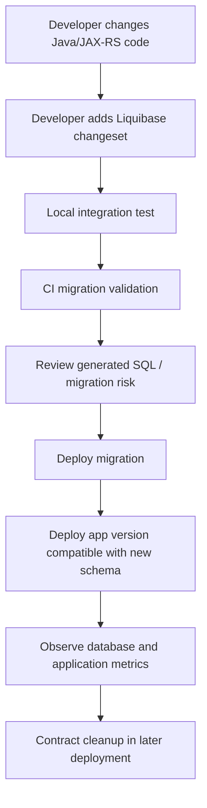

# Part 029 — Liquibase

> **Scope:** This part explains Liquibase as a production schema migration system for PostgreSQL-backed enterprise Java/JAX-RS services. It focuses on operational correctness, migration review, CI/CD/GitOps integration, rollback/roll-forward discipline, and failure modelling. It does **not** assume any internal CSG migration policy, repository layout, schema naming convention, deployment topology, or approval workflow.

## 1. Core mental model

Liquibase is a **database change management tool**. Its job is not merely to run SQL files. Its job is to make database evolution **traceable, ordered, repeatable enough, auditable, and automatable** across environments.

For a senior backend engineer, Liquibase should be understood as an explicit boundary between:

```text
application code change
        ↓
schema / data / database object change
        ↓
CI validation
        ↓
deployment pipeline
        ↓
PostgreSQL production state
        ↓
rollback / roll-forward / incident handling
```

In an enterprise Java/JAX-RS system, a Liquibase migration is usually coupled to at least one of these application-level changes:

- a new MyBatis mapper query,
- a changed result map,
- a new column used by request/response logic,
- a new constraint enforcing domain correctness,
- a new index required by a production query path,
- a function/procedure/view/trigger used by Java code,
- an outbox/inbox table used by Kafka/CDC integration,
- a backfill that makes old data compatible with new code.

The important point: **a database migration is not just a deployment artifact. It is a production behaviour change.**

## 2. Why Liquibase exists

Without a migration tool, teams often drift into unsafe practices:

- manually applying SQL in environments,
- forgetting which schema version is deployed where,
- editing an already-applied SQL file,
- deploying app code before the database is compatible,
- rolling back app code while database state remains incompatible,
- lacking evidence for audit or incident review,
- relying on tribal knowledge from DBA/backend/platform teams.

Liquibase exists to reduce these risks by maintaining a structured history of applied changes.

The key discipline is this:

```text
Every database state transition must be explicit, version-controlled, reviewed, and operationally safe.
```

## 3. Liquibase building blocks

### 3.1 Changelog

A **changelog** is the ordered collection of database changes.

Common formats:

- XML,
- YAML,
- JSON,
- formatted SQL.

For PostgreSQL-heavy teams, formatted SQL is often attractive because reviewers can read the exact SQL. XML/YAML/JSON can be useful for cross-database abstraction, but abstraction can hide PostgreSQL-specific behaviour.

Senior review question:

> Is the migration written in a form that reviewers can accurately reason about for PostgreSQL production behaviour?

### 3.2 Changeset

A **changeset** is the basic unit of migration. Conceptually:

```text
changeset = unique identity + author + change body + execution metadata
```

A changeset should usually represent one coherent database change, not a random bundle of unrelated operations.

Good changeset examples:

- add nullable column for expand phase,
- create index concurrently for query path X,
- create function version v2,
- backfill column in safe chunks,
- add NOT NULL constraint after validation,
- drop old column after contract phase.

Bad changeset examples:

- "misc cleanup",
- "fix database",
- create table + backfill + drop old table + create trigger + add index in one opaque unit,
- a massive migration that cannot be reviewed or safely retried.

### 3.3 Change type

In structured changelog formats, Liquibase can represent operations as change types, such as create table, add column, add constraint, create index, and so on.

This gives portability, but portability has a cost: PostgreSQL-specific details may be harder to see.

For production PostgreSQL, always verify the generated SQL when using abstract change types.

### 3.4 DATABASECHANGELOG

Liquibase records executed changesets in a tracking table, commonly named `DATABASECHANGELOG` unless configured otherwise.

This table is operationally important because it tells Liquibase:

- which changesets have already run,
- when they ran,
- who/what ran them,
- checksum metadata,
- ordering metadata.

Treat this table as part of deployment control-plane data.

Do not casually edit it in production.

### 3.5 DATABASECHANGELOGLOCK

Liquibase uses a lock table, commonly `DATABASECHANGELOGLOCK`, to prevent multiple Liquibase processes from applying migrations concurrently.

This matters in Kubernetes/GitOps environments where multiple pods or deployment jobs may start around the same time.

A stuck lock is an operational incident pattern:

```text
migration process starts
        ↓
Liquibase lock acquired
        ↓
process crashes / pipeline is killed / network failure
        ↓
lock remains
        ↓
future migrations fail or hang
```

The correct response is not always "delete the lock". First verify:

- no migration is actively running,
- no DDL is still executing in PostgreSQL,
- no deployment job is retrying,
- no long transaction remains open,
- the database is in expected state.

## 4. Liquibase lifecycle in Java/JAX-RS systems

A common lifecycle looks like this:



For zero-downtime systems, the migration lifecycle must support multiple app versions running temporarily.

This is especially important with rolling deployments in Kubernetes:

```text
old pod version + new pod version + migrated schema
```

The schema must be compatible with both application versions during the rollout window.

## 5. Changeset identity and immutability

A changeset identity typically includes:

- id,
- author,
- path/logical path.

Once applied to a shared environment, a changeset should be treated as immutable.

### Unsafe practice

```text
1. Create changeset 029-001-add-column.
2. Apply it in dev/test.
3. Edit the same changeset to change column type.
4. Push to shared branch.
5. Liquibase checksum mismatch appears.
```

This is a signal, not an annoyance.

A checksum mismatch usually means the migration history is no longer trustworthy.

### Safer practice

```text
1. Leave applied changeset unchanged.
2. Add a new changeset that corrects or evolves the schema.
3. Let history show both operations.
```

This preserves auditability and environment reproducibility.

## 6. Checksums

A checksum is Liquibase's mechanism for detecting that a changeset changed after it was recorded.

Do not treat checksum validation as bureaucracy. It protects the team from this class of production failure:

```text
staging database applied version A of changeset
production database applies edited version B of same changeset
        ↓
environments now have different history under the same migration identity
        ↓
future debugging becomes ambiguous
```

### When checksum mismatch appears

Investigate before fixing:

- Was an applied changeset edited?
- Was formatting/comment-only change enough to affect checksum?
- Did line endings change?
- Did a tool regenerate files?
- Was the change applied in one environment but not another?
- Is the migration safe to represent as a new changeset instead?

A senior engineer should ask:

> Are we repairing metadata, or are we hiding a real divergence in database state?

## 7. Preconditions

Preconditions allow a migration to check assumptions before executing.

Examples of assumptions:

- table exists,
- column does not exist,
- index is absent,
- database type is PostgreSQL,
- row count is below a safe threshold,
- extension exists,
- current user has expected privilege.

Preconditions are useful when migrations may run across different environments with small differences.

But preconditions should not become a substitute for environment discipline.

### Good precondition use

```text
Before adding column:
  verify table exists
  verify column does not already exist
```

### Dangerous precondition use

```text
If object missing, silently skip migration
```

Skipping can create hidden divergence.

Prefer fail-fast unless there is a clear compatibility reason.

## 8. Rollback vs roll-forward

Liquibase supports rollback concepts, but production rollback is more complex than reversing DDL.

A database rollback can be unsafe if:

- data has already been written in the new shape,
- app pods with new code are still running,
- new non-null constraints reject old code behaviour,
- columns were dropped,
- enum values were removed,
- irreversible data migration occurred,
- outbox/CDC consumers already observed new data/events.

For enterprise systems, **roll-forward is often safer than rollback**.

### Rollback should be explicit

For each changeset, ask:

| Change | Rollback feasibility |
|---|---|
| Add nullable column | Usually easy |
| Add index | Usually easy to drop, but consider lock/concurrent drop |
| Add NOT NULL constraint | Possible only if data remains valid |
| Drop column | Usually unsafe if data is lost |
| Rename column | Risky with old app versions |
| Data backfill | Depends on reversibility |
| Create function | Usually replace/drop possible |
| Modify enum | Often awkward; verify PostgreSQL specifics |
| Create trigger | Drop possible, but side effects may persist |

### Practical policy

For each migration PR, include:

```text
Rollback plan:
- application rollback behaviour
- database rollback or roll-forward path
- data compatibility concern
- expected blast radius
- validation query
```

## 9. Contexts and labels

Liquibase contexts and labels allow selective execution.

They are useful for separating:

- test-only seed data,
- environment-specific setup,
- optional features,
- customer-specific migration branches,
- data fixes that should not run everywhere.

However, selective execution increases reasoning complexity.

Failure mode:

```text
changeset runs in staging but not production due to context mismatch
        ↓
application code assumes schema exists
        ↓
production deployment fails
```

Senior review question:

> Is this changeset truly environment-specific, or are we encoding deployment confusion into the migration layer?

## 10. SQL changelog vs XML/YAML/JSON changelog

### SQL changelog strengths

- Reviewers see PostgreSQL SQL directly.
- Easy to use PostgreSQL-specific features.
- Natural for functions, procedures, triggers, indexes, views.
- Easier to copy into psql for local analysis.

### SQL changelog risks

- Less abstract validation from Liquibase.
- Rollback must be written carefully.
- Formatting conventions matter.
- Idempotency is manual.

### XML/YAML/JSON strengths

- Structured change types.
- Easier metadata representation.
- Potential cross-database abstraction.
- Consistent rollback for simple changes.

### XML/YAML/JSON risks

- Generated SQL may surprise PostgreSQL reviewers.
- Some PostgreSQL-specific options may be awkward.
- Reviewers may approve intent but not actual SQL.

### Recommended senior habit

For important migrations, review the **generated SQL** regardless of changelog format.

## 11. Generated SQL review

Liquibase can produce SQL before applying changes. This is essential for production risk review.

Review generated SQL for:

- table rewrite risk,
- lock level,
- index creation strategy,
- constraint validation behaviour,
- default value impact,
- large table update risk,
- extension dependency,
- object ownership,
- grants/privileges,
- search path assumptions,
- transaction wrapping,
- statement timeout compatibility.

A migration that looks harmless in YAML may generate SQL that is not harmless.

## 12. PostgreSQL-specific migration safety

PostgreSQL DDL is transactional in many cases, but that does not mean every DDL is operationally cheap.

Important distinction:

```text
transactionally safe != operationally safe
```

A statement can roll back cleanly but still block production traffic while running.

### Examples of risk patterns

| Migration | Risk |
|---|---|
| Add column with volatile default on large table | Table rewrite / lock risk depending on version and expression |
| Add NOT NULL immediately | Full table validation / lock risk |
| Create index normally on large table | Blocks writes |
| Create index concurrently | Safer for writes but cannot run inside a normal transaction block |
| Update millions of rows | WAL explosion, locks, bloat, replication lag |
| Drop column | Application compatibility and irreversible data loss |
| Rename table/column | Breaks old app version during rolling deploy |
| Alter column type | Rewrite and compatibility risk |

## 13. Expand-contract migration with Liquibase

For zero-downtime systems, use expand-contract.

### Example: adding a required column

Unsafe one-step migration:

```sql
ALTER TABLE quote ADD COLUMN source_system text NOT NULL;
```

Safer multi-step approach:

```text
Deployment A — expand:
  add nullable column
  deploy app that writes both old and new shape

Backfill:
  populate source_system for existing rows in chunks
  validate row counts

Deployment B — enforce:
  add constraint / NOT NULL once all data is valid

Deployment C — contract:
  remove old compatibility logic if any
```

Liquibase should represent each phase explicitly.

## 14. Constraint migration pattern

Constraints are correctness boundaries. They should be added deliberately.

### Adding a foreign key on a large table

Production-safe thinking:

1. Validate data first.
2. Add constraint in a way that avoids unnecessary blocking where possible.
3. Validate constraint separately if using PostgreSQL-supported patterns.
4. Monitor locks and duration.
5. Ensure app logic handles constraint violation.

### Adding a unique constraint

Before adding unique constraint:

```sql
SELECT business_key, count(*)
FROM target_table
GROUP BY business_key
HAVING count(*) > 1;
```

If duplicates exist, the migration should not simply fail in production. The PR needs a data correction plan.

## 15. Index migration pattern

Indexes are not free. They improve read paths but cost write throughput, disk, WAL, vacuum, and planning complexity.

For large production tables, prefer a plan like:

```text
1. Identify query path and expected predicate/order.
2. Confirm existing indexes cannot serve it.
3. Test EXPLAIN before/after.
4. Create index using PostgreSQL-safe strategy for table size.
5. Monitor build duration, locks, IO, WAL, replication lag.
6. Confirm query plan changed as expected.
7. Remove redundant indexes if safe.
```

### Naming convention

Use names that make intent visible:

```text
idx_<table>__<columns>__<optional_condition>
uk_<table>__<business_key>
fk_<child>__<parent>
ck_<table>__<rule>
```

Verify internal naming conventions before applying this.

## 16. Function/procedure/view migration with Liquibase

Database objects such as functions, procedures, views, materialized views, and triggers require extra care because they are executable logic or read contracts.

### Safer function versioning

Instead of modifying a function used by running code in-place, consider:

```text
create function calculate_price_v2(...)
deploy app code using v2
verify behaviour
later remove v1
```

This is especially useful when rolling deployments can run old and new app versions simultaneously.

### View migration risk

Changing view columns can break MyBatis mappers if result mappings expect stable names/types.

Review:

- column names,
- column order if any code depends on it,
- data types,
- nullability behaviour,
- permission grants,
- dependent views/materialized views.

## 17. Large migration safety

Large migrations should not be hidden inside normal schema migration if they require long runtime or operational supervision.

### Dangerous pattern

```sql
UPDATE order_item
SET normalized_status = lower(status);
```

on a table with hundreds of millions of rows.

### Safer pattern

```text
1. Add nullable target column.
2. Deploy app to populate new writes.
3. Backfill in chunks with checkpointing.
4. Throttle updates.
5. Monitor WAL, locks, replication lag, bloat.
6. Validate counts.
7. Enforce constraint later.
```

Liquibase may create the structures, but a separate backfill job may be more appropriate for the heavy data movement.

## 18. Liquibase in CI/CD

A production-grade pipeline should validate migrations before deployment.

Minimum checks:

- changelog parses,
- no duplicate changeset identity,
- checksums valid,
- migration applies cleanly to an empty or baseline database,
- migration applies cleanly to a realistic previous schema,
- generated SQL is available for review,
- rollback/roll-forward plan is documented,
- integration tests run against migrated schema,
- MyBatis mapper tests execute critical queries.

Better checks:

- migration dry-run against production-like volume,
- EXPLAIN plan comparison for critical queries,
- lock-risk review for large tables,
- automated linting for dangerous SQL patterns,
- validation query included for backfills,
- DBA/SRE approval gate for high-risk migration.

## 19. Liquibase in GitOps

In GitOps environments, database migrations need careful orchestration.

Potential anti-pattern:

```text
Argo/Flux syncs app deployment and migration job together
        ↓
new pods start before migration completes
        ↓
app fails because schema is missing
```

Potential safer pattern:

```text
1. Migration job runs first.
2. Migration job completes successfully.
3. App deployment rolls out.
4. Health checks confirm compatibility.
5. Contract migration waits for later release.
```

But exact orchestration depends on internal platform design.

## 20. Kubernetes-specific Liquibase failure modes

### 20.1 Multiple migrators

If every app pod runs Liquibase on startup, a scaling event can create migration contention.

Even if Liquibase lock prevents concurrent execution, startup latency and failure behaviour may become ugly.

Verify whether migrations run:

- inside app startup,
- as a Kubernetes Job,
- as a CI/CD pipeline step,
- manually by DBA/platform team,
- through GitOps sync hooks.

### 20.2 Pod killed during migration

If a migration pod is killed mid-run:

- PostgreSQL may roll back transactional changes,
- non-transactional operations may leave partial effects,
- Liquibase lock may remain,
- pipeline state may be unclear.

Runbook must define how to inspect and recover.

### 20.3 Resource throttling

Migration jobs need appropriate CPU/memory limits. A low limit can make migrations slow enough to exceed deployment windows.

## 21. Java/JAX-RS compatibility checklist

For each Liquibase PR, ask:

- Can old Java code run against new schema?
- Can new Java code run against old schema during deployment ordering failure?
- Are nullable columns handled safely in DTO/domain mapping?
- Are MyBatis `ResultMap` definitions compatible with changed columns?
- Are generated keys still mapped correctly?
- Are new constraints mapped to domain errors?
- Are HTTP 409/400/500 boundaries clear for database errors?
- Does the migration affect transaction duration?
- Does the migration require new indexes before app traffic uses new query paths?
- Are outbox/CDC events affected?

## 22. MyBatis-specific Liquibase concerns

MyBatis makes SQL explicit, which is good for review, but it also means schema changes can break mapper SQL directly.

Review migration together with:

- mapper XML/interface changes,
- result maps,
- dynamic SQL conditions,
- enum TypeHandlers,
- JSONB TypeHandlers,
- stored procedure/function calls,
- pagination queries,
- generated key handling,
- batch executor usage.

Typical failure:

```text
Migration renames column
        ↓
One mapper query updated
        ↓
Another dynamic SQL fragment still references old column
        ↓
Runtime failure only appears under specific filter combination
```

Integration tests should exercise dynamic branches, not only happy path.

## 23. Liquibase and CDC/outbox

Schema migration affects CDC and Kafka integration.

Review:

- outbox table column changes,
- event payload JSONB changes,
- Debezium connector schema evolution,
- replication slot WAL impact during large updates,
- downstream consumers expecting old fields,
- event versioning,
- replay compatibility.

Dangerous pattern:

```text
rename outbox payload field without event versioning
        ↓
producer deploys first
        ↓
consumer fails or silently misinterprets event
```

Database migration must be coordinated with event contract migration.

## 24. Liquibase and PostgreSQL security

Migrations often run with elevated privileges.

That is dangerous if not controlled.

Review:

- migration account privileges,
- application account privileges,
- ownership of created objects,
- grants after object creation,
- default privileges,
- function `SECURITY DEFINER`,
- `search_path` in functions,
- extension creation privilege,
- schema-level permissions.

A migration can accidentally create an object inaccessible to the app or overly accessible to the wrong role.

## 25. Environment drift

Environment drift happens when dev/test/staging/prod do not have equivalent migration history or database objects.

Symptoms:

- migration succeeds in staging but fails in prod,
- checksum mismatch in one environment,
- missing extension only in production,
- object owner differs,
- search_path differs,
- data violates a constraint only in production,
- table size makes production migration unsafe though test passed.

Drift cannot be solved only by tooling. It requires discipline:

- controlled changes,
- no manual hotfix without follow-up migration,
- regular schema diff checks where appropriate,
- restore-from-prod-like test environments if allowed,
- documented exceptions.

## 26. Operational runbook for failed Liquibase migration

When a migration fails, do not immediately rerun blindly.

Use this sequence:

```text
1. Stop further deployments if needed.
2. Identify failed changeset.
3. Inspect PostgreSQL error and SQLState.
4. Check whether transaction rolled back.
5. Check partially created objects.
6. Check DATABASECHANGELOG entry.
7. Check DATABASECHANGELOGLOCK state.
8. Check active queries/locks.
9. Decide: rerun, roll-forward, manual repair, or restore path.
10. Document final database state.
```

Useful PostgreSQL inspection queries:

```sql
SELECT *
FROM pg_stat_activity
WHERE state <> 'idle';
```

```sql
SELECT relation::regclass, mode, granted
FROM pg_locks
WHERE NOT granted;
```

```sql
SELECT schemaname, tablename
FROM pg_tables
WHERE schemaname NOT IN ('pg_catalog', 'information_schema')
ORDER BY schemaname, tablename;
```

## 27. Liquibase anti-patterns

### 27.1 Editing applied changesets

This destroys historical trust.

Prefer new corrective changesets.

### 27.2 Mixing huge backfill with schema change

This couples DDL risk with data movement risk.

Prefer phased migration.

### 27.3 Running migrations from every app instance

This may work technically but can become operationally noisy in Kubernetes.

Verify platform policy.

### 27.4 Using rollback as a magical safety net

Rollback may be impossible after data changes or downstream event consumption.

### 27.5 Skipping generated SQL review

Structured changelogs can hide PostgreSQL-specific lock/rewrite behaviour.

### 27.6 No validation query

A migration that transforms data must prove the transformation succeeded.

### 27.7 Hiding business logic in migration scripts

If migration encodes complex domain logic, it needs the same review seriousness as application code.

### 27.8 No ownership/grant review

Created objects may have wrong privileges or ownership.

### 27.9 Overusing contexts/labels

Selective execution can create environment drift.

### 27.10 Treating Liquibase lock table as disposable

The lock table is control-plane state. Handle it through runbook, not panic deletion.

## 28. Review checklist for Liquibase PR

### Schema correctness

- Is the change compatible with current and next application version?
- Are constraints aligned with domain invariants?
- Are nullability/default choices intentional?
- Are FK/unique/check constraints needed?
- Are enum/domain/generated columns appropriate?

### SQL and PostgreSQL behaviour

- Has generated SQL been reviewed?
- Does the migration rewrite a large table?
- What lock level is expected?
- Does the migration need `CONCURRENTLY`?
- Is it safe inside Liquibase transaction handling?
- Are extensions required?

### Performance

- Does the migration scan/update large tables?
- Could it generate excessive WAL?
- Could it cause replication lag?
- Could it block writes?
- Is there a throttle/chunking strategy?

### Java/JAX-RS compatibility

- Are old and new app versions compatible?
- Are MyBatis mappers updated?
- Are result maps and TypeHandlers compatible?
- Are error mappings updated for new constraints?

### Rollback/roll-forward

- Is rollback possible?
- If not, what is roll-forward path?
- What validation query confirms success?
- What is the emergency stop condition?

### Observability

- What metrics/logs show migration progress?
- What alerts may trigger?
- Who watches the deployment?
- How is failure diagnosed?

### Security/privacy

- Are object grants correct?
- Does migration expose PII?
- Are audit/retention implications understood?
- Are secrets avoided in migration files?

## 29. Internal verification checklist

Check these in the actual CSG/team environment before applying assumptions:

### Tooling and repository

- Is Liquibase actually used, or Flyway/custom tooling?
- Where are changelogs stored?
- Which changelog format is standard?
- Is there a root/master changelog?
- How are changesets named?
- Are SQL changelogs allowed?
- Are XML/YAML/JSON changelogs preferred?

### Pipeline and deployment

- Where does Liquibase run: CI, CD, app startup, Kubernetes Job, GitOps hook, or DBA process?
- Are migrations run before or after app deployment?
- Is there a manual approval gate?
- Is generated SQL reviewed?
- Are migrations tested against production-like data volume?

### PostgreSQL specifics

- Which PostgreSQL version is used?
- Are migrations wrapped in transactions?
- How are `CREATE INDEX CONCURRENTLY` operations handled?
- What statement timeout applies to migration sessions?
- What lock timeout applies?
- Which roles own created objects?

### Operational safety

- Who handles stuck `DATABASECHANGELOGLOCK`?
- Is there a runbook for failed migration?
- Are migration logs retained?
- How are rollback/roll-forward decisions made?
- Are DBA/SRE involved for high-risk changes?

### Application integration

- Are MyBatis mapper tests run after migration?
- Are compatibility tests run with old/new app versions?
- Are outbox/CDC consumers tested for schema changes?
- Are API error mappings tested for new constraints?

## 30. Practical senior engineer stance

A junior engineer asks:

> Does the migration run?

A senior engineer asks:

> Does the migration preserve correctness, remain compatible during rollout, avoid unacceptable locks, expose enough observability, and have a credible recovery path?

Liquibase is useful only when the team uses it as a disciplined database change management system.

The real skill is not writing a changeset.

The real skill is knowing what production state transition the changeset creates.

## References

- Liquibase documentation — changesets, changelogs, checksums, contexts, labels, rollback, and tracking tables.
- PostgreSQL documentation — DDL, locking, indexes, constraints, transactions, and runtime behaviour.
- Internal CSG/team documentation — migration policy, pipeline execution model, production approval process, database ownership, DBA/SRE escalation path.
