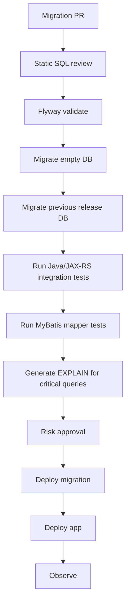

# Part 030 — Flyway

> **Scope:** This part explains Flyway as a production database migration system for PostgreSQL-backed enterprise Java/JAX-RS services. It focuses on versioned migrations, repeatable migrations, baseline, validation, repair, naming conventions, PostgreSQL-specific migration safety, CI/CD/GitOps, and operational failure modes. It does **not** assume Flyway is used internally at CSG; verify the actual migration tool and policy.

## 1. Core mental model

Flyway is a **database versioning and migration tool** built around a simple idea:

```text
ordered migration files + schema history table = reproducible database evolution
```

In Flyway, the migration directory is not just a folder of SQL files. It is a versioned contract between application releases and database state.

For an enterprise Java/JAX-RS service, Flyway sits between:

```text
Git commit
  ↓
SQL migration files
  ↓
CI validation
  ↓
Flyway migrate
  ↓
PostgreSQL schema state
  ↓
Java/MyBatis runtime behaviour
```

Flyway is intentionally simple compared with more metadata-rich migration systems. That simplicity is powerful, but it means the team must be disciplined about file naming, immutability, generated behaviour, rollback/roll-forward planning, and production risk review.

## 2. Why Flyway exists

Flyway exists to solve database drift and unmanaged schema change.

Without a migration tool, teams often end up with:

- manual SQL applied directly to environments,
- schema differences between dev/staging/prod,
- unknown order of changes,
- no reliable audit trail,
- app code and database schema moving independently,
- production hotfixes not captured in Git,
- broken deployments caused by missing columns/indexes/functions.

Flyway reduces those risks by making migrations ordered, tracked, and repeatable through automation.

The senior engineer principle:

```text
The database must be deployable from version-controlled history, not from memory.
```

## 3. Flyway schema history table

Flyway records applied migrations in a schema history table.

This table tracks metadata such as:

- installed rank,
- version,
- description,
- type,
- script,
- checksum,
- installed by,
- installed timestamp,
- execution time,
- success/failure.

This table is operationally critical.

Do not manually edit it unless following a runbook and understanding the exact state mismatch being corrected.

## 4. Migration types

Flyway commonly works with these migration categories:

1. versioned migrations,
2. repeatable migrations,
3. baseline migrations.

Some editions/features may support additional concepts, but these three are the core mental model for most backend teams.

## 5. Versioned migrations

A versioned migration is applied **once**, in version order.

Typical naming:

```text
V1__create_quote_table.sql
V2__add_quote_status.sql
V3__create_quote_item_index.sql
```

The exact prefix/separator conventions may be configurable, but the common shape is:

```text
V<version>__<description>.sql
```

A versioned migration is best for irreversible historical steps:

- create table,
- add column,
- add constraint,
- create index,
- insert reference data that changes over time,
- perform one-time schema transition,
- add outbox/inbox table,
- add audit table,
- add partition structure.

### Versioned migration immutability

Once a versioned migration has been applied to a shared environment, do not edit it casually.

If it is wrong, usually add a new migration:

```text
V12__add_quote_status.sql
V13__fix_quote_status_constraint.sql
```

This preserves history and avoids checksum mismatch.

## 6. Repeatable migrations

Repeatable migrations are reapplied when their checksum changes.

Typical naming:

```text
R__create_quote_read_view.sql
R__create_price_calculation_function.sql
```

Repeatable migrations are useful for database objects whose full definition should be kept in version control:

- views,
- materialized view definitions,
- functions,
- procedures,
- triggers/trigger functions,
- permissions scripts in some teams,
- stable reference data in some cases.

### Repeatable migration risk

Repeatable does not mean harmless.

If a repeatable migration recreates a view used by production API queries, it can break MyBatis mapping or degrade query performance.

If a repeatable migration replaces a function used by running pods, it can change behaviour immediately.

Senior review question:

> Is this object safe to replace in-place while old and new application versions may both be running?

## 7. Baseline

Baseline is used when Flyway is introduced to an existing database that already has schema objects.

Conceptually:

```text
existing production schema
        ↓
mark as baseline version
        ↓
Flyway applies only migrations after that point
```

Baseline is powerful but dangerous if misunderstood.

Questions before baselining:

- Is the existing schema fully known?
- Is there a schema dump or reference definition?
- Are all environments equivalent?
- Are manual objects captured in future migrations?
- Does the baseline version accurately represent production state?
- Can a fresh database be created from baseline plus future migrations?

A baseline should not be used to hide environment drift.

## 8. Migrate

`migrate` is Flyway's central operation.

At a high level:

```text
1. Scan migration locations.
2. Read schema history table.
3. Determine pending migrations.
4. Validate order and checksums.
5. Apply pending versioned migrations.
6. Apply changed repeatable migrations.
7. Record results.
```

In CI/CD, `migrate` should run in a controlled point of the deployment process.

Do not assume app startup is the right place. Verify team/platform policy.

## 9. Validate

`validate` checks whether applied migrations still match available migration files and whether migration history is consistent.

Validation protects against:

- edited applied migrations,
- missing migration files,
- checksum mismatch,
- out-of-order confusion,
- failed migrations left unresolved.

Treat validate failure as a real signal.

Do not jump directly to repair without understanding why validation failed.

## 10. Repair

`repair` fixes Flyway schema history metadata in certain cases.

It is not a magical database repair tool.

It does not necessarily fix:

- broken schema state,
- partially applied DDL,
- incorrect data,
- unsafe application compatibility,
- downstream CDC/event issues,
- missing objects.

Use repair only when the database state and metadata correction are well understood.

Senior rule:

```text
Repair metadata only after proving actual database state.
```

## 11. Checksum

Flyway uses checksums to detect accidental changes to migrations.

A checksum mismatch means the migration file differs from what was recorded when it was applied.

Common causes:

- developer edited an applied migration,
- formatting or line ending changes,
- generated SQL changed,
- file was moved/renamed depending on configuration,
- branch merge changed historical files.

The usual fix is not to edit history. Add a new migration unless you are in a strictly local, disposable environment.

## 12. Naming convention

Naming convention is not cosmetic. It determines reviewability and operational traceability.

Poor names:

```text
V31__fix.sql
V32__update.sql
V33__changes.sql
```

Better names:

```text
V31__quote_add_external_reference_column.sql
V32__quote_backfill_external_reference.sql
V33__quote_enforce_external_reference_not_null.sql
```

Good names reveal:

- target object,
- intent,
- migration phase,
- operational risk when possible.

### Suggested semantic pattern

```text
V<version>__<domain_or_table>_<action>_<target>.sql
```

Examples:

```text
V202607110901__quote_add_source_system_column.sql
V202607110915__quote_item_create_quote_id_status_idx.sql
V202607111000__outbox_add_event_version_column.sql
```

Verify internal versioning style before adopting this.

## 13. Version numbering strategy

Common version strategies:

| Strategy | Example | Strength | Risk |
|---|---|---|---|
| Sequential integer | `V42__...` | Simple | Branch merge conflicts |
| Timestamp | `V202607110930__...` | Reduces conflicts | Less readable if abused |
| Semantic release prefix | `V3.12.1__...` | Tied to release | Hard with parallel teams |
| Hybrid | `V2026.07.11.0930__...` | Ordered and unique | Requires discipline |

For large teams, timestamp-based versions often reduce merge conflict, but internal convention matters more than theoretical preference.

## 14. SQL migrations

Flyway is commonly used with plain SQL migrations.

This is a strong fit for PostgreSQL because it keeps reviewers close to actual database behaviour.

Benefits:

- direct PostgreSQL syntax,
- easy review of locks/indexes/constraints,
- natural for functions/procedures/views/triggers,
- easy local reproduction with psql,
- no abstraction hiding generated SQL.

Risks:

- team must understand PostgreSQL DDL behaviour,
- rollback is not automatic,
- idempotency must be intentional,
- large data operations can be accidentally embedded,
- SQL style may drift.

## 15. Java migrations

Flyway can support Java-based migrations in some setups.

Java migrations may be useful when:

- data transformation requires application libraries,
- complex logic is hard to express safely in SQL,
- validation needs structured code,
- migration needs controlled batching with checkpoints.

But Java migrations can also be dangerous:

- harder for DBAs to inspect,
- may depend on application runtime classes,
- may create versioning/classpath issues,
- may run too much business logic inside deployment pipeline,
- may be harder to replay years later.

Senior stance:

> Prefer SQL for schema changes. Use Java migrations only when the operational benefit clearly outweighs reproducibility and review cost.

## 16. PostgreSQL transaction nuance

PostgreSQL supports transactional DDL for many operations, but not all operations fit neatly into one transaction.

Important examples:

- `CREATE INDEX CONCURRENTLY` has transaction restrictions.
- `DROP INDEX CONCURRENTLY` has transaction restrictions.
- Long transactions can delay vacuum and increase bloat.
- Large updates can generate heavy WAL and replication lag.

Therefore, migration tooling configuration must be compatible with PostgreSQL operation semantics.

Do not assume every migration should run inside one transaction.

Do not assume disabling transactions is safe either.

## 17. Expand-contract migration with Flyway

Flyway works well with expand-contract when migrations are small and ordered.

### Scenario: rename a column safely

Unsafe migration:

```sql
ALTER TABLE quote RENAME COLUMN customer_ref TO customer_reference;
```

Why unsafe?

- old app version still queries `customer_ref`,
- new app version expects `customer_reference`,
- rolling deployment can break either side.

Safer migration series:

```text
V101__quote_add_customer_reference_column.sql
V102__quote_backfill_customer_reference.sql
V103__quote_add_dual_write_support_if_db_side_needed.sql
Deploy app that reads/writes new column while still tolerating old
V104__quote_enforce_customer_reference_constraint.sql
Later release:
V130__quote_drop_customer_ref_column.sql
```

The exact approach depends on app logic and data volume.

## 18. Backfill and large data migration

Flyway can run SQL, but not every data movement belongs in a normal Flyway migration.

### Dangerous one-shot backfill

```sql
UPDATE quote_item
SET normalized_action = lower(action);
```

On a large table, this can cause:

- long locks,
- huge WAL,
- replication lag,
- table/index bloat,
- autovacuum pressure,
- timeout,
- failed deployment,
- stuck schema history state.

### Safer strategy

```text
1. Schema migration adds nullable column.
2. Application writes new values for new rows.
3. Separate backfill job updates old rows in chunks.
4. Backfill records checkpoint.
5. Validation query confirms completion.
6. Later Flyway migration enforces NOT NULL/check constraint.
```

Flyway should define state transitions; long-running data work may need a dedicated operational job.

## 19. Function/procedure migration

Flyway repeatable migrations are commonly used for functions and procedures.

But in-place replacement can be risky.

### Risk pattern

```text
R__price_calculation_function.sql changes function behaviour
        ↓
Flyway migrates before app rollout
        ↓
old app version now calls new function behaviour
        ↓
business result changes before intended release boundary
```

### Safer versioned function pattern

```text
V210__create_price_calculation_v2_function.sql
Deploy app calling v2
Observe correctness
V240__drop_price_calculation_v1_function.sql
```

Repeatable migrations are still useful, but behaviour-changing executable logic deserves release-boundary awareness.

## 20. View and materialized view migration

Views are read contracts.

Changing a view can break:

- MyBatis result maps,
- API response fields,
- reporting jobs,
- permission grants,
- downstream consumers,
- materialized view refresh jobs.

Review view migrations for:

- column names,
- data types,
- nullability semantics,
- row multiplication due to JOIN changes,
- performance plan,
- dependent objects,
- grants.

For materialized views, also review:

- refresh method,
- unique index requirement for concurrent refresh,
- staleness tolerance,
- refresh schedule,
- lock behaviour.

## 21. Trigger migration

Triggers are hidden behaviour.

A Flyway migration that adds a trigger changes write semantics globally for a table.

Review:

- when trigger fires,
- row vs statement level,
- BEFORE vs AFTER,
- affected columns,
- performance impact,
- recursion/cascading risk,
- interaction with bulk load/backfill,
- observability,
- test coverage,
- rollback/disable plan.

Trigger migrations should be treated as application logic deployments.

## 22. Constraint migration

Constraints are good. Constraints protect correctness.

But adding constraints to existing production data requires validation.

### Unique constraint workflow

```sql
SELECT external_id, count(*)
FROM quote
GROUP BY external_id
HAVING count(*) > 1;
```

If duplicates exist, the migration needs data repair first.

### NOT NULL workflow

```text
1. Add nullable column.
2. Backfill old rows.
3. Validate no nulls.
4. Add NOT NULL.
```

### Check constraint workflow

```text
1. Validate existing rows.
2. Add constraint safely.
3. Ensure app maps violations correctly.
```

Never add constraints blind on large historical tables.

## 23. Index migration

Index migrations are common performance changes.

But indexes can be production incidents if built incorrectly.

Review:

- normal vs concurrent creation,
- table size,
- expected lock behaviour,
- write overhead,
- disk availability,
- WAL generation,
- replication lag,
- duplicate/redundant indexes,
- query plan before/after.

A Flyway index migration should be tied to a query path and EXPLAIN evidence.

Bad:

```text
Add index because query might need it.
```

Good:

```text
Add composite index on (tenant_id, status, created_at desc) because endpoint X uses tenant/status keyset pagination; EXPLAIN before/after included.
```

## 24. Flyway in CI/CD

A production-grade Flyway pipeline should include:

- validate migration naming,
- run `validate`,
- migrate a clean database,
- migrate a previous-version database,
- run application integration tests,
- run MyBatis mapper tests,
- check dangerous SQL patterns,
- publish migration logs,
- require review for high-risk migration,
- document rollback/roll-forward path.

Better enterprise pipeline:



## 25. Flyway in GitOps/Kubernetes

In Kubernetes, Flyway execution model matters.

Possible models:

1. app runs Flyway at startup,
2. separate Kubernetes Job runs Flyway,
3. CI/CD pipeline runs Flyway before deployment,
4. GitOps hook runs Flyway,
5. DBA/platform process runs Flyway manually or semi-automatically.

Each has trade-offs.

### App startup migration

Pros:

- simple packaging,
- app owns migration,
- fewer pipeline components.

Cons:

- multiple pods may contend,
- startup failures can become rollout failures,
- long migration blocks readiness,
- hard to isolate migration permissions,
- migration lifecycle coupled to app autoscaling.

### Separate migration job

Pros:

- clearer execution boundary,
- separate permissions/resources,
- easier observability,
- better control before app rollout.

Cons:

- orchestration complexity,
- ordering must be enforced,
- retry behaviour needs runbook.

Verify actual internal platform pattern.

## 26. Application compatibility during rollout

In rolling deployment, this state is normal:

```text
old app pod + new app pod + migrated database
```

Therefore migrations should usually be backward-compatible.

### Backward-compatible changes

Usually safer:

- add nullable column,
- add table unused by old code,
- add index,
- add permissive constraint after data validation,
- add new function while keeping old function,
- add new enum/domain carefully if old code tolerates it.

### Breaking changes

Risky during rolling deploy:

- drop column,
- rename column,
- change column type,
- make column NOT NULL before old code writes it,
- remove enum value,
- replace function behaviour in-place,
- change view contract,
- remove index relied on by old query path.

Flyway ordering cannot fix incompatible application design.

## 27. MyBatis-specific concerns

Because MyBatis keeps SQL explicit, schema migrations must be reviewed with mapper changes.

Check:

- mapper XML references old column names,
- dynamic SQL fragments reference changed schema,
- result maps include new nullable fields,
- constructor mappings match column order/types,
- enum TypeHandler supports new values,
- JSONB TypeHandler supports payload changes,
- stored function/procedure calls match signatures,
- batch operations handle new constraints,
- generated keys still work.

Failure mode:

```text
Migration adds NOT NULL column without default
        ↓
One insert mapper updated
        ↓
Batch insert mapper not updated
        ↓
Production batch job fails
```

Search all mapper paths, not only endpoint path.

## 28. Error handling and SQLState

Migration changes often introduce new runtime errors:

- unique violation,
- foreign key violation,
- check violation,
- not null violation,
- serialization failure,
- deadlock detected,
- undefined column during bad rollout,
- invalid input syntax after type change.

Application code should map expected database constraint errors to domain/API errors.

Example:

```text
unique violation on idempotency key
        ↓
HTTP 409 or idempotent replay response, depending on contract
```

Do not allow expected business conflicts to become generic HTTP 500.

## 29. Flyway and CDC/outbox

Database migrations can affect event-driven systems.

Review:

- outbox schema changes,
- event payload changes,
- Debezium connector compatibility,
- Kafka schema compatibility,
- replication slot WAL pressure during backfills,
- downstream consumer deployment order,
- replay behaviour,
- event versioning.

A database migration can be safe for the database but unsafe for event consumers.

## 30. Flyway and security

Flyway migration account usually has elevated privileges.

Review:

- migration user permissions,
- app user permissions,
- object owner,
- grants after table/view/function creation,
- default privileges,
- schema search path,
- `SECURITY DEFINER` functions,
- extension creation,
- secret leakage in SQL files.

Security failure example:

```text
migration creates table owned by migration user
        ↓
app user has no privilege
        ↓
deployment succeeds but runtime fails
```

Another example:

```text
function created with SECURITY DEFINER and unsafe search_path
        ↓
privilege escalation risk
```

## 31. Flyway failure modes

### 31.1 Failed migration

A migration fails halfway or fails before commit.

Investigate:

- schema history table state,
- PostgreSQL transaction rollback state,
- partially created objects,
- active locks,
- migration logs,
- application deployment state.

### 31.2 Checksum mismatch

Do not blindly repair.

Find out what changed and which environments applied which version.

### 31.3 Out-of-order migration

Parallel branches can create migration ordering problems.

Decide whether out-of-order execution is allowed by internal policy. In many enterprise environments, it should be controlled tightly.

### 31.4 Missing migration file

If a migration recorded in database history is missing from repository, reproducibility is broken.

### 31.5 Long-running migration

Long migrations can block deployment windows and increase database pressure.

### 31.6 Bad query plan after migration

A migration can change table statistics, indexes, or query shape. Performance regression may appear after deployment.

### 31.7 App/schema mismatch

The migration succeeded, but app version is incompatible.

This is a release orchestration failure.

## 32. Failed migration response runbook

Use a disciplined sequence:

```text
1. Stop further rollout if needed.
2. Capture Flyway logs.
3. Identify failed script and statement.
4. Inspect schema history table.
5. Inspect PostgreSQL objects touched by the migration.
6. Check active sessions and locks.
7. Decide whether transaction rolled back cleanly.
8. Determine if app deployment started.
9. Choose rerun, new fix migration, metadata repair, app rollback, or database restore path.
10. Document actual final state.
```

Useful PostgreSQL checks:

```sql
SELECT pid, state, wait_event_type, wait_event, query
FROM pg_stat_activity
WHERE state <> 'idle';
```

```sql
SELECT locktype, relation::regclass, mode, granted
FROM pg_locks
ORDER BY granted, relation::regclass::text, mode;
```

```sql
SELECT schemaname, tablename
FROM pg_tables
WHERE schemaname NOT IN ('pg_catalog', 'information_schema')
ORDER BY 1, 2;
```

## 33. Anti-patterns

### 33.1 Editing applied migrations

This breaks checksum and history trust.

### 33.2 Huge one-shot data updates

This risks locks, WAL growth, lag, bloat, and timeout.

### 33.3 Using repeatable migrations for behaviour-changing logic without release awareness

Functions/procedures can change immediately under old app versions.

### 33.4 No app compatibility plan

Database migration and Java code must be deployable together safely.

### 33.5 No validation query

Data migrations need proof.

### 33.6 Treating repair as a normal workflow

Repair should be exceptional.

### 33.7 Running Flyway automatically from every replica without understanding startup/concurrency behaviour

This can create noisy deployments and privilege issues.

### 33.8 Dropping columns too early

Contract phase should happen only after old code and old data dependencies are gone.

### 33.9 Ignoring downstream consumers

CDC/Kafka consumers may break after database shape changes.

### 33.10 No production-like migration test

A migration that passes on small dev data may fail on production volume.

## 34. PR review checklist for Flyway migrations

### Migration identity

- Is the filename valid?
- Is the version unique?
- Is the description meaningful?
- Is this versioned or repeatable for the right reason?
- Has an applied migration been edited?

### PostgreSQL safety

- What lock level is expected?
- Does it rewrite a large table?
- Does it require concurrent index creation?
- Does it generate large WAL?
- Is it compatible with migration transaction configuration?
- Does it depend on extension/version-specific behaviour?

### Application compatibility

- Can old app run against new schema?
- Can new app tolerate old schema if deployment ordering fails?
- Are MyBatis mappers updated?
- Are result maps and TypeHandlers updated?
- Are API error mappings updated?

### Data correctness

- Are constraints aligned with domain invariants?
- Has existing data been validated?
- Is backfill idempotent/resumable if needed?
- Is reconciliation query included?

### Performance

- Is there EXPLAIN evidence for index/query changes?
- Will this affect hot tables?
- Could it impact replication lag?
- Could it create bloat?

### Operations

- Where will Flyway run?
- Who watches deployment?
- What is stop condition?
- What is roll-forward path?
- What metrics/logs confirm success?

### Security/privacy

- Are grants/owners correct?
- Are secrets absent from migration scripts?
- Is PII exposure controlled?
- Are audit/retention implications understood?

## 35. Internal verification checklist

Verify these in the actual CSG/team environment:

### Tool usage

- Is Flyway used at all?
- If yes, which Flyway edition/version?
- Is Liquibase used instead in some services?
- Are multiple migration tools used across repositories?
- Is there a custom wrapper around Flyway?

### Repository layout

- Where are migration files stored?
- What naming convention is required?
- Are repeatable migrations allowed?
- Are Java migrations allowed?
- Are callbacks used?
- Are environment-specific migrations allowed?

### Pipeline

- Does CI run `validate`?
- Does CI migrate a clean database?
- Does CI migrate from previous release schema?
- Does CD run Flyway before app rollout?
- Is generated output/log retained?
- Are high-risk migrations manually approved?

### PostgreSQL configuration

- What PostgreSQL version is used?
- What statement timeout applies during migrations?
- What lock timeout applies?
- Are migrations transactional by default?
- How are concurrent index operations handled?
- What role owns objects?

### Kubernetes/GitOps

- Does Flyway run in app startup, Kubernetes Job, pipeline, or GitOps hook?
- Can multiple instances run migrations concurrently?
- What happens if migration pod is killed?
- Are resources sized for migration jobs?
- Are migration secrets separate from app secrets?

### Operations

- What is the failed migration runbook?
- Who can run repair?
- Who can approve data repair?
- How are schema history changes audited?
- Are migration incidents included in RCA review?

## 36. Practical senior engineer stance

Flyway is simple, and that is both its strength and its trap.

It will happily run your SQL in order.

It will not automatically know that:

- the table has 900 million rows,
- the app is rolling across 40 Kubernetes pods,
- a downstream Kafka consumer expects the old shape,
- a view change breaks a MyBatis result map,
- a function replacement changes pricing semantics,
- a backfill will produce unacceptable replication lag,
- rollback is impossible after events are emitted.

That reasoning belongs to the engineering team.

The senior backend engineer's job is to make every Flyway migration answer four questions:

1. **Is it correct?**
2. **Is it compatible during deployment?**
3. **Is it operationally safe?**
4. **Can we detect and recover from failure?**

If those answers are weak, the migration is not ready.

## References

- Flyway documentation — versioned migrations, repeatable migrations, baseline, migrate, validate, repair, checksums, and schema history.
- PostgreSQL documentation — DDL, locking, concurrent indexes, transactions, constraints, functions, procedures, triggers, and runtime observability.
- Internal CSG/team documentation — actual migration tool, repository convention, deployment sequence, GitOps policy, DBA/SRE approval path, and production migration runbook.
