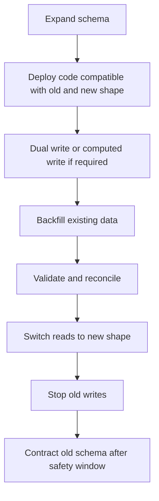

# Part 031 — Data Migration and Backfill

> **Scope:** This part explains how to perform production-safe data migration and backfill in PostgreSQL-backed enterprise Java/JAX-RS systems. It focuses on large-table updates, online migration, offline migration, chunking, batching, lock avoidance, throttling, resumability, validation, reconciliation, rollback strategy, and runbook design. It does **not** assume any internal CSG migration policy, schema, backfill framework, or operational runbook. Treat all internal references as verification prompts.

## 1. Core mental model

A schema migration changes the **shape** of the database.

A data migration changes the **meaning, location, representation, or completeness** of data.

A backfill is a data migration that fills a new or corrected data shape from existing data.

```text
Existing production data
  ↓
New schema / new invariant / new read model / new event model
  ↓
Backfill process
  ↓
Validated target data
  ↓
Application safely switches reads/writes
```

The dangerous part is not writing an `UPDATE` statement.

The dangerous part is writing an `UPDATE` statement that:

- locks too much,
- runs too long,
- blocks customer traffic,
- generates too much WAL,
- breaks replication lag targets,
- floods CDC/Kafka consumers,
- cannot resume after failure,
- cannot be validated,
- cannot be safely rolled forward,
- cannot be explained during an incident.

Senior engineer rule:

```text
A production backfill is an operational workflow, not a one-off SQL command.
```

## 2. Why data migration is harder than schema migration

A schema migration can often be quick:

```sql
ALTER TABLE quote ADD COLUMN normalized_status text;
```

A data migration may need to touch millions or billions of rows:

```sql
UPDATE quote
SET normalized_status = lower(status)
WHERE normalized_status IS NULL;
```

That second statement can create operational pressure:

- row locks on many rows,
- index updates,
- WAL generation,
- autovacuum backlog,
- replication lag,
- bloat,
- buffer cache churn,
- longer checkpoints,
- CDC event storms,
- lock contention with live writes.

In a CPQ/order management system, data migration is especially risky because data often represents:

- quote lifecycle state,
- order fulfillment status,
- effective-dated catalog/pricing rules,
- customer/account linkage,
- approval/audit history,
- idempotency or outbox state,
- externally visible contractual records.

Incorrect migration is not just a technical bug. It can become business data corruption.

## 3. Common reasons for backfill

Backfills commonly happen when the team needs to:

1. populate a new column,
2. derive a new denormalized read model,
3. normalize legacy values,
4. fix inconsistent historical data,
5. add tenant/account ownership metadata,
6. migrate from JSONB to relational columns,
7. migrate from relational columns to governed JSONB payloads,
8. introduce a new status/state machine representation,
9. populate search vectors,
10. populate materialized reporting structures,
11. build an outbox/inbox table from existing state,
12. correct historical timestamps or effective dates,
13. split one table into multiple tables,
14. merge duplicate reference data,
15. repair data after application bug.

Each case has different correctness and rollback constraints.

## 4. Migration taxonomy

### 4.1 Schema migration

Changes database structure.

Examples:

```sql
ALTER TABLE quote ADD COLUMN normalized_status text;
CREATE INDEX CONCURRENTLY idx_quote_normalized_status ON quote(normalized_status);
```

### 4.2 Data migration

Changes existing data.

Examples:

```sql
UPDATE quote SET normalized_status = lower(status);
```

### 4.3 Backfill

Fills data into a new or corrected representation.

Example:

```sql
UPDATE quote
SET normalized_status = lower(status)
WHERE normalized_status IS NULL;
```

### 4.4 Online migration

Runs while production traffic continues.

This requires:

- backward-compatible schema,
- controlled write path,
- idempotent backfill,
- throttling,
- observability,
- conflict handling,
- safe cutover.

### 4.5 Offline migration

Runs during maintenance window or traffic pause.

This may be simpler but still needs:

- backup/restore plan,
- rollback/roll-forward plan,
- duration estimate,
- lock impact assessment,
- validation queries,
- stakeholder communication.

### 4.6 One-time script

A script manually or semi-manually executed once.

Risk: no ownership, no observability, no repeatability.

### 4.7 Managed backfill job

A controlled application/job process that:

- scans chunks,
- updates batches,
- records progress,
- retries safely,
- emits metrics,
- can be paused/resumed.

For large production systems, this is often the safest model.

## 5. The expand-contract migration pattern

Most safe production migrations follow this shape:



Example:

```text
Goal: replace quote.status with quote.lifecycle_status_id

1. Add lifecycle_status_id nullable.
2. Deploy code that writes both status and lifecycle_status_id.
3. Backfill lifecycle_status_id from existing status.
4. Validate no null lifecycle_status_id for active quotes.
5. Switch reads to lifecycle_status_id.
6. Stop writing old status.
7. Drop old status after safety window.
```

Never compress all steps into one risky release unless the table is small, traffic is controlled, and rollback is simple.

## 6. Backfill lifecycle

A production backfill should have a lifecycle.

```text
Design
  ↓
Dry run
  ↓
Staging run
  ↓
Production canary chunk
  ↓
Production controlled run
  ↓
Validation
  ↓
Reconciliation
  ↓
Cutover
  ↓
Cleanup
  ↓
Post-run review
```

### 6.1 Design

Define:

- source data,
- target data,
- transformation rule,
- invariant,
- expected row count,
- failure behavior,
- chunk key,
- retry strategy,
- validation query,
- cutover condition.

### 6.2 Dry run

Run the transformation on a small sample.

Ask:

- Does the logic handle nulls?
- Does it handle malformed data?
- Does it preserve business meaning?
- Does it produce deterministic output?
- Does it match domain expectations?

### 6.3 Staging run

Use production-like data volume if possible.

Measure:

- rows per second,
- WAL growth,
- lock wait,
- CPU,
- IO,
- query plan,
- replica lag,
- job restart behavior.

### 6.4 Production canary

Run one or a few chunks in production.

Verify:

- locks are short,
- application latency remains normal,
- no deadlocks,
- no replication/CDC lag explosion,
- validation queries pass,
- metrics are visible.

### 6.5 Controlled run

Run with throttle and pause capability.

Do not run blind.

### 6.6 Validation

Validate both technical and business invariants.

### 6.7 Reconciliation

Find and fix mismatches.

### 6.8 Cutover

Change reads/writes only when validation passes and rollback/roll-forward path is known.

### 6.9 Cleanup

Remove old columns/tables/indexes only after a safety window.

## 7. Large table update danger

A single large update looks simple:

```sql
UPDATE quote
SET normalized_status = lower(status)
WHERE normalized_status IS NULL;
```

But it can be dangerous because PostgreSQL MVCC does not update rows in place in the simplistic sense. An update creates new tuple versions and leaves old tuple versions for vacuum.

Consequences:

- many new row versions,
- dead tuples,
- table bloat,
- index bloat,
- WAL generation,
- replica lag,
- autovacuum pressure.

For a large table, prefer chunked updates.

## 8. Chunking

Chunking breaks a large migration into smaller bounded units.

Common chunk keys:

- primary key range,
- `created_at` range,
- partition key,
- tenant/account id,
- hash/modulo bucket.

### 8.1 Primary key range chunking

```sql
UPDATE quote
SET normalized_status = lower(status)
WHERE id >= :start_id
  AND id < :end_id
  AND normalized_status IS NULL;
```

Good when:

- primary key is indexed,
- rows are fairly evenly distributed,
- transformation is independent per row.

Risk:

- gaps in IDs,
- uneven row density,
- hot recent ranges,
- tenant skew.

### 8.2 Created-at range chunking

```sql
UPDATE quote
SET normalized_status = lower(status)
WHERE created_at >= :start_ts
  AND created_at < :end_ts
  AND normalized_status IS NULL;
```

Good for time-series or history tables.

Risk:

- timezone mistakes,
- range skew,
- missing index,
- mixing event time and processing time.

### 8.3 Tenant/account chunking

```sql
UPDATE quote
SET normalized_status = lower(status)
WHERE tenant_id = :tenant_id
  AND normalized_status IS NULL;
```

Good when data ownership is tenant-scoped.

Risk:

- one huge tenant dominates runtime,
- noisy-neighbor effect,
- customer-specific blast radius.

### 8.4 Partition chunking

```sql
UPDATE quote_2025_01
SET normalized_status = lower(status)
WHERE normalized_status IS NULL;
```

Good when table is partitioned by time or tenant.

Risk:

- partition pruning assumptions may be wrong,
- local indexes differ,
- default partition may hide unexpected rows.

## 9. Batching

Chunking defines the data range.

Batching defines how much work is committed at once.

Example pattern:

```sql
WITH batch AS (
    SELECT id
    FROM quote
    WHERE normalized_status IS NULL
    ORDER BY id
    LIMIT 1000
)
UPDATE quote q
SET normalized_status = lower(q.status)
FROM batch
WHERE q.id = batch.id;
```

This updates a limited set of rows per transaction.

Benefits:

- shorter locks,
- smaller transactions,
- easier retry,
- reduced WAL spikes,
- safer pause/resume.

Trade-off:

- more transaction overhead,
- more job orchestration,
- more validation complexity,
- possible race with live writes if not designed carefully.

## 10. Lock avoidance

A safe backfill should minimize lock duration and lock scope.

Principles:

1. Use indexed predicates.
2. Keep transactions short.
3. Avoid full-table updates.
4. Avoid unnecessary index updates.
5. Avoid changing frequently updated hot rows during peak traffic.
6. Use statement timeout and lock timeout.
7. Test query plan before running.
8. Avoid DDL and massive DML in the same transaction.

Example session settings for controlled migration jobs:

```sql
SET lock_timeout = '2s';
SET statement_timeout = '30s';
SET idle_in_transaction_session_timeout = '30s';
```

These values are examples, not defaults to copy blindly.

The goal is fail-fast, not block production traffic indefinitely.

## 11. `FOR UPDATE SKIP LOCKED` for worker-style backfills

For concurrent worker jobs, `SKIP LOCKED` can be used to claim rows without waiting on rows another worker is processing.

```sql
WITH picked AS (
    SELECT id
    FROM quote_backfill_work
    WHERE status = 'PENDING'
    ORDER BY id
    FOR UPDATE SKIP LOCKED
    LIMIT 100
)
UPDATE quote_backfill_work w
SET status = 'IN_PROGRESS',
    started_at = now()
FROM picked
WHERE w.id = picked.id
RETURNING w.id;
```

This is useful for job queue style processing.

But it has trade-offs:

- rows can be skipped temporarily,
- fairness is not guaranteed,
- stuck `IN_PROGRESS` rows need recovery,
- ordering is not a correctness guarantee,
- monitoring is required.

Use it for work claiming, not as a substitute for correctness.

## 12. Throttling

A backfill should be able to slow down.

Throttle dimensions:

- batch size,
- sleep between batches,
- max rows per second,
- max transactions per minute,
- max WAL generation threshold,
- max replica lag threshold,
- max CPU/IO threshold,
- only run outside peak hours.

Pseudo-loop:

```text
while work remains:
  process one batch
  observe database health
  if latency/lag/locks too high:
      sleep longer or pause
  else:
      continue
```

Do not design backfill speed only around application runtime. Design it around production health.

## 13. Resume capability

A production backfill must survive:

- process crash,
- pod restart,
- deployment rollback,
- database failover,
- network interruption,
- statement timeout,
- deadlock,
- partial batch failure.

A resumable job records progress.

Example checkpoint table:

```sql
CREATE TABLE quote_status_backfill_checkpoint (
    job_name text PRIMARY KEY,
    last_processed_id bigint,
    rows_processed bigint NOT NULL DEFAULT 0,
    status text NOT NULL,
    updated_at timestamptz NOT NULL DEFAULT now(),
    error_message text
);
```

But a checkpoint alone is not enough. The transformation must also be idempotent.

## 14. Idempotency

An idempotent backfill can be rerun without corrupting data.

Bad pattern:

```sql
UPDATE account
SET balance = balance + legacy_balance_delta;
```

Rerunning this doubles the effect.

Better pattern:

```sql
UPDATE account
SET migrated_balance = legacy_balance
WHERE migrated_balance IS DISTINCT FROM legacy_balance;
```

For derived values, compute from source of truth rather than applying incremental side effects when possible.

Idempotent rule:

```text
Running the same backfill twice should produce the same final state as running it once.
```

## 15. Checkpoint table pattern

A checkpoint table should capture enough state to resume and audit.

Example:

```sql
CREATE TABLE data_backfill_job (
    job_name text PRIMARY KEY,
    started_at timestamptz NOT NULL DEFAULT now(),
    updated_at timestamptz NOT NULL DEFAULT now(),
    status text NOT NULL CHECK (status IN ('RUNNING', 'PAUSED', 'FAILED', 'DONE')),
    last_key text,
    rows_seen bigint NOT NULL DEFAULT 0,
    rows_changed bigint NOT NULL DEFAULT 0,
    failed_batches bigint NOT NULL DEFAULT 0,
    last_error text
);
```

For stronger auditing, add a child table:

```sql
CREATE TABLE data_backfill_batch_log (
    job_name text NOT NULL,
    batch_number bigint NOT NULL,
    key_start text,
    key_end text,
    rows_seen bigint NOT NULL,
    rows_changed bigint NOT NULL,
    started_at timestamptz NOT NULL,
    finished_at timestamptz,
    status text NOT NULL,
    error_message text,
    PRIMARY KEY (job_name, batch_number)
);
```

This helps during incident review.

## 16. Validation queries

Validation proves that target data matches expected invariants.

### 16.1 Completeness validation

```sql
SELECT count(*) AS remaining
FROM quote
WHERE normalized_status IS NULL;
```

### 16.2 Equivalence validation

```sql
SELECT count(*) AS mismatches
FROM quote
WHERE normalized_status IS DISTINCT FROM lower(status);
```

### 16.3 Domain validity validation

```sql
SELECT normalized_status, count(*)
FROM quote
GROUP BY normalized_status
ORDER BY count(*) DESC;
```

### 16.4 Referential validation

```sql
SELECT count(*) AS invalid_status_refs
FROM quote q
LEFT JOIN quote_status_ref r ON r.code = q.normalized_status
WHERE q.normalized_status IS NOT NULL
  AND r.code IS NULL;
```

### 16.5 Sampling validation

```sql
SELECT id, status, normalized_status
FROM quote
WHERE normalized_status IS DISTINCT FROM lower(status)
ORDER BY id
LIMIT 100;
```

Validation must be written before production execution whenever possible.

## 17. Reconciliation

Validation tells you what is wrong.

Reconciliation fixes or explains the mismatch.

A reconciliation process should answer:

- Which rows are inconsistent?
- Why are they inconsistent?
- Are they caused by old data, live writes, transformation bug, or partial failure?
- Can they be repaired automatically?
- Do they require domain owner review?
- Are customer-visible records affected?
- Does the correction need audit evidence?

For high-risk domain data, reconciliation may need a separate approval process.

## 18. Rollback vs roll-forward

For data migration, rollback is often harder than roll-forward.

### 18.1 Rollback

Rollback means returning data to the previous state.

This may require:

- backup table,
- old value capture,
- audit trail,
- point-in-time restore,
- reverse transformation,
- application rollback compatibility.

### 18.2 Roll-forward

Roll-forward means fixing the migration with another safe migration.

This is often preferred when:

- old data remains available,
- transformation is deterministic,
- only a subset of rows is wrong,
- application can tolerate corrected target data.

### 18.3 Backup shadow column/table

For high-risk transformations, store old values temporarily:

```sql
CREATE TABLE quote_status_backfill_backup AS
SELECT id, status, normalized_status, now() AS captured_at
FROM quote
WHERE normalized_status IS NULL;
```

Be careful: copying large tables also has storage and WAL cost.

## 19. Dual write risk

During expand-contract migration, application may write both old and new fields.

Example:

```text
quote.status
quote.normalized_status
```

Risks:

- dual write divergence,
- partial application rollback,
- one code path writes only old field,
- batch job overwrites live update,
- concurrent update race,
- CDC emits two representations.

Safer options:

1. write old field and derive new field synchronously,
2. write both in the same transaction,
3. validate divergence continuously,
4. prefer database constraint if possible after backfill,
5. remove old write path after cutover.

## 20. Read compatibility

A migration is not safe unless old and new application versions can coexist during deployment.

Rolling deployment means multiple pods may run different code versions at the same time.

Compatibility matrix:

| Database state | Old app reads | Old app writes | New app reads | New app writes | Safe? |
|---|---:|---:|---:|---:|---:|
| Column absent | yes | yes | no | no | no for new app |
| Column added nullable | yes | yes | yes | maybe | yes if guarded |
| Backfill in progress | yes | yes | yes if fallback exists | yes if dual write | conditional |
| New column required | no if old app writes null | no | yes | yes | only after old app gone |
| Old column dropped | no | no | yes | yes | only after contract |

Do not drop old structures until old application versions are impossible to run.

## 21. Java/JAX-RS impact

Backfill design affects Java/JAX-RS services in several ways.

### 21.1 Transaction boundary

Do not run huge backfills inside request-response endpoints.

Bad:

```text
POST /admin/backfill-all-quotes
  opens transaction
  updates millions of rows
  waits for minutes
```

Better:

```text
POST /admin/backfill-quote-status/start
  creates a controlled job record
  worker processes batches asynchronously
  API reports job status
```

### 21.2 HTTP timeout mismatch

HTTP timeouts are usually much shorter than safe migration duration.

A request may timeout while database work continues, causing ambiguous state.

### 21.3 Idempotent admin API

If an admin API starts a backfill, it should be idempotent:

```text
POST /backfills/quote-status/start
Idempotency-Key: abc
```

Repeated calls should not create duplicate jobs.

### 21.4 Domain service write compatibility

During backfill, normal write paths must not create rows missing target data.

Guard with:

- dual write,
- fallback read,
- validation job,
- temporary constraint after backfill,
- feature flag if used internally.

## 22. MyBatis impact

Backfills implemented in Java/MyBatis need careful mapper design.

### 22.1 Batch mapper

```xml
<update id="backfillQuoteStatusBatch">
  WITH batch AS (
    SELECT id
    FROM quote
    WHERE id &gt; #{lastId}
      AND normalized_status IS NULL
    ORDER BY id
    LIMIT #{batchSize}
  )
  UPDATE quote q
  SET normalized_status = lower(q.status)
  FROM batch
  WHERE q.id = batch.id
</update>
```

Review concerns:

- parameters must be bound with `#{}`,
- dynamic ORDER BY must not use unsafe user input,
- batch size must be bounded,
- query must use an index,
- transaction must be per batch,
- mapper result must expose rows changed.

### 22.2 Fetching IDs first

Sometimes it is safer to select IDs then update by ID.

Risk:

- two round trips,
- race between select and update,
- large memory if too many IDs,
- large `IN` clause.

### 22.3 Avoid one giant MyBatis executor batch

MyBatis batch executor can accumulate statements and memory.

For backfills, prefer controlled database-side batch SQL or bounded application batches.

## 23. CDC, Kafka, and outbox impact

Data migration can generate change events.

If CDC is enabled, a backfill may produce a flood of updates.

Questions to ask:

- Should backfilled updates be published as domain events?
- Will downstream consumers interpret them as customer actions?
- Will CDC connector lag grow?
- Will Kafka topic retention/throughput handle the spike?
- Are outbox rows generated by migration?
- Should migration mark events with a source/reason?
- Is replay safe?

Backfill is not isolated to PostgreSQL if CDC/event streaming is attached.

## 24. Kubernetes impact

In Kubernetes, backfill jobs need operational boundaries.

Check:

- `Job` vs long-running worker deployment,
- restart policy,
- resource requests/limits,
- pod eviction behavior,
- connection pool size,
- concurrency across replicas,
- secret/config injection,
- deployment rollback behavior,
- logs/metrics visibility,
- ability to pause/resume.

Danger pattern:

```text
10 job pods × 20 DB connections each = 200 extra DB connections
```

A backfill job should not starve the production service pool.

## 25. Cloud-managed PostgreSQL impact

On AWS/Azure managed PostgreSQL, watch:

- CPU credit/resource saturation,
- IOPS burst balance,
- storage autoscaling,
- WAL volume,
- replication lag,
- Performance Insights/Query Store visibility,
- parameter limits,
- maintenance windows,
- backup retention impact,
- read replica lag.

Cloud databases reduce infrastructure burden but do not make unsafe backfills safe.

## 26. On-prem impact

On-prem environments may have tighter operational constraints:

- fixed storage capacity,
- slower disk expansion,
- manual backup validation,
- custom monitoring stack,
- air-gapped deployment process,
- stricter maintenance windows,
- DBA-managed execution.

Backfill runbooks must respect local operational responsibility boundaries.

## 27. Backfill runbook template

A serious backfill should have a runbook.

```md
# Backfill Runbook: <name>

## Goal
What data invariant will be established?

## Scope
Tables, columns, tenants, partitions, date ranges.

## Preconditions
Schema version, app version, indexes, feature flags, backups.

## Execution plan
Batch size, throttle, concurrency, schedule, owner.

## Observability
Metrics, dashboards, queries, log fields.

## Stop conditions
Lock wait, replica lag, error rate, CPU/IO, customer impact.

## Validation
Completeness, equivalence, domain invariants, sample checks.

## Reconciliation
How mismatches will be repaired.

## Rollback / roll-forward
What to do if migration is wrong.

## Communication
Who needs to know before/during/after.

## Post-run cleanup
Old columns, indexes, jobs, feature flags, docs.
```

## 28. Failure modes

| Failure mode | Typical cause | Detection | Safer response |
|---|---|---|---|
| Production latency spike | batch too large, IO pressure | API latency, DB CPU/IO | pause, reduce batch size |
| Lock wait | unindexed predicate, long transaction | `pg_locks`, wait events | cancel batch, add index, retry smaller |
| Deadlock | competing write order | SQLSTATE `40P01` | retry transaction, fix lock order |
| Serialization failure | concurrent serializable transaction conflict | SQLSTATE `40001` | retry whole transaction |
| Replica lag | WAL burst | replication metrics | pause/throttle |
| Disk growth | WAL/bloat/temp files | disk dashboard | pause, vacuum planning, storage action |
| CDC lag | update storm | connector lag | throttle, coordinate consumers |
| Data mismatch | transformation bug | validation query | stop, reconcile, roll-forward |
| Non-resumable failure | no checkpoint | job logs only | manual analysis, write repair plan |
| Duplicate processing | non-idempotent job | inconsistent values | stop, restore/repair |
| App compatibility break | contract too early | errors in old pods | rollback app or restore compatibility |

## 29. Debugging playbook

When a backfill causes trouble, do not guess.

### 29.1 Identify the active query

```sql
SELECT pid,
       state,
       wait_event_type,
       wait_event,
       now() - query_start AS age,
       query
FROM pg_stat_activity
WHERE query ILIKE '%quote%'
ORDER BY query_start;
```

### 29.2 Check blockers

```sql
SELECT blocked.pid AS blocked_pid,
       blocking.pid AS blocking_pid,
       blocked.query AS blocked_query,
       blocking.query AS blocking_query
FROM pg_stat_activity blocked
JOIN pg_locks blocked_locks
  ON blocked_locks.pid = blocked.pid
JOIN pg_locks blocking_locks
  ON blocking_locks.locktype = blocked_locks.locktype
 AND blocking_locks.database IS NOT DISTINCT FROM blocked_locks.database
 AND blocking_locks.relation IS NOT DISTINCT FROM blocked_locks.relation
 AND blocking_locks.page IS NOT DISTINCT FROM blocked_locks.page
 AND blocking_locks.tuple IS NOT DISTINCT FROM blocked_locks.tuple
 AND blocking_locks.virtualxid IS NOT DISTINCT FROM blocked_locks.virtualxid
 AND blocking_locks.transactionid IS NOT DISTINCT FROM blocked_locks.transactionid
 AND blocking_locks.classid IS NOT DISTINCT FROM blocked_locks.classid
 AND blocking_locks.objid IS NOT DISTINCT FROM blocked_locks.objid
 AND blocking_locks.objsubid IS NOT DISTINCT FROM blocked_locks.objsubid
 AND blocking_locks.pid <> blocked_locks.pid
JOIN pg_stat_activity blocking
  ON blocking.pid = blocking_locks.pid
WHERE NOT blocked_locks.granted
  AND blocking_locks.granted;
```

### 29.3 Check row progress

```sql
SELECT count(*) AS remaining
FROM quote
WHERE normalized_status IS NULL;
```

### 29.4 Check batch log

```sql
SELECT *
FROM data_backfill_batch_log
WHERE job_name = 'quote-status-backfill'
ORDER BY batch_number DESC
LIMIT 20;
```

### 29.5 Check database health

Look at:

- CPU,
- IO,
- active sessions,
- lock waits,
- temp file generation,
- WAL generation,
- replication lag,
- autovacuum activity,
- application latency.

## 30. Production-safe SQL patterns

### 30.1 Use bounded batches

```sql
WITH batch AS (
    SELECT id
    FROM quote
    WHERE normalized_status IS NULL
    ORDER BY id
    LIMIT 1000
)
UPDATE quote q
SET normalized_status = lower(q.status)
FROM batch
WHERE q.id = batch.id;
```

### 30.2 Avoid unnecessary writes

```sql
UPDATE quote
SET normalized_status = lower(status)
WHERE normalized_status IS DISTINCT FROM lower(status);
```

This avoids updating rows that already have correct values.

### 30.3 Prefer deterministic transformations

Good:

```sql
SET normalized_status = lower(status)
```

Riskier:

```sql
SET normalized_status = some_external_api_result(status)
```

Backfills should not depend on unstable external systems unless explicitly designed for it.

### 30.4 Add supporting index first when necessary

```sql
CREATE INDEX CONCURRENTLY idx_quote_backfill_status_null
ON quote(id)
WHERE normalized_status IS NULL;
```

This can help a batch query find remaining work.

But remember: indexes have write overhead and must be cleaned up if temporary.

## 31. Backfill PR review checklist

Ask these before approving:

### 31.1 Correctness

- What invariant is being established?
- Is the transformation deterministic?
- Is it idempotent?
- Are nulls/malformed values handled?
- Is historical domain meaning preserved?
- Is tenant/account isolation respected?

### 31.2 Performance

- How many rows are touched?
- What is the query plan?
- Are predicates indexed?
- What batch size is used?
- What is expected WAL generation?
- What is expected runtime?

### 31.3 Concurrency

- Can live writes race with backfill?
- Is dual write required?
- Does the job use short transactions?
- Are lock/statement timeouts set?
- Are deadlock/serialization failures retried safely?

### 31.4 Operations

- Is there a runbook?
- Can the job pause/resume?
- Are metrics/logs available?
- What are stop conditions?
- Who owns execution?

### 31.5 Validation

- What validation queries prove success?
- How are mismatches reconciled?
- Is there a sample audit?
- Is there a post-run report?

### 31.6 Rollback/roll-forward

- Can old app and new app coexist?
- Is rollback possible?
- If not, what is roll-forward plan?
- Is source data preserved until after cutover?

### 31.7 Event/CDC impact

- Does this generate outbox events?
- Does this generate CDC traffic?
- Will downstream systems misinterpret updates?
- Is Kafka/Debezium lag monitored?

## 32. Internal verification checklist

Verify in CSG/team context:

- Which migration tool is used: Liquibase, Flyway, custom, or platform-managed.
- Whether backfills are run through app jobs, DB scripts, CI/CD, GitOps, DBA process, or SRE runbooks.
- Whether production data migrations require DBA/platform approval.
- Existing backfill framework or reusable job pattern.
- Existing checkpoint/progress table pattern.
- Standard batch size/concurrency guidance.
- Standard `lock_timeout`, `statement_timeout`, and transaction timeout configuration.
- Whether production backfills are allowed during business hours.
- Whether CDC/Debezium/Kafka captures updates from migrated tables.
- Whether backfill-generated events should be suppressed, marked, or published normally.
- Whether read replicas/reporting systems are affected.
- Whether managed cloud database metrics are available to backend engineers.
- Whether slow query logs and `pg_stat_statements` are accessible.
- Whether production restore/PITR is verified before high-risk migration.
- Whether migration PR template includes data migration section.
- Whether incident notes contain prior failed migrations or backfills.

## 33. Practical senior-engineer heuristics

Use these heuristics in review:

```text
If it touches many rows, ask for batching.
If it runs long, ask for resume.
If it changes meaning, ask for validation.
If it changes externally visible data, ask for audit.
If it emits events, ask for downstream impact.
If it cannot rollback, ask for roll-forward.
If it requires manual execution, ask for runbook.
If it cannot be observed, do not trust it.
```

## 34. What good looks like

A production-ready backfill proposal includes:

- schema compatibility plan,
- application compatibility matrix,
- indexed chunking strategy,
- bounded transaction size,
- throttling and pause/resume,
- checkpoint table or equivalent,
- idempotent transformation,
- validation queries,
- reconciliation strategy,
- CDC/outbox impact assessment,
- rollback/roll-forward plan,
- dashboard and alert references,
- owner and execution window,
- post-run cleanup plan.

## 35. References to verify against official docs

Use official PostgreSQL documentation for:

- transaction isolation and serialization failure handling,
- explicit locking and lock wait behavior,
- runtime configuration for statement and lock timeout,
- `pg_stat_activity` and lock diagnosis,
- WAL and replication impact.

Use internal team documentation for:

- approved migration tool,
- production execution process,
- DBA/SRE approval path,
- cloud/on-prem database operation policy,
- CSG-specific schema and data ownership.
