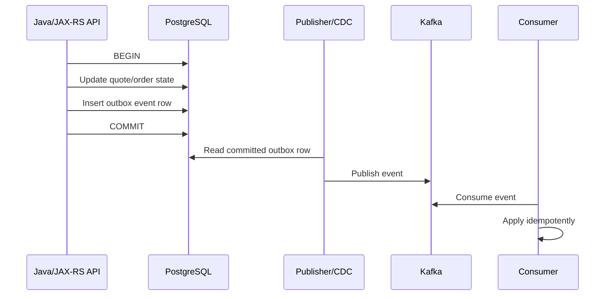
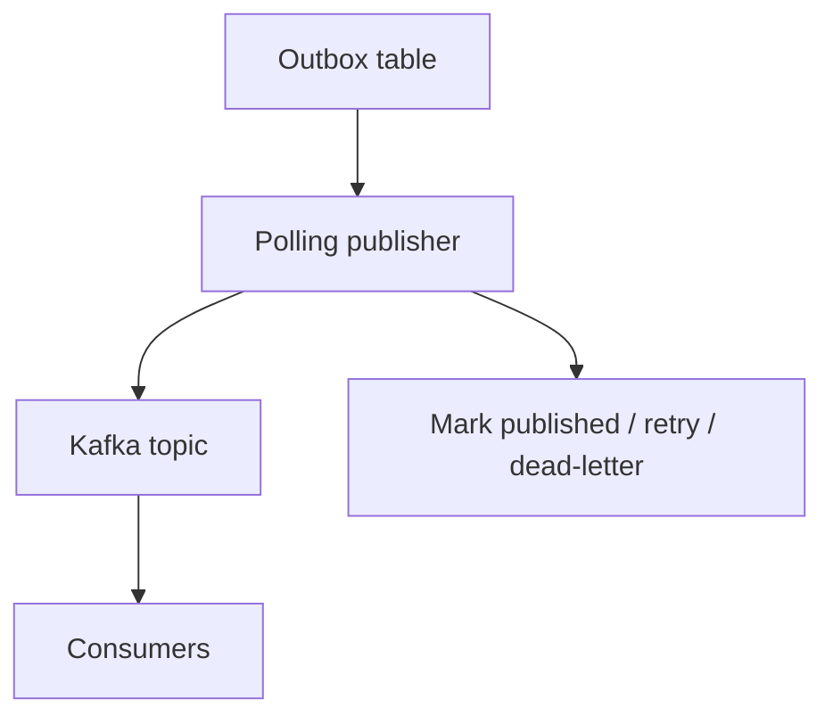
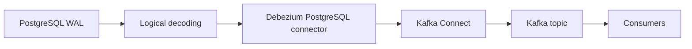
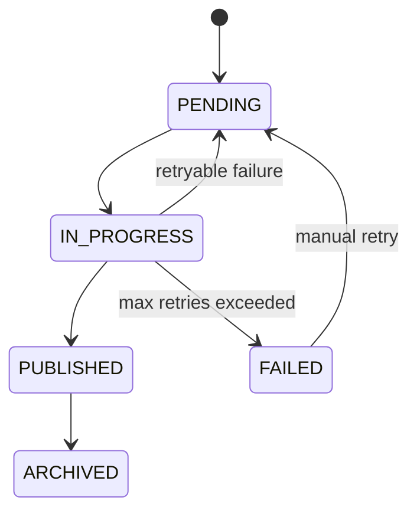

# Part 032 — Outbox, Inbox, CDC, and Event Consistency

> **Scope:** This part explains how PostgreSQL-backed Java/JAX-RS services can publish and consume events safely using transactional outbox, inbox, CDC, logical decoding, Debezium, Kafka, and reconciliation. It focuses on correctness, failure modes, duplicate handling, out-of-order handling, replay, WAL/replication-slot impact, and production observability. It does **not** assume CSG uses any specific outbox schema, Debezium configuration, Kafka topic design, or event governance policy. Verify all internal details.

## 1. Core mental model

A database transaction changes state.

An event tells other systems that state changed.

The hard problem is making those two things consistent.

```text
Business transaction commits in PostgreSQL
  ↓
Event must eventually be visible to other services
  ↓
Consumers must handle duplicates, retries, lag, replay, and ordering gaps
```

The core rule:

```text
State change and event production must not be two unrelated side effects.
```

If the database commit succeeds but the event publish fails, downstream systems miss a change.

If the event publish succeeds but the database commit rolls back, downstream systems observe a change that never happened.

Outbox/CDC patterns exist to remove that dual-write failure.

## 2. The dual-write problem

Naive service code often looks like this:

```java
quoteRepository.updateStatus(quoteId, APPROVED);
kafkaProducer.send("quote-events", new QuoteApprovedEvent(quoteId));
```

This has multiple failure windows:

| Failure point | Database state | Event state | Result |
|---|---|---|---|
| DB update fails | not changed | not sent | safe failure |
| DB commit succeeds, Kafka send fails | changed | missing | downstream inconsistency |
| Kafka send succeeds, DB rollback happens | not changed | sent | false event |
| Process crashes between DB and Kafka | maybe changed | maybe missing | ambiguous |
| Retry sends event twice | changed | duplicate | consumer must handle duplicate |

The solution is not to hope failures are rare.

The solution is to design the write path so failure is recoverable.

## 3. Transactional outbox pattern

The transactional outbox pattern writes business data and event data in the same database transaction.



The invariant:

```text
If the business change commits, the outbox row commits.
If the business change rolls back, the outbox row rolls back.
```

This avoids dual-write between PostgreSQL and Kafka inside the request transaction.

## 4. Example outbox table

A minimal outbox table may look like this:

```sql
CREATE TABLE outbox_event (
    id uuid PRIMARY KEY,
    aggregate_type text NOT NULL,
    aggregate_id text NOT NULL,
    event_type text NOT NULL,
    event_version integer NOT NULL,
    payload jsonb NOT NULL,
    headers jsonb NOT NULL DEFAULT '{}'::jsonb,
    status text NOT NULL DEFAULT 'PENDING',
    created_at timestamptz NOT NULL DEFAULT now(),
    published_at timestamptz,
    retry_count integer NOT NULL DEFAULT 0,
    last_error text
);

CREATE INDEX idx_outbox_event_pending
ON outbox_event(created_at, id)
WHERE status = 'PENDING';
```

This is only a teaching schema. Do not assume it matches internal CSG schemas.

Important design dimensions:

- event identity,
- aggregate identity,
- event type,
- event version,
- payload format,
- headers/correlation id,
- status lifecycle,
- retention,
- indexing,
- ordering assumptions,
- publishing mechanism.

## 5. Writing outbox events in the same transaction

Example service-level flow:

```text
approveQuote(command):
  begin transaction
    load quote for update
    validate transition
    update quote status
    insert quote.approved outbox event
  commit
```

The database transaction includes both:

```sql
UPDATE quote
SET status = 'APPROVED',
    updated_at = now()
WHERE id = :quote_id
  AND status = 'PENDING_APPROVAL';

INSERT INTO outbox_event (
    id,
    aggregate_type,
    aggregate_id,
    event_type,
    event_version,
    payload,
    headers
) VALUES (
    :event_id,
    'QUOTE',
    :quote_id,
    'QuoteApproved',
    1,
    :payload::jsonb,
    :headers::jsonb
);
```

If the transaction fails, both changes fail.

## 6. Polling publisher pattern

A polling publisher reads pending outbox rows and publishes them to Kafka.



Claim rows safely:

```sql
WITH picked AS (
    SELECT id
    FROM outbox_event
    WHERE status = 'PENDING'
    ORDER BY created_at, id
    FOR UPDATE SKIP LOCKED
    LIMIT 100
)
UPDATE outbox_event e
SET status = 'IN_PROGRESS',
    retry_count = retry_count + 1
FROM picked
WHERE e.id = picked.id
RETURNING e.*;
```

After successful publish:

```sql
UPDATE outbox_event
SET status = 'PUBLISHED',
    published_at = now(),
    last_error = NULL
WHERE id = :id;
```

If publish fails:

```sql
UPDATE outbox_event
SET status = 'PENDING',
    last_error = :error
WHERE id = :id;
```

Polling publisher strengths:

- simple mental model,
- explicit status tracking,
- easy operational dashboard,
- easy retry and dead-letter handling,
- no logical decoding dependency.

Weaknesses:

- extra database reads/writes,
- polling latency,
- status update contention under high throughput,
- risk of duplicate publish if crash occurs after Kafka publish but before marking row published.

That duplicate risk is why consumers must be idempotent.

## 7. CDC-based outbox pattern

CDC-based outbox uses database change capture to stream inserted outbox rows.



The application inserts an outbox row in the same transaction as business changes.

Debezium reads committed changes from PostgreSQL logical decoding and emits them into Kafka.

Strengths:

- no polling query load,
- event stream follows committed database changes,
- good fit for high-throughput change streams,
- can preserve commit-order characteristics within connector constraints.

Weaknesses:

- operational complexity,
- replication slot/WAL retention risk,
- connector lag must be monitored,
- schema evolution must be governed,
- cloud/on-prem support differs,
- connector outage can retain WAL and consume disk.

CDC does not remove the need for idempotent consumers.

## 8. PostgreSQL logical decoding

Logical decoding extracts changes from PostgreSQL WAL into a logical change stream.

Conceptually:

```text
Table changes
  ↓
WAL records
  ↓
Logical decoding output plugin
  ↓
CDC connector
  ↓
Kafka/event stream
```

For Debezium PostgreSQL, logical decoding uses replication slots.

A replication slot tells PostgreSQL what WAL must be retained until the consumer has processed it.

This prevents the connector from missing changes, but it creates an operational risk:

```text
If the connector stops consuming, PostgreSQL may retain WAL needed by the slot.
If WAL retention grows too much, disk pressure can become an incident.
```

## 9. Replication slot operational risk

Replication slots are correctness tools with storage consequences.

Monitor:

- slot active/inactive state,
- retained WAL bytes,
- confirmed flush LSN,
- restart LSN,
- connector lag,
- disk usage,
- publication/table scope,
- connector errors.

Failure pattern:

```text
Debezium connector down
  ↓
Replication slot stops advancing
  ↓
PostgreSQL retains WAL
  ↓
Disk usage grows
  ↓
Primary database enters storage pressure
  ↓
Production incident
```

A CDC system is only production-ready if replication slot monitoring and runbooks exist.

## 10. Debezium PostgreSQL connector mental model

Debezium PostgreSQL connector commonly handles two phases:

1. initial snapshot,
2. streaming changes.

### 10.1 Initial snapshot

The connector captures current table state as a baseline.

Risks:

- snapshot load on primary,
- long snapshot duration,
- schema changes during snapshot,
- inconsistent assumptions by consumers,
- large topic bootstrap volume.

### 10.2 Streaming changes

After snapshot, connector streams committed changes.

Risks:

- connector outage,
- replication slot lag,
- schema evolution mismatch,
- topic routing mistakes,
- serialization incompatibility,
- downstream consumer lag.

## 11. Event table status lifecycle

If using polling publisher, event status is explicit:



If using CDC-based outbox, status may be unnecessary or used only for audit/retention.

Do not mix status semantics without clear purpose.

## 12. Inbox pattern

Outbox solves reliable publishing.

Inbox solves reliable consuming.

An inbox table records consumed event IDs so processing is idempotent.

```sql
CREATE TABLE inbox_event_consumption (
    consumer_name text NOT NULL,
    event_id uuid NOT NULL,
    consumed_at timestamptz NOT NULL DEFAULT now(),
    source_topic text,
    source_partition integer,
    source_offset bigint,
    PRIMARY KEY (consumer_name, event_id)
);
```

Consumer flow:

```text
receive event
  ↓
begin transaction
  ↓
insert into inbox_event_consumption
  ↓
if insert succeeds: apply business change
  ↓
if duplicate key: skip as already processed
  ↓
commit
```

Example:

```sql
INSERT INTO inbox_event_consumption (consumer_name, event_id, source_topic, source_partition, source_offset)
VALUES (:consumer_name, :event_id, :topic, :partition, :offset)
ON CONFLICT DO NOTHING;
```

If rows inserted = 0, it is a duplicate.

## 13. At-least-once reality

Most practical event systems should be treated as at-least-once.

That means:

```text
An event may be delivered more than once.
```

Consumer design must tolerate duplicates.

Do not build correctness on exactly-once marketing language unless the entire end-to-end chain is proven under your failure model.

Safer assumption:

```text
Publish may duplicate.
Consume may duplicate.
Replay may duplicate.
Timeout may be ambiguous.
Retry may be repeated.
```

Therefore:

- event IDs must be stable,
- consumers must be idempotent,
- side effects must be guarded,
- external calls need idempotency keys,
- reconciliation must exist.

## 14. Duplicate event handling

Duplicate events can occur when:

- publisher retries after uncertain Kafka publish result,
- connector restarts,
- consumer offset commit fails,
- consumer crashes after processing but before committing offset,
- replay is initiated,
- DLQ message is reprocessed.

Idempotency strategies:

1. unique event ID in inbox table,
2. aggregate version check,
3. state transition guard,
4. idempotency key for external API calls,
5. natural unique constraint on target side effect,
6. deduplication window where appropriate.

Example state transition guard:

```sql
UPDATE order_fulfillment
SET status = 'SUBMITTED'
WHERE order_id = :order_id
  AND status = 'READY_TO_SUBMIT';
```

If the duplicate event arrives after status is already `SUBMITTED`, the update changes zero rows and should be handled as already applied or invalid depending on domain rules.

## 15. Out-of-order events

Events can arrive out of order due to:

- partitioning key mistakes,
- parallel consumers,
- replay mixed with live traffic,
- multiple publishers,
- cross-aggregate workflows,
- retries and DLQ reprocessing.

Design options:

### 15.1 Partition by aggregate ID

Kafka ordering is usually per partition. If events for the same aggregate must be ordered, use aggregate ID as key.

```text
key = quote_id
```

### 15.2 Aggregate version

Include version:

```json
{
  "eventId": "...",
  "aggregateType": "QUOTE",
  "aggregateId": "Q-123",
  "aggregateVersion": 17,
  "eventType": "QuoteApproved"
}
```

Consumer can detect gaps:

```text
expected version = 16
received version = 18
=> gap detected; pause/reconcile
```

### 15.3 State-based idempotency

If event ordering is not guaranteed, consumers can use current state and transition rules.

### 15.4 Reconciliation

For complex workflows, do not rely only on event order. Periodically reconcile against source of truth.

## 16. Replay

Replay means processing historical events again.

Reasons:

- rebuild read model,
- fix consumer bug,
- recover from data loss,
- migrate downstream schema,
- onboard new service,
- audit historical state.

Replay risks:

- duplicate side effects,
- external API calls repeated,
- old event schema incompatible,
- business rules changed since event time,
- mixed historical/live ordering,
- high load on consumers,
- read model divergence.

Replay-safe consumers distinguish:

```text
event-time business fact
vs
processing-time side effect
```

Do not call external fulfillment/payment/provisioning APIs again during replay unless explicitly intended and idempotently guarded.

## 17. Reconciliation

Event-driven systems need reconciliation because event delivery alone is not a proof of convergence.

Reconciliation checks whether downstream state matches source state.

Examples:

```sql
-- Source system
SELECT order_id, status, updated_at
FROM order_header
WHERE updated_at >= now() - interval '1 day';
```

Compare with downstream read model:

```sql
SELECT order_id, status, source_updated_at
FROM order_read_model
WHERE source_updated_at >= now() - interval '1 day';
```

Reconciliation questions:

- Are all source aggregates represented downstream?
- Are statuses equal?
- Are versions equal?
- Are deleted/cancelled states handled?
- Are late events applied?
- Are duplicates ignored?
- Is mismatch auto-repairable?

For enterprise order systems, reconciliation is not optional. It is part of correctness.

## 18. Event schema governance

Events are public contracts between services.

Governance dimensions:

- event naming,
- event versioning,
- payload compatibility,
- required/optional fields,
- enum evolution,
- timestamp semantics,
- correlation/causation IDs,
- tenant/account identifiers,
- PII classification,
- retention,
- schema registry if used,
- deprecation policy.

Bad event schema:

```json
{
  "status": "DONE",
  "data": {}
}
```

Better event schema:

```json
{
  "eventId": "3e3c6f20-7e25-4bb3-a38d-1cfdc56c67c1",
  "eventType": "QuoteApproved",
  "eventVersion": 1,
  "aggregateType": "QUOTE",
  "aggregateId": "Q-123",
  "aggregateVersion": 17,
  "occurredAt": "2026-07-11T08:15:30Z",
  "tenantId": "T-001",
  "correlationId": "REQ-abc",
  "payload": {
    "quoteId": "Q-123",
    "approvedBy": "U-456",
    "approvedAt": "2026-07-11T08:15:30Z"
  }
}
```

Do not include unnecessary PII in events just because it is convenient.

## 19. Outbox payload strategy

Two common payload strategies:

### 19.1 Full event payload in outbox

Application writes complete event payload.

Pros:

- publisher is simple,
- event reflects transaction-time state,
- no need to re-query aggregate,
- easier audit.

Cons:

- application owns event serialization,
- payload may duplicate data,
- schema evolution must be explicit.

### 19.2 Reference-only outbox

Application writes aggregate ID and event type. Publisher loads current data later.

Pros:

- smaller outbox row,
- publisher can enrich.

Cons:

- publisher may read changed state, not event-time state,
- extra DB load,
- harder correctness reasoning,
- risk of publishing wrong historical fact.

For domain events, prefer event-time payload unless there is a strong reason not to.

## 20. Ordering model

Define ordering explicitly.

Possible ordering scopes:

- no ordering guarantee,
- per aggregate ordering,
- per tenant ordering,
- global ordering,
- causal ordering across aggregates.

Global ordering is expensive and often unnecessary.

For quote/order systems, per aggregate ordering is often enough:

```text
all events for quote Q-123 preserve order
but events across Q-123 and Q-456 may interleave arbitrarily
```

If cross-aggregate ordering matters, it usually indicates a workflow/saga/reconciliation problem, not just a Kafka configuration problem.

## 21. Polling outbox vs CDC outbox

| Dimension | Polling outbox | CDC outbox |
|---|---|---|
| Operational complexity | lower | higher |
| Database query load | polling load | WAL/logical decoding load |
| Latency | polling interval dependent | often lower |
| Retry visibility | explicit status table | connector/topic tooling |
| WAL retention risk | normal | replication slot risk |
| Deployment dependency | app/job | Kafka Connect/Debezium/platform |
| Debuggability | simple SQL status | connector + DB + Kafka |
| Scale ceiling | can be enough for many systems | better for high-throughput change streams |
| Failure mode | duplicate publish, stuck rows | slot lag, WAL growth, connector lag |

Neither is universally better.

Choose based on throughput, operational maturity, observability, team ownership, and platform support.

## 22. Java/JAX-RS transaction boundary

Outbox insert should happen in the same service transaction as the state change.

Bad:

```text
transaction 1: update quote
transaction 2: insert outbox
```

Good:

```text
transaction 1:
  update quote
  insert outbox
commit
```

The JAX-RS endpoint should not publish to Kafka synchronously as part of the request unless the system intentionally accepts the coupling and failure mode.

Better request flow:

```text
HTTP request
  ↓
service transaction updates PostgreSQL and inserts outbox
  ↓
HTTP response returns after commit
  ↓
publisher/CDC publishes event asynchronously
```

## 23. MyBatis implementation concerns

### 23.1 Mapper should participate in same transaction

```java
quoteMapper.updateStatus(command);
outboxMapper.insertEvent(event);
```

Both must use the same transaction/session boundary.

### 23.2 Use stable event IDs

Do not generate a new event ID on every retry if the command is retried idempotently.

A stable event ID can be derived from command ID/idempotency key if domain-appropriate.

### 23.3 JSONB payload mapping

If outbox payload is JSONB, ensure:

- safe serialization,
- explicit event version,
- stable timestamp format,
- no accidental null omission that breaks consumers,
- no unsafe string concatenation,
- proper TypeHandler or explicit cast.

Example SQL:

```xml
<insert id="insertOutboxEvent">
  INSERT INTO outbox_event (
      id,
      aggregate_type,
      aggregate_id,
      event_type,
      event_version,
      payload,
      headers
  ) VALUES (
      #{id},
      #{aggregateType},
      #{aggregateId},
      #{eventType},
      #{eventVersion},
      #{payload,jdbcType=OTHER}::jsonb,
      #{headers,jdbcType=OTHER}::jsonb
  )
</insert>
```

The exact TypeHandler/configuration must be verified internally.

## 24. Kafka integration concerns

Kafka is usually not the source of truth for transactional state.

PostgreSQL remains the source of truth for the owning service.

Kafka distributes facts/events to other systems.

Review:

- topic naming,
- partition key,
- replication factor,
- retention,
- compaction if used,
- schema registry if used,
- consumer group strategy,
- retry topic / DLQ policy,
- replay process,
- security/ACL,
- PII handling.

## 25. CDC and backfill interaction

Backfills can create large CDC streams.

Cases:

### 25.1 Backfill updates business table captured by CDC

Every updated row may emit a change event.

Risk:

- connector lag,
- Kafka flood,
- downstream reprocessing,
- consumers misread migration as domain activity.

### 25.2 Backfill inserts outbox rows

Historical outbox event generation may be intentional.

Risk:

- replay storm,
- duplicate historical facts,
- bad event ordering relative to live events.

### 25.3 Backfill should not emit domain events

Then design must avoid using event-producing write path or mark migration source clearly.

This decision must be explicit.

## 26. Retention and archival

Outbox/inbox tables grow forever unless retained.

Retention decisions:

- how long to keep published outbox rows,
- whether archived rows are needed for audit,
- whether replay depends on outbox history,
- whether Kafka is source of replay,
- how to partition outbox/inbox tables,
- whether deletion generates CDC events,
- whether retention affects compliance.

Example partition strategy:

```text
outbox_event_2026_07
outbox_event_2026_08
outbox_event_2026_09
```

Retention delete must be batched and observable.

## 27. Security and privacy

Events can leak data.

Review:

- Does payload include PII?
- Is PII necessary for consumers?
- Is payload encrypted in transit?
- Is Kafka topic access controlled?
- Are logs redacted?
- Are headers safe?
- Are audit requirements met?
- Are retention rules compatible with privacy requirements?

Do not put sensitive customer data into events for convenience.

## 28. Observability

Outbox/CDC systems require end-to-end observability.

### 28.1 Outbox metrics

- pending event count,
- oldest pending event age,
- publish success rate,
- publish failure rate,
- retry count,
- dead-letter count,
- publish latency,
- rows archived/deleted.

### 28.2 CDC metrics

- connector running state,
- replication slot lag,
- retained WAL bytes,
- source LSN progress,
- Kafka Connect task errors,
- snapshot state,
- table capture errors.

### 28.3 Kafka metrics

- producer error rate,
- topic throughput,
- consumer lag,
- DLQ volume,
- partition skew,
- broker availability.

### 28.4 Consumer metrics

- processed event count,
- duplicate count,
- processing latency,
- failure count,
- retry count,
- reconciliation mismatch count.

## 29. Failure modes

| Failure mode | Cause | Detection | Response |
|---|---|---|---|
| Missing event | dual-write bug, outbox insert missing | reconciliation | repair event/outbox, fix transaction boundary |
| Duplicate event | retry, crash, replay | inbox duplicate count | ensure idempotency |
| Out-of-order event | partitioning/concurrency | version gap | buffer, reject, reconcile |
| Outbox stuck | publisher down, bad row | oldest pending age | restart/fix/publish manually with runbook |
| Event poison pill | invalid payload | repeated publish/consume failure | DLQ, schema fix, repair row |
| CDC slot lag | connector down/slow | slot lag/WAL retention | restart connector, scale, pause writes if severe |
| WAL disk growth | inactive slot | disk usage, slot metrics | fix/drop slot only with impact analysis |
| Consumer lag | slow downstream | Kafka consumer lag | scale/optimize/throttle |
| False event | event published for rolled-back state | impossible with proper outbox | audit and repair if dual write existed |
| Replay side effect | consumer not replay-safe | duplicate external calls | disable side effects, add idempotency |
| Schema break | incompatible event change | consumer deserialization errors | rollback/compat fix |
| Privacy leak | payload includes sensitive data | audit/security review | redact, rotate, notify per policy |

## 30. Debugging playbook

### 30.1 Is event missing or just delayed?

Check:

- source aggregate state,
- outbox row exists,
- outbox status,
- publisher logs,
- Kafka topic offset,
- consumer group lag,
- downstream state.

### 30.2 Query pending outbox

```sql
SELECT status,
       count(*) AS count,
       min(created_at) AS oldest,
       max(created_at) AS newest
FROM outbox_event
GROUP BY status;
```

### 30.3 Find old pending rows

```sql
SELECT id,
       aggregate_type,
       aggregate_id,
       event_type,
       created_at,
       retry_count,
       last_error
FROM outbox_event
WHERE status IN ('PENDING', 'IN_PROGRESS')
ORDER BY created_at
LIMIT 100;
```

### 30.4 Check duplicate consumption

```sql
SELECT event_id, count(*)
FROM inbox_event_consumption
WHERE consumer_name = :consumer_name
GROUP BY event_id
HAVING count(*) > 1;
```

A proper primary key should prevent duplicates. If this returns rows, the inbox design is broken or the query is against a non-unique audit table.

### 30.5 Check CDC slot health

Use PostgreSQL replication slot views and platform metrics to check whether the slot is active and advancing.

Operationally important fields include slot name, active state, restart LSN, confirmed flush LSN, and retained WAL size/lag depending on version and monitoring tooling.

### 30.6 Reconcile source and projection

For a read model:

```sql
SELECT s.order_id, s.status AS source_status, r.status AS read_model_status
FROM order_header s
LEFT JOIN order_read_model r ON r.order_id = s.order_id
WHERE s.updated_at >= now() - interval '1 day'
  AND r.status IS DISTINCT FROM s.status
LIMIT 100;
```

## 31. Production runbook checklist

A production outbox/CDC runbook should define:

- how to verify publisher health,
- how to pause publisher safely,
- how to retry failed events,
- how to move poison events to DLQ,
- how to replay events,
- how to detect duplicate events,
- how to handle consumer lag,
- how to handle Debezium/Kafka Connect restart,
- how to handle replication slot WAL growth,
- when it is safe to drop/recreate a slot,
- how to reconcile downstream state,
- how to communicate customer impact.

Never drop a replication slot just to free disk unless the data-loss and re-snapshot implications are understood.

## 32. PR review checklist

### 32.1 Transaction and correctness

- Is business state and outbox row written in the same transaction?
- Is event ID stable and unique?
- Is event payload event-time correct?
- Is transaction boundary clear in Java/JAX-RS service?
- Does MyBatis mapper participate in the same transaction?

### 32.2 Event design

- Is event type named clearly?
- Is event version explicit?
- Is aggregate ID present?
- Is aggregate version needed?
- Are occurredAt, correlationId, causationId included if required?
- Is payload backward-compatible?

### 32.3 Delivery semantics

- Are consumers idempotent?
- Is duplicate handling tested?
- Is out-of-order handling defined?
- Is replay safe?
- Is reconciliation available?

### 32.4 Operational readiness

- Is pending event age monitored?
- Is connector lag monitored?
- Is consumer lag monitored?
- Is DLQ monitored?
- Is retention defined?
- Is runbook available?

### 32.5 Security/privacy

- Does payload contain PII?
- Are topic ACLs correct?
- Are logs redacted?
- Is retention compliant?

### 32.6 Backfill/CDC interaction

- Will migration generate events?
- Should it?
- Can consumers survive event volume?
- Is CDC lag expected and monitored?

## 33. Internal verification checklist

Verify in CSG/team context:

- Whether services use transactional outbox, CDC-based outbox, direct Kafka publish, or another platform pattern.
- Actual outbox table schema if present.
- Actual inbox/deduplication pattern if present.
- Whether Debezium is used for PostgreSQL CDC.
- Which PostgreSQL logical decoding plugin/publication/replication slot setup is used.
- Whether replication slot lag and WAL retention are monitored.
- Which Kafka topics carry quote/order/catalog events.
- Topic partition key strategy.
- Event schema governance and compatibility policy.
- Schema registry usage if any.
- DLQ/retry topic policy.
- Consumer idempotency standard.
- Reconciliation jobs for projections/read models.
- Event retention and replay strategy.
- Whether backfills emit CDC/domain events.
- Whether PII is allowed in event payloads.
- DBA/SRE/platform ownership boundary for CDC connector and replication slots.
- Incident history involving missing events, duplicate events, CDC lag, consumer lag, or WAL growth.

## 34. Senior-engineer heuristics

Use these during design review:

```text
If state changes and event publish are separate, expect lost events.
If consumers are not idempotent, expect duplicate damage.
If ordering is assumed but not designed, expect race bugs.
If replay calls external systems, expect production side effects.
If CDC uses slots but no slot monitoring exists, expect WAL incidents.
If event schema has no versioning, expect consumer breakage.
If reconciliation does not exist, expect silent divergence.
```

## 35. What good looks like

A production-ready event consistency design includes:

- transactional outbox or equivalent consistency mechanism,
- clear publisher model: polling or CDC,
- stable event identity,
- governed event schema/versioning,
- explicit ordering scope,
- idempotent consumers with inbox/deduplication,
- replay and DLQ strategy,
- reconciliation process,
- CDC/replication-slot monitoring if applicable,
- Kafka consumer lag monitoring,
- privacy/security review,
- retention/archival policy,
- runbook for stuck events and connector failures,
- PR checklist embedded in engineering workflow.

## 36. References to verify against official docs

Use official PostgreSQL documentation for:

- logical decoding,
- replication slots,
- WAL and replication configuration,
- transaction isolation and retry semantics,
- explicit locking and `SKIP LOCKED` behavior.

Use Debezium documentation for:

- PostgreSQL connector behavior,
- logical decoding integration,
- replication slot implications,
- snapshot and streaming lifecycle.

Use internal platform documentation for:

- approved CDC/Kafka architecture,
- event naming/versioning policy,
- schema registry policy,
- topic ownership,
- replay/DLQ process,
- operational responsibility boundary.
