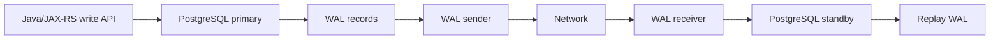
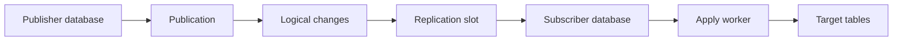
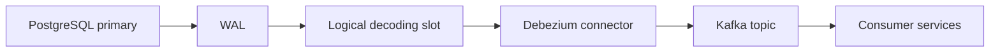
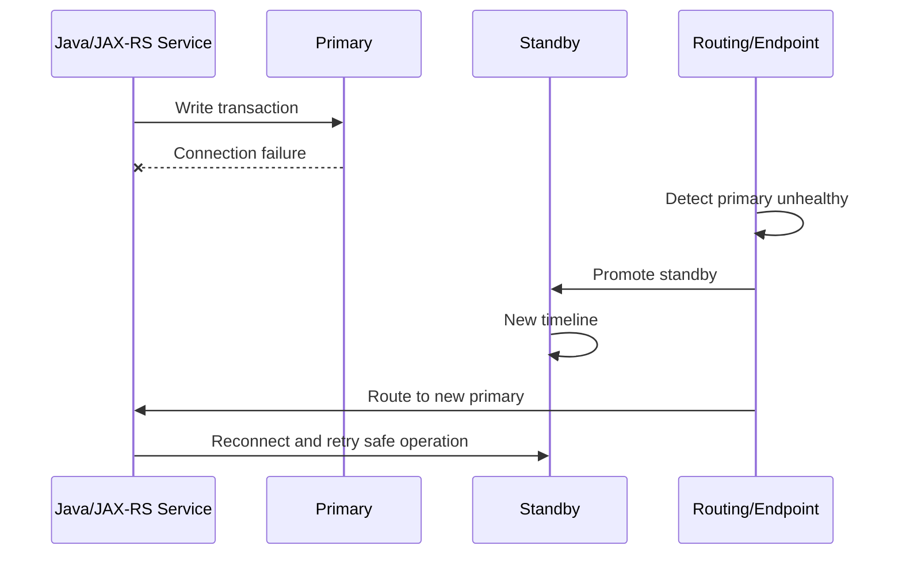

# Part 033 — Replication, Logical Decoding, and High Availability

> **Scope:** This part explains PostgreSQL replication and high availability from the perspective of a senior Java/JAX-RS backend engineer. It covers physical replication, streaming replication, logical replication, logical decoding, replication slots, WAL retention, read replicas, failover, promotion, timeline, split-brain risk, synchronous vs asynchronous replication, cloud-managed HA, on-prem HA concepts, and monitoring. It does **not** assume CSG uses any specific HA architecture, cloud provider topology, replication tool, failover automation, Debezium setup, or read-replica routing policy. Verify all internal details.

## 1. Core mental model

Replication means one PostgreSQL server produces changes and another PostgreSQL server receives those changes.

High availability means the system can continue serving after a database node failure.

They are related, but they are not the same thing.

```text
Replication copies database changes.
High availability decides what happens when a node dies.
Disaster recovery decides how to recover when the whole topology or data state is damaged.
```

A common mistake is treating replication as a complete reliability strategy.

It is not.

Replication can help with:

- standby failover
- read scaling
- geographical copy
- CDC/logical decoding
- migration scenarios
- reporting separation

Replication does not automatically solve:

- bad application writes
- accidental deletes
- corrupted business data
- unsafe migrations
- split brain
- stale read bugs
- incomplete backup strategy
- replay/reconciliation across Kafka and external services

The senior-engineer mental model:

```text
PostgreSQL primary accepts writes
  ↓
WAL records changes
  ↓
Replication sends WAL or logical changes
  ↓
Replica/subscriber applies changes later
  ↓
Lag, failover, promotion, and consistency windows must be designed explicitly
```

## 2. PostgreSQL replication vocabulary

| Term | Meaning | Why backend engineers care |
|---|---|---|
| Primary | Server accepting writes | All write APIs depend on it |
| Standby | Server receiving replicated changes | Candidate for failover or read traffic |
| Replica | Generic term for copied database node | May be physical or logical |
| WAL | Write-ahead log | Replication and PITR depend on it |
| LSN | Log sequence number | Position in WAL stream |
| Streaming replication | Standby receives WAL over network | Common HA/read replica mechanism |
| Physical replication | Block-level/WAL-level replica of cluster | Usually same major version and whole cluster semantics |
| Logical replication | Table-level logical change stream | Useful for selective replication and some migration patterns |
| Logical decoding | Decoding WAL into logical changes | Foundation for CDC tools such as Debezium |
| Publication | Logical replication source definition | Defines which table changes are published |
| Subscription | Logical replication consumer definition | Applies published changes to subscriber |
| Replication slot | Server-side retention pointer | Prevents required WAL from being removed |
| Failover | Moving service to a standby | Requires routing, fencing, and application recovery |
| Promotion | Turning standby into primary | Creates a new writable timeline |
| Timeline | WAL history branch after recovery/promotion | Matters for PITR, failover, and restore history |

## 3. High availability vs replication vs backup

Do not collapse these concepts.

| Concern | Main question | Typical mechanism | What it does not solve |
|---|---|---|---|
| Replication | How do changes reach another node? | Streaming replication, logical replication | Whether the replica should become primary |
| HA | How do we continue after node failure? | Failover, promotion, routing, health checks | Recovering from bad committed data |
| Backup | Can we restore data to another point/place? | Base backup, WAL archive, snapshot, PITR | Low-latency failover by itself |
| DR | Can we recover from region/site/data disaster? | Cross-region backup, restore drill, runbook | Normal query performance |

For a Java/JAX-RS service, this distinction matters because each failure type causes different application behaviour:

| Scenario | Application symptom | Correct reaction |
|---|---|---|
| Replica lag | Read-after-write returns stale data | Route critical reads to primary or design consistency window |
| Primary failover | Connection drops, SQL exceptions, transaction rollback | Retry only safe/idempotent operations |
| Logical slot lag | WAL grows, disk pressure | Fix consumer/connector lag, inspect slot retention |
| Bad migration replicated everywhere | All replicas contain bad schema/data | Restore/PITR/data repair, not failover |
| Split brain | Two writable primaries diverge | Stop writes, fence old primary, manual recovery |

## 4. Physical replication

Physical replication copies changes at the storage/WAL level.

The standby replays WAL records generated by the primary.



Physical replication is commonly used for:

- hot standby/read replica
- HA standby
- failover target
- regional copy depending on topology
- reporting replica if lag tolerance is acceptable

Strengths:

- close copy of the primary cluster
- works for all tables and most database objects
- suitable for standby failover
- simpler mental model for HA than table-level replication

Limitations:

- normally replicates the whole cluster/database state rather than selected business tables
- read replica may be stale
- failover is not automatic unless tooling/provider handles it
- replication repeats bad writes and bad migrations
- major-version and platform constraints depend on deployment model

Backend implication:

```text
A physical read replica is not a second primary.
Treat it as a potentially stale read source unless synchronous guarantees and routing rules are explicitly known.
```

## 5. Streaming replication

Streaming replication sends WAL records from primary to standby over a replication connection.

A simplified flow:

```text
Primary writes transaction
  ↓
WAL generated
  ↓
WAL sender streams WAL
  ↓
Standby WAL receiver writes WAL
  ↓
Standby replays WAL
  ↓
Replica becomes eventually consistent with primary
```

Important operational parameters and concepts include:

- WAL sender processes
- replication user/role
- network path between primary and standby
- replication slot if used
- standby replay delay
- archive fallback if streaming disconnects
- synchronous commit configuration if synchronous replication is enabled

Java/JAX-RS concern:

If your service writes to the primary and immediately reads from a replica, the read may not see the write.

Example failure:

```text
POST /quotes/{id}/approve writes APPROVED to primary
  ↓
HTTP response returned
  ↓
GET /quotes/{id} routed to read replica
  ↓
Replica has not replayed WAL yet
  ↓
API returns previous status
```

This is not a PostgreSQL bug.

It is a consistency-design bug.

## 6. Hot standby and read replicas

A standby can be configured to accept read-only queries while replaying WAL.

This is useful for:

- reporting queries
- dashboards
- analytical reads
- heavy export jobs
- non-critical list/search endpoints
- operational investigation

But read replicas create correctness traps.

| Trap | Example | Mitigation |
|---|---|---|
| Stale reads | Recently approved quote still appears pending | Read critical state from primary |
| Lag-sensitive pagination | Page results change during lag | Use stable sort, snapshot strategy, or primary reads |
| Reporting mismatch | Report differs from operational screen | Show freshness timestamp/LSN if needed |
| Failover read routing | Replica becomes primary but app still treats endpoint as read-only | Use provider endpoint/routing abstraction |
| Long read query conflict | Standby query conflicts with WAL replay | Limit query duration or use reporting strategy |

Read replicas are architectural boundaries, not just capacity knobs.

## 7. Logical replication

Logical replication sends logical table changes instead of raw physical storage changes.

It is based on publications and subscriptions.



Logical replication is commonly useful for:

- selected table replication
- migration between databases
- data distribution
- integration with external change streams
- version/upgrade patterns where physical replication is too rigid
- table-level replication to reporting/read-model stores

Important caveats:

- schema changes are not always magically handled the way application teams expect
- primary keys/replica identity matter for update/delete replication
- sequences need special attention
- conflict handling can be complex
- not every DDL/object/dependency is represented as business-friendly change stream
- subscription apply lag must be monitored

Backend implication:

```text
Logical replication is not domain-event modelling.
It is row-change propagation.
```

A `quote_status` row update is not necessarily the same thing as a meaningful `QuoteApproved` integration event. If downstream services need business semantics, use outbox/event schema governance rather than raw row-change interpretation.

## 8. Logical decoding and CDC

Logical decoding reads WAL and turns committed changes into a stream that external systems can consume.

CDC tools such as Debezium use this style of mechanism.

A typical CDC flow:



Logical decoding is powerful because it observes committed database changes.

But it also introduces operational coupling:

- if the connector stops, the slot may retain WAL
- retained WAL can fill disk
- connector lag becomes database risk
- schema changes can break downstream consumers
- snapshot/bootstrap behaviour must be understood
- event ordering is bounded by the stream and partitioning strategy, not by business wishes

CDC is not just an integration concern.

It is a database operations concern.

## 9. Replication slots

A replication slot tells PostgreSQL to retain WAL needed by a replica/logical consumer.

This prevents a standby or decoder from missing required WAL.

But it also means:

```text
A broken or abandoned slot can retain WAL until disk pressure becomes an incident.
```

Replication slots are both correctness tools and operational hazards.

Typical slot-related questions:

- Which slots exist?
- Are they physical or logical?
- Which service/tool owns each slot?
- Is the slot active?
- How far behind is it?
- How much WAL is retained because of it?
- What is the runbook for dropping/recreating it?
- What happens to CDC/Kafka if it is dropped?

Inspection query:

```sql
SELECT
    slot_name,
    slot_type,
    active,
    restart_lsn,
    confirmed_flush_lsn,
    wal_status,
    safe_wal_size
FROM pg_replication_slots;
```

The exact columns available depend on PostgreSQL version.

For a CDC-backed enterprise system, replication slot ownership must be explicit.

## 10. WAL retention and disk pressure

WAL is required for crash recovery, replication, and PITR.

WAL pressure can come from:

- high write throughput
- long-running transactions
- replication lag
- inactive replication slots
- broken archive command
- slow standby replay
- CDC connector outage
- bulk backfill/update
- index creation or migration activity

Failure chain:

```text
Debezium connector down
  ↓
Logical replication slot stops advancing
  ↓
PostgreSQL retains WAL
  ↓
pg_wal grows
  ↓
Disk fills
  ↓
Primary cannot continue normal writes
  ↓
Production outage
```

This is why CDC and replication monitoring are part of database operations, not just application integration.

## 11. Replication lag

Replication lag means the replica or logical consumer is behind the primary.

Lag can be measured in several ways:

- bytes behind current WAL LSN
- time delay between commit and replay
- replay LSN vs sent/write/flush LSN
- connector offset lag
- Kafka topic lag after CDC
- business reconciliation lag

On the primary, inspect physical standby state:

```sql
SELECT
    application_name,
    client_addr,
    state,
    sync_state,
    sent_lsn,
    write_lsn,
    flush_lsn,
    replay_lsn,
    write_lag,
    flush_lag,
    replay_lag
FROM pg_stat_replication;
```

On a standby:

```sql
SELECT
    pg_is_in_recovery() AS is_standby,
    pg_last_wal_receive_lsn() AS receive_lsn,
    pg_last_wal_replay_lsn() AS replay_lsn,
    pg_last_xact_replay_timestamp() AS last_replay_time,
    now() - pg_last_xact_replay_timestamp() AS approximate_replay_delay;
```

Lag has multiple causes:

| Cause | Signal | Response |
|---|---|---|
| Network bottleneck | sent/write gap | Check network, bandwidth, region distance |
| Standby IO slow | flush/replay lag | Check disk, storage latency, replay workload |
| Long standby query | replay blocked/conflicted | Kill/limit query or use reporting DB |
| CDC connector stopped | inactive logical slot | Restart/fix connector; inspect WAL retention |
| Bulk write/migration | WAL spike | Throttle writes, monitor replay catch-up |

## 12. Synchronous vs asynchronous replication

Asynchronous replication:

```text
Primary commits without waiting for standby confirmation.
```

Strengths:

- lower write latency
- simpler performance profile
- common default for many setups

Risk:

- if primary dies before standby receives/replays WAL, some committed transactions may be lost after failover

Synchronous replication:

```text
Primary waits for configured standby confirmation before commit returns.
```

Strengths:

- reduces data-loss window depending on synchronous level
- useful for strict RPO needs

Costs:

- higher write latency
- availability can depend on standby health/configuration
- cross-region synchronous replication can be expensive and slow
- misconfiguration can stall writes

Backend design question:

```text
Does this system optimize for lower latency, higher availability, or lower data-loss window?
```

There is no free setting.

## 13. Failover and promotion

Failover moves write responsibility from failed primary to standby.

Promotion turns a standby into a writable primary.

Simplified flow:



Important failover concerns:

- Who detects failure?
- Who promotes standby?
- How is old primary fenced?
- How does application routing change?
- What happens to existing JDBC connections?
- What SQL errors surface to application code?
- Which operations are retried?
- How are partially completed user requests handled?
- What happens to CDC slots and connectors?
- What happens to read replicas after promotion?
- How are timelines and backups handled after failover?

Failover is not only a database event.

It is an application, platform, observability, and incident-response event.

## 14. Timeline and split-brain risk

A timeline is a branch of WAL history.

When a standby is promoted, it starts a new timeline.

The old primary must not continue accepting writes.

If two nodes accept writes independently, the system can enter split brain.

```text
Primary A accepts writes
  ↓ network partition
Standby B promoted and accepts writes
  ↓ Primary A also still accepts writes
Two divergent histories exist
```

Split brain is one of the most dangerous HA failure modes because it can create irreconcilable data divergence.

Prevention requires:

- reliable failure detection
- fencing/STONITH or provider-level safeguards
- single-writer routing
- operator discipline
- tested failover runbook
- clear ownership between DBA/SRE/platform teams

For backend engineers, the key principle:

```text
Never build application-level assumptions that tolerate two primaries unless the database architecture explicitly supports multi-primary conflict resolution.
```

PostgreSQL standard HA patterns are normally single-primary.

## 15. Read routing after failover

Applications often use endpoints such as:

- writer endpoint
- reader endpoint
- primary host
- replica host
- PgBouncer endpoint
- cloud-managed cluster endpoint
- Kubernetes service endpoint

After failover, old assumptions may break:

| Routing style | Risk |
|---|---|
| Hardcoded primary hostname | App keeps calling failed/old node |
| Separate read/write URLs | Read endpoint may lag or change role |
| DNS-based routing | JVM DNS cache may delay recovery |
| Pooler endpoint | Pooler must detect/reload backend state |
| Kubernetes service | Service selector/endpoint update must be reliable |
| Cloud cluster endpoint | Provider handles routing but connection reset still occurs |

Java-specific concerns:

- JDBC connections do not magically survive primary promotion
- connection pool must discard broken connections
- in-flight transactions usually fail
- retries must be idempotent and transaction-aware
- DNS cache TTL matters in some JVM deployments
- startup readiness checks should validate write/read role if necessary

## 16. JDBC/MyBatis impact

Replication and HA affect Java/JAX-RS persistence code in concrete ways.

### 16.1 Existing connection failure

During failover, an existing JDBC connection can fail with network or SQL exceptions.

Do not assume every exception is safe to retry.

Retry policy must distinguish:

- read-only query
- idempotent command
- non-idempotent command
- command with idempotency key
- command whose commit outcome is unknown

### 16.2 Commit outcome uncertainty

A dangerous case:

```text
Application sends COMMIT
  ↓
Primary commits
  ↓
Network drops before client receives success
  ↓
Application sees exception
```

The application may not know whether the transaction committed.

Mitigation patterns:

- idempotency key table
- natural unique constraint
- request correlation ID
- business operation deduplication
- reconciliation query
- outbox consistency check

### 16.3 Read replica routing

If MyBatis mappers are routed to read replicas for queries, classify query consistency:

| Query type | Replica safe? | Reason |
|---|---:|---|
| Historical report | Often yes | Lag usually tolerable |
| Search/list page | Sometimes | Depends on user expectations |
| Read-after-write detail | Usually no | Stale read risk |
| Authorization/entitlement check | Usually no | Security/correctness risk |
| Workflow state transition check | No | Can approve/reject based on stale state |
| Reconciliation job | Depends | Must understand lag window |

### 16.4 Transaction boundary

Do not split one business transaction across primary and replica reads.

Bad pattern:

```text
Read quote state from replica
  ↓
Decide transition is valid
  ↓
Write transition to primary
```

If the replica is stale, the decision can be wrong.

## 17. Microservices and event-driven impact

Replication interacts with event-driven architecture in several ways.

### 17.1 CDC after failover

If CDC uses a logical replication slot on the old primary, failover can disrupt change capture unless the topology/tooling supports slot continuity or connector reconfiguration.

Questions to verify:

- Does CDC connect to writer endpoint or fixed host?
- Are logical slots failover-aware in this environment?
- What happens to Debezium after promotion?
- Does the connector resnapshot?
- Can duplicate events occur?
- Can missing events occur?
- What reconciliation exists?

### 17.2 Outbox publisher after failover

A polling outbox publisher may be simpler across failover than logical decoding, but it still needs:

- retry on connection failure
- idempotent Kafka publish
- status update safety
- duplicate event tolerance
- publisher leadership if multiple replicas run
- query performance on outbox table

### 17.3 Read models

Read models fed by logical replication or CDC lag behind the source.

API contracts must not pretend they are strongly consistent unless the architecture proves it.

## 18. Kubernetes considerations

Running PostgreSQL in Kubernetes is different from running a stateless Java service.

Key HA concerns:

- StatefulSet identity
- persistent volume attachment
- node failure recovery
- storage class latency
- anti-affinity
- pod disruption budgets
- operator-managed failover
- backup sidecars/operators
- network policy
- service endpoint role routing
- fencing semantics

If PostgreSQL is managed outside Kubernetes, Java workloads in Kubernetes still need to handle:

- private endpoint/DNS resolution
- connection pool reset after failover
- secret rotation
- network policy egress
- readiness checks
- PgBouncer sidecar/service if used

Internal verification should determine whether PostgreSQL itself runs in Kubernetes, is cloud-managed, or is on-prem/self-managed.

## 19. AWS, Azure, and cloud-managed HA

Cloud-managed PostgreSQL changes responsibility boundaries.

It may provide:

- managed standby
- automatic failover
- cluster/writer endpoint
- read replica provisioning
- backup/PITR integration
- maintenance windows
- monitoring dashboards
- parameter groups/server parameters
- replica lag metrics

But managed service does not remove application responsibilities:

- retry semantics
- idempotency
- transaction outcome uncertainty
- stale read classification
- migration safety
- CDC slot monitoring
- connection pool recovery
- incident communication

Cloud provider endpoint failover can still drop active connections.

Applications must be designed for that.

## 20. On-prem HA concepts

Self-managed/on-prem HA often uses tools and patterns such as:

- streaming replication
- WAL archiving
- Patroni-style orchestration
- repmgr-style management
- virtual IP/load balancer/DNS routing
- fencing/STONITH
- manual promotion runbooks
- backup repository
- monitoring stack

Do not assume the same semantics as AWS RDS, Aurora, or Azure Database for PostgreSQL.

Questions to ask:

- Who owns failover decision?
- Is failover automatic or manual?
- How is old primary fenced?
- What is the tested RTO?
- What is the data-loss window?
- How often are failover drills run?
- How do Java services discover the new primary?

## 21. Monitoring signals

Minimum replication/HA signals:

| Signal | Why it matters |
|---|---|
| Primary up/down | Basic availability |
| Standby up/down | Failover readiness |
| Replication lag | Stale reads, failover data-loss window |
| WAL generation rate | Capacity and slot pressure |
| Replication slot retained WAL | Disk risk |
| Archive status | PITR and standby catch-up risk |
| Read replica query conflicts | Reporting workload impact |
| Failover events | Incident correlation |
| Connection reset count | Application impact |
| CDC connector lag | Event consistency risk |
| Disk usage under `pg_wal` | WAL retention incident risk |

Useful inspection queries:

```sql
-- Is this node in recovery mode?
SELECT pg_is_in_recovery();
```

```sql
-- Primary-side physical replication state.
SELECT
    pid,
    application_name,
    client_addr,
    state,
    sync_state,
    sent_lsn,
    write_lsn,
    flush_lsn,
    replay_lsn,
    write_lag,
    flush_lag,
    replay_lag
FROM pg_stat_replication;
```

```sql
-- Replication slots and WAL retention risk.
SELECT
    slot_name,
    slot_type,
    active,
    restart_lsn,
    confirmed_flush_lsn,
    wal_status,
    safe_wal_size
FROM pg_replication_slots;
```

```sql
-- WAL archiving health if archiving is used.
SELECT
    archived_count,
    last_archived_wal,
    last_archived_time,
    failed_count,
    last_failed_wal,
    last_failed_time
FROM pg_stat_archiver;
```

Column availability can vary by PostgreSQL version and managed-service permissions.

## 22. Failure modes

| Failure mode | Symptom | Likely root cause | First response |
|---|---|---|---|
| Replica lag grows | stale reads, delayed reports | network/IO/replay bottleneck | inspect `pg_stat_replication` and workload |
| WAL disk grows | disk alert, primary pressure | inactive slot or archive failure | inspect slots and archiver |
| CDC missing/late | Kafka topic stops receiving changes | connector down or slot issue | inspect connector and slot |
| Failover drops connections | API 5xx spike | primary promotion/routing change | verify pool recovery and retry policy |
| Read-only error on write | app hit replica | routing/endpoint issue | verify DB role and connection URL |
| Split brain suspicion | divergent data | unsafe failover/fencing failure | stop writes and escalate immediately |
| Standby cannot catch up | replay lag persists | WAL missing or standby too slow | check archive, network, storage |
| Logical replication conflict | subscription apply errors | schema/key/conflict issue | inspect subscriber logs and constraints |
| Duplicate CDC events | consumers process duplicates | connector restart/replay | verify idempotency |
| Lost commit uncertainty | client got error at commit | network/failover during commit | reconcile by idempotency key/business key |

## 23. Debugging workflow: replication lag

When replica lag is reported:

1. Confirm whether lag is physical replica, logical subscriber, CDC connector, or Kafka consumer lag.
2. Check if writes recently spiked: migration, backfill, batch job, index operation.
3. Inspect primary-side `pg_stat_replication`.
4. Inspect replication slots and retained WAL.
5. Check standby CPU/IO/storage saturation.
6. Check long-running standby queries.
7. Check network path/region latency.
8. Determine whether stale reads affect user correctness.
9. Temporarily route critical reads to primary if required and safe.
10. Capture timeline for incident/RCA.

Do not tune blindly.

First classify which part of the pipeline is behind:

```text
primary WAL generation
  → network send
  → standby write/flush
  → standby replay
  → CDC connector
  → Kafka topic
  → consumer group
  → business read model
```

## 24. Debugging workflow: failover application errors

During/after failover:

1. Confirm whether failover actually happened.
2. Identify exact start/end time of failover.
3. Check API error rate and affected endpoints.
4. Classify errors: connection refused, read-only transaction, timeout, serialization, unknown commit outcome.
5. Confirm connection pool discarded stale/broken connections.
6. Confirm writer endpoint points to new primary.
7. Check whether any operations retried unsafely.
8. Reconcile idempotency keys/outbox events for the failover window.
9. Check read replica lag after promotion.
10. Document required code/config/runbook changes.

## 25. PR review checklist

When reviewing a change touching replication/HA assumptions, ask:

- Does this query read from primary or replica?
- Is stale data acceptable for this endpoint?
- Does the code assume read-after-write consistency?
- Does the transaction use an idempotency key?
- What happens if failover occurs during commit?
- Are SQL exceptions classified correctly?
- Does the connection pool recover from endpoint changes?
- Does this migration generate excessive WAL?
- Does this backfill affect replica lag?
- Does this CDC/outbox change affect replication slots?
- Are duplicate/out-of-order events tolerated?
- Are operational dashboards updated?
- Is there a rollback/roll-forward plan?
- Is DBA/SRE/platform review needed?

## 26. Internal verification checklist

Verify these with CSG/team before making architecture claims:

- PostgreSQL deployment model: managed cloud, Kubernetes, on-prem, hybrid.
- PostgreSQL version and provider/distribution.
- HA topology: primary/standby, read replicas, synchronous/asynchronous.
- Failover mechanism: manual, cloud-managed, operator-managed, Patroni/repmgr-like, other.
- Writer and reader endpoint strategy.
- Whether application uses read replicas.
- JDBC URL and connection pool failover behaviour.
- JVM DNS cache policy if DNS failover is used.
- Replication slot inventory and owners.
- CDC/Debezium/logical decoding usage.
- WAL retention and disk alerting.
- Replication lag dashboards and alert thresholds.
- Failover runbook and last drill date.
- Split-brain prevention/fencing strategy.
- Backup/PITR interaction with failover timelines.
- Read-after-write consistency policy for APIs.
- Outbox/inbox reconciliation after failover.
- Incident notes involving replica lag, failover, or WAL growth.

## 27. Senior-engineer heuristics

Use these heuristics in design discussion:

```text
If a read affects authorization, entitlement, approval, lifecycle transition, or money, prefer primary unless replica consistency is proven acceptable.
```

```text
If a system uses CDC, replication slot monitoring is production-critical.
```

```text
If failover can occur, every write API needs an answer for unknown commit outcome.
```

```text
If a replica is used for performance, define freshness expectations explicitly.
```

```text
If replication is used for HA, backup/PITR is still required.
```

## 28. Summary

PostgreSQL replication is a reliability mechanism, but it introduces its own correctness and operational risks.

For senior Java/JAX-RS engineers, the key is not to memorize replication commands.

The key is to reason about:

- stale reads
- WAL retention
- replication lag
- failover behaviour
- commit uncertainty
- CDC continuity
- split-brain prevention
- connection pool recovery
- retry/idempotency correctness
- monitoring and runbooks

Replication lets the database survive more failures.

Bad assumptions about replication can create larger failures.

## References

- PostgreSQL Documentation — High Availability, Load Balancing, and Replication: https://www.postgresql.org/docs/current/high-availability.html
- PostgreSQL Documentation — Log-Shipping Standby Servers: https://www.postgresql.org/docs/current/warm-standby.html
- PostgreSQL Documentation — Logical Replication: https://www.postgresql.org/docs/current/logical-replication.html
- PostgreSQL Documentation — Replication Configuration: https://www.postgresql.org/docs/current/runtime-config-replication.html
- PostgreSQL Documentation — Continuous Archiving and PITR: https://www.postgresql.org/docs/current/continuous-archiving.html
