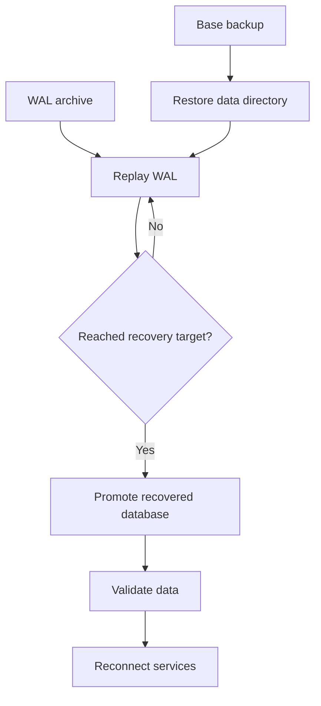

# Part 034 — Backup, Restore, PITR, and Disaster Recovery

> **Scope:** This part explains backup, restore, point-in-time recovery, and disaster recovery for PostgreSQL-backed enterprise Java/JAX-RS systems. It focuses on backup strategy, logical backup, physical backup, WAL archiving, PITR, restore drills, RPO/RTO, snapshots, encryption, retention, validation, runbooks, and data-loss scenarios. It does **not** assume CSG uses any specific backup tool, cloud provider setting, retention policy, RPO/RTO target, cross-region architecture, or restore process. Verify all internal details.

## 1. Core mental model

A backup is not a checkbox.

A backup is a recovery capability.

```text
Backup exists to restore.
Restore exists to recover service and data integrity.
DR exists to recover business operation under serious failure.
```

The dangerous misconception:

```text
"Backup job succeeded" means "we can recover".
```

That is false until restore has been tested.

A production-grade backup strategy must answer:

- What failure are we recovering from?
- How much data can we lose?
- How long can recovery take?
- Where do we restore?
- Who executes the restore?
- How do we validate restored data?
- How do Java services reconnect?
- How do Kafka/CDC/read models reconcile?
- How do we avoid restoring the wrong point in time?
- How often do we test this?

## 2. HA is not backup

High availability and backup solve different problems.

| Failure | HA helps? | Backup/PITR helps? | Notes |
|---|---:|---:|---|
| Primary node crash | Yes | Maybe | Failover can restore availability |
| Disk/node failure | Yes, if replica healthy | Yes | Depends on topology |
| Accidental `DELETE` committed | No | Yes | Replication copies the bad delete |
| Bad migration corrupts data | No | Yes | Need PITR/data repair strategy |
| Application bug writes wrong prices | No | Maybe | Need point-in-time or selective repair |
| Region outage | Maybe | Yes, if cross-region plan exists | DR problem |
| Ransomware/credential compromise | Maybe not | Yes, if isolated backups exist | Security boundary matters |
| Lost table/index/database object | No | Yes | Restore or object-level recovery |

Replication gives another copy of the current or near-current state.

Backup gives a way to return to a previous recoverable state.

You need both.

## 3. RPO and RTO

Two terms define recovery expectations.

### RPO — Recovery Point Objective

RPO answers:

```text
How much committed data can the business tolerate losing?
```

Examples:

- RPO 24 hours: yesterday's backup is acceptable.
- RPO 15 minutes: need frequent WAL/archive/snapshot strategy.
- RPO near-zero: need synchronous replication or equivalent architecture, with trade-offs.

### RTO — Recovery Time Objective

RTO answers:

```text
How long can the service be unavailable or degraded during recovery?
```

Examples:

- RTO 8 hours: manual restore may be acceptable.
- RTO 30 minutes: automation/runbook must be rehearsed.
- RTO minutes: failover and pre-provisioned standby likely required.

RPO/RTO are not database-only numbers.

They include:

- platform provisioning
- DNS/routing changes
- Kubernetes/secret/config updates
- application restart/reconnect
- validation
- Kafka/CDC reconciliation
- stakeholder communication

## 4. Backup types

PostgreSQL backup strategy usually combines multiple mechanisms.

| Backup type | What it captures | Common use | Main risk |
|---|---|---|---|
| Logical backup | SQL representation of schema/data | selective restore, migration, small DBs | slow for large DB, object/role nuance |
| Physical backup | data files/base backup | full database/cluster recovery | needs WAL consistency |
| WAL archive | continuous stream of WAL files | PITR, standby catch-up | missing WAL breaks recovery chain |
| Storage snapshot | volume-level snapshot | fast infrastructure backup | consistency depends on method/provider |
| Cloud snapshot | provider-managed snapshot | managed DB restore | provider semantics/retention limitations |
| Cross-region copy | backup outside primary region/site | disaster recovery | cost, lag, compliance, restore complexity |

A mature system usually has:

```text
base backup + WAL archive + restore drill + monitoring + retention policy + runbook
```

## 5. Logical backup

Logical backup exports database objects and rows as logical SQL/archive format.

Typical tools/concepts:

- `pg_dump`
- `pg_restore`
- custom/plain/directory formats
- schema-only backup
- data-only backup
- table-level restore
- roles/privileges handled separately depending on approach

Logical backup is useful for:

- small or medium databases
- object-level restore
- development/test seed data
- migration between versions/environments
- extracting specific tables
- audit/investigation snapshots

Limitations:

- slow for very large production databases
- restore can take longer than expected
- may not include global objects unless separately handled
- extension availability must match target
- ownership/privilege restoration can be tricky
- not ideal as the only PITR strategy for large mission-critical systems

Senior review question:

```text
Can this logical backup restore the database to a production-usable state, including roles, extensions, privileges, and required object ownership?
```

## 6. Physical backup

Physical backup copies PostgreSQL data files in a consistent way.

It is usually paired with WAL archive to recover to a consistent point.

Common mechanism:

```text
Base backup captures data directory baseline
  +
WAL archive captures changes after/during base backup
  =
Recoverable database state
```

Physical backup is useful for:

- large databases
- full cluster recovery
- PITR
- standby creation
- DR restore
- faster restore than logical dump in many cases

Risks:

- missing WAL files can make recovery fail
- backup may be stored but not restorable
- target environment may not match required version/configuration
- backup encryption key may be unavailable
- restore process may be too slow for RTO

## 7. WAL archive and continuous archiving

WAL archive is the continuous preservation of write-ahead log segments.

Why it matters:

```text
A base backup without required WAL can only restore to limited state.
A WAL archive lets PostgreSQL replay changes to a chosen point in time.
```

PITR depends on a continuous sequence of WAL files.

If one required WAL file is missing, recovery to the target time may fail.

Operational checks:

```sql
SELECT
    archived_count,
    last_archived_wal,
    last_archived_time,
    failed_count,
    last_failed_wal,
    last_failed_time
FROM pg_stat_archiver;
```

Failure chain:

```text
archive_command silently failing
  ↓
WAL files not archived
  ↓
backup appears healthy
  ↓
restore attempt needs missing WAL
  ↓
PITR fails during incident
```

This is why archive monitoring is part of production readiness.

## 8. Point-in-time recovery

Point-in-time recovery restores a base backup and replays WAL until a chosen target.

Target can be based on:

- timestamp
- transaction ID
- restore point
- LSN
- named recovery target depending on setup

Simplified flow:



PITR is useful for:

- recovering before bad migration
- recovering before accidental delete
- recovering before application bug corruption
- forensic investigation
- creating pre-incident copy for comparison

But PITR has sharp edges.

## 9. PITR target selection risk

Choosing the wrong recovery target can be worse than the incident.

Examples:

| Scenario | Bad target | Result |
|---|---|---|
| Bad migration started 10:02:13 | restore to 10:03 | corruption still present |
| Application bug wrote wrong prices over 20 minutes | restore to after bug started | partial corruption remains |
| User deleted wrong order at 15:30 | restore entire DB to 15:29 | unrelated valid writes after 15:29 lost |
| Outbox published events after target | database restored before events | external systems saw events for data that no longer exists |

Before PITR, establish:

- exact incident timeline
- first bad write time
- last known good time
- external side effects after target time
- Kafka/outbox impact
- customer-impact scope
- whether selective data repair is safer than full database restore

PITR is not always the best response.

Sometimes a surgical data repair is safer.

## 10. Restore drill

A restore drill proves recovery works.

Minimum restore drill steps:

1. Pick a real backup.
2. Restore to isolated environment.
3. Replay WAL to target point.
4. Start PostgreSQL.
5. Validate schema objects.
6. Validate row counts/key business tables.
7. Validate roles/privileges/extensions.
8. Run application smoke tests.
9. Validate MyBatis/JDBC connectivity.
10. Validate outbox/CDC/read model implications.
11. Measure actual restore time.
12. Compare actual result to RPO/RTO.
13. Document gaps.

A restore drill should answer:

```text
Can we restore under pressure using the documented runbook, with the people and permissions available during an incident?
```

If only one expert can restore, the system is fragile.

## 11. Backup validation

Backup validation should include more than file existence.

Validate:

- backup completed successfully
- WAL archive continuity
- backup size expected
- checksum if applicable
- encryption key availability
- restore command works
- target PostgreSQL version compatibility
- roles/extensions/privileges available
- application can connect to restored DB
- critical queries return expected counts
- restore time within RTO
- restored point within RPO

Example validation queries after restore:

```sql
-- Confirm database started and is no longer in recovery after promotion.
SELECT pg_is_in_recovery();
```

```sql
-- Inspect installed extensions.
SELECT extname, extversion
FROM pg_extension
ORDER BY extname;
```

```sql
-- Basic table inventory sanity check.
SELECT schemaname, relname, n_live_tup
FROM pg_stat_user_tables
ORDER BY schemaname, relname;
```

For business validation, generic row counts are not enough.

You need domain-specific checks:

- number of active quotes
- number of orders by lifecycle state
- outbox pending/published counts
- latest catalog/pricing effective date
- audit trail continuity
- tenant/customer boundaries

Do not invent these checks for CSG. Verify actual schema and domain invariants internally.

## 12. Backup encryption and access control

Backups often contain the most sensitive copy of production data.

Security concerns:

- encryption at rest
- encryption in transit
- key management
- key rotation
- restore permission
- cross-region/cross-account copy
- backup operator access
- audit logs
- PII retention
- immutable/locked backup if required
- separation from compromised primary environment

A backup that anyone can restore to an uncontrolled environment is a data breach risk.

A backup encrypted with a key no one can access during incident is an availability risk.

Balance both.

## 13. Backup retention

Retention policy defines how long backups are kept.

Retention must satisfy:

- recovery needs
- compliance requirements
- storage cost
- privacy/deletion requirements
- forensic investigation needs
- legal hold if applicable

Typical retention questions:

- How many daily backups?
- How many weekly/monthly backups?
- How long is WAL retained?
- Are backups immutable?
- Are backups copied cross-region/site?
- How are expired backups deleted?
- How does retention interact with data deletion/privacy commitments?

Retention is a product/legal/security/platform decision, not just a DBA setting.

## 14. Snapshots

Snapshots can be fast and convenient.

But snapshot safety depends on how they are taken.

Types:

- cloud-managed database snapshot
- storage volume snapshot
- filesystem snapshot
- Kubernetes PVC snapshot
- VM snapshot

Questions:

- Is the snapshot crash-consistent or application/database-consistent?
- Does it include WAL needed for consistency?
- Is it coordinated with PostgreSQL backup mode/tooling?
- Can it be restored into an isolated environment?
- Is it encrypted?
- Is it region/site durable?
- How long does restore actually take?

Do not assume all snapshots are PITR-capable.

## 15. Cloud-managed PostgreSQL backup

AWS/Azure managed PostgreSQL services usually provide backup and PITR features, but exact behaviour depends on service type/configuration.

Verify:

- backup retention period
- PITR window
- snapshot schedule
- manual snapshot process
- cross-region snapshot/copy
- backup encryption
- key ownership
- restore target options
- restore time estimate
- restore endpoint naming
- replica/failover interaction
- maintenance/version upgrade impact

Managed backup reduces operational burden, but it does not remove application-level recovery concerns.

After restore, Java/JAX-RS services still need:

- new connection URL/secret
- Kubernetes secret/config update
- connection pool restart/reload
- migration version validation
- CDC/outbox reconciliation
- application smoke test
- customer-impact verification

## 16. Kubernetes backup considerations

If PostgreSQL runs in Kubernetes, backup design must account for:

- StatefulSet identity
- PVC/PV snapshot semantics
- storage class capabilities
- operator backup mechanism
- backup sidecar/container
- object storage target
- network policy for backup upload
- secret for backup credentials
- restore into new namespace/cluster
- volume attachment constraints
- node/zone failure

A YAML manifest is not a backup strategy.

A PVC snapshot is not automatically a PostgreSQL-consistent PITR plan.

Verify operator/tool-specific behaviour.

## 17. On-prem and hybrid DR

On-prem or hybrid deployments require explicit ownership.

Key areas:

- backup storage location
- offsite copy
- network path to backup storage
- firewall rules
- TLS/certificates
- hardware capacity for restore
- OS/PostgreSQL version availability
- HA tooling
- DNS cutover
- credential escrow
- air-gapped constraints
- manual access during incident

Hybrid DR often fails on non-database dependencies:

- application secrets unavailable
- DNS cannot be changed quickly
- Kafka/read model not aligned
- object storage/documents not restored
- firewall blocks restored environment
- certificate not valid in DR site

DR is a system property, not just a database property.

## 18. Java/JAX-RS application impact

Database restore affects application state and external side effects.

### 18.1 Connection and configuration

After restore to a new database instance:

- JDBC URL may change
- credentials/secret may change
- TLS certificate chain may change
- DNS may change
- connection pool must reconnect
- readiness probes must verify new database
- migration tool must not accidentally run destructive changes

### 18.2 Transaction and idempotency

If database is restored to an earlier time, clients may retry operations that already happened externally.

Examples:

- quote approval response returned before restore target
- order submission sent downstream before restore target
- payment/billing/fulfillment system saw an event
- database no longer contains the state that produced the event

Mitigations:

- idempotency keys
- immutable business operation IDs
- outbox replay strategy
- inbox deduplication
- reconciliation reports
- manual fallout process

### 18.3 API contract

During recovery, APIs may need to operate in degraded mode:

- read-only mode
- maintenance mode
- reject writes temporarily
- disable event publisher
- disable scheduled jobs/backfills
- stop consumers that would amplify inconsistency

These behaviours should be defined before incident.

## 19. MyBatis/JDBC impact

MyBatis itself does not solve restore semantics.

But mappers and transaction code are affected by recovery.

Review:

- migration version expected by mapper SQL
- stored function/procedure versions
- trigger availability
- enum/domain type compatibility
- sequence/identity continuity
- generated key assumptions
- retry logic after reconnect
- SQLState mapping during recovery/read-only mode

After restore, sequences may require validation if logical restore or selective repair was used.

Example:

```sql
-- Inspect sequence state relative to table maximum ID.
SELECT last_value, is_called
FROM some_sequence_name;
```

Do not run sequence fixes blindly. Verify actual sequence/table ownership first.

## 20. CDC, outbox, Kafka, and restore

Restore interacts dangerously with event systems.

Scenario:

```text
10:00 quote approved in DB
10:00 outbox event published to Kafka
10:05 bad migration starts
10:10 restore DB to 09:59
```

Now Kafka and downstream systems may know about an approval that the restored database does not contain.

You need a reconciliation plan.

Questions:

- Is Kafka considered part of recovery scope?
- Are topics replayed, compacted, or left as-is?
- Are outbox events regenerated after restore?
- Are duplicate events acceptable?
- Are consumers idempotent?
- Are downstream services restored too?
- Is there a business reconciliation process?
- Does CDC connector need a new slot/snapshot?
- What LSN/time should CDC resume from?

Database DR without event-system DR can create cross-system inconsistency.

## 21. Data-loss scenarios

Common scenarios and response direction:

| Scenario | Possible response | Notes |
|---|---|---|
| Accidental table drop | PITR to clone, extract table, restore selectively | Full DB restore may lose unrelated writes |
| Bad bulk update | PITR clone + repair script | Need before/after diff |
| Bad migration | restore or roll-forward repair | Depends on damage and reversibility |
| Primary region lost | restore from cross-region backup | RTO depends on automation and capacity |
| Ransomware/compromise | restore from isolated immutable backup | Also rotate credentials and investigate |
| Missing outbox events | reconstruct from state or replay CDC | Depends on event schema and audit trail |
| Corrupted JSONB config | restore specific rows from clone | Validate version/schema |
| Sequence mismatch after restore | sequence repair | Must be controlled and tested |

Full database restore is often the most disruptive option.

For localized data corruption, a PITR clone plus targeted repair may preserve valid writes after the incident.

## 22. Restore strategy patterns

### 22.1 Full restore in-place

Replace production database with restored state.

Pros:

- clear database state
- useful for catastrophic failure

Cons:

- loses valid writes after target time
- requires downtime/cutover
- external systems may diverge

### 22.2 Restore to new instance and cut over

Restore backup to a new instance, validate, then change routing.

Pros:

- safer validation
- old primary remains available for investigation if safe

Cons:

- routing/secret/DNS changes needed
- application cutover required
- replication/CDC reconfiguration needed

### 22.3 Restore to clone and repair production

Restore backup to isolated clone, extract correct rows, repair production.

Pros:

- avoids losing unrelated valid writes
- useful for partial corruption

Cons:

- requires careful repair scripts
- risk of incomplete repair
- needs strong validation/reconciliation

### 22.4 Restore lower environment for investigation

Restore sanitized/controlled copy for debugging.

Pros:

- supports RCA and forensic analysis

Cons:

- privacy/security restrictions
- may not match production topology exactly

## 23. Disaster recovery runbook

A DR runbook should be executable under pressure.

Minimum sections:

1. Scope and assumptions.
2. Roles and escalation contacts.
3. RPO/RTO target.
4. Decision tree: failover vs restore vs repair.
5. How to identify last known good time.
6. How to find backup/base backup.
7. How to verify WAL archive continuity.
8. Restore steps.
9. Network/DNS/endpoint cutover.
10. Secret/config update.
11. Application startup order.
12. Migration/version validation.
13. CDC/outbox/Kafka handling.
14. Smoke test checklist.
15. Business validation checklist.
16. Customer/stakeholder communication.
17. Rollback/abort conditions.
18. Post-recovery monitoring.
19. RCA data capture.

If the runbook only says "restore database", it is not a runbook.

## 24. Smoke test after restore

Technical smoke tests:

- database accepts connections
- expected PostgreSQL version
- expected extensions installed
- migrations version table correct
- application can start
- health/readiness endpoint green
- basic read query works
- basic write transaction works if writes enabled
- MyBatis mapper smoke test passes
- stored functions/procedures compile/run if used
- triggers exist and behave as expected

Business smoke tests:

- can load customer/account
- can load product catalog/config
- can create or view quote depending on mode
- can validate order lifecycle state
- audit trail visible
- outbox/inbox state understood
- tenant isolation intact
- reporting/read models freshness known

Operational smoke tests:

- monitoring attached
- logs visible
- slow query logging expected
- backup schedule re-enabled
- WAL archiving active
- replication/CDC reconfigured
- alerting active

## 25. Failure modes

| Failure mode | Symptom | Root cause | Mitigation |
|---|---|---|---|
| Backup exists but restore fails | Recovery blocked | untested backup, missing WAL, incompatible version | restore drills |
| PITR cannot reach target | missing WAL segment | archive gap | monitor archive continuity |
| Restore too slow | RTO missed | large DB, slow storage, manual steps | benchmark restore and automate |
| Wrong target time | corruption remains or valid data lost | poor timeline analysis | incident timeline discipline |
| Backup key unavailable | encrypted backup unusable | key access/process issue | key recovery runbook |
| Restored DB missing roles | app cannot connect | logical backup omitted globals | include role/privilege strategy |
| Extension missing | app queries fail | target lacks extension | verify extension inventory |
| CDC resumes incorrectly | duplicate/missing events | slot/offset mismatch | CDC recovery runbook |
| App runs migrations on restored DB accidentally | further damage | startup/pipeline misconfiguration | freeze migrations during recovery |
| Backup contains sensitive data in unsafe env | compliance incident | uncontrolled restore | access control and masking policy |

## 26. Debugging workflow: suspected backup gap

1. Identify backup tool/provider.
2. Confirm last successful base backup/snapshot.
3. Check WAL archive status.
4. Determine earliest and latest recoverable time.
5. Verify storage location and credentials.
6. Check encryption key access.
7. Attempt restore to isolated environment.
8. Capture error logs.
9. Determine whether gap affects RPO.
10. Escalate to DBA/SRE/platform/security as needed.

## 27. Debugging workflow: bad data incident

1. Stop or reduce further writes if damage is ongoing.
2. Capture exact timeline.
3. Identify first bad write.
4. Identify affected tables/tenants/business entities.
5. Identify external events emitted after first bad write.
6. Decide between full restore, clone-and-repair, or roll-forward fix.
7. Restore backup to clone if needed.
8. Generate diff/repair script.
9. Review repair script with DBA/backend/domain owner.
10. Execute with transaction, logging, and rollback plan if feasible.
11. Reconcile outbox/Kafka/downstream state.
12. Add regression test and preventive constraint/check.

## 28. PR review checklist

For any change affecting backup/restore/DR readiness, ask:

- Does this migration affect backup or restore time?
- Does it create large WAL volume?
- Does it add extension/object dependency that restore must support?
- Does it add table without backup/retention classification?
- Does it add sensitive data needing encryption/retention policy?
- Does it change outbox/CDC semantics?
- Does it require new restore validation checks?
- Does it affect RPO/RTO assumptions?
- Does it change sequence/identity behaviour?
- Can a restored older app version read this schema?
- Can a restored newer app version tolerate old data?
- Is a runbook update required?
- Is DBA/SRE/security review required?

## 29. Internal verification checklist

Verify these with CSG/team before making architecture claims:

- Backup tool/provider used.
- Backup type: logical, physical, snapshot, managed PITR, combination.
- Backup schedule and retention.
- WAL archiving configuration and monitoring.
- PITR window and tested recovery targets.
- RPO/RTO targets per environment/customer/tier.
- Restore runbook location and owner.
- Last restore drill date and result.
- Cross-region/offsite backup policy.
- Backup encryption and key ownership.
- Access control for backup/restore.
- Backup validation queries/checks.
- Treatment of roles, privileges, extensions, and secrets in restore.
- How Kubernetes secrets/configs are updated after restore.
- How CI/CD migration execution is paused or controlled during recovery.
- How CDC/Debezium/Kafka/outbox are handled after restore.
- Whether read models/reporting databases are restored, rebuilt, or replayed.
- Data privacy requirements for restored copies.
- Incident notes involving bad migration, data repair, restore, or PITR.

## 30. Senior-engineer heuristics

```text
A backup that has never been restored is an assumption, not a capability.
```

```text
RPO/RTO must be measured by restore drills, not declared in architecture diagrams.
```

```text
HA recovers from node failure; PITR recovers from bad history.
```

```text
A database restore can create event-system inconsistency unless Kafka/CDC/outbox are part of the recovery plan.
```

```text
For localized data corruption, restore-to-clone plus targeted repair may be safer than full rollback.
```

## 31. Summary

Backup, restore, PITR, and DR are production correctness mechanisms.

They are not DBA-only topics.

A senior Java/JAX-RS engineer must understand them because application design affects recoverability:

- idempotency keys reduce uncertain replay risk
- outbox/inbox patterns support reconciliation
- migrations affect restore compatibility
- schema/object dependencies affect restore completeness
- external side effects complicate PITR
- connection/config strategy affects cutover
- privacy/security controls affect backup handling

The real test is not whether backups exist.

The real test is whether the system can be restored, validated, reconnected, reconciled, and operated within acceptable business impact.

## References

- PostgreSQL Documentation — Backup and Restore: https://www.postgresql.org/docs/current/backup.html
- PostgreSQL Documentation — Continuous Archiving and Point-in-Time Recovery: https://www.postgresql.org/docs/current/continuous-archiving.html
- PostgreSQL Documentation — High Availability, Load Balancing, and Replication: https://www.postgresql.org/docs/current/high-availability.html
- PostgreSQL Documentation — Log-Shipping Standby Servers: https://www.postgresql.org/docs/current/warm-standby.html
- PostgreSQL Documentation — WAL Configuration and Archiving: https://www.postgresql.org/docs/current/runtime-config-wal.html
