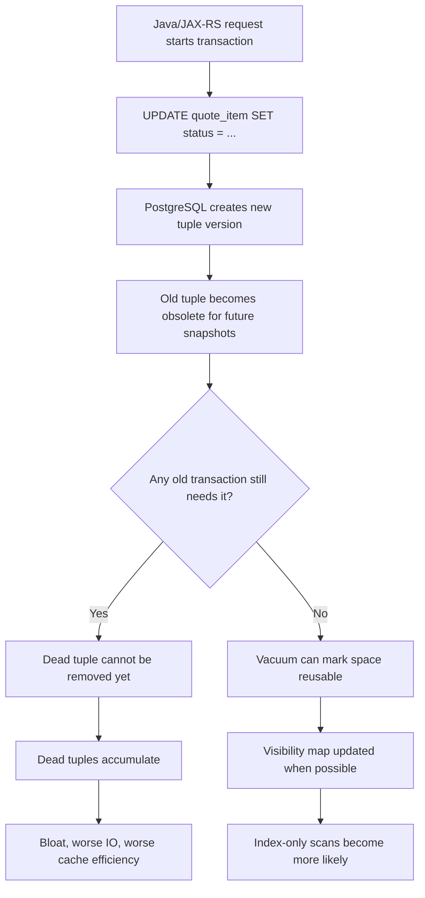

# Part 035 — Vacuum, Autovacuum, Bloat, and Maintenance

## 1. Why this part matters

PostgreSQL maintenance is not a background detail. In production systems, especially enterprise quote/order workloads with high update volume, audit history, state transitions, catalog changes, and batch jobs, PostgreSQL can become unhealthy even when every SQL statement is logically correct.

The common failure pattern is subtle:

1. Java service writes data normally.
2. Updates and deletes create old tuple versions because PostgreSQL uses MVCC.
3. Long transactions, idle connections, replication lag, or aggressive write workload prevent cleanup.
4. Dead tuples accumulate.
5. Table and index size grows.
6. Query plans degrade.
7. Autovacuum cannot keep up.
8. Disk, IO, latency, WAL, and failover risk increase.
9. A database maintenance problem becomes an application incident.

A senior backend engineer does not need to replace the DBA/SRE role, but must be able to recognize when application behavior is damaging PostgreSQL maintenance.

---

## 2. Core mental model

PostgreSQL does not update rows in place in the simple mental model many application engineers expect.

When a row is updated, PostgreSQL creates a new row version and leaves the old version behind until it is no longer visible to any active transaction. When a row is deleted, the row version is marked as no longer live but is not physically removed immediately.

Those obsolete row versions are called **dead tuples**.

`VACUUM` exists because MVCC needs a cleanup lifecycle.

### The short version

| Concept | Meaning | Production concern |
|---|---|---|
| Dead tuple | Old row version no longer needed by current transactions | Accumulates after update/delete workload |
| Vacuum | Reclaims reusable space from dead tuples | Must keep up with write rate |
| Autovacuum | PostgreSQL background worker that runs vacuum/analyze automatically | Can lag under heavy write or bad configuration |
| Analyze | Updates planner statistics | Stale stats cause bad plans |
| Freeze | Marks old tuples safe against transaction ID wraparound | Critical for long-lived databases |
| Bloat | Table/index file larger than useful live data | Causes more IO, cache pressure, slower scans |
| Visibility map | Tracks pages whose tuples are visible to all transactions | Enables index-only scans and helps vacuum |
| Wraparound | Transaction ID age reaches dangerous limit | Can force emergency vacuum or database shutdown behavior |

---

## 3. Lifecycle of an updated row



The key idea: **application transaction behavior directly controls how soon PostgreSQL can clean old row versions**.

A single endpoint that opens a transaction, streams data slowly, calls remote services before commit, or leaves a connection `idle in transaction` can hold back cleanup for many tables.

---

## 4. VACUUM vs ANALYZE vs AUTOVACUUM

### 4.1 VACUUM

`VACUUM` removes dead row versions from normal table pages and makes the space available for reuse by future inserts/updates. In normal mode, it does not usually shrink the physical file on disk back to the operating system.

Use mental model:

> Regular vacuum makes table space reusable. It usually does not make the table file smaller.

Example:

```sql
VACUUM quote_item;
```

### 4.2 VACUUM ANALYZE

`ANALYZE` updates planner statistics. `VACUUM ANALYZE` does both cleanup and statistics refresh.

```sql
VACUUM ANALYZE quote_item;
```

Use this when a table has changed significantly and the planner may be making decisions from stale statistics.

### 4.3 ANALYZE only

```sql
ANALYZE quote_item;
```

Use this when data distribution changed but dead tuple cleanup is not the main problem.

Example: a backfill populates a new status column on millions of rows. Query planner statistics may need refresh even if the table does not need emergency vacuum.

### 4.4 VACUUM FULL

`VACUUM FULL` rewrites the table and can return disk space to the OS, but it requires stronger locking and should be treated as an intrusive operation.

```sql
VACUUM FULL quote_item;
```

Production rule:

> Do not treat `VACUUM FULL` as routine cleanup. Treat it like a maintenance operation with lock impact, rollback plan, and DBA/SRE involvement.

### 4.5 Autovacuum

Autovacuum is PostgreSQL's automatic maintenance system. It runs background workers that vacuum and analyze tables based on thresholds and scale factors.

Default autovacuum is helpful, but not magic. It can fall behind when:

- update/delete rate is too high,
- tables are very large,
- long transactions prevent cleanup,
- autovacuum worker count is too low,
- cost delay is too conservative,
- IO is saturated,
- hot tables need per-table tuning,
- replication slots retain too much WAL,
- Kubernetes/cloud storage has insufficient IOPS.

---

## 5. Why bloat happens

Bloat is the gap between physical storage and useful live data.

A table can be logically small but physically large because old tuple versions and fragmented pages remain inside the file.

### 5.1 Table bloat

Table bloat means heap pages contain too much obsolete or reusable space relative to live rows.

Effects:

- sequential scans read more pages,
- cache hit efficiency drops,
- backups become larger,
- vacuum takes longer,
- autovacuum may run more frequently,
- disk alarms become more likely.

### 5.2 Index bloat

Index bloat means index pages contain obsolete entries or inefficient structure.

Effects:

- index scans read more pages,
- write overhead increases,
- cache pressure increases,
- `INSERT`/`UPDATE`/`DELETE` becomes slower,
- query planner may still use the index but performance degrades.

### 5.3 Why normal vacuum does not always shrink files

Regular vacuum marks space reusable inside the table file. It does not normally compact the file and release space to the filesystem.

That is why a table can remain physically large after cleanup, but future writes can reuse the space.

---

## 6. Transaction ID wraparound

PostgreSQL transaction IDs are finite. Old tuples must eventually be frozen so PostgreSQL can safely determine visibility without ambiguity.

This is not theoretical. A database that is not vacuumed enough can approach transaction ID wraparound risk.

Production concern:

- anti-wraparound vacuum can become urgent,
- PostgreSQL may prioritize emergency maintenance,
- performance can degrade,
- tables may receive aggressive vacuum activity at inconvenient times,
- ignoring XID age can become a severe availability risk.

### 6.1 XID age check

```sql
SELECT
  datname,
  age(datfrozenxid) AS database_xid_age
FROM pg_database
ORDER BY age(datfrozenxid) DESC;
```

### 6.2 Table-level freeze age check

```sql
SELECT
  schemaname,
  relname,
  age(relfrozenxid) AS table_xid_age,
  n_live_tup,
  n_dead_tup,
  last_vacuum,
  last_autovacuum
FROM pg_stat_user_tables
ORDER BY age(relfrozenxid) DESC
LIMIT 30;
```

If these numbers are high, do not guess. Escalate to DBA/SRE and correlate with autovacuum activity, long transactions, and workload.

---

## 7. Long transactions: the application-level maintenance killer

Long-running transactions are one of the most common ways application code harms PostgreSQL health.

A transaction holds a snapshot. PostgreSQL must preserve row versions that could still be visible to that snapshot. That means cleanup can be blocked even if the old transaction is only reading.

### 7.1 Common Java/JAX-RS causes

- Opening a transaction at request entry and keeping it open through the whole HTTP lifecycle.
- Calling external APIs inside a database transaction.
- Performing slow file/object-storage work before commit.
- Streaming a large `ResultSet` while holding a transaction open too long.
- Batch job processing too much data in one transaction.
- Missing commit/rollback on exception path.
- Connection returned to pool while still in transaction due to framework misuse.
- MyBatis session lifecycle not aligned with service transaction lifecycle.

### 7.2 Detect long transactions

```sql
SELECT
  pid,
  usename,
  application_name,
  state,
  now() - xact_start AS transaction_age,
  now() - query_start AS query_age,
  wait_event_type,
  wait_event,
  left(query, 500) AS query
FROM pg_stat_activity
WHERE xact_start IS NOT NULL
ORDER BY xact_start ASC;
```

### 7.3 Detect idle in transaction

```sql
SELECT
  pid,
  usename,
  application_name,
  client_addr,
  now() - xact_start AS transaction_age,
  now() - state_change AS idle_age,
  left(query, 500) AS last_query
FROM pg_stat_activity
WHERE state = 'idle in transaction'
ORDER BY xact_start ASC;
```

`idle in transaction` from an application service is almost always a bug or a dangerous integration pattern.

---

## 8. Autovacuum tuning mental model

Autovacuum is triggered using thresholds. The simplified idea is:

```text
autovacuum threshold = base threshold + table_size * scale factor
```

For very large tables, the scale factor can make autovacuum wait too long. A table with hundreds of millions of rows may accumulate too many dead tuples before the threshold is reached.

### 8.1 Global settings to understand

You do not need to tune these casually, but you must know what they mean when reviewing production health:

| Setting | Meaning | Risk if wrong |
|---|---|---|
| `autovacuum` | Enables autovacuum launcher | Disabling is usually dangerous |
| `autovacuum_max_workers` | Max concurrent autovacuum workers | Too low can lag across many hot tables |
| `autovacuum_naptime` | Delay between autovacuum checks | Too slow can delay response |
| `autovacuum_vacuum_threshold` | Base dead tuple threshold | Too high delays cleanup on small tables |
| `autovacuum_vacuum_scale_factor` | Table-size multiplier | Too high delays cleanup on large tables |
| `autovacuum_analyze_threshold` | Base change threshold for analyze | Too high delays stats refresh |
| `autovacuum_analyze_scale_factor` | Table-size multiplier for analyze | Too high causes stale stats on large tables |
| `autovacuum_vacuum_cost_delay` | Delay to reduce IO pressure | Too conservative can make vacuum lag |
| `autovacuum_freeze_max_age` | Anti-wraparound threshold | Critical safety setting |

### 8.2 Per-table tuning

Large hot tables often need table-specific autovacuum settings.

Example pattern:

```sql
ALTER TABLE quote_item SET (
  autovacuum_vacuum_scale_factor = 0.02,
  autovacuum_analyze_scale_factor = 0.01
);
```

Do not cargo-cult values. Tune based on table size, update/delete rate, IO capacity, and operational evidence.

---

## 9. Maintenance commands and their blast radius

| Command | Main use | Blast radius |
|---|---|---|
| `ANALYZE table` | Refresh planner stats | Usually low |
| `VACUUM table` | Reclaim reusable space and update visibility map | Usually moderate IO |
| `VACUUM ANALYZE table` | Cleanup + stats refresh | Moderate IO |
| `VACUUM FULL table` | Rewrite and shrink table file | High lock impact |
| `REINDEX INDEX index_name` | Rebuild one index | Lock/IO depends on method/version |
| `REINDEX TABLE table_name` | Rebuild all indexes on table | Higher impact |
| `CLUSTER table USING index` | Rewrite table physically ordered by index | High impact |
| `pg_repack` | Online-ish table/index rebuild extension if available | Operational dependency and permission needed |

Senior engineer habit:

> Before suggesting a maintenance command, ask what locks it takes, what IO it generates, whether it can run concurrently, and what happens if it is interrupted.

---

## 10. Observability queries

### 10.1 Table vacuum/analyze health

```sql
SELECT
  schemaname,
  relname,
  n_live_tup,
  n_dead_tup,
  round(100.0 * n_dead_tup / nullif(n_live_tup + n_dead_tup, 0), 2) AS dead_tuple_pct,
  last_vacuum,
  last_autovacuum,
  last_analyze,
  last_autoanalyze,
  vacuum_count,
  autovacuum_count,
  analyze_count,
  autoanalyze_count
FROM pg_stat_user_tables
ORDER BY n_dead_tup DESC
LIMIT 50;
```

Use this as a signal, not as an exact bloat measurement. PostgreSQL statistics can be approximate.

### 10.2 Table and index size

```sql
SELECT
  schemaname,
  relname,
  pg_size_pretty(pg_total_relation_size(relid)) AS total_size,
  pg_size_pretty(pg_relation_size(relid)) AS table_size,
  pg_size_pretty(pg_indexes_size(relid)) AS index_size,
  n_live_tup,
  n_dead_tup
FROM pg_stat_user_tables
ORDER BY pg_total_relation_size(relid) DESC
LIMIT 30;
```

### 10.3 Current vacuum progress

```sql
SELECT
  pid,
  datname,
  relid::regclass AS relation,
  phase,
  heap_blks_total,
  heap_blks_scanned,
  heap_blks_vacuumed,
  index_vacuum_count,
  max_dead_tuples,
  num_dead_tuples
FROM pg_stat_progress_vacuum;
```

### 10.4 Index usage signal

```sql
SELECT
  schemaname,
  relname,
  indexrelname,
  idx_scan,
  idx_tup_read,
  idx_tup_fetch,
  pg_size_pretty(pg_relation_size(indexrelid)) AS index_size
FROM pg_stat_user_indexes
ORDER BY pg_relation_size(indexrelid) DESC
LIMIT 50;
```

This does not automatically prove an index is useless. Some indexes are rarely used but critical for rare operational paths or constraints. Always verify before dropping.

---

## 11. Impact on Java/JAX-RS services

Vacuum problems often surface as application symptoms:

- endpoint latency slowly increases,
- same query plan becomes slower because relation size grew,
- connection pool saturates because database work takes longer,
- API timeouts increase,
- MyBatis mapper appears slow even though SQL text did not change,
- batch jobs overrun their maintenance windows,
- failover/recovery takes longer due to WAL and storage pressure,
- read replica lag increases,
- disk alarms fire during normal traffic.

### Backend design rules

1. Keep transactions short.
2. Do not call remote services while holding DB transaction unless there is a very strong reason.
3. Use batch size limits.
4. Commit backfills in chunks.
5. Avoid update-heavy hot rows.
6. Use explicit timeout strategy.
7. Monitor `idle in transaction` as an application bug.
8. Add `application_name` in connection config so DB sessions can be traced to service/pod.

Example JDBC URL pattern:

```text
jdbc:postgresql://db-host:5432/appdb?ApplicationName=quote-order-service
```

Exact configuration depends on driver/framework and must be verified internally.

---

## 12. Impact on MyBatis

MyBatis gives explicit SQL control. That is powerful, but it also means mapper design can create high churn and vacuum pressure.

Watch for:

- update statements that rewrite many rows repeatedly,
- dynamic SQL that updates unchanged columns,
- batch jobs that update huge sets in one transaction,
- soft delete patterns without retention cleanup,
- audit table inserts without partitioning/retention,
- status transition updates on the same row many times,
- mapper methods used by polling loops too frequently,
- accidental full table updates due to missing WHERE condition.

Example dangerous pattern:

```sql
UPDATE quote_item
SET updated_at = now(), status = #{status}
WHERE quote_id = #{quoteId};
```

Questions to ask:

- How many rows can this touch?
- Is it updating rows whose value is already the same?
- Does it run in a request path, batch path, retry path, or polling path?
- Does it need a more selective predicate?
- Does it need chunking?

Safer shape when appropriate:

```sql
UPDATE quote_item
SET updated_at = now(), status = #{status}
WHERE quote_id = #{quoteId}
  AND status IS DISTINCT FROM #{status};
```

This avoids generating dead tuples for rows where the value would not change.

---

## 13. Impact on microservices, Kafka, CDC, and replication

Vacuum and maintenance are not isolated from event-driven architecture.

### CDC/logical decoding concerns

- Replication slots can retain WAL if consumers lag.
- WAL growth can cause disk pressure.
- High update/delete workload increases WAL volume.
- Backfills can produce massive CDC event volume.
- Vacuum cannot remove row versions still needed by old snapshots or certain replication needs.

### Outbox table concerns

Outbox tables are often insert-heavy and update-heavy:

- event inserted,
- status updated to published,
- retry count updated,
- cleanup job deletes old events.

This creates dead tuples. Outbox needs retention, indexing, and autovacuum awareness.

Production pattern:

- partition large outbox/history tables by time,
- delete/drop old partitions instead of row-by-row delete when possible,
- keep active partition small,
- monitor dead tuples and replication lag,
- avoid unbounded retry-update churn.

---

## 14. Kubernetes, AWS, Azure, and on-prem considerations

### Kubernetes/self-managed PostgreSQL

Verify:

- storage class IOPS/throughput,
- PV expansion behavior,
- backup during vacuum-heavy periods,
- pod disruption during maintenance,
- autovacuum resource impact on pod CPU/IO,
- operator defaults for autovacuum-related settings,
- alerting for disk/WAL growth.

### AWS RDS/Aurora PostgreSQL

Verify internally:

- parameter group autovacuum settings,
- Performance Insights query symptoms,
- CloudWatch disk/WAL/storage metrics,
- storage autoscaling behavior,
- maintenance window,
- read replica lag,
- extension availability for tools such as `pgstattuple` or `pg_repack` if needed.

### Azure Database for PostgreSQL

Verify internally:

- server parameters,
- Azure Monitor metrics,
- storage scaling behavior,
- Query Store availability/configuration if used,
- maintenance window,
- replica lag,
- extension availability.

### On-prem

Verify:

- filesystem and disk layout,
- IO saturation during vacuum,
- monitoring stack,
- patching and upgrade process,
- backup impact,
- emergency disk expansion process.

---

## 15. Failure modes

| Failure mode | Symptom | Likely cause | First diagnostic |
|---|---|---|---|
| Autovacuum not keeping up | Dead tuples rising | Write rate too high, workers too low, long tx | `pg_stat_user_tables`, `pg_stat_activity` |
| Query got slower over weeks | More IO, bigger relation | Table/index bloat | relation size trend, `EXPLAIN BUFFERS` |
| Planner chooses bad plan | estimate vs actual mismatch | stale stats | `ANALYZE`, compare plan estimates |
| Disk usage grows unexpectedly | storage alarm | bloat, WAL, replication slot | table size, WAL dir/cloud metrics, slots |
| Emergency anti-wraparound vacuum | sudden IO spike | high XID age | `age(datfrozenxid)`, `age(relfrozenxid)` |
| Index-only scan stopped helping | heap fetches increase | visibility map not updated | `EXPLAIN ANALYZE BUFFERS` |
| Batch update causes incident | lock/IO/WAL spike | no chunking/throttling | activity, locks, WAL metrics |
| Outbox table grows | slow publisher or cleanup missing | retention gap | outbox status counts, table size |
| `idle in transaction` sessions | vacuum blocked | app transaction leak | `pg_stat_activity` |

---

## 16. Debugging workflow

When PostgreSQL maintenance health looks suspicious:

1. Identify the user-facing symptom.
   - latency?
   - timeout?
   - disk?
   - lock?
   - CPU/IO?

2. Check active sessions.

```sql
SELECT pid, application_name, state, wait_event_type, wait_event,
       now() - xact_start AS xact_age,
       now() - query_start AS query_age,
       left(query, 300) AS query
FROM pg_stat_activity
ORDER BY xact_start NULLS LAST, query_start NULLS LAST;
```

3. Check dead tuple and last vacuum/analyze.

```sql
SELECT schemaname, relname, n_live_tup, n_dead_tup,
       last_autovacuum, last_autoanalyze
FROM pg_stat_user_tables
ORDER BY n_dead_tup DESC
LIMIT 20;
```

4. Check table/index size trend.

5. Check XID age.

6. Check replication slot and WAL growth if CDC/replication is involved.

7. Correlate with deployments, migrations, batch jobs, or traffic changes.

8. Decide whether this is:
   - application transaction bug,
   - query/migration issue,
   - autovacuum tuning issue,
   - capacity issue,
   - emergency maintenance issue.

Do not start by running intrusive maintenance commands.

---

## 17. PR review checklist

For any PR that changes write behavior, schema, batch job, migration, or retention policy, ask:

### Write amplification

- Does this update rows even when values are unchanged?
- Does this touch many rows in a single transaction?
- Does this create high dead tuple volume?
- Does this update indexed columns frequently?
- Does this create hot rows or hot indexes?

### Migration/backfill

- Is the backfill chunked?
- Is it resumable?
- Is it throttled?
- Does it avoid long transactions?
- Does it refresh statistics afterward?
- Does it produce CDC volume that downstream can handle?

### Retention

- Is old data deleted, archived, partition-dropped, or retained forever?
- If soft delete is used, is there a hard-delete/archive lifecycle?
- Does audit/outbox/history growth have a cap?

### Observability

- Can we identify the application sessions via `application_name`?
- Is there dashboard coverage for table growth, dead tuples, autovacuum, disk, WAL?
- Is there an alert for `idle in transaction`?

### Operational safety

- Does this require DBA/SRE review?
- Does it need a maintenance window?
- Does rollback create more data churn?
- Is there a runbook if the migration/backfill is stopped mid-way?

---

## 18. Internal verification checklist

Use this checklist against CSG/internal systems. Do not assume answers.

### Database settings

- PostgreSQL version.
- Autovacuum global settings.
- Per-table autovacuum overrides.
- `max_connections`, pool count, and application session naming.
- Availability of extensions such as `pg_stat_statements`, `pgstattuple`, `pg_repack`.

### Tables and workload

- Largest tables by total size.
- Highest dead tuple tables.
- Highest update/delete churn tables.
- Outbox/inbox/audit/history tables.
- Soft delete tables.
- Partitioned tables and retention policy.

### Application behavior

- Long-running transactions from Java/JAX-RS services.
- `idle in transaction` incidents.
- Batch jobs and transaction size.
- MyBatis mappers that update large sets.
- Backfill scripts and runbooks.

### Operations

- Vacuum/autovacuum dashboard.
- Disk/WAL/storage alerts.
- Slow query dashboard.
- Replication lag dashboard.
- Maintenance window process.
- DBA/SRE escalation path.
- Incident notes involving bloat, disk, wraparound, or slow query regression.

---

## 19. Practical operating rules

1. Treat long transactions as production bugs.
2. Treat unbounded update/delete jobs as production risks.
3. Treat `VACUUM FULL` as a high-impact operation.
4. Treat stale statistics as a real cause of bad query plans.
5. Treat outbox/audit/history tables as growth systems requiring lifecycle design.
6. Treat autovacuum as necessary but not sufficient.
7. Treat bloat diagnosis as evidence-based, not guess-based.
8. Treat maintenance as part of application architecture.

---

## 20. Senior engineer questions

Before approving or designing a database-heavy change, ask:

- How does this change affect dead tuple generation?
- What is the expected row churn per day?
- What tables can grow without bound?
- What is the retention/archive strategy?
- What is the largest transaction this code can create?
- Can autovacuum keep up with this workload?
- How will we detect if it cannot?
- What is the rollback path if the backfill or migration causes bloat/IO issues?
- Does this interact with CDC, outbox, or read replicas?
- Does this require DBA/SRE review before rollout?

---

## 21. References

- PostgreSQL Documentation — Routine Vacuuming: https://www.postgresql.org/docs/current/routine-vacuuming.html
- PostgreSQL Documentation — VACUUM: https://www.postgresql.org/docs/current/sql-vacuum.html
- PostgreSQL Documentation — Monitoring Database Activity: https://www.postgresql.org/docs/current/monitoring-stats.html
- PostgreSQL Documentation — Progress Reporting: https://www.postgresql.org/docs/current/progress-reporting.html
- PostgreSQL Documentation — Runtime Configuration / Autovacuum: https://www.postgresql.org/docs/current/runtime-config-autovacuum.html
