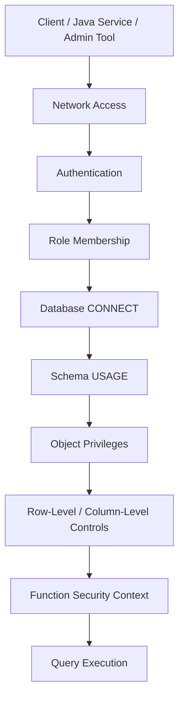

# Part 036 — PostgreSQL Security

## 1. Why this part matters

Database security is not only a platform or DBA concern. Backend code decides which queries run, which credentials are used, which tables are exposed through APIs, which migrations create objects, and which secrets reach runtime.

In an enterprise Java/JAX-RS system, PostgreSQL security must protect against:

- compromised service credentials,
- accidental destructive SQL,
- over-privileged application users,
- SQL injection escalation,
- unsafe migration accounts,
- leaked database passwords,
- dangerous `SECURITY DEFINER` functions,
- schema/search path hijacking,
- missing tenant or row isolation,
- inconsistent privilege grants after migration,
- audit gaps during incident investigation.

The goal is not to make every backend engineer a security administrator. The goal is to make database access reviewable, minimal, traceable, and operationally safe.

---

## 2. Security mental model

PostgreSQL security has several layers:



A connection is safe only when every layer is intentional.

### Key distinction

| Layer | Question |
|---|---|
| Network | Can this client reach the database endpoint? |
| Authentication | Can this identity log in? |
| Authorization | What can this role do after login? |
| Object ownership | Who owns tables/functions/views? |
| Runtime privileges | Which service account can read/write what? |
| Row policy | Which rows are visible/modifiable? |
| Function security | Does code execute with caller or owner privileges? |
| Secret management | How are credentials stored, rotated, and injected? |
| Auditability | Can we explain who did what and when? |

---

## 3. Roles, users, and groups

PostgreSQL uses roles. A role can be:

- a login role, similar to a user,
- a no-login role, similar to a group,
- an owner role for database objects,
- a membership role used to grant privileges.

Example:

```sql
CREATE ROLE quote_order_app LOGIN PASSWORD 'replace-with-secret-manager';
CREATE ROLE quote_order_readonly NOLOGIN;
CREATE ROLE quote_order_writer NOLOGIN;

GRANT quote_order_writer TO quote_order_app;
```

Production rule:

> Prefer granting privileges to group/no-login roles, then grant those roles to login/service identities.

This keeps permission management cleaner than granting everything directly to each login role.

---

## 4. Authentication vs authorization

Authentication answers: **who are you?**

Authorization answers: **what are you allowed to do?**

A common mistake is securing network access and authentication while leaving the application role over-privileged.

Bad production smell:

```text
Application service connects as schema owner or superuser-like role.
```

Better pattern:

- schema owner role owns objects but is not used by application runtime,
- migration role can perform DDL through controlled pipeline,
- application writer role has only required DML permissions,
- read-only role is separate,
- support/reporting role is separately constrained,
- emergency/admin role is audited and rarely used.

---

## 5. Object ownership and least privilege

Ownership is powerful. The owner of an object can usually alter or drop it. Application runtime should normally not own production tables.

### Recommended role separation

| Role type | Purpose | Typical privileges |
|---|---|---|
| Owner role | Own schema/table/function objects | DDL ownership, not used by app runtime |
| Migration role | Apply schema changes in CI/CD/GitOps | Controlled DDL and object creation |
| App writer role | Runtime service writes business data | SELECT/INSERT/UPDATE/DELETE on specific objects |
| App reader role | Runtime read-only service | SELECT on specific objects/views |
| Reporting role | BI/report access | SELECT on approved views/read models |
| DBA/admin role | Operational maintenance | Elevated, audited, limited use |

### Dangerous pattern

```sql
GRANT ALL PRIVILEGES ON DATABASE appdb TO quote_order_app;
GRANT ALL PRIVILEGES ON ALL TABLES IN SCHEMA public TO quote_order_app;
```

This is easy but usually too broad.

### Safer shape

```sql
GRANT CONNECT ON DATABASE appdb TO quote_order_app;
GRANT USAGE ON SCHEMA quote_order TO quote_order_app;

GRANT SELECT, INSERT, UPDATE, DELETE
ON TABLE quote_order.quote, quote_order.quote_item
TO quote_order_app;

GRANT USAGE, SELECT
ON SEQUENCE quote_order.quote_id_seq
TO quote_order_app;
```

Exact grants depend on schema and object design. Verify internally.

---

## 6. Schema permissions

Schema security has its own trap: granting table access is not enough. A role also needs `USAGE` on the schema to access objects inside it.

```sql
GRANT USAGE ON SCHEMA quote_order TO quote_order_app;
```

Be careful with the `public` schema. In many installations, default permissions on `public` may be broader than desired. Harden according to team/platform standards.

Example hardening pattern:

```sql
REVOKE CREATE ON SCHEMA public FROM PUBLIC;
```

Do not run this blindly in shared environments. Check compatibility with existing extensions, migrations, and tools.

---

## 7. Table, sequence, view, and function privileges

### 7.1 Table privileges

```sql
GRANT SELECT, INSERT, UPDATE, DELETE
ON TABLE quote_order.order_item
TO quote_order_app;
```

### 7.2 Column-level privileges

PostgreSQL supports column-level privileges. This can be useful for sensitive fields, but it can also become operationally complex.

```sql
GRANT SELECT (id, order_number, status)
ON quote_order.customer_order
TO quote_order_readonly;
```

Use column-level privileges intentionally. Many enterprise systems prefer exposing approved views instead.

### 7.3 Sequence privileges

If using sequences/identity-backed inserts, runtime roles may need sequence privileges.

```sql
GRANT USAGE, SELECT
ON SEQUENCE quote_order.order_id_seq
TO quote_order_app;
```

### 7.4 Function privileges

Functions can expose behavior that bypasses normal table-level expectations if not reviewed.

```sql
GRANT EXECUTE ON FUNCTION quote_order.calculate_price(uuid)
TO quote_order_app;
```

Review function privileges with the same seriousness as table privileges.

---

## 8. Default privileges

Default privileges control grants for future objects created by a role.

Without default privileges, a migration can create a new table that the application cannot access, or worse, one that receives unintended broad grants through ad-hoc scripts.

Example:

```sql
ALTER DEFAULT PRIVILEGES FOR ROLE quote_order_migration
IN SCHEMA quote_order
GRANT SELECT, INSERT, UPDATE, DELETE ON TABLES TO quote_order_app;

ALTER DEFAULT PRIVILEGES FOR ROLE quote_order_migration
IN SCHEMA quote_order
GRANT USAGE, SELECT ON SEQUENCES TO quote_order_app;
```

Internal verification is essential because default privileges are tied to the role that creates future objects.

Checklist:

- Which role runs migrations?
- Which role owns created objects?
- Are default privileges defined for that creator role?
- Are grants repeated manually in every migration?
- Do repeatable migrations reset function privileges?

---

## 9. Row-Level Security

Row-Level Security, or RLS, restricts which rows can be selected, inserted, updated, or deleted by a role according to policies.

Example tenant isolation sketch:

```sql
ALTER TABLE quote_order.quote ENABLE ROW LEVEL SECURITY;

CREATE POLICY quote_tenant_isolation
ON quote_order.quote
USING (tenant_id = current_setting('app.tenant_id')::uuid)
WITH CHECK (tenant_id = current_setting('app.tenant_id')::uuid);
```

Application then sets a session variable inside the transaction:

```sql
SET LOCAL app.tenant_id = '00000000-0000-0000-0000-000000000001';
```

### Important caution

RLS is powerful but easy to misuse.

Risks:

- tenant context not set,
- connection pooling leaks session state if not using `SET LOCAL`,
- policy logic is hard to test,
- superusers/table owners may bypass unless configured carefully,
- debugging becomes harder,
- query plans can be affected by policies,
- MyBatis queries may appear correct but return filtered data unexpectedly.

Use RLS only with clear architectural ownership and strong test coverage.

---

## 10. SECURITY DEFINER and function risk

Functions normally execute with caller privileges unless defined as `SECURITY DEFINER`. A `SECURITY DEFINER` function executes with the privileges of the function owner.

This can be useful for controlled privileged operations, but it is also a privilege escalation surface.

Dangerous example pattern:

```sql
CREATE FUNCTION admin_reset_order(order_id uuid)
RETURNS void
LANGUAGE plpgsql
SECURITY DEFINER
AS $$
BEGIN
  UPDATE quote_order.customer_order
  SET status = 'RESET'
  WHERE id = order_id;
END;
$$;
```

Problems to review:

- Who owns the function?
- Who can execute it?
- Is `search_path` fixed?
- Can caller influence dynamic SQL?
- Does it bypass tenant checks?
- Does it write audit records?
- Is it covered by tests?

### Safer `SECURITY DEFINER` pattern

```sql
CREATE FUNCTION quote_order.safe_operation(p_order_id uuid)
RETURNS void
LANGUAGE plpgsql
SECURITY DEFINER
SET search_path = quote_order, pg_temp
AS $$
BEGIN
  -- explicit schema references are still preferred
  UPDATE quote_order.customer_order
  SET updated_at = now()
  WHERE id = p_order_id;
END;
$$;

REVOKE ALL ON FUNCTION quote_order.safe_operation(uuid) FROM PUBLIC;
GRANT EXECUTE ON FUNCTION quote_order.safe_operation(uuid) TO quote_order_app;
```

The important parts are explicit ownership, controlled `EXECUTE`, fixed `search_path`, and no unsafe dynamic SQL.

---

## 11. Search path risk

`search_path` controls which schemas PostgreSQL searches when an object name is unqualified.

Example:

```sql
SHOW search_path;
```

If code or functions use unqualified object names, a malicious or accidental object in an earlier schema can change behavior.

Production rule:

> In migrations, functions, and security-sensitive SQL, prefer schema-qualified object names.

Use:

```sql
SELECT * FROM quote_order.quote WHERE id = $1;
```

Avoid relying on:

```sql
SELECT * FROM quote WHERE id = $1;
```

especially inside privileged functions.

---

## 12. SQL injection and privilege blast radius

PostgreSQL privileges limit damage only if runtime roles are constrained.

If application role can drop tables, SQL injection becomes catastrophic. If application role can only execute required DML on specific tables, impact is smaller.

MyBatis-specific risks:

- `${}` textual substitution,
- dynamic `ORDER BY`,
- dynamic table/column names,
- custom provider SQL,
- string-concatenated SQL in Java,
- unsafe function/procedure parameters,
- unreviewed admin endpoints.

Safer MyBatis habit:

- use `#{}` for values,
- whitelist dynamic column names in Java,
- avoid dynamic table names unless heavily controlled,
- keep app DB role least-privileged,
- test generated SQL paths,
- reject user-controlled SQL fragments.

---

## 13. TLS, network access, and authentication

Database security starts before SQL privileges.

Verify:

- database endpoint is private where required,
- security group/NSG/firewall allows only expected clients,
- TLS is required or policy-compliant,
- certificate validation behavior is understood,
- password auth uses approved mechanism,
- IAM/managed identity integration if used,
- local/dev bypasses do not leak into production.

Connection string settings depend on driver/platform. For pgJDBC, SSL-related properties must be verified against the actual driver version and platform policy.

Do not assume TLS because the database is cloud-managed. Verify runtime connection settings.

---

## 14. Secrets and credential lifecycle

Database credentials are production secrets.

Bad patterns:

- secrets committed to Git,
- secrets in plain ConfigMap,
- credentials copied into application logs,
- same password shared across services,
- migration and runtime use same credential,
- no rotation runbook,
- no emergency revoke path,
- developers use production app credential for manual queries.

Better patterns:

- cloud secret manager or Kubernetes secret mechanism approved by platform/security,
- separate credentials per service/environment,
- separate migration/runtime/read-only accounts,
- short rotation runbook,
- no secret in logs,
- access audit,
- break-glass process for emergency access.

---

## 15. Runtime service account design

Each service should ideally have its own database identity or at least its own clearly scoped role.

For microservices:

- Quote service should not have write access to unrelated service tables.
- Reporting service should use approved read model/views where possible.
- CDC connector should have replication privileges only if needed.
- Migration pipeline should not share runtime credentials.
- Support tooling should not use application credentials.

### Example separation

```text
quote_order_owner       owns schema objects, no app login
quote_order_migration   used by controlled migration pipeline
quote_order_app         runtime Java/JAX-RS service account
quote_order_readonly    reporting/read-only use
quote_order_cdc         Debezium/logical replication if applicable
quote_order_support     constrained operational support access
```

Exact names and policies must be verified internally.

---

## 16. CDC, replication, and special privileges

CDC/logical replication often needs special permissions or role attributes depending on PostgreSQL version and managed platform.

Risks:

- replication role too broad,
- CDC user can read more tables than intended,
- publication includes sensitive tables,
- event stream leaks PII,
- schema change exposes new columns downstream,
- replication slot retained after connector decommission,
- secrets for CDC connector poorly managed.

Internal verification:

- Which role owns publication/subscription?
- Which tables are included in publication?
- Are sensitive columns filtered before Kafka?
- Does Debezium connector credential have minimal required privileges?
- Is CDC access reviewed by security/data governance?

---

## 17. Views as security boundary

Views can expose a curated subset of data.

Example:

```sql
CREATE VIEW quote_order.order_summary_public AS
SELECT id, order_number, status, created_at
FROM quote_order.customer_order;

GRANT SELECT ON quote_order.order_summary_public TO reporting_role;
```

Benefits:

- simpler grants,
- hides sensitive columns,
- creates stable read contract,
- reduces direct table exposure.

Risks:

- view owner and security semantics must be understood,
- underlying table changes can break view,
- sensitive derived fields can still leak information,
- performance may be poor if view hides expensive joins.

---

## 18. Security impact on Java/JAX-RS error handling

Database permission errors should not leak internal details to API clients.

Example database errors:

- permission denied for table,
- permission denied for schema,
- permission denied for sequence,
- row-level security policy violation,
- function execution denied.

Application response should usually be a controlled technical error or mapped domain error, not raw SQL details.

MyBatis/JDBC layer should log enough for internal diagnosis but redact sensitive data.

Rules:

- Do not log credentials.
- Do not log full PII-bearing SQL parameters.
- Include correlation ID/request ID.
- Include SQLState/vendor code where useful.
- Include mapper/function name if available.
- Avoid returning raw database exception to client.

---

## 19. Cloud and Kubernetes considerations

### Kubernetes

Verify:

- database secret stored as Secret or external secrets integration,
- secret rotation updates pods safely,
- application does not print env vars,
- network policy restricts DB access,
- service account/workload identity integration if used,
- GitOps repo does not contain raw secret values,
- Helm values do not expose credentials.

### AWS

Verify:

- RDS security group and subnet exposure,
- Secrets Manager integration,
- IAM authentication if used,
- parameter group for SSL/security settings,
- RDS Proxy identity behavior if used,
- CloudWatch logs do not leak sensitive SQL parameters.

### Azure

Verify:

- private endpoint/VNet integration,
- firewall rules,
- Key Vault integration,
- managed identity if applicable,
- Azure Monitor/Query Store exposure of query text,
- TLS enforcement.

### On-prem/hybrid

Verify:

- firewall rules,
- TLS certificates,
- credential distribution,
- privileged admin access,
- bastion/jump host policy,
- audit trail for manual DB access.

---

## 20. Failure modes

| Failure mode | Symptom | Root cause | First diagnostic |
|---|---|---|---|
| App cannot start after migration | permission denied | new table/sequence missing grant | check migration/default privileges |
| Insert fails only in prod | sequence permission denied | table grant exists, sequence grant missing | inspect sequence grants |
| Service can modify too much data | security review finding | app role over-privileged | list grants for role |
| SQL injection has large blast radius | incident severity high | app role has broad DDL/DML | review role privileges |
| Tenant data leakage | wrong rows returned | missing app filter or RLS misconfig | test tenant isolation queries |
| Function privilege escalation | unexpected writes | unsafe `SECURITY DEFINER` | inspect function owner/search_path |
| Migration breaks access | object ownership changed | migration role/default grants inconsistent | inspect object owner/default privileges |
| Secret leak | credential visible in logs/repo | poor secret handling | rotate credential, audit access |
| Read-only user can see PII | reporting overexposed | direct table grants | replace with approved views |
| CDC leaks sensitive fields | Kafka contains PII | publication includes raw table | review publication/connector config |

---

## 21. Diagnostic SQL

### 21.1 Current role and search path

```sql
SELECT current_user, session_user;
SHOW search_path;
```

### 21.2 Role membership

```sql
SELECT
  r.rolname AS role,
  m.rolname AS member_of
FROM pg_roles r
JOIN pg_auth_members am ON am.member = r.oid
JOIN pg_roles m ON m.oid = am.roleid
ORDER BY r.rolname, m.rolname;
```

### 21.3 Table privileges

```sql
SELECT
  table_schema,
  table_name,
  grantee,
  privilege_type
FROM information_schema.table_privileges
WHERE table_schema NOT IN ('pg_catalog', 'information_schema')
ORDER BY table_schema, table_name, grantee, privilege_type;
```

### 21.4 Sequence privileges

```sql
SELECT
  object_schema,
  object_name,
  grantee,
  privilege_type
FROM information_schema.usage_privileges
WHERE object_type = 'SEQUENCE'
ORDER BY object_schema, object_name, grantee;
```

### 21.5 Function privileges

```sql
SELECT
  n.nspname AS schema_name,
  p.proname AS function_name,
  r.rolname AS owner,
  p.prosecdef AS security_definer
FROM pg_proc p
JOIN pg_namespace n ON n.oid = p.pronamespace
JOIN pg_roles r ON r.oid = p.proowner
WHERE n.nspname NOT IN ('pg_catalog', 'information_schema')
ORDER BY n.nspname, p.proname;
```

### 21.6 RLS enabled tables

```sql
SELECT
  schemaname,
  tablename,
  rowsecurity
FROM pg_tables
WHERE schemaname NOT IN ('pg_catalog', 'information_schema')
ORDER BY schemaname, tablename;
```

### 21.7 Policies

```sql
SELECT
  schemaname,
  tablename,
  policyname,
  permissive,
  roles,
  cmd,
  qual,
  with_check
FROM pg_policies
ORDER BY schemaname, tablename, policyname;
```

---

## 22. PR review checklist

### Role and privilege review

- Does the change require new table/sequence/function privileges?
- Are grants applied to group roles instead of direct login roles?
- Does runtime role remain least-privileged?
- Does migration role accidentally become owner/runtime role?
- Are default privileges updated for future objects?

### Schema and object review

- Are objects schema-qualified?
- Does the change depend on `public` schema permissions?
- Are new functions/procedures granted intentionally?
- Are views used where direct table grants would expose sensitive columns?

### Function/security review

- Is `SECURITY DEFINER` used?
- Is `search_path` fixed inside the function?
- Is dynamic SQL safe?
- Does function bypass tenant/security checks?
- Is execute privilege restricted?

### RLS/multi-tenant review

- Is tenant isolation enforced in application, database, or both?
- If RLS is used, how is tenant context set?
- Does connection pooling leak session state?
- Are RLS policies tested for select/insert/update/delete?

### Secret review

- Where is the credential stored?
- How is it injected into Kubernetes/cloud runtime?
- How is it rotated?
- Does rollback require old and new credentials temporarily?
- Are logs redacted?

### Observability/audit review

- Can DB sessions be tied to service/pod/application?
- Are permission failures visible in logs/alerts?
- Are admin/support accesses audited?
- Is there evidence for compliance review?

---

## 23. Internal verification checklist

Use this against CSG/internal systems. Do not infer answers.

### Role model

- List all PostgreSQL roles used by the service.
- Identify owner, migration, runtime, read-only, CDC, support, and admin roles.
- Verify whether application runtime owns any production objects.
- Verify whether runtime role has DDL privileges.
- Verify whether runtime role can access unrelated schemas.

### Privileges

- Check grants on schema/table/view/sequence/function.
- Check default privileges for migration-created future objects.
- Check whether `public` schema is hardened.
- Check whether direct table access is granted to reporting/support users.
- Check whether read-only users can access PII.

### RLS and tenancy

- Verify whether RLS is used.
- Verify tenant isolation strategy.
- Verify tests for cross-tenant access.
- Verify connection pool/session variable behavior.

### Functions/procedures

- List all `SECURITY DEFINER` functions.
- Check function owners.
- Check `search_path` usage.
- Check `EXECUTE` grants.
- Check audit/logging for privileged functions.

### Secrets/network

- Verify secret storage mechanism.
- Verify rotation process.
- Verify TLS enforcement.
- Verify cloud/private network exposure.
- Verify Kubernetes secret/GitOps handling.

### Operations

- Check incident notes involving permission/security failures.
- Check security review process for database changes.
- Check DBA/SRE escalation path.
- Check audit evidence requirements.
- Check break-glass access process.

---

## 24. Practical operating rules

1. Runtime services should not connect as object owners.
2. Runtime services should not use migration credentials.
3. Broad grants are production debt.
4. `SECURITY DEFINER` requires explicit review.
5. Unqualified object names are risky in privileged code.
6. RLS is powerful but must be tested like application security logic.
7. Secret rotation must be designed before a credential leaks.
8. CDC users and reporting users are security subjects, not harmless infrastructure.
9. Database permission errors should be observable internally but not leaked externally.
10. Every new schema object needs an access-control decision.

---

## 25. Senior engineer questions

Before approving database security changes, ask:

- Which identity will execute this SQL in production?
- Does that identity have only the privileges it needs?
- Who owns the created objects?
- What happens to future objects created by migrations?
- Could this expose PII or tenant data?
- Could SQL injection use this privilege to escalate impact?
- Does this function run as caller or owner?
- Is `search_path` controlled?
- How is the credential stored and rotated?
- Can we trace database activity back to service/pod/request?
- What must be verified with DBA/platform/security before merge?

---

## 26. References

- PostgreSQL Documentation — Database Roles: https://www.postgresql.org/docs/current/user-manag.html
- PostgreSQL Documentation — Privileges: https://www.postgresql.org/docs/current/ddl-priv.html
- PostgreSQL Documentation — Schemas and Search Path: https://www.postgresql.org/docs/current/ddl-schemas.html
- PostgreSQL Documentation — Row Security Policies: https://www.postgresql.org/docs/current/ddl-rowsecurity.html
- PostgreSQL Documentation — CREATE FUNCTION: https://www.postgresql.org/docs/current/sql-createfunction.html
- PostgreSQL JDBC Documentation: https://jdbc.postgresql.org/documentation/
