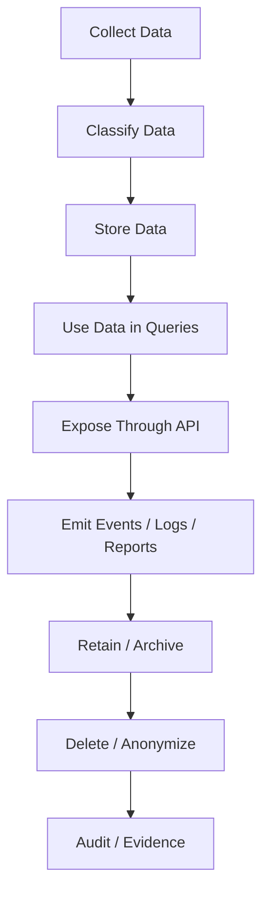
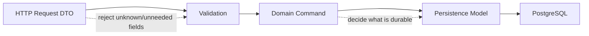
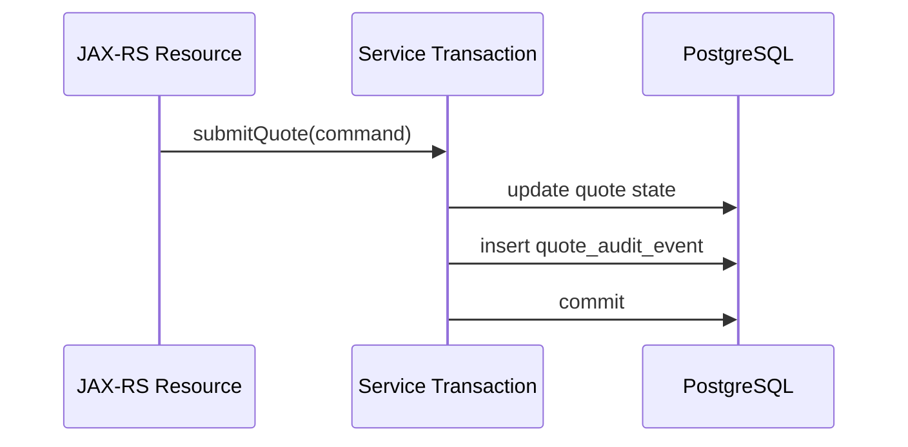
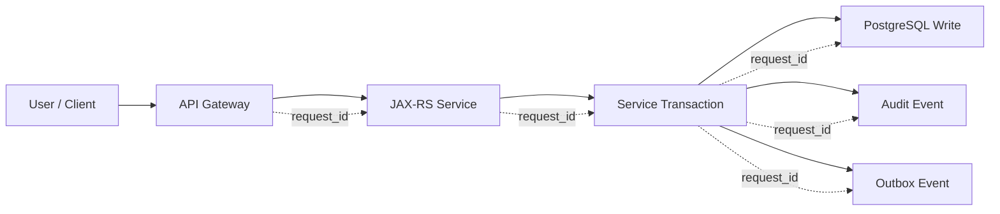

# Part 037 — Data Privacy, Audit, and Compliance

## 1. Why this part matters

A database can be technically healthy and still be unsafe.

A query can be fast, a migration can be clean, and a transaction can be correct, while the system still leaks sensitive data into logs, keeps personal data longer than required, exposes customer data to the wrong tenant, loses audit traceability, or makes incident investigation impossible.

For enterprise quote/order systems, data privacy is not an abstract legal topic. It affects concrete backend design decisions:

- which columns are allowed to exist,
- which fields are allowed in JSONB,
- which values are allowed in logs,
- which service accounts can read customer data,
- which events can be published to Kafka,
- which audit trail must be immutable enough for investigation,
- which records must be retained or deleted,
- which data repair must be traceable,
- which backup copies still contain sensitive data,
- which read models duplicate regulated information.

This part is not legal advice. It is an engineering handbook for making PostgreSQL-backed Java/JAX-RS systems more defensible, observable, and reviewable from a privacy, audit, and compliance perspective.

---

## 2. Core mental model

Data privacy is not one feature. It is a lifecycle control problem.



Every stage has a different failure mode.

| Stage | Engineering question |
|---|---|
| Collection | Do we need this data at all? |
| Classification | Is this PII, sensitive, confidential, operational, or public? |
| Storage | Is it normalized, encrypted, masked, constrained, and access-controlled? |
| Query | Can broad queries accidentally expose too much? |
| API | Does the response include only what the caller is allowed to see? |
| Event/log | Are we leaking data outside the source-of-truth boundary? |
| Retention | Do we keep it longer than needed? |
| Deletion | Can we delete, anonymize, or tombstone consistently? |
| Evidence | Can we prove what happened and who accessed or changed data? |

The main invariant:

> Sensitive data must have explicit ownership, explicit purpose, explicit access path, explicit retention policy, and explicit auditability.

---

## 3. Data classification

Before deciding on encryption, masking, retention, or audit, classify the data.

A practical classification model:

| Class | Example | Engineering treatment |
|---|---|---|
| Public | Public product names, published catalog labels | Normal controls |
| Internal | Internal status, workflow state, technical metadata | Role-based access, normal logs with care |
| Confidential | Pricing rules, contract terms, commercial agreement | Restrict access, audit reads/writes, avoid broad export |
| PII | Name, email, phone, address, customer identifiers | Minimize, mask, encrypt where needed, redact logs |
| Sensitive PII | Government ID, financial details, authentication secrets | Strongest controls, avoid storing unless required |
| Security secret | Password hash, token, API key, certificate | Never log, secret manager, rotation, least privilege |
| Regulated/audit-critical | Approval decision, order state change, consent, entitlement | Immutable audit trail, traceability, retention policy |

For CPQ/order systems, not every customer-related field is equal. A customer display name, contract ID, quote amount, discount rule, approval reason, and order fulfillment state may all need different handling.

---

## 4. PII handling

PII means data that can identify or relate to an identifiable person. In enterprise systems, the practical problem is often not one column, but combinations of data.

Examples:

- email,
- phone number,
- billing address,
- user account name,
- contact person,
- customer reference,
- external CRM identifier,
- free-text notes containing personal information,
- JSONB payloads containing embedded contact data,
- event payloads copied into Kafka topics,
- audit snapshots containing before/after values.

### Engineering rule

> Treat free-text, JSONB, event payloads, and audit snapshots as high-risk data containers.

The system may have excellent column-level discipline while still leaking PII inside:

```json
{
  "approvalComment": "Call Sarah at +62... before confirming the order",
  "customerContact": {
    "email": "person@example.com"
  }
}
```

### PostgreSQL-specific concern

PostgreSQL does not automatically know which columns are PII. Classification must come from your schema convention, metadata, governance process, or external catalog.

Useful patterns:

- column naming convention,
- schema comments,
- data catalog integration,
- explicit PII inventory,
- migration checklist requiring classification,
- restricted views for support/reporting access,
- JSON schema governance for JSONB fields,
- event schema governance for Kafka payloads.

Example schema comments:

```sql
COMMENT ON COLUMN customer_contact.email IS 'PII: customer contact email. Do not log. Mask in support views.';
COMMENT ON COLUMN quote.approval_comment IS 'Free text: may contain PII. Apply log redaction and access control.';
```

Comments alone do not enforce security, but they improve reviewability and tooling.

---

## 5. Data minimization

The safest data is data you do not store.

Before adding a column, JSON field, audit payload, or event attribute, ask:

1. What business decision requires this value?
2. Which service owns it?
3. Who can read it?
4. How long must it live?
5. Does it need to be searchable?
6. Does it need to be copied into read models/events?
7. Can it be tokenized or referenced instead of stored directly?
8. Can the value be derived when needed?
9. Can we store a less sensitive representation?

Bad pattern:

```text
Store full external payload because it may be useful later.
```

Better pattern:

```text
Store the minimal fields required for business processing, preserve external payload only in a controlled, encrypted, retention-bound archive if absolutely necessary.
```

### Data minimization in Java/JAX-RS

Do not let request DTOs become database models automatically.

A client may send fields that should not be persisted. The service layer should decide what crosses the persistence boundary.



Production smell:

```text
API payload is serialized directly into JSONB without classification or retention review.
```

---

## 6. Encryption in transit and at rest

Encryption is necessary but insufficient.

| Layer | Purpose | Engineering concern |
|---|---|---|
| TLS in transit | Protect data between app and DB | Enforce TLS, validate certificates where required |
| Storage encryption | Protect disk/snapshot media | Usually managed by cloud/platform, verify key policy |
| Backup encryption | Protect backup artifacts | Verify snapshots, WAL archive, export files |
| Application-level encryption | Protect selected fields from broad DB visibility | Key management, query limitation, rotation |
| Column encryption | Encrypt specific values before storing | Index/search trade-off, migration complexity |

### PostgreSQL and encryption boundary

PostgreSQL can participate in encryption strategies, but the real design depends on deployment model:

- managed cloud PostgreSQL,
- self-managed on-prem,
- Kubernetes operator,
- disk-level encryption,
- cloud KMS,
- application-level encryption library,
- `pgcrypto` if allowed,
- backup tooling,
- secret manager.

### Application-level encryption trade-off

If the application encrypts a column before insert:

```text
Java service encrypts value -> PostgreSQL stores ciphertext
```

Benefits:

- DB readers cannot see plaintext without key,
- backup exposure risk is reduced,
- accidental query output is less sensitive.

Costs:

- equality search may require deterministic encryption or separate hash,
- range search becomes difficult,
- sorting by plaintext is not possible,
- indexing is limited,
- key rotation is operationally expensive,
- debugging is harder,
- MyBatis TypeHandler may be required.

Pattern for searchable sensitive value:

```text
plaintext email -> encrypted_email + email_lookup_hash
```

Example shape:

```sql
CREATE TABLE customer_contact_secret (
  contact_id uuid PRIMARY KEY,
  email_ciphertext bytea NOT NULL,
  email_lookup_hash bytea NOT NULL UNIQUE,
  created_at timestamptz NOT NULL DEFAULT now()
);
```

This must be designed carefully with security specialists. Hashing sensitive values can still be vulnerable if the input space is small or predictable.

---

## 7. Tokenization and masking

Tokenization replaces sensitive data with a surrogate token.

Example:

```text
real email/address/payment reference -> token/reference id
```

The quote/order system stores the token. A separate system or vault resolves it when necessary.

Benefits:

- reduces sensitive data stored in PostgreSQL,
- narrows blast radius,
- simplifies read-model/event payloads,
- improves compliance posture.

Costs:

- introduces dependency on token service,
- affects debugging,
- affects reporting,
- requires strong availability and access model,
- may complicate reconciliation.

### Masking

Masking is for display, export, logs, support tools, and lower environments.

Examples:

```text
alice@example.com -> a***@example.com
+628123456789 -> +62******6789
```

Masking should not be confused with encryption. Masked data may still be sensitive depending on context.

### PostgreSQL view-based masking

One pattern is to expose support/reporting views that mask sensitive columns:

```sql
CREATE VIEW support_customer_contact_v AS
SELECT
  contact_id,
  left(email, 1) || '***@' || split_part(email, '@', 2) AS masked_email,
  created_at
FROM customer_contact;
```

This can help, but only if direct table access is denied and the view has correct privileges.

---

## 8. Audit table design

Audit is not the same as logging.

Application logs are operational traces. Audit records are durable evidence of meaningful business or data changes.

For quote/order systems, audit may be needed for:

- quote creation,
- quote price recalculation,
- discount override,
- approval decision,
- order submission,
- order cancellation,
- state transition,
- manual data repair,
- migration/backfill correction,
- privilege-sensitive access.

### Minimal audit record

A useful audit record usually needs:

| Field | Why it matters |
|---|---|
| audit_id | Stable event identity |
| entity_type | What kind of object changed |
| entity_id | Which object changed |
| action | What happened |
| actor_type | User, service, job, migration, support, admin |
| actor_id | Who/what caused it |
| request_id/correlation_id | Link to API/log/event trace |
| transaction_id or command_id | Link to application command |
| occurred_at | When it happened |
| before_value | Previous important state if allowed |
| after_value | New important state if allowed |
| reason | Business reason, if available |
| source | API, batch, migration, CDC, admin tool |

Example:

```sql
CREATE TABLE quote_audit_event (
  audit_id uuid PRIMARY KEY,
  quote_id uuid NOT NULL,
  action text NOT NULL,
  actor_type text NOT NULL,
  actor_id text NOT NULL,
  request_id text,
  occurred_at timestamptz NOT NULL DEFAULT now(),
  before_state jsonb,
  after_state jsonb,
  reason text,
  source text NOT NULL,
  CHECK (actor_type IN ('USER', 'SERVICE', 'JOB', 'MIGRATION', 'SUPPORT', 'ADMIN'))
);
```

### Audit snapshot risk

`before_state` and `after_state` are convenient but dangerous:

- they can duplicate PII,
- they can store secrets accidentally,
- they can grow very large,
- they can make deletion harder,
- they can leak through support tooling,
- they can become incompatible after schema evolution.

Safer pattern:

- audit only meaningful fields,
- redact sensitive values before insert,
- store hashes or identifiers instead of raw secrets,
- version the audit payload schema,
- apply explicit retention policy,
- restrict access to audit tables.

---

## 9. Audit trigger vs application audit

There are two common approaches.

### Application audit

The Java service writes the business change and audit event in the same transaction.



Benefits:

- business context is available,
- actor/reason/request id are explicit,
- easier to test at service level,
- easier to align with domain events.

Risks:

- developers can forget to write audit,
- duplicated audit logic across code paths,
- migration/admin changes may bypass application audit.

### Trigger-based audit

PostgreSQL trigger captures table changes.

Benefits:

- catches all table writes,
- useful for low-level data change history,
- can cover admin/migration writes if enabled.

Risks:

- hidden side effects,
- limited business context,
- harder to reason from Java code,
- can duplicate sensitive values,
- may impact write performance,
- trigger failures can break writes.

### Practical recommendation

Use application audit for domain-significant events. Use database trigger audit only when the team explicitly accepts the hidden-behavior and operational trade-offs.

For regulated workflows, the most defensible pattern is often:

```text
application domain audit + database-level technical change trace for high-risk tables
```

But the exact policy must be verified internally.

---

## 10. Change history and state transitions

In order/quote systems, state history is often more important than simple updated_at tracking.

Bad model:

```sql
status text NOT NULL,
updated_at timestamptz NOT NULL
```

This only tells the latest state.

Better model:

```sql
CREATE TABLE order_state_transition (
  transition_id uuid PRIMARY KEY,
  order_id uuid NOT NULL,
  from_state text,
  to_state text NOT NULL,
  transition_reason text,
  actor_id text NOT NULL,
  request_id text,
  occurred_at timestamptz NOT NULL DEFAULT now()
);
```

This supports:

- debugging,
- audit,
- SLA analysis,
- failed workflow reconstruction,
- approval traceability,
- incident investigation,
- customer dispute resolution.

### Correctness invariant

> If business users care how an entity reached its current state, store a transition history, not only the current state.

---

## 11. Retention, archival, and deletion

Retention answers: **how long should data exist?**

Deletion answers: **what happens when data must no longer be retained?**

Archival answers: **where does data go after it leaves the hot operational path?**

### Common retention categories

| Data type | Retention concern |
|---|---|
| Active quote/order | Needed for business operations |
| Historical quote snapshot | Needed for dispute/audit/reporting |
| Audit trail | May need longer retention, but contains sensitive data |
| Log data | Usually shorter retention; must redact secrets/PII |
| CDC topic/event | Often duplicated outside DB; retention must align |
| Backup | May retain deleted data until backup expiry |
| Read model/reporting table | May duplicate sensitive fields |
| Temporary import/export files | High leakage risk |

### Deletion is not one SQL statement

A right-to-delete-like requirement may require action across:

- primary tables,
- child tables,
- audit tables,
- search indexes,
- materialized views,
- read models,
- outbox/inbox tables,
- Kafka topics,
- object storage,
- logs,
- backups,
- data warehouse/lake,
- support exports.

Even when actual legal deletion does not apply, the engineering design must know where copies exist.

### Hard delete vs soft delete vs anonymization

| Strategy | Strength | Weakness |
|---|---|---|
| Hard delete | Removes data from active table | FK complexity, audit/report loss, backup copies remain |
| Soft delete | Preserves relationships | Data still exists, must filter everywhere |
| Anonymization | Keeps aggregate/business record | Hard to do correctly, must handle derived fields |
| Token revocation | Removes ability to resolve token | Requires tokenization architecture |

### PostgreSQL example: anonymization shape

```sql
UPDATE customer_contact
SET
  email = NULL,
  phone = NULL,
  display_name = 'Deleted Contact',
  anonymized_at = now()
WHERE contact_id = :contact_id;
```

This is only safe if:

- nullable fields are allowed,
- downstream systems tolerate anonymized data,
- search/read models are updated,
- audit policy allows redaction/anonymization,
- related derived copies are handled.

---

## 12. Log redaction

Logs are one of the most common privacy failure points.

High-risk log sources:

- HTTP request/response body logs,
- SQL parameter logs,
- MyBatis debug logs,
- exception messages,
- validation errors,
- dead-letter queue messages,
- Kafka event payload logs,
- failed migration/backfill logs,
- support/admin tool logs,
- database slow query logs if literals are logged,
- audit pipeline diagnostics.

### Java/JAX-RS rule

Never log complete request/response bodies by default in production.

For APIs involving quote/order/customer/contact/approval payloads:

- log request id,
- actor id,
- endpoint,
- entity id,
- status code,
- latency,
- safe error code,
- sanitized reason.

Avoid:

- raw payload,
- full SQL with sensitive literals,
- authorization header,
- cookie,
- access token,
- external system credentials,
- PII fields,
- free-text comments.

### MyBatis concern

MyBatis logging can reveal SQL parameters depending on logger configuration. Review logging level and appenders in production.

Bad pattern:

```text
DEBUG mapper SQL logs enabled globally in production.
```

Better pattern:

```text
SQL observability through pg_stat_statements/query id + safe application correlation id, not raw parameter logging.
```

---

## 13. Access traceability

Traceability answers:

> Can we reconstruct who accessed or changed sensitive data, through which service, under which request, and why?

Minimum correlation chain:



Practical fields:

- `request_id`,
- `correlation_id`,
- `actor_id`,
- `actor_type`,
- `tenant_id`,
- `service_name`,
- `operation_name`,
- `entity_type`,
- `entity_id`,
- `occurred_at`,
- `source_ip` if allowed and useful,
- `deployment_version`,
- `migration_id` or `job_id` for non-request changes.

### PostgreSQL session context pattern

Some systems set session variables for traceability:

```sql
SELECT set_config('app.request_id', :request_id, true);
SELECT set_config('app.actor_id', :actor_id, true);
```

Then triggers or audit functions can read:

```sql
SELECT current_setting('app.request_id', true);
```

This can work, but be careful with connection pooling. Session state must not leak across requests. Transaction-local settings are safer than session-wide settings.

---

## 14. PostgreSQL row-level security and compliance

Row-level security can restrict rows visible or modifiable by a role. It can be useful for tenant isolation, support tooling, or controlled access views.

But RLS is not free architecture.

Risks:

- policy complexity,
- unexpected query behaviour,
- performance surprises,
- table owner bypass rules unless forced,
- difficulty debugging permission failures,
- mismatch with application-level authorization,
- migration/test environment drift.

Use RLS when the team intentionally wants database-enforced row boundaries. Do not use it as a substitute for clear service authorization.

Questions before using RLS:

1. Is tenant/user context available safely in the DB session?
2. Does connection pooling preserve or leak context?
3. Are policies covered by integration tests?
4. Are support/admin paths explicit?
5. Are query plans acceptable under policy predicates?
6. Do migrations run under roles that bypass or respect RLS intentionally?

---

## 15. Privacy and audit in CDC/Kafka

CDC and outbox patterns duplicate database facts into event streams. Once data enters Kafka, it may be consumed, stored, replayed, indexed, logged, or exported by many systems.

Event payload review questions:

- Does the event contain PII?
- Is PII necessary for consumers?
- Can consumers fetch details by ID instead?
- Is the event retained longer than source data?
- Is the event schema versioned?
- Can old events be replayed safely?
- Are dead-letter topics redacted?
- Are event logs sanitized?
- Does the warehouse/lake receive the payload?
- Does deletion/anonymization propagate?

Bad event shape:

```json
{
  "eventType": "QuoteApproved",
  "quoteId": "...",
  "customerEmail": "person@example.com",
  "approvalComment": "contains free text..."
}
```

Safer event shape:

```json
{
  "eventType": "QuoteApproved",
  "quoteId": "...",
  "customerId": "...",
  "approvalId": "...",
  "occurredAt": "..."
}
```

Consumers can call authorized APIs or read approved read models when they need details.

---

## 16. Lower environments and test data

Non-production data is often less protected but more accessible. That is dangerous if it contains production-like PII.

Rules:

- avoid production data in dev/test unless formally approved,
- anonymize or synthesize test data,
- prevent logs/export files from carrying real PII,
- restrict database dumps,
- encrypt shared dump files,
- expire temporary data extracts,
- track who can access staging/UAT databases,
- ensure sample data in repositories contains no real customer data.

Production smell:

```text
A developer downloads a production dump to debug one issue.
```

Better:

```text
Use a minimal, approved, redacted reproduction dataset or controlled diagnostic query reviewed by DBA/SRE/security.
```

---

## 17. Backup and compliance

Backups preserve data, including data that was later deleted or corrected.

Privacy questions:

- Are backups encrypted?
- Who can restore backups?
- Are restored environments access-controlled?
- How long are backups retained?
- Do backups include deleted/anonymized data until expiry?
- Are backup exports copied to external storage?
- Are restore drills audited?
- Does PITR preserve sensitive changes?
- Is there a documented position for deletion requests vs backup retention?

Engineering reality:

> Deleting a row from the primary database does not immediately erase it from backups, replicas, logs, CDC streams, or warehouses.

This must be understood and documented with the appropriate internal policy owners.

---

## 18. Java/JAX-RS impact

Privacy is enforced partly at the API boundary.

Review points:

- Request DTO must reject unknown or unsupported sensitive fields.
- Response DTO must not expose internal columns by accident.
- Error response must not include raw SQL, constraint names if sensitive, or payload fragments.
- Authorization must happen before database access where possible.
- Audit context must be propagated through service methods.
- `request_id` and actor identity must be available to persistence/audit layer.
- Logs must use sanitized structured fields.
- Admin/support endpoints require stronger audit.
- Bulk export endpoints require explicit privacy review.

Bad pattern:

```java
return repository.findById(id); // persistence object serialized directly
```

Better pattern:

```text
Repository row -> domain object -> authorization/filtering -> response DTO
```

---

## 19. MyBatis/JDBC impact

MyBatis makes SQL explicit, which helps review privacy-sensitive queries. It also means the mapper can accidentally expose too much.

Review mapper for:

- `SELECT *`,
- broad joins including sensitive columns,
- support/reporting mappers reading base tables instead of approved views,
- dynamic filters missing tenant/security predicates,
- SQL logs revealing bind parameters,
- result maps containing sensitive fields unused by API,
- bulk export queries,
- audit insert consistency,
- JSONB payload extraction of sensitive fields,
- free-text search over sensitive comments.

Safer mapper discipline:

```sql
SELECT
  quote_id,
  quote_number,
  status,
  total_amount,
  created_at
FROM quote
WHERE quote_id = #{quoteId}
  AND tenant_id = #{tenantId}
```

Avoid:

```sql
SELECT * FROM quote WHERE quote_id = #{quoteId}
```

---

## 20. Kubernetes, AWS, Azure, and on-prem impact

### Kubernetes

Verify:

- secrets are not stored as plaintext manifests,
- secret mounting does not expose credentials broadly,
- pod logs are redacted,
- debug containers are controlled,
- backup sidecars do not write unencrypted artifacts,
- network policies restrict DB access,
- ephemeral export files are cleaned up,
- operator-managed backup/restore is audited.

### AWS

Verify:

- RDS/Aurora encryption at rest,
- KMS key ownership and rotation policy,
- Secrets Manager integration,
- IAM authentication if used,
- CloudWatch log redaction/retention,
- Performance Insights access policy,
- snapshot sharing restrictions,
- cross-region backup encryption.

### Azure

Verify:

- Flexible Server encryption and key policy,
- Key Vault integration,
- private endpoint/VNet controls,
- Azure Monitor retention/access,
- backup/restore permissions,
- Query Store exposure,
- managed identity usage if applicable.

### On-prem

Verify:

- disk encryption,
- backup media handling,
- filesystem permissions,
- TLS termination,
- DBA/admin access audit,
- dump/export policy,
- patching and vulnerability management,
- air-gapped transfer controls.

---

## 21. Failure modes

| Failure mode | Symptom | Likely root cause |
|---|---|---|
| PII in logs | Sensitive values visible in log platform | Request/SQL/event logging too broad |
| PII in Kafka | Events contain customer/contact fields | Event schema not privacy-reviewed |
| Support overexposure | Support user sees full table data | Direct table grants instead of masked views |
| Audit gap | Cannot explain who changed order status | Missing audit context or bypass path |
| Retention breach | Old records remain indefinitely | No lifecycle job or unclear policy |
| Delete incomplete | Data removed from main table but still in read model | Copy inventory incomplete |
| Backup exposure | Restored DB contains sensitive data in lower env | Poor restore access control |
| JSONB leakage | Sensitive value hidden in JSON payload | No JSON schema governance |
| Free-text leakage | Notes/comments contain PII | No input guidance/redaction strategy |
| Over-broad mapper | API returns fields caller should not see | Persistence model exposed directly |
| RLS bypass | Owner/admin path sees all rows unexpectedly | Policy/role model misunderstood |
| Token/key issue | Encrypted field unreadable after rotation | Key lifecycle not tested |

---

## 22. Detection and debugging

Privacy incidents are often discovered indirectly:

- log search finds email/phone/token pattern,
- support screenshot exposes sensitive field,
- warehouse/report contains unexpected PII,
- Kafka consumer complains about payload size or sensitive data,
- audit investigation cannot reconstruct actor,
- restore drill exposes production data in non-prod,
- security review finds broad grants,
- data deletion request cannot be completed confidently.

Useful investigation questions:

1. Where did the sensitive value originate?
2. Which table/column/JSON path stores it?
3. Which mapper/query reads it?
4. Which API exposes it?
5. Which log/event/report copies it?
6. Which roles can access it?
7. Which backups/replicas/read models contain it?
8. What is the retention/deletion path?
9. Is there an audit trail for access/change?
10. Is this one record, one tenant, or systemic?

---

## 23. Production-safe response pattern

When a privacy/audit issue is suspected:

1. **Contain**: stop further leakage if possible.
2. **Preserve evidence**: do not destroy logs/audit records prematurely.
3. **Scope**: identify affected fields, tenants, records, systems, time range.
4. **Classify**: determine severity with security/privacy owners.
5. **Fix source**: schema/query/API/event/log pipeline.
6. **Clean copies**: read models, logs if policy allows, exports, DLQs.
7. **Validate**: prove leakage no longer happens.
8. **Document**: RCA, corrective action, preventive action.

Do not run broad destructive SQL in panic. Data repair needs runbook, approval, backup/restore awareness, and validation queries.

---

## 24. PR review checklist

For every schema/query/API/event change involving customer, account, quote, order, approval, contract, pricing, or free-text data, ask:

### Data classification

- [ ] Are new columns classified?
- [ ] Are JSONB fields classified?
- [ ] Are free-text fields treated as high risk?
- [ ] Are comments or metadata added where useful?

### Minimization

- [ ] Is every stored field necessary?
- [ ] Can a reference/token replace raw sensitive data?
- [ ] Is the field needed in events/read models/reports?

### Access control

- [ ] Are direct table grants restricted?
- [ ] Are support/reporting paths masked or view-based?
- [ ] Are tenant/security predicates present?
- [ ] Does RLS apply or intentionally not apply?

### Audit

- [ ] Is the business action auditable?
- [ ] Are actor, request id, reason, and source captured?
- [ ] Are admin/migration/batch changes traceable?
- [ ] Are audit payloads redacted/versioned?

### Logs/events

- [ ] Are request/response bodies not logged by default?
- [ ] Are SQL parameters not leaked?
- [ ] Are Kafka/outbox payloads minimized?
- [ ] Are DLQ/error logs sanitized?

### Retention/deletion

- [ ] Is retention known?
- [ ] Are read-model copies handled?
- [ ] Are backups/logs/events considered?
- [ ] Is anonymization/delete path tested?

### Operations

- [ ] Can support debug without full sensitive data?
- [ ] Are dashboards safe?
- [ ] Are exports controlled?
- [ ] Is incident response path known?

---

## 25. Internal verification checklist

Verify with CSG/team rather than assuming:

- [ ] Which columns/tables are classified as PII or sensitive?
- [ ] Is there an internal data classification standard?
- [ ] Are schema comments or data catalog entries used?
- [ ] What is the approved retention policy for quotes, orders, audit, logs, events, backups?
- [ ] Are support/reporting users reading base tables or views?
- [ ] Are masked views used anywhere?
- [ ] Is PostgreSQL row-level security used?
- [ ] Are application logs scanned for PII/secrets?
- [ ] Is MyBatis SQL parameter logging disabled in production?
- [ ] Do Kafka/outbox events include PII?
- [ ] Are DLQ topics redacted or access-restricted?
- [ ] Are backup and restore processes audited?
- [ ] Are production dumps allowed in lower environments?
- [ ] Are audit triggers or application audit tables used?
- [ ] Are manual data repairs auditable?
- [ ] Are database credentials rotated?
- [ ] Are encryption keys managed by KMS/Key Vault/internal secret system?
- [ ] What is the deletion/anonymization process?
- [ ] Who approves privacy-sensitive schema changes?
- [ ] What incident process applies to privacy exposure?

---

## 26. Senior engineer heuristic

A senior backend engineer should not ask only:

> Does this query work?

Ask:

> Should this data exist, who can see it, where will it be copied, how long will it live, and can we prove what happened later?

That is the privacy/audit/compliance mindset for PostgreSQL-backed enterprise systems.

---

## 27. References

- PostgreSQL Documentation — Privileges, Roles, Row Security Policies, and Security-related SQL commands.
- PostgreSQL Documentation — Monitoring and statistics views useful for audit investigation.
- Internal company privacy/security/compliance policy must be treated as source of truth for legal and regulatory requirements.
