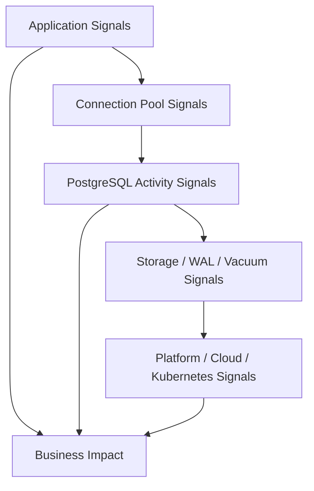

# Part 038 — PostgreSQL Observability

## 1. Why this part matters

PostgreSQL production incidents rarely start with a clear error message.

They often start like this:

- API latency slowly increases.
- A Java service pool becomes exhausted.
- One endpoint times out under normal traffic.
- Kafka publisher lag increases because outbox polling slows down.
- A migration appears stuck.
- CPU is high but no single query is obviously bad.
- Disk grows unexpectedly.
- Replication lag increases.
- Autovacuum cannot keep up.
- A table becomes bloated.
- A read replica returns stale data.
- Kubernetes pods restart and create a connection storm.

Observability is the discipline of answering:

> What is PostgreSQL doing, why is it doing it, how bad is it, and what should we do next?

For senior Java/JAX-RS engineers, PostgreSQL observability is not optional. Your service latency, transaction correctness, retry behaviour, connection pool health, MyBatis query design, and deployment safety are coupled to database signals.

---

## 2. Observability mental model

PostgreSQL observability has five layers.



| Layer | Examples | Main question |
|---|---|---|
| Application | API latency, error rate, retry count | Which endpoint/user journey is affected? |
| Pool | active/idle/waiting connections | Is the service waiting for DB connections? |
| Database activity | sessions, locks, waits, query stats | What is PostgreSQL doing now? |
| Storage/WAL/vacuum | disk, WAL, dead tuples, bloat | Is the engine falling behind? |
| Platform | CPU, memory, IO, network, replica lag | Is infrastructure saturated or failing? |

The key principle:

> Database metrics must be correlated with application requests, deployment version, mapper/query id, and business operation.

A slow SQL statement is not enough. You need to know which endpoint, tenant, job, migration, or event publisher caused it.

---

## 3. Golden signals for PostgreSQL-backed services

For a Java/JAX-RS service, monitor at least:

| Signal | Why it matters |
|---|---|
| API latency by endpoint | User-visible symptom |
| HTTP 5xx/4xx error rate | Failure surface |
| DB call latency | Persistence layer symptom |
| Connection pool active/idle/pending | Pool pressure and leaks |
| Transaction duration | Long transaction/vacuum impact |
| Query latency by normalized SQL | Slow query detection |
| Lock wait time | Blocking/concurrency issue |
| Deadlock/serialization failures | Concurrency correctness issue |
| Rows scanned/returned ratio | Query selectivity issue |
| Temp file usage | Sort/hash/work_mem pressure |
| WAL generation | Write pressure/CDC/replication impact |
| Replication lag | Read replica/CDC freshness risk |
| Dead tuples/bloat | Vacuum not keeping up |
| Disk usage | Capacity and emergency risk |

The objective is not to create hundreds of alerts. The objective is to detect user-impacting failure early and diagnose it quickly.

---

## 4. Slow query log

Slow query logging is useful because it captures individual statements exceeding a duration threshold.

What it helps answer:

- Which SQL is slow?
- How often is it slow?
- Does slowness correlate with a deploy or traffic spike?
- Is it one endpoint or many?
- Is it parameter-sensitive?

Production cautions:

- logging full SQL parameters may expose sensitive data,
- too low threshold can produce noisy logs,
- too high threshold misses early degradation,
- logs must include timestamp, database, user, application name, and ideally correlation context,
- slow query logs show completed slow queries, not necessarily currently blocking ones.

Useful configuration concepts to verify internally:

```text
log_min_duration_statement
log_line_prefix
log_lock_waits
deadlock_timeout
application_name
```

Do not blindly change these in production without DBA/SRE alignment.

---

## 5. `application_name`

PostgreSQL sessions can include `application_name`. This is one of the simplest observability improvements.

For Java services, set a meaningful application name in JDBC configuration, such as:

```text
quote-order-service
quote-order-service:outbox-publisher
quote-order-service:migration
quote-order-service:backfill
```

Why it matters:

- identifies which service owns sessions,
- separates API traffic from jobs,
- improves `pg_stat_activity` readability,
- helps DBA/SRE during incident triage,
- makes connection storms easier to attribute.

Bad pattern:

```text
All sessions appear as PostgreSQL JDBC Driver.
```

Better pattern:

```text
Sessions identify service, component, and sometimes deployment/job role.
```

---

## 6. `pg_stat_activity`

`pg_stat_activity` shows current server process/activity information. It is the first place to look when asking:

> What is the database doing right now?

Typical triage query:

```sql
SELECT
  pid,
  usename,
  application_name,
  client_addr,
  state,
  wait_event_type,
  wait_event,
  now() - xact_start AS xact_age,
  now() - query_start AS query_age,
  left(query, 300) AS query
FROM pg_stat_activity
WHERE datname = current_database()
ORDER BY query_start NULLS LAST;
```

Key fields:

| Field | Meaning |
|---|---|
| `pid` | Backend process id |
| `application_name` | Client/service identity if configured |
| `state` | active, idle, idle in transaction, etc. |
| `wait_event_type` | Kind of wait, such as Lock, IO, Client |
| `wait_event` | Specific wait event |
| `xact_start` | Transaction start time |
| `query_start` | Current query start time |
| `backend_start` | Session start time |
| `query` | Current or last query text, depending on state/config |

### Red flags

- many sessions `active` for long time,
- many sessions `idle in transaction`,
- old `xact_start`,
- sessions waiting on Lock,
- application_name missing or generic,
- many connections from unexpected client,
- migration/backfill running during peak traffic,
- outbox publisher query stuck,
- prepared transaction/session state surprise if relevant.

---

## 7. Long transactions and idle in transaction

Long transactions are dangerous in PostgreSQL because they can prevent vacuum from cleaning dead tuples and can hold locks longer than intended.

Find old transactions:

```sql
SELECT
  pid,
  application_name,
  state,
  now() - xact_start AS xact_age,
  now() - query_start AS query_age,
  wait_event_type,
  wait_event,
  left(query, 300) AS query
FROM pg_stat_activity
WHERE xact_start IS NOT NULL
ORDER BY xact_start;
```

Find idle-in-transaction sessions:

```sql
SELECT
  pid,
  application_name,
  usename,
  now() - xact_start AS xact_age,
  now() - state_change AS idle_age,
  left(query, 300) AS last_query
FROM pg_stat_activity
WHERE state = 'idle in transaction'
ORDER BY xact_start;
```

Common Java causes:

- transaction opened too early in request lifecycle,
- streaming response holds transaction open,
- missing commit/rollback on exception path,
- manual JDBC transaction not closed,
- long external API call inside DB transaction,
- batch job processes too many rows per transaction,
- debugging breakpoint in transaction,
- mapper returns lazy/streaming result not fully consumed.

Production rule:

> A transaction should be short, bounded, and contain only work that must be atomic.

---

## 8. `pg_locks` and blocking diagnosis

When requests hang or migrations appear stuck, check locks.

Blocking query:

```sql
SELECT
  blocked.pid AS blocked_pid,
  blocked.application_name AS blocked_app,
  now() - blocked.query_start AS blocked_age,
  left(blocked.query, 300) AS blocked_query,
  blocker.pid AS blocker_pid,
  blocker.application_name AS blocker_app,
  now() - blocker.query_start AS blocker_age,
  left(blocker.query, 300) AS blocker_query
FROM pg_stat_activity blocked
JOIN pg_locks blocked_locks
  ON blocked_locks.pid = blocked.pid
JOIN pg_locks blocker_locks
  ON blocker_locks.locktype = blocked_locks.locktype
 AND blocker_locks.database IS NOT DISTINCT FROM blocked_locks.database
 AND blocker_locks.relation IS NOT DISTINCT FROM blocked_locks.relation
 AND blocker_locks.page IS NOT DISTINCT FROM blocked_locks.page
 AND blocker_locks.tuple IS NOT DISTINCT FROM blocked_locks.tuple
 AND blocker_locks.virtualxid IS NOT DISTINCT FROM blocked_locks.virtualxid
 AND blocker_locks.transactionid IS NOT DISTINCT FROM blocked_locks.transactionid
 AND blocker_locks.classid IS NOT DISTINCT FROM blocked_locks.classid
 AND blocker_locks.objid IS NOT DISTINCT FROM blocked_locks.objid
 AND blocker_locks.objsubid IS NOT DISTINCT FROM blocked_locks.objsubid
 AND blocker_locks.pid <> blocked_locks.pid
JOIN pg_stat_activity blocker
  ON blocker.pid = blocker_locks.pid
WHERE NOT blocked_locks.granted
  AND blocker_locks.granted;
```

Simpler versions may be available depending on team tooling. The important idea is to identify:

- blocked session,
- blocker session,
- lock type,
- query age,
- transaction age,
- application_name,
- whether the blocker is safe to terminate.

Never kill sessions blindly. Terminating the blocker may rollback important work, fail a migration, corrupt an application-level workflow, or trigger retries that amplify load.

---

## 9. `pg_stat_statements`

`pg_stat_statements` tracks planning/execution statistics for normalized SQL statements. It is one of the most useful tools for finding expensive query patterns over time.

Questions it helps answer:

- Which queries consume the most total time?
- Which queries have high mean latency?
- Which queries run very frequently?
- Which queries read many rows?
- Which queries are responsible for IO?
- Did a deploy change query behaviour?

Example query:

```sql
SELECT
  calls,
  total_exec_time,
  mean_exec_time,
  max_exec_time,
  rows,
  shared_blks_hit,
  shared_blks_read,
  temp_blks_written,
  left(query, 500) AS query
FROM pg_stat_statements
ORDER BY total_exec_time DESC
LIMIT 20;
```

Look at different rankings:

```sql
-- Heavy total cost
ORDER BY total_exec_time DESC

-- Slow average query
ORDER BY mean_exec_time DESC

-- Very frequent query
ORDER BY calls DESC

-- Disk-heavy query
ORDER BY shared_blks_read DESC

-- Temp-file-heavy query
ORDER BY temp_blks_written DESC
```

### Important nuance

A query with low average latency but huge call count can dominate database load.

A query with high average latency but rare calls may be less urgent unless it affects critical user journeys.

A query with bad max latency may indicate parameter-sensitive plan or occasional lock contention.

---

## 10. Query ID and correlation

Modern PostgreSQL can compute query identifiers that help connect logs, `EXPLAIN`, and statistics. Tooling may also normalize SQL at application or APM layer.

For enterprise debugging, try to correlate:

```text
HTTP endpoint -> service method -> MyBatis mapper id -> SQL/query id -> pg_stat_statements entry -> EXPLAIN plan
```

Example operational metadata to preserve:

- endpoint name,
- request id,
- tenant id if safe,
- mapper namespace/id,
- normalized SQL name,
- deployment version,
- job id/backfill id,
- application_name.

Without this chain, database troubleshooting becomes guesswork.

---

## 11. `pg_stat_user_tables`

`pg_stat_user_tables` helps understand table-level behaviour.

Useful query:

```sql
SELECT
  relname,
  seq_scan,
  seq_tup_read,
  idx_scan,
  n_tup_ins,
  n_tup_upd,
  n_tup_del,
  n_dead_tup,
  last_vacuum,
  last_autovacuum,
  last_analyze,
  last_autoanalyze
FROM pg_stat_user_tables
ORDER BY n_dead_tup DESC
LIMIT 20;
```

Signals:

| Signal | Possible interpretation |
|---|---|
| High `seq_scan` | May be normal for small table or bad for large table |
| High `seq_tup_read` | Large table scans |
| High `n_dead_tup` | Vacuum pressure/bloat risk |
| No recent analyze | Bad planner estimates possible |
| High updates/deletes | Write-heavy table, bloat risk |
| Low index scan on expected indexed table | Query/index mismatch |

Do not treat sequential scan as automatically bad. A sequential scan on a small table may be optimal. The issue is sequential scanning large tables under latency-sensitive workload.

---

## 12. `pg_stat_user_indexes`

Index stats help identify unused or heavily used indexes.

```sql
SELECT
  relname AS table_name,
  indexrelname AS index_name,
  idx_scan,
  idx_tup_read,
  idx_tup_fetch
FROM pg_stat_user_indexes
ORDER BY idx_scan ASC, indexrelname;
```

Cautions:

- stats reset after restart or manual reset,
- rarely used indexes may still protect critical rare queries,
- unique indexes enforce correctness even if rarely scanned,
- indexes supporting FK checks or maintenance may not be obvious,
- dropping indexes requires careful review.

Production rule:

> Unused-index cleanup is a change management activity, not a quick cleanup script.

---

## 13. `pg_stat_database`

Database-level stats provide broad indicators:

```sql
SELECT
  datname,
  numbackends,
  xact_commit,
  xact_rollback,
  blks_read,
  blks_hit,
  tup_returned,
  tup_fetched,
  tup_inserted,
  tup_updated,
  tup_deleted,
  conflicts,
  deadlocks,
  temp_files,
  temp_bytes
FROM pg_stat_database
WHERE datname = current_database();
```

Watch:

- rollback spikes,
- deadlock count,
- temp file growth,
- backend count,
- cache hit trend,
- conflict count on replicas,
- transaction throughput changes.

Cache hit ratio can be useful, but do not turn it into a simplistic alert without context. A reporting workload and OLTP workload can have very different cache behaviours.

---

## 14. Wait events

Wait events explain what a backend is waiting for.

Common categories:

| Wait category | Possible meaning |
|---|---|
| Lock | Waiting for another transaction/session |
| IO | Waiting on storage read/write |
| Client | Waiting for client to send/receive data |
| LWLock | Internal lightweight lock contention |
| Timeout | Waiting due to timeout/sleep |
| Activity | Background process activity wait |

Triage query:

```sql
SELECT
  wait_event_type,
  wait_event,
  count(*)
FROM pg_stat_activity
WHERE wait_event IS NOT NULL
GROUP BY wait_event_type, wait_event
ORDER BY count(*) DESC;
```

Interpretation requires context. A Client wait may mean the database is waiting for the Java app to consume results. That may point to network, large result streaming, slow application processing, or an endpoint holding a transaction while sending response data.

---

## 15. Connection count and pool pressure

Database connections are not free. Too many connections can increase memory use and contention.

Monitor from both sides:

### PostgreSQL side

```sql
SELECT
  application_name,
  state,
  count(*)
FROM pg_stat_activity
WHERE datname = current_database()
GROUP BY application_name, state
ORDER BY count(*) DESC;
```

### Java pool side

Track:

- active connections,
- idle connections,
- pending threads waiting for connection,
- connection acquisition latency,
- pool timeout count,
- leak detection events,
- max lifetime churn,
- validation failures.

Kubernetes multiplier:

```text
service replicas × max pool size = possible DB connections from that service
```

If 20 pods each have pool size 30, that service alone can attempt 600 database connections.

---

## 16. Temporary files and `work_mem`

PostgreSQL may write temporary files when sorts, hashes, or aggregations exceed memory.

Signals:

- `temp_files`,
- `temp_bytes`,
- slow sort/aggregation queries,
- disk IO spike,
- log entries if temp file logging is enabled,
- pg_stat_statements `temp_blks_written`.

Likely causes:

- large ORDER BY,
- large GROUP BY,
- hash join over large dataset,
- reporting query on OLTP database,
- missing selective filter,
- pagination with large offset,
- too many concurrent memory-heavy queries,
- low or misused `work_mem`.

Important nuance:

> Increasing `work_mem` globally can be dangerous because it applies per operation, per query, per session.

Prefer query/index/design fixes first. Use session-level changes only with strong control and review.

---

## 17. WAL generation

WAL growth matters for:

- replication,
- PITR,
- backup/archive,
- CDC/logical decoding,
- disk usage,
- write throughput,
- failover readiness.

High WAL generation can come from:

- bulk update/backfill,
- large delete,
- heavy insert workload,
- index creation,
- table rewrite migration,
- high-churn table,
- JSONB updates rewriting large values,
- autovacuum/freeze patterns indirectly affecting IO,
- CDC slot retention when consumers lag.

Monitor:

- WAL generation rate,
- archive lag/failure,
- replication slot retained WAL,
- disk usage of WAL directory,
- Debezium/logical replication lag,
- RPO/PITR archive health.

---

## 18. Replication lag

Replication lag affects:

- read replica freshness,
- failover data loss risk for async replicas,
- CDC event freshness,
- reporting staleness,
- cross-region recovery,
- consumer behaviour.

Common causes:

- replica under-provisioned,
- network issue,
- long-running query on replica,
- heavy primary write workload,
- large transaction/backfill,
- replication slot consumer lag,
- storage IO saturation,
- lock/conflict behaviour on standby.

Application impact:

- read-after-write inconsistency if API writes primary and reads replica,
- outbox/CDC delay,
- stale reporting dashboards,
- failover with unexpected RPO impact.

Design rule:

> If a user journey requires read-your-write, do not casually route the follow-up read to an async replica.

---

## 19. Autovacuum and dead tuples

Autovacuum health is observable through table stats, logs, and bloat indicators.

Watch:

- `n_dead_tup`,
- last autovacuum time,
- long-running transactions,
- high update/delete tables,
- table and index bloat,
- transaction ID age,
- vacuum lag after bulk operations,
- autovacuum workers saturated.

Autovacuum failure symptoms:

- table size grows faster than data,
- index bloat grows,
- query plans degrade,
- disk usage increases,
- transaction ID wraparound warnings,
- vacuum cannot remove dead tuples due to old snapshots.

Do not treat autovacuum as background magic. It is a production dependency.

---

## 20. Disk usage

Disk full is one of the highest-severity PostgreSQL risks.

Track separately:

- data directory,
- WAL directory,
- tablespace usage,
- temporary files,
- backup local staging,
- archived WAL,
- logs,
- replication slot retained WAL,
- large indexes,
- bloated tables,
- materialized views,
- partition growth.

Useful queries:

```sql
SELECT
  relname,
  pg_size_pretty(pg_total_relation_size(relid)) AS total_size
FROM pg_catalog.pg_statio_user_tables
ORDER BY pg_total_relation_size(relid) DESC
LIMIT 20;
```

```sql
SELECT pg_size_pretty(pg_database_size(current_database())) AS database_size;
```

Capacity alerting should consider growth rate, not only current usage.

---

## 21. Observability for MyBatis

MyBatis query observability should connect mapper identity to database behaviour.

Useful conventions:

- one mapper method has a stable name,
- mapper XML comments include mapper id if safe,
- service metrics tag DB call by logical operation,
- avoid logging bind values in production,
- use normalized SQL/query id for database metrics,
- capture row count and latency at DAO boundary,
- expose batch size and chunk id for backfills,
- propagate request id/job id.

Example logical metric:

```text
db.query.duration{service="quote-order", mapper="QuoteMapper.findById"}
```

This is more actionable than only knowing that `SELECT ... FROM quote` is slow.

---

## 22. Observability for Java/JAX-RS

At the API layer, correlate:

- endpoint,
- HTTP method,
- status code,
- request id,
- actor/tenant if safe,
- DB call count,
- total DB time,
- transaction duration,
- connection acquisition time,
- retry count,
- serialization/deadlock/unique violation count,
- response size,
- deployment version.

Important anti-pattern:

```text
Endpoint latency is measured, but DB time and pool wait time are invisible.
```

Without DB/pool decomposition, engineers may misdiagnose database slowness as application CPU or vice versa.

---

## 23. Observability in Kubernetes

For services running in Kubernetes, correlate database symptoms with cluster events:

- pod restarts,
- rolling deployments,
- HPA scale-out,
- node pressure,
- DNS/network issue,
- secret rotation,
- config rollout,
- liveness/readiness failure,
- connection storm after restart,
- job/backfill pods starting,
- resource limits causing throttling.

Database-side connection spike may be caused by application pod churn, not database code.

Check:

```text
Kubernetes event timeline -> service replica count -> pool size -> pg_stat_activity count
```

---

## 24. Observability in AWS, Azure, and on-prem

### AWS RDS/Aurora PostgreSQL

Common sources:

- CloudWatch metrics,
- RDS logs,
- Performance Insights,
- Enhanced Monitoring,
- parameter group settings,
- RDS events,
- storage autoscaling metrics,
- replica lag metrics.

Verify access to:

- query performance view,
- database logs,
- CPU/memory/IO metrics,
- connection count,
- storage free space,
- deadlocks/errors,
- wait events if available.

### Azure Database for PostgreSQL

Common sources:

- Azure Monitor,
- server logs,
- Query Store if enabled,
- metrics for CPU/memory/storage/IO,
- connection count,
- backup/HA metrics,
- replica lag metrics.

### On-prem/self-managed

You may need to integrate:

- PostgreSQL logs,
- OS metrics,
- disk/filesystem metrics,
- network metrics,
- backup tool metrics,
- HA tool metrics,
- custom exporters,
- log shipping/PITR monitoring.

Self-managed means you own more of the observability stack.

---

## 25. Dashboard design

A useful PostgreSQL dashboard should not be a wall of metrics. It should answer operational questions.

### Page 1 — Health overview

- database availability,
- active connections,
- transaction throughput,
- API DB latency,
- slow query rate,
- lock wait count,
- deadlocks,
- replication lag,
- disk usage,
- CPU/memory/IO,
- error rate.

### Page 2 — Query performance

- top queries by total time,
- top queries by mean time,
- top queries by calls,
- temp-heavy queries,
- IO-heavy queries,
- plan regression candidates,
- query latency trend by deployment.

### Page 3 — Concurrency

- lock waits,
- blocking sessions,
- long transactions,
- idle in transaction,
- deadlocks,
- serialization failures,
- pool wait time.

### Page 4 — Storage and maintenance

- database size,
- top relation sizes,
- WAL rate,
- retained WAL,
- dead tuples,
- autovacuum activity,
- bloat indicators,
- disk growth trend.

### Page 5 — Replication/CDC

- replica lag,
- logical slot lag,
- Debezium connector lag,
- outbox table depth,
- Kafka publish latency,
- WAL retention due to slots.

---

## 26. Alerting strategy

Bad alerting:

```text
Alert on every metric crossing arbitrary threshold.
```

Better alerting:

```text
Alert on symptoms that predict user impact, data loss risk, or operational emergency.
```

High-value alerts:

- database unavailable,
- disk free space critically low,
- WAL archive failing,
- replication lag above RPO-sensitive threshold,
- connection count near max,
- pool wait timeout spike,
- long transaction above threshold,
- idle in transaction above threshold,
- deadlock spike,
- slow query rate spike,
- autovacuum wraparound risk,
- replication slot retaining excessive WAL,
- backup failure,
- PITR archive failure,
- outbox backlog growing,
- migration lock held too long.

Each alert must have:

- owner,
- severity,
- runbook link,
- dashboard link,
- first diagnostic query,
- safe mitigation path,
- escalation path.

An alert without a runbook is a stress generator, not observability.

---

## 27. Failure modes and diagnosis

| Symptom | First checks | Common root causes |
|---|---|---|
| API latency spike | pool wait, pg_stat_activity, pg_stat_statements | slow query, lock wait, pool exhaustion |
| Pool exhaustion | active/pending pool, DB connections | leak, long query, long transaction, DB saturation |
| DB CPU high | top queries, calls, plans | bad plan, high QPS query, missing index |
| DB IO high | shared reads, temp files, WAL | scans, sort/hash spill, checkpoint pressure |
| Disk growing | table sizes, WAL, temp, slots | bloat, WAL retention, large backfill |
| Replication lag | write workload, slot lag, replica IO | bulk transaction, under-provisioned replica |
| Autovacuum behind | dead tuples, old xact, logs | long transaction, high churn, low vacuum capacity |
| Migration stuck | locks, blocker query | DDL waiting on long transaction/query |
| Deadlocks | logs, transaction flow | inconsistent lock order, concurrent update pattern |
| Query plan regression | EXPLAIN, stats freshness | stale stats, data skew, generic plan |
| CDC lag | slot retained WAL, connector status | Debezium down/slow, huge transaction |

---

## 28. Safe production debugging workflow

When production database symptoms appear:

1. **Assess user impact**: which endpoint/job/customer journey?
2. **Check pool health**: is app waiting for connections?
3. **Check active sessions**: `pg_stat_activity`.
4. **Check blockers**: `pg_locks` and blocking sessions.
5. **Check query stats**: `pg_stat_statements`.
6. **Check platform**: CPU, memory, IO, network, disk.
7. **Check recent changes**: deployment, migration, config, traffic, backfill.
8. **Check maintenance**: autovacuum, dead tuples, long transactions.
9. **Check replication/CDC**: lag, slots, outbox depth.
10. **Mitigate carefully**: timeout, throttle, disable job, add index concurrently, terminate session only with approval, rollback deployment if safe.

Do not jump directly to adding indexes or killing sessions. The first action should reduce uncertainty.

---

## 29. PR review checklist

For database-related PRs, ask:

### Query observability

- [ ] Can this query be identified in logs/metrics?
- [ ] Is mapper/service operation name visible?
- [ ] Is SQL parameter logging safe?
- [ ] Can we get an EXPLAIN plan before production?

### Transaction observability

- [ ] Is transaction duration bounded?
- [ ] Are retries observable?
- [ ] Are deadlock/serialization failures counted?
- [ ] Are lock waits possible and monitored?

### Pool observability

- [ ] Does this code path acquire many connections?
- [ ] Does it stream results safely?
- [ ] Could it hold connection during external calls?
- [ ] Are batch sizes bounded?

### Migration/backfill observability

- [ ] Does migration expose progress?
- [ ] Can backfill resume?
- [ ] Are chunk id/rate/errors logged safely?
- [ ] Is lock impact observable?

### CDC/event observability

- [ ] Does outbox depth have a metric?
- [ ] Is event publishing lag visible?
- [ ] Is replication slot lag monitored?
- [ ] Are replay/retry failures counted?

### Operations

- [ ] Is there an alert if this fails?
- [ ] Is there a runbook?
- [ ] Is dashboard ownership clear?
- [ ] Can SRE/DBA identify responsible service/team?

---

## 30. Internal verification checklist

Verify with CSG/team:

- [ ] Is `pg_stat_statements` enabled?
- [ ] Are slow query logs enabled? What threshold?
- [ ] Is `application_name` configured per service/job?
- [ ] Are MyBatis mapper names correlated with DB metrics?
- [ ] Are SQL bind parameters logged anywhere in production?
- [ ] What dashboards exist for PostgreSQL health?
- [ ] What alerts exist for connection count, disk, WAL, locks, deadlocks, replication lag, backup failure?
- [ ] Who owns PostgreSQL dashboards and alerts?
- [ ] Are `pg_stat_activity` and `pg_locks` queries in runbooks?
- [ ] Is pool health exported from Java services?
- [ ] Are HikariCP metrics available?
- [ ] Are transaction duration metrics available?
- [ ] Are long transactions and idle-in-transaction alerted?
- [ ] Are temp files monitored?
- [ ] Are autovacuum/dead tuples/bloat monitored?
- [ ] Are replication slots and Debezium lag monitored?
- [ ] Are outbox backlog and event publish latency monitored?
- [ ] Are backup/PITR/archive metrics monitored?
- [ ] Are database metrics correlated with deployment events?
- [ ] Are incident notes linked to specific query fingerprints/plans?
- [ ] Is there a safe policy for terminating sessions?

---

## 31. Senior engineer heuristic

A senior engineer should not stop at:

> The database is slow.

Ask:

> Which user journey is slow, which SQL shape caused it, whether the service waited for a connection or the database waited on a lock/IO/client, what changed recently, and which mitigation reduces blast radius fastest?

That is PostgreSQL observability as a production engineering discipline.

---

## 32. References

- PostgreSQL Documentation — Monitoring Database Activity.
- PostgreSQL Documentation — Cumulative Statistics System.
- PostgreSQL Documentation — `pg_stat_statements` extension.
- PostgreSQL Documentation — Run-time statistics configuration and query identifiers.
- Internal DBA/SRE dashboards, alert rules, incident runbooks, and cloud/provider monitoring should be treated as the source of truth for the actual production environment.
