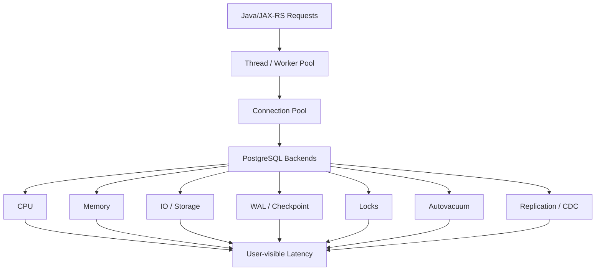
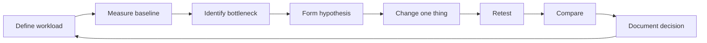
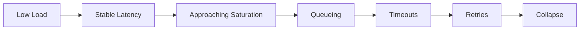

# Part 039 — PostgreSQL Performance and Capacity Planning

## 1. Why this part matters

PostgreSQL performance is not a single topic.

It is the interaction between:

- SQL shape.
- Index design.
- transaction duration.
- lock behaviour.
- connection pool pressure.
- buffer/cache behaviour.
- CPU saturation.
- memory allocation.
- disk and WAL throughput.
- autovacuum pressure.
- replication and CDC lag.
- Kubernetes replica count.
- cloud/on-prem infrastructure limits.
- deployment behaviour.
- user traffic shape.

A senior backend engineer should not reduce performance work to:

> add index

That can work for one slow query, but it does not solve capacity.

Capacity planning answers a wider question:

> How much workload can this PostgreSQL-backed system handle before correctness, latency, availability, or operability degrades?

In a Java/JAX-RS service, PostgreSQL capacity is often the hidden ceiling of the whole platform.

If PostgreSQL saturates, symptoms appear elsewhere first:

- API latency increases.
- HikariCP waits increase.
- worker threads block.
- MyBatis calls time out.
- Kafka outbox publisher falls behind.
- CDC replication slot retains WAL.
- Kubernetes pods restart under cascading timeout pressure.
- retry logic amplifies load.
- read replicas lag.
- dashboards become noisy but not explanatory.

This part builds the performance/capacity mental model required to prevent those failures.

---

## 2. Performance vs capacity

Performance and capacity are related but not identical.

| Concept | Question | Example |
|---|---|---|
| Performance | How fast is one operation? | Quote search p95 is 120 ms |
| Throughput | How many operations per second? | 300 order updates/sec |
| Capacity | How much workload before degradation? | 800 TPS before pool waits spike |
| Scalability | What happens as load increases? | Latency rises linearly or collapses |
| Efficiency | How much resource per unit of work? | CPU/query, rows scanned/result row |
| Headroom | How much safe unused capacity remains? | CPU 55%, IO 40%, pool wait near zero |

A system can have acceptable performance at normal load but poor capacity under peak load.

A query can be fast in staging but catastrophic in production because production has:

- more rows.
- skewed tenant distribution.
- different statistics.
- concurrent writes.
- hotter indexes.
- longer transactions.
- CDC overhead.
- real connection pool contention.
- real cloud storage latency.

The core rule:

> Performance work optimizes the operation. Capacity planning protects the system.

---

## 3. Capacity planning mental model

Think in terms of bottleneck layers.



At low load, most systems look healthy.

At increasing load, one layer saturates first. After that, downstream effects appear:

- CPU saturation causes query execution latency.
- IO saturation causes read/write stalls.
- connection saturation causes pool waits.
- lock saturation causes blocking and deadlocks.
- WAL saturation causes commit latency and replication lag.
- checkpoint pressure causes bursty IO.
- autovacuum lag causes bloat and future query degradation.
- memory pressure causes temp files, OOM, or cache churn.

A good capacity model identifies the first limiting layer and the next limiting layer.

---

## 4. The senior-engineer performance loop

Do not tune randomly.

Use a loop.



For PostgreSQL-backed Java services, the loop should include:

1. Business operation.
2. API endpoint.
3. MyBatis mapper/query id.
4. normalized SQL.
5. execution plan.
6. row counts.
7. connection pool metrics.
8. transaction duration.
9. lock waits.
10. CPU/memory/IO metrics.
11. WAL/replication metrics.
12. Kubernetes replica count.
13. cloud/on-prem storage characteristics.

The database should never be tuned in isolation from application behaviour.

---

## 5. CPU bottleneck

CPU is usually consumed by:

- query execution.
- join processing.
- sorting.
- hashing.
- aggregation.
- expression evaluation.
- JSONB processing.
- full-text search ranking.
- PL/pgSQL logic.
- compression/decompression.
- encryption overhead.
- connection/session overhead.

Symptoms:

- high database CPU.
- many active sessions running CPU-heavy queries.
- low IO wait but high latency.
- `pg_stat_statements` shows high total CPU-correlated time.
- queries scan too many rows.
- sort/hash/aggregate operations dominate plans.
- Java pool waits increase because queries execute slower.

Common causes:

| Cause | Example |
|---|---|
| Bad query shape | joining large tables before filtering |
| Missing index | sequential scan on selective predicate |
| Poor cardinality estimate | wrong join strategy |
| CPU-heavy expression | function on every row |
| JSONB overuse | extracting nested fields from many rows |
| FTS ranking cost | ranking huge candidate set |
| Too many active queries | pool size too large for CPU capacity |

Diagnosis queries:

```sql
select
  queryid,
  calls,
  total_exec_time,
  mean_exec_time,
  rows,
  query
from pg_stat_statements
order by total_exec_time desc
limit 20;
```

```sql
select
  pid,
  state,
  wait_event_type,
  wait_event,
  now() - query_start as query_age,
  query
from pg_stat_activity
where state = 'active'
order by query_age desc;
```

Senior review question:

> Is CPU high because PostgreSQL is doing useful work, or because the application is asking it to do wasteful work?

---

## 6. Memory bottleneck

PostgreSQL memory is not just `shared_buffers`.

Important memory areas:

| Area | Meaning |
|---|---|
| `shared_buffers` | PostgreSQL shared buffer cache |
| OS page cache | filesystem cache used heavily by PostgreSQL |
| `work_mem` | memory per sort/hash operation, not per server |
| `maintenance_work_mem` | memory for vacuum, index creation, maintenance |
| `autovacuum_work_mem` | memory per autovacuum worker when configured |
| backend/session memory | per-connection process memory |
| temp files | disk spill when memory is insufficient |

The trap:

> `work_mem` is multiplied by active operations, not just active connections.

A single query can use multiple sort/hash nodes. Many concurrent queries can multiply memory quickly.

Example risk model:

```text
active_connections = 80
average_sort_hash_nodes_per_query = 2
work_mem = 64MB
potential_work_mem_pressure = 80 * 2 * 64MB = 10GB
```

This is not exact accounting, but it exposes the danger.

Symptoms of memory pressure:

- temp files increase.
- sort/hash operations spill to disk.
- OS cache churn.
- high latency under concurrent analytical queries.
- OOM risk in self-managed/Kubernetes deployment.
- database pod/node memory pressure.
- Java service sees timeout instead of clear DB error.

Useful checks:

```sql
select
  datname,
  temp_files,
  pg_size_pretty(temp_bytes) as temp_bytes
from pg_stat_database
order by temp_bytes desc;
```

```sql
select
  queryid,
  calls,
  temp_blks_read,
  temp_blks_written,
  mean_exec_time,
  query
from pg_stat_statements
where temp_blks_written > 0
order by temp_blks_written desc
limit 20;
```

Senior review question:

> Is this query memory-bound because it sorts too much, hashes too much, or returns too much?

---

## 7. IO bottleneck

PostgreSQL depends heavily on storage behaviour.

IO pressure can come from:

- table scans.
- index scans with random reads.
- sort/hash temp files.
- WAL writes.
- checkpoints.
- autovacuum reads/writes.
- index creation.
- backups/snapshots.
- read replica catch-up.
- large backfill jobs.

Symptoms:

- high read/write latency.
- increasing query latency with moderate CPU.
- high `shared_blks_read` relative to `shared_blks_hit`.
- temp file growth.
- checkpoint spikes.
- cloud storage IOPS/throughput saturation.
- Kubernetes persistent volume latency.

Useful `pg_stat_statements` lens:

```sql
select
  queryid,
  calls,
  shared_blks_hit,
  shared_blks_read,
  shared_blks_dirtied,
  shared_blks_written,
  temp_blks_written,
  mean_exec_time,
  query
from pg_stat_statements
order by shared_blks_read desc
limit 20;
```

What to inspect:

| Signal | Meaning |
|---|---|
| high shared reads | poor cache hit or large scans |
| high dirtied blocks | write-heavy workload |
| high written blocks | checkpoint/background write pressure |
| high temp blocks | sort/hash spill |
| high WAL | insert/update/delete/CDC pressure |

Senior review question:

> Is IO caused by necessary data access, missing indexes, bad cache locality, or background maintenance?

---

## 8. Connection bottleneck

Connections are not free.

Each PostgreSQL connection maps to server-side backend resources. Too many connections can degrade performance even before CPU/IO is fully saturated.

In Kubernetes, connection count multiplies quickly:

```text
service_replicas * max_pool_size = potential_database_connections
```

Example:

```text
12 pods * 30 pool size = 360 potential connections
```

If four services do this, database capacity may be consumed by mostly idle connections.

Symptoms:

- HikariCP pending threads.
- `SQLTransientConnectionException` or connection acquisition timeout.
- PostgreSQL `too many connections`.
- many idle sessions.
- high backend memory usage.
- CPU context switching overhead.
- noisy failover/restart behaviour.

Useful check:

```sql
select
  datname,
  usename,
  application_name,
  state,
  count(*)
from pg_stat_activity
group by datname, usename, application_name, state
order by count(*) desc;
```

Capacity principle:

> Pool size should represent useful concurrency, not hope.

A pool larger than database capacity amplifies contention.

---

## 9. Lock bottleneck

Lock pressure is a capacity limit.

A system with low CPU and low IO can still be unavailable if sessions block each other.

Common causes:

- long transaction holding row locks.
- batch update touching hot rows.
- migration waiting for table lock.
- unindexed foreign key checks.
- `SELECT FOR UPDATE` over broad range.
- queue consumer without `SKIP LOCKED` discipline.
- hot account/order/quote row updated by many requests.
- uniqueness race under concurrent insert.

Symptoms:

- active sessions waiting on locks.
- API calls hang then time out.
- connection pool fills with blocked transactions.
- deadlocks appear after retry storm.
- migrations appear stuck.

Blocking query:

```sql
select
  blocked.pid as blocked_pid,
  blocked.query as blocked_query,
  blocking.pid as blocking_pid,
  blocking.query as blocking_query,
  now() - blocked.query_start as blocked_age
from pg_stat_activity blocked
join pg_locks blocked_locks
  on blocked_locks.pid = blocked.pid
join pg_locks blocking_locks
  on blocking_locks.locktype = blocked_locks.locktype
 and blocking_locks.database is not distinct from blocked_locks.database
 and blocking_locks.relation is not distinct from blocked_locks.relation
 and blocking_locks.page is not distinct from blocked_locks.page
 and blocking_locks.tuple is not distinct from blocked_locks.tuple
 and blocking_locks.virtualxid is not distinct from blocked_locks.virtualxid
 and blocking_locks.transactionid is not distinct from blocked_locks.transactionid
 and blocking_locks.classid is not distinct from blocked_locks.classid
 and blocking_locks.objid is not distinct from blocked_locks.objid
 and blocking_locks.objsubid is not distinct from blocked_locks.objsubid
 and blocking_locks.pid <> blocked_locks.pid
join pg_stat_activity blocking
  on blocking.pid = blocking_locks.pid
where not blocked_locks.granted
  and blocking_locks.granted;
```

Senior review question:

> Is throughput limited by database resource capacity or by serialized access to a hot logical entity?

---

## 10. WAL bottleneck

Write-ahead logging is central to PostgreSQL durability, replication, PITR, and CDC.

WAL pressure comes from:

- high insert/update/delete throughput.
- large backfills.
- index creation.
- table rewrites.
- vacuum effects.
- high-churn tables.
- outbox/event tables.
- logical decoding.
- replication lag.
- frequent checkpoints.

Symptoms:

- commit latency increases.
- WAL directory grows.
- replication lag increases.
- CDC falls behind.
- replication slot retains WAL.
- disk pressure occurs even when table size is stable.
- cloud storage write throughput saturates.

Useful checks:

```sql
select
  slot_name,
  slot_type,
  active,
  restart_lsn,
  confirmed_flush_lsn,
  pg_size_pretty(pg_wal_lsn_diff(pg_current_wal_lsn(), restart_lsn)) as retained_wal
from pg_replication_slots;
```

```sql
select
  application_name,
  state,
  sync_state,
  sent_lsn,
  write_lsn,
  flush_lsn,
  replay_lsn,
  pg_size_pretty(pg_wal_lsn_diff(pg_current_wal_lsn(), replay_lsn)) as replay_lag_bytes
from pg_stat_replication;
```

Senior review question:

> Does this write-heavy change create WAL volume that backup, replica, CDC, and storage systems can actually absorb?

---

## 11. Checkpoint pressure

A checkpoint flushes dirty data pages so recovery can start from a bounded point.

Checkpoints are necessary, but badly tuned or overloaded checkpoints can create bursty IO.

Symptoms:

- periodic latency spikes.
- high write IO around checkpoints.
- WAL grows quickly.
- cloud disk burst credits deplete.
- write-heavy endpoints become unstable.

What increases checkpoint pressure:

- heavy write workload.
- large backfill.
- bulk load.
- insufficient checkpoint spacing.
- slow storage.
- too many dirty pages.

Useful stats vary by PostgreSQL version, but inspect checkpoint-related statistics and logs where available.

Operational principle:

> Checkpoint tuning is platform-sensitive. Do not copy values blindly across RDS, Aurora, Azure, Kubernetes, and on-prem.

---

## 12. Cache pressure

PostgreSQL uses both `shared_buffers` and the operating system page cache.

Cache pressure appears when the working set does not fit well in available memory, or when query patterns constantly evict useful pages.

Symptoms:

- high physical reads.
- lower cache hit ratio.
- latency worsens after deployment or data growth.
- analytical queries disturb OLTP workload.
- partition pruning failure causes large scans.

Useful table-level check:

```sql
select
  relname,
  heap_blks_read,
  heap_blks_hit,
  case
    when heap_blks_hit + heap_blks_read = 0 then null
    else round(100.0 * heap_blks_hit / (heap_blks_hit + heap_blks_read), 2)
  end as heap_hit_pct
from pg_statio_user_tables
order by heap_blks_read desc
limit 20;
```

Do not worship a global cache hit ratio.

A high global ratio can hide one bad endpoint.
A lower ratio can be acceptable for analytical workloads.

Always correlate cache metrics with workload class.

---

## 13. Work memory sizing

`work_mem` affects sort, hash join, hash aggregate, and related operations.

Too low:

- temp files increase.
- sorts spill to disk.
- hash operations batch/spill.
- query latency increases.

Too high:

- many concurrent operations can exhaust memory.
- database host/pod can experience memory pressure.
- OS cache can shrink.

Safer discipline:

- use conservative global `work_mem`.
- tune individual heavy sessions/jobs when needed.
- isolate reporting/ETL workloads.
- monitor temp file usage.
- avoid increasing global value to fix one bad report.

Example controlled setting for a batch job:

```sql
begin;
set local work_mem = '256MB';
-- run controlled batch/reporting query
commit;
```

Use `SET LOCAL` only inside a transaction and only for known workload.

---

## 14. Shared buffers and effective cache size

`shared_buffers` controls PostgreSQL's shared buffer cache.

`effective_cache_size` is not an allocation. It is a planner estimate of memory available for disk caching by PostgreSQL and the OS.

Mental model:

| Parameter | What it does |
|---|---|
| `shared_buffers` | actual PostgreSQL buffer cache allocation |
| `effective_cache_size` | planner assumption about available cache |
| OS cache | filesystem-level cache outside PostgreSQL |

Mistakes:

- setting `shared_buffers` too low for a dedicated server.
- setting it too high and starving OS cache.
- treating `effective_cache_size` as memory allocation.
- copying values from blog posts without workload testing.
- ignoring managed database defaults/limits.

Internal verification matters because cloud-managed PostgreSQL may expose only a subset of parameters or apply them differently through parameter groups.

---

## 15. Maintenance work memory

`maintenance_work_mem` affects operations such as:

- `VACUUM`.
- `CREATE INDEX`.
- `ALTER TABLE ADD FOREIGN KEY` validation patterns.
- maintenance tasks.

Increasing it can speed maintenance operations, but it can also increase memory pressure if multiple maintenance tasks run concurrently.

For production:

- avoid large maintenance work during peak traffic.
- coordinate with autovacuum.
- use `CREATE INDEX CONCURRENTLY` when appropriate.
- monitor IO and WAL impact.
- test on production-like data.

---

## 16. Max connections

`max_connections` is not a throughput target.

It is a hard upper bound on PostgreSQL backend sessions.

Increasing it can allow more clients to connect, but it can also:

- increase memory overhead.
- increase CPU scheduling overhead.
- make overload worse.
- hide bad pool sizing.
- delay failure until the database is less recoverable.

For Java/JAX-RS systems, capacity planning should start from:

```text
sum(service_replica_count * service_max_pool_size)
```

Then reserve capacity for:

- admin sessions.
- migration jobs.
- monitoring.
- backup/maintenance.
- read-only/reporting clients.
- CDC connectors.
- emergency access.

If this total exceeds safe database concurrency, use smaller pools, PgBouncer where appropriate, workload isolation, or service-level throttling.

---

## 17. Throughput vs latency

Throughput and latency move together only until saturation.

Typical shape:



Once the bottleneck saturates, queues grow.

For Java services, queues can form in:

- HTTP worker pool.
- async executor.
- HikariCP acquisition queue.
- PostgreSQL lock waits.
- PostgreSQL active backend queueing on CPU/IO.
- Kafka publisher queue.
- CDC pipeline.

Retries can convert high latency into overload.

Capacity planning must include:

- retry budget.
- timeout hierarchy.
- circuit breaker behaviour.
- idempotency design.
- cancellation behaviour.
- connection acquisition timeout.
- statement timeout.
- transaction timeout.

---

## 18. Load testing PostgreSQL-backed services

A load test that does not represent database reality is misleading.

Bad load test:

- uses tiny dataset.
- no tenant skew.
- no concurrent writes.
- no background jobs.
- no CDC/outbox.
- no migration/backfill load.
- no realistic pagination depth.
- no slow external dependencies.
- no read replica lag.
- no failure injection.

Better load test:

- production-like data volume.
- production-like indexes and statistics.
- realistic request mix.
- tenant/account skew.
- concurrent read/write ratio.
- realistic transaction duration.
- background polling/outbox jobs.
- reporting workload if it shares DB.
- realistic pool size and replica count.
- slow query logging enabled.
- `pg_stat_statements` captured before/after.
- infrastructure metrics captured.

Minimum result set:

| Metric | Why needed |
|---|---|
| API p50/p95/p99 | user-visible latency |
| DB query p95/p99 | persistence pressure |
| pool wait time | connection pressure |
| active DB sessions | database concurrency |
| CPU/memory/IO | infrastructure bottleneck |
| locks/deadlocks | concurrency bottleneck |
| temp files | memory/sort pressure |
| WAL generation | write/replication pressure |
| replication lag | freshness/CDC risk |
| error rate | failure threshold |

---

## 19. Benchmarking discipline

Benchmarking answers narrow questions.

Examples:

- Is keyset pagination faster than offset pagination for this access pattern?
- Does this index reduce total execution time under concurrent writes?
- Does JSONB expression index help this filter?
- Does a materialized view reduce reporting impact?
- Does increasing pool size improve throughput or only increase contention?
- Does a backfill chunk size create unacceptable WAL/lock pressure?

Rules:

1. benchmark on production-like data.
2. isolate one variable.
3. capture execution plans.
4. capture database and application metrics.
5. test concurrency, not only single-query latency.
6. test write impact of new indexes.
7. retest after `ANALYZE`.
8. document results in the PR/ADR.

Avoid microbenchmarking a query in isolation and calling it production-safe.

---

## 20. Capacity projection

Capacity projection estimates when the system will hit limits.

Track growth dimensions:

| Dimension | Example |
|---|---|
| row count | orders/month, quote_items/order |
| data size | table/index growth |
| write volume | updates/sec, outbox events/sec |
| query volume | searches/sec, report runs/day |
| tenant skew | largest tenant vs median tenant |
| retention | history kept for years |
| WAL volume | GB/day |
| connections | service replicas * pool size |
| replication lag | lag under peak write |
| vacuum debt | dead tuple growth |

Projection should be workload-specific.

Example:

```text
quote_item grows 40M rows/year
largest tenant owns 22% of rows
search endpoint filters by tenant_id + status + updated_at
current p95 = 180ms at 80M rows
projected row count in 9 months = 110M
risk = index bloat + pagination degradation + backup window increase
```

Capacity plans should name the risk and the trigger point.

---

## 21. Scale up

Scale up means using a larger database instance/server.

It helps when bottleneck is:

- CPU.
- memory/cache.
- storage throughput.
- IOPS.
- network bandwidth.

It does not fix:

- bad query shape.
- unbounded pagination.
- N+1 queries.
- hot row contention.
- missing transaction timeouts.
- bad pool sizing.
- unsafe migration.
- application retry storm.
- cross-service shared database coupling.

Scale up is often the fastest mitigation, but not always the best long-term fix.

Senior judgement:

> Scale up to buy time; do not confuse it with root-cause correction.

---

## 22. Read replicas

Read replicas help read scalability only for workloads that tolerate replica lag.

Good use cases:

- read-only reporting.
- dashboards.
- non-critical search.
- customer support lookup where slight lag is acceptable.
- offloading analytical reads.
- backup/maintenance support.

Bad use cases:

- read-after-write consistency requirement.
- payment/order confirmation flow requiring fresh state.
- API update followed immediately by read from replica.
- queue consumer requiring latest lock state.
- uniqueness/business invariant check.

Application concerns:

- routing reads intentionally.
- consistency documentation.
- fallback behaviour on replica lag.
- transaction read-only mode.
- endpoint-specific freshness contract.

Example API contract distinction:

| Endpoint | Replica allowed? | Reason |
|---|---:|---|
| `POST /orders` | No | command/source of truth |
| `GET /orders/{id}` immediately after write | Usually no | read-after-write |
| `GET /reports/monthly` | Yes | stale tolerance possible |
| `GET /catalog/search` | Maybe | depends on freshness requirement |

---

## 23. Sharding consideration

Sharding is not a default performance tactic.

It is an architectural boundary with long-term cost.

Consider sharding only when:

- one PostgreSQL cluster cannot handle write volume.
- data size exceeds operational limits.
- tenant isolation requires physical separation.
- regulatory or residency requirements force partitioning by region/customer.
- operational blast radius must be reduced.

Costs:

- cross-shard queries are hard.
- global uniqueness is harder.
- transactions across shards are risky.
- reporting becomes more complex.
- migrations must run per shard.
- rebalancing is operationally difficult.
- debugging needs shard-aware telemetry.
- customer support tooling must be shard-aware.

Before sharding, evaluate:

- query tuning.
- index design.
- partitioning.
- archiving/retention.
- read replicas.
- workload isolation.
- materialized/read models.
- vertical scaling.
- service/data boundary redesign.

Senior principle:

> Sharding is a business and operations decision, not merely a database performance trick.

---

## 24. Capacity planning for Kubernetes deployments

Kubernetes changes database capacity math.

Risks:

- autoscaling increases DB connections suddenly.
- rolling deployment doubles connection pressure temporarily.
- restarted pods create connection storm.
- liveness probe failure causes restart loops.
- readiness becomes true before pool/database is healthy.
- batch jobs run alongside API traffic.
- resource limits cause throttling or OOM.

Checklist:

- total max pool across replicas.
- HPA max replica count.
- rollout surge settings.
- connection warm-up behaviour.
- shutdown graceful transaction handling.
- statement timeout and connection acquisition timeout.
- pod disruption budget.
- job concurrency limits.
- DB maintenance windows.

Formula:

```text
max_possible_connections =
  sum(service_max_replicas * pool_max_size)
  + batch_jobs
  + migration_jobs
  + monitoring
  + admin_reserved
```

This number must be compared with PostgreSQL `max_connections` and practical CPU/memory capacity.

---

## 25. Capacity planning for cloud-managed PostgreSQL

For AWS/Azure managed PostgreSQL, capacity is shaped by:

- instance/server class.
- CPU credits or burst model if applicable.
- storage IOPS/throughput.
- storage autoscaling.
- backup/PITR behaviour.
- read replica limits.
- maintenance window.
- parameter group/server parameter limits.
- extension availability.
- monitoring granularity.
- connection proxy availability.
- failover behaviour.

Cloud-managed does not remove capacity planning.

It changes the operational boundary:

| Concern | Managed DB helps? | Still your responsibility? |
|---|---:|---:|
| hardware replacement | yes | no/limited |
| backup automation | often | verify restore/RPO |
| failover mechanism | often | test app behaviour |
| query tuning | no | yes |
| pool sizing | no | yes |
| migration safety | no | yes |
| data modelling | no | yes |
| slow query diagnosis | partly | yes |
| cost control | no | yes |

---

## 26. Capacity planning for on-prem/self-managed PostgreSQL

Self-managed/on-prem capacity adds responsibility for:

- OS tuning.
- filesystem choice.
- disk layout.
- RAID/storage controller behaviour.
- WAL disk separation if used.
- kernel settings.
- backup storage throughput.
- monitoring stack.
- patching.
- HA tooling.
- failover automation.
- hardware lifecycle.
- air-gapped upgrade constraints.

Capacity planning must include operational staffing.

A design that is technically possible but not operable by the team is not production-ready.

---

## 27. Performance failure modes

| Failure mode | Typical symptom | Root cause lens |
|---|---|---|
| CPU saturation | all queries slower | query waste or too much concurrency |
| memory pressure | temp files/OOM | work_mem, sorts, concurrency |
| IO saturation | slow reads/writes | scans, WAL, checkpoints, storage limit |
| pool exhaustion | API waits/timeouts | DB slow, pool too small/large, leaks |
| lock bottleneck | blocked sessions | hot rows, long tx, migration locks |
| WAL growth | disk risk, CDC lag | write storm, slot lag, backfill |
| checkpoint spikes | periodic latency | dirty page flush pressure |
| cache churn | inconsistent latency | working set too large, analytics on OLTP |
| autovacuum lag | bloat, wraparound risk | long tx, high churn, bad settings |
| replica lag | stale reads | write volume, slow replica, slot pressure |
| retry storm | collapse | timeout/retry not bounded |

---

## 28. Performance debugging workflow

When production latency increases:

1. confirm user impact.
2. identify affected endpoint/job/tenant.
3. check application DB call latency.
4. check connection pool active/idle/pending.
5. check active PostgreSQL sessions.
6. check waits and locks.
7. inspect `pg_stat_statements` deltas.
8. inspect CPU/memory/IO/storage.
9. inspect WAL/replication/autovacuum.
10. compare with deploy/migration/backfill timeline.
11. identify immediate mitigation.
12. document root cause and preventive action.

Do not jump directly to index creation.

Emergency index creation may help, but it can also create lock, IO, WAL, and disk pressure.

---

## 29. Java/JAX-RS impact

PostgreSQL capacity issues leak into Java services as:

- slow HTTP responses.
- connection acquisition timeout.
- `SQLException` or framework-specific persistence exception.
- thread pool saturation.
- request cancellation while database query continues.
- retry storm.
- circuit breaker open.
- partial job progress.
- duplicate event publication attempt.
- misleading 500 errors.

Application safeguards:

- bounded request timeout.
- bounded DB statement timeout.
- bounded connection acquisition timeout.
- idempotency for retried commands.
- retry only for safe transient errors.
- bulkhead between API and batch workloads.
- pagination limits.
- streaming discipline.
- per-endpoint DB budget.
- telemetry linking endpoint → mapper → queryid.

---

## 30. MyBatis/JDBC impact

MyBatis makes SQL explicit. That is powerful, but it means capacity problems often sit directly in mapper XML or annotations.

Review:

- dynamic WHERE clauses that accidentally remove filters.
- dynamic ORDER BY that prevents index usage.
- large `IN` lists.
- nested result maps causing row explosion.
- batch executor memory behaviour.
- cursor/fetch size behaviour.
- generated SQL under optional filters.
- parameter-dependent plan changes.
- result mapping of wide rows.

JDBC-level review:

- fetch size for large reads.
- autocommit behaviour.
- statement timeout.
- read-only transaction flag.
- prepared statement usage.
- connection closing.
- generated key handling.

---

## 31. Microservices/event-driven impact

Capacity is not local to one service when events are involved.

A write-heavy service can affect:

- outbox table growth.
- Debezium lag.
- Kafka publishing lag.
- downstream consumer lag.
- read model freshness.
- replica lag.
- WAL retention.
- backup size.
- recovery time.

Event-driven capacity questions:

- Can the outbox publisher drain faster than events are produced?
- Can CDC keep up during backfill?
- Does the event schema increase payload size significantly?
- Are consumers idempotent under replay?
- Does retry amplify database writes?
- Is reconciliation available when CDC/publisher lags?

---

## 32. Production runbook: capacity incident

During a capacity incident, separate mitigation from root cause.

Possible mitigations:

- reduce traffic via feature flag/rate limit.
- pause non-critical batch jobs.
- pause/reporting queries.
- scale up managed DB instance.
- reduce application concurrency.
- lower pool size if DB is overloaded.
- kill clearly harmful runaway queries.
- add emergency index only after risk review.
- pause backfill/migration.
- fail over only if primary is unhealthy and failover criteria are met.

Root cause analysis should answer:

- what saturated first?
- what changed?
- why did alerts not catch it earlier?
- why did application retries/timeouts behave that way?
- what capacity threshold was crossed?
- what regression test/load test was missing?
- what dashboard/runbook gap existed?

---

## 33. PR review checklist

For any PR affecting PostgreSQL performance/capacity, ask:

### Query shape

- Does the query have bounded predicates?
- Does it depend on optional filters that may disappear?
- Does it sort large result sets?
- Does it paginate with large offsets?
- Does it aggregate over hot OLTP tables?
- Does it create N+1 behaviour?

### Indexing

- Is there a supporting index?
- Is the column order correct?
- Is the index too write-expensive?
- Is this a partial/expression index candidate?
- Is index bloat/maintenance considered?

### Transactions and locks

- Is the transaction short?
- Does it lock rows in deterministic order?
- Does it touch hot rows?
- Does it have timeout and retry discipline?

### Capacity

- What happens at 10x row count?
- What happens at peak concurrency?
- What happens during rolling deployment?
- What happens if CDC lags?
- What happens if read replica lags?
- What is the expected WAL volume?

### Operations

- Is there observability for this path?
- Is there a rollback/roll-forward plan?
- Is there a runbook for failure?
- Is there a load test or plan evidence?

---

## 34. Internal verification checklist

Verify in CSG/team context:

### Database version and platform

- PostgreSQL major/minor version.
- AWS/Azure/on-prem/Kubernetes deployment mode.
- managed database parameter limitations.
- storage class/IOPS/throughput limits.
- HA/read replica topology.

### Resource and configuration

- `max_connections`.
- `shared_buffers`.
- `work_mem`.
- `maintenance_work_mem`.
- checkpoint/WAL settings accessible to team.
- autovacuum settings.
- statement timeout.
- lock timeout.
- idle-in-transaction timeout.

### Application capacity

- service replica counts.
- max HikariCP pool size per service.
- HPA max replicas.
- batch job concurrency.
- migration job behaviour.
- PgBouncer/RDS Proxy usage if any.

### Observability

- pg_stat_statements enabled.
- slow query logs available.
- connection pool dashboards.
- lock/wait dashboards.
- WAL/replication dashboards.
- storage/disk dashboards.
- incident notes linked to database metrics.

### Workload

- top endpoints by DB time.
- top queries by total execution time.
- largest tables and indexes.
- highest-churn tables.
- outbox/event table growth.
- biggest tenants/customers.
- reporting workload location.

### Process

- load testing practice.
- capacity review before major launch.
- migration/backfill review process.
- DBA/SRE escalation path.
- emergency change approval path.

---

## 35. Anti-patterns

Avoid these:

- increasing pool size whenever latency increases.
- increasing `max_connections` without memory/concurrency analysis.
- increasing global `work_mem` to fix one report.
- adding indexes without measuring write overhead.
- using read replicas for read-after-write flows without contract.
- running analytics on primary OLTP without guardrails.
- doing backfill without WAL/lock/replication impact estimate.
- ignoring tenant skew.
- treating staging performance as production evidence.
- ignoring autovacuum/bloat until query latency collapses.
- scaling up repeatedly without root cause.
- using retries without idempotency and backoff.

---

## 36. Mental model summary

PostgreSQL capacity is the minimum of several limits:

```text
capacity = min(
  CPU capacity,
  memory/cache capacity,
  IO capacity,
  WAL capacity,
  lock/concurrency capacity,
  connection capacity,
  autovacuum/maintenance capacity,
  replication/CDC capacity,
  operational capacity
)
```

The weakest layer determines real system capacity.

A senior engineer should be able to:

- identify the limiting layer.
- explain why it is limiting.
- propose safe mitigation.
- propose durable fix.
- quantify risk.
- prevent recurrence through review, tests, dashboards, and runbooks.

---

## 37. Key takeaways

- Performance is operation-level; capacity is system-level.
- PostgreSQL bottlenecks often appear first as Java API latency or pool exhaustion.
- Connections are not throughput; excessive concurrency can reduce capacity.
- `work_mem` can multiply dangerously under concurrency.
- WAL, checkpoint, replication, and CDC are part of write capacity.
- Read replicas help only when stale reads are acceptable.
- Load testing must include data volume, skew, concurrency, background jobs, and observability.
- Scale up can buy time but does not fix bad data access patterns.
- Capacity planning must be tied to business growth, tenant skew, and operational responsibility.

---

## 38. Reference anchors

Use these as verification anchors when cross-checking team-specific PostgreSQL behaviour:

- PostgreSQL official documentation — Resource Consumption.
- PostgreSQL official documentation — Runtime Statistics and cumulative statistics views.
- PostgreSQL official documentation — `pg_stat_statements`.
- PostgreSQL official documentation — WAL, replication, and checkpoint-related configuration.
- pgJDBC official documentation — connection, read-only, autocommit, and fetch behaviour.
