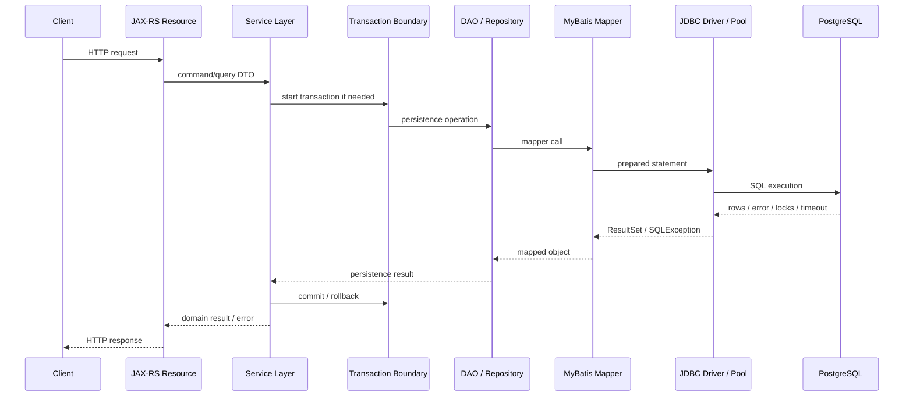
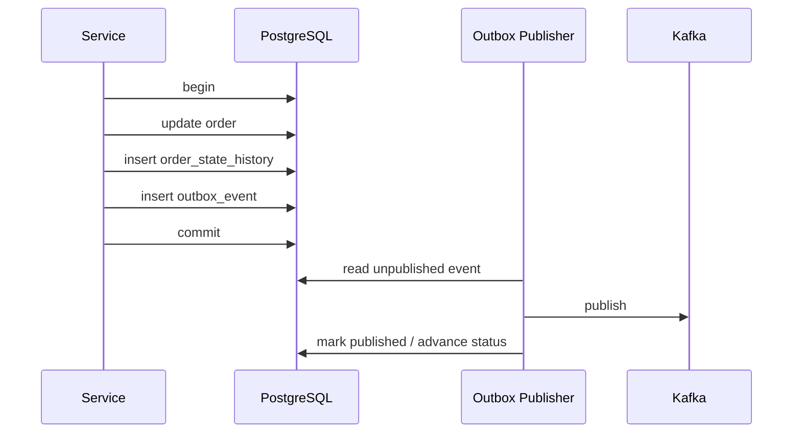

# Part 040 — PostgreSQL with Java/JAX-RS Service Architecture

## 1. Why this part matters

A PostgreSQL-backed Java/JAX-RS service is not just:

```text
HTTP endpoint → SQL query → response
```

The real lifecycle is closer to:



Every boundary matters.

A poor transaction boundary can create lock contention.
A poor mapper can create query plan instability.
A poor error mapping can hide data correctness failures.
A poor pagination contract can become a production incident.
A poor idempotency design can duplicate orders.
A poor streaming implementation can exhaust memory or hold transactions too long.

This part explains how to design the Java/JAX-RS side so PostgreSQL remains a reliable correctness boundary rather than an accidental bottleneck.

---

## 2. Architectural principle

The service layer owns transaction intent.

The database enforces data correctness.

The mapper translates between Java and SQL.

The JAX-RS resource exposes API contract.

Do not blur these responsibilities.

| Layer | Responsibility | Should avoid |
|---|---|---|
| JAX-RS resource | HTTP contract, request/response mapping | business transaction logic |
| Service layer | use case orchestration, transaction boundary | raw SQL details everywhere |
| DAO/Repository | persistence abstraction | business policy ownership |
| MyBatis mapper | explicit SQL and mapping | hidden side effects |
| JDBC/pool | connection and statement execution | domain decisions |
| PostgreSQL | constraints, transactions, locks, storage | unreviewed business workflow sprawl |

The goal is not to create many layers for ceremony.

The goal is to create stable boundaries where correctness, failure handling, and observability are understandable.

---

## 3. Transaction boundary at service layer

A transaction should wrap a business unit of work, not an arbitrary method call.

Good examples:

- create quote and quote items atomically.
- submit order and write state transition atomically.
- insert command result and outbox event atomically.
- update approval status with optimistic lock.

Bad examples:

- transaction starts at HTTP filter and covers serialization.
- transaction includes remote service call.
- transaction includes Kafka publish outside outbox discipline.
- transaction covers file upload/download.
- transaction covers slow report generation.
- transaction spans multiple user think-time steps.

Rule:

> Keep database transactions short, intentional, and observable.

Example shape:

```java
public OrderSubmissionResult submitOrder(SubmitOrderCommand command) {
    return transactionTemplate.execute(tx -> {
        Order order = orderRepository.findForUpdate(command.orderId());
        order.submit(command.submittedBy(), clock.instant());

        orderRepository.update(order);
        outboxRepository.insert(OrderSubmittedEvent.from(order));

        return OrderSubmissionResult.from(order);
    });
}
```

The important point is not the framework. The important point is that the business unit of work is explicit.

---

## 4. Request-scoped transaction risk

A request-scoped transaction is tempting:

```text
open transaction at request start
close transaction at response end
```

This is dangerous for write paths and large reads.

Risks:

- transaction stays open during validation, mapping, logging, remote calls, or response rendering.
- row locks are held longer than needed.
- snapshot remains open longer than needed.
- autovacuum cleanup can be delayed.
- connection is held while application does non-database work.
- streaming response may hold transaction for the whole stream.
- client slowness can become database pressure.

Safer approach:

- start transaction inside service method.
- do only database-critical work inside it.
- commit before expensive response transformation when possible.
- avoid remote calls inside transaction.
- avoid user/network-bound work inside transaction.

---

## 5. Long transaction in HTTP request

Long transactions are production hazards.

They can cause:

- locks held too long.
- MVCC snapshot retention.
- vacuum delay.
- bloat growth.
- connection pool exhaustion.
- high retry collision.
- timeout ambiguity.

Common Java/JAX-RS causes:

- endpoint loads too much data.
- service does multiple repository calls with remote calls between them.
- MyBatis mapper uses large result mapping in same transaction.
- export endpoint streams while transaction remains open.
- retry logic wraps too broad a block.
- transaction starts before authorization/external validation.

Guardrails:

- transaction timeout.
- statement timeout.
- connection acquisition timeout.
- explicit read-only transaction.
- separate command and query paths.
- streaming outside transaction when safe.
- pagination/result limits.

---

## 6. Read-only transaction

Read-only transactions communicate intent.

They can help prevent accidental writes and allow certain optimizations or routing decisions depending on stack.

Use for:

- lookup endpoints.
- search endpoints.
- reporting queries.
- validation reads.
- read model access.

Cautions:

- read-only does not make a bad query cheap.
- read-only does not guarantee replica freshness.
- read-only does not remove need for timeout.
- read-only transaction can still hold snapshot and delay cleanup if long-running.

Service pattern:

```java
public QuoteDetails getQuoteDetails(UUID quoteId) {
    return readOnlyTransaction.execute(tx -> {
        QuoteRecord quote = quoteRepository.findById(quoteId);
        List<QuoteItemRecord> items = quoteItemRepository.findByQuoteId(quoteId);
        return assembler.toDetails(quote, items);
    });
}
```

For large reads, consider whether transaction is needed at all, and whether consistency across multiple reads is required.

---

## 7. Command/query separation

Do not treat all endpoints the same.

Commands change state.
Queries read state.

| Aspect | Command | Query |
|---|---|---|
| transaction | usually required | sometimes required |
| consistency | strong | depends on contract |
| idempotency | important | usually naturally safe |
| locking | possible | usually avoid row locks |
| timeout | strict | strict, but maybe different |
| replica | usually no | maybe |
| response | result of state change | representation/read model |

Examples:

- `POST /orders/{id}/submit` is a command.
- `GET /orders/{id}` is a query.
- `GET /orders?status=PENDING` is a query/search.
- `POST /quotes/{id}/price` may be command if it persists price snapshot.

This distinction drives transaction strategy, retry strategy, idempotency, and database access pattern.

---

## 8. Repository/DAO pattern

A repository/DAO should express persistence intent without hiding SQL behaviour completely.

Good method names:

```java
QuoteRecord findById(UUID quoteId);
QuoteRecord findByIdForUpdate(UUID quoteId);
List<QuoteItemRecord> findItemsByQuoteId(UUID quoteId);
int updateStatus(UUID quoteId, QuoteStatus expectedStatus, QuoteStatus newStatus);
boolean existsActiveOrderForQuote(UUID quoteId);
void insertOutboxEvent(OutboxEventRecord event);
```

Bad method names:

```java
Object get(Object input);
List<Map<String, Object>> queryStuff(Map<String, Object> params);
void saveEverything(Object aggregate);
List<Order> find(String dynamicSql);
```

The DAO boundary should expose:

- whether a method locks.
- whether a method expects one row or many rows.
- whether a method participates in optimistic concurrency.
- whether a method is safe for read replica.
- whether a method writes outbox/event rows.
- whether a method can return large result sets.

---

## 9. MyBatis mapper boundary

MyBatis keeps SQL close to the application.

That is a strength if the team treats mapper SQL as production code.

Mapper design rules:

- one mapper method should have clear access pattern.
- dynamic SQL must be bounded and reviewable.
- never expose raw SQL fragments from request payload.
- use `#{}` binding for values.
- allow `${}` only for carefully whitelisted identifiers when unavoidable.
- name locking queries explicitly.
- name pagination queries explicitly.
- avoid mapper methods that return unbounded lists.
- test generated SQL for key dynamic combinations.
- link mapper methods to observability/query comments if team supports it.

Example:

```xml
<select id="findPendingOrdersForWorker" resultMap="OrderRecordMap">
  select
    id,
    status,
    version,
    updated_at
  from order_header
  where status = 'PENDING'
  order by updated_at, id
  limit #{limit}
  for update skip locked
</select>
```

The method name should reveal that this query locks rows and is meant for worker consumption.

---

## 10. Domain model vs persistence model

Do not force database records to be domain objects.

A persistence model reflects storage.
A domain model reflects business behaviour.
An API DTO reflects contract.

| Model | Optimized for |
|---|---|
| Persistence record | schema mapping, SQL result shape |
| Domain object | business invariants and behaviour |
| API DTO | external contract and compatibility |
| Event DTO | event schema and consumer compatibility |
| Read model | query speed and projection shape |

Example:

```text
order_header + order_item + state_history
        ↓
Order aggregate/domain object
        ↓
OrderDetailsResponse DTO
```

Avoid leaking persistence columns directly into API response unless intentionally contracted.

---

## 11. DTO vs entity

In MyBatis-based systems, there may not be JPA entities, but the same distinction applies.

Do not use one class for everything:

```text
Database row = Domain aggregate = API response = Kafka event
```

That creates coupling.

Problems:

- schema change becomes API change.
- API backward compatibility becomes database constraint.
- event consumers depend on internal persistence shape.
- sensitive fields leak.
- audit/internal columns leak.
- JSON serialization accidentally triggers large object graph traversal.

Use explicit mapping at boundaries.

---

## 12. Error mapping to HTTP response

PostgreSQL errors are not all 500.

Map them intentionally.

| Database condition | Example | Possible HTTP mapping |
|---|---|---|
| unique violation | duplicate idempotency key | 409 Conflict or replay previous result |
| foreign key violation | invalid reference | 400/409 depending API contract |
| check constraint violation | invalid state/value | 400/409 depending source |
| serialization failure | concurrent transaction anomaly | retry then 409/503 if exhausted |
| deadlock detected | concurrency conflict | retry then 409/503 if exhausted |
| lock timeout | resource busy | 409/423/503 depending contract |
| statement timeout | operation too expensive | 504/503 or domain-specific error |
| connection acquisition timeout | DB overloaded | 503 |
| too many connections | DB overloaded | 503 |

Do not expose raw SQL errors to clients.

Do preserve enough internal detail for logs/traces:

- SQLState.
- constraint name.
- mapper id.
- endpoint.
- correlation id.
- transaction id/request id.
- sanitized SQL/query id.

---

## 13. SQLState and domain errors

A strong persistence layer translates technical failures into domain-aware outcomes.

Example:

```java
try {
    quoteRepository.insertDraftQuote(record);
} catch (DuplicateKeyException e) {
    if (isConstraint(e, "uq_quote_external_reference")) {
        throw new DuplicateExternalReferenceException(command.externalReference(), e);
    }
    throw e;
}
```

But avoid overfitting to fragile error text.

Prefer:

- SQLState.
- constraint name.
- typed framework exception.
- explicit domain validation before write when useful.
- database constraint as final enforcement.

Constraint names become part of operability.

Name them intentionally.

---

## 14. Idempotency key storage

Command endpoints often need idempotency.

Example:

- create order.
- submit quote.
- accept approval.
- initiate payment-like workflow.
- publish customer-impacting operation.

PostgreSQL pattern:

```sql
create table api_idempotency_key (
  idempotency_key text not null,
  operation_type text not null,
  request_hash text not null,
  response_payload jsonb,
  status text not null,
  created_at timestamptz not null default now(),
  completed_at timestamptz,
  primary key (operation_type, idempotency_key)
);
```

Core invariant:

> The same idempotency key for the same operation must not create two business effects.

Implementation concerns:

- unique constraint is the concurrency guard.
- request hash prevents key reuse with different payload.
- transaction must include business write and idempotency record update.
- incomplete records need recovery policy.
- response replay must be safe.
- retention must be defined.

---

## 15. Optimistic locking for API update

Optimistic locking protects against lost update.

Common pattern:

```sql
update quote
set
  status = #{newStatus},
  version = version + 1,
  updated_at = now()
where id = #{quoteId}
  and version = #{expectedVersion};
```

Then Java checks affected row count:

```java
int updated = quoteMapper.updateStatus(command);
if (updated == 0) {
    throw new ConcurrentModificationException(command.quoteId());
}
```

HTTP contract can use:

- explicit `version` field in payload.
- `If-Match` / ETag style contract.
- domain-specific conflict response.

Do not silently overwrite.

Optimistic locking is especially useful for:

- quote draft edits.
- approval state transitions.
- user-managed configuration.
- catalog administration.

---

## 16. Pessimistic locking for state transitions

Some operations need row locks.

Example:

```sql
select
  id,
  status,
  version
from order_header
where id = #{orderId}
for update;
```

Use when:

- operation must serialize around a row.
- multiple dependent rows must be checked and updated.
- transition must see latest committed state.
- worker needs exclusive claim.

Cautions:

- keep transaction short.
- lock in deterministic order.
- avoid locking broad ranges.
- set lock timeout.
- avoid remote calls while holding lock.
- observe lock waits.

Pessimistic locking is not a substitute for good state modelling.

---

## 17. Pagination API backed by PostgreSQL

Pagination is an API contract, not just SQL syntax.

Offset pagination:

```sql
select *
from order_header
where tenant_id = #{tenantId}
order by created_at desc, id desc
limit #{limit}
offset #{offset};
```

Problems:

- large offset gets slower.
- unstable results under concurrent insert/update.
- can scan many skipped rows.

Keyset pagination:

```sql
select *
from order_header
where tenant_id = #{tenantId}
  and (created_at, id) < (#{lastCreatedAt}, #{lastId})
order by created_at desc, id desc
limit #{limit};
```

Requirements:

- deterministic ordering.
- supporting composite index.
- cursor token design.
- clear API semantics.

Recommended for large operational lists.

---

## 18. Streaming large result

Large exports/searches must not load everything into memory.

Risks:

- Java heap pressure.
- connection held too long.
- transaction held too long.
- client slowness holds database resources.
- timeout ambiguity.
- partial response failure.

Options:

- cursor/fetch size where appropriate.
- chunked processing outside user-facing request.
- async export job with result file.
- read replica for reporting/export.
- materialized view/read model.
- bounded page iteration.

Do not use streaming to bypass pagination discipline.

Streaming must have:

- max row limit or job boundary.
- timeout.
- cancellation handling.
- resource closing.
- observability.

---

## 19. File/blob metadata pattern

PostgreSQL is usually not the right place for large binary payloads in enterprise services unless there is a strong reason.

Common pattern:

- store file in object storage/document service.
- store metadata in PostgreSQL.
- store checksum, size, content type, owner, state, retention, audit fields.
- make metadata transactionally consistent with business operation using state machine/outbox/reconciliation.

Example metadata table:

```sql
create table document_metadata (
  id uuid primary key,
  tenant_id uuid not null,
  storage_key text not null,
  checksum_sha256 text not null,
  content_type text not null,
  size_bytes bigint not null check (size_bytes >= 0),
  status text not null,
  created_at timestamptz not null default now()
);
```

Failure concerns:

- DB commit succeeds but object upload fails.
- object upload succeeds but DB commit fails.
- object deleted but metadata remains.
- metadata deleted but object remains.

Use reconciliation and explicit lifecycle states.

---

## 20. Database-driven state machine

Enterprise order/quote systems often rely on state machines.

PostgreSQL can enforce parts of the state model:

- current state column.
- state transition history table.
- check constraints for valid values.
- unique constraints for active transition.
- optimistic lock version.
- transition timestamp.
- actor/audit metadata.

Example transition update:

```sql
update order_header
set
  status = #{newStatus},
  version = version + 1,
  updated_at = now()
where id = #{orderId}
  and status = #{expectedStatus}
  and version = #{expectedVersion};
```

Then insert history in the same transaction:

```sql
insert into order_state_history (
  order_id,
  from_status,
  to_status,
  changed_by,
  changed_at
) values (
  #{orderId},
  #{fromStatus},
  #{toStatus},
  #{changedBy},
  now()
);
```

Do not rely only on application memory to enforce critical transitions.

Database constraints and affected-row checks are the final guardrail.

---

## 21. Outbox inside service transaction

For event-driven consistency, write the outbox event in the same transaction as the business change.



This prevents:

- DB updated but event not recorded.
- event published before DB commit.
- event published for rolled-back transaction.

Still handle:

- duplicate publish.
- out-of-order events.
- delayed publish.
- poison events.
- schema evolution.
- reconciliation.

---

## 22. Database constraints as application guardrails

Application validation is not enough.

Database constraints protect against:

- bugs.
- race conditions.
- multiple writers.
- bad migration.
- unexpected integration path.
- manual repair mistakes.

Use constraints for invariants that must always hold:

- primary key.
- unique key.
- foreign key where ownership boundary allows.
- NOT NULL.
- check constraints.
- exclusion constraints where appropriate.
- generated columns if useful.

Example:

```sql
alter table quote_item
add constraint ck_quote_item_quantity_positive
check (quantity > 0);
```

A senior engineer should ask:

> If the Java code has a bug, will the database still prevent corrupt state?

---

## 23. Handling uniqueness races

Application pre-check is not sufficient:

```java
if (!repository.existsByExternalRef(ref)) {
    repository.insert(record);
}
```

Two concurrent requests can both pass the check.

Correct pattern:

- enforce unique constraint.
- attempt insert.
- handle unique violation intentionally.
- map to domain response.

```sql
create unique index uq_quote_external_ref
on quote (tenant_id, external_reference);
```

Then map violation to conflict or idempotent replay depending on semantics.

---

## 24. Timeout hierarchy

Timeouts must be layered.

Example ordering:

```text
connection acquisition timeout < request timeout
statement timeout < request timeout
transaction timeout <= request timeout
external client timeout > server timeout where possible
```

Bad timeout design:

- HTTP times out but database query continues for minutes.
- statement timeout is absent.
- lock timeout is absent.
- retry immediately re-enters same contention.
- pool acquisition waits too long.

Good timeout design:

- connection acquisition timeout fails fast under pool pressure.
- statement timeout bounds SQL execution.
- lock timeout bounds blocking.
- transaction timeout bounds unit of work.
- retry uses backoff and idempotency.
- logs preserve enough context.

---

## 25. Observability across Java and PostgreSQL

You need a trace from HTTP to SQL.

Minimum correlation fields:

- request id / trace id.
- endpoint/resource method.
- service method/use case.
- mapper id.
- normalized SQL/query id.
- tenant/customer id if safe and allowed.
- transaction duration.
- connection acquisition duration.
- rows returned/affected.
- SQLState on error.
- constraint name on constraint error.

Consider query comments if approved by team:

```sql
/* service=order-service endpoint=submitOrder mapper=OrderMapper.updateStatus */
update order_header
set status = #{newStatus}
where id = #{orderId}
  and version = #{expectedVersion};
```

Use with caution:

- avoid PII.
- avoid high-cardinality values.
- verify impact on query normalization/statistics.
- follow team observability standard.

---

## 26. Security and privacy boundary

Database integration can leak data through:

- logs.
- SQL error messages.
- query comments.
- exception serialization.
- debug endpoints.
- overly broad DTO mapping.
- JSONB payload exposure.
- audit/event payloads.
- report/export endpoints.

Rules:

- never expose raw SQL exception to client.
- sanitize logs.
- avoid logging full bind values for sensitive fields.
- classify fields before adding to DTO/event.
- restrict read-only/reporting accounts.
- ensure migrations do not grant broad privileges accidentally.
- avoid `SECURITY DEFINER` unless reviewed.

---

## 27. Kubernetes deployment impact

Java/JAX-RS service architecture must account for Kubernetes behaviour.

Risks:

- scaling replicas multiplies DB connections.
- rolling deployments temporarily increase connection count.
- pod restart can interrupt in-flight transaction.
- readiness may allow traffic before pool is stable.
- liveness misconfiguration can kill slow-but-healthy service.
- migration job can run concurrently with application pods.
- batch jobs compete with API pods.

Design checks:

- graceful shutdown waits for requests/transactions.
- pool closes on shutdown.
- readiness checks dependency carefully.
- migration execution is single-writer and ordered.
- HPA max replicas compatible with DB capacity.
- batch workload has concurrency limits.

---

## 28. AWS/Azure/on-prem impact

Same Java code can behave differently depending on deployment.

Managed cloud:

- failover may break connections.
- DNS endpoint may change target.
- parameter changes may require restart.
- read replica lag differs by platform/load.
- proxy behaviour may affect prepared statements/session state.
- maintenance windows can cause transient failures.

On-prem/self-managed:

- network partitions may look like driver timeouts.
- HA tooling behaviour must be understood.
- patching/upgrade process may be manual.
- disk latency and filesystem tuning matter.
- monitoring may be custom.

Application must be resilient to:

- transient connection failure.
- transaction rollback.
- serialization failure.
- failover disconnect.
- DNS/cache issue.
- read replica lag.

---

## 29. Testing strategy

Database integration tests should cover behaviour, not only happy path.

Test categories:

| Test | Purpose |
|---|---|
| mapper SQL test | generated SQL and mapping correctness |
| constraint violation test | error mapping correctness |
| transaction rollback test | no partial write |
| optimistic lock test | lost update prevention |
| pessimistic lock test | blocking/timeout behaviour |
| pagination test | stable order and cursor correctness |
| idempotency test | duplicate command prevention |
| outbox test | event row written atomically |
| migration compatibility test | old/new code with schema transition |
| performance smoke test | obvious query regression detection |

Use production-like PostgreSQL where possible for integration behaviour.

Do not rely only on mocks for persistence correctness.

---

## 30. Architecture decision checklist

For a new persistence-heavy feature, document:

- business invariant.
- owner service/schema.
- table design.
- key strategy.
- constraint strategy.
- transaction boundary.
- locking/optimistic concurrency strategy.
- mapper/query strategy.
- pagination/search strategy.
- idempotency strategy.
- outbox/event strategy if any.
- migration plan.
- rollback/roll-forward plan.
- observability plan.
- security/privacy classification.
- expected growth/capacity.
- failure modes.
- operational runbook impact.

This does not need to be a long document for every change.

But every significant database change should have these questions answered somewhere: PR description, ADR, design doc, or migration review.

---

## 31. Failure modes

| Failure mode | Java symptom | PostgreSQL root lens |
|---|---|---|
| lost update | user overwrites change | missing optimistic lock/version check |
| duplicate command | duplicate order/event | missing idempotency key/unique guard |
| long transaction | pool exhaustion/latency | transaction too broad |
| deadlock | transient 500 | inconsistent lock order |
| lock timeout | conflict/busy response | hot row or broad lock |
| statement timeout | 503/504 | slow query or overload |
| memory pressure | OOM/export failure | unbounded result set |
| stale read | user sees old state | replica/read model lag |
| raw DB error leak | security issue | poor exception mapping |
| event inconsistency | downstream missing update | no transactional outbox |
| data corruption | invalid state in DB | constraint missing |

---

## 32. PR review checklist

### Service boundary

- Is transaction boundary explicit?
- Is transaction short?
- Are remote calls outside transaction?
- Is read-only transaction used where appropriate?
- Is timeout configured?

### Mapper/query

- Is SQL bounded and indexed?
- Are dynamic SQL paths safe?
- Is mapper method name clear?
- Is locking behaviour explicit?
- Is pagination stable?
- Is result size bounded?

### Correctness

- Are critical invariants enforced by constraints?
- Is optimistic/pessimistic locking needed?
- Is idempotency needed?
- Are affected row counts checked?
- Are unique races handled?

### Error handling

- Are SQLState/constraint errors mapped intentionally?
- Are transient errors retried only when safe?
- Are raw SQL errors hidden from clients?
- Are logs sufficiently diagnostic and sanitized?

### Operations

- Is observability added?
- Does this affect connection pool capacity?
- Does this affect WAL/outbox/CDC?
- Does this affect migration/backfill?
- Is rollback/roll-forward clear?

---

## 33. Internal verification checklist

Verify in CSG/team context:

### Architecture and codebase

- Where is transaction boundary defined?
- Is there a framework-managed transaction layer?
- Are JAX-RS resources thin or do they contain transaction logic?
- What DAO/repository pattern is used?
- How are MyBatis mapper interfaces/XML organized?
- Are domain models separated from persistence records and API DTOs?

### Transaction and locking

- Are long HTTP request transactions possible?
- Are read-only transactions configured?
- Are lock timeout/statement timeout configured?
- Are optimistic version columns used for update APIs?
- Are `SELECT FOR UPDATE` queries named and reviewed?

### Error handling

- How are SQLState values mapped?
- Are constraint names used in domain error translation?
- Are serialization/deadlock errors retried?
- Are database errors sanitized before API response?
- Are persistence exceptions logged with mapper/query context?

### Idempotency and events

- Are idempotency keys used for command endpoints?
- Is transactional outbox used for Kafka/event publishing?
- Are duplicate and replay events handled?
- Is outbox write in same transaction as business write?

### Pagination and large reads

- Which endpoints use offset pagination?
- Which endpoints need keyset pagination?
- Are export endpoints synchronous or job-based?
- Is fetch size/cursor behaviour configured for large result sets?
- Are read replicas used for reporting/search?

### Deployment and operations

- What is max pool size per service?
- How does Kubernetes scaling affect DB connections?
- Is graceful shutdown transaction-safe?
- How do services behave during DB failover?
- Are DB metrics correlated with endpoint/mapper telemetry?

---

## 34. Anti-patterns

Avoid:

- transaction opened at HTTP entry and closed after response serialization.
- remote calls inside database transaction.
- command endpoint without idempotency where retry is possible.
- update API without optimistic lock or state precondition.
- raw PostgreSQL exception returned to client.
- mapper method names that hide locking or unbounded reads.
- dynamic SQL built from request strings.
- large export holding transaction and connection for client duration.
- read-after-write served from lagging replica.
- application validation without database constraints.
- event publish outside transaction without outbox/reconciliation.
- increasing pool size to hide slow queries.

---

## 35. Mental model summary

A Java/JAX-RS service should treat PostgreSQL as:

- the transactional correctness boundary.
- the source of durable state.
- the enforcer of critical invariants.
- the system most sensitive to unbounded concurrency.
- the bottleneck most likely to appear as API latency.
- the integration point for events, migrations, audit, and observability.

The architecture is healthy when:

- transaction boundaries are explicit.
- SQL is reviewable.
- constraints enforce invariants.
- errors map cleanly to domain/API outcomes.
- retries are safe and bounded.
- pagination and large reads are controlled.
- events are transactionally consistent.
- database telemetry can be traced back to endpoint and mapper.
- deployment scaling respects database capacity.

---

## 36. Key takeaways

- Transaction boundary belongs at the service/use-case level, not blindly at request scope.
- MyBatis mapper SQL is production code and must be reviewed like production code.
- Database constraints are the final guardrail against corrupt state.
- Optimistic locking and idempotency are API correctness mechanisms, not just database techniques.
- PostgreSQL errors must be translated into intentional domain/API responses.
- Pagination, streaming, and large exports are architecture decisions.
- Outbox should be written in the same transaction as the business change when events must reflect durable state.
- Kubernetes/cloud/on-prem deployment behaviour affects Java database integration.
- Observability must connect HTTP endpoint, service use case, mapper, SQL, transaction, and database wait/resource signals.

---

## 37. Reference anchors

Use these as verification anchors when cross-checking implementation details:

- PostgreSQL official documentation — transaction isolation, explicit locking, constraints, monitoring, and runtime configuration.
- PostgreSQL JDBC official documentation — driver connection properties, autocommit, read-only transactions, fetch size/cursor behaviour.
- MyBatis official documentation — Mapper XML, dynamic SQL, result maps, statement types, and parameter binding.
- Jakarta RESTful Web Services/JAX-RS implementation documentation used internally by the team.
- Internal CSG/team standards for transaction management, exception mapping, migration execution, and observability.
