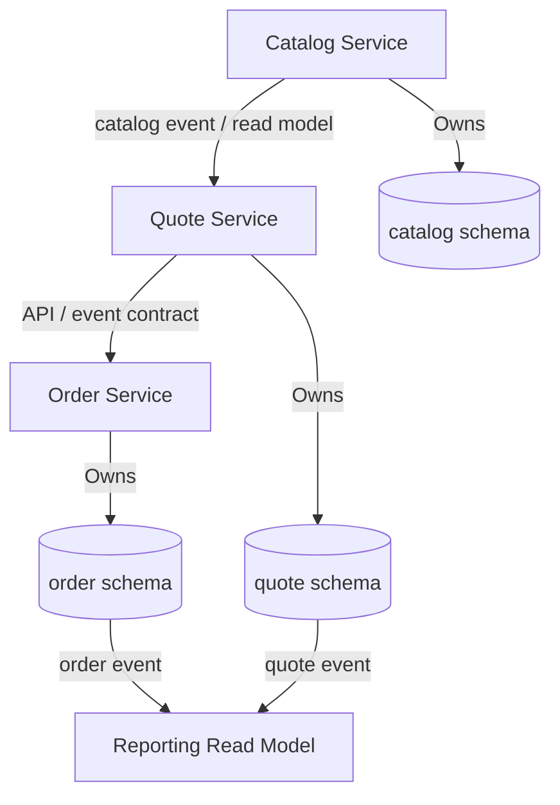

# Part 041 — PostgreSQL in Microservices

## 1. Why this part matters

PostgreSQL in a monolith is often treated as one shared persistence layer.

PostgreSQL in microservices must be treated as a set of independently owned data boundaries.

The difficult question is not:

```text
Can service A query table B?
```

The real question is:

```text
Who owns this data, who can change it, who can trust it, and how does that trust survive deployment, failure, replay, migration, and reporting?
```

In enterprise systems like CPQ, quote management, order management, and quote-to-cash workflows, data boundaries are not just technical boundaries. They are correctness boundaries.

A bad boundary can create:

- hidden coupling between services.
- cross-service schema dependency.
- broken migration sequencing.
- inconsistent read models.
- duplicate events.
- stale reference data.
- hard-to-debug production incidents.
- accidental distributed transactions.
- reporting workloads that damage OLTP performance.

Microservices do not remove database complexity.

They move database complexity into ownership, contracts, replication, consistency, and operations.

---

## 2. Core principle

A microservice should own its data model.

Ownership means:

- the service defines the schema.
- the service owns migrations.
- the service owns writes.
- the service owns invariants.
- the service owns data correction.
- the service owns publication of events or read contracts.
- other services do not bypass its API or event contract to mutate its data.

Ownership does not mean the service is the only consumer of the information.

It means other consumers must depend on explicit contracts, not accidental table access.



The database boundary is part of the service contract.

---

## 3. Database-per-service pattern

Database-per-service means each service has an independently owned persistence boundary.

This can be implemented as:

- separate PostgreSQL database per service.
- separate schema per service in the same PostgreSQL cluster.
- separate cluster per service or domain group.
- managed PostgreSQL instance per service group.
- hybrid model depending on operational constraints.

The principle is not necessarily physical isolation.

The principle is ownership isolation.

| Implementation | Strong point | Risk |
|---|---|---|
| Database per service | strong isolation | more operational overhead |
| Schema per service | simpler operations | easier to violate boundaries |
| Shared cluster | cost efficient | noisy-neighbor risk |
| Shared database with ownership discipline | pragmatic transition model | discipline can decay |
| Shared tables across services | convenient short term | high coupling and migration risk |

For senior engineering review, always ask:

> Is this service boundary enforced technically, socially, or not at all?

Technical enforcement is better.

Social enforcement alone tends to fail under delivery pressure.

---

## 4. Shared database anti-pattern

The shared database anti-pattern appears when multiple services read and write the same tables directly.

Example:

```text
Quote Service writes quote table
Order Service reads quote table directly
Reporting Service joins quote, order, customer, catalog tables directly
Approval Service updates quote status directly
```

This looks efficient.

It creates hidden coupling.

Failure modes:

- one service migration breaks another service.
- one service adds a constraint that another service violates.
- one service changes semantics of a status column.
- one service reads half-migrated data.
- one service bypasses business validation of another service.
- operational ownership becomes unclear during incidents.
- table locks or slow reporting query hurt unrelated services.

A shared database is sometimes used during transition.

If so, treat it as a risk register item, not as a mature architecture.

---

## 5. Cross-service foreign keys

Foreign keys are excellent inside a service boundary.

Foreign keys across service boundaries are dangerous.

Inside a boundary:

```text
quote → quote_item
order → order_item
approval_request → approval_decision
```

Across boundaries:

```text
quote.catalog_product_id → catalog.product.id
order.account_id → account.account.id
```

The cross-boundary FK creates deployment and availability coupling.

Problems:

- service A cannot evolve schema independently.
- service B cannot archive/delete without coordinating.
- restore or partial outage becomes complex.
- bulk load/backfill becomes cross-domain operation.
- cloud/on-prem hybrid split becomes harder.
- ownership of referential repair becomes unclear.

Common alternative:

- store external identifier as value.
- validate at command time through API/cache/read model.
- subscribe to reference data change events.
- reconcile periodically.
- treat external IDs as contract values, not local relational ownership.

This weakens immediate relational enforcement.

It strengthens service autonomy.

That is a deliberate trade-off.

---

## 6. Source of truth vs read model

A source-of-truth table answers:

```text
What is the authoritative state?
```

A read model answers:

```text
What view do we need for query, reporting, search, or integration?
```

Do not confuse them.

Example:

| Data | Source of truth | Possible read model |
|---|---|---|
| quote lifecycle | Quote Service PostgreSQL | quote search projection |
| order status | Order Service PostgreSQL | customer order dashboard |
| product catalog | Catalog Service PostgreSQL | quote-time catalog snapshot |
| price validity | Pricing/Catalog service | effective-dated quote pricing view |
| event publication | owning service outbox | reporting event sink |

A read model may be denormalized, eventually consistent, and rebuildable.

A source-of-truth model must protect invariants.

---

## 7. Cross-service query problem

Microservices make simple joins harder.

In a monolith:

```sql
SELECT q.quote_number, o.order_number, c.customer_name
FROM quote q
JOIN orders o ON o.quote_id = q.id
JOIN customer c ON c.id = q.customer_id;
```

In microservices, those tables may belong to different services.

Direct SQL join across service-owned schemas is often an architecture smell.

Options:

1. API composition.
2. replicated read model.
3. event-driven projection.
4. reporting database.
5. data warehouse/lake.
6. carefully governed shared read replica.

| Option | Best for | Risk |
|---|---|---|
| API composition | small interactive reads | latency and partial failure |
| Event projection | dashboard/search | eventual consistency |
| Reporting DB | cross-domain reporting | data freshness and lineage |
| Warehouse/lake | analytics | not suitable for OLTP commands |
| Shared direct SQL | fast tactical delivery | hidden coupling |

The key is to choose intentionally.

---

## 8. Reporting across services

Reporting is often the first pressure that breaks database boundaries.

Product and operations teams want cross-domain visibility:

- quote conversion.
- order fallout.
- approval cycle time.
- catalog version adoption.
- price override frequency.
- fulfillment delay.
- customer/account lifecycle.

If every report directly joins production schemas, production OLTP becomes the reporting backend.

Risks:

- long-running queries.
- table scans on hot tables.
- temp file pressure.
- lock conflicts with migration.
- business logic duplicated in SQL.
- inconsistent interpretation of states.
- schema migration blocked by reports.

Better patterns:

- event-fed reporting database.
- materialized read model.
- CDC pipeline to warehouse.
- query replica with strict workload controls.
- semantic layer for metrics.
- source-owned published views with versioning.

A reporting query should not accidentally become a production dependency that prevents schema evolution.

---

## 9. Data duplication is not always bad

Microservices often duplicate data deliberately.

Examples:

- quote stores catalog snapshot.
- order stores customer/account reference at order time.
- invoice stores price/tax data as issued.
- approval stores approver display information for audit.
- reporting model stores denormalized state.

Duplication is bad when it is accidental.

Duplication is useful when it supports:

- historical correctness.
- immutable business record.
- latency reduction.
- service autonomy.
- auditability.
- report stability.
- failure isolation.

The review question is:

> Is this duplicated value a cached copy, a historical snapshot, or an independently owned fact?

Those are different.

| Type | Meaning | Update behavior |
|---|---|---|
| Cached copy | derived convenience | can refresh |
| Historical snapshot | record of past decision | should not mutate casually |
| Independently owned fact | service-owned truth | changed only by owning service |

---

## 10. Eventual consistency

Eventual consistency means data across services may be temporarily inconsistent but should converge.

It is not an excuse for random inconsistency.

A good eventual consistency design defines:

- what can be stale.
- for how long.
- how users see stale data.
- how commands validate stale references.
- how duplicates are handled.
- how ordering is handled.
- how failed propagation is retried.
- how reconciliation finds drift.
- how correction is performed.

Example:

```text
Catalog Service publishes ProductOfferingChanged
Quote Service updates local catalog read model
Quote creation uses local catalog read model
Reconciliation job compares versions periodically
```

Failure mode:

```text
Catalog event is delayed
Quote uses stale price rule
Customer receives invalid quote
```

Correctness guardrails:

- version every reference payload.
- include effective dates.
- validate command against current known version.
- reject or flag stale command when required.
- keep source event replayable.
- reconcile projections.

---

## 11. Saga and compensation

A saga coordinates a business process across service boundaries without a single database transaction.

Example quote-to-order flow:

```text
Submit quote
Reserve resources
Validate credit
Create order
Start fulfillment
Notify customer
```

Each step may be owned by a different service.

There is no single PostgreSQL transaction covering all services.

Saga design requires:

- explicit states.
- idempotent commands.
- durable step result.
- retry policy.
- timeout policy.
- compensation policy.
- manual intervention path.
- observability across services.

Compensation is not rollback.

Rollback means the original transaction did not happen.

Compensation means a later action semantically corrects or offsets a committed action.

Example:

| Step | Failure | Compensation |
|---|---|---|
| reserve resource | order creation fails later | release reservation |
| create order | fulfillment fails | cancel order or move to fallout |
| publish event | consumer fails | retry/replay event |
| approve quote | downstream rejects | reopen quote or create amendment |

PostgreSQL role in saga:

- persist saga state.
- persist idempotency keys.
- persist outbox events.
- enforce local invariants.
- record transition history.
- support reconciliation.

---

## 12. Distributed transaction avoidance

Two-phase commit across microservices is rarely the default answer.

It increases coupling and operational complexity.

Problems:

- coordinator failure.
- participant uncertainty.
- lock duration.
- availability reduction.
- cloud/on-prem boundary difficulty.
- incident response complexity.
- hidden latency.

Preferred patterns:

- local transaction + outbox.
- saga orchestration/choreography.
- idempotent command handling.
- at-least-once event delivery.
- reconciliation.
- compensating action.
- explicit business state machine.

This is not weaker engineering.

It is honest engineering under distributed failure.

---

## 13. Reference data in microservices

Reference data is deceptively hard.

Examples:

- product offering ID.
- currency code.
- country code.
- customer segment.
- tax category.
- approval reason code.
- fulfillment status code.
- tenant configuration.

Questions to ask:

- who owns the reference data?
- how is it versioned?
- is it effective-dated?
- is it tenant-specific?
- can it be deleted?
- can old transactions continue to reference old values?
- is the value copied into snapshots?
- does it need local validation?
- how does it reach other services?

Patterns:

| Pattern | Use when | Risk |
|---|---|---|
| API lookup | low volume, strict freshness | runtime dependency |
| local replicated table | high volume, moderate freshness | staleness |
| immutable code list | stable standard values | redeploy for change |
| event-driven reference projection | enterprise catalog/config | event drift |
| effective-dated snapshot | historical business correctness | more modelling complexity |

For CPQ/order systems, effective-dated and versioned reference data is often more important than normalized elegance.

---

## 14. Schema ownership

Schema ownership must be explicit.

Bad sign:

```text
Nobody knows who owns this table.
```

Worse sign:

```text
Everyone owns this table.
```

A table should have:

- owning service.
- owning team.
- migration repository.
- runtime writer.
- read contract.
- operational dashboard.
- backup/restore responsibility.
- data repair process.

Suggested metadata to track internally:

| Table/schema | Owner service | Owner team | Write path | Read consumers | Migration repo | Criticality |
|---|---|---|---|---|---|---|
| quote | Quote Service | TBD | Quote API | Reporting, Order | TBD | high |
| order | Order Service | TBD | Order API | Fulfillment, Reporting | TBD | high |
| catalog_snapshot | Quote Service | TBD | Catalog event consumer | Quote API | TBD | medium/high |

Do not assume this mapping exists.

Create it if it does not.

---

## 15. Migration coordination across services

Database migration in microservices is harder because consumers may lag.

A schema change may affect:

- owning service application code.
- read model builders.
- CDC pipelines.
- Debezium connectors.
- Kafka event schema.
- reporting queries.
- MyBatis mappers.
- stored functions/views.
- dashboards and alerts.
- data repair scripts.

Safe migration pattern:

```text
1. Add backward-compatible column/table/index
2. Deploy writer that can populate both old/new shape
3. Backfill safely
4. Deploy readers that use new shape
5. Confirm all consumers migrated
6. Stop writing old shape
7. Remove old shape in later release
```

This is expand-contract migration.

Microservices make the gap between expand and contract longer.

That is normal.

---

## 16. Event contract vs table contract

A database table is not a good public service contract.

Reasons:

- tables are optimized for local invariants.
- schemas need internal refactoring freedom.
- columns may have transitional meaning during migration.
- database constraints do not describe business event semantics.
- consumers may infer wrong meaning from raw columns.

Events should publish business facts:

```json
{
  "eventId": "...",
  "eventType": "QuoteSubmitted",
  "occurredAt": "2026-07-11T00:00:00Z",
  "quoteId": "...",
  "quoteNumber": "Q-123",
  "quoteVersion": 7,
  "submittedBy": "...",
  "catalogVersion": "2026.07",
  "schemaVersion": 2
}
```

Event contract should define:

- identity.
- event type.
- schema version.
- occurrence time.
- aggregate identity.
- ordering key.
- idempotency key.
- payload compatibility.
- privacy classification.
- replay behavior.

Do not let consumers reverse-engineer business events from raw table changes unless CDC governance is explicit.

---

## 17. CDC in microservices

CDC can publish changes from PostgreSQL to Kafka or another stream.

It is powerful.

It is also easy to misuse.

CDC exposes database changes, not necessarily business intent.

Example raw change:

```text
UPDATE quote SET status = 'SUBMITTED'
```

Business meaning might be:

```text
QuoteSubmitted
QuoteResubmitted
QuoteAutoSubmitted
QuoteMigratedToSubmitted
```

Those are not the same event.

CDC works best when:

- the outbox table contains business events.
- replication slot lifecycle is monitored.
- event schema is governed.
- consumers are idempotent.
- replay is expected.
- PII is controlled.
- schema changes are coordinated.

CDC is not a substitute for event design.

---

## 18. Java/JAX-RS impact

Microservice data design directly affects Java/JAX-RS service design.

A resource method should not casually orchestrate multiple service-owned databases.

Bad shape:

```java
@POST
@Path("/orders")
public Response createOrder(CreateOrderRequest request) {
    Quote quote = quoteMapper.findById(request.quoteId());       // quote DB
    CatalogItem item = catalogMapper.findById(quote.itemId());   // catalog DB
    Order order = orderMapper.insert(...);                       // order DB
    kafka.publish(...);                                          // outside transaction
    return Response.ok(order).build();
}
```

Better shape:

- validate local command.
- call remote APIs explicitly when needed.
- persist local decision in one database transaction.
- write outbox event in the same local transaction.
- let downstream services react idempotently.
- reconcile asynchronously.

Java service design must make consistency boundaries visible.

---

## 19. MyBatis/JDBC impact

MyBatis makes SQL explicit.

That is good.

It also makes it easy to violate service boundaries if mapper XML reaches into another schema.

Review risks:

- mapper joins tables from another service schema.
- mapper reads CDC/outbox table directly for business query.
- mapper updates status owned by another service.
- mapper depends on another service's internal enum values.
- mapper query is copied into reporting job.
- mapper SQL assumes transitional migration columns.

Guardrail:

```text
A mapper should only access tables owned by its service unless there is an explicit, reviewed, documented exception.
```

If cross-schema read exists, require:

- owner approval.
- read-only access.
- versioned contract.
- migration coordination.
- observability.
- deprecation plan.

---

## 20. Kubernetes and cloud/on-prem impact

In Kubernetes/cloud/on-prem hybrid systems, service/database boundaries become operational boundaries.

Questions:

- does each service have its own connection pool?
- does each service connect to only its own DB/schema?
- do replicas multiply database connections unexpectedly?
- does failover affect all services or only one service?
- does a noisy reporting service hurt transactional services?
- are secrets scoped per service?
- are NetworkPolicies scoped per service?
- is database access possible only from intended namespaces?
- are read replicas used safely?
- are migrations run once, not per replica?

Microservices fail when logical autonomy is not matched by operational isolation.

---

## 21. Security and privacy concerns

Database-per-service helps least privilege.

Each service account should have only the permissions it needs.

Avoid:

- one shared database superuser for all services.
- application account owning migration DDL.
- reporting account with write access.
- CDC account exposing unnecessary PII.
- cross-service schema grants by default.
- debugging accounts without audit trail.

Privacy concerns:

- duplicated PII across services increases deletion/masking scope.
- event payloads can leak sensitive fields.
- read models can preserve deleted data unintentionally.
- logs may include SQL parameters.
- CDC streams may bypass application redaction.

Microservices multiply data copies.

Compliance must follow the copies.

---

## 22. Observability concerns

A PostgreSQL issue in microservices may present as an application issue.

You need correlation across:

- HTTP request ID.
- service name.
- pod name.
- database user.
- connection pool metrics.
- SQL statement fingerprint.
- transaction duration.
- lock wait.
- outbox lag.
- CDC lag.
- Kafka consumer lag.
- read model freshness.
- failed reconciliation count.

Useful dashboards:

- per-service database latency.
- per-service pool utilization.
- slow SQL by service account.
- lock waits by relation.
- outbox pending age.
- CDC replication slot lag.
- read model staleness.
- cross-service command failure rate.

Without service-level labels, every database incident becomes archaeology.

---

## 23. Failure modes

### 23.1 Shared table migration breaks another service

Cause:

- service A changes column semantics.
- service B reads the column directly.
- no contract exists.

Detection:

- sudden errors in service B after service A deployment.
- SQLState errors.
- null mapping errors.
- query result mismatch.

Fix:

- restore backward compatibility.
- add contract tests.
- remove direct dependency.

### 23.2 Read model stale during command validation

Cause:

- event lag.
- CDC connector stopped.
- consumer failed.

Detection:

- read model version behind source.
- outbox pending age grows.
- Kafka lag grows.

Fix:

- reject stale command if strict freshness needed.
- retry after projection catches up.
- rebuild projection.
- reconcile.

### 23.3 Duplicate event creates duplicate downstream action

Cause:

- at-least-once delivery.
- consumer not idempotent.

Detection:

- duplicate order/action rows.
- same event ID processed twice.

Fix:

- inbox table.
- unique event ID constraint.
- idempotent command design.

### 23.4 Cross-service report damages OLTP

Cause:

- reporting query scans production tables.
- no replica/read model.

Detection:

- temp file growth.
- CPU/IO spike.
- slow transactional endpoints.

Fix:

- move report to read replica/read model.
- add workload limit.
- materialize/aggregate.

### 23.5 Distributed workflow stuck halfway

Cause:

- saga step failed after local commit.
- compensation not implemented.

Detection:

- stale saga state.
- missing downstream event.
- pending status older than SLA.

Fix:

- retry step.
- compensate.
- manual repair with audit.
- add state machine guardrail.

---

## 24. Debugging workflow

When a microservice data issue appears, do not start by guessing.

Use this sequence:

```text
1. Identify the business aggregate and owning service
2. Identify the authoritative table/source
3. Identify all projections/read models involved
4. Compare source version vs projection version
5. Check outbox/inbox/event log
6. Check CDC/Kafka lag if used
7. Check consumer error logs
8. Check MyBatis mapper query shape
9. Check recent migrations
10. Check manual data repair or backfill activity
11. Reconcile source vs derived state
12. Decide repair: replay, rebuild, compensate, or data patch
```

Do not patch derived data before understanding source-of-truth state.

---

## 25. Microservice data design checklist

Ask these before approving a database-affecting design:

- Who owns the data?
- Which service is allowed to write it?
- Which service owns the schema migration?
- Is this a source-of-truth table or read model?
- Are other services reading raw tables directly?
- Is there cross-service FK coupling?
- Is duplication intentional or accidental?
- Is event consistency defined?
- Are duplicate/out-of-order events handled?
- Is reconciliation available?
- Is reporting isolated from OLTP?
- Does the data include PII?
- Does the service account have least privilege?
- Are dashboards labeled by service?
- Is the migration backward-compatible for all consumers?

---

## 26. PR review checklist

For schema/query/migration PRs in microservices, review:

### Ownership

- Is the owning service clear?
- Is the owning team clear?
- Are external consumers documented?
- Is cross-schema access justified?

### Correctness

- Are local invariants enforced by constraints?
- Are cross-service invariants handled by workflow/reconciliation?
- Is event replay safe?
- Is idempotency enforced?

### Performance

- Does this query cross service-owned schemas?
- Will reporting load hit OLTP tables?
- Does read model need indexing?
- Does event projection lag matter?

### Migration

- Is migration expand-contract safe?
- Are downstream consumers compatible?
- Does CDC/outbox schema change safely?
- Is rollback/roll-forward defined?

### Security/privacy

- Does data duplication include PII?
- Are grants scoped?
- Are events redacted?
- Is audit trace preserved?

### Observability

- Can we detect drift?
- Can we detect lag?
- Can we identify the service issuing the query?
- Can we replay/rebuild safely?

---

## 27. Internal verification checklist

Verify inside the actual CSG/team environment:

- Which services own which PostgreSQL databases/schemas/tables.
- Whether database-per-service, schema-per-service, or shared database is used.
- Whether any service reads/writes another service's tables.
- Whether cross-service foreign keys exist.
- Whether reporting queries hit OLTP production databases.
- Whether read models are built through events, CDC, batch jobs, materialized views, or direct joins.
- Whether outbox/inbox pattern is used.
- Whether Debezium/logical decoding is used.
- Whether Kafka event schemas are versioned and governed.
- Whether data duplication is documented as snapshot/cache/source fact.
- Whether service accounts have least privilege.
- Whether migrations are coordinated across service consumers.
- Whether reconciliation jobs exist.
- Whether saga/state machine tables exist.
- Whether dashboards expose outbox lag, CDC lag, projection lag, and failed consumers.
- Whether incident notes mention shared database coupling or stale read models.

Do not infer internal CSG architecture from the domain description alone.

Confirm it in repositories, migrations, runtime configuration, GitOps manifests, dashboards, and team discussions.

---

## 28. Senior engineer mental model

PostgreSQL in microservices is not mainly about where tables live.

It is about where authority lives.

A strong design makes these things explicit:

- ownership.
- transaction boundary.
- event boundary.
- read model boundary.
- migration boundary.
- security boundary.
- observability boundary.
- repair boundary.

When those boundaries are implicit, production incidents become inevitable.

The senior engineer's job is not to reject every shared database or every duplicated field.

The job is to force the design to state its trade-offs clearly and to make failure recovery possible.

---

## 29. References

- PostgreSQL Documentation — Logical Replication: https://www.postgresql.org/docs/current/logical-replication.html
- PostgreSQL Documentation — High Availability, Load Balancing, and Replication: https://www.postgresql.org/docs/current/high-availability.html
- PostgreSQL Documentation — Explicit Locking: https://www.postgresql.org/docs/current/explicit-locking.html
- Kubernetes Documentation — StatefulSets: https://kubernetes.io/docs/concepts/workloads/controllers/statefulset/

