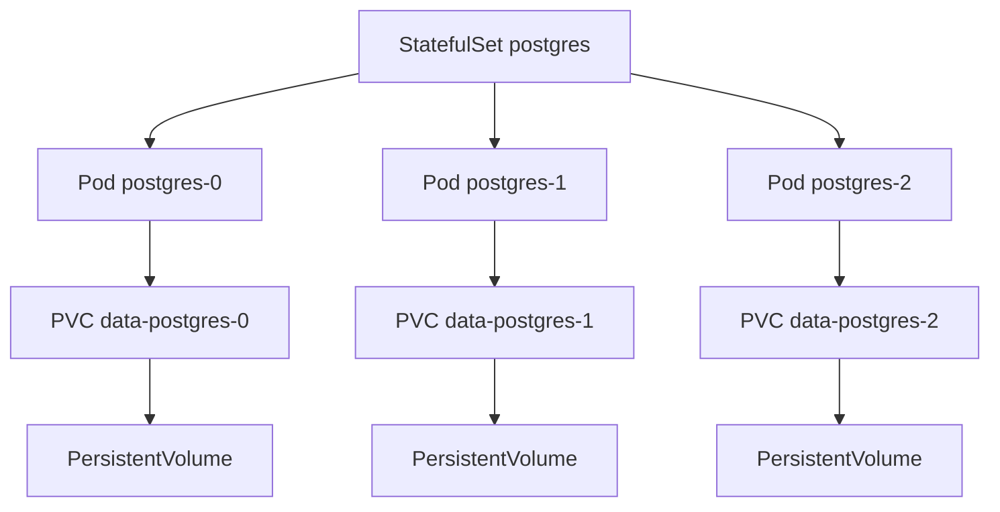

# Part 042 — PostgreSQL in Kubernetes

## 1. Why this part matters

Running a stateless Java/JAX-RS service in Kubernetes is very different from running PostgreSQL in Kubernetes.

A stateless service can usually be replaced.

A PostgreSQL pod cannot be treated as disposable if its storage, WAL, replication, backups, and recovery semantics are not correct.

The dangerous misconception is:

```text
If Kubernetes can restart it, Kubernetes can operate it.
```

For PostgreSQL, restart is not the same as recovery.

Kubernetes gives primitives:

- Pods.
- StatefulSets.
- PersistentVolumes.
- PersistentVolumeClaims.
- StorageClasses.
- Secrets.
- ConfigMaps.
- probes.
- scheduling constraints.
- NetworkPolicies.

Kubernetes does not automatically give:

- correct PostgreSQL HA.
- safe failover.
- backup validation.
- point-in-time recovery.
- WAL archiving.
- replication slot monitoring.
- vacuum tuning.
- upgrade discipline.
- data repair process.
- DBA-grade operational judgment.

This part explains how to reason about PostgreSQL in Kubernetes without pretending it is just another Deployment.

---

## 2. First decision: should PostgreSQL run in Kubernetes?

Before designing manifests, ask whether PostgreSQL should be managed by Kubernetes at all.

Options:

| Option | Typical use | Strength | Risk |
|---|---|---|---|
| Managed cloud PostgreSQL | production cloud workloads | provider handles much of HA/backup/patching | provider limits and cost |
| PostgreSQL operator in Kubernetes | platform team owns DB platform | declarative management and automation | operator expertise required |
| Hand-written StatefulSet | learning/small controlled deployments | explicit and simple | high operational risk |
| On-prem self-managed PostgreSQL | regulated/hybrid/air-gapped | control | full operational burden |
| Embedded/dev PostgreSQL in Kubernetes | test/dev | convenient | not production-equivalent |

A production PostgreSQL cluster is a data platform, not just a pod.

Managed database is often the safer default when available.

Kubernetes PostgreSQL may be justified when:

- deployment must run on-prem or air-gapped.
- platform team standardizes on a proven operator.
- database lifecycle is fully automated and tested.
- backup/restore/HA are validated.
- operational ownership is clear.
- storage class performance is understood.

---

## 3. StatefulSet mental model

A StatefulSet manages stateful applications by giving pods stable identity and stable storage association.

Unlike Deployment pods, StatefulSet pods are not anonymous replicas.

They have stable names such as:

```text
postgres-0
postgres-1
postgres-2
```

A simplified model:



This identity matters for PostgreSQL because replicas, WAL positions, and storage cannot be randomly swapped like stateless application pods.

But StatefulSet alone does not understand PostgreSQL primary/replica roles.

It does not know:

- which pod is primary.
- whether failover is safe.
- whether a replica is caught up.
- whether WAL archive is intact.
- whether a restarted pod needs recovery.

That logic needs PostgreSQL tooling, an operator, or external orchestration.

---

## 4. PersistentVolume and PersistentVolumeClaim

A PostgreSQL pod needs persistent storage.

Kubernetes models this with:

- PersistentVolumeClaim: request for storage.
- PersistentVolume: actual provisioned storage.
- StorageClass: provisioner and storage behavior.

Important properties:

- access mode.
- filesystem type.
- IOPS/throughput.
- latency.
- volume expansion.
- reclaim policy.
- snapshot capability.
- zone/region binding.
- backup integration.
- encryption.

PostgreSQL performance is often storage-bound.

A slow or unstable volume can manifest as:

- high transaction latency.
- checkpoint stalls.
- WAL flush latency.
- slow vacuum.
- replication lag.
- query latency spikes.
- failover recovery delay.

Storage is not a generic YAML detail.

It is part of the database performance envelope.

---

## 5. StorageClass concerns

A StorageClass defines how storage is dynamically provisioned.

For PostgreSQL, review:

- disk type.
- IOPS guarantee.
- throughput guarantee.
- latency profile.
- zone binding mode.
- volume expansion support.
- snapshot support.
- encryption support.
- filesystem behavior.
- reclaim policy.
- backup tool compatibility.

Common failure:

```text
PostgreSQL is deployed with default cluster storage class.
Default storage is optimized for generic workloads, not database write latency.
```

The result may be acceptable in dev and unstable in production.

---

## 6. Volume expansion

Database storage fills up.

A production design must answer:

- can the PVC expand online?
- does the filesystem expand automatically?
- does PostgreSQL need restart?
- is expansion tested?
- are alerts triggered before emergency?
- is there enough node capacity?
- what happens when expansion fails?

Disk full is one of the most dangerous PostgreSQL incidents.

Kubernetes does not make disk full harmless.

You need:

- disk usage alerts.
- WAL growth alerts.
- replication slot lag alerts.
- emergency expansion runbook.
- WAL cleanup knowledge.
- backup/archive awareness.

---

## 7. PostgreSQL operator

A PostgreSQL operator encodes operational knowledge as Kubernetes controllers and custom resources.

Operators may manage:

- cluster creation.
- primary/replica roles.
- failover.
- replication.
- backup.
- restore.
- PITR.
- connection pooling.
- upgrades.
- user/role management.
- monitoring integration.
- configuration rollout.

An operator reduces manual YAML complexity.

It also introduces operator dependency.

Review questions:

- which operator is used?
- what version?
- what PostgreSQL versions are supported?
- how is failover performed?
- how are backups validated?
- how is PITR tested?
- how are major upgrades handled?
- how are operator upgrades tested?
- what happens if the operator is down?
- what operations are safe/unsafe to perform manually?

Do not assume an operator is correct because it exists.

Validate its runbooks.

---

## 8. Backup sidecar, backup job, or operator-managed backup

Backup in Kubernetes can be implemented through:

- operator-managed backup.
- scheduled Kubernetes Job/CronJob.
- sidecar container.
- external backup system.
- cloud volume snapshot.
- pgBackRest, WAL-G, Barman, or equivalent.

The important question is not how backup starts.

The important question is whether restore works.

A backup design must cover:

- base backup.
- WAL archive.
- PITR target.
- encryption.
- retention.
- off-cluster storage.
- cross-zone/region copy.
- restore drill.
- restore time measurement.
- restore ownership.
- backup corruption detection.

A backup stored on the same cluster storage plane may not protect against cluster-level failure.

---

## 9. Pod disruption and availability

Kubernetes may evict pods for:

- node drain.
- cluster upgrade.
- resource pressure.
- preemption.
- failed health checks.
- manual delete.

For PostgreSQL, disruption can mean:

- primary restart.
- replica restart.
- failover.
- client reconnect storm.
- transaction abort.
- replication catch-up.
- lock/session loss.

Use:

- PodDisruptionBudget.
- anti-affinity.
- topology spread constraints.
- graceful termination.
- proper readiness gating.
- controlled rolling upgrades.
- maintenance window discipline.

A PodDisruptionBudget does not guarantee database correctness.

It only constrains voluntary disruption.

---

## 10. Anti-affinity and topology

PostgreSQL replicas should not all run on the same failure domain.

Review placement across:

- nodes.
- racks.
- zones.
- storage zones.
- network segments.

Bad topology:

```text
primary and replicas scheduled on same node
or all volumes bound to same zone without failover design
```

Better topology:

```text
primary and replicas distributed across failure domains
storage binding and failover policy understood
application clients aware of endpoint/failover behavior
```

But topology has trade-offs.

Cross-zone replication can increase latency.

Synchronous replication across zones can reduce data loss but increase commit latency.

The choice must match RPO/RTO and latency requirements.

---

## 11. Node failure

When a node fails, Kubernetes can reschedule pods.

For PostgreSQL, rescheduling is not enough.

Need to know:

- is the failed pod primary or replica?
- is its volume attachable elsewhere?
- how long does detach/attach take?
- can the pod recover cleanly?
- is there automatic failover?
- can two primaries happen?
- will clients reconnect to the right endpoint?
- are in-flight transactions retried safely?

Application impact:

- JDBC connections break.
- HikariCP marks connections dead over time.
- transactions fail.
- MyBatis calls receive SQL exceptions.
- idempotency/retry becomes critical.

A Java service must treat database failover as a possible transient failure, not as impossible.

---

## 12. Storage failure

Storage failure is more serious than pod failure.

Examples:

- volume cannot attach.
- volume corruption.
- volume latency degradation.
- disk full.
- snapshot failure.
- PVC stuck terminating.
- node-local storage unavailable.

Detection:

- PostgreSQL logs.
- Kubernetes events.
- PVC/PV status.
- node storage metrics.
- WAL/checkpoint latency.
- query latency spike.
- filesystem errors.
- backup failures.

Response depends on backup and replication design.

If no restore drill exists, recovery plan is guesswork.

---

## 13. Network policy

Database access should be tightly scoped.

Kubernetes NetworkPolicy can restrict which pods/namespaces can connect to PostgreSQL.

Review:

- which namespace can connect?
- which service account can connect?
- is ingress limited to application pods and admin jobs?
- is egress to backup/object storage allowed?
- is metrics scraping allowed?
- is CDC connector allowed?
- are debug pods allowed?

A common anti-pattern:

```text
Any pod in the cluster can connect to PostgreSQL if it has credentials.
```

Network policy is not a replacement for PostgreSQL roles.

Use both.

---

## 14. Secrets and ConfigMaps

PostgreSQL deployments use secrets for:

- passwords.
- TLS keys.
- replication credentials.
- backup credentials.
- application credentials.

Use ConfigMaps for non-sensitive configuration.

Risks:

- secrets mounted too broadly.
- application and migration use same credential.
- password rotation not tested.
- secrets appear in logs.
- GitOps repository stores plaintext secret.
- backup credentials can read too much.
- CDC credentials expose PII.

Review rotation:

- how are DB credentials rotated?
- do Java pools reconnect safely?
- does MyBatis/JDBC recover?
- are old sessions terminated?
- does rotation trigger outage?

Secret management is an operational workflow, not just a YAML object.

---

## 15. Resource requests and limits

PostgreSQL is sensitive to memory and CPU behavior.

Kubernetes resource settings matter.

Review:

- CPU request.
- CPU limit.
- memory request.
- memory limit.
- huge pages if used.
- eviction thresholds.
- QoS class.
- node pressure behavior.

Risks:

- memory limit too low causes OOM kill.
- CPU limit causes throttling under load.
- noisy neighbors increase latency.
- PostgreSQL config not aligned with container memory.
- `shared_buffers`, `work_mem`, and connection count exceed memory budget.

For PostgreSQL, an OOM kill is not just application restart.

It can abort active transactions and trigger recovery.

---

## 16. Liveness, readiness, and startup probes

Kubernetes probes are powerful and dangerous.

For PostgreSQL:

- liveness probe should not kill a slow-but-recovering database too aggressively.
- readiness probe should reflect whether the pod can serve its intended role.
- startup probe should allow crash recovery time.

Bad liveness probe:

```text
Short timeout + aggressive failure threshold + database under checkpoint pressure
```

Result:

```text
Kubernetes kills PostgreSQL repeatedly, extending outage.
```

Readiness should distinguish:

- primary accepting writes.
- replica accepting reads.
- replica lag too high.
- recovery in progress.
- maintenance mode.

A simple TCP probe is often insufficient for production semantics.

---

## 17. Service endpoints and failover

Applications connect to PostgreSQL through an endpoint.

In Kubernetes this may be:

- Service pointing to primary.
- Service pointing to replicas.
- operator-managed endpoint.
- PgBouncer service.
- external managed database endpoint.
- DNS entry.

Failover questions:

- does the primary endpoint move automatically?
- how fast does DNS/service update propagate?
- do existing JDBC connections break?
- does pool validate connections after failover?
- are writes routed only to primary?
- are read replicas used intentionally?
- can stale reads break API correctness?

Java services need:

- connection timeout.
- socket timeout.
- validation.
- retry only for safe operations.
- idempotency for retried commands.
- observability for reconnect storms.

---

## 18. PgBouncer in Kubernetes

PgBouncer may be deployed to reduce connection pressure.

Deployment patterns:

- sidecar per application pod.
- shared PgBouncer deployment.
- operator-managed pooler.
- external pooler near database.

Trade-offs:

| Pattern | Strength | Risk |
|---|---|---|
| Sidecar | isolates per app | more pods/config |
| Shared pooler | central control | shared blast radius |
| Operator-managed | integrated lifecycle | operator dependency |
| External | stable endpoint | network latency/ops complexity |

Important caveat:

- transaction pooling can interact badly with session state and prepared statements.
- application must not rely on connection-local state unless pooling mode supports it.
- MyBatis/JDBC behavior must be validated.

Do not add PgBouncer without testing prepared statements, transactions, session variables, temp tables, and failover.

---

## 19. Migrations in Kubernetes

Database migration must not run once per application replica.

Bad pattern:

```text
Every Java pod starts and runs Flyway/Liquibase automatically
```

Risk:

- migration lock contention.
- startup storm.
- partial deployment failure.
- multiple versions racing.
- application readiness tied to migration duration.

Safer patterns:

- dedicated migration Job.
- CI/CD-controlled migration step.
- GitOps wave/hook with clear ordering.
- operator-supported migration workflow if available.
- application startup validates expected schema but does not mutate it unexpectedly.

Migration ordering:

```text
1. backup/snapshot if required
2. preflight checks
3. migration job
4. validation query
5. application rollout
6. post-deploy verification
```

For zero-downtime, use expand-contract.

---

## 20. PostgreSQL configuration in Kubernetes

Configuration may come from:

- PostgreSQL config file.
- operator custom resource.
- ConfigMap.
- environment variables.
- managed parameter group if external DB.

Review:

- `max_connections`.
- `shared_buffers`.
- `work_mem`.
- `maintenance_work_mem`.
- `effective_cache_size`.
- `wal_level`.
- `max_wal_size`.
- checkpoint settings.
- autovacuum settings.
- logging settings.
- replication settings.

The configuration must match:

- container memory.
- application pool total.
- workload type.
- CDC/logical replication needs.
- backup/PITR design.
- observability requirements.

Changing ConfigMap does not necessarily change running PostgreSQL safely.

Know which settings require reload vs restart.

---

## 21. Observability in Kubernetes

You need both PostgreSQL metrics and Kubernetes metrics.

PostgreSQL:

- active connections.
- slow queries.
- locks.
- wait events.
- WAL generation.
- replication lag.
- checkpoint activity.
- autovacuum.
- dead tuples.
- disk usage.
- temp files.

Kubernetes:

- pod restarts.
- OOM kills.
- CPU throttling.
- memory usage.
- PVC usage.
- volume latency if exposed.
- node pressure.
- events.
- failed probes.
- network policy drops.

Application:

- pool utilization.
- connection acquisition latency.
- SQL latency.
- transaction duration.
- retry count.
- HTTP latency/error rate.
- outbox/CDC lag.

You cannot debug PostgreSQL-in-Kubernetes from only one layer.

---

## 22. Java/JAX-RS application impact

When PostgreSQL runs in Kubernetes, Java services need production-aware database behavior.

Review application config:

- JDBC URL endpoint.
- HikariCP max pool size.
- connection timeout.
- validation timeout.
- idle timeout.
- max lifetime.
- socket timeout.
- statement timeout.
- transaction timeout.
- retry policy.
- idempotency protection.
- read/write endpoint routing.

Common issue:

```text
PostgreSQL fails over.
Existing JDBC connections are broken.
Pool takes too long to recover.
HTTP endpoints pile up.
Kubernetes scales app pods.
More pods create more connection pressure.
Database recovery slows further.
```

This is a feedback loop.

Connection pool and autoscaling must be designed together.

---

## 23. MyBatis impact

MyBatis itself does not solve Kubernetes database failure.

Mapper calls may fail with:

- connection exception.
- statement timeout.
- serialization failure.
- deadlock.
- read-only transaction error after failover.
- duplicate key on retried insert.
- query canceled due to admin action.

Review:

- SQLState mapping.
- retry boundaries.
- idempotent insert/update design.
- batch executor failure behavior.
- transaction rollback behavior.
- mapper tests against failover-like conditions if possible.

Do not blindly retry all MyBatis exceptions.

Retry only when the operation is safe or protected by idempotency.

---

## 24. Cloud, on-prem, and hybrid impact

Kubernetes PostgreSQL differs depending on environment.

### Cloud Kubernetes

Consider:

- managed disks.
- zone-aware storage.
- cloud load balancers.
- cloud snapshots.
- IAM/secret integration.
- managed object storage for backups.
- node autoscaling interactions.

### On-prem Kubernetes

Consider:

- storage backend maturity.
- manual hardware replacement.
- backup storage location.
- network segmentation.
- patching process.
- monitoring stack ownership.
- air-gapped upgrade process.

### Hybrid

Consider:

- latency to external services.
- DNS and private connectivity.
- backup replication target.
- identity/secret boundary.
- firewall rules.
- failover across environments.

The same YAML may behave very differently in different infrastructure.

---

## 25. Failure modes

### 25.1 CrashLoop caused by aggressive liveness probe

Cause:

- liveness threshold too strict.
- PostgreSQL is recovering or under IO pressure.

Detection:

- pod restart count increases.
- Kubernetes events show failed liveness.
- PostgreSQL logs show interrupted recovery/startup.

Fix:

- add startup probe.
- relax liveness.
- use role-aware readiness.
- investigate underlying IO/checkpoint issue.

### 25.2 Disk full

Cause:

- table growth.
- WAL growth.
- replication slot lag.
- temp files.
- failed backup cleanup.

Detection:

- PVC usage alert.
- PostgreSQL errors about no space left.
- WAL directory growth.
- replication slot retained WAL.

Fix:

- stop growth source.
- expand volume if safe.
- resolve replication slot lag.
- clean safe temporary/log files only with DBA/SRE guidance.
- restore from backup if corruption/damage occurs.

### 25.3 Node drain causes unexpected primary restart

Cause:

- no PDB or insufficient disruption control.
- operator failover behavior misunderstood.

Detection:

- node drain event.
- primary pod restarted.
- application connection errors.

Fix:

- configure PDB.
- coordinate maintenance window.
- validate failover behavior.
- tune application pool recovery.

### 25.4 Storage latency spike

Cause:

- noisy neighbor.
- storage backend degradation.
- checkpoint pressure.

Detection:

- WAL/checkpoint latency.
- query latency spikes.
- node/storage metrics.
- PostgreSQL wait events.

Fix:

- verify storage class performance.
- tune checkpoint/WAL settings if appropriate.
- move workload or scale storage tier.
- reduce write burst.

### 25.5 Migration job runs multiple times

Cause:

- migration triggered by every app pod.
- bad Helm/GitOps hook.

Detection:

- Liquibase/Flyway lock conflict.
- duplicate migration logs.
- startup failures.

Fix:

- move migration to dedicated Job.
- enforce one migration runner.
- add preflight and schema validation.

---

## 26. Debugging workflow

When PostgreSQL-in-Kubernetes is unhealthy, inspect layers in order.

```text
1. Application symptoms
   - HTTP latency/error
   - pool exhaustion
   - SQLState errors

2. PostgreSQL symptoms
   - pg_stat_activity
   - locks/wait events
   - WAL/checkpoint
   - replication lag
   - logs

3. Kubernetes pod symptoms
   - restart count
   - events
   - probe failures
   - OOM kill
   - resource usage

4. Storage symptoms
   - PVC usage
   - attach/detach events
   - volume latency
   - disk full

5. Network symptoms
   - service endpoint
   - DNS
   - NetworkPolicy
   - connection refused/timeout

6. Operator symptoms
   - custom resource status
   - operator logs
   - failover events
   - backup status

7. Recovery decision
   - restart
   - failover
   - scale storage
   - replay/rebuild replica
   - restore
   - rollback migration
```

Avoid random pod deletion during a database incident.

A pod restart can make things worse if the root cause is storage, recovery, replication, or probes.

---

## 27. Running PostgreSQL in Kubernetes vs managed database

Use this decision table:

| Question | Managed DB advantage | Kubernetes DB advantage |
|---|---|---|
| HA/failover | provider-managed | operator/customizable |
| Backup/PITR | integrated | fully controlled if implemented |
| Patch/upgrade | provider tooling | platform-controlled timing |
| On-prem support | limited | strong if cluster exists |
| Operational burden | lower | higher |
| Custom extensions | provider-limited | more control |
| Storage tuning | provider abstraction | direct but risky |
| Compliance/air-gap | depends on provider | often better fit |
| Team expertise needed | lower but still real | high |

If your team does not have proven restore, failover, upgrade, and monitoring workflows, managed database is usually safer.

If managed database is not possible, Kubernetes PostgreSQL must be treated as a platform product with explicit ownership.

---

## 28. PR review checklist

For Kubernetes PostgreSQL manifests or operator configs, review:

### Workload

- Is this StatefulSet/operator-managed, not a generic Deployment?
- Is pod identity stable?
- Is PostgreSQL role management explicit?
- Is failover behavior understood?

### Storage

- Is StorageClass appropriate for database latency?
- Is PVC size realistic?
- Is expansion supported and tested?
- Is snapshot/backup supported?
- Is reclaim policy understood?

### Availability

- Is there a PDB?
- Are anti-affinity/topology rules configured?
- Are maintenance windows defined?
- Are probes safe?
- Is graceful termination configured?

### Security

- Are secrets managed safely?
- Are credentials scoped?
- Is NetworkPolicy restrictive?
- Is TLS configured if required?
- Are admin/debug paths audited?

### Operations

- Are backups configured?
- Has restore been tested?
- Is PITR available if required?
- Are metrics/logs scraped?
- Are alerts defined?
- Is runbook available?

### Application integration

- Are pool sizes aligned with replicas and DB max connections?
- Are connection timeouts configured?
- Are retries idempotent?
- Does app handle failover?
- Are migrations run safely once?

---

## 29. Internal verification checklist

Verify inside the actual CSG/team environment:

- Whether PostgreSQL runs in Kubernetes, managed cloud DB, on-prem VM/bare metal, or hybrid.
- If Kubernetes: which operator or StatefulSet pattern is used.
- Which namespaces contain database workloads.
- Which StorageClass backs PostgreSQL PVCs.
- Whether volume expansion is enabled and tested.
- Whether backups are operator-managed, job-based, sidecar-based, or external.
- Whether PITR is supported and restore drills are performed.
- Whether PostgreSQL pods have PDB, anti-affinity, topology spread, and safe probes.
- Whether NetworkPolicy restricts database access.
- How Secrets are stored, rotated, and injected.
- Whether application and migration credentials are separate.
- Whether PgBouncer is used and in which pooling mode.
- Whether app pool sizes account for Kubernetes replica count.
- Whether migrations run through CI/CD, GitOps hook, init container, or app startup.
- Whether PostgreSQL resource requests/limits match PostgreSQL memory settings.
- Whether dashboards include PostgreSQL and Kubernetes layer metrics.
- Whether incident notes mention pod restarts, PVC issues, probe failures, storage latency, failover, or migration jobs.

Do not assume Kubernetes deployment details from application code alone.

Check manifests, Helm charts, GitOps repositories, operator custom resources, cloud console, monitoring dashboards, and SRE/DBA runbooks.

---

## 30. Senior engineer mental model

PostgreSQL in Kubernetes is a boundary between database engineering and platform engineering.

A senior engineer should not evaluate it as only YAML.

Evaluate it as:

- data durability design.
- failover design.
- backup/restore design.
- storage performance design.
- application connection design.
- security design.
- migration design.
- observability design.
- incident response design.

The key question is:

```text
When the pod, node, volume, network, operator, migration, or application fails, do we know exactly what happens to data and how to recover?
```

If the answer is no, the design is not production-ready.

---

## 31. References

- Kubernetes Documentation — StatefulSets: https://kubernetes.io/docs/concepts/workloads/controllers/statefulset/
- Kubernetes Documentation — Persistent Volumes: https://kubernetes.io/docs/concepts/storage/persistent-volumes/
- Kubernetes Documentation — Storage Classes: https://kubernetes.io/docs/concepts/storage/storage-classes/
- Kubernetes Documentation — Liveness, Readiness, and Startup Probes: https://kubernetes.io/docs/concepts/workloads/pods/probes/
- PostgreSQL Documentation — High Availability, Load Balancing, and Replication: https://www.postgresql.org/docs/current/high-availability.html
- PostgreSQL Documentation — Continuous Archiving and PITR: https://www.postgresql.org/docs/current/continuous-archiving.html

