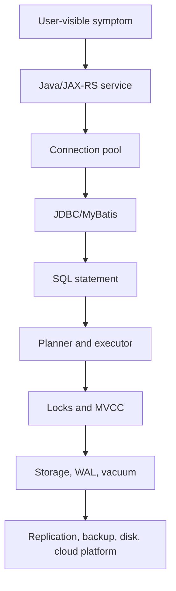

# Part 047 — Troubleshooting Playbook

## 1. Why this part matters

A PostgreSQL incident rarely announces itself as a clean database problem.

It usually appears as:

- API latency spike;
- 5xx responses from Java/JAX-RS services;
- connection timeout from HikariCP or another pool;
- Kafka consumer lag;
- failed migration job;
- elevated CPU on database node;
- disk usage growth;
- replication lag;
- a customer-facing workflow stuck in `PENDING`, `SUBMITTED`, `APPROVAL_REQUIRED`, or similar domain state;
- a report that suddenly takes minutes;
- a pod restart loop caused by blocked startup migration;
- a business operation that works in staging but fails in production data shape.

The mistake is to jump directly to a fix:

```text
Slow endpoint? Add index.
Deadlock? Increase timeout.
Connection exhaustion? Increase pool size.
Disk full? Delete logs.
Failed migration? Manually patch database.
```

Those reactions can make the incident worse.

A senior engineer uses a playbook:

1. classify the symptom;
2. limit blast radius;
3. gather minimum safe evidence;
4. identify the contention domain;
5. separate database cause from application trigger;
6. choose the least risky mitigation;
7. preserve evidence for RCA;
8. convert the incident into a durable prevention.

This part is a practical troubleshooting handbook for PostgreSQL-backed Java/JAX-RS systems using JDBC, MyBatis, migrations, Kafka/CDC, Kubernetes, cloud/on-prem deployment, and production operations.

---

## 2. Troubleshooting mental model

PostgreSQL failures usually fall into one of these layers.



The same symptom can originate from different layers.

Example: `API timeout` can be caused by:

- application thread starvation;
- pool exhaustion;
- blocking query;
- slow plan regression;
- missing index;
- stale statistics;
- autovacuum contention;
- high checkpoint pressure;
- disk IO saturation;
- network failure;
- read replica lag;
- a failed rolling deployment that changed query shape;
- a migration holding an `ACCESS EXCLUSIVE` lock.

The first rule:

```text
Do not optimize before you know what is waiting.
```

The most important question is not “what is slow?”

It is:

```text
What resource is the system waiting on?
```

Common wait domains:

- CPU;
- IO;
- lock;
- connection slot;
- connection pool slot;
- WAL flush;
- replication apply;
- autovacuum/freeze pressure;
- memory/temp file spill;
- network;
- external dependency;
- application thread pool.

---

## 3. Production-safe first response

When PostgreSQL is suspected during an incident, do not begin with invasive actions.

Start with safe observation.

### 3.1 First questions

Ask:

1. What changed recently?
2. Is the problem global or isolated to one endpoint/job/customer/tenant?
3. Is it read path, write path, migration path, or async path?
4. Is latency high, error rate high, or throughput low?
5. Are database connections saturated?
6. Are queries waiting on locks?
7. Are there long-running transactions?
8. Did a migration run recently?
9. Did a deployment change SQL shape?
10. Is the issue on primary, replica, or both?
11. Is CDC/Kafka lag involved?
12. Is disk/WAL growing abnormally?

### 3.2 Minimum safe evidence

Collect evidence before killing sessions or changing parameters:

```sql
select now();

select
  pid,
  usename,
  application_name,
  client_addr,
  state,
  wait_event_type,
  wait_event,
  xact_start,
  query_start,
  now() - query_start as query_age,
  now() - xact_start as xact_age,
  left(query, 500) as query_sample
from pg_stat_activity
where state <> 'idle'
order by query_start nulls last;
```

Check blocked queries:

```sql
select
  blocked.pid as blocked_pid,
  blocked.usename as blocked_user,
  blocked.application_name as blocked_app,
  now() - blocked.query_start as blocked_duration,
  left(blocked.query, 500) as blocked_query,
  blocker.pid as blocker_pid,
  blocker.usename as blocker_user,
  blocker.application_name as blocker_app,
  now() - blocker.query_start as blocker_duration,
  left(blocker.query, 500) as blocker_query
from pg_stat_activity blocked
join pg_locks blocked_locks
  on blocked_locks.pid = blocked.pid
join pg_locks blocker_locks
  on blocker_locks.locktype = blocked_locks.locktype
 and blocker_locks.database is not distinct from blocked_locks.database
 and blocker_locks.relation is not distinct from blocked_locks.relation
 and blocker_locks.page is not distinct from blocked_locks.page
 and blocker_locks.tuple is not distinct from blocked_locks.tuple
 and blocker_locks.virtualxid is not distinct from blocked_locks.virtualxid
 and blocker_locks.transactionid is not distinct from blocked_locks.transactionid
 and blocker_locks.classid is not distinct from blocked_locks.classid
 and blocker_locks.objid is not distinct from blocked_locks.objid
 and blocker_locks.objsubid is not distinct from blocked_locks.objsubid
 and blocker_locks.pid <> blocked_locks.pid
join pg_stat_activity blocker
  on blocker.pid = blocker_locks.pid
where not blocked_locks.granted
  and blocker_locks.granted;
```

Check long transactions:

```sql
select
  pid,
  usename,
  application_name,
  client_addr,
  state,
  now() - xact_start as xact_age,
  now() - query_start as query_age,
  wait_event_type,
  wait_event,
  left(query, 500) as query_sample
from pg_stat_activity
where xact_start is not null
order by xact_start asc;
```

Check connection count:

```sql
select
  state,
  application_name,
  count(*)
from pg_stat_activity
group by state, application_name
order by count(*) desc;
```

Check top query fingerprints if `pg_stat_statements` is enabled:

```sql
select
  queryid,
  calls,
  total_exec_time,
  mean_exec_time,
  max_exec_time,
  rows,
  shared_blks_hit,
  shared_blks_read,
  temp_blks_written,
  left(query, 500) as query_sample
from pg_stat_statements
order by total_exec_time desc
limit 20;
```

For production, always consider whether you are allowed to run these queries directly. In some teams, only DBA/SRE can query production databases.

---

## 4. Symptom classifier

Use this classifier before mitigation.

| Symptom | Likely domain | First evidence | Typical mistake |
|---|---|---|---|
| API latency high | query, lock, pool, thread | API trace + `pg_stat_activity` | Add index blindly |
| API 5xx with timeout | pool/db/network | service logs + pool metrics | Increase pool without checking DB max connections |
| Many active queries waiting | lock/IO/WAL | wait events + locks | Kill random backend |
| Many idle in transaction | application transaction leak | `pg_stat_activity` | Tune autovacuum instead of fixing app |
| Deadlock errors | transaction order | DB logs + SQLState | Retry forever without fixing lock order |
| Serialization failures | isolation conflict | SQLState + endpoint pattern | Treat as fatal bug only |
| Disk usage growing | WAL/bloat/temp | disk metrics + WAL dir + temp files | Delete database files manually |
| Replication lag | IO/WAL/network/long query | replica metrics | Route more reads to lagging replica |
| Migration stuck | lock wait | migration logs + locks | Restart migration repeatedly |
| Index not used | planner/statistics/query shape | EXPLAIN ANALYZE | Force index mentally |
| CPU high | query plan/concurrency | top queries + CPU | Scale app replicas first |
| IO high | scan/sort/checkpoint/vacuum | wait events + buffers | Increase memory blindly |
| Kafka lag after DB change | outbox/CDC/replication slot | connector logs + WAL lag | Restart consumers only |

---

## 5. Slow query playbook

### 5.1 What it means

A slow query is not always a bad query.

It can be slow because:

- it scans too many rows;
- it joins in the wrong order;
- statistics are stale;
- index is missing;
- index exists but is not useful;
- query spills to disk;
- query waits on lock;
- query waits on IO;
- query is blocked behind a migration;
- query runs on a lagging replica;
- query is executed too frequently;
- query returns too much data to the Java service;
- MyBatis dynamic SQL generated a worse predicate than expected.

### 5.2 First diagnostic split

Before tuning, determine whether time is spent executing or waiting.

```sql
select
  pid,
  state,
  wait_event_type,
  wait_event,
  now() - query_start as query_age,
  left(query, 500) as query_sample
from pg_stat_activity
where state <> 'idle'
order by query_start asc;
```

If `wait_event_type = 'Lock'`, this is not primarily a query tuning incident. Use the blocking query playbook.

If wait event suggests IO, WAL, or buffer activity, inspect plan and system metrics.

### 5.3 Use EXPLAIN safely

For SELECT:

```sql
explain (analyze, buffers, verbose)
select ...;
```

For UPDATE/DELETE/INSERT, be careful.

Use a transaction and rollback if allowed:

```sql
begin;
explain (analyze, buffers)
update ...;
rollback;
```

Do not run production write statements for analysis unless you understand triggers, foreign keys, locks, side effects, and transaction scope.

### 5.4 Red flags in plan

Look for:

- estimated rows very different from actual rows;
- sequential scan on huge table without selective predicate;
- nested loop with unexpectedly large outer rows;
- hash join spilling to disk;
- sort spilling to disk;
- high `shared_blks_read` vs `shared_blks_hit`;
- `Rows Removed by Filter` extremely high;
- index scan returning too many rows;
- repeated query from N+1 pattern;
- CTE/materialization causing unnecessary work;
- function on indexed column preventing index usage;
- implicit cast preventing index usage;
- dynamic SQL omitting tenant/status/date filter.

### 5.5 Java/JAX-RS impact

A slow query can cause:

- request thread occupation;
- pool connection held longer;
- downstream timeout;
- retry storm;
- duplicate business operation if idempotency is weak;
- circuit breaker trips;
- Kubernetes HPA scale-out that increases DB pressure;
- consumer lag if the slow query is in a Kafka consumer.

### 5.6 MyBatis-specific checks

Check:

- generated SQL from logs/tracing;
- whether dynamic WHERE omitted selective predicates;
- whether `${}` was used for unsafe dynamic fragments;
- whether pagination uses `OFFSET` deeply;
- whether mapper creates N+1 nested selects;
- whether result mapping pulls too many columns;
- whether `fetchSize` is configured for large result streaming;
- whether batch fetching is used for collections.

### 5.7 Mitigation options

Least risky first:

1. reduce traffic to affected endpoint/job;
2. disable expensive feature path if feature flag exists;
3. add selective predicate in application if safe;
4. fix query shape;
5. refresh statistics with `ANALYZE` if stats are stale;
6. add index concurrently if safe and approved;
7. increase timeout only if it prevents cascading failure and root cause is understood;
8. move read/reporting workload to replica only if replica lag is acceptable;
9. use temporary operational workaround with explicit expiry.

### 5.8 Do not

Do not:

- create random indexes during incident without understanding writes;
- run `EXPLAIN ANALYZE` on destructive statements casually;
- increase pool size to hide slow queries;
- increase `statement_timeout` as primary fix;
- kill all sessions without identifying blockers;
- disable autovacuum to reduce load;
- route all reads to a lagging replica;
- patch SQL in production outside normal deployment unless incident process allows it.

---

## 6. Blocking query playbook

### 6.1 What it means

A blocking query is a query waiting for another transaction to release a lock.

The blocker may be:

- an active query;
- an idle-in-transaction session;
- a migration DDL statement;
- a batch job;
- a user transaction from application code;
- a maintenance operation;
- an uncommitted transaction from a manual console.

The blocker is often not the most CPU-intensive process. It may be doing nothing while holding locks.

### 6.2 Find blocker and blocked

Use `pg_blocking_pids` when available:

```sql
select
  blocked.pid as blocked_pid,
  blocked.application_name as blocked_app,
  now() - blocked.query_start as blocked_query_age,
  left(blocked.query, 500) as blocked_query,
  blocker.pid as blocker_pid,
  blocker.application_name as blocker_app,
  now() - blocker.xact_start as blocker_xact_age,
  now() - blocker.query_start as blocker_query_age,
  blocker.state as blocker_state,
  left(blocker.query, 500) as blocker_query
from pg_stat_activity blocked
join lateral unnest(pg_blocking_pids(blocked.pid)) as bpid(blocker_pid) on true
join pg_stat_activity blocker on blocker.pid = bpid.blocker_pid
order by blocked.query_start;
```

### 6.3 Interpret blocker state

If blocker is `active`, it may be doing legitimate work.

If blocker is `idle in transaction`, the application likely opened a transaction and did not commit/rollback promptly.

If blocker is a migration, check migration logs and lock mode.

If blocker is a manual client, escalate to owner immediately.

### 6.4 Mitigation

Possible mitigations:

- wait if blocker is near completion and impact is limited;
- cancel blocker query with `pg_cancel_backend(pid)` if safe;
- terminate blocker session with `pg_terminate_backend(pid)` only after approval;
- disable affected job;
- pause migration pipeline;
- lower traffic to affected endpoint;
- apply application fix for transaction scope;
- add `lock_timeout` for future migrations.

Prefer `pg_cancel_backend` before `pg_terminate_backend` when possible.

### 6.5 Corrective actions

After incident:

- ensure transactions are short;
- add transaction timeout;
- configure `idle_in_transaction_session_timeout` if appropriate;
- add lock timeout to migration tool;
- prevent long-running read transaction on primary;
- add application tracing for transaction age;
- split large transaction into chunks;
- review MyBatis mapper calls inside transaction boundaries.

---

## 7. Deadlock playbook

### 7.1 What it means

A deadlock occurs when transactions wait on each other in a cycle.

Example:

```text
T1 locks quote 100, then waits for order 200.
T2 locks order 200, then waits for quote 100.
```

PostgreSQL detects deadlocks and aborts one transaction.

The aborted transaction usually surfaces to Java as an exception with SQLState class related to transaction rollback/deadlock.

### 7.2 Common causes

- inconsistent update order;
- batch updates without deterministic ordering;
- parent/child updates in different order;
- trigger updates hidden tables;
- foreign key checks interacting with concurrent writes;
- multiple workers processing overlapping data;
- job queue claiming logic without stable ordering;
- MyBatis dynamic SQL updating rows in nondeterministic order;
- application retry executing duplicate operation without idempotency.

### 7.3 Immediate response

Deadlock is usually not fixed by killing sessions. PostgreSQL already aborts one participant.

Immediate response:

1. identify affected operation;
2. check frequency;
3. check whether retry works;
4. check whether user-visible operation is idempotent;
5. inspect DB logs for deadlock detail;
6. inspect involved SQL statements;
7. determine lock acquisition order.

### 7.4 Fix pattern

Fixes include:

- lock rows in deterministic order;
- update parent before child consistently;
- split unrelated writes;
- reduce transaction duration;
- remove hidden trigger side effects;
- introduce optimistic locking;
- use `SKIP LOCKED` for worker queues;
- add bounded retry for deadlock victims;
- make business command idempotent;
- document lock ordering rule.

### 7.5 Java retry discipline

Retry only if:

- transaction fully rolled back;
- operation is idempotent or protected by idempotency key;
- retry count is bounded;
- retry uses jitter/backoff;
- domain side effects are not duplicated;
- logs preserve original SQLState and correlation ID.

Bad retry:

```text
catch Exception -> retry forever
```

Better retry:

```text
retry only known transient SQLState classes
bounded retries
full transaction retry
idempotent command boundary
structured logging
```

---

## 8. Serialization failure playbook

### 8.1 What it means

At stricter isolation levels, PostgreSQL can reject a transaction because concurrent transactions would violate serializable ordering.

This is not necessarily database corruption or a PostgreSQL bug.

It means:

```text
The database protected correctness by rejecting one transaction.
```

### 8.2 Common causes

- serializable transaction reading condition then writing based on it;
- concurrent approval/assignment workflow;
- capacity/reservation logic;
- uniqueness implemented in application rather than constraint;
- aggregate check before insert;
- multi-row invariant under concurrency;
- report/update mix in same transaction.

### 8.3 Response

- confirm isolation level;
- inspect SQLState;
- retry entire transaction, not individual statement;
- verify idempotency;
- consider explicit constraints or locks if retry rate is high;
- avoid long serializable transactions;
- monitor retry rate as a correctness signal.

### 8.4 Design implication

A low rate of serialization failure may be normal.

A high rate means the transaction design is contended or the invariant needs a different mechanism.

---

## 9. Connection exhaustion playbook

### 9.1 Symptoms

Application logs may show:

- timeout acquiring connection from pool;
- too many clients already;
- connection refused;
- startup failure because migrations cannot connect;
- all pods healthy but requests stuck;
- database max connections reached.

### 9.2 Split application pool vs database connection limit

Application pool exhaustion means service threads cannot acquire a connection from pool.

Database connection exhaustion means PostgreSQL cannot accept more sessions.

Both can occur together.

Check application metrics:

- active connections;
- idle connections;
- pending threads;
- connection acquisition time;
- connection usage time;
- pool timeout count;
- leak detection logs.

Check PostgreSQL:

```sql
select
  application_name,
  state,
  count(*)
from pg_stat_activity
group by application_name, state
order by count(*) desc;
```

### 9.3 Common causes

- too many Kubernetes replicas multiplied by pool size;
- connection leak;
- slow queries holding connections;
- long transactions;
- transaction left open during external API call;
- streaming result not closed;
- migration job competing with app connections;
- multiple services sharing same database max connections;
- PgBouncer misconfiguration;
- read replicas not used as expected;
- deployment storm causing simultaneous pool warmup.

### 9.4 Bad fix

```text
Increase maximumPoolSize from 20 to 100.
```

This may overload PostgreSQL.

### 9.5 Better fix

- identify connection holder duration;
- reduce transaction time;
- fix leak;
- lower pool size if database is saturated;
- add PgBouncer if appropriate;
- cap app replica count;
- reserve connections for admin/migration;
- use backpressure;
- configure connection timeout lower than API timeout;
- coordinate with platform/DBA for max connection budget.

### 9.6 Pool sizing sanity check

```text
Total possible DB connections = service replicas × max pool size
```

If there are multiple services:

```text
Total possible DB connections = sum(each service replicas × each service max pool size) + jobs + migrations + admin + monitoring + CDC
```

This number must fit within database capacity, not just `max_connections`.

---

## 10. Pool exhaustion playbook

Connection pool exhaustion can happen even when PostgreSQL still has available connections.

This means application-side demand exceeds configured pool availability.

### 10.1 Diagnose

Look for:

- high pending threads;
- long connection borrow duration;
- low idle count;
- high active count;
- request traces showing DB span dominates;
- connection leak detection stack traces;
- slow queries or blocking queries downstream.

### 10.2 Common application bugs

- connection borrowed too early in request lifecycle;
- transaction starts before validation/auth/external call;
- connection held while calling another service;
- streaming response keeps transaction open;
- MyBatis session not closed in manual usage;
- batch job uses one huge transaction;
- nested calls accidentally share long transaction.

### 10.3 Fix patterns

- start transaction as late as possible;
- commit/rollback as early as possible;
- separate external calls from DB transaction;
- use read-only transactions for reads;
- chunk batch operations;
- set statement/query timeout;
- avoid synchronous report generation in request thread;
- add bounded concurrency for workers.

---

## 11. High CPU playbook

### 11.1 Common PostgreSQL causes

- bad query plan;
- missing index;
- high concurrency of moderately expensive queries;
- sorting/hash aggregation;
- expression-heavy queries;
- JSONB extraction at scale;
- full-text search without appropriate index;
- too many connections causing context switching;
- autovacuum/workers competing for CPU;
- JIT overhead in some workloads;
- repeated N+1 query execution.

### 11.2 Evidence

Use:

```sql
select
  queryid,
  calls,
  total_exec_time,
  mean_exec_time,
  rows,
  left(query, 500) as query_sample
from pg_stat_statements
order by total_exec_time desc
limit 20;
```

Also check active sessions:

```sql
select
  pid,
  state,
  wait_event_type,
  wait_event,
  now() - query_start as query_age,
  left(query, 500) as query_sample
from pg_stat_activity
where state <> 'idle'
order by query_start;
```

### 11.3 Mitigation

- reduce traffic to expensive path;
- disable/report async heavy feature;
- fix top query shape;
- add index if evidence supports it;
- reduce connection concurrency;
- move reporting workload away from primary;
- use caching only if correctness permits;
- scale database CPU only after query/concurrency review.

---

## 12. High memory and temp file playbook

### 12.1 What it means

PostgreSQL memory pressure often appears as temp file growth, slow sorts, slow hash joins, or operating system swapping.

`work_mem` is per operation, not a global cap.

A query can use multiple sort/hash operations, and many queries can run concurrently.

### 12.2 Evidence

Check temp usage:

```sql
select
  datname,
  temp_files,
  pg_size_pretty(temp_bytes) as temp_bytes
from pg_stat_database
order by temp_bytes desc;
```

From `pg_stat_statements`:

```sql
select
  queryid,
  calls,
  temp_blks_read,
  temp_blks_written,
  mean_exec_time,
  left(query, 500) as query_sample
from pg_stat_statements
where temp_blks_written > 0
order by temp_blks_written desc
limit 20;
```

### 12.3 Fix patterns

- improve query selectivity;
- add index supporting sort/filter;
- reduce result set size;
- pre-aggregate;
- use materialized read model;
- adjust `work_mem` carefully for specific session/job, not globally without calculation;
- move analytical workload away from primary;
- cap report concurrency.

---

## 13. High IO playbook

### 13.1 Common causes

- sequential scans on large tables;
- cold cache after failover/restart;
- index scans causing random IO;
- large sort/hash spill;
- checkpoint pressure;
- WAL flush pressure;
- autovacuum scanning large tables;
- backup process competing for IO;
- replication catch-up;
- cloud storage throttling;
- bloat increasing table/index size.

### 13.2 Evidence

Use:

- database storage metrics;
- cloud storage IOPS/throughput/latency;
- `pg_stat_statements` block read patterns;
- query plans with buffers;
- checkpoint and WAL metrics;
- autovacuum activity;
- table/index size trend.

Example:

```sql
select
  queryid,
  calls,
  shared_blks_read,
  shared_blks_hit,
  shared_blks_dirtied,
  shared_blks_written,
  left(query, 500) as query_sample
from pg_stat_statements
order by shared_blks_read desc
limit 20;
```

### 13.3 Mitigation

- stop/slow non-critical heavy jobs;
- tune query/index;
- reduce analytical load;
- schedule vacuum/backup appropriately;
- scale storage throughput if managed cloud supports it;
- reduce bloat;
- improve partition pruning;
- cache at application level only when consistency permits.

---

## 14. Disk full playbook

### 14.1 Treat disk full as severe

Disk full can cause:

- failed writes;
- failed WAL generation;
- failed checkpoints;
- replication breakage;
- failed autovacuum;
- database unavailability;
- cloud instance emergency state;
- data loss risk if mishandled.

### 14.2 Do not delete PostgreSQL files manually

Never manually delete files under the PostgreSQL data directory unless directed by DBA/platform runbook.

Especially do not delete:

- `pg_wal` files;
- relation files;
- transaction status files;
- catalog files;
- replication slot state.

### 14.3 Diagnose disk growth

Check database sizes:

```sql
select
  datname,
  pg_size_pretty(pg_database_size(datname)) as size
from pg_database
order by pg_database_size(datname) desc;
```

Check largest relations:

```sql
select
  schemaname,
  relname,
  pg_size_pretty(pg_total_relation_size(format('%I.%I', schemaname, relname))) as total_size,
  pg_size_pretty(pg_relation_size(format('%I.%I', schemaname, relname))) as table_size,
  pg_size_pretty(pg_indexes_size(format('%I.%I', schemaname, relname))) as indexes_size
from pg_stat_user_tables
order by pg_total_relation_size(format('%I.%I', schemaname, relname)) desc
limit 30;
```

Check replication slots:

```sql
select
  slot_name,
  plugin,
  slot_type,
  active,
  restart_lsn,
  confirmed_flush_lsn,
  pg_size_pretty(pg_wal_lsn_diff(pg_current_wal_lsn(), restart_lsn)) as retained_wal
from pg_replication_slots;
```

### 14.4 Common causes

- replication slot retaining WAL;
- CDC connector down;
- backup archiving failure;
- large transaction generating WAL;
- index creation;
- bulk backfill;
- table/index bloat;
- temp files from large sort/hash;
- audit/outbox table retention missing;
- partition retention not running;
- failed migration partially filling disk.

### 14.5 Mitigation

- expand storage if possible;
- restore CDC/replication consumer;
- pause WAL-heavy jobs;
- remove/drop obsolete data only through approved SQL and runbook;
- detach/drop old partitions if retention policy allows;
- truncate safe staging/temp tables only after owner approval;
- fix archiving failure;
- escalate early to DBA/platform.

---

## 15. WAL growth playbook

### 15.1 Why WAL grows

WAL grows when PostgreSQL must retain write-ahead log records for:

- crash recovery;
- replication;
- logical decoding;
- backup/PITR;
- slow or inactive replication slot;
- long transaction;
- heavy writes;
- failed archiving.

### 15.2 Evidence

Check replication slots and archiving status.

```sql
select
  slot_name,
  slot_type,
  active,
  restart_lsn,
  confirmed_flush_lsn,
  pg_size_pretty(pg_wal_lsn_diff(pg_current_wal_lsn(), restart_lsn)) as retained_wal
from pg_replication_slots
order by pg_wal_lsn_diff(pg_current_wal_lsn(), restart_lsn) desc;
```

If available:

```sql
select * from pg_stat_archiver;
```

### 15.3 CDC/Kafka relation

If Debezium or another CDC connector uses a logical replication slot and stops consuming, WAL may be retained until the slot advances or is dropped.

Dropping a slot can lose CDC continuity.

Do not drop replication slots casually.

Decision must involve:

- DBA/SRE;
- data platform;
- owning service team;
- event consumers;
- replay/re-snapshot plan;
- impact on Kafka topics.

---

## 16. Replication lag playbook

### 16.1 Symptoms

- read-your-write bug on replica-backed reads;
- reports stale;
- CDC delayed;
- failover risk increases;
- standby query canceled;
- replica CPU/IO high;
- primary WAL retention grows;
- Kafka downstream lag increases.

### 16.2 Causes

- primary write spike;
- replica IO too slow;
- network issue;
- long-running query on replica;
- replica under-sized;
- vacuum conflict/hot standby conflict;
- logical replication subscriber slow;
- CDC connector slow;
- WAL archive/restore delay.

### 16.3 Application impact

Java services using read replicas must understand staleness.

Do not send correctness-sensitive reads to replica unless the business flow tolerates lag.

Dangerous pattern:

```text
POST /orders creates order on primary
GET /orders/{id} reads from replica immediately
```

This can return not found.

### 16.4 Mitigation

- route critical reads to primary temporarily;
- reduce write-heavy jobs;
- stop heavy replica queries;
- scale replica;
- repair network/storage issue;
- restore CDC connector;
- communicate stale-read impact;
- review read routing policy.

---

## 17. Autovacuum not keeping up playbook

### 17.1 Symptoms

- dead tuples increasing;
- table/index bloat;
- degraded query performance;
- transaction ID wraparound warning;
- vacuum workers constantly active;
- high IO from vacuum;
- long-running transactions preventing cleanup;
- replica lag due to vacuum/WAL effects.

### 17.2 Evidence

```sql
select
  schemaname,
  relname,
  n_live_tup,
  n_dead_tup,
  last_vacuum,
  last_autovacuum,
  last_analyze,
  last_autoanalyze,
  vacuum_count,
  autovacuum_count
from pg_stat_user_tables
order by n_dead_tup desc
limit 30;
```

Check long transactions:

```sql
select
  pid,
  state,
  now() - xact_start as xact_age,
  application_name,
  left(query, 500) as query_sample
from pg_stat_activity
where xact_start is not null
order by xact_start;
```

### 17.3 Causes

- high update/delete churn;
- long transactions;
- idle in transaction sessions;
- autovacuum thresholds too high for hot table;
- insufficient autovacuum workers;
- table bloat already large;
- batch job updates too many rows per transaction;
- soft delete pattern without retention cleanup.

### 17.4 Mitigation

- fix long transactions first;
- tune autovacuum per table for hot tables;
- chunk update/delete jobs;
- add retention/archival;
- use partitioning for large history tables;
- schedule manual vacuum only with DBA awareness;
- use reindex/pg_repack strategy for severe bloat if approved.

---

## 18. Long transaction and idle-in-transaction playbook

### 18.1 Why it is dangerous

Long transactions can:

- prevent vacuum cleanup;
- hold row/table locks;
- increase bloat;
- cause stale snapshots;
- increase replication conflict;
- exhaust pool connections;
- delay DDL migration;
- make incident symptoms look unrelated.

### 18.2 Common Java causes

- transaction starts at HTTP filter and spans whole request;
- external API call inside transaction;
- streaming response inside transaction;
- unclosed MyBatis session;
- manual transaction missing rollback on exception;
- batch job doing too much in one transaction;
- debugging console leaves transaction open;
- read-only report opens transaction and runs too long.

### 18.3 Fix

- move transaction boundary to service method;
- validate before opening transaction;
- call external services outside transaction;
- use chunks;
- add timeout;
- add leak detection;
- add tracing for transaction age;
- set `idle_in_transaction_session_timeout` if approved.

---

## 19. Failed migration playbook

### 19.1 Failure types

Migration can fail because:

- syntax error;
- object already exists;
- checksum mismatch;
- lock timeout;
- statement timeout;
- long-running DDL;
- data backfill exceeds window;
- incompatible application version;
- migration tool lock stuck;
- partial execution outside transaction;
- function/procedure/view dependency;
- index creation fails;
- constraint validation fails;
- permissions differ between environments.

### 19.2 First response

Do not manually edit migration history table unless runbook explicitly allows it.

Collect:

- exact migration version;
- SQL statement that failed;
- transaction state;
- whether any object was created;
- whether application deployment continued;
- whether old app and new app are both running;
- whether migration is backward compatible;
- whether traffic is impacted;
- whether tool lock table is held.

### 19.3 PostgreSQL checks

Find locks:

```sql
select
  pid,
  wait_event_type,
  wait_event,
  now() - query_start as query_age,
  left(query, 500) as query_sample
from pg_stat_activity
where query ilike '%alter table%'
   or query ilike '%create index%'
   or wait_event_type = 'Lock'
order by query_start;
```

Find invalid indexes:

```sql
select
  n.nspname as schema_name,
  c.relname as index_name,
  i.indisvalid,
  i.indisready,
  pg_get_indexdef(i.indexrelid) as index_def
from pg_index i
join pg_class c on c.oid = i.indexrelid
join pg_namespace n on n.oid = c.relnamespace
where not i.indisvalid or not i.indisready;
```

### 19.4 Mitigation

- pause rollout;
- rollback application if migration is not yet required;
- roll forward with safe corrective migration if partial state exists;
- release migration lock only after tool-specific diagnosis;
- use `CREATE INDEX CONCURRENTLY` where appropriate;
- split DDL and validation;
- use expand-contract pattern;
- avoid large table rewrite during peak traffic;
- document manual step and cleanup migration.

---

## 20. Bad query plan playbook

### 20.1 Symptoms

- same query suddenly slower;
- index no longer used;
- nested loop explodes;
- latency changed after data growth;
- performance regression after PostgreSQL upgrade;
- parameter-sensitive query behaves differently;
- prepared statement generic plan underperforms;
- statistics changed after bulk load.

### 20.2 Causes

- stale statistics;
- skewed data distribution;
- missing extended statistics;
- parameterized query loses selectivity visibility;
- query predicates changed;
- index bloat;
- data volume crossed threshold;
- partition pruning not happening;
- expression/cast prevents index usage;
- planner cost configuration mismatch;
- generic vs custom prepared plan behaviour.

### 20.3 Evidence

Compare:

- old plan vs new plan;
- estimated vs actual rows;
- query parameters;
- table/index statistics;
- row count growth;
- recent migration/index changes;
- PostgreSQL version change;
- MyBatis dynamic SQL output.

### 20.4 Fix patterns

- run `ANALYZE` on affected table;
- improve query predicate;
- add or adjust index;
- add extended statistics where appropriate;
- avoid implicit casts;
- rewrite query shape;
- partition correctly;
- avoid massive generic prepared plan mismatch;
- validate fix with `EXPLAIN (ANALYZE, BUFFERS)`.

---

## 21. Index not used playbook

### 21.1 Possible reasons

An index may not be used because:

- table is small;
- predicate is not selective;
- query needs many rows;
- function/cast changes expression;
- composite index column order does not match query;
- collation/operator mismatch;
- statistics estimate sequential scan cheaper;
- partial index predicate does not match;
- expression index expression does not match exactly;
- stale statistics;
- parameterized query hides selectivity;
- index is invalid;
- index type does not support operator.

### 21.2 Diagnostic query

```sql
select
  schemaname,
  relname,
  indexrelname,
  idx_scan,
  idx_tup_read,
  idx_tup_fetch
from pg_stat_user_indexes
where schemaname not in ('pg_catalog', 'information_schema')
order by idx_scan asc, indexrelname;
```

Low `idx_scan` is not automatically bad. A critical unique constraint index may be rarely scanned but still essential for correctness.

### 21.3 Fix

Do not force index usage mentally.

Instead:

- inspect query predicate;
- inspect index definition;
- inspect selectivity;
- inspect statistics;
- inspect actual plan;
- test realistic parameter values;
- validate write overhead before adding new index.

---

## 22. Missing index playbook

### 22.1 Signals

- frequent sequential scan on large table;
- high `Rows Removed by Filter`;
- slow lookup by foreign key or business key;
- slow pagination/filter query;
- slow join on unindexed column;
- slow uniqueness check implemented in app;
- lock duration high because row search is slow;
- high CPU/IO from repeated scans.

### 22.2 Review before adding index

Ask:

- What query shape needs this index?
- What predicate and sort must it support?
- What is column selectivity?
- Is composite order correct?
- Should it be partial?
- Should it be unique?
- Should it include columns?
- How much write overhead will it add?
- How large will it be?
- Can it be created concurrently?
- Does it conflict with existing similar index?
- How will it be removed if ineffective?

### 22.3 Production index creation

For large tables, prefer approved concurrent index creation pattern when appropriate:

```sql
create index concurrently if not exists idx_example
on some_table (tenant_id, status, created_at desc);
```

But `CREATE INDEX CONCURRENTLY` has its own constraints and failure modes. It cannot run inside a normal transaction block and may leave invalid indexes on failure.

---

## 23. Corrupted data from application bug playbook

### 23.1 What it means

Many “database incidents” are not database engine corruption.

They are bad data written correctly by the database because the application allowed it.

Examples:

- wrong status transition;
- duplicate domain object;
- missing audit row;
- incorrect price snapshot;
- quote item linked to wrong quote;
- order generated from stale catalog version;
- PII written to log/audit table;
- outbox event emitted with wrong payload;
- soft-deleted row still visible;
- backfill wrote incorrect derived field.

### 23.2 First response

Do not immediately run corrective UPDATE.

First:

1. stop further corruption if ongoing;
2. identify time window;
3. identify affected rows;
4. identify write path;
5. check audit/outbox/event impact;
6. check downstream consumers;
7. define expected correct state;
8. design reversible repair;
9. validate on copy or staging-like dataset;
10. record evidence for RCA.

### 23.3 Repair principles

A data repair must be:

- scoped;
- reviewed;
- idempotent;
- audited;
- tested;
- reversible or roll-forwardable;
- validated before and after;
- coordinated with CDC/Kafka consumers;
- communicated if customer-visible.

### 23.4 Repair script shape

Prefer repair scripts with:

- explicit transaction boundary;
- temp table of affected IDs;
- before snapshot;
- deterministic update;
- row count assertion;
- validation query;
- rollback plan;
- post-repair monitoring.

Example skeleton:

```sql
begin;

create temporary table affected_ids as
select id
from quote
where ...;

select count(*) as affected_count from affected_ids;

-- Optional: persist before snapshot into approved audit/repair table.

update quote q
set status = 'EXPECTED_STATUS',
    updated_at = now()
from affected_ids a
where q.id = a.id;

-- Validate before commit.
select ...;

commit;
```

Do not use this skeleton directly in production without internal approval.

---

## 24. CDC and outbox troubleshooting

### 24.1 Symptoms

- Kafka topic stopped receiving events;
- outbox table grows;
- duplicate events observed;
- events arrive out of order;
- CDC connector lag increases;
- replication slot retains WAL;
- consumer replay causes duplicate side effects;
- downstream read model inconsistent.

### 24.2 Evidence

Check:

- outbox row count by status;
- oldest unpublished event;
- connector lag;
- replication slot retained WAL;
- Kafka topic lag;
- producer/publisher logs;
- consumer idempotency table;
- event schema version changes;
- recent migration changing outbox table.

Example:

```sql
select
  status,
  count(*),
  min(created_at) as oldest_event,
  max(created_at) as newest_event
from outbox_event
where created_at >= now() - interval '24 hours'
group by status
order by status;
```

Use actual table names only after internal verification.

### 24.3 Fix pattern

- restore publisher/connector;
- prevent WAL exhaustion;
- pause non-critical high-volume writes if needed;
- replay from safe checkpoint;
- ensure consumers are idempotent;
- reconcile read models;
- document lost/duplicated/out-of-order event impact.

---

## 25. Kubernetes-specific troubleshooting

### 25.1 Symptoms

- DB connection storm after rollout;
- migration job runs multiple times;
- pods restart while holding connections;
- readiness probe marks pod ready before DB migration compatibility;
- HPA scales app and overloads DB;
- network policy blocks DB;
- secret rotation breaks connection;
- node/storage issue affects PostgreSQL pod if self-managed;
- DNS problem affects managed DB connectivity.

### 25.2 Checks

- deployment rollout timeline;
- replica count;
- pool size per pod;
- migration job concurrency;
- readiness/liveness probes;
- secret/config changes;
- network policy;
- pod restart count;
- node/storage events;
- service mesh timeout/retry policy.

### 25.3 Mitigation

- pause rollout;
- reduce replicas;
- disable aggressive retry;
- cap worker concurrency;
- fix readiness gate;
- ensure migration job is singleton;
- coordinate secret rotation;
- use PgBouncer or proxy where appropriate.

---

## 26. Cloud-managed PostgreSQL troubleshooting

### 26.1 AWS/Azure-managed signals

For managed PostgreSQL, include provider metrics:

- CPU utilization;
- database connections;
- free storage;
- read/write IOPS;
- read/write latency;
- burst balance or storage throughput limits;
- replica lag;
- deadlocks;
- transaction logs/WAL usage;
- backup window;
- maintenance event;
- failover event;
- parameter group change;
- storage autoscaling event.

### 26.2 Managed DB constraints

You may not have superuser access.

Some actions require provider console/API or DBA/platform role:

- parameter changes;
- extension installation;
- storage scaling;
- replica promotion;
- failover;
- PITR restore;
- log export;
- Performance Insights/Query Store access;
- network/security changes.

### 26.3 Incident implication

Escalation must include cloud/platform owner early when symptoms involve:

- storage limit;
- failover;
- backup/PITR;
- parameter group;
- network/security group/firewall;
- replica lag;
- provider maintenance event;
- KMS/secret issue.

---

## 27. Troubleshooting SQL snippets library

### 27.1 Active sessions

```sql
select
  pid,
  usename,
  application_name,
  client_addr,
  state,
  wait_event_type,
  wait_event,
  now() - query_start as query_age,
  now() - xact_start as xact_age,
  left(query, 500) as query_sample
from pg_stat_activity
where state <> 'idle'
order by query_start nulls last;
```

### 27.2 Long transactions

```sql
select
  pid,
  usename,
  application_name,
  state,
  now() - xact_start as xact_age,
  left(query, 500) as query_sample
from pg_stat_activity
where xact_start is not null
order by xact_start asc;
```

### 27.3 Blockers

```sql
select
  a.pid,
  a.application_name,
  a.state,
  a.wait_event_type,
  a.wait_event,
  pg_blocking_pids(a.pid) as blocking_pids,
  now() - a.query_start as query_age,
  left(a.query, 500) as query_sample
from pg_stat_activity a
where cardinality(pg_blocking_pids(a.pid)) > 0;
```

### 27.4 Table sizes

```sql
select
  schemaname,
  relname,
  pg_size_pretty(pg_total_relation_size(format('%I.%I', schemaname, relname))) as total_size
from pg_stat_user_tables
order by pg_total_relation_size(format('%I.%I', schemaname, relname)) desc
limit 30;
```

### 27.5 Dead tuples

```sql
select
  schemaname,
  relname,
  n_live_tup,
  n_dead_tup,
  last_autovacuum,
  last_autoanalyze
from pg_stat_user_tables
order by n_dead_tup desc
limit 30;
```

### 27.6 Replication slots

```sql
select
  slot_name,
  slot_type,
  active,
  restart_lsn,
  confirmed_flush_lsn,
  pg_size_pretty(pg_wal_lsn_diff(pg_current_wal_lsn(), restart_lsn)) as retained_wal
from pg_replication_slots;
```

### 27.7 Invalid indexes

```sql
select
  n.nspname as schema_name,
  c.relname as index_name,
  i.indisvalid,
  i.indisready,
  pg_get_indexdef(i.indexrelid) as index_def
from pg_index i
join pg_class c on c.oid = i.indexrelid
join pg_namespace n on n.oid = c.relnamespace
where not i.indisvalid or not i.indisready;
```

---

## 28. Production-safe mitigation matrix

| Problem | Safer first mitigation | Riskier mitigation | Avoid |
|---|---|---|---|
| Slow query | reduce traffic, inspect plan | create index concurrently | random index during peak |
| Blocking | identify blocker | terminate session | kill all sessions |
| Deadlock | bounded retry + lock-order fix | broad transaction rewrite during incident | infinite retry |
| Pool exhaustion | reduce concurrency, fix holder | increase pool moderately | exceed DB capacity |
| Disk full | expand storage, stop WAL source | drop/truncate approved data | delete data directory files |
| WAL growth | fix slot/archiving | drop slot with replay plan | drop slot blindly |
| Failed migration | pause rollout, roll forward | manual history patch | edit migration metadata blindly |
| Data corruption | stop writer, design repair | direct update | unreviewed data patch |
| Replication lag | route critical reads to primary | promote/failover | assume replica is current |
| Autovacuum lag | fix long transactions | manual vacuum/repack | disable autovacuum |

---

## 29. Internal verification checklist

Verify in the actual CSG/team environment:

### Database access and permissions

- Who can query production `pg_stat_activity`, `pg_locks`, `pg_stat_statements`?
- Are engineers allowed read-only diagnostic access?
- What is the emergency escalation path to DBA/SRE/platform?
- Is there a break-glass procedure?

### Observability

- Is `pg_stat_statements` enabled?
- Are slow query logs collected centrally?
- Are deadlocks logged and searchable?
- Are lock waits logged?
- Are query IDs correlated with application traces?
- Is `application_name` set per service/pod/job?

### Java/JAX-RS and MyBatis

- What connection pool is used?
- What are pool size, timeout, leak detection, max lifetime?
- Are transaction boundaries service-layer only?
- Are external calls made inside DB transactions?
- Are SQLState codes mapped to domain/API errors?
- Are deadlock/serialization failures retried safely?
- Are MyBatis SQL statements logged or traceable?

### Migrations

- What tool is used: Liquibase, Flyway, custom?
- Are migrations singleton in Kubernetes?
- Are lock timeout and statement timeout configured?
- Are large table migrations reviewed by DBA/SRE?
- Is there a runbook for failed migration?

### CDC/Kafka

- Is Debezium or logical decoding used?
- Which replication slots exist?
- What is the WAL retention alert threshold?
- Is outbox polling or CDC-based publishing used?
- Are consumers idempotent?
- Is replay documented?

### Backup/restore/DR

- Is PITR enabled?
- When was the last restore drill?
- What are RPO/RTO targets?
- Who can initiate restore/failover?
- How are data repair events audited?

### Kubernetes/cloud/on-prem

- What is total possible connection count across replicas?
- Is PgBouncer/RDS Proxy/Azure equivalent used?
- Are DB secrets rotated safely?
- Are network policies/security groups/firewalls documented?
- Are provider metrics wired into incident dashboard?

---

## 30. PR review checklist for troubleshooting readiness

For any PR touching PostgreSQL, ask:

### Query

- Can this query be traced in production?
- Is there a realistic EXPLAIN plan?
- Does it use tenant/status/date filters where expected?
- Is pagination safe for large offsets?
- Could dynamic SQL omit selective predicates?

### Transaction

- How long can the transaction stay open?
- Does it call external services inside transaction?
- Does it acquire locks in deterministic order?
- Does it handle deadlock/serialization retry safely?

### Migration

- Can the migration block writes/reads?
- Does it rewrite a large table?
- Does it need concurrent index creation?
- Is rollback or roll-forward clear?
- Is app compatibility maintained during rolling deploy?

### Operations

- What metric/log/trace will detect failure?
- Is there an alert threshold?
- Is there a rollback switch or feature flag?
- What is the expected load increase?
- What is the worst-case blast radius?

### Data correctness

- Could the PR write invalid domain state?
- Are constraints present where needed?
- Is repair possible if the logic is wrong?
- Are downstream CDC/Kafka/read models affected?

---

## 31. Senior engineer heuristics

Use these heuristics during production debugging.

### 31.1 Timeout is a symptom

A timeout tells you the system gave up waiting.

It does not tell you what it was waiting for.

### 31.2 Pool exhaustion is often downstream of slow SQL

Increasing pool size may increase database pressure.

Find why connections are held.

### 31.3 Blocking beats tuning

If a query is blocked, index tuning is irrelevant until the blocker is resolved.

### 31.4 Deadlocks require design fix

Retry handles the symptom.

Consistent lock ordering fixes the cause.

### 31.5 Disk full is not a cleanup task

It is a data safety incident.

Escalate early.

### 31.6 CDC lag can become database disk pressure

A stopped connector can retain WAL.

This is not only an event pipeline problem.

### 31.7 Long transactions poison unrelated systems

They can affect vacuum, bloat, DDL, replication, and connection pool health.

### 31.8 A migration is production code

It deserves the same review discipline as Java code, often more.

---

## 32. References

- PostgreSQL Documentation — Monitoring Database Activity: https://www.postgresql.org/docs/current/monitoring.html
- PostgreSQL Documentation — `pg_stat_activity`: https://www.postgresql.org/docs/current/monitoring-stats.html
- PostgreSQL Documentation — `pg_locks`: https://www.postgresql.org/docs/current/view-pg-locks.html
- PostgreSQL Documentation — Error Reporting and Logging: https://www.postgresql.org/docs/current/runtime-config-logging.html
- PostgreSQL Documentation — Client Connection Defaults and Timeouts: https://www.postgresql.org/docs/current/runtime-config-client.html
- PostgreSQL Documentation — VACUUM: https://www.postgresql.org/docs/current/sql-vacuum.html
- PostgreSQL Documentation — Continuous Archiving and PITR: https://www.postgresql.org/docs/current/continuous-archiving.html
- PostgreSQL Documentation — `pg_stat_statements`: https://www.postgresql.org/docs/current/pgstatstatements.html

---

## 33. Closing thought

Troubleshooting PostgreSQL well is not about memorizing commands.

It is about preserving correctness while narrowing uncertainty.

The senior move is not to be the fastest person to run a fix.

The senior move is to identify the real wait domain, choose the least dangerous mitigation, protect customer data, and leave the system easier to debug next time.
