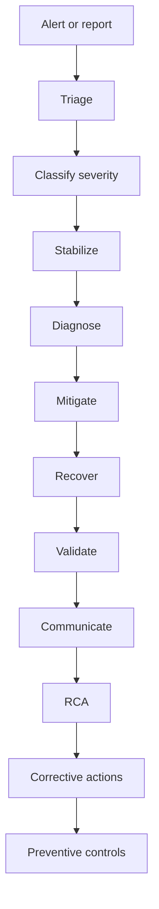

# Part 048 — Production Runbook and Incident Response

## 1. Why this part matters

A production database incident is not just a technical event.

It is a coordination problem involving:

- customer impact;
- data correctness;
- service availability;
- operational authority;
- auditability;
- communication;
- rollback/failover risk;
- legal/privacy implications;
- downstream event consistency;
- long-term prevention.

A senior backend engineer must be useful during an incident without making unsafe assumptions.

Useful means:

- classify severity accurately;
- gather evidence without increasing blast radius;
- communicate clearly;
- identify safe mitigation options;
- know when to escalate;
- understand RPO/RTO implications;
- avoid data repair mistakes;
- preserve evidence;
- convert incident learning into engineering change.

The dangerous mindset is:

```text
I know SQL, so I can fix production directly.
```

The safer mindset is:

```text
I understand the system, the blast radius, the authority boundary, and the rollback path before taking action.
```

---

## 2. Incident response mental model

A PostgreSQL incident should move through phases.



Do not skip straight from alert to fix.

The incident leader needs a clear picture of:

- what is broken;
- who is impacted;
- whether data is at risk;
- whether the problem is ongoing;
- whether mitigation can make it worse;
- what authority is required;
- what evidence must be preserved.

---

## 3. Incident roles

Actual role names vary by team. Verify internally.

Typical roles:

| Role | Responsibility |
|---|---|
| Incident commander | Coordinates response, decisions, communication cadence |
| Database owner/DBA | Database-level diagnosis and privileged operations |
| Service owner/backend engineer | Application behavior, recent deployments, SQL/query ownership |
| SRE/platform engineer | Infrastructure, Kubernetes, cloud, observability, failover mechanics |
| Product/customer representative | Customer impact, priority, external communication |
| Security/privacy representative | PII, audit, regulatory/compliance implications |
| Scribe | Timeline, decisions, commands, evidence, follow-up actions |

A senior backend engineer is often most valuable as service owner or database-aware investigator, not necessarily as incident commander.

---

## 4. Severity classification

Severity must include both availability and data correctness.

| Severity | Example condition | Database-specific concern |
|---|---|---|
| SEV-1 | Major customer-facing outage, data loss risk, database unavailable | failover/restore/RPO/RTO decision may be needed |
| SEV-2 | Significant degraded service, major workflow blocked | query/lock/pool/replication/migration issue causing broad impact |
| SEV-3 | Limited customer impact or internal job failure | backfill/reporting/CDC lag with controlled blast radius |
| SEV-4 | No immediate impact, warning condition | bloat trend, slow query trend, replica lag below threshold |

Do not classify based only on CPU or latency.

A silent data corruption issue can be more severe than a visible latency spike.

---

## 5. Customer impact framing

When PostgreSQL is involved, customer impact should be described in workflow language, not only database language.

Bad:

```text
Database has blocking locks.
```

Better:

```text
Quote submission requests are timing out because transactions updating quote status are blocked by a long-running migration transaction.
```

Bad:

```text
Replica lag is 12 minutes.
```

Better:

```text
Read-after-write flows that read from replica may show stale quote/order state for up to 12 minutes. Writes to primary are still succeeding.
```

Bad:

```text
Outbox has backlog.
```

Better:

```text
Order events are committed in PostgreSQL but delayed before reaching Kafka consumers, so downstream fulfillment/read models may be stale.
```

---

## 6. RPO and RTO during database incidents

### 6.1 Definitions

RPO is the maximum acceptable data loss window.

RTO is the maximum acceptable recovery time.

In PostgreSQL incidents, these matter for:

- failover;
- PITR restore;
- data repair;
- backup selection;
- replica promotion;
- logical replication recovery;
- corrupted data rollback;
- disaster recovery declaration.

### 6.2 Practical interpretation

If primary database is down:

- RTO asks: how quickly must service return?
- RPO asks: how much committed data can be lost?

If bad data was written:

- RTO asks: how quickly must workflows be safe again?
- RPO-like reasoning asks: can we restore to a point before corruption, and what later valid writes would be lost?

If CDC is delayed:

- RTO asks: how quickly must downstream systems catch up?
- RPO asks: are events lost, duplicated, or only delayed?

### 6.3 Senior engineer caution

Failover can restore availability but create consistency problems.

PITR can remove bad data but also removes valid writes after recovery target.

Data repair can preserve valid writes but is harder to prove correct.

No option is free.

---

## 7. Alert triage runbook

### 7.1 Initial triage checklist

On alert:

1. Identify alert source.
2. Confirm whether it is real user impact.
3. Identify affected environment.
4. Identify affected service/database/cluster.
5. Check recent deployments/migrations/config changes.
6. Check whether writes are failing.
7. Check whether reads are stale or failing.
8. Check connection pool metrics.
9. Check active queries/waits.
10. Check locks/blockers.
11. Check disk/WAL/replication lag.
12. Check cloud/Kubernetes events.
13. Escalate to DBA/SRE if privileged action may be needed.

### 7.2 First communication

A good first update states:

- what is known;
- what is unknown;
- customer impact;
- current mitigation;
- next evidence being gathered;
- next update time/cadence if incident process requires it.

Example:

```text
We are investigating elevated latency on quote submission. Initial traces show requests are waiting on database calls. No confirmed data loss. We are checking database locks, connection pool saturation, and recent migration activity. Next update after blocker analysis.
```

---

## 8. Stabilization before root cause

Stabilization reduces harm while diagnosis continues.

Possible stabilizers:

- pause rollout;
- pause migration;
- disable non-critical batch jobs;
- reduce worker concurrency;
- disable expensive report path;
- route critical reads to primary if replica lag is high;
- apply feature flag;
- reduce application replicas if they are overloading DB;
- stop retry storm;
- temporarily increase storage if disk pressure;
- create customer-facing workaround;
- stop writer that is corrupting data.

Stabilization is not the same as root-cause fix.

Always mark temporary mitigations with owner and expiry.

---

## 9. Emergency query cancellation and termination

### 9.1 Cancel vs terminate

`pg_cancel_backend(pid)` asks PostgreSQL to cancel the current query.

`pg_terminate_backend(pid)` terminates the session.

Terminate is more disruptive because it aborts the session and transaction.

### 9.2 Decision checklist before cancellation

Before canceling a query, ask:

- Is this query blocking critical production traffic?
- Is it a migration, backfill, reporting job, or user transaction?
- Is it safe to rollback?
- Will rollback itself take time or generate load?
- Could cancellation leave a migration tool in failed/locked state?
- Who owns the session?
- Is there an approved runbook?

### 9.3 Find candidate blockers

```sql
select
  blocked.pid as blocked_pid,
  blocked.application_name as blocked_app,
  now() - blocked.query_start as blocked_age,
  left(blocked.query, 500) as blocked_query,
  blocker.pid as blocker_pid,
  blocker.application_name as blocker_app,
  blocker.state as blocker_state,
  now() - blocker.xact_start as blocker_xact_age,
  left(blocker.query, 500) as blocker_query
from pg_stat_activity blocked
join lateral unnest(pg_blocking_pids(blocked.pid)) b(blocker_pid) on true
join pg_stat_activity blocker on blocker.pid = b.blocker_pid
order by blocker.xact_start nulls last;
```

### 9.4 Cancel command

```sql
select pg_cancel_backend(<pid>);
```

### 9.5 Terminate command

```sql
select pg_terminate_backend(<pid>);
```

Use termination only with proper approval.

### 9.6 Post-action validation

After cancellation/termination:

- did blocked queries resume?
- did rollback create IO/WAL spike?
- did application recover?
- did migration tool fail?
- did data remain consistent?
- did the same blocker reappear?

---

## 10. Emergency index creation

### 10.1 When it may be justified

Emergency index creation may be considered when:

- one missing index causes severe production impact;
- query shape is stable and well understood;
- table size/write rate are known;
- index can be created without unacceptable locking;
- write overhead is acceptable;
- rollback/removal plan exists;
- DBA/SRE approves;
- migration path can reconcile manual change into source control.

### 10.2 Why it is risky

Index creation can:

- consume CPU/IO;
- generate WAL;
- increase replication lag;
- block or interact with DDL;
- fail and leave invalid index;
- slow writes permanently;
- diverge production schema from migration repository;
- conflict with later migration.

### 10.3 Preferred pattern for large table

Where appropriate and supported by runbook:

```sql
create index concurrently idx_example_lookup
on example_table (tenant_id, status, created_at desc);
```

Caveats:

- cannot run inside a normal transaction block;
- takes longer than normal index creation;
- may fail under concurrent changes;
- may leave invalid index requiring cleanup;
- still consumes resources;
- should be added back to migration repository afterward.

### 10.4 Emergency index checklist

Before:

- capture current plan;
- capture query frequency/latency;
- estimate table/index size;
- check existing similar indexes;
- check write rate;
- check replication lag capacity;
- choose name consistent with convention;
- document owner and rollback.

After:

- check index validity;
- check query plan uses it;
- check write latency;
- check replication lag;
- check disk usage;
- add formal migration or reconcile schema drift;
- create follow-up to remove if ineffective.

---

## 11. Emergency rollback

### 11.1 Types of rollback

Rollback can mean:

- application rollback;
- feature flag rollback;
- database migration rollback;
- data rollback;
- configuration rollback;
- failback after failover;
- CDC connector rollback;
- read model rebuild.

These are not interchangeable.

### 11.2 Application rollback with database changes

Application rollback is safe only if the database remains compatible with the old application version.

This is why expand-contract migration exists.

Dangerous sequence:

```text
Deploy app requiring new NOT NULL column
Migration changes schema incompatibly
App fails
Rollback app
Old app also fails because schema changed
```

### 11.3 Database rollback

Database rollback is often harder than application rollback.

DDL may be transactional in PostgreSQL, but production migrations may include:

- concurrent index creation;
- data backfill;
- external side effects;
- function/procedure changes;
- view dependency changes;
- CDC schema changes;
- application already writing new data shape.

### 11.4 Roll-forward preference

In many production cases, a corrective roll-forward migration is safer than rollback.

Example:

- add missing nullable column;
- restore view compatibility;
- add compatibility function wrapper;
- relax constraint temporarily;
- add index concurrently;
- fix bad default;
- stop using new column through feature flag.

### 11.5 Rollback checklist

Ask:

- What exactly is being rolled back?
- Is old app compatible with current schema?
- Has new data been written?
- Are downstream events emitted?
- Are caches/read models affected?
- Are migrations reversible?
- Is rollback tested?
- What validation proves success?
- What is the data loss/corruption risk?

---

## 12. Emergency failover

### 12.1 What failover solves

Failover can help with:

- primary node failure;
- storage failure;
- network isolation;
- unrecoverable primary health issue;
- planned switchover;
- managed DB availability event.

Failover does not automatically solve:

- bad query;
- bad migration;
- data corruption;
- application retry storm;
- schema incompatibility;
- logical data bug;
- long-running workload that will resume on new primary.

### 12.2 Failover risks

Failover can introduce:

- brief unavailability;
- connection reset;
- transaction abort;
- replica promotion with lag;
- possible data loss if async replica;
- DNS/cache delay;
- application pool reconnection storm;
- CDC connector repositioning issue;
- timeline changes for backup/PITR;
- split-brain risk in self-managed HA if automation is wrong.

### 12.3 Pre-failover checklist

- Is primary truly unhealthy?
- Is the replica current enough for RPO?
- What is replication lag?
- Are writes still reaching primary?
- Are clients able to reconnect?
- Is application prepared for connection reset?
- What happens to CDC/logical slots?
- Who has authority to failover?
- Is this managed cloud or self-managed?
- Is there a failback plan?

### 12.4 Post-failover validation

- Can Java services connect?
- Are writes succeeding?
- Are read replicas following new primary?
- Did pool recover or storm?
- Are migrations disabled during stabilization?
- Is CDC running?
- Is replication topology healthy?
- Is backup/PITR still valid?
- Are customer workflows consistent?

---

## 13. Bad migration response

### 13.1 Recognize bad migration quickly

Signals:

- migration job stuck;
- application startup blocked;
- lock waits spike;
- DDL blocked by long transaction;
- migration tool lock table stuck;
- old and new app versions incompatible;
- query plan regressed after migration;
- function/view changed unexpectedly;
- invalid index left behind;
- constraint validation failed;
- CDC connector broke due to schema change.

### 13.2 Immediate actions

- stop further rollout;
- stop repeated migration attempts;
- identify exact migration version;
- identify partial state;
- identify locks;
- notify DBA/SRE/service owner;
- decide rollback vs roll-forward;
- preserve logs and SQL error;
- communicate compatibility risk.

### 13.3 Migration lock table caution

Liquibase/Flyway/custom tools may use metadata tables to track execution.

Do not manually edit migration metadata unless:

- tool-specific runbook allows it;
- exact partial state is known;
- corrective migration plan exists;
- changes are reviewed;
- audit trail is preserved.

### 13.4 Corrective patterns

- release lock after confirming no migration process is running;
- add missing object if migration partially applied;
- mark failed migration only according to tool procedure;
- deploy compatibility migration;
- split large migration into smaller steps;
- move data migration out of startup path;
- rebuild invalid index;
- add missing grants;
- restore function/view signature compatibility.

---

## 14. Data repair runbook

### 14.1 When data repair is needed

Data repair may be needed after:

- application bug wrote invalid state;
- migration backfill wrote wrong values;
- duplicate event processing;
- missing event processing;
- manual operational mistake;
- integration imported wrong data;
- timezone bug;
- pricing/catalog snapshot bug;
- soft delete visibility bug;
- failed saga/compensation.

### 14.2 Data repair is production code

Treat data repair as code with review and validation.

A repair script must have:

- business explanation;
- affected population query;
- before snapshot strategy;
- deterministic update logic;
- row count expectation;
- validation query;
- rollback or roll-forward plan;
- impact on outbox/CDC/read models;
- audit trail;
- owner approval;
- scheduled execution plan.

### 14.3 Repair design process

1. Stop ongoing corruption.
2. Define correct state.
3. Identify affected records.
4. Preserve before state.
5. Test repair on copy/staging when possible.
6. Review with domain owner.
7. Review with DBA/SRE if production execution.
8. Execute in controlled transaction/chunks.
9. Validate after each chunk.
10. Reconcile downstream systems.
11. Document RCA and prevention.

### 14.4 Repair SQL skeleton

```sql
begin;

-- 1. Capture affected IDs.
create temporary table repair_scope as
select id
from target_table
where ...;

-- 2. Validate scope.
select count(*) from repair_scope;

-- 3. Optional: persist before image into approved repair audit table.
-- insert into repair_audit (...)
-- select ... from target_table join repair_scope using (id);

-- 4. Apply deterministic fix.
update target_table t
set corrected_column = ..., updated_at = now()
from repair_scope s
where t.id = s.id;

-- 5. Validate after update before commit.
select ...;

commit;
```

This is a shape, not a ready-to-run script.

### 14.5 CDC/outbox implications

Repair may emit events or may bypass event generation depending on architecture.

Verify:

- should repair create outbox events?
- should downstream read model be rebuilt?
- should CDC consumers ignore repair transaction?
- should audit show repair actor?
- is replay needed?
- can duplicated event be handled?

### 14.6 Privacy implications

If repair involves PII:

- avoid exporting raw data unnecessarily;
- redact logs;
- restrict access;
- document approval;
- preserve compliance evidence;
- follow retention/deletion policy.

---

## 15. Communication runbook

### 15.1 Internal technical updates

Good incident updates are factual and scoped.

Template:

```text
Status: Investigating / Mitigating / Recovering / Monitoring
Impact: <workflow/customer/system impact>
Current evidence: <facts only>
Suspected cause: <clearly marked if not confirmed>
Action taken: <changes made>
Next action: <what is being checked or done>
Risk: <data loss/staleness/rollback/failover risk>
Next update: <cadence if required>
```

### 15.2 Avoid misleading statements

Avoid:

```text
Database is down.
```

Unless the database is truly unavailable.

Prefer:

```text
Application requests are timing out while waiting for database connections. PostgreSQL is accepting connections, but the application pool is saturated due to long-running queries.
```

Avoid:

```text
No data issue.
```

Unless validated.

Prefer:

```text
No confirmed data loss at this time. We are validating whether delayed outbox events affected downstream read models.
```

### 15.3 Customer-facing translation

Technical facts must be translated to business impact.

Example:

```text
Some quote submission operations experienced delays between 10:04 and 10:22 UTC. Submitted quotes were stored, but downstream order-processing events were delayed. We are validating affected records and will provide a final update after reconciliation.
```

Actual customer communication must follow company policy.

---

## 16. Evidence preservation

During incidents, preserve:

- alert timestamps;
- deployment timestamps;
- migration version;
- database logs;
- application logs;
- traces;
- query plans;
- blocker/blocked query samples;
- connection pool metrics;
- cloud/Kubernetes events;
- commands executed;
- person approving privileged action;
- before/after validation query result;
- data repair script;
- rollback/failover decision record.

This evidence is required for RCA and defensibility.

Do not rely on memory.

---

## 17. RCA structure

A good RCA is not blame.

It explains how the system allowed the incident.

### 17.1 RCA sections

Use:

1. Summary.
2. Customer impact.
3. Timeline.
4. Detection.
5. Technical cause.
6. Contributing factors.
7. What worked well.
8. What did not work well.
9. Corrective actions.
10. Preventive actions.
11. Owners and deadlines.
12. Evidence links.

### 17.2 Technical cause examples

Weak:

```text
Developer wrote slow query.
```

Better:

```text
A new MyBatis dynamic query allowed requests without status and date predicates. In production data volume, the generated SQL scanned the full order history table. The PR did not include EXPLAIN on realistic data, and slow query alert threshold detected the issue only after customer-facing latency increased.
```

Weak:

```text
Migration caused outage.
```

Better:

```text
A migration added a NOT NULL column with default to a large table during peak traffic, causing table rewrite and lock contention. The migration review checklist did not require large-table lock analysis, and CI validated syntax but not production lock behavior.
```

### 17.3 Root cause vs trigger

The trigger may be a deployment.

The root cause may be missing guardrails.

Examples:

| Trigger | Deeper cause |
|---|---|
| New query deployed | No realistic EXPLAIN review |
| Migration ran | No lock timeout or expand-contract discipline |
| CDC connector stopped | No replication slot WAL retention alert |
| Pool exhausted | Pool sizing ignored Kubernetes replica multiplier |
| Bad data written | Missing database constraint and missing domain invariant test |
| Replica stale | Read routing did not distinguish correctness-sensitive reads |

---

## 18. Corrective and preventive actions

### 18.1 Corrective action

A corrective action fixes the immediate known defect.

Examples:

- add missing index;
- fix query predicate;
- patch mapper dynamic SQL;
- repair data;
- restore CDC connector;
- tune autovacuum for hot table;
- reduce pool size;
- add retry for serialization failure;
- fix migration script.

### 18.2 Preventive action

A preventive action makes recurrence less likely.

Examples:

- add PR checklist item;
- add EXPLAIN requirement for risky queries;
- add migration lock timeout standard;
- add dashboard/alert;
- add integration test for concurrency;
- add idempotency key requirement;
- add schema constraint;
- add runbook;
- add static check for MyBatis `${}` usage;
- add CDC lag/WAL retention alert;
- add restore drill schedule;
- add load test scenario.

### 18.3 Strong action criteria

A strong action is:

- specific;
- owned;
- time-bound;
- verifiable;
- tied to root cause;
- not dependent on memory or heroics.

Weak:

```text
Be more careful with migrations.
```

Strong:

```text
Add migration PR checklist requiring lock-impact classification, expected duration, rollback/roll-forward plan, and DBA approval for ALTER TABLE on tables above 10M rows. Owner: database platform. Due: 2026-08-01.
```

Use internal thresholds, not invented numbers, in real action items.

---

## 19. Incident-specific runbooks

## 19.1 Slow query incident

### Detection

- API latency alert;
- slow query log;
- pg_stat_statements regression;
- customer report;
- job duration alert.

### Triage

- identify query fingerprint;
- map query to service/mapper/endpoint;
- check plan;
- check lock wait;
- check recent deployment;
- check data volume change;
- check index/statistics.

### Mitigation

- disable expensive feature path;
- reduce job concurrency;
- add index if approved;
- run ANALYZE if stats stale;
- deploy query fix;
- route report workload away from primary.

### Recovery validation

- query latency normal;
- endpoint latency normal;
- DB CPU/IO normal;
- no replication lag spike;
- error rate normal.

---

## 19.2 Blocking lock incident

### Detection

- lock wait alert;
- rising active sessions;
- migration stuck;
- API timeouts.

### Triage

- identify blocker;
- identify blocked queries;
- identify blocker owner;
- determine transaction age;
- determine whether blocker is safe to cancel.

### Mitigation

- cancel/terminate approved blocker;
- pause migration/job;
- reduce traffic;
- fix long transaction;
- add lock timeout for future.

### Recovery validation

- blocked sessions drain;
- request latency improves;
- migration state known;
- no data inconsistency.

---

## 19.3 Connection exhaustion incident

### Detection

- HikariCP timeout;
- database `too many clients`;
- API 5xx;
- high pending connection metric.

### Triage

- app pool active/idle/pending;
- PostgreSQL connection count by app;
- long-running queries;
- connection leaks;
- replica/pool/proxy state;
- recent scale-out.

### Mitigation

- reduce concurrency/replicas;
- stop heavy jobs;
- fix slow queries/blockers;
- restart leaking pods only if necessary;
- adjust pool cautiously;
- add proxy/backpressure if architecture supports.

### Recovery validation

- pending connections normal;
- DB connections below budget;
- latency/error rate normal;
- no reconnect storm.

---

## 19.4 Disk/WAL incident

### Detection

- free storage alert;
- WAL volume growth;
- replication slot lag;
- archive failure;
- CDC lag.

### Triage

- check largest tables/indexes;
- check WAL retained by slots;
- check archiver status;
- check temp files;
- check recent bulk writes/index creation;
- check backup job.

### Mitigation

- expand storage;
- restore connector/archiving;
- stop WAL-heavy job;
- detach/drop old partitions if approved;
- never delete PostgreSQL internal files manually;
- escalate to DBA/platform.

### Recovery validation

- free storage stable;
- WAL retention decreasing;
- CDC/replication catching up;
- no write failures;
- alerts cleared.

---

## 19.5 Failed migration incident

### Detection

- deployment failed;
- migration job failed/stuck;
- app startup blocked;
- schema mismatch;
- lock waits.

### Triage

- migration version;
- failed SQL;
- partial state;
- migration tool metadata;
- lock state;
- app compatibility;
- rollback/roll-forward options.

### Mitigation

- pause rollout;
- prevent repeated execution;
- roll forward with corrective migration;
- rollback app only if schema compatible;
- release migration lock only per tool runbook;
- repair invalid index/object if needed.

### Recovery validation

- migration metadata consistent;
- app starts;
- schema expected;
- queries pass;
- no lock remains;
- source control reconciled.

---

## 19.6 Data corruption incident

### Detection

- domain invariant violation;
- customer report;
- reconciliation failure;
- downstream mismatch;
- audit discrepancy;
- unexpected duplicate/missing row.

### Triage

- stop ongoing writes if needed;
- identify affected population;
- identify time window;
- identify source change;
- check downstream events/read models;
- check privacy impact.

### Mitigation

- feature flag off bad write path;
- deploy fix;
- design reviewed repair;
- execute repair in chunks;
- reconcile downstream;
- communicate impact.

### Recovery validation

- affected records corrected;
- invariants pass;
- downstream read models consistent;
- audit evidence preserved;
- no new corruption.

---

## 20. PostgreSQL runbook document template

Every production PostgreSQL-backed service should have a runbook.

Template:

```md
# <Service Name> Database Runbook

## Ownership
- Service owner:
- Database owner:
- DBA/SRE escalation:
- Product contact:

## Architecture
- Primary database:
- Replica usage:
- Migration tool:
- Connection pool:
- PgBouncer/RDS Proxy/etc:
- CDC/outbox:
- Backup/PITR:

## Critical workflows
- Workflow 1:
- Workflow 2:
- Workflow 3:

## Dashboards
- Application latency:
- Connection pool:
- PostgreSQL metrics:
- Slow query:
- Locks:
- Replication/CDC:
- Disk/WAL:

## Common incidents
- Slow query:
- Blocking lock:
- Connection exhaustion:
- Failed migration:
- CDC lag:
- Data repair:

## Emergency actions
- Who can cancel query:
- Who can terminate session:
- Who can run migration repair:
- Who can failover:
- Who can restore backup:

## Validation queries
- Health check:
- Lock check:
- Long transaction check:
- Outbox check:
- Data correctness check:

## Rollback and recovery
- Application rollback:
- Migration rollback/roll-forward:
- Data repair:
- Restore/PITR:

## Evidence and RCA
- Log locations:
- Trace locations:
- Incident template:
- RCA template:
```

---

## 21. Internal verification checklist

Verify in the actual CSG/team environment.

### Ownership and authority

- Who owns each PostgreSQL database/schema?
- Who can approve emergency query cancellation?
- Who can approve session termination?
- Who can approve emergency index creation?
- Who can approve failover?
- Who can approve PITR restore?
- Who can approve data repair?

### Severity and communication

- What severity model is used?
- What is the incident channel/process?
- What is the update cadence?
- Who handles customer-facing communication?
- What wording is allowed for data correctness/privacy impact?

### Observability

- Where are PostgreSQL logs stored?
- Is slow query logging enabled?
- Is deadlock logging searchable?
- Are lock waits logged?
- Are application traces correlated to SQL query IDs?
- Is `application_name` set per service/pod/job?

### Runbooks

- Is there a database runbook per service?
- Is there a failed migration runbook?
- Is there a data repair runbook?
- Is there a failover runbook?
- Is there a restore/PITR runbook?
- Is there a CDC replay/recovery runbook?

### Java/JAX-RS service

- What timeout hierarchy exists: HTTP, service client, transaction, statement, pool?
- Are database exceptions mapped by SQLState?
- Are retries bounded and idempotent?
- Are long transactions traced?
- Are connection pool metrics visible?

### MyBatis

- Can generated SQL be captured safely?
- Are mapper IDs included in logs/traces?
- Are dynamic SQL fragments reviewed for injection risk?
- Are batch operations chunked?
- Are function/procedure calls observable?

### Migration

- Is migration execution part of app startup, CI/CD job, or GitOps job?
- Is migration singleton guaranteed?
- Are lock/statement timeouts configured?
- Is expand-contract required?
- Is schema drift detection available?

### Data repair

- Is there an approved repair script process?
- Are before-images required?
- Are row count assertions required?
- Are repair actions audited?
- Are downstream events/read models reconciled?

### Backup/restore/DR

- What are RPO/RTO targets?
- When was the last restore drill?
- Who can initiate PITR?
- How is PITR target time selected?
- How is restored environment validated?

### CDC/Kafka

- Which services use outbox or CDC?
- Which replication slots exist?
- What happens if connector is down?
- How is replay performed?
- How are duplicate events handled?

---

## 22. PR review checklist for incident readiness

For changes that touch PostgreSQL, ask:

### Detection

- How will we know this change is failing?
- Is there a metric/log/trace for it?
- Is the alert threshold defined?

### Mitigation

- Can we disable it with feature flag?
- Can we reduce concurrency?
- Can we rollback app safely?
- Can we roll forward database safely?

### Recovery

- What state may be partially written?
- Is operation idempotent?
- Is data repair possible?
- Are downstream events affected?

### Authority

- Does this require DBA/SRE approval?
- Does this require customer communication if it fails?
- Does this touch PII/compliance data?

### Evidence

- Does it produce enough evidence for RCA?
- Are query/migration/job IDs traceable?
- Are row counts and business IDs logged safely?

---

## 23. Senior engineer incident heuristics

### 23.1 Stabilize before optimizing

During incident, the first goal is to reduce harm, not to produce the perfect fix.

### 23.2 Separate availability from correctness

A system can be available while writing wrong data.

A system can be unavailable but data-safe.

Treat these separately.

### 23.3 Rollback is not always safer

Rollback can fail if schema/data has moved forward.

Think compatibility before rollback.

### 23.4 Failover is not a query tuning tool

Failover helps infrastructure failure.

It does not fix bad workload design.

### 23.5 Data repair needs more discipline than feature code

Feature bugs are often reversible by deploy.

Bad data can persist indefinitely.

### 23.6 The person with permission is not always the person with context

Emergency action should combine operational authority and domain understanding.

### 23.7 Every manual production action creates future work

Reconcile schema drift, migration drift, data drift, and runbook gaps.

### 23.8 A good RCA removes dependence on heroics

The next incident should be easier because the system improved.

---

## 24. Final production incident checklist

During PostgreSQL incident:

- [ ] Confirm impact.
- [ ] Classify severity.
- [ ] Identify database/service/environment.
- [ ] Check recent deploy/migration/config change.
- [ ] Check connection pool.
- [ ] Check active sessions.
- [ ] Check blockers/locks.
- [ ] Check long transactions.
- [ ] Check disk/WAL.
- [ ] Check replication/CDC.
- [ ] Escalate to DBA/SRE if privileged action may be needed.
- [ ] Stabilize system.
- [ ] Communicate known facts.
- [ ] Choose mitigation with lowest blast radius.
- [ ] Preserve evidence.
- [ ] Validate recovery.
- [ ] Reconcile downstream/read models if needed.
- [ ] Complete RCA.
- [ ] Create corrective and preventive actions.
- [ ] Update runbook/checklist/alerts/tests.

---

## 25. References

- PostgreSQL Documentation — Monitoring Database Activity: https://www.postgresql.org/docs/current/monitoring.html
- PostgreSQL Documentation — `pg_stat_activity` and cumulative statistics: https://www.postgresql.org/docs/current/monitoring-stats.html
- PostgreSQL Documentation — `pg_locks`: https://www.postgresql.org/docs/current/view-pg-locks.html
- PostgreSQL Documentation — Error Reporting and Logging: https://www.postgresql.org/docs/current/runtime-config-logging.html
- PostgreSQL Documentation — Client Connection Defaults and Timeouts: https://www.postgresql.org/docs/current/runtime-config-client.html
- PostgreSQL Documentation — Continuous Archiving and PITR: https://www.postgresql.org/docs/current/continuous-archiving.html
- PostgreSQL Documentation — High Availability, Load Balancing, and Replication: https://www.postgresql.org/docs/current/high-availability.html
- PostgreSQL Documentation — `CREATE INDEX`: https://www.postgresql.org/docs/current/sql-createindex.html

---

## 26. Closing thought

Incident response is where database knowledge becomes engineering judgment.

You are not only asking:

```text
What SQL should I run?
```

You are asking:

```text
What action restores safety with the least irreversible risk?
```

That is the difference between debugging a database and operating a production data system.
