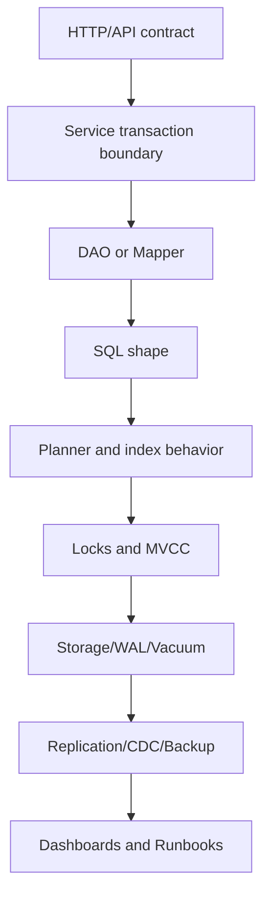

# Part 049 — PR Review and Architecture Decision Checklist

## 1. Why this part matters

Most database incidents are not caused by PostgreSQL being mysterious.

They are caused by ordinary changes that passed review without enough database reasoning:

- a nullable column that should have been constrained;
- a unique rule enforced only in Java;
- a migration that blocks a large table;
- an index that helps one query and hurts every write;
- a mapper that introduces an accidental full table scan;
- a transaction that holds locks across slow external calls;
- a backfill that cannot resume safely;
- a trigger that creates hidden side effects;
- a missing dashboard or rollback plan.

A senior backend engineer should not review database changes as syntax.

A senior backend engineer reviews database changes as **production behavior**.

The review question is not:

```text
Does this SQL run?
```

The real question is:

```text
Will this change preserve correctness, performance, operability, and recovery paths as data size, traffic, deployment topology, and team ownership evolve?
```

This part is a practical checklist for reviewing PostgreSQL-related pull requests and architecture decisions in enterprise Java/JAX-RS systems using JDBC, MyBatis, migration tooling, Kubernetes, cloud-managed PostgreSQL, on-prem PostgreSQL, Kafka, and CDC.

---

## 2. Review mental model

A database-related PR usually changes more than one layer.



A review is weak if it only checks the file being edited.

A review is strong if it checks the **cross-layer consequences**.

For example:

- a new endpoint may require an idempotency key table;
- a new unique index may block writes during migration;
- a new query may need a composite index;
- a new JSONB field may need schema governance;
- a new status column may need state transition history;
- a new MyBatis mapper may need safe dynamic SQL binding;
- a new outbox event may need replay and duplicate handling;
- a new PII column may require masking and retention rules.

---

## 3. Review categories

Use the following categories for every meaningful database PR.

| Category | Main risk | Review target |
|---|---|---|
| Schema | incorrect or unstable data model | tables, columns, names, types |
| Constraints | invalid data accepted | PK, FK, unique, check, not null |
| Indexes | slow read or expensive write | access path, selectivity, bloat |
| Queries | wrong result or bad plan | SQL shape, joins, pagination |
| Transactions | inconsistent state | boundary, isolation, retry |
| Locking | blocking/deadlock | row/table locks, order, timeout |
| Migration | deployment incident | DDL safety, compatibility, rollback |
| Backfill | production overload | chunking, resume, validation |
| MyBatis | hidden SQL risk | dynamic SQL, mapping, binding |
| Database-side logic | invisible behavior | function, procedure, trigger |
| Security/privacy | data exposure | role, privilege, PII, logs |
| Observability | un-debuggable failure | metrics, logs, traces, dashboards |
| Operations | unsafe rollout | runbook, failover, backup, rollback |

---

## 4. Schema review checklist

Schema is not storage decoration.

Schema is the durable contract for data correctness.

Ask:

- Is the table owned by the service making the change?
- Is the table name domain-oriented rather than implementation-oriented?
- Does the model separate transaction tables, reference tables, audit/history tables, and read models?
- Are column names stable enough to survive business terminology drift?
- Are types chosen for correctness, not convenience?
- Is `text` being used where a constrained enum/domain/reference table would be better?
- Is `numeric` used where money/price precision matters?
- Is `timestamptz` used consistently for real-world instants?
- Is `timestamp without time zone` used only with an explicit reason?
- Are lifecycle timestamps clearly named?
- Is soft delete justified, or is it hiding lifecycle complexity?
- Does the table need tenant/account/customer scoping?
- Does the table need auditability or history?
- Does the schema support future migration without destructive rewrite?

Bad smell:

```sql
CREATE TABLE quote_data (
  id uuid PRIMARY KEY,
  data jsonb NOT NULL,
  status text,
  updated_at timestamp
);
```

This may be acceptable for a narrow cache/read model, but suspicious for a system-of-record table because:

- `status` is unconstrained;
- `updated_at` has unclear timezone semantics;
- important domain fields may be hidden inside JSONB;
- unique business rules cannot be enforced easily;
- reporting and migration become harder.

A stronger model usually exposes stable invariants:

```sql
CREATE TABLE quote (
  quote_id uuid PRIMARY KEY,
  account_id uuid NOT NULL,
  quote_number text NOT NULL,
  status text NOT NULL,
  version integer NOT NULL DEFAULT 0,
  created_at timestamptz NOT NULL DEFAULT now(),
  updated_at timestamptz NOT NULL DEFAULT now(),
  CONSTRAINT uq_quote_number UNIQUE (quote_number),
  CONSTRAINT ck_quote_status CHECK (status IN ('DRAFT', 'SUBMITTED', 'APPROVED', 'REJECTED', 'EXPIRED'))
);
```

The point is not that this exact schema should exist.

The point is that important invariants should be visible and enforceable.

### Internal verification checklist

Check in the actual codebase/team:

- schema naming convention;
- table ownership convention;
- primary key standard;
- UUID vs identity/sequence policy;
- timestamp policy;
- tenant/customer/account isolation strategy;
- audit/history requirements;
- allowed use of JSONB for system-of-record data;
- DBA/platform approval requirement for schema changes.

---

## 5. Constraint review checklist

Application validation is not enough.

If an invariant must always be true, prefer enforcing it in the database when practical.

Review:

- primary key exists;
- natural key or business key has unique constraint;
- foreign key is used when ownership boundary allows it;
- `NOT NULL` is used for mandatory fields;
- `CHECK` constraint captures finite state/value rules;
- default value is safe and explicit;
- unique constraint handles concurrency race;
- optional fields are truly optional;
- nullable fields have lifecycle explanation;
- constraint naming is clear;
- adding constraint to existing large table is migration-safe;
- constraint validation strategy is safe for production.

Dangerous pattern:

```java
if (repository.existsByQuoteNumber(quoteNumber)) {
    throw new DuplicateQuoteException();
}
repository.insertQuote(quoteNumber);
```

This is race-prone without a unique constraint.

Correctness boundary should be:

```sql
ALTER TABLE quote
ADD CONSTRAINT uq_quote_quote_number UNIQUE (quote_number);
```

Then Java maps unique violation to a domain response.

### Review questions

- What invalid state can enter if two requests run concurrently?
- What invariant is only checked in Java?
- Is a database constraint feasible?
- If not feasible, what compensating control exists?
- How is constraint violation mapped to HTTP/API error?
- How is constraint added to an existing table safely?

---

## 6. Index review checklist

Indexes are not free.

They improve selected reads while adding cost to writes, storage, vacuum, replication, backup, and migrations.

Review:

- Which exact query is the index for?
- Is the query already in code?
- Is the index aligned with `WHERE`, `JOIN`, `ORDER BY`, and pagination?
- Is the leading column selective enough?
- Does column order match the access pattern?
- Would a partial index be better?
- Would an expression index be safer than indexing the whole JSONB column?
- Does the index support index-only scan via `INCLUDE`?
- Is the index redundant with an existing index?
- Is the table write-heavy?
- Could the index become bloated?
- Is index creation safe on production volume?
- Does the migration use concurrent index creation when needed?
- Will the index exist on partitions if the table is partitioned?

Bad review comment:

```text
Add an index because this query filters by status.
```

Better review comment:

```text
This endpoint filters by tenant_id and status, sorts by created_at desc, and uses keyset pagination. Consider an index shaped around (tenant_id, status, created_at desc, quote_id desc), or justify why the current index supports this plan. Please include EXPLAIN for representative selectivity.
```

### Index PR evidence

A PR adding or relying on an index should include:

- query text;
- expected cardinality/selectivity;
- `EXPLAIN` or `EXPLAIN ANALYZE` from representative data;
- expected read/write frequency;
- existing indexes on the table;
- migration method;
- rollback/drop plan;
- impact on write path;
- partition awareness if applicable.

---

## 7. Query review checklist

Review SQL as a contract between application intent and planner behavior.

Ask:

- Does the query return the correct rows under all lifecycle states?
- Are tenant/account/customer filters mandatory and present?
- Are joins using correct keys?
- Could a `LEFT JOIN` accidentally become an `INNER JOIN` through a `WHERE` predicate?
- Is `DISTINCT` hiding modelling or join duplication problems?
- Is `ORDER BY` deterministic?
- Is pagination stable under concurrent inserts/updates?
- Does `LIMIT/OFFSET` scale acceptably for this endpoint?
- Would keyset pagination be better?
- Is `SELECT *` avoided in production-facing mappers?
- Are large result sets streamed or bounded?
- Is there an accidental cross join?
- Is `OR` hurting index usage?
- Is the query parameterized safely?
- Does the query need `EXISTS` instead of a join?
- Does the query require a consistent snapshot?

Dangerous pagination:

```sql
SELECT *
FROM quote
WHERE account_id = #{accountId}
ORDER BY created_at DESC
LIMIT #{limit} OFFSET #{offset};
```

This may be acceptable for small lists, but unstable and expensive for deep pages.

A keyset-oriented pattern is often more stable:

```sql
SELECT quote_id, quote_number, status, created_at
FROM quote
WHERE account_id = #{accountId}
  AND (
    created_at < #{cursorCreatedAt}
    OR (created_at = #{cursorCreatedAt} AND quote_id < #{cursorQuoteId})
  )
ORDER BY created_at DESC, quote_id DESC
LIMIT #{limit};
```

### SQL readability checklist

A production SQL query should be reviewable:

- use meaningful aliases;
- avoid unnecessary nesting;
- make lifecycle filters explicit;
- isolate dynamic parts;
- document non-obvious planner choices;
- avoid cleverness unless measured;
- keep query shape aligned with indexes.

---

## 8. Transaction review checklist

Transactions define atomicity.

Review:

- What data changes must commit together?
- What can safely happen outside the transaction?
- Are external calls made inside a transaction?
- Are locks held while doing CPU-heavy or network-heavy work?
- Is the transaction boundary at service layer clear?
- Does the mapper open implicit transactions unexpectedly?
- Is autocommit behavior understood?
- Is isolation level explicit where needed?
- Are serialization failures retried safely?
- Are unique violations mapped correctly?
- Does rollback leave external side effects inconsistent?
- Does the code combine database write and Kafka publish without outbox?
- Is transaction duration observable?

Bad pattern:

```text
BEGIN
  update quote
  call external pricing service
  insert order
  publish event directly
COMMIT
```

Safer pattern:

```text
BEGIN
  validate current DB state
  update quote/order state
  insert outbox event
COMMIT

publisher sends event after commit
external integrations are retried/idempotent
```

### Transaction boundary in Java/JAX-RS

For Java/JAX-RS services:

- transaction should usually wrap a command use case, not the entire HTTP request lifecycle;
- request parsing/authentication should happen before opening transaction;
- response serialization should happen after transaction closes;
- streaming large result sets need special handling;
- read-only transaction can clarify intent;
- retry must happen at safe use-case boundary, not inside arbitrary mapper calls.

---

## 9. Locking review checklist

Locks are often invisible until production traffic overlaps.

Review:

- Which rows/tables are locked?
- In what order are locks acquired?
- Can two code paths acquire locks in opposite order?
- Is `SELECT FOR UPDATE` necessary?
- Should `NOWAIT` or `SKIP LOCKED` be used?
- Does the query lock more rows than intended?
- Is there an index supporting the locking predicate?
- Is lock timeout configured?
- Is statement timeout configured?
- What happens on deadlock?
- Is retry safe?
- Can hot rows form around aggregate counters/status rows?
- Does the API expose retry semantics to clients?

Dangerous pattern:

```sql
SELECT *
FROM job
WHERE status = 'READY'
FOR UPDATE;
```

This can lock too much.

A bounded worker queue pattern is safer:

```sql
SELECT job_id
FROM job
WHERE status = 'READY'
ORDER BY created_at
FOR UPDATE SKIP LOCKED
LIMIT 100;
```

Still review:

- supporting index;
- starvation risk;
- retry behavior;
- visibility timeout;
- worker crash recovery;
- metrics for stuck jobs.

---

## 10. Migration review checklist

Migration review is deployment review.

Review:

- Is the migration backward compatible with the currently deployed application?
- Is it compatible with the next application version?
- Does it support rolling deployment?
- Is it expand-contract safe?
- Does it touch a large table?
- Does it rewrite the table?
- Does it require long locks?
- Does it add a non-null column with default safely?
- Does it create indexes concurrently where needed?
- Does it validate constraints safely?
- Is rollback realistic?
- Is roll-forward defined?
- Is migration order deterministic?
- Does it affect replication/CDC/outbox?
- Does it affect materialized views/functions/triggers?
- Is there a runbook?

### Expand-contract example

Unsafe one-step rename:

```text
rename column old_status to status
update code immediately
```

Safer phased strategy:

```text
1. Add new column nullable.
2. Dual write old and new column.
3. Backfill new column.
4. Switch reads to new column.
5. Validate consistency.
6. Stop writing old column.
7. Drop old column in later release.
```

### Migration PR evidence

A production migration PR should usually include:

- target tables and estimated row counts;
- lock analysis;
- deployment sequence;
- compatibility matrix;
- rollback or roll-forward approach;
- validation query;
- observability during rollout;
- owner and escalation path.

---

## 11. Backfill review checklist

Backfill is application logic operating on production data at scale.

Review:

- Is the backfill online or offline?
- Is it chunked?
- Is it resumable?
- Is it idempotent?
- Does it have checkpointing?
- Does it avoid long transactions?
- Does it avoid full table locks?
- Is it throttled?
- Does it have progress metrics?
- Does it have validation query?
- Does it have reconciliation plan?
- Does it interact with CDC/outbox?
- Does it produce downstream events intentionally or accidentally?
- Can it be stopped safely?
- Can it be restarted safely?
- Is there a dry-run mode?

Bad pattern:

```sql
UPDATE quote
SET normalized_status = lower(status)
WHERE normalized_status IS NULL;
```

This may lock/update too much at once.

Safer pattern:

```sql
UPDATE quote
SET normalized_status = lower(status)
WHERE quote_id IN (
  SELECT quote_id
  FROM quote
  WHERE normalized_status IS NULL
  ORDER BY quote_id
  LIMIT 1000
);
```

Then repeat with:

- sleep/throttle;
- progress tracking;
- timeout;
- retry;
- metrics;
- validation.

---

## 12. MyBatis mapper review checklist

MyBatis gives explicit SQL control.

That is powerful and dangerous.

Review:

- Is SQL parameterized with `#{}` rather than unsafe `${}`?
- If `${}` is used, is it strictly whitelisted?
- Is dynamic `ORDER BY` safe?
- Is dynamic `WHERE` logically correct when parameters are null?
- Does `ResultMap` duplicate rows because of collection mapping?
- Is nested mapping causing N+1 queries?
- Are JSONB/enum TypeHandlers deterministic?
- Are timestamps mapped correctly?
- Are batch operations configured intentionally?
- Does mapper hide transaction boundaries?
- Are exceptions mapped at service boundary?
- Is mapper covered by integration tests against PostgreSQL?

Dangerous dynamic order:

```xml
ORDER BY ${sortColumn} ${sortDirection}
```

Safer approach:

- map API sort keys to allowed SQL fragments in Java;
- reject unknown sort keys;
- never pass raw column names from clients;
- test every supported sort path;
- ensure each sort path has index strategy if it is a hot endpoint.

---

## 13. Function, procedure, trigger, and PL/pgSQL review checklist

Database-side logic can be appropriate.

It can also become invisible business logic.

Review:

- Why does this logic belong in PostgreSQL?
- Is it closer to data integrity or business workflow?
- Is it testable?
- Is it versioned through migration tooling?
- Is it observable?
- Does it emit clear errors?
- Does it hide writes from application code?
- Does it affect CDC/outbox semantics?
- Does it use `SECURITY DEFINER`?
- Is `search_path` controlled?
- Is volatility declared correctly?
- Does the function appear in an index?
- Does trigger execution order matter?
- Are cascading trigger side effects possible?
- Does Java/MyBatis know about the side effect?

Rule of thumb:

```text
Put invariant enforcement near the data.
Be cautious about putting business process orchestration inside the database.
```

---

## 14. Security review checklist

Review database security as part of every meaningful schema/query change.

Ask:

- Which role will execute this query?
- Does the service account have least privilege?
- Does migration use a more privileged account than runtime?
- Are grants explicit?
- Are default privileges configured?
- Are functions protected from `search_path` risk?
- Is row-level security relevant?
- Are read-only users prevented from writing?
- Are secrets managed outside source code?
- Is TLS required?
- Does the query expose data across tenant/customer boundary?
- Does logging include sensitive SQL parameters?

A database PR is not secure just because the endpoint has authorization.

The database layer may still leak through:

- ad hoc reporting access;
- read replica users;
- debug logs;
- support tooling;
- CDC topics;
- backups;
- copied staging data.

---

## 15. Privacy and audit review checklist

For any new column/table/event containing sensitive data, ask:

- Is this PII or sensitive commercial/customer data?
- Is the data necessary?
- Can it be minimized?
- Does it require masking in logs/UI/support tooling?
- Is it included in CDC/Kafka events?
- Is it included in audit tables?
- Is it copied to reporting/read models?
- Is retention defined?
- Is deletion/anonymization defined?
- Is encryption/tokenization needed?
- Are backups covered by retention and access policy?
- Can access be traced?
- Is there compliance evidence?

Audit review:

- What changed?
- Who or what changed it?
- When did it change?
- Why did it change?
- What was the previous value?
- Can the audit trail be tampered with?
- Is audit data itself sensitive?

---

## 16. Performance review checklist

Performance review should be evidence-based.

Ask:

- What is expected cardinality?
- What is expected request rate?
- What is expected table growth?
- What is p95/p99 latency target?
- What query plan is expected?
- What happens when data grows 10x?
- Does the query allocate temp files?
- Does sorting happen in memory or disk?
- Does the query use index or sequential scan intentionally?
- Does the write path update many indexes?
- Does the migration produce WAL spike?
- Does the backfill affect replicas?
- Is there a load test?
- Is there a fallback plan?

Avoid review comments like:

```text
This should be fine.
```

Prefer:

```text
This plan is acceptable because representative data shows index scan on ix_quote_account_status_created_at, actual rows are close to estimates, buffers are mostly hits, and p95 remains under the target at expected concurrency. Please add a follow-up alert on query latency and temp files.
```

---

## 17. Observability review checklist

Every production-relevant database change should be debuggable.

Review:

- Is endpoint latency tagged by route/use case?
- Is SQL latency visible?
- Is mapper/query name visible?
- Are slow queries logged?
- Is `pg_stat_statements` usable?
- Are lock waits observable?
- Are connection pool metrics exposed?
- Are transaction duration metrics exposed?
- Are failed migrations visible?
- Are backfill progress metrics exposed?
- Are outbox lag and CDC lag visible?
- Are deadlocks/serialization failures counted?
- Are database errors mapped and logged safely?
- Are dashboards linked in runbook?

Debugging without observability becomes guessing.

A senior reviewer should ask for observability before production pain proves the need.

---

## 18. Rollback and roll-forward checklist

Rollback is not always possible.

Database changes are often durable and stateful.

Review:

- Can the application version be rolled back safely after migration?
- Can schema be rolled back safely?
- Is rollback destructive?
- Is roll-forward safer?
- Are old and new app versions compatible with schema?
- Does data written by new version break old version?
- Are events backward compatible?
- Are JSONB payloads backward compatible?
- Are function signatures backward compatible?
- Are views/materialized views backward compatible?
- Does backfill need reversal?
- Is there a repair script?

A good PR states:

```text
Rollback strategy: application can roll back after phase 1 because new nullable column is ignored by old code. Do not drop old column until phase 3. If phase 2 fails, stop dual-write and continue reads from old column. Roll-forward preferred after backfill begins.
```

---

## 19. Operational readiness checklist

Before approval, ask:

- Who owns the rollout?
- Who approves database execution?
- Does it require maintenance window?
- Does it require DBA/SRE review?
- Is there a dashboard?
- Is there an alert?
- Is there a runbook?
- Is there a dry run?
- Is there a staging rehearsal?
- Are production row counts known?
- Are timeouts configured?
- Is emergency stop defined?
- Is customer impact understood?
- Is communication needed?
- Is there a post-release validation query?

Production readiness is not bureaucracy.

It is how database changes avoid becoming incidents.

---

## 20. Architecture Decision Record checklist

Use an ADR when the database decision has lasting consequences.

Examples:

- choosing JSONB vs normalized tables;
- choosing outbox polling vs CDC;
- adding cross-service read model;
- introducing partitioning;
- using triggers for audit/outbox;
- choosing managed PostgreSQL vs Kubernetes PostgreSQL;
- changing primary key strategy;
- using materialized views for API read model;
- adding a major extension;
- changing migration strategy.

ADR should include:

```md
# ADR: <decision title>

## Status
Proposed | Accepted | Superseded

## Context
What problem exists? What constraints matter?

## Decision
What are we choosing?

## Alternatives considered
What else did we evaluate?

## Consequences
Correctness, performance, security, observability, operations.

## Rollout plan
How will this be introduced safely?

## Rollback/roll-forward plan
What happens if it fails?

## Internal verification
What must be checked with DBA/SRE/platform/team?
```

---

## 21. Senior engineer review questions

Use these when a PR feels superficially correct but structurally risky.

### Correctness

- What invariant does this change introduce?
- Where is that invariant enforced?
- What concurrent race can violate it?
- What happens if the same request is retried?
- What happens if the transaction commits but event publishing fails?

### Data modelling

- Is this table a system of record, read model, cache, audit table, or integration table?
- Is JSONB hiding important domain invariants?
- Is soft delete masking lifecycle requirements?
- Does this model support historical reconstruction?

### Performance

- What is the expected query plan?
- What index supports it?
- What happens at 10x rows?
- What happens at 10x tenants/accounts/customers?
- Does this hurt writes?

### Operations

- Can this migration run during business hours?
- What lock does it take?
- Can it be cancelled safely?
- What dashboard proves it is healthy?
- What is the emergency action?

### Ownership

- Which service owns this schema?
- Is another service reading it directly?
- Is this creating shared database coupling?
- Does the event/read model need versioning?

---

## 22. PR review comment patterns

Weak comments are vague.

Strong comments are specific and actionable.

### Instead of

```text
This query may be slow.
```

Write:

```text
This query filters by account_id and status but sorts by updated_at. The existing index starts with status only, which may not be selective enough per account. Please include EXPLAIN ANALYZE on representative data and consider an index aligned to (account_id, status, updated_at desc, quote_id desc) if this endpoint is hot.
```

### Instead of

```text
Need rollback.
```

Write:

```text
Please describe app/schema compatibility across rolling deployment. After this migration, can the previous app version still read/write safely? If not, split into expand-contract phases.
```

### Instead of

```text
Don't use JSONB.
```

Write:

```text
The JSONB field stores attributes used by search and reporting. Please justify why these fields should not be relational columns or a typed attribute table, and include indexing/schema-governance strategy if JSONB remains the choice.
```

---

## 23. Red flags that should block approval

Block or escalate when you see:

- destructive migration with no compatibility plan;
- large table rewrite with no lock analysis;
- new query on large table with no index/plan evidence;
- raw SQL string interpolation from request parameters;
- database write plus Kafka publish without outbox/consistency plan;
- function/trigger with hidden business side effects;
- PII column with no privacy/logging/retention review;
- cross-service direct table access;
- missing unique constraint for business identity;
- long transaction around external calls;
- backfill with one massive transaction;
- no rollback/roll-forward plan;
- no production validation query;
- no owner for operational follow-up.

Blocking is not about being negative.

It is about preventing silent correctness and operational debt.

---

## 24. Internal verification checklist

For CSG/team context, verify rather than assume:

- PostgreSQL version and managed/self-managed topology;
- migration tool: Liquibase, Flyway, custom, or platform-managed;
- migration execution location: app startup, CI/CD job, GitOps job, DBA runbook;
- schema ownership model;
- database-per-service policy;
- allowed cross-service reads;
- MyBatis mapper convention;
- connection pool standard;
- PgBouncer/RDS Proxy usage;
- approved extension list;
- index creation policy;
- large table migration policy;
- backfill runbook standard;
- CDC/Debezium/Kafka ownership;
- outbox/inbox patterns;
- security roles and privilege model;
- audit/privacy requirements;
- backup/restore/PITR policy;
- observability dashboard location;
- incident escalation path;
- DBA/SRE/platform review threshold.

Do not infer internal policy from generic PostgreSQL best practice.

Generic best practice gives you questions.

Internal verification gives you the actual answer.

---

## 25. Final PR review template

Use this template for serious database PRs.

```md
## Database Review

### Scope
- Tables/views/functions/triggers/mappers changed:
- Runtime paths affected:
- Deployment phase:

### Correctness
- Invariants:
- Constraints:
- Concurrency races:
- Error mapping:

### SQL and Indexes
- Query patterns:
- Expected row counts:
- EXPLAIN evidence:
- Index changes:
- Write overhead:

### Transactions and Locking
- Transaction boundary:
- Isolation assumptions:
- Locking strategy:
- Retry behavior:
- Timeout behavior:

### Migration and Backfill
- Migration type:
- Lock impact:
- Compatibility plan:
- Backfill strategy:
- Validation query:

### Security and Privacy
- Roles/privileges:
- PII/sensitive data:
- Audit/logging:
- Retention/deletion:

### Observability and Operations
- Metrics/logs/traces:
- Dashboard:
- Alerts:
- Runbook:
- Rollback/roll-forward:

### Internal Verification
- DBA/SRE/platform review needed:
- Team policy checked:
- Follow-up tasks:
```

---

## 26. Mental model summary

A database PR is not just code.

It is a change to a persistent, shared, stateful, operational system.

Review it through these lenses:

```text
Data model    -> Can invalid data enter?
Constraint    -> Can races violate invariants?
Query         -> Can PostgreSQL execute this efficiently?
Transaction   -> Can partial state escape?
Locking       -> Can traffic block itself?
Migration     -> Can deployment fail safely?
Backfill      -> Can production survive the volume?
MyBatis       -> Is SQL explicit, safe, and testable?
Security      -> Can data leak?
Observability -> Can failure be diagnosed?
Operations    -> Can humans recover?
```

The senior-level habit is to ask these before production asks them for you.

---

## 27. Review checklist cheat sheet

```text
[ ] Is ownership clear?
[ ] Are invariants enforced in PostgreSQL where appropriate?
[ ] Are keys and constraints correct?
[ ] Is query shape aligned with indexes?
[ ] Is pagination stable?
[ ] Is transaction boundary short and explicit?
[ ] Are locks understood?
[ ] Are deadlock/serialization failures handled?
[ ] Is migration backward compatible?
[ ] Is backfill chunked/resumable/idempotent?
[ ] Is MyBatis dynamic SQL safe?
[ ] Are function/procedure/trigger side effects visible?
[ ] Are security privileges least-privilege?
[ ] Is PII handled correctly?
[ ] Are metrics/logs/traces sufficient?
[ ] Is rollback or roll-forward realistic?
[ ] Is there a production validation query?
[ ] Is internal DBA/SRE/platform verification complete?
```

---

## 28. What to practice after this part

Take one recent database PR and classify every change under:

- schema;
- constraint;
- query;
- index;
- transaction;
- migration;
- MyBatis;
- observability;
- operations.

Then answer:

- What could fail under concurrency?
- What could fail under 10x data?
- What could fail during rolling deployment?
- What could fail during rollback?
- What would be hard to debug?
- What internal policy must be verified?

That exercise is where database review skill becomes real.
