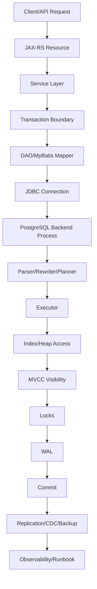
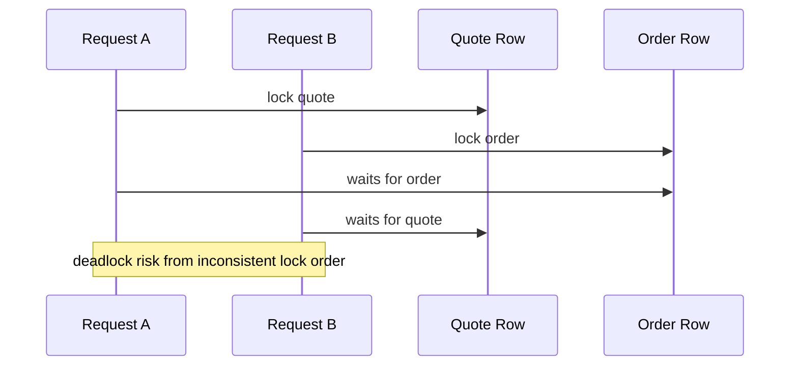

# Part 050 — PostgreSQL Mastery Map for Senior Backend Engineer

## 1. This is the final part

This is the final part of the series.

The goal is not to memorize every PostgreSQL feature.

The goal is to build a durable operating model for database work in enterprise Java/JAX-RS systems.

A senior backend engineer should be able to reason across:

- HTTP request lifecycle;
- service transaction boundary;
- MyBatis/JDBC behavior;
- SQL shape;
- PostgreSQL planner;
- indexes;
- MVCC;
- locks;
- WAL;
- vacuum;
- replication;
- CDC;
- migration;
- backup/restore;
- security;
- observability;
- incident response.

The database is not below the application.

The database is part of the application architecture.

---

## 2. Complete mental model

The complete mental model looks like this:



When debugging, move through the map deliberately.

Do not jump from symptom to fix.

Ask:

```text
Which layer owns the failure?
Which layer observes it?
Which layer can safely mitigate it?
Which layer can prevent recurrence?
```

---

## 3. PostgreSQL as multiple systems

PostgreSQL is not one thing.

It is several systems operating together.

| PostgreSQL as... | Senior engineer question |
|---|---|
| Relational database | Is the model correct and normalized where needed? |
| Transactional engine | Are atomicity and isolation boundaries correct? |
| Query engine | Can the planner choose a stable efficient plan? |
| Storage engine | What happens to heap pages, TOAST, bloat, and vacuum? |
| Indexing engine | Which access paths exist and what do they cost? |
| Replication engine | What happens to lag, WAL retention, failover, CDC? |
| Security system | Who can read/write what and under which role? |
| Operational system | Can it be backed up, restored, upgraded, monitored, and repaired? |

Mastery means switching lens based on the problem.

A slow endpoint may be a query problem.

It may also be:

- missing index;
- stale statistics;
- lock wait;
- connection pool exhaustion;
- replica lag;
- autovacuum issue;
- bad pagination;
- MyBatis N+1 query;
- oversized JSONB payload;
- cloud storage latency;
- noisy neighbor workload.

---

## 4. Data modelling mastery checklist

A senior engineer asks:

- What is the system of record?
- What is the lifecycle of this entity?
- What is immutable?
- What can change?
- What must be historically reconstructed?
- What is tenant/customer/account scope?
- What business identity needs unique constraint?
- What relationship needs foreign key?
- What field needs check constraint?
- What is reference data vs transaction data?
- What is state vs event history?
- What is audit vs operational history?
- What is read model vs source model?
- What should not be stored?
- What must be deleted, retained, masked, or encrypted?

Data modelling failure usually appears later as:

- impossible query;
- missing audit trail;
- duplicate business object;
- inconsistent status;
- broken reporting;
- painful migration;
- impossible reconciliation;
- privacy exposure;
- expensive backfill.

### Enterprise CPQ/order management lens

For CPQ/order systems, pay special attention to:

- versioned catalog data;
- effective-dated pricing;
- quote snapshot immutability;
- order lifecycle state;
- approval history;
- fulfillment status history;
- contract/agreement reference;
- outbox/integration event;
- read model/reporting projection;
- auditability of commercially meaningful changes.

Do not assume internal CSG schema.

Use this as a verification map.

---

## 5. SQL mastery checklist

Production SQL is judged by correctness and operational behavior.

Checklist:

```text
[ ] Does it return the correct rows?
[ ] Are tenant/account/customer filters present?
[ ] Are joins correct and intentional?
[ ] Is ordering deterministic?
[ ] Is pagination stable?
[ ] Is the result bounded?
[ ] Are lifecycle states handled explicitly?
[ ] Are null semantics understood?
[ ] Are dynamic filters safe?
[ ] Is the query readable in code review?
[ ] Does the query have an expected plan?
[ ] Does the query have supporting indexes?
[ ] Does the query behave under 10x data?
```

SQL skill is not just knowing syntax.

It is knowing what the query will do when:

- rows multiply;
- statistics drift;
- traffic becomes concurrent;
- tenants become skewed;
- data distribution changes;
- old states accumulate;
- partitions are introduced;
- replicas lag;
- application versions overlap.

---

## 6. Transaction mastery checklist

Every command use case should answer:

- What must commit together?
- What can happen before transaction starts?
- What can happen after transaction commits?
- What must not happen inside transaction?
- What happens if commit succeeds but response fails?
- What happens if event publishing fails?
- What happens if the client retries?
- What happens if another request updates the same row?
- What isolation level is assumed?
- What error is retryable?
- Is retry idempotent?

A strong Java/JAX-RS service boundary looks like:

```text
parse request
validate syntax/authz
open transaction
read current database state
apply domain transition
write state changes
write outbox/integration record if needed
commit
return response or enqueue post-commit work
```

Avoid:

```text
open transaction
call slow external service
hold locks while waiting
publish message directly
commit eventually
```

---

## 7. Locking mastery checklist

Locking mastery means predicting contention before production reveals it.

Ask:

- What rows are hot?
- What indexes support lock acquisition?
- What order are locks acquired?
- Can two workflows acquire locks in opposite order?
- Does this endpoint use `SELECT FOR UPDATE`?
- Does it need `NOWAIT` or `SKIP LOCKED`?
- Are lock and statement timeouts set?
- Is deadlock retry safe?
- Is optimistic locking better?
- Is a version column needed?
- Is a unique constraint used to resolve insert race?
- Is a queue table fair and recoverable?

When you see a deadlock, do not only fix one query.

Map the workflows.



---

## 8. Index mastery checklist

Indexing is access-path design.

Checklist:

- Which query pattern is this index for?
- Which columns are equality filters?
- Which columns are range filters?
- Which columns support sorting?
- Is the order aligned with keyset pagination?
- Is the index selective?
- Is the first column useful?
- Is a partial index better?
- Is an expression index needed?
- Is JSONB indexing too broad?
- Can an index-only scan help?
- What write overhead is added?
- Is the index redundant?
- How will bloat be monitored?
- How is the index created safely?

Index mastery also means knowing when **not** to add an index:

- low-cardinality column alone;
- rarely used query;
- write-heavy table already over-indexed;
- unstable exploratory reporting query;
- query better fixed by data model/read model;
- condition better handled by partitioning.

---

## 9. Query tuning mastery checklist

A reliable tuning workflow:

```text
1. Identify the exact SQL.
2. Identify frequency and latency impact.
3. Capture representative parameters.
4. Run EXPLAIN / EXPLAIN ANALYZE safely.
5. Compare estimated vs actual rows.
6. Check buffers/temp files/sort/hash behavior.
7. Check existing indexes and statistics.
8. Check locks/waits if latency is inconsistent.
9. Change one variable at a time.
10. Validate with representative data.
11. Add observability to detect regression.
```

Do not tune from intuition alone.

Do not tune from local empty database.

Do not treat sequential scan as automatically bad.

Do not treat index scan as automatically good.

The real question:

```text
Is this plan appropriate for this query, data distribution, runtime frequency, and concurrency level?
```

---

## 10. Migration mastery checklist

Migration discipline separates senior engineers from dangerous engineers.

Checklist:

```text
[ ] Is this backward compatible?
[ ] Is it safe for rolling deployment?
[ ] Is expand-contract needed?
[ ] Does it lock or rewrite a large table?
[ ] Does it add constraints safely?
[ ] Does it create indexes safely?
[ ] Does it affect views/functions/triggers?
[ ] Does it affect CDC/outbox?
[ ] Does it need backfill?
[ ] Is backfill resumable?
[ ] Is rollback realistic?
[ ] Is roll-forward safer?
[ ] Is validation defined?
[ ] Is owner/escalation defined?
```

A migration is not complete when it runs.

It is complete when:

- deployed safely;
- validated in production;
- old compatibility removed at the right phase;
- observability confirms health;
- rollback/roll-forward path is understood;
- documentation/runbook reflects the new state.

---

## 11. MyBatis mastery checklist

MyBatis is explicit SQL under Java control.

Mastery requires reviewing both Java and SQL.

Checklist:

- mapper method name matches query intent;
- SQL is readable;
- parameters are safe;
- dynamic SQL is whitelisted;
- result mapping is deterministic;
- nested mappings do not create N+1;
- JSONB/enum/timestamp TypeHandlers are tested;
- batch executor behavior is understood;
- transaction integration is explicit;
- database errors are mapped correctly;
- mapper tests run against PostgreSQL, not only mocks;
- generated SQL is observable.

Danger zone:

```xml
${rawFilter}
${sortColumn}
${sortDirection}
```

Safe dynamic SQL should be constrained by application-controlled choices, not raw user input.

---

## 12. CDC and outbox mastery checklist

Event-driven consistency is not magic.

Checklist:

- Is the database update and event creation atomic?
- Is outbox row written in same transaction?
- Is publisher polling or CDC-based?
- Is replication slot monitored?
- Can WAL grow because consumer stops?
- Are events idempotent?
- Are consumers idempotent?
- Are duplicates expected?
- Is ordering guaranteed, scoped, or absent?
- Can events be replayed?
- Can downstream state be reconciled?
- Is event schema versioned?
- Does PII leak into events?
- Does backfill emit events intentionally?

The correct default assumption:

```text
Delivery is at-least-once.
Duplicates will happen.
Ordering may be limited.
Reconciliation is required.
```

---

## 13. Security mastery checklist

Security is not only endpoint authorization.

Database security includes:

- roles;
- privileges;
- schema permissions;
- function permissions;
- default privileges;
- service accounts;
- migration accounts;
- read-only accounts;
- TLS;
- secret management;
- `SECURITY DEFINER` safety;
- `search_path` control;
- row-level security when applicable;
- auditability.

Checklist:

```text
[ ] Does runtime account have least privilege?
[ ] Does migration account differ from runtime account?
[ ] Are grants explicit and reviewed?
[ ] Are sensitive functions protected?
[ ] Are secrets outside source code?
[ ] Are credentials rotated?
[ ] Are support/reporting users scoped?
[ ] Are logs safe?
[ ] Are backups protected?
```

---

## 14. Privacy mastery checklist

For every sensitive data element:

- Why do we store it?
- Who can access it?
- Where is it copied?
- Is it in logs?
- Is it in Kafka?
- Is it in read models?
- Is it in backups?
- Is it in staging?
- How long is it retained?
- Can it be deleted/anonymized?
- Is access auditable?
- Is masking required?
- Is encryption/tokenization required?

Privacy issues often appear through secondary systems:

- CDC topics;
- debug logs;
- report exports;
- support dashboards;
- data repair scripts;
- backup restores;
- lower environments.

A senior engineer tracks the data beyond the table.

---

## 15. Observability mastery checklist

A production PostgreSQL-backed service should expose:

- HTTP route latency;
- database query latency;
- query identity/name;
- connection pool active/idle/pending;
- transaction duration;
- lock wait count/duration;
- deadlock count;
- serialization failure count;
- slow query samples;
- `pg_stat_statements` view;
- replication lag;
- WAL growth;
- autovacuum activity;
- dead tuples/bloat indicators;
- disk usage;
- backfill progress;
- migration status;
- outbox lag;
- CDC connector health.

Observability should answer:

```text
Is the database slow?
Is the application waiting for connections?
Is the query waiting for locks?
Is the planner using a bad plan?
Is replication lagging?
Is WAL growing?
Is vacuum falling behind?
Is the incident local to one endpoint or systemic?
```

---

## 16. Production readiness checklist

Before shipping a database-affecting change:

```text
[ ] Schema reviewed
[ ] Constraints reviewed
[ ] Indexes reviewed
[ ] Query plans reviewed
[ ] Transaction boundary reviewed
[ ] Locking risk reviewed
[ ] Migration plan reviewed
[ ] Backfill plan reviewed
[ ] Rollback/roll-forward reviewed
[ ] Security reviewed
[ ] Privacy reviewed
[ ] Observability reviewed
[ ] Dashboard linked
[ ] Alert impact understood
[ ] Runbook ready
[ ] Internal DBA/SRE/platform verification complete
```

Production readiness is the ability to answer:

```text
What will happen if this change behaves badly at 2 a.m. under real traffic?
```

---

## 17. Failure mode map

Use this map during design and review.

| Area | Common failure | Prevention |
|---|---|---|
| Schema | invalid data | constraints, clear ownership |
| Query | slow endpoint | plan evidence, indexes, pagination |
| Transaction | partial/inconsistent state | clear boundary, outbox, retry |
| Locking | deadlock/blocking | lock order, timeout, shorter transactions |
| Migration | deployment outage | expand-contract, lock analysis |
| Backfill | production overload | chunking, throttling, checkpointing |
| Pooling | connection exhaustion | pool sizing, PgBouncer/RDS Proxy if appropriate |
| CDC | WAL growth or duplicate events | slot monitoring, idempotent consumers |
| Replication | stale reads | lag awareness, read consistency policy |
| Backup | false confidence | restore drills, PITR validation |
| Security | over-privilege | least privilege, secret management |
| Privacy | data leakage | minimization, masking, audit |
| Observability | blind debugging | metrics, logs, traces, dashboards |

---

## 18. Internal verification checklist

For CSG/team context, verify these items directly.

Do not infer.

### Platform and topology

- PostgreSQL version;
- managed cloud vs Kubernetes vs on-prem;
- AWS/Azure/on-prem/hybrid topology;
- HA and failover design;
- read replica policy;
- backup/PITR/RPO/RTO;
- maintenance window;
- upgrade policy.

### Application integration

- Java/JAX-RS framework transaction model;
- JDBC driver version;
- HikariCP or equivalent configuration;
- PgBouncer/RDS Proxy usage;
- MyBatis configuration;
- mapper conventions;
- TypeHandler conventions;
- SQL logging/tracing approach.

### Schema and migration

- migration tool;
- migration execution path;
- schema ownership;
- database-per-service policy;
- shared database exceptions;
- large table migration policy;
- backfill runbook;
- index creation policy;
- extension approval policy.

### Eventing and integration

- outbox/inbox pattern;
- CDC/Debezium usage;
- Kafka topic ownership;
- event schema governance;
- replay policy;
- reconciliation jobs;
- duplicate handling strategy.

### Security and compliance

- runtime roles;
- migration roles;
- read-only/reporting roles;
- secret management;
- TLS policy;
- PII classification;
- audit trail requirements;
- data retention/deletion;
- log redaction.

### Operations

- dashboards;
- alerts;
- slow query logging;
- `pg_stat_statements` availability;
- incident runbook;
- emergency permissions;
- escalation path;
- DBA/SRE/platform ownership boundary;
- restore drill history;
- incident notes.

---

## 19. How to become effective in database design discussions

Do not try to win by knowing more features.

Be useful by structuring the decision.

When a design discussion touches PostgreSQL, ask:

```text
What invariant are we protecting?
What lifecycle does the data follow?
What is the source of truth?
What query patterns are required?
What concurrency can happen?
What migration path is safe?
What operational signal will prove it works?
What happens when it fails?
```

Then map trade-offs:

| Option | Correctness | Performance | Migration | Operations | Security/privacy |
|---|---|---|---|---|---|
| Normalize | strong constraints | joins required | explicit evolution | clear ownership | easier classification |
| JSONB | flexible | index carefully | schema governance needed | harder reporting | hidden sensitive fields risk |
| Materialized view | fast reads | refresh cost | dependency risk | stale data monitoring | may duplicate data |
| Outbox | consistent events | extra table/work | schema versioning | lag monitoring | event payload review |
| Trigger | close to data | hidden cost | ordering/version risk | hard debugging | definer/search_path risk |

Senior contribution is not “always choose X.”

Senior contribution is making the trade-off explicit.

---

## 20. How to prevent database changes from becoming incidents

Most prevention is boring.

That is good.

Prevent incidents by doing the basics consistently:

- constrain important data;
- keep transactions short;
- use idempotency for retryable operations;
- avoid direct event publish inside transaction without outbox;
- review query plans;
- create indexes safely;
- split risky migrations;
- backfill in chunks;
- monitor locks, pool, slow query, replication lag, WAL, disk;
- practice restore;
- document runbooks;
- escalate early when ownership is unclear.

The best database incident is the one avoided during PR review.

---

## 21. Learning path after this series

To deepen PostgreSQL skill, use production-adjacent practice.

### Practice 1 — Query plan journal

For every important query:

- save the SQL;
- save representative parameters;
- save EXPLAIN output;
- note indexes used;
- note row estimates vs actual rows;
- note data growth risk;
- revisit after data distribution changes.

### Practice 2 — Migration review journal

For every migration:

- classify DDL risk;
- note lock level;
- note compatibility phase;
- note validation query;
- note rollback/roll-forward;
- note what happened in production.

### Practice 3 — Incident note reading

Read old database incidents and extract:

- symptom;
- root cause;
- missing signal;
- unsafe assumption;
- prevention change;
- checklist improvement.

### Practice 4 — Internal architecture mapping

Build a private map of:

- service to schema;
- schema to migration repo;
- service to connection pool;
- database to dashboard;
- database to backup/restore policy;
- database to CDC/Kafka pipeline;
- database to owner/escalation path.

This map is often more valuable than generic knowledge.

---

## 22. Final mastery checklist

```text
PostgreSQL mental model
[ ] I can explain PostgreSQL as relational, transactional, query, storage, indexing, and operational system.
[ ] I can trace HTTP -> service -> transaction -> MyBatis/JDBC -> PostgreSQL -> WAL/locks/index/storage.

Data modelling
[ ] I can identify source-of-truth tables, read models, audit tables, and integration tables.
[ ] I can design constraints for important invariants.
[ ] I can reason about temporal/effective-dated data.

SQL and performance
[ ] I can review SELECT/JOIN/CTE/window/pagination/upsert/bulk operation patterns.
[ ] I can read EXPLAIN and identify estimate vs actual mismatch.
[ ] I can choose index strategy based on query pattern and write cost.

Transactions and concurrency
[ ] I can reason about MVCC, isolation, lock waits, deadlocks, and retry.
[ ] I can design optimistic/pessimistic locking where appropriate.

Java/JAX-RS/MyBatis
[ ] I can keep transaction boundaries clear.
[ ] I can review MyBatis dynamic SQL safely.
[ ] I can map SQLState/database errors to domain/API errors.

Migration and operations
[ ] I can design expand-contract migration.
[ ] I can review backfill safety.
[ ] I can understand backup/restore/PITR/HA implications.

CDC and microservices
[ ] I can design outbox/inbox with idempotent consumers.
[ ] I can reason about duplicate/out-of-order/replay/reconciliation.

Security/privacy
[ ] I can review roles, privileges, secrets, RLS, PII, audit, retention, and log redaction.

Observability and incidents
[ ] I can use pg_stat_activity, pg_stat_statements, pg_locks, slow query logs, wait events, and dashboards.
[ ] I can participate safely in database incidents.
[ ] I can turn incidents into durable preventive changes.
```

---

## 23. Final principle

PostgreSQL mastery for a senior backend engineer is not about becoming a full-time DBA.

It is about becoming safe, effective, and trusted when application design meets durable state.

The database remembers what the application forgets.

Design accordingly.

Review accordingly.

Operate accordingly.

This concludes the series.
