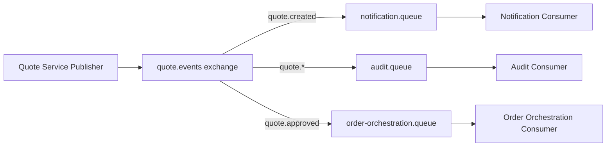
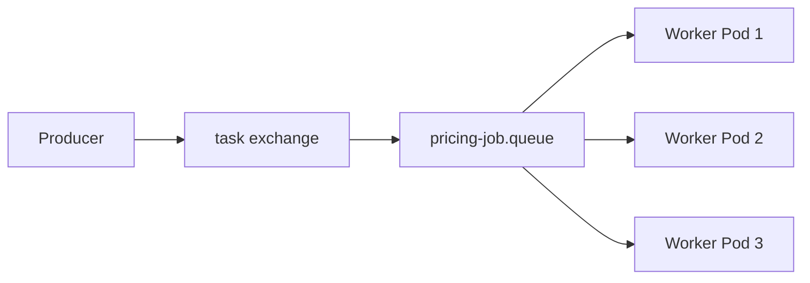
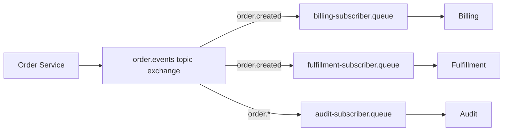
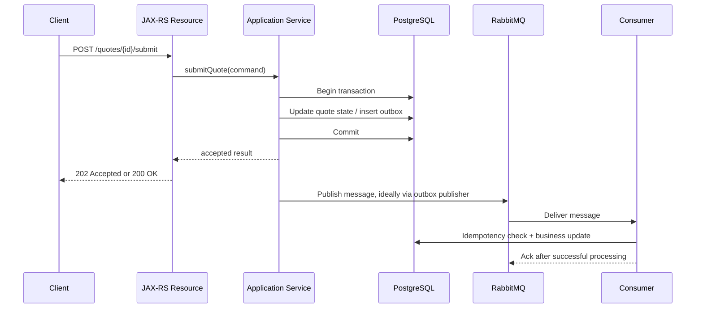

# RabbitMQ Foundation

## 1. Core idea

RabbitMQ adalah **message broker**: komponen infrastruktur yang menerima message dari producer, menyimpan atau meneruskannya melalui routing rules, lalu mengirimkannya ke consumer. Dalam sistem enterprise, RabbitMQ bukan sekadar library untuk `publish()` dan `consume()`. RabbitMQ adalah boundary runtime antara service yang menghasilkan pekerjaan dan service yang memproses pekerjaan.

Dalam konteks Java/JAX-RS backend, RabbitMQ biasanya muncul ketika request HTTP tidak boleh langsung menyelesaikan semua pekerjaan secara synchronous. Contoh mental model:

```text
HTTP request masuk
  -> JAX-RS resource menerima command
  -> service layer memvalidasi intent
  -> database menyimpan state awal / outbox record
  -> publisher mengirim message ke RabbitMQ
  -> RabbitMQ meroute message ke queue
  -> consumer memproses secara asynchronous
  -> state berubah / downstream dipanggil / event lanjutan dipublish
```

RabbitMQ cocok untuk sistem yang membutuhkan **asynchronous work distribution**, **broker-side routing**, **per-consumer queue isolation**, **explicit acknowledgement**, dan **operational visibility terhadap backlog**.

RabbitMQ tidak otomatis membuat sistem menjadi reliable. Reliability muncul dari kombinasi:

- durable exchange;
- durable queue;
- persistent message;
- publisher confirm;
- manual acknowledgement;
- retry/DLQ topology;
- idempotent consumer;
- observability;
- runbook production.

Tanpa disiplin itu, RabbitMQ hanya memindahkan failure dari call stack synchronous menjadi backlog asynchronous yang lebih sulit terlihat.

---

## 2. RabbitMQ in one sentence

RabbitMQ adalah broker yang menerima message dari producer, melakukan routing melalui exchange dan binding, menyimpan message di queue, lalu mengirim message ke consumer dengan acknowledgement discipline.

Versi lebih senior:

> RabbitMQ adalah runtime coordination layer untuk asynchronous command, task distribution, event fanout, retry isolation, dan integration handoff, dengan failure model yang harus didesain eksplisit di producer, broker topology, queue policy, consumer, database transaction boundary, dan operational runbook.

---

## 3. Why RabbitMQ exists

Dalam sistem enterprise, tidak semua pekerjaan sebaiknya dilakukan langsung di request-response path.

Masalah umum synchronous-only architecture:

| Problem | Dampak |
|---|---|
| Request harus menunggu downstream lambat | Latency tinggi dan timeout cascade |
| Downstream sementara mati | User-facing API ikut gagal |
| Workload berat dilakukan di thread HTTP | Thread pool servlet/JAX-RS habis |
| Banyak consumer perlu menerima event yang sama | Producer harus tahu semua consumer |
| Retry dilakukan di request path | User mengalami retry delay |
| Tidak ada backlog visibility | Sulit tahu pekerjaan tertunda |
| Tidak ada isolation antar subscriber | Satu downstream lambat mengganggu flow utama |

RabbitMQ menyediakan decoupling temporal:

```text
Producer selesai setelah menyerahkan message ke broker dengan benar.
Consumer memproses saat resource tersedia.
Broker menjadi buffer, router, dan delivery coordinator.
```

Namun decoupling ini bukan gratis. Ia membawa konsekuensi:

- message bisa duplicate;
- ordering bisa berubah;
- processing menjadi eventually consistent;
- failure tidak muncul sebagai exception langsung di API;
- debugging harus melintasi producer, broker, queue, consumer, dan database;
- topology perlu dikelola sebagai production artifact.

---

## 4. RabbitMQ as message broker

Sebagai message broker, RabbitMQ punya tanggung jawab utama:

1. Menerima message dari producer.
2. Mengevaluasi routing melalui exchange dan binding.
3. Menyimpan message di queue jika ada route yang cocok.
4. Mengirim message ke consumer.
5. Melacak delivery yang belum di-ack.
6. Mengirim ulang message jika consumer gagal sebelum ack.
7. Menerapkan policy tertentu seperti TTL, dead-lettering, max length, quorum replication, atau priority.

Yang sering disalahpahami: RabbitMQ bukan database utama untuk business state. RabbitMQ menyimpan message untuk delivery, bukan menjadi source of truth domain.

Dalam sistem quote/order management, source of truth biasanya tetap berada di database domain seperti PostgreSQL. RabbitMQ mengangkut perubahan, command, task, atau integration handoff.

---

## 5. RabbitMQ as AMQP broker

RabbitMQ dikenal kuat karena dukungan AMQP 0-9-1. AMQP memberi model eksplisit:

```text
Producer -> Exchange -> Binding -> Queue -> Consumer
```

Producer tidak perlu tahu consumer. Producer juga sebaiknya tidak publish langsung ke queue, kecuali memakai default exchange secara sadar. Producer publish ke exchange dengan routing key. Exchange menentukan queue mana yang menerima message.

Ini berbeda dari model sederhana seperti:

```text
Producer -> Topic
Consumer <- Topic
```

Dalam AMQP, **routing adalah konsep utama**. Queue adalah tempat delivery ke consumer, tetapi routing decision terjadi di exchange.

Implikasi untuk senior engineer:

- desain exchange adalah desain contract routing;
- desain routing key adalah desain address space;
- desain binding adalah desain subscription/intent;
- desain queue adalah desain delivery isolation;
- desain consumer adalah desain side-effect dan acknowledgement.

---

## 6. RabbitMQ as routing engine

RabbitMQ bukan hanya queue. RabbitMQ adalah routing engine.

Exchange dapat melakukan routing berdasarkan:

- exact routing key (`direct` exchange);
- pattern routing key (`topic` exchange);
- broadcast ke semua binding (`fanout` exchange);
- header matching (`headers` exchange);
- plugin-specific strategy jika enabled, misalnya delayed exchange atau consistent hash exchange.

Contoh conceptual routing:



Hal penting: diagram di atas adalah contoh konseptual, bukan detail internal CSG. Nama exchange, queue, binding, dan routing key aktual harus diverifikasi di internal team.

Routing engine memberi fleksibilitas, tetapi juga memberi risiko:

- routing key terlalu generik;
- binding terlalu luas;
- exchange dipakai banyak domain tanpa ownership jelas;
- message silently unroutable jika mandatory/alternate exchange tidak dikonfigurasi;
- consumer menerima message yang tidak dipahami;
- topology berubah tanpa backward compatibility.

---

## 7. RabbitMQ as work queue system

RabbitMQ sering dipakai untuk work queue: banyak worker mengambil pekerjaan dari satu queue.



Karakteristik work queue:

- satu message biasanya diproses oleh satu consumer;
- banyak consumer bersaing mengambil pekerjaan;
- throughput meningkat dengan menambah worker;
- prefetch menentukan jumlah message in-flight;
- manual ack menentukan kapan pekerjaan dianggap selesai;
- retry/DLQ wajib untuk failure;
- idempotency wajib karena message bisa redelivered.

Work queue cocok untuk:

- pricing calculation job;
- background enrichment;
- document generation;
- notification dispatch;
- integration push;
- asynchronous validation;
- long-running task yang tidak boleh menahan HTTP request.

Work queue berisiko jika:

- task tidak idempotent;
- task memanggil downstream non-idempotent;
- task membutuhkan strict ordering tetapi consumer diskalakan banyak;
- retry dilakukan tanpa limit;
- tidak ada DLQ;
- tidak ada visibility terhadap unacked/backlog.

---

## 8. RabbitMQ as pub/sub broker

RabbitMQ juga dapat dipakai sebagai pub/sub broker. Dalam AMQP, pub/sub biasanya dibuat dengan exchange dan per-subscriber queue.



Setiap subscriber punya queue sendiri. Ini penting karena:

- subscriber lambat tidak langsung menahan subscriber lain;
- tiap subscriber punya backlog sendiri;
- retry/DLQ bisa berbeda per subscriber;
- consumer ownership lebih jelas.

Tetapi RabbitMQ pub/sub bukan event log seperti Kafka. Jika event replay jangka panjang dibutuhkan, RabbitMQ queue biasa bukan pilihan ideal. RabbitMQ Stream bisa dipertimbangkan, tetapi tetap harus dibandingkan dengan Kafka berdasarkan retention, replay, partitioning, tooling, dan operational ownership.

---

## 9. RabbitMQ as integration component

Dalam enterprise system, RabbitMQ sering menjadi integration handoff antar bounded context, application, vendor system, atau deployment zone.

Use case umum:

- internal service-to-service asynchronous command;
- event fanout ke beberapa consumer;
- job queue untuk background worker;
- retry isolation dari downstream lambat;
- integration queue untuk legacy/on-prem system;
- buffer untuk traffic burst;
- boundary antara online API dan offline processing;
- decoupling antara quote/order lifecycle dan notification/integration workload.

Hal yang perlu dijaga:

- message contract harus eksplisit;
- ownership exchange/queue harus jelas;
- DLQ harus dimonitor;
- message replay harus punya prosedur;
- data privacy harus dipikirkan karena DLQ dapat menyimpan payload sensitif;
- change management topology harus lewat review.

---

## 10. RabbitMQ vs Kafka

RabbitMQ dan Kafka sama-sama dipakai untuk messaging, tetapi mental model-nya berbeda.

| Dimension | RabbitMQ | Kafka |
|---|---|---|
| Core model | Broker routing + queue delivery | Distributed commit log |
| Producer target | Exchange + routing key | Topic + partition |
| Consumer model | Message delivered to queue consumer | Consumer pulls from partition offset |
| Replay | Terbatas pada queue/stream setup | Native retention + offset replay |
| Work distribution | Sangat natural | Perlu consumer group semantics |
| Routing | Exchange/binding/routing key kuat | Routing umumnya via topic/partition/key |
| Ack model | Per-delivery ack/nack | Offset commit |
| Backlog unit | Queue depth | Topic partition lag |
| Ordering | Queue/consumer dependent | Partition dependent |
| Typical use | Task queue, command routing, integration queue, pub/sub ringan | Event streaming, replay, analytics pipeline, event backbone |
| Operational concern | Queue depth, unacked, DLQ, broker resources | Partition lag, retention, compaction, broker storage, consumer groups |

Gunakan RabbitMQ ketika:

- perlu routing fleksibel;
- perlu work queue/competing consumer;
- perlu per-message ack/nack/requeue;
- perlu low-latency task distribution;
- event replay jangka panjang bukan kebutuhan utama;
- topology queue-based lebih cocok dari log-based.

Gunakan Kafka ketika:

- event harus disimpan untuk replay;
- banyak consumer membaca event history berbeda waktu;
- throughput sangat tinggi dan log model cocok;
- event menjadi backbone data platform;
- partition ordering dan retention adalah kebutuhan utama.

Hybrid architecture sering masuk akal:

```text
RabbitMQ -> command/task routing, short-lived operational queue
Kafka    -> durable event log, CDC, analytics, replayable stream
```

---

## 11. RabbitMQ vs Redis Stream

Redis Stream adalah stream data structure di Redis. Ia berguna untuk lightweight streaming dan consumer group, tetapi berbeda dari RabbitMQ.

| Dimension | RabbitMQ | Redis Stream |
|---|---|---|
| Primary identity | Message broker | Redis data structure for stream entries |
| Routing | Exchange/binding model | Stream key + consumer group |
| Queue semantics | Native queues | Stream entries with pending entries list |
| Retry/DLQ | Native patterns via nack/DLX/TTL/topology | Dibangun di application logic |
| Operational model | Broker-specific | Redis memory/storage model |
| Pub/sub durability | Queue durable jika dikonfigurasi | Stream retained until trimmed |
| Best fit | Task routing, integration broker, ack-based delivery | Lightweight event stream, Redis-adjacent workflows |

Redis Stream bisa menarik jika sistem sudah sangat Redis-centric. Namun untuk enterprise queue topology dengan routing, DLQ, permissions, vhost, and broker observability, RabbitMQ biasanya lebih natural.

---

## 12. RabbitMQ vs database queue

Database queue berarti menyimpan pekerjaan di table lalu worker melakukan polling.

| Dimension | RabbitMQ | Database Queue |
|---|---|---|
| Delivery | Broker push/pull delivery | SQL polling/locking |
| Routing | Exchange/binding | Query conditions/application logic |
| Backpressure | Queue depth, prefetch, broker flow control | DB locks, row contention, poll interval |
| Transaction with business data | Butuh outbox/inbox | Natural jika same DB transaction |
| Operational pressure | Broker resources | Database CPU/IO/locks |
| Best fit | Messaging workload | Small internal workflow tightly coupled to DB |

Database queue cocok untuk sederhana dan transactionally local use case. Tetapi jika queue tumbuh besar, banyak consumer, banyak routing, banyak retry, dan integration lintas service, database queue bisa membebani database utama.

Senior rule:

> Jangan memakai PostgreSQL sebagai RabbitMQ darurat kecuali workload, locking model, cleanup, visibility, dan failure mode-nya memang dipahami.

---

## 13. RabbitMQ vs HTTP polling

HTTP polling adalah client/service berkala menanyakan status atau pekerjaan baru.

| Dimension | RabbitMQ | HTTP Polling |
|---|---|---|
| Work notification | Broker delivery | Periodic request |
| Latency | Rendah | Tergantung interval |
| Load | Event-driven | Banyak request kosong |
| Reliability | Ack/retry/DLQ dapat dibangun | Harus dibangun manual |
| Backlog visibility | Queue depth | Perlu DB/app metrics |
| Coupling | Producer tidak tahu consumer | Poller tahu endpoint/data source |

Polling masih cocok untuk status API user-facing, misalnya client mengecek progress order. Tetapi antar backend service, polling sering kalah dibanding broker jika kebutuhan utamanya adalah task dispatch atau event notification.

---

## 14. RabbitMQ vs gRPC streaming

gRPC streaming adalah komunikasi streaming langsung antar service. RabbitMQ adalah brokered asynchronous messaging.

| Dimension | RabbitMQ | gRPC Streaming |
|---|---|---|
| Coupling | Producer-consumer decoupled via broker | Direct connection antar service |
| Persistence | Message bisa durable | Stream bergantung connection/runtime |
| Delivery ack | Broker-mediated ack | Application protocol-level |
| Backlog | Queue depth | Application-managed |
| Best fit | Async task/event/integration | Low-latency direct stream between known services |

Gunakan gRPC streaming untuk direct online stream yang perlu latency sangat rendah dan lifecycle connection jelas. Gunakan RabbitMQ untuk asynchronous durable handoff, retry isolation, dan decoupling.

---

## 15. RabbitMQ vs traditional ESB

Traditional ESB sering menjadi centralized integration layer dengan transformation, orchestration, routing, governance, dan connector logic besar di tengah.

RabbitMQ lebih kecil scope-nya:

- broker menerima dan meroute message;
- transformation sebaiknya tidak disembunyikan di broker;
- business logic tetap di service;
- workflow kompleks sebaiknya di workflow engine/orchestrator, bukan di exchange topology;
- governance tetap perlu, tetapi bukan berarti broker menjadi God component.

Anti-pattern:

```text
Semua service publish ke satu exchange besar
semua routing key tidak distandarkan
semua queue dibuat ad hoc
DLQ tidak dimonitor
message contract tidak terdokumentasi
broker menjadi tempat menyembunyikan coupling antar domain
```

RabbitMQ sebaiknya menjadi **explicit messaging infrastructure**, bukan ESB tersembunyi.

---

## 16. When to use RabbitMQ

Gunakan RabbitMQ ketika salah satu kondisi berikut kuat:

1. **Asynchronous task distribution** dibutuhkan.
2. **Consumer acknowledgement** penting.
3. **Retry dan DLQ** perlu dipisahkan dari HTTP request path.
4. **Routing ke banyak queue** perlu dikelola broker-side.
5. **Backlog visibility** penting untuk operasi.
6. **Producer dan consumer lifecycle berbeda**.
7. **Downstream dapat lambat atau intermittent**.
8. **Per-subscriber queue isolation** dibutuhkan.
9. **Workload spike** perlu dibuffer.
10. **Integration handoff** perlu explicit boundary.

Contoh enterprise Java/JAX-RS:

```text
POST /quotes/{id}/submit
  -> validate request
  -> persist quote state = SUBMITTED
  -> create outbox record QuoteSubmitted
  -> async publisher emits QuoteSubmitted
  -> approval/pricing/notification consumers process independently
```

Catatan: contoh ini konseptual. Nama event, state, dan consumer aktual harus diverifikasi internal.

---

## 17. When not to use RabbitMQ

Jangan memakai RabbitMQ hanya karena ingin "microservices style".

RabbitMQ kurang tepat jika:

- synchronous response benar-benar dibutuhkan;
- operation harus immediately consistent lintas service;
- consumer side effect tidak bisa dibuat idempotent;
- tidak ada tim yang memiliki broker operations;
- tidak ada observability queue/DLQ;
- tidak ada retry policy;
- message contract tidak bisa dijaga;
- event replay jangka panjang adalah kebutuhan utama dan Kafka lebih cocok;
- topology akan dipakai untuk menyembunyikan domain coupling;
- hanya satu process lokal dan in-memory queue cukup;
- database transaction local sudah menyelesaikan masalah dengan lebih sederhana.

Rule praktis:

> RabbitMQ adalah alat untuk memperjelas asynchronous boundary, bukan alat untuk menghindari desain consistency.

---

## 18. RabbitMQ in enterprise Java/JAX-RS systems

Dalam backend Java/JAX-RS, RabbitMQ biasanya berada di luar resource layer.

Struktur yang lebih sehat:

```text
JAX-RS Resource
  -> Application Service
      -> Transaction boundary
      -> Domain operation / DB write
      -> Outbox insert or Publisher abstraction
  -> HTTP response

RabbitMQ Consumer
  -> Message deserialization
  -> Validation / contract check
  -> Idempotency guard
  -> Application Service
      -> Transaction boundary
      -> DB write / downstream call
  -> Ack/Nack decision
```

Jangan menaruh RabbitMQ logic langsung di resource method tanpa abstraction. Resource method harus tetap fokus pada HTTP contract. Publisher/consumer harus punya abstraction agar:

- testable;
- metrics bisa konsisten;
- correlation header konsisten;
- failure handling konsisten;
- publisher confirm bisa distandarkan;
- retry/DLQ behavior bisa direview.

---

## 19. RabbitMQ in microservices

Dalam microservices, RabbitMQ dapat menghubungkan service melalui command, event, atau task.

Perbedaan penting:

| Message type | Meaning | Consumer expectation |
|---|---|---|
| Command | Meminta sesuatu dilakukan | Biasanya satu logical owner |
| Event | Memberi tahu sesuatu sudah terjadi | Bisa banyak subscriber |
| Task/job | Unit pekerjaan asynchronous | Competing workers |
| Integration message | Handoff ke sistem lain | Reliability dan audit penting |
| Reply | Response async atas command/request | Correlation dan timeout penting |

Kesalahan umum adalah mencampur command dan event.

Event:

```text
QuoteApproved means approval already happened.
```

Command:

```text
ApproveQuote means consumer is asked to approve.
```

Jika event diproses seperti command, consumer bisa melakukan side effect yang tidak sesuai ownership. Jika command dipublish sebagai event, producer bisa kehilangan kontrol atas intent dan result.

---

## 20. RabbitMQ in CPQ/order management context

Dalam CPQ/order management, RabbitMQ dapat muncul pada flow seperti:

- submit quote;
- pricing job;
- approval request;
- quote accepted event;
- order creation command;
- order decomposition task;
- fulfillment task;
- notification event;
- downstream integration;
- fallout/recovery workflow;
- audit/event distribution.

Namun detail internal tidak boleh ditebak. Untuk CSG/team, hal yang perlu dicari bukan "RabbitMQ dipakai untuk apa menurut teori", tetapi:

- message type aktual apa saja;
- producer service mana yang menerbitkan;
- exchange/queue/routing key aktual apa;
- consumer service mana yang memiliki queue;
- retry dan DLQ topology seperti apa;
- apakah message mewakili command, event, task, atau integration;
- business invariant apa yang dipertahankan;
- apa dampak duplicate message;
- apa dampak out-of-order processing;
- bagaimana replay dilakukan;
- siapa on-call owner saat queue bermasalah.

---

## 21. Basic lifecycle: HTTP to async processing

Contoh lifecycle konseptual:



Production note:

- If DB commit succeeds but publish fails, use outbox.
- If consumer processes but ack fails, expect redelivery.
- If consumer side effect is not idempotent, duplicate delivery becomes business damage.
- If queue depth grows, user-facing API may still look healthy while async work is stuck.

---

## 22. Correctness concerns

RabbitMQ changes the correctness problem. In synchronous code, failure is often immediate exception. In asynchronous messaging, failure can become delayed, duplicated, reordered, or hidden in DLQ.

Correctness questions:

1. What is the source of truth?
2. Is the message command, event, task, or integration handoff?
3. Can the same message be processed twice safely?
4. Can messages arrive out of order?
5. What happens if publisher crashes after DB commit?
6. What happens if consumer crashes after DB write but before ack?
7. What happens if downstream call succeeds but consumer crashes before recording success?
8. What happens if message is poison and always fails?
9. What happens if retry runs for hours?
10. What happens if DLQ is never drained?

Senior RabbitMQ design starts from these questions, not from API syntax.

---

## 23. Performance concerns

RabbitMQ performance is affected by:

- message size;
- persistent vs transient message;
- classic vs quorum queue;
- number of queues;
- number of bindings;
- routing complexity;
- publisher confirm mode;
- batching;
- prefetch;
- consumer concurrency;
- ack frequency;
- disk IO;
- network IO;
- broker memory;
- queue depth;
- connection/channel count;
- downstream database/service latency.

Common trap:

```text
Consumer is slow because DB is slow.
Team increases RabbitMQ consumer replicas.
DB connection pool saturates.
Unacked messages grow.
Retries increase.
System becomes worse.
```

Throughput tuning must consider the whole path:

```text
Producer -> Broker -> Queue -> Consumer -> DB/downstream -> Ack
```

---

## 24. Security and privacy concerns

RabbitMQ security is not only username/password.

Review these areas:

- vhost isolation;
- per-service user permissions;
- configure/write/read permissions;
- topic permissions if used;
- TLS/mTLS;
- secret rotation;
- Management UI access;
- network isolation;
- PII in payload;
- PII in headers;
- log redaction;
- DLQ access;
- replay access;
- retention of sensitive messages.

DLQ is often overlooked. A DLQ may contain the most sensitive and malformed payloads, and may retain them longer than normal queues. Treat DLQ as production data, not just debugging trash.

---

## 25. Observability concerns

Minimum RabbitMQ observability:

| Signal | Meaning |
|---|---|
| Queue depth / ready messages | Backlog not yet delivered |
| Unacked messages | Delivered but not acknowledged |
| Publish rate | Producer throughput |
| Deliver rate | Broker delivery throughput |
| Ack rate | Consumer success throughput |
| Redelivery rate | Retry/crash/requeue signal |
| Consumer count | Active consumers |
| Consumer utilization | Whether queue can deliver to consumers |
| DLQ depth | Failed/poison messages |
| Connection count | Client connectivity/load |
| Channel count | Client resource usage/leak |
| Memory alarm | Broker memory pressure |
| Disk alarm | Broker disk pressure |
| Connection blocked | Publisher backpressure |

Operationally, RabbitMQ incidents often start with one of these patterns:

- ready messages increasing;
- unacked messages increasing;
- redelivery rate spiking;
- DLQ depth growing;
- connection count spiking;
- disk free decreasing;
- consumers at zero;
- ack rate lower than publish rate.

---

## 26. Failure modes

Common failure modes:

### Producer-side

- publish succeeds locally but broker did not confirm;
- unroutable message silently dropped due to missing mandatory/alternate exchange;
- connection blocked due to broker alarm;
- publisher retry duplicates message;
- DB commit succeeds but publish fails;
- serialization error after business state change.

### Broker-side

- queue grows because consumer is slow;
- memory alarm blocks publishers;
- disk alarm blocks publishers;
- node restart causes reconnect storm;
- queue leader failover affects latency;
- topology misconfiguration routes to wrong queue;
- policy changes queue behavior unexpectedly.

### Consumer-side

- auto ack loses message after crash;
- manual ack before processing loses correctness;
- consumer crashes after DB write before ack, causing duplicate;
- requeue true creates infinite redelivery loop;
- poison message blocks useful work;
- high prefetch creates too many in-flight side effects;
- shutdown kills in-flight processing.

### Integration-side

- downstream timeout triggers retry storm;
- external API succeeds but response lost;
- duplicate command creates duplicate order/notification;
- retry after business state changed becomes invalid;
- DLQ replay replays stale business intent.

---

## 27. Debugging first principles

When something goes wrong, do not start by reading random logs. Follow the lifecycle.

### Question 1: Was the message created?

Check:

- application log;
- outbox table;
- publisher metric;
- serialization error;
- transaction rollback.

### Question 2: Was the message published?

Check:

- publisher confirm;
- publish failure metric;
- connection/channel error;
- broker availability;
- blocked connection.

### Question 3: Was the message routable?

Check:

- exchange name;
- routing key;
- binding;
- mandatory return;
- alternate exchange;
- RabbitMQ Management UI.

### Question 4: Is the message in a queue?

Check:

- queue depth;
- ready messages;
- DLQ;
- retry queue;
- x-death header;
- queue TTL/max length.

### Question 5: Was the message delivered?

Check:

- consumer count;
- deliver rate;
- unacked messages;
- prefetch;
- consumer utilization.

### Question 6: Was the message processed?

Check:

- consumer logs;
- idempotency table;
- DB state;
- downstream call log;
- ack/nack metric.

### Question 7: Was it retried or dead-lettered?

Check:

- redelivery flag;
- x-death header;
- retry count;
- DLQ routing;
- replay procedure.

---

## 28. Design trade-offs

RabbitMQ design is trade-off heavy.

| Decision | Benefit | Cost |
|---|---|---|
| Manual ack | Correct delivery control | More complex consumer logic |
| Persistent messages | Survive broker restart | Higher disk IO |
| Quorum queue | Better replicated durability | Higher latency/storage cost |
| High prefetch | Higher throughput | More in-flight duplicate risk |
| Many consumers | More throughput | Ordering weaker, DB pressure higher |
| Retry with delay | Handles transient failure | Ordering impact, retry backlog |
| DLQ | Poison isolation | Requires monitoring/replay governance |
| Per-subscriber queue | Subscriber isolation | More queues/topology |
| Topic exchange | Flexible routing | Routing key governance needed |
| Outbox | Prevents DB-publish gap | More tables/poller/ops complexity |

Senior engineering is not choosing the "best" option. It is choosing the option whose failure mode the team can operate.

---

## 29. PR review checklist

Use this checklist when reviewing a change that introduces or modifies RabbitMQ usage.

### Intent

- Is the message a command, event, task, reply, or integration handoff?
- Is RabbitMQ the right tool for this flow?
- Is the expected delivery semantic documented?
- Is eventual consistency acceptable?

### Topology

- Which exchange is used?
- Which exchange type is used?
- Which routing key is used?
- Which queue receives the message?
- Who owns the queue?
- Is there a DLQ?
- Is there a retry strategy?
- Are topology names consistent?

### Producer

- Is publisher confirm used for important messages?
- Is unroutable message detected?
- Is the message persistent when needed?
- Is the exchange durable when needed?
- Is outbox needed?
- What happens on publish failure?

### Consumer

- Is manual ack used?
- Is ack after durable side effect?
- Is consumer idempotent?
- Is prefetch intentional?
- What happens on validation failure?
- What happens on transient downstream failure?
- What happens on poison message?

### Data consistency

- Is DB transaction boundary clear?
- Is duplicate processing safe?
- Is out-of-order processing possible?
- Is replay safe?
- Is state transition idempotent?

### Operations

- Are metrics emitted?
- Are queue depth and DLQ alerted?
- Is there a runbook?
- Is replay procedure defined?
- Is ownership clear?

### Security

- Does service have least privilege?
- Is payload allowed to contain current data class?
- Are sensitive headers logged?
- Is DLQ access restricted?

---

## 30. Internal verification checklist

Do not assume CSG/team topology. Verify.

### Codebase

- Where are RabbitMQ producers implemented?
- Where are consumers implemented?
- Is there a shared RabbitMQ client abstraction?
- Is there an outbox publisher?
- Is there an inbox/idempotency table?
- Are publisher confirm and return listener used?
- Are consumers manual ack or auto ack?
- How is prefetch configured?
- How are retries implemented?
- How are DLQs consumed/replayed?

### RabbitMQ broker

- What vhosts exist?
- What exchanges exist?
- What queues exist?
- What bindings exist?
- What routing keys are used?
- Which queues are classic/quorum/stream?
- Which policies/operator policies are active?
- Is there alternate exchange usage?
- Is there delayed message plugin usage?
- Is there federation/shovel usage?

### Deployment

- Is RabbitMQ managed, Kubernetes-based, VM-based, or on-prem?
- Is RabbitMQ clustered?
- How is HA configured?
- How are secrets injected?
- How is TLS configured?
- Which Helm chart/operator/IaC owns it?
- What are resource requests/limits?
- What storage class/PV is used?

### Observability and operations

- Which dashboard shows queue depth/unacked/DLQ?
- Which alerts exist?
- Who owns RabbitMQ incidents?
- What runbook exists for DLQ spike?
- What runbook exists for disk/memory alarm?
- What replay tooling exists?
- What incident history exists?

### Domain usage

- Which quote/order flows use RabbitMQ?
- Are messages commands/events/tasks/integration handoffs?
- Which business invariants depend on async processing?
- What is the impact of duplicate processing?
- What is the impact of delayed processing?
- What is the impact of lost/unroutable message?

---

## 31. Mental model summary

A senior engineer should not think:

```text
RabbitMQ = queue library
```

Think:

```text
RabbitMQ = brokered asynchronous delivery boundary
           + routing topology
           + backlog and retry surface
           + distributed consistency risk
           + operational responsibility
```

The essential questions are:

1. What intent does the message represent?
2. Who owns the message contract?
3. Who owns the queue?
4. What is the delivery guarantee?
5. What happens on duplicate?
6. What happens on delay?
7. What happens on poison message?
8. What happens if broker blocks publishers?
9. How is the system observed?
10. How is it recovered safely?

---

## 32. Practical exercises

Use these exercises against a real codebase or sandbox.

### Exercise 1: Identify one RabbitMQ flow

Find one producer and one consumer. Document:

- message name/type;
- exchange;
- routing key;
- queue;
- consumer service;
- ack mode;
- retry/DLQ behavior;
- DB transaction boundary;
- idempotency mechanism;
- dashboard metric.

### Exercise 2: Classify message intent

For each message found, label it as:

- command;
- event;
- task;
- reply;
- integration handoff.

If the label is unclear, that is already a design smell.

### Exercise 3: Trace failure windows

Pick one flow and answer:

- What if publish fails?
- What if message is unroutable?
- What if consumer crashes before ack?
- What if DB commit succeeds but ack fails?
- What if retry happens after business state changes?
- What if DLQ grows unnoticed?

### Exercise 4: Compare with Kafka

For the same flow, ask:

- Does it need replay?
- Does it need work distribution?
- Does it need routing?
- Does it need per-message ack/nack?
- Does it need long-term retention?

This clarifies whether RabbitMQ is actually the right tool.

---

## 33. Key takeaways

- RabbitMQ is a brokered asynchronous messaging runtime, not just a queue API.
- Its core strength is routing + queue-based delivery + ack discipline.
- RabbitMQ is excellent for work queues, command routing, integration handoff, and pub/sub with per-subscriber queues.
- RabbitMQ is not a replacement for Kafka when long-term replayable event log is the main requirement.
- Reliability requires topology, confirm, durability, ack, idempotency, retry/DLQ, and operations.
- Java/JAX-RS integration must respect HTTP contract, transaction boundary, and async uncertainty.
- PostgreSQL remains the source of truth for business state in most enterprise systems.
- Every RabbitMQ flow needs ownership, observability, runbook, and internal verification.
