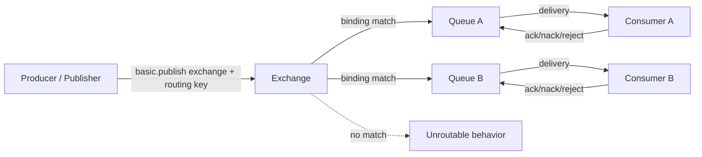
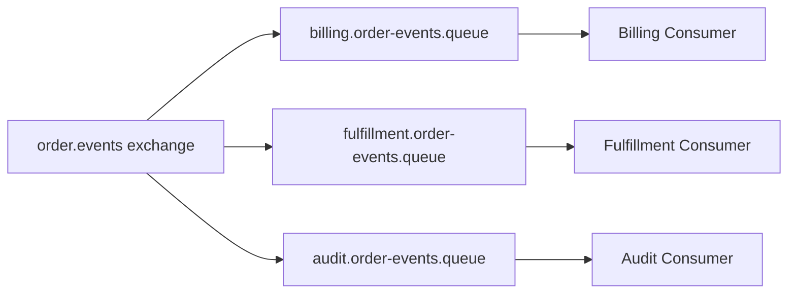
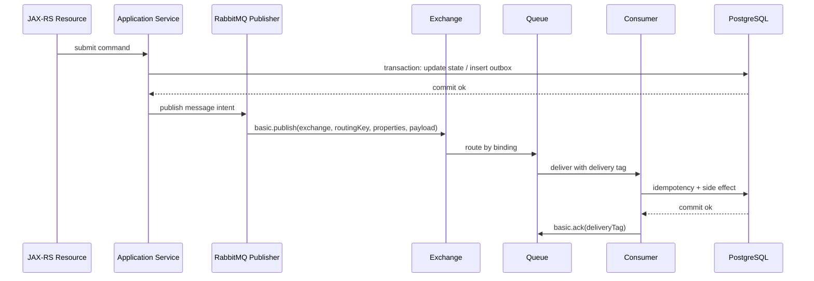

# AMQP Mental Model

## 1. Core idea

AMQP 0-9-1 adalah model messaging yang memisahkan **publisher**, **exchange**, **binding**, **queue**, dan **consumer**. Dalam RabbitMQ, producer tidak berpikir "kirim ke consumer". Producer berpikir "publish message ke exchange dengan routing key". Exchange lalu memutuskan queue mana yang menerima message berdasarkan binding.

Mental model paling penting:

```text
Producer / Publisher
  -> publish to exchange with routing key
  -> exchange evaluates bindings
  -> matching queue receives message
  -> broker delivers message to consumer
  -> consumer ack/nack/rejects delivery
```

Ini berbeda dari Kafka, Redis Stream, atau database queue. AMQP terasa berbeda karena **routing adalah primitive utama**, bukan sekadar topic log atau table polling.

---

## 2. Why AMQP feels different

Banyak engineer baru salah memahami RabbitMQ sebagai:

```text
send(message, queueName)
```

Padahal mental model AMQP yang sehat adalah:

```text
publish(exchangeName, routingKey, properties, payload)
```

Queue bukan satu-satunya object penting. Queue adalah tempat message menunggu consumer. Tetapi keputusan message masuk ke queue mana dilakukan oleh exchange melalui binding.

AMQP terasa berbeda karena:

- producer tidak harus tahu queue;
- producer tidak harus tahu consumer;
- routing bisa berubah dengan menambah/mengubah binding;
- satu publish bisa masuk ke nol, satu, atau banyak queue;
- queue adalah delivery contract ke consumer;
- acknowledgement terjadi pada delivery ke consumer, bukan pada publish intent;
- connection dan channel adalah resource penting;
- delivery tag scoped ke channel;
- virtual host memisahkan namespace dan permission.

---

## 3. Big picture diagram



Important observation:

- publish confirmation is about broker receiving/persisting publish according to mode;
- consumer acknowledgement is about a specific delivery being processed;
- routing failure is a separate problem;
- queue backlog is a separate operational state;
- consumer processing correctness is a separate application concern.

---

## 4. AMQP 0-9-1 in RabbitMQ

AMQP 0-9-1 defines the main messaging vocabulary used by RabbitMQ classic AMQP clients:

- connection;
- channel;
- exchange;
- queue;
- binding;
- routing key;
- publish;
- consume;
- delivery;
- acknowledgement;
- reject/nack;
- transaction/confirm modes;
- basic properties.

RabbitMQ implements AMQP 0-9-1 and extends it with broker-specific features, policies, plugins, queue types, management UI, quorum queues, streams, and operational behavior.

Separate these layers:

| Layer | Example |
|---|---|
| AMQP concept | exchange, queue, binding, channel, ack |
| RabbitMQ broker/runtime | node, cluster, vhost, policy, alarm, plugin |
| RabbitMQ Java client | ConnectionFactory, Connection, Channel, DeliverCallback |
| Queue type implementation | classic queue, quorum queue, stream |
| Deployment model | Kubernetes, VM, managed cloud, on-prem |
| Internal team convention | naming, vhost, routing key, retry topology |

When reading code, ask: is this AMQP standard behavior, RabbitMQ behavior, Java client behavior, or internal convention?

---

## 5. Producer vs publisher

In many conversations, producer and publisher are used interchangeably. For precision:

- **Producer**: application component that decides a message should exist.
- **Publisher**: technical component that sends message to RabbitMQ.

Example in Java/JAX-RS:

```text
QuoteApplicationService decides QuoteSubmitted event should be emitted.
RabbitMqPublisher serializes and publishes it to exchange.
```

Why this distinction matters:

- business producer owns message intent;
- publisher abstraction owns broker protocol behavior;
- outbox table may sit between producer and publisher;
- publisher confirm belongs to publisher;
- idempotency and business invariant usually belong to producer/service layer;
- retry publish may duplicate technical publish and must preserve business identity.

Bad design smell:

```text
JAX-RS resource method directly opens channel and publishes raw JSON.
```

Better design:

```text
JAX-RS Resource -> Application Service -> Domain decision -> Outbox/Publisher abstraction
```

---

## 6. Consumer

A consumer is an application component that receives deliveries from a queue.

Important: consumer consumes from **queue**, not directly from exchange.

Consumer responsibilities:

1. Deserialize payload.
2. Validate message contract/version.
3. Extract metadata: message id, correlation id, tenant id, trace id.
4. Apply idempotency guard.
5. Execute business side effect.
6. Decide ack/nack/reject.
7. Emit metrics and logs.
8. Handle shutdown safely.

A consumer is not merely a callback. It is a correctness boundary.

Consumer failures are normal:

- validation failure;
- downstream timeout;
- database deadlock;
- duplicate message;
- poison message;
- schema mismatch;
- missing permission;
- deserialization failure;
- application deploy rollback;
- pod termination.

Consumer design must assume delivery can happen again.

---

## 7. Exchange

An exchange receives published messages and routes them to queues through bindings.

Producer publishes to an exchange using:

```text
exchange name
routing key
properties
payload
```

Exchange types include:

- default exchange;
- direct exchange;
- topic exchange;
- fanout exchange;
- headers exchange;
- plugin-specific exchanges if enabled.

Exchange design questions:

- Is the exchange domain-specific or shared?
- Is it for commands, events, tasks, or replies?
- Is the exchange durable?
- Is it internal-only?
- Does it have alternate exchange?
- Who owns changes to bindings?
- Are routing keys governed?

A common senior-level point: exchange is part of the contract. It is not just infrastructure plumbing.

---

## 8. Queue

A queue stores messages until consumers receive and acknowledge them.

A queue represents delivery isolation.

Queue design questions:

- Who owns the queue?
- Which service consumes it?
- Is it durable?
- Is it classic, quorum, stream, priority, exclusive, or auto-delete?
- What DLX does it use?
- What retry topology points to it?
- What is expected queue depth?
- What is acceptable message age?
- How many consumers should it have?
- Is ordering important?

In pub/sub, each subscriber usually gets its own queue. This prevents a slow subscriber from blocking every other subscriber.



Queue names and ownership conventions are internal and must be verified.

---

## 9. Binding

A binding connects an exchange to a queue. It says:

```text
Messages from this exchange with matching routing criteria should be copied/enqueued into this queue.
```

For direct/topic exchange, binding typically includes binding key.

Examples:

```text
exchange: quote.events
type: topic
queue: audit.quote-events.queue
binding key: quote.*
```

```text
exchange: order.commands
type: direct
queue: fulfillment.create-order.queue
binding key: order.create
```

Binding design is subscription design.

Risks:

- binding too broad;
- binding too narrow;
- stale binding left after service decommission;
- duplicate bindings create duplicate deliveries to same queue depending topology;
- wrong routing key causes missing messages;
- no alternate exchange for unroutable messages;
- topology differs across environments.

---

## 10. Routing key

Routing key is a string supplied by publisher. Exchange uses it to route messages.

A good routing key is:

- stable;
- intentional;
- documented;
- versioning-aware if needed;
- not overloaded with sensitive data;
- not accidentally tenant-leaking;
- not too generic;
- not too implementation-specific.

Example topic routing key style:

```text
quote.submitted
quote.approved
quote.rejected
order.created
order.fulfillment.requested
```

Avoid routing keys like:

```text
message
event
update
process
service1.service2.payload
john.customer.12345.secret
```

Routing key is not a payload. Do not put PII or unstable business values in routing key unless the internal security and tenancy model explicitly allows it.

---

## 11. Message

A message consists of:

```text
properties + headers + payload
```

Payload is the business data or command/event body. Properties and headers carry metadata used by broker, consumers, tracing, compatibility, retry, and debugging.

Message design should answer:

- What does this message mean?
- Is it command, event, task, reply, or integration handoff?
- Who owns schema?
- Is schema versioned?
- What is the idempotency key?
- What correlation ID links it to request/workflow?
- What tenant/security context is needed?
- What should consumers do if unknown fields appear?
- What fields are required vs optional?
- What is safe to log?

Message identity is crucial. Without stable message ID or business idempotency key, duplicate handling becomes guesswork.

---

## 12. Header

Headers are key-value metadata carried with the message.

Common application headers:

- `message-id` or custom equivalent;
- `correlation-id`;
- `causation-id`;
- `traceparent`;
- `tenant-id`;
- `actor-id`;
- `source-service`;
- `message-type`;
- `message-version`;
- `published-at`;
- `retry-count` if application-managed;
- content/schema information.

RabbitMQ also adds or preserves broker-related headers in some flows, such as dead-letter metadata (`x-death`) when message is dead-lettered.

Header discipline matters because production debugging often depends on metadata. A payload-only message may work in dev and become opaque in production.

---

## 13. Property

AMQP basic properties include common fields such as:

- content type;
- content encoding;
- delivery mode;
- priority;
- correlation id;
- reply-to;
- expiration;
- message id;
- timestamp;
- type;
- user id;
- app id;
- headers.

Examples of property-level concerns:

| Property | Why it matters |
|---|---|
| `contentType` | Consumer knows JSON/Avro/Protobuf/etc. |
| `deliveryMode` | Persistent vs transient behavior |
| `correlationId` | Request/workflow traceability |
| `replyTo` | Request-reply/RPC pattern |
| `expiration` | Per-message TTL |
| `messageId` | Idempotency/debugging |
| `type` | Message classification |
| `timestamp` | Age/latency diagnosis |

Do not assume every property is used by internal conventions. Verify what the team standardizes.

---

## 14. Payload

Payload is the serialized message body.

Typical payload formats:

- JSON;
- Avro if used;
- Protobuf if used;
- XML for legacy integration;
- binary payload for specialized use cases.

Payload must be designed as a contract, not as "whatever the current Java class serializes".

Checklist:

- Is it schema-versioned?
- Are fields backward compatible?
- Are required fields truly required?
- Are optional fields handled by old consumers?
- Are enum additions safe?
- Is timestamp timezone explicit?
- Is decimal/money represented safely?
- Is payload size bounded?
- Is PII allowed?
- Is data duplicated from source of truth intentionally?

Avoid serializing internal entity objects directly. Entity models change for persistence reasons, while message contracts change for integration reasons.

---

## 15. Connection

A connection is a TCP connection between client and RabbitMQ broker.

In Java client terms, connection is relatively heavy and usually long-lived.

Bad pattern:

```text
Open connection per message.
Publish.
Close connection.
```

Better pattern:

```text
Create long-lived connection per application instance or component.
Create channels for publishing/consuming according to concurrency model.
Close gracefully on shutdown.
```

Connection concerns:

- heartbeat;
- TLS;
- authentication;
- network interruption;
- blocked connection due to broker alarm;
- automatic recovery;
- reconnect storm during broker failover;
- connection count limit;
- Kubernetes pod lifecycle;
- load balancer behavior.

In production, too many connections can become a broker problem. Too few or poorly shared connections can become an application bottleneck.

---

## 16. Channel

A channel is a virtual connection multiplexed over a TCP connection. AMQP operations happen on channels.

Important points:

- channels are lighter than connections;
- channels are not generally meant to be shared unsafely across threads;
- delivery tags are scoped to a channel;
- ack must happen on the same channel that received the delivery;
- publisher confirm state is channel-specific;
- channel closure can invalidate in-flight operations;
- excessive channel count can indicate leak.

Mental model:

```text
Connection = network pipe
Channel    = protocol session inside the pipe
```

Common Java design:

- publisher channel per publishing thread or protected publisher abstraction;
- consumer channel per consumer/concurrency unit;
- do not ack a message from a random channel;
- close channel gracefully during shutdown;
- observe channel count.

---

## 17. Virtual host

A virtual host, or vhost, is a namespace and permission boundary in RabbitMQ.

Each vhost has its own:

- exchanges;
- queues;
- bindings;
- permissions;
- policies;
- runtime parameters.

Vhost can separate:

- environments;
- applications;
- business domains;
- tenants, if architecture chooses that;
- integration zones.

Risks:

- one shared vhost for too many unrelated services;
- service user has configure/write/read on everything;
- dev/stage/prod topology conventions differ;
- queue names collide;
- policy changes affect unrelated workloads;
- tenant isolation is assumed but not implemented.

For CSG/team, verify actual vhost strategy. Do not infer tenancy or environment isolation from RabbitMQ defaults.

---

## 18. Delivery tag

A delivery tag identifies a delivery on a channel. It is used when acknowledging, rejecting, or nacking.

Important:

```text
Delivery tag is scoped to channel.
```

This means:

- ack must be sent on same channel;
- delivery tag is not global message ID;
- delivery tag is not stable across redelivery;
- do not store delivery tag as business idempotency key;
- do not confuse delivery tag with message id.

Example failure:

```text
Consumer receives message on Channel A.
Application passes work to async thread.
Async thread attempts ack on Channel B.
Channel-level error occurs.
Message may be redelivered.
```

Correctness point: if processing is delegated to worker threads, channel ownership and ack path must be designed explicitly.

---

## 19. Acknowledgement

Acknowledgement tells RabbitMQ that a delivery has been successfully processed and can be removed from the queue.

Manual ack is usually required for serious backend processing.

Bad pattern:

```text
Ack immediately after receiving message.
Then process DB update.
```

If the app crashes after ack but before DB update, the message is lost from broker perspective.

Better pattern:

```text
Receive message.
Validate.
Check idempotency.
Execute durable side effect.
Commit DB transaction.
Ack.
```

Manual ack means consumer owns the correctness decision.

Ack timing is one of the most important decisions in RabbitMQ systems.

---

## 20. Nack

Negative acknowledgement indicates the consumer cannot process the message successfully.

With nack, consumer can choose whether to requeue.

```text
nack(requeue=true)  -> message can be redelivered
nack(requeue=false) -> message can be dead-lettered or dropped depending topology
```

Use `requeue=true` carefully. It can create immediate redelivery loop:

```text
Consumer fails message
nack requeue true
Broker redelivers quickly
Consumer fails again
CPU/logs explode
useful messages blocked
```

For transient failures, prefer explicit retry topology with delay and max attempts. For permanent failures, prefer DLQ/parking lot with reason recorded.

---

## 21. Reject

Reject is similar to nack for a single message, but nack supports additional features such as multiple messages. In practice, understand your client/library behavior and team convention.

Reject decision:

```text
reject(requeue=false)
```

often means:

- do not process now;
- route to DLX if configured;
- otherwise message may be dropped.

Reject is appropriate for:

- invalid schema;
- impossible business state;
- unsupported version;
- poison message;
- unauthorized tenant/context;
- non-retryable error.

But only if DLQ/dead-letter strategy exists and is monitored.

---

## 22. Redelivery

Redelivery means RabbitMQ delivered a message again after it was not successfully acknowledged.

Reasons include:

- consumer crashed;
- channel closed before ack;
- connection lost;
- message nacked/rejected with requeue;
- broker requeued unacked deliveries;
- application explicitly republished retry message.

Redelivery is normal in at-least-once systems.

Consumer must treat redelivery as expected, not exceptional.

Key implications:

- redelivered message may already have caused side effect;
- idempotency is mandatory;
- logs should include message ID and redelivery flag;
- redelivery storm is an incident signal;
- redelivery can break apparent ordering;
- poison messages must be isolated.

---

## 23. Consumer tag

Consumer tag identifies a consumer subscription on a channel.

It matters for:

- consumer cancellation;
- tracking active consumers;
- debugging which consumer subscription is receiving messages;
- graceful shutdown;
- broker-initiated cancellation.

A consumer process/pod is not the same as a consumer tag. One application instance can create multiple consumers, and each consumer has a tag.

During shutdown, the consumer should stop receiving new deliveries, drain in-flight messages if possible, then ack/nack appropriately, then close channel/connection.

---

## 24. Broker-side routing

Routing happens inside broker, not in producer code.

Producer supplies:

```text
exchange + routing key + message
```

Broker evaluates:

```text
exchange type + bindings + binding keys/arguments
```

Outcome:

```text
zero queues matched
one queue matched
multiple queues matched
```

Zero queues matched is dangerous if ignored.

Mitigations:

- mandatory flag + return listener;
- alternate exchange;
- publisher metrics for returned messages;
- topology validation in CI/CD;
- startup topology assertion;
- environment parity check.

Do not assume publish success means message reached a queue. Publish success and route success are different concepts.

---

## 25. Publish success vs route success vs process success

RabbitMQ systems have multiple success boundaries.

| Boundary | What it means | How to observe |
|---|---|---|
| Application decision success | Service decided message should exist | DB/outbox/application log |
| Publish call success | Client sent publish frame | Client result/log |
| Publisher confirm | Broker accepted publish according to confirm mode | Confirm listener/metric |
| Route success | Message matched queue | mandatory return/alternate exchange/topology |
| Queue enqueue | Message is in queue | queue depth/management UI |
| Delivery success | Broker delivered to consumer | deliver rate/unacked |
| Processing success | Consumer completed side effect | app metric/DB state |
| Ack success | Broker removed delivery from queue | ack rate/unacked decreases |

A production incident often happens because teams collapse all these into "sent message".

Senior vocabulary should be precise:

- "published" is not necessarily "routed";
- "delivered" is not necessarily "processed";
- "processed" is not necessarily "acked";
- "acked" is not necessarily "business result visible to user" if side effect is elsewhere.

---

## 26. AMQP lifecycle from Java/JAX-RS request

Conceptual lifecycle:



Potential failure windows:

- transaction commits but publish fails;
- publish confirms but route fails;
- message routed but consumer down;
- consumer processes but ack fails;
- ack succeeds but downstream effect is not as expected;
- retry reprocesses stale business intent.

This is why Part 023 and Part 024 later cover outbox and inbox patterns.

---

## 27. AMQP object responsibility map

| Object | Owned by | Main design concern |
|---|---|---|
| Exchange | Platform/app/domain owner | Routing contract |
| Queue | Consumer owner | Delivery isolation and backlog |
| Binding | Subscriber/topology owner | Subscription intent |
| Routing key | Message contract owner | Addressing and compatibility |
| Message payload | Producer + consumer contract | Schema and meaning |
| Message headers | Platform/app convention | Traceability and governance |
| Connection | Client runtime | Network lifecycle |
| Channel | Client runtime | Protocol session/threading/ack scope |
| Delivery tag | Broker/channel delivery | Ack/nack target |
| Consumer tag | Broker/channel subscription | Consumer lifecycle |
| Vhost | Platform/security owner | Namespace and permission boundary |

Ownership must be explicit. Unowned topology becomes production debt.

---

## 28. AMQP and PostgreSQL transaction boundary

AMQP publish and PostgreSQL transaction are separate systems. A normal database transaction cannot atomically commit RabbitMQ publish unless you build a pattern around it.

Risk:

```text
DB transaction commits quote state.
Application crashes before publish.
No message is produced.
Async downstream never runs.
```

Risk:

```text
Publish succeeds.
DB transaction rolls back.
Consumer sees event for state that does not exist.
```

Safer pattern:

```text
Within DB transaction:
  update business state
  insert outbox row
Commit
Outbox poller publishes to RabbitMQ
Publisher confirm received
Mark outbox row published
```

For consumers:

```text
Begin DB transaction
Check inbox/idempotency record
Apply business side effect
Commit
Ack message
```

AMQP alone does not solve DB consistency. It exposes the need for explicit consistency patterns.

---

## 29. AMQP and microservice consistency

AMQP makes distributed consistency visible.

A message may represent:

- intent to do something;
- fact that something happened;
- task to execute;
- response to prior request;
- integration handoff.

Each has different consistency semantics.

### Command

```text
Please create order from quote.
```

Consumer owns decision/result. Duplicate command must be safe.

### Event

```text
Quote was approved.
```

Producer asserts fact. Consumer reacts independently. Producer should not depend on every consumer finishing immediately.

### Task

```text
Generate PDF for quote.
```

Work distribution. Retry and idempotency are central.

### Integration handoff

```text
Send order payload to downstream fulfillment platform.
```

Audit, replay, and privacy become central.

Do not mix these meanings casually.

---

## 30. AMQP in Kubernetes/cloud/on-prem

AMQP concepts are stable, but deployment affects behavior.

### Kubernetes

- pod termination can close consumer connection;
- rolling update can redeliver in-flight messages;
- DNS/LB behavior affects reconnect;
- resource limits affect consumer throughput;
- prefetch multiplied by replicas increases in-flight count;
- secrets and TLS certificates rotate through Kubernetes mechanisms.

### AWS/Azure managed broker

- broker endpoints, TLS, maintenance windows, and limits may be provider-specific;
- monitoring integration may use CloudWatch/Azure Monitor plus RabbitMQ metrics;
- network security groups/private connectivity matter;
- upgrades and failover behavior must be verified.

### On-prem/hybrid

- firewall, certificate, DNS, routing, and latency issues are common;
- cross-zone/cross-region links can affect heartbeat and confirm latency;
- responsibility boundary between app team and platform/SRE must be explicit.

AMQP code may look the same, but production behavior changes with deployment topology.

---

## 31. Failure modes by AMQP concept

| Concept | Failure mode | Detection |
|---|---|---|
| Exchange | Wrong exchange name/type | Publish return, topology check, management UI |
| Binding | Missing/wrong binding | Unroutable messages, queue not receiving |
| Routing key | Typo or incompatible change | Returned messages, missing queue depth |
| Queue | Consumer queue absent or wrong type | Topology diff, management UI |
| Connection | Network/TLS/auth failure | Client logs, connection metrics |
| Channel | Closed due to protocol error | Channel close logs/metrics |
| Delivery tag | Ack on wrong channel | Channel exception, redelivery |
| Ack | Ack before processing | Lost processing after crash |
| Nack/requeue | Infinite redelivery loop | Redelivery spike, logs, unacked churn |
| Vhost | Wrong namespace/permission | Auth/permission errors |
| Header | Missing metadata | Debugging/tracing blind spot |
| Payload | Schema mismatch | Deserialization/validation DLQ |

---

## 32. Debugging AMQP routing issue

Symptom:

```text
Producer says it published, but consumer receives nothing.
```

Debug path:

1. Verify publisher is using expected vhost.
2. Verify exchange name exactly matches expected exchange.
3. Verify exchange type.
4. Verify routing key emitted by producer.
5. Verify binding key/arguments.
6. Verify target queue exists.
7. Verify message is not returned as unroutable.
8. Verify alternate exchange if configured.
9. Verify queue depth after publish.
10. Verify consumer count.
11. Verify consumer is connected to same vhost/queue.
12. Verify permissions allow write/read.
13. Verify environment parity: dev/stage/prod topology.

Do not jump to "consumer bug" before checking exchange and binding.

---

## 33. Debugging AMQP consumer issue

Symptom:

```text
Queue depth is increasing.
```

Debug path:

1. Are consumers connected?
2. Is consumer count zero?
3. Are messages ready or unacked?
4. Is deliver rate lower than publish rate?
5. Is ack rate lower than deliver rate?
6. Are consumers failing and requeueing?
7. Is redelivery rate increasing?
8. Is prefetch too high or too low?
9. Is downstream DB/API slow?
10. Are pods restarting?
11. Are channels closing due to ack misuse?
12. Are messages poison due to schema/data issue?
13. Is DLQ growing?

Queue depth is not always broker problem. It is often consumer/downstream problem.

---

## 34. Correctness concern: duplicate delivery

AMQP with RabbitMQ commonly gives at-least-once delivery when using manual ack and durable messaging patterns. At-least-once means duplicate delivery can happen.

Duplicate scenarios:

- consumer processes DB update then crashes before ack;
- ack frame lost due to connection close;
- publisher retries after confirm timeout;
- replay from DLQ republishes old message;
- retry topology republishes message;
- consumer manually nacks/requeues.

Therefore message must carry stable identity.

Consumer must enforce idempotency using:

- business key;
- message ID;
- inbox table;
- processed message table;
- state transition guard;
- unique constraint;
- idempotent downstream API if available.

Do not rely on RabbitMQ to prevent duplicate business effects.

---

## 35. Performance concern: connection/channel model

Performance problems can start from poor client model.

Bad patterns:

- connection per message;
- channel per message without pooling/lifecycle control;
- sharing one channel across many threads unsafely;
- too many channels from each pod;
- no publisher confirm batching;
- prefetch set arbitrarily;
- consumer thread pool larger than DB pool;
- no graceful shutdown, causing redelivery burst.

Better approach:

- long-lived connection;
- controlled channel lifecycle;
- explicit publisher concurrency model;
- explicit consumer concurrency model;
- prefetch based on processing latency and downstream capacity;
- metrics for connection/channel/publish/ack/redelivery.

---

## 36. Security/privacy concern: vhost, permission, and metadata

AMQP operations require permissions. A service should not have broad configure/write/read permissions unless necessary.

Permission concerns:

- Can producer write only to intended exchange?
- Can consumer read only intended queue?
- Can application declare topology, or is topology managed separately?
- Are topic permissions used if needed?
- Is vhost shared too broadly?
- Are credentials rotated?
- Are routing keys or headers leaking tenant/PII?
- Are DLQ and replay tools access-controlled?

Headers and routing keys are often logged. Treat them as potentially visible operational metadata.

---

## 37. Observability concern: AMQP-level metrics

Minimum metrics around AMQP usage:

### Publisher

- publish attempts;
- publish success/failure;
- publisher confirm latency;
- confirm timeout;
- returned/unroutable messages;
- connection blocked duration;
- channel errors;
- serialization errors.

### Consumer

- delivery count;
- processing success/failure;
- ack count;
- nack/reject count;
- redelivery count;
- processing latency;
- unacked messages;
- deserialization/validation failures;
- idempotency duplicate count.

### Broker/topology

- queue depth;
- ready/unacked messages;
- consumer count;
- publish/deliver/ack rate;
- DLQ depth;
- retry queue depth;
- connection/channel count;
- resource alarms.

If a message cannot be traced by correlation ID across producer, broker, consumer, and DB side effect, production debugging will be slow.

---

## 38. PR review checklist

### AMQP object usage

- Is producer publishing to exchange, not hardcoding queue semantics accidentally?
- Is exchange name correct and owned?
- Is routing key documented?
- Is target queue/binding known?
- Is vhost correct?
- Are permissions least-privilege?

### Message contract

- Is message type clear?
- Is payload schema stable?
- Is content type set?
- Is message ID set?
- Is correlation ID propagated?
- Is tenant/source metadata included where needed?
- Is payload safe for queue/DLQ/log retention?

### Publisher behavior

- Is publisher confirm required and enabled?
- Are unroutable messages detected?
- Is mandatory flag/alternate exchange considered?
- Is publish failure handled?
- Is outbox needed?

### Consumer behavior

- Is manual ack used?
- Is ack after durable side effect?
- Is nack/reject policy clear?
- Is requeue loop prevented?
- Is idempotency enforced?
- Is delivery tag handled on correct channel?
- Is graceful shutdown handled?

### Operations

- Are queue depth, unacked, redelivery, and DLQ metrics visible?
- Is retry/DLQ topology documented?
- Is replay safe and governed?
- Is owner/on-call clear?

---

## 39. Internal verification checklist

### AMQP topology

- What vhost does the application use?
- What exchanges are declared or referenced?
- What exchange types are used?
- What queues are bound?
- What binding keys/arguments exist?
- What routing keys are emitted by producers?
- Are topology declarations in code, Helm, operator CRD, Terraform, definitions file, or manual broker config?
- Is topology drift checked across environments?

### Producer implementation

- Which Java client/library is used?
- Is there a shared publisher abstraction?
- Does it use publisher confirm?
- Does it set mandatory flag?
- Does it handle returned messages?
- Does it set content type, message ID, correlation ID, timestamp, app ID?
- Does it publish directly from request thread or via outbox?
- How are publish retries handled?

### Consumer implementation

- Is consumer manual ack or auto ack?
- Where does ack happen relative to DB commit?
- Is nack/reject used?
- Is requeue true used anywhere?
- Is prefetch configured?
- Is delivery tag ever passed across threads?
- Is channel shared across threads?
- Is graceful shutdown implemented?

### Message contract

- Where are message schemas documented?
- Are message versions used?
- Are breaking changes reviewed?
- Are contract tests present?
- Are headers standardized?
- Is trace/correlation propagation implemented?

### Operations

- Which dashboard shows route/queue/consumer metrics?
- Are unroutable messages alerted?
- Is DLQ monitored?
- Is redelivery rate monitored?
- Is replay procedure documented?
- Who owns RabbitMQ topology changes?

---

## 40. Common anti-patterns

### Anti-pattern 1: Queue name as API

Producer publishes directly to queue through default exchange without consciously owning that coupling.

Problem:

- producer now depends on consumer queue name;
- refactoring queue breaks producer;
- routing flexibility lost.

### Anti-pattern 2: Auto ack for business processing

Consumer auto-acks before processing.

Problem:

- crash after delivery loses message;
- downstream failure cannot be retried safely by broker.

### Anti-pattern 3: Requeue everything

Consumer nacks with requeue true for all errors.

Problem:

- poison messages loop forever;
- useful messages starve;
- logs explode;
- broker and consumer waste CPU.

### Anti-pattern 4: No message identity

Messages lack stable message ID or business idempotency key.

Problem:

- duplicate delivery cannot be safely detected;
- replay becomes dangerous;
- audit/debugging weak.

### Anti-pattern 5: Routing key as data dumping ground

Routing key contains tenant/customer/order data casually.

Problem:

- privacy leakage;
- high-cardinality operational labels;
- unstable routing contract;
- hard-to-manage bindings.

### Anti-pattern 6: Topology only exists in someone's memory

Exchange/queue/binding setup is manual and undocumented.

Problem:

- environment drift;
- disaster recovery fragile;
- onboarding slow;
- PR review incomplete.

---

## 41. Senior mental model recap

AMQP is not hard because of syntax. It is hard because it creates multiple independent correctness boundaries.

Think in layers:

```text
Business intent
  -> message contract
  -> publish mechanics
  -> exchange routing
  -> queue delivery state
  -> consumer processing
  -> acknowledgement
  -> retry/DLQ/replay
  -> observability and operations
```

For every message flow, be able to answer:

1. What is the message meaning?
2. What exchange receives it?
3. What routing key is used?
4. Which queues match?
5. Who owns each queue?
6. How does publisher know broker accepted it?
7. How does publisher know it was routable?
8. How does consumer decide ack/nack/reject?
9. How is duplicate handled?
10. How is failure observed and recovered?

---

## 42. Practical exercises

### Exercise 1: Draw AMQP topology

Pick one real message flow and draw:

```text
producer -> exchange -> binding -> queue -> consumer
```

Add:

- vhost;
- routing key;
- exchange type;
- queue type;
- DLX/retry queue if any;
- owner per object.

### Exercise 2: Trace delivery tag and ack

In consumer code, find:

- where delivery is received;
- where delivery tag is captured;
- what channel is used;
- where ack happens;
- what happens on exception;
- what happens on shutdown.

### Exercise 3: Verify routability

For one producer:

- identify exchange;
- identify routing key;
- find matching binding;
- confirm target queue;
- check whether mandatory/return listener or alternate exchange exists.

### Exercise 4: Inspect message metadata

Capture or inspect one message sample in a safe lower environment.

Check:

- content type;
- message id;
- correlation id;
- traceparent;
- tenant/source metadata;
- schema version;
- timestamp;
- retry/death headers if applicable.

### Exercise 5: Explain to another engineer

Explain why "message was published" does not necessarily mean:

- message reached a queue;
- consumer received it;
- consumer processed it;
- DB state changed;
- ack succeeded;
- user-visible outcome completed.

If you can explain that clearly, you understand the AMQP mental model.

---

## 43. Key takeaways

- AMQP separates producer, exchange, binding, queue, and consumer.
- Producer publishes to exchange with routing key; consumer consumes from queue.
- Binding is subscription/routing rule, not application code.
- Publish success, route success, delivery success, processing success, and ack success are different boundaries.
- Connection is a TCP-level client connection; channel is an AMQP protocol session.
- Delivery tag is scoped to channel and is not message identity.
- Manual ack is central to correctness.
- Redelivery is expected; idempotency is mandatory.
- Vhost is namespace and permission boundary.
- AMQP concepts must be mapped carefully to Java/JAX-RS, PostgreSQL transaction boundaries, Kubernetes lifecycle, and production observability.
