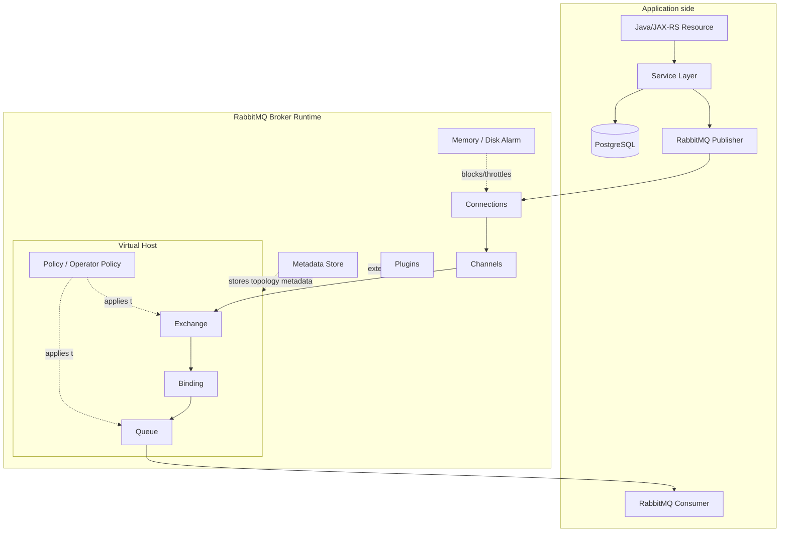

# RabbitMQ Architecture Mental Model

## 1. Core idea

RabbitMQ bukan hanya queue dan bukan sekadar library Java. RabbitMQ adalah **broker runtime**: proses server yang hidup terpisah dari aplikasi Java/JAX-RS, memiliki node, cluster, virtual host, exchange, queue, binding, connection, channel, policy, plugin, metadata, storage, alarm, dan failure model sendiri.

Mental model yang benar:

```text
Java/JAX-RS service bukan menjalankan RabbitMQ.
Java/JAX-RS service hanya menjadi client RabbitMQ.
RabbitMQ broker adalah runtime infrastruktur yang menerima, meroute, menyimpan, dan mendeliver message.
```

Dalam production system, RabbitMQ harus dipahami sebagai sistem stateful. Ia punya memory pressure, disk pressure, network pressure, cluster coordination, queue leadership, permission model, dan operational lifecycle. Karena itu, desain messaging tidak cukup hanya melihat method `basicPublish()` atau `basicConsume()`.

Senior engineer perlu bisa menjawab:

- broker mana yang menerima publish?
- exchange mana yang menjadi routing boundary?
- queue mana yang menjadi delivery boundary?
- vhost mana yang menjadi isolation boundary?
- policy mana yang mengubah behavior queue/exchange?
- apakah queue replicated atau single-node?
- apakah message stuck karena consumer, broker, flow control, permission, routing, atau disk?
- bagaimana client Java bereaksi saat connection blocked, channel closed, atau broker failover?

---

## 2. Architecture map

Gambaran konseptual RabbitMQ:



Diagram ini adalah model umum, bukan topology internal CSG. Nama exchange, queue, vhost, policy, plugin, dan deployment actual harus diverifikasi di internal team.

---

## 3. Broker vs client code

Perbedaan paling penting:

| Layer | Contoh | Tanggung jawab |
|---|---|---|
| Application client | Java publisher/consumer | Membuka connection/channel, publish, consume, ack, nack, retry client-side, metrics aplikasi |
| Broker runtime | RabbitMQ node/cluster | Routing, enqueue, delivery, resource alarm, permissions, queue storage, replication, topology runtime |
| Platform layer | Kubernetes/cloud/on-prem | Storage, network, secret, TLS, service discovery, pod/node lifecycle, backup, upgrade |
| Domain data layer | PostgreSQL/MyBatis/JDBC | Source of truth business state, transaction boundary, idempotency/outbox/inbox |

Kesalahan umum adalah menganggap semua problem RabbitMQ bisa diperbaiki di Java code. Sebagian problem memang ada di Java client, tetapi banyak problem terjadi di broker topology, policy, permission, disk, memory, cluster, atau network.

Contoh pemisahan diagnosis:

| Symptom | Kemungkinan layer |
|---|---|
| Publish call lambat | Broker flow control, network, confirm wait, disk IO, Java thread pool |
| Message tidak sampai queue | Exchange/routing key/binding/permission/mandatory flag |
| Queue depth naik | Consumer down, consumer lambat, prefetch salah, downstream DB lambat |
| Unacked naik | Consumer menerima delivery tetapi tidak ack, stuck processing, DB/external call lambat |
| Redelivery tinggi | Consumer crash, nack/requeue loop, ack setelah side effect gagal |
| Connection blocked | Broker memory/disk alarm atau flow control |
| Channel closed | Protocol error, ack delivery tag salah, publish ke topology invalid, permission issue |

---

## 4. Broker

Broker adalah server RabbitMQ yang menerima connection dari client. Di production, broker menjalankan beberapa tanggung jawab utama:

- menerima TCP/TLS connection dari producer dan consumer;
- melakukan authentication dan authorization;
- mengelola AMQP channel;
- menyimpan topology metadata seperti exchange, queue, binding, user permission, policy;
- menjalankan exchange routing;
- mengelola queue process dan delivery;
- menjalankan plugin seperti management, Prometheus, stream, shovel, federation, atau plugin lain jika enabled;
- menegakkan alarm dan flow control saat resource pressure;
- berpartisipasi dalam cluster jika node tergabung dalam cluster.

Broker bukan tempat business logic. Business logic tetap berada di service/application. Broker hanya mengatur message flow.

Namun broker tetap menjadi bagian critical dari correctness karena broker menentukan:

- apakah message diterima;
- apakah message diroute;
- apakah message disimpan;
- apakah delivery terjadi;
- apakah message bisa redelivered;
- apakah producer harus diblock;
- apakah queue tetap available saat node failure.

---

## 5. Node

Node adalah satu instance RabbitMQ broker. Dalam deployment sederhana, satu node dapat melayani semua publish/consume. Dalam production, sering ada beberapa node dalam cluster untuk availability dan capacity.

Poin penting:

- node memiliki identity;
- node memiliki runtime process;
- node memiliki local resource: CPU, memory, disk, network;
- node dapat host queue leader atau queue replica tergantung queue type;
- node dapat mengalami restart, overload, partition, atau disk pressure;
- client biasanya connect melalui DNS/load balancer/service endpoint, bukan langsung hardcode node individual.

Dalam Kubernetes, node RabbitMQ biasanya berjalan sebagai pod stateful dengan persistent volume. Dalam cloud-managed service, node detail sering disembunyikan, tetapi failure model tetap ada: maintenance, failover, connection drop, broker unavailable, alarm, dan quota.

### Failure awareness

| Node event | Dampak potensial |
|---|---|
| Node restart | Connection drop, channel close, consumer cancellation, redelivery |
| Disk penuh | Disk alarm, publish blocked, broker instability |
| Memory tinggi | Memory alarm, publisher blocked |
| Network partition | Cluster communication terganggu, queue availability risk |
| Node hosting queue leader down | Queue failover atau unavailable tergantung queue type/replica health |

---

## 6. Cluster

Cluster adalah beberapa RabbitMQ node yang bekerja sebagai satu logical broker environment. Cluster membuat topology dan metadata dapat dikelola lintas node, tetapi tidak otomatis berarti semua queue replicated dengan cara yang sama.

Hal yang perlu dipahami:

```text
Cluster membership != semua message aman di semua node.
Queue type dan replication model menentukan data safety.
```

Classic queue, quorum queue, dan stream memiliki behavior berbeda. Quorum queue menggunakan replication berbasis consensus dan punya konsep leader/follower. Stream juga memiliki konsep replica/leader. Classic queue punya behavior dan HA legacy consideration yang berbeda.

Cluster membantu:

- menyebarkan client connection;
- mengelola topology secara terpusat;
- meningkatkan availability jika queue dan client dirancang benar;
- mendukung queue replication untuk queue type tertentu;
- melakukan rolling upgrade dengan prosedur yang benar.

Cluster tidak menghapus kebutuhan untuk:

- publisher confirm;
- manual ack;
- durable topology;
- persistent message;
- idempotency;
- retry/DLQ;
- reconnection strategy;
- monitoring quorum/leader/replica health;
- runbook node failure.

---

## 7. Virtual host

Virtual host atau vhost adalah namespace isolation di RabbitMQ. Exchange, queue, binding, permission, dan policy berada dalam vhost tertentu.

Mental model:

```text
vhost = logical boundary untuk topology dan permission.
```

Vhost bisa dipakai untuk memisahkan:

- environment: dev/test/staging/prod;
- application group;
- tenant;
- domain boundary;
- integration boundary.

Namun vhost bukan security magic jika permission salah. Vhost harus dikombinasikan dengan user permission yang tepat.

### Risiko desain vhost

| Desain | Risiko |
|---|---|
| Semua service memakai satu vhost besar | Sulit ownership, blast radius besar, permission terlalu luas |
| Terlalu banyak vhost tanpa governance | Operational overhead dan observability terfragmentasi |
| User punya akses configure/write/read terlalu luas | Service bisa mengubah atau membaca topology yang bukan miliknya |
| Environment berbagi vhost | Risiko cross-environment message leakage |

---

## 8. Exchange, queue, and binding as topology objects

Topology RabbitMQ terdiri dari exchange, queue, dan binding.

```text
Exchange = routing decision point.
Binding = subscription/routing rule.
Queue = delivery buffer dan consumer isolation point.
```

Topology bisa dibuat secara manual, via IaC/GitOps, via application declaration, via operator, via import definitions, atau cloud-managed console. Dalam enterprise system, topology sebaiknya diperlakukan sebagai production artifact, bukan side effect acak saat aplikasi start.

### Exchange

Exchange menerima publish. Exchange tidak memproses business logic. Ia mencocokkan routing key/header dengan binding.

Pertanyaan review:

- exchange type apa?
- siapa owner exchange?
- apakah durable?
- apakah internal?
- apakah auto-delete?
- apakah alternate exchange ada?
- apakah exchange digunakan lintas domain?

### Queue

Queue menyimpan message untuk consumer. Queue adalah tempat backlog terlihat.

Pertanyaan review:

- queue type apa?
- durable atau temporary?
- siapa consumer owner?
- apakah queue punya DLX?
- apakah queue punya retry topology?
- apakah queue butuh ordering?
- apakah queue butuh HA/replication?
- apakah queue punya max length atau TTL?

### Binding

Binding menghubungkan exchange ke queue. Binding adalah routing contract.

Pertanyaan review:

- routing key apa yang match?
- apakah wildcard terlalu luas?
- apakah binding berubah tanpa compatibility plan?
- apakah ada queue yang tidak sengaja menerima terlalu banyak event?

---

## 9. Connection

Connection adalah koneksi TCP/TLS antara client dan broker. Satu aplikasi biasanya tidak membuka connection per message. Connection mahal dibanding channel.

Pola umum:

```text
Application process
  -> one or few RabbitMQ connections
  -> multiple channels
  -> publisher/consumer operations
```

Risiko connection:

- connection leak;
- terlalu banyak pod masing-masing membuka banyak connection;
- connection storm saat rolling deployment;
- heartbeat timeout;
- TLS misconfiguration;
- load balancer idle timeout;
- network partition;
- connection blocked karena broker flow control.

Untuk Java/JAX-RS service di Kubernetes, jumlah connection harus dilihat bersama replica count. Satu pod yang aman belum tentu aman saat diskalakan menjadi 100 pod.

---

## 10. Channel

Channel adalah virtual connection di atas connection AMQP. Channel memungkinkan banyak logical stream operasi di satu connection.

Poin penting:

- channel bukan thread-safe untuk digunakan sembarangan oleh banyak thread;
- delivery tag scoped ke channel;
- ack harus dilakukan pada channel yang menerima delivery;
- protocol error pada channel bisa menutup channel;
- publisher dan consumer sering lebih aman dipisahkan channel-nya;
- channel leak bisa membuat broker dan client resource habis.

Kesalahan umum Java code:

```text
Thread A menerima delivery di channel X.
Thread B mencoba ack delivery tag dari channel lain.
Hasil: channel error / unknown delivery tag / message redelivery risk.
```

Dalam design review, channel lifecycle harus eksplisit:

- siapa membuat channel?
- siapa menutup channel?
- apakah channel per thread, pooled, atau dedicated?
- bagaimana saat channel closed?
- bagaimana saat auto recovery berjalan?

---

## 11. Erlang process model awareness

RabbitMQ berjalan di atas Erlang/BEAM. Senior backend engineer tidak harus menjadi Erlang expert, tetapi perlu awareness bahwa broker terdiri dari banyak lightweight process internal.

Kenapa ini penting?

- queue, connection, channel, dan internal broker activities memiliki runtime representation;
- satu queue yang sangat panas bisa menjadi bottleneck tersendiri;
- banyak queue kecil juga punya overhead;
- banyak connection/channel juga punya overhead;
- alarm dan flow control terjadi karena broker runtime harus menjaga stabilitas internal.

Jangan gunakan awareness ini untuk micro-optimizing tanpa data. Gunakan untuk memahami bahwa RabbitMQ adalah runtime stateful dengan resource model nyata.

---

## 12. Metadata store: Mnesia/Khepri awareness

RabbitMQ menyimpan metadata seperti topology, users, permissions, policies, runtime parameters, dan cluster information. Versi dan konfigurasi RabbitMQ menentukan metadata store yang digunakan, misalnya Mnesia atau Khepri pada versi/configuration tertentu.

Yang penting untuk application engineer:

- jangan asumsikan metadata store tanpa mengecek versi/config;
- topology metadata berbeda dari message data;
- cluster formation dan metadata availability berdampak pada operasi broker;
- restore/backup topology berbeda dari replay business data;
- GitOps/topology-as-code membantu menghindari metadata drift.

Hal yang tidak boleh dikarang:

- CSG memakai Mnesia atau Khepri;
- mode metadata store production;
- backup strategy metadata;
- policy internal cluster formation.

Semua harus masuk internal verification checklist.

---

## 13. Raft awareness for quorum queues

Quorum queue menggunakan model replicated queue berbasis consensus. Dalam praktik, ada konsep leader dan follower. Message harus direplikasi sesuai aturan quorum agar safety behavior lebih mudah diprediksi dibanding pendekatan HA legacy.

Yang perlu dipahami:

```text
Quorum queue meningkatkan data safety dan failure semantics,
tetapi membawa biaya replication, disk IO, network IO, dan latency.
```

Konsekuensi untuk aplikasi:

- publisher confirm latency bisa dipengaruhi replication;
- queue availability bergantung pada majority replica online;
- node maintenance harus melihat apakah node quorum-critical;
- failover bisa menyebabkan reconnect/redelivery;
- throughput tidak boleh diasumsikan sama dengan classic queue.

Quorum queue bukan pengganti idempotency. Duplicate delivery tetap harus dianggap mungkin.

---

## 14. Plugin system

RabbitMQ memiliki plugin system. Plugin dapat menambah capability, misalnya:

- Management UI/API;
- Prometheus metrics;
- RabbitMQ Stream;
- Federation;
- Shovel;
- delayed message exchange;
- authentication/authorization integration;
- MQTT/STOMP/other protocol support jika enabled.

Plugin adalah operational dependency. Jika suatu topology bergantung pada plugin, deployment dan disaster recovery juga harus memastikan plugin tersebut tersedia.

Contoh risiko:

| Plugin dependency | Risiko jika tidak diverifikasi |
|---|---|
| Delayed message exchange | Retry delay topology gagal saat plugin tidak enabled |
| Management plugin | Debugging/ops visibility terbatas |
| Prometheus plugin | Metrics tidak tersedia |
| Stream plugin | Stream client tidak bisa connect |
| Federation/Shovel | Cross-broker flow berhenti |

---

## 15. Policy, operator policy, and runtime parameter

Policy mengubah behavior object RabbitMQ tanpa harus mengubah code aplikasi. Policy bisa memengaruhi queue TTL, DLX, max length, queue type, mirroring legacy, quorum behavior tertentu, dan setting lain tergantung fitur/version.

Operator policy biasanya digunakan platform/operator untuk menetapkan guardrail yang tidak boleh dilanggar application team.

Runtime parameter digunakan beberapa fitur/plugin untuk konfigurasi runtime.

Hal yang harus diingat:

```text
Code Java bisa terlihat benar,
tetapi behavior production bisa berubah karena policy broker.
```

Contoh:

- application declare queue tanpa DLX, tetapi policy menambahkan DLX;
- application mengira classic queue, policy memaksa quorum queue;
- application mengira message tidak expire, policy memberi TTL;
- application mengira queue unlimited, policy memberi max length;
- application mengira routing normal, operator policy membatasi behavior tertentu.

Dalam debugging, selalu cek effective policy.

---

## 16. Resource alarm and flow control

RabbitMQ melindungi dirinya dari overload melalui mekanisme resource alarm dan flow control. Ketika broker mengalami memory pressure atau disk free space turun di bawah limit, broker dapat memblokir publishing connection.

Dari sisi Java publisher, gejalanya bisa terlihat sebagai:

- publish call lambat;
- publisher confirm timeout;
- connection blocked callback;
- throughput publish turun;
- backlog berpindah ke aplikasi;
- thread pool publisher penuh;
- HTTP endpoint yang publish message ikut lambat.

Dari sisi consumer, akar masalah sering berupa:

- consumer down;
- downstream DB lambat;
- unacked message tinggi;
- queue depth tumbuh;
- DLQ/retry storm;
- message terlalu besar;
- broker disk IO bottleneck.

Flow control bukan bug. Flow control adalah sinyal bahwa sistem tidak seimbang.

---

## 17. Broker failure model

RabbitMQ failure harus dimodelkan lintas producer, broker, queue, consumer, dan database.

| Failure | Dampak | Mitigasi utama |
|---|---|---|
| Broker unreachable | Publish/consume gagal | Retry dengan backoff, circuit breaker, outbox, reconnect |
| Connection drop | Channel invalid, delivery interrupted | Auto recovery, idempotent consumer, redelivery handling |
| Channel closed | Operation gagal, ack/publish error | Error handling, channel lifecycle discipline |
| Node restart | Consumer cancellation, redelivery | Graceful recovery, manual ack, idempotency |
| Memory alarm | Publish blocked | Alert, drain queue, fix consumer lag, capacity review |
| Disk alarm | Publish blocked, broker risk | Free disk, reduce queue, capacity/storage fix |
| Queue leader unavailable | Queue unavailable/failover | Quorum/HA review, client reconnect, leader health monitoring |
| Permission misconfig | Publish/consume denied | Least privilege review, environment validation |
| Bad topology change | Message unroutable/stuck | Topology as code, canary, rollback |
| Plugin missing | Feature fails | Deployment validation, startup checks |

---

## 18. Impact on Java/JAX-RS backend

Dalam Java/JAX-RS service, RabbitMQ architecture memengaruhi beberapa boundary:

### Request boundary

Jika endpoint mem-publish message, endpoint tidak boleh memberi response seolah pekerjaan downstream pasti selesai. Untuk async work, response seperti `202 Accepted` lebih jujur daripada `200 OK` jika processing belum selesai.

### Service layer boundary

Service layer harus menentukan apakah publish terjadi:

- langsung setelah validation;
- setelah DB commit;
- melalui outbox;
- setelah state transition;
- sebagai side effect non-critical.

### Threading boundary

Publisher dan consumer tidak boleh memakai channel secara sembarangan antar thread. Consumer processing harus mempertimbangkan thread pool, prefetch, DB pool, dan shutdown.

### Failure boundary

Saat broker blocked atau unavailable, aplikasi harus punya behavior eksplisit:

- fail fast;
- buffer via outbox;
- retry dengan backoff;
- return 503/202 sesuai contract;
- degrade gracefully;
- alert.

---

## 19. Impact on PostgreSQL/MyBatis/JDBC

RabbitMQ bukan transaction participant dalam transaksi PostgreSQL biasa. Karena itu, desain harus menghindari ilusi atomicity.

Contoh risk window:

```text
1. Service update PostgreSQL: quote status = APPROVED
2. DB commit sukses
3. Service publish QuoteApproved message
4. Broker unavailable
5. Event tidak terkirim, tetapi DB sudah berubah
```

Mitigasi umum adalah transactional outbox:

```text
1. Dalam satu DB transaction:
   - update business row
   - insert outbox row
2. Poller membaca outbox row
3. Poller publish ke RabbitMQ dengan publisher confirm
4. Poller mark outbox row as published
```

Untuk consumer:

```text
1. Consumer menerima message
2. Consumer cek inbox/processed_message table
3. Consumer melakukan business update dalam transaksi
4. Consumer commit DB
5. Consumer ack message
```

Ini bukan exactly-once. Ini adalah effectively-once melalui idempotency dan durable state.

---

## 20. Impact on Kubernetes, cloud, on-prem, and hybrid

RabbitMQ architecture berbeda tergantung deployment.

| Deployment | Fokus review |
|---|---|
| Kubernetes self-managed | StatefulSet/operator, PV, storage class, anti-affinity, PDB, readiness/liveness, NetworkPolicy |
| Cloud-managed RabbitMQ | Broker sizing, maintenance window, network, TLS, metrics, quota, failover behavior |
| On-prem | OS tuning, disk layout, firewall, certificate, monitoring, patching, operational ownership |
| Hybrid | Latency, firewall, routing, cross-zone/region traffic, federation/shovel risk, duplicate/order risk |

Untuk application engineer, deployment detail tetap penting karena memengaruhi:

- connection endpoint;
- TLS settings;
- failover behavior;
- latency;
- throughput;
- maintenance interruption;
- observability source;
- runbook escalation path.

---

## 21. Observability model

Minimal observability RabbitMQ architecture harus mencakup:

### Broker/node metrics

- node up/down;
- memory usage;
- disk free;
- alarm status;
- file descriptors;
- network IO;
- Erlang process count jika tersedia;
- cluster health.

### Connection/channel metrics

- connection count;
- channel count;
- connection churn;
- blocked connection;
- authentication/authorization failure;
- heartbeat timeout.

### Topology metrics

- queue count;
- exchange count;
- binding count;
- policy applied;
- queue type distribution;
- DLQ/retry queue inventory.

### Queue metrics

- ready messages;
- unacked messages;
- publish rate;
- deliver rate;
- ack rate;
- redelivery rate;
- consumer count;
- consumer utilization.

### Application metrics

- publish latency;
- publisher confirm latency;
- publish failure count;
- consumer processing latency;
- ack/nack count;
- retry count;
- DLQ publish count;
- idempotency duplicate count.

---

## 22. Debugging architecture-level issues

Gunakan alur diagnosis berikut.

### 1. Apakah broker reachable?

Cek:

- DNS endpoint;
- port;
- TLS;
- credential;
- vhost;
- permission;
- connection logs.

### 2. Apakah publish diterima broker?

Cek:

- publisher confirm;
- mandatory return;
- channel exception;
- exchange exists;
- permission write/configure;
- blocked connection.

### 3. Apakah message diroute?

Cek:

- exchange type;
- routing key;
- binding;
- alternate exchange;
- Management UI routing test jika tersedia;
- unroutable metrics/log.

### 4. Apakah message masuk queue?

Cek:

- ready message count;
- queue type;
- TTL/expiry;
- max length/overflow;
- DLX;
- policy.

### 5. Apakah consumer menerima delivery?

Cek:

- consumer count;
- unacked messages;
- prefetch;
- consumer logs;
- permission read;
- consumer cancellation.

### 6. Apakah consumer menyelesaikan processing?

Cek:

- processing latency;
- database latency;
- external dependency;
- ack/nack log;
- redelivery;
- DLQ.

---

## 23. Design and PR review checklist

Gunakan checklist ini saat mereview perubahan yang menyentuh RabbitMQ architecture.

### Broker/topology

- [ ] Vhost benar dan sesuai environment/domain.
- [ ] Exchange type sesuai use case.
- [ ] Queue type dipilih secara sadar.
- [ ] Binding tidak terlalu luas.
- [ ] Routing key punya naming convention.
- [ ] DLX/retry/parking lot jelas.
- [ ] Policy/operator policy tidak mengubah asumsi aplikasi secara tersembunyi.

### Client behavior

- [ ] Connection lifecycle jelas.
- [ ] Channel lifecycle jelas.
- [ ] Channel tidak digunakan lintas thread secara unsafe.
- [ ] Publisher confirm digunakan untuk flow penting.
- [ ] Consumer manual ack digunakan untuk side effect penting.
- [ ] Reconnect/recovery behavior diuji.

### Reliability

- [ ] Durable exchange/queue/message sesuai kebutuhan.
- [ ] Consumer idempotent.
- [ ] Outbox/inbox dipertimbangkan.
- [ ] Retry punya batas.
- [ ] DLQ punya owner dan runbook.

### Operations

- [ ] Metrics dan alert tersedia.
- [ ] Dashboard mencakup queue, consumer, broker, DLQ.
- [ ] Runbook tersedia untuk queue growth, unacked, alarm, DLQ.
- [ ] Deployment/rollback aman terhadap topology change.

---

## 24. Internal verification checklist

Checklist ini wajib dipakai untuk membedakan konsep umum RabbitMQ dari kondisi actual CSG/team.

### Runtime/deployment

- [ ] RabbitMQ version yang digunakan.
- [ ] Deployment mode: managed, Kubernetes operator, Helm, VM, on-prem, hybrid.
- [ ] Cluster size dan node placement.
- [ ] TLS/mTLS configuration.
- [ ] Load balancer/service endpoint.
- [ ] Maintenance/upgrade process.

### Metadata/topology

- [ ] Vhost list dan ownership.
- [ ] Exchange list, type, durability, owner.
- [ ] Queue list, type, durability, owner.
- [ ] Binding list dan routing key convention.
- [ ] Policy/operator policy list.
- [ ] Runtime parameters.

### Queue/HA

- [ ] Queue type: classic, quorum, stream.
- [ ] Quorum queue replica count jika digunakan.
- [ ] Classic queue HA legacy jika masih ada.
- [ ] Single active consumer jika digunakan.
- [ ] TTL/max length/DLX/retry policy.

### Client/application

- [ ] Java RabbitMQ client/library/framework standard.
- [ ] Connection/channel lifecycle pattern.
- [ ] Publisher confirm usage.
- [ ] Mandatory flag/return listener usage.
- [ ] Manual ack/nack/reject pattern.
- [ ] Consumer prefetch/concurrency standard.

### Operations

- [ ] Management UI/API access.
- [ ] Prometheus/Grafana dashboard.
- [ ] Alert rule untuk memory/disk alarm.
- [ ] Alert rule untuk DLQ/retry growth.
- [ ] Incident/runbook/postmortem notes.

---

## 25. Key takeaways

- RabbitMQ adalah broker runtime stateful, bukan sekadar queue library.
- Node, cluster, vhost, exchange, queue, binding, policy, plugin, connection, dan channel adalah konsep berbeda.
- Queue type menentukan banyak aspek reliability, performance, ordering, dan HA.
- Policy/operator policy bisa mengubah behavior production tanpa perubahan Java code.
- Memory alarm, disk alarm, dan flow control adalah bagian dari failure model yang harus dipahami producer.
- RabbitMQ tidak menggantikan transaction discipline di PostgreSQL/MyBatis/JDBC.
- Debugging RabbitMQ harus mengikuti boundary: client → broker → topology → queue → consumer → database.
- Semua detail internal CSG harus diverifikasi, bukan diasumsikan.

---

## References

- RabbitMQ Documentation — Clustering Guide: https://www.rabbitmq.com/docs/clustering
- RabbitMQ Documentation — Consumer Acknowledgements and Publisher Confirms: https://www.rabbitmq.com/docs/confirms
- RabbitMQ Documentation — Memory and Disk Alarms: https://www.rabbitmq.com/docs/alarms
- RabbitMQ Documentation — Flow Control: https://www.rabbitmq.com/docs/flow-control
- RabbitMQ Documentation — Free Disk Space Alarms: https://www.rabbitmq.com/docs/disk-alarms
- RabbitMQ Documentation — Quorum Queues: https://www.rabbitmq.com/docs/quorum-queues
- RabbitMQ Documentation — Clustering and Khepri: https://www.rabbitmq.com/docs/metadata-store/clustering
