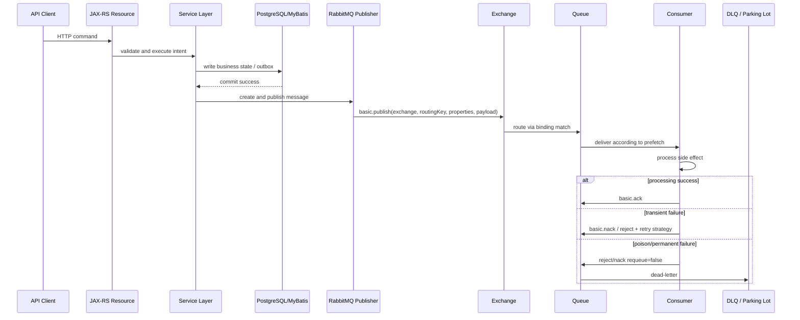

# Message Lifecycle

## 1. Core idea

Message lifecycle adalah perjalanan message dari saat dibuat oleh aplikasi sampai message selesai diproses, gagal, diulang, masuk DLQ, expired, atau hilang karena desain yang salah.

Mental model dasar:

```text
Java/JAX-RS request
  -> service layer decision
  -> transaction boundary
  -> message creation
  -> publisher
  -> exchange
  -> binding match
  -> queue enqueue
  -> consumer delivery
  -> processing
  -> ack / nack / reject
  -> retry / DLQ / complete
```

Senior engineer tidak cukup hanya tahu bahwa message "dipublish". Yang harus dipahami adalah **kapan message dianggap aman**, **kapan message bisa duplicate**, **kapan message bisa hilang**, **kapan ordering berubah**, **kapan retry menjadi storm**, dan **di mana bukti observability harus dicari**.

RabbitMQ membuat message flow menjadi asynchronous. Itu berarti failure tidak selalu muncul di call stack HTTP. Failure bisa muncul sebagai queue depth naik, unacked message tinggi, DLQ spike, redelivery loop, publisher confirm timeout, atau data state yang tidak sinkron dengan message state.

---

## 2. End-to-end lifecycle map



Diagram ini adalah lifecycle umum. Internal CSG topology, queue names, retry exchange, DLQ, vhost, and routing keys harus diverifikasi secara internal.

---

## 3. Message creation

Message creation terjadi di aplikasi, bukan di broker. Aplikasi memutuskan:

- message type;
- payload;
- headers;
- properties;
- routing key;
- correlation ID;
- idempotency key;
- tenant/context metadata;
- schema version;
- delivery mode;
- expiration jika digunakan.

Dalam Java/JAX-RS backend, message creation biasanya terjadi setelah service layer memahami business intent.

Contoh conceptual flow:

```text
POST /quotes/{id}/approve
  -> validate actor can approve quote
  -> update quote status to APPROVED
  -> create QuoteApproved message
  -> publish or insert outbox row
```

Yang berbahaya:

```text
Resource method langsung publish message tanpa transaction boundary dan tanpa idempotency.
```

Kenapa? Karena HTTP retry, duplicate request, partial DB failure, atau broker failure dapat membuat business state dan message flow tidak konsisten.

---

## 4. Transaction boundary before publishing

RabbitMQ publish tidak otomatis ikut dalam transaksi PostgreSQL. Ini adalah sumber banyak bug di enterprise system.

### Risk window: DB commit success, publish fails

```text
1. Update quote status = APPROVED
2. Commit database sukses
3. Publish QuoteApproved message
4. Broker unavailable
5. Downstream tidak pernah tahu quote approved
```

### Risk window: publish success, DB commit fails

```text
1. Publish QuoteApproved message
2. Update database gagal atau rollback
3. Consumer menerima event yang tidak sesuai source of truth
```

Karena itu, untuk flow penting, gunakan outbox pattern atau mekanisme reliability lain yang disetujui secara internal.

Prinsip:

```text
Jika message merepresentasikan perubahan business state yang durable,
message creation harus dikaitkan dengan transaction boundary yang durable juga.
```

Untuk Java + MyBatis/JDBC, boundary ini harus jelas di level service method, transaction annotation/config, connection handling, dan commit point.

---

## 5. Message properties

AMQP message terdiri dari payload dan metadata/properties. Properties bukan dekorasi; properties membantu routing, traceability, reliability, dan consumer behavior.

Properties yang sering penting:

| Property | Fungsi |
|---|---|
| `messageId` | Identitas message untuk dedup/tracing |
| `correlationId` | Menghubungkan message dengan request/workflow |
| `replyTo` | Request-reply/RPC pattern |
| `contentType` | Format payload, misalnya JSON |
| `contentEncoding` | Encoding jika relevan |
| `deliveryMode` | Persistent vs non-persistent message |
| `expiration` | Per-message TTL jika digunakan |
| `priority` | Priority queue jika enabled |
| `timestamp` | Waktu publish/create jika dipakai |
| `type` | Message type jika distandardkan |
| `appId` | Source application jika dipakai |

Jangan mengandalkan payload saja. Metadata yang benar membuat production debugging jauh lebih cepat.

---

## 6. Message headers

Headers adalah metadata custom. Gunakan headers untuk informasi teknis dan cross-cutting yang tidak seharusnya menjadi business payload utama.

Contoh header yang berguna:

- `traceparent`;
- `x-correlation-id`;
- `x-causation-id`;
- `x-tenant-id`;
- `x-source-service`;
- `x-message-version`;
- `x-retry-count` jika custom retry;
- `x-idempotency-key`;
- `x-actor-id` jika aman dan sesuai policy privacy.

Perhatian:

- jangan taruh PII sembarangan di header;
- header sering ikut masuk log;
- header bisa muncul di Management UI atau tracing tool;
- ukuran header tetap berdampak ke message size;
- standard internal harus diverifikasi.

---

## 7. Payload

Payload adalah isi business message. Payload harus diperlakukan sebagai contract.

Payload yang baik:

- punya message type jelas;
- punya schema/version;
- memiliki required field yang stabil;
- menjaga backward compatibility;
- tidak membawa data sensitif yang tidak perlu;
- tidak terlalu besar;
- cukup untuk consumer melakukan pekerjaannya tanpa coupling berlebihan;
- tidak menyembunyikan operation semantics.

Contoh payload event konseptual:

```json
{
  "eventType": "QuoteApproved",
  "eventVersion": 1,
  "quoteId": "Q-12345",
  "approvedAt": "2026-07-11T10:15:30Z",
  "approvalDecisionId": "APP-7788"
}
```

Ini hanya contoh, bukan schema internal CSG.

---

## 8. Publishing to exchange

Producer publish ke exchange dengan routing key.

Mental model:

```text
basic.publish(
  exchange = "some.exchange",
  routingKey = "quote.approved",
  properties = {...},
  payload = bytes
)
```

Saat publish, beberapa hal dapat terjadi:

| Situation | Dampak |
|---|---|
| Exchange tidak ada | Channel exception, publish gagal |
| Permission write tidak ada | Publish ditolak |
| Routing key tidak match binding | Message bisa unroutable |
| Mandatory flag false | Unroutable message bisa tidak terlihat oleh publisher |
| Mandatory flag true | Publisher bisa menerima basic.return untuk unroutable message |
| Alternate exchange configured | Unroutable message dapat diroute ke alternate path |
| Publisher confirm enabled | Broker mengonfirmasi penerimaan/persistence sesuai kondisi |
| Connection blocked | Publish tertahan karena broker pressure |

### Senior rule

Untuk message penting, `publish call returned` belum cukup. Harus jelas apakah sistem memakai publisher confirm, outbox, mandatory flag, alternate exchange, atau mekanisme reliability lain.

---

## 9. Exchange routing

Exchange mengevaluasi routing berdasarkan type:

- direct: exact routing key;
- topic: pattern dengan wildcard;
- fanout: broadcast ke binding;
- headers: match berdasarkan header;
- plugin-specific exchange jika enabled.

Exchange tidak tahu business intent. Exchange hanya melakukan routing sesuai rule.

### Failure mode routing

| Failure | Gejala |
|---|---|
| Routing key typo | Message tidak masuk queue target |
| Binding hilang | Queue tidak menerima message |
| Wildcard terlalu luas | Consumer menerima message yang tidak diharapkan |
| Wrong exchange | Message masuk topology lain atau gagal |
| Alternate exchange tidak dimonitor | Unroutable message terkumpul tanpa owner |

Routing harus didesain dan direview seperti API contract.

---

## 10. Binding match

Binding adalah rule yang menghubungkan exchange ke queue. Message dapat cocok ke nol, satu, atau banyak binding.

Contoh:

```text
exchange: quote.events
routing key: quote.approved

bindings:
  quote.*        -> audit.queue
  quote.approved -> order-start.queue
  quote.approved -> notification.queue
```

Satu publish dapat menghasilkan banyak copy delivery ke banyak queue, tergantung binding.

Konsekuensi:

- setiap queue punya backlog dan failure sendiri;
- satu subscriber lambat tidak harus menghentikan subscriber lain;
- storage cost bertambah sesuai fanout;
- schema compatibility harus dipertahankan untuk semua subscriber;
- event replay tidak otomatis tersedia seperti log-based system.

---

## 11. Queue enqueue

Setelah routing match, message masuk ke queue. Queue adalah tempat message menunggu delivery ke consumer.

Queue behavior dipengaruhi oleh:

- queue type: classic, quorum, stream;
- durable vs non-durable;
- exclusive;
- auto-delete;
- TTL;
- max length;
- priority;
- dead-letter exchange;
- policy/operator policy;
- consumer availability;
- prefetch;
- broker resource state.

Saat queue menerima message, message bisa menjadi:

| State | Arti |
|---|---|
| Ready | Message menunggu dikirim ke consumer |
| Unacked | Message sudah dikirim ke consumer tetapi belum di-ack |
| Dead-lettered | Message dipindah ke DLX karena reject/nack/TTL/limit reason tertentu |
| Expired | Message melewati TTL |
| Dropped/rejected by overflow | Tergantung max length/overflow policy |

---

## 12. Message persistence

Persistence butuh kombinasi beberapa hal:

```text
durable exchange + durable queue + persistent message
```

Namun persistence bukan berarti tidak ada duplicate, bukan berarti consumer sudah memproses, dan bukan berarti event sudah sinkron dengan database.

Hal yang perlu dibedakan:

| Konsep | Makna |
|---|---|
| Durable exchange | Exchange bertahan setelah broker restart |
| Durable queue | Queue definition bertahan setelah broker restart |
| Persistent message | Message ditandai untuk disimpan secara durable |
| Publisher confirm | Publisher tahu broker menerima/menangani message sesuai confirm semantics |
| Consumer ack | Broker boleh menghapus delivery dari queue |
| Business commit | Side effect durable di database/domain state |

Persistence adalah bagian dari reliability, bukan keseluruhan reliability.

---

## 13. Consumer delivery

RabbitMQ mengirim message ke consumer berdasarkan queue, subscription, prefetch, dan availability consumer.

Consumer delivery bukan berarti processing sukses. Delivery hanya berarti broker menyerahkan message ke consumer.

Dengan manual ack:

```text
Queue -> Consumer: delivery
Consumer processing...
Consumer -> Queue: ack only after processing success
```

Jika consumer mati sebelum ack, message dapat redelivered.

Dengan auto ack:

```text
Queue -> Consumer: delivery
Broker immediately considers message done
Consumer crash after delivery = message can be lost from processing perspective
```

Untuk flow penting, manual ack adalah default mental model yang lebih aman.

---

## 14. Consumer prefetch

Prefetch mengatur berapa banyak message unacked yang boleh dikirim ke consumer/channel sebelum ack diterima.

```text
prefetch = max in-flight messages per consumer/channel scope
```

Prefetch terlalu tinggi:

- unacked menumpuk;
- satu consumer bisa menahan banyak message;
- memory aplikasi naik;
- recovery saat crash lebih besar;
- fairness buruk;
- ordering risk meningkat jika processing parallel.

Prefetch terlalu rendah:

- throughput rendah;
- consumer idle menunggu round-trip;
- worker kurang maksimal.

Prefetch harus dilihat bersama:

- processing latency;
- DB connection pool;
- external dependency latency;
- number of pod replicas;
- thread pool size;
- ordering requirement;
- retry behavior.

---

## 15. Processing

Processing adalah bagian paling berisiko karena di sinilah side effect terjadi.

Consumer processing dapat melakukan:

- update PostgreSQL;
- insert audit record;
- call downstream service;
- publish message lain;
- update Redis cache;
- trigger workflow;
- send notification;
- call external integration.

Setiap side effect harus dianalisis terhadap crash window.

### Crash window example

```text
1. Consumer receives message
2. Consumer updates DB successfully
3. JVM crashes before ack
4. Broker redelivers message
5. Consumer processes same message again
```

Tanpa idempotency, business state bisa rusak.

### Senior rule

```text
Assume every consumer can receive the same message more than once.
Design processing as idempotent.
Ack only after durable success.
```

---

## 16. Ack

Ack memberi tahu broker bahwa delivery selesai dan message boleh dihapus dari queue untuk consumer tersebut.

Ack harus dilakukan:

- setelah processing sukses;
- setelah DB transaction commit jika ada DB side effect;
- pada channel yang sama dengan delivery;
- dengan delivery tag yang benar;
- setelah idempotency check selesai.

Ack terlalu cepat:

```text
Consumer ack sebelum DB commit.
DB gagal.
Message sudah hilang dari queue.
```

Ack terlalu lambat:

```text
Processing selesai tetapi ack tertunda.
Consumer crash.
Message redelivered dan diproses ulang.
```

Ack discipline adalah inti correctness consumer.

---

## 17. Nack, reject, and requeue

Jika consumer gagal, ia dapat nack atau reject. Perbedaan detail tergantung operasi, tetapi keputusan paling penting adalah **requeue true atau false**.

| Decision | Dampak |
|---|---|
| `requeue=true` | Message kembali ke queue dan bisa dikirim ulang |
| `requeue=false` | Message dapat dead-lettered jika DLX configured, atau dropped jika tidak |
| repeated requeue | Bisa menciptakan redelivery loop |
| reject poison message tanpa DLQ | Message bisa hilang dari observability path |

### Dangerous pattern

```text
catch (Exception e) {
  basicNack(deliveryTag, false, true); // requeue forever
}
```

Jika error permanent, ini menciptakan redelivery storm.

Retry harus punya batas, delay, dan final destination seperti DLQ atau parking lot.

---

## 18. Dead-lettering

Dead-lettering adalah proses memindahkan message ke exchange lain saat message tidak bisa diproses normal.

Message bisa dead-lettered karena:

- consumer reject/nack dengan requeue false;
- message expired;
- queue length limit;
- delivery limit pada queue type tertentu;
- policy tertentu.

DLQ bukan tempat sampah. DLQ adalah **evidence queue** untuk debugging dan recovery.

DLQ harus punya:

- owner;
- retention policy;
- alert;
- dashboard;
- payload privacy review;
- replay procedure;
- poison classification;
- runbook.

Tanpa owner, DLQ hanya menunda incident.

---

## 19. Redelivery

Redelivery terjadi ketika message yang pernah dikirim ke consumer dikirim ulang. Penyebab umum:

- consumer crash sebelum ack;
- channel/connection closed sebelum ack;
- nack/reject requeue true;
- broker failover;
- consumer timeout/cancellation scenario tergantung setup.

Redelivery bukan bug otomatis. Redelivery adalah bagian dari at-least-once delivery.

Yang harus dimonitor:

- redelivery rate;
- duplicate detection rate;
- consumer exception logs;
- DB constraint violation karena duplicate;
- DLQ growth;
- unacked pattern.

Jika redelivery tinggi, jangan langsung menaikkan consumer replica. Cari akar: poison message, downstream failure, ack bug, or requeue loop.

---

## 20. Expiry and TTL

TTL menentukan berapa lama message boleh hidup di queue jika belum dikonsumsi. TTL bisa berada di level queue atau message.

TTL berguna untuk:

- delayed retry topology;
- membatasi message lama;
- temporary workload;
- expiry untuk response/request-reply;
- mencegah stale command diproses terlalu lambat.

TTL berisiko jika:

- message expired tanpa alert;
- TTL retry merusak ordering;
- message penting expired sebelum consumer pulih;
- TTL tidak disadari karena policy;
- expired message masuk DLQ besar tanpa owner.

Senior rule:

```text
Jangan pasang TTL pada message penting tanpa menjelaskan business meaning dari expiry.
```

---

## 21. Queue deletion and lifecycle end

Queue bisa hilang atau dihapus karena:

- manual deletion;
- auto-delete behavior;
- exclusive queue connection closed;
- queue TTL/expires;
- topology cleanup;
- environment reset;
- GitOps reconciliation;
- operator action;
- accidental deletion.

Jika queue hilang:

- message yang ada di queue bisa hilang;
- consumer bisa gagal declare/consume;
- producer publish bisa unroutable jika binding hilang;
- topology drift bisa muncul antar environment.

Untuk production queue, queue lifecycle harus controlled. Queue bukan sekadar object runtime yang boleh muncul/hilang tanpa review.

---

## 22. Broker restart impact

Broker restart berdampak pada lifecycle message dan client:

- connection terputus;
- channel tertutup;
- consumer cancellation;
- unacked message dapat redelivered;
- non-durable topology hilang;
- non-persistent message bisa hilang;
- queue recovery tergantung type/durability;
- publisher confirm yang pending perlu ditangani;
- application harus reconnect/recover.

Untuk Java/JAX-RS service, restart broker harus dianggap normal production event, bukan exceptional event yang tidak pernah terjadi.

Yang harus diuji:

- producer behavior saat broker restart;
- consumer behavior saat broker restart;
- in-flight processing duplicate;
- ack after reconnect behavior;
- idempotency;
- outbox retry;
- alert noise.

---

## 23. End-to-end message lifecycle tracing

Tracing lifecycle berarti bisa menjawab:

```text
Message ini dibuat kapan?
Dibuat oleh request apa?
Dari service mana?
Dipublish ke exchange apa?
Dengan routing key apa?
Masuk queue mana?
Dikirim ke consumer mana?
Diproses berapa lama?
Di-ack atau masuk DLQ?
Jika retry, sudah berapa kali?
Side effect DB apa yang terjadi?
```

Minimum metadata untuk tracing:

- message ID;
- correlation ID;
- causation ID jika digunakan;
- trace ID / traceparent;
- source service;
- message type;
- message version;
- created time;
- published time;
- tenant/context ID jika applicable;
- idempotency key;
- retry count atau x-death analysis.

Minimum logs:

- publish attempt;
- publish confirm/return;
- delivery received;
- processing started;
- processing completed;
- ack/nack/reject;
- DB state transition;
- retry/DLQ decision.

---

## 24. Lifecycle failure mode table

| Lifecycle phase | Failure | Detection | Mitigation |
|---|---|---|---|
| Message creation | Missing/invalid field | Contract test, consumer error | Schema validation, versioning |
| DB transaction | DB commit fails | App logs, DB metrics | Rollback, no publish before commit |
| Publish | Broker unavailable | Publish exception, confirm timeout | Outbox, retry with backoff |
| Routing | Unroutable message | Return listener, alternate exchange, metrics | Mandatory flag, AE, binding tests |
| Enqueue | Queue limit/TTL/policy issue | Queue metrics, x-death, DLQ | Policy review, capacity planning |
| Delivery | Consumer down | Queue depth, consumer count | Alert, restart, scale, rollback |
| Processing | Downstream failure | Error logs, latency, retry | Bounded retry, circuit breaker, DLQ |
| Ack | Ack too early/late/wrong channel | Redelivery, channel error, data mismatch | Ack discipline, tests |
| Retry | Infinite loop | Redelivery rate, retry queue growth | Retry limit, delay, parking lot |
| DLQ | DLQ ignored | DLQ depth alert | Owner, runbook, replay process |
| Expiry | Message expires unexpectedly | x-death reason, DLQ growth | TTL review, alerting |
| Restart | In-flight duplicate | Redelivery flag, duplicate key | Idempotent consumer |

---

## 25. Java/JAX-RS impact

RabbitMQ lifecycle changes how HTTP APIs should be designed.

### Synchronous API illusion

If endpoint only enqueues work, do not imply work is finished.

Better:

```http
202 Accepted
Location: /operations/{operationId}
```

This indicates work accepted for asynchronous processing.

### Idempotent command endpoint

If client retries HTTP request, the service may publish duplicate command unless it uses idempotency key or business uniqueness.

Checklist:

- HTTP idempotency key accepted?
- duplicate request returns same operation/result?
- outbox row deduplicated?
- message ID stable or generated per attempt?
- consumer can handle duplicates?

### Error mapping

Broker failure should be mapped explicitly:

| Condition | Possible API response |
|---|---|
| Validation failure | 400/422 |
| Business conflict | 409 |
| Broker temporarily unavailable and no outbox | 503 |
| Work accepted into durable outbox | 202 |
| Work completed synchronously | 200/201 |

Actual API semantics must follow team contract.

---

## 26. PostgreSQL/MyBatis/JDBC impact

Message lifecycle and database lifecycle must be aligned.

### Producer side

Bad:

```text
publish message
then insert/update DB
```

Risk: consumer sees event for state that never committed.

Safer for important events:

```text
begin transaction
  update business table
  insert outbox table
commit
poller publishes outbox message
publisher confirm
mark outbox row published
```

### Consumer side

Bad:

```text
update DB
ack
without idempotency
```

Risk: duplicate message corrupts state.

Safer:

```text
begin transaction
  insert/check inbox/processed_message key
  apply idempotent state transition
commit
ack
```

### MyBatis/JDBC concern

- transaction boundary must be visible;
- mapper calls must share same transaction/connection when needed;
- commit must happen before ack;
- duplicate key handling should be intentional;
- retry should not create partial updates;
- repair/reconciliation script may be needed.

---

## 27. Kubernetes/cloud/on-prem impact

Message lifecycle can be disrupted by platform events.

| Platform event | Lifecycle impact |
|---|---|
| Pod termination | Consumer may die before ack; message redelivered |
| Rolling deployment | Connection churn, consumer cancellation, temporary queue depth growth |
| HPA scale out | More consumers, prefetch multiplication, DB pressure |
| HPA scale in | In-flight messages need drain/shutdown handling |
| Broker maintenance | Connection drop, publish/consume pause |
| Node disk pressure | Broker disk alarm, publishing blocked |
| Network policy change | Producer/consumer cannot connect |
| Secret rotation | Auth failure if client not refreshed properly |
| DNS/LB issue | Connection failure or reconnect storm |

Graceful shutdown matters:

```text
stop receiving new work
finish in-flight processing
commit side effects
ack completed messages
nack/requeue unfinished messages if needed
close channel/connection cleanly
```

---

## 28. Production-safe debugging steps

Saat ada masalah message lifecycle, gunakan urutan berikut.

### 1. Identify the message flow

- message type;
- producer service;
- exchange;
- routing key;
- queue;
- consumer service;
- DLQ/retry queues;
- related DB state.

### 2. Check producer evidence

- publish log;
- message ID/correlation ID;
- publisher confirm;
- return listener;
- exception;
- outbox row status.

### 3. Check broker routing

- exchange exists;
- binding exists;
- routing key match;
- queue exists;
- policy applied;
- alternate exchange;
- DLX.

### 4. Check queue state

- ready count;
- unacked count;
- consumer count;
- publish/deliver/ack rate;
- redelivery rate;
- DLQ depth;
- x-death headers.

### 5. Check consumer evidence

- delivery received log;
- processing started/completed;
- DB transaction status;
- exception stack;
- ack/nack decision;
- duplicate/idempotency logs.

### 6. Check downstream state

- PostgreSQL row status;
- inbox/outbox table;
- audit table;
- external call logs;
- Redis cache state if relevant;
- workflow/process state if relevant.

### 7. Avoid unsafe actions

Do not blindly:

- purge queue;
- replay DLQ;
- increase consumer replicas;
- disable retry;
- delete binding;
- change TTL;
- manually ack/reject without understanding side effects.

---

## 29. PR review checklist

Use this checklist for any PR that creates or changes RabbitMQ message lifecycle.

### Message design

- [ ] Message type is explicit.
- [ ] Payload schema/version is documented.
- [ ] Required/optional fields are clear.
- [ ] PII/privacy concern reviewed.
- [ ] Message size is reasonable.

### Producer

- [ ] Publish happens after correct validation and transaction boundary.
- [ ] Outbox considered for durable business events.
- [ ] Publisher confirm considered for important flow.
- [ ] Mandatory flag/alternate exchange considered.
- [ ] Publish failure behavior is explicit.

### Routing

- [ ] Exchange and routing key are correct.
- [ ] Binding exists and is tested.
- [ ] Unroutable message handling exists.
- [ ] Topology change is backward compatible.

### Queue

- [ ] Queue type and durability are intentional.
- [ ] TTL/max length/overflow behavior understood.
- [ ] DLX configured if failure must be retained.
- [ ] Retry topology has limit.

### Consumer

- [ ] Manual ack used for important side effects.
- [ ] Ack after DB commit/side-effect success.
- [ ] Consumer is idempotent.
- [ ] Nack/reject behavior avoids infinite requeue.
- [ ] DLQ path has owner.

### Observability

- [ ] Message ID/correlation ID logged.
- [ ] Publish/consume/ack/retry metrics exist.
- [ ] Queue/DLQ dashboard exists.
- [ ] Alerts exist for backlog and DLQ.

---

## 30. Internal verification checklist

Use this checklist to map the lifecycle concepts to actual CSG/team implementation.

### Producer implementation

- [ ] Which services publish RabbitMQ messages?
- [ ] Is publish direct or outbox-based?
- [ ] Is publisher confirm enabled?
- [ ] Is mandatory flag enabled?
- [ ] Is return listener implemented?
- [ ] What happens when broker is unavailable?

### Message contract

- [ ] What message types exist?
- [ ] Where are schemas documented?
- [ ] What metadata is mandatory?
- [ ] Is traceparent propagated?
- [ ] Are correlation ID and causation ID standardized?

### Routing/topology

- [ ] Which exchange receives each message?
- [ ] Which routing key pattern is used?
- [ ] Which queues are bound?
- [ ] Is alternate exchange used?
- [ ] Is topology managed by code, GitOps, operator, or manually?

### Queue lifecycle

- [ ] Queue type: classic/quorum/stream?
- [ ] Durable or temporary?
- [ ] TTL configured?
- [ ] Max length/overflow configured?
- [ ] DLX configured?
- [ ] Retry queues exist?

### Consumer implementation

- [ ] Which service consumes each queue?
- [ ] Manual ack or auto ack?
- [ ] Prefetch setting?
- [ ] Consumer concurrency?
- [ ] Idempotency mechanism?
- [ ] Ack after DB commit?

### Operations

- [ ] Queue depth alert?
- [ ] Unacked alert?
- [ ] Redelivery alert?
- [ ] DLQ alert?
- [ ] Replay runbook?
- [ ] Incident notes for past message lifecycle failures?

---

## 31. Key takeaways

- Message lifecycle spans application, broker, queue, consumer, database, and operations.
- Publish success is not the same as business success.
- Delivery is not the same as processing success.
- Ack is the point where broker considers a delivery done.
- Retry without limit becomes production damage.
- DLQ requires owner, alert, and replay discipline.
- PostgreSQL/MyBatis transaction boundary must be aligned with publish/consume lifecycle.
- Kubernetes/platform events can create duplicate delivery and connection churn.
- Production debugging requires message ID, correlation ID, queue metrics, consumer logs, and database evidence.

---

## References

- RabbitMQ Documentation — Consumer Acknowledgements and Publisher Confirms: https://www.rabbitmq.com/docs/confirms
- RabbitMQ Documentation — Dead Letter Exchanges: https://www.rabbitmq.com/docs/dlx
- RabbitMQ Documentation — Time-To-Live and Expiration: https://www.rabbitmq.com/docs/ttl
- RabbitMQ Documentation — Reliability Guide: https://www.rabbitmq.com/docs/reliability
- RabbitMQ Documentation — Memory and Disk Alarms: https://www.rabbitmq.com/docs/alarms
- RabbitMQ Documentation — Flow Control: https://www.rabbitmq.com/docs/flow-control
- RabbitMQ Documentation — Monitoring: https://www.rabbitmq.com/docs/monitoring
