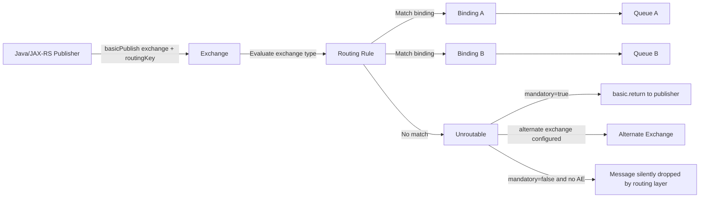
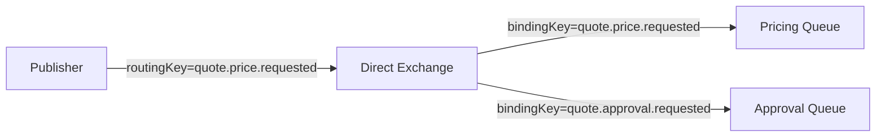
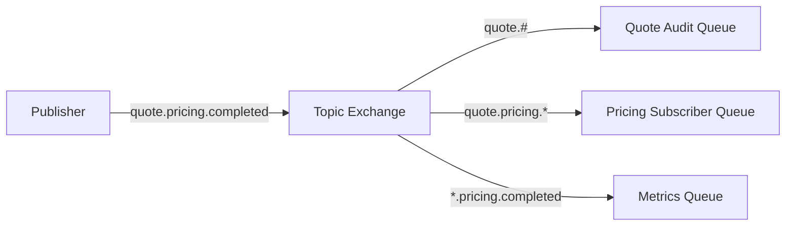
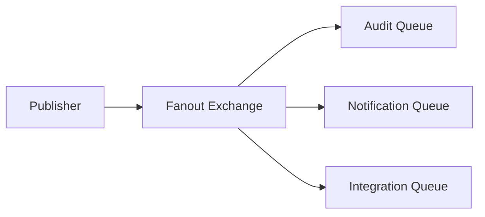
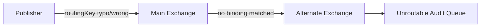
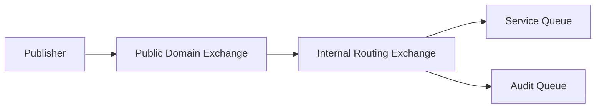
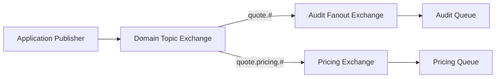
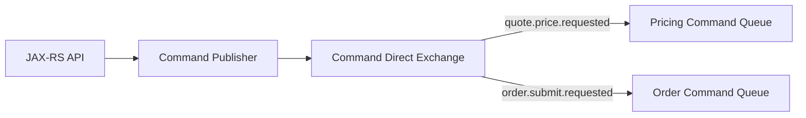
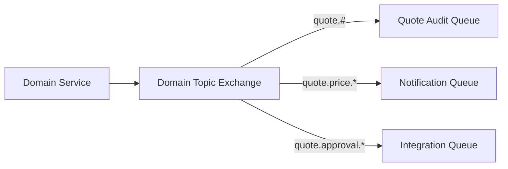
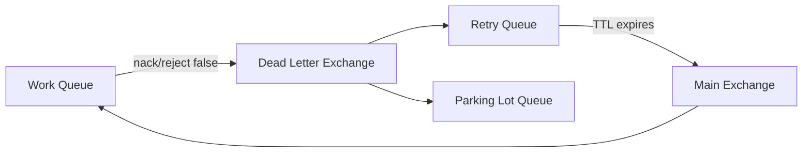

# Exchange Types and Routing

## 1. Core idea

Di RabbitMQ, producer **tidak seharusnya berpikir bahwa ia mengirim message langsung ke consumer**. Producer mengirim message ke **exchange**. Exchange adalah komponen broker-side yang mengambil keputusan routing berdasarkan:

- exchange type,
- routing key,
- binding,
- binding key,
- header match,
- alternate exchange,
- plugin behavior jika ada.

Mental model paling penting:

```text
Producer chooses exchange + routing key.
Broker evaluates exchange routing rules.
Queue receives message only if binding matches.
Consumer only sees message after queue menerima delivery.
```

Implikasinya besar untuk enterprise backend system:

- producer tidak perlu tahu semua queue consumer;
- consumer dapat ditambah tanpa mengubah producer jika topology benar;
- routing bisa menjadi kontrak integrasi antar service;
- typo routing key bisa membuat message tidak pernah masuk queue;
- broad wildcard bisa membuat message masuk ke queue yang salah;
- topology yang tidak terdokumentasi akan menjadi production debugging nightmare.

Di sistem Java/JAX-RS, exchange/routing biasanya muncul ketika endpoint HTTP menerima command, service layer menyelesaikan transaction boundary, lalu publisher mengirim message ke RabbitMQ. Keputusan exchange dan routing key menentukan siapa yang akan menerima efek dari command/event tersebut.

---

## 2. Why exchange exists

Exchange ada agar RabbitMQ bisa memisahkan **publishing concern** dari **delivery concern**.

Tanpa exchange, producer harus tahu queue mana yang dituju. Itu membuat coupling kuat:

```text
Producer -> Queue A
Producer -> Queue B
Producer -> Queue C
```

Dengan exchange:

```text
Producer -> Exchange -> Binding -> Queue A
                     -> Binding -> Queue B
                     -> Binding -> Queue C
```

Keuntungannya:

- producer cukup publish ke satu logical routing point;
- queue bisa ditambah tanpa mengubah producer;
- routing bisa dikontrol oleh platform/topology config;
- satu event bisa difanout ke banyak subscriber;
- satu command bisa diarahkan ke handler yang tepat;
- unroutable message bisa ditangkap melalui mandatory flag atau alternate exchange.

Tetapi exchange juga membuat failure mode baru:

- exchange salah nama;
- exchange belum terdeclare;
- exchange type salah;
- binding tidak ada;
- routing key tidak match;
- alternate exchange tidak dikonfigurasi;
- producer menganggap publish sukses padahal message unroutable;
- wildcard terlalu luas sehingga queue menerima message yang tidak seharusnya;
- exchange durable tetapi queue tidak durable;
- topology berbeda antar environment.

---

## 3. Exchange routing lifecycle

Lifecycle routing sederhana:



Dalam production review, setiap publish harus bisa dijelaskan:

```text
Which exchange?
Which exchange type?
Which routing key?
Which bindings can match?
Which queues receive the message?
What happens if no binding matches?
What happens if target queue is unavailable?
What metrics/logs prove the route worked?
```

---

## 4. Default exchange

Default exchange adalah exchange built-in dengan nama kosong `""`. Ia bertipe direct secara konseptual, dan setiap queue secara otomatis ter-bind ke default exchange menggunakan nama queue sebagai routing key.

Contoh mental model:

```text
exchange = ""
routingKey = "quote.pricing.work.queue"

Message routed to queue named "quote.pricing.work.queue"
```

### Kapan berguna

Default exchange berguna untuk:

- contoh sederhana;
- local testing;
- direct-to-queue publishing yang eksplisit;
- temporary/reply queue tertentu;
- kasus internal yang memang ingin mengarah ke satu queue by name.

### Risiko di enterprise system

Default exchange sering menjadi anti-pattern bila dipakai sembarangan:

- producer menjadi tahu nama queue consumer;
- queue name berubah berarti producer harus berubah;
- topology ownership kabur;
- sulit memisahkan command/event routing;
- sulit membuat fanout subscriber baru tanpa mengubah publisher;
- tidak ada logical exchange sebagai integration boundary.

Rule of thumb:

```text
Default exchange boleh dipakai untuk kasus direct-to-queue yang sadar desain.
Untuk enterprise integration, biasanya lebih baik menggunakan named exchange.
```

### Review question

Saat melihat code Java:

```java
channel.basicPublish("", queueName, properties, payload);
```

Tanyakan:

- apakah producer memang boleh tahu queue name?
- apakah queue ini owned oleh service yang sama?
- apakah ini command queue, task queue, reply queue, atau shortcut yang tidak terdesain?
- apa yang terjadi jika queue belum ada?
- apakah mandatory flag digunakan?

---

## 5. Direct exchange

Direct exchange meroute message ke binding yang binding key-nya **exact match** dengan routing key.



### Cocok untuk

Direct exchange cocok untuk:

- command routing;
- task routing;
- deterministic one-route delivery;
- routing berdasarkan message type yang eksplisit;
- workflow step yang hanya punya satu target handler;
- simple retry/DLX topology.

Contoh routing key:

```text
quote.price.requested
quote.approval.requested
order.submit.requested
order.decompose.requested
fulfillment.task.created
```

### Kekuatan

- sederhana;
- mudah di-debug;
- explicit match;
- kecil risiko accidental fanout;
- cocok untuk command/task yang ownership-nya jelas.

### Risiko

- terlalu banyak routing key bisa menjadi registry manual yang sulit dijaga;
- tidak fleksibel untuk hierarchical subscription;
- jika producer salah routing key, tidak ada queue yang match;
- jika banyak consumer ingin message yang sama, setiap binding harus eksplisit.

### Enterprise design note

Untuk command, direct exchange sering lebih aman daripada topic exchange karena command biasanya punya owner tunggal.

```text
Command should usually have one semantic owner.
Event can have many independent subscribers.
```

Jika `order.submit.requested` dikonsumsi oleh lima service yang semuanya melakukan state-changing action, itu mungkin bukan command lagi; itu event, fanout, atau choreography yang perlu direview ulang.

---

## 6. Topic exchange

Topic exchange meroute message berdasarkan pattern matching pada routing key. Routing key dipisah oleh dot `.` dan binding key dapat menggunakan wildcard:

- `*` match tepat satu word;
- `#` match nol atau lebih word.

Contoh:

```text
routingKey = quote.pricing.requested
bindingKey = quote.*.requested        -> match
bindingKey = quote.#                  -> match
bindingKey = *.pricing.requested      -> match
bindingKey = order.#                  -> not match
```

Diagram:



### Cocok untuk

Topic exchange cocok untuk:

- event routing;
- event subscription dengan domain hierarchy;
- selective fanout;
- tenant/domain/message-type routing;
- observability/audit subscriber;
- integration subscriber yang hanya tertarik subset event.

### Routing key design

Routing key harus didesain seperti taxonomy, bukan string ad hoc.

Contoh format yang relatif sehat:

```text
<domain>.<aggregate>.<event>
quote.price.requested
quote.price.completed
quote.approval.requested
order.submission.accepted
order.fulfillment.failed
```

Atau jika environment/tenant masuk ke routing key, hati-hati:

```text
<tenant>.<domain>.<aggregate>.<event>
```

Masukkan tenant ke routing key hanya jika benar-benar bagian dari routing decision. Jika tenant hanya metadata untuk audit, lebih baik header/payload.

### Risiko wildcard

Wildcard terlalu luas adalah sumber bug production yang halus.

Contoh berisiko:

```text
bindingKey = #
bindingKey = quote.#
bindingKey = *.created
```

Risikonya:

- consumer menerima event yang tidak didesain untuknya;
- schema mismatch;
- DLQ spike karena consumer gagal deserialize;
- accidental business side-effect;
- sulit tahu subscriber mana menerima message apa;
- traffic naik tanpa ownership jelas.

### Review question

Untuk setiap topic binding, tanyakan:

- apakah wildcard terlalu luas?
- apakah consumer bisa memproses semua message yang match?
- apakah schema compatible untuk semua match?
- apakah binding ini documented?
- apakah ada test topology untuk membuktikan routing?

---

## 7. Fanout exchange

Fanout exchange mengirim copy message ke semua queue/exchange yang bound kepadanya. Routing key diabaikan.



### Cocok untuk

Fanout exchange cocok untuk:

- broadcast event;
- audit distribution;
- notification trigger;
- cache invalidation;
- local environment demo pub/sub;
- event yang semua subscriber memang harus melihat.

### Risiko

Fanout mudah disalahgunakan.

Risiko utama:

- semua subscriber menerima semua message;
- tidak ada selective routing;
- slow subscriber membutuhkan queue sendiri;
- event volume bisa meledak jika terlalu banyak subscriber;
- publisher tidak tahu jumlah downstream side-effect;
- governance event contract harus kuat.

### Practical rule

Gunakan fanout saat semantic-nya benar-benar:

```text
Every bound subscriber should receive every message.
```

Jika hanya subset subscriber yang butuh event, topic exchange biasanya lebih tepat.

---

## 8. Headers exchange

Headers exchange meroute message berdasarkan headers, bukan routing key. Binding menentukan header criteria. Matching bisa menggunakan mode seperti all/any tergantung konfigurasi binding.

Contoh conceptual:

```text
headers:
  messageType = QuotePriced
  tenantTier = enterprise
  source = pricing-service
```

Binding dapat menyatakan:

```text
match all:
  messageType = QuotePriced
  tenantTier = enterprise
```

### Cocok untuk

Headers exchange bisa cocok untuk:

- routing berdasarkan metadata kompleks;
- routing yang tidak cocok dengan taxonomy dot-separated;
- integration adapter yang perlu match property tertentu;
- message classification routing.

### Risiko

Headers exchange lebih sulit dioperasikan dibanding direct/topic:

- routing decision tidak terlihat dari routing key;
- debugging perlu inspect headers;
- producer harus menjaga header discipline;
- schema metadata bisa drift;
- binding lebih sulit dibaca di dashboard;
- performance dan cognitive overhead bisa lebih tinggi.

### Recommendation

Untuk sebagian besar enterprise backend flow:

```text
Prefer direct/topic exchange for primary business routing.
Use headers exchange only when header-based routing is truly required.
```

---

## 9. Consistent hash exchange if plugin used

Consistent hash exchange bukan built-in AMQP core routing model biasa. Ia bergantung pada plugin RabbitMQ. Gunakan hanya jika plugin tersedia dan disetujui platform/SRE.

### Cocok untuk

Consistent hash exchange dapat digunakan untuk:

- distribusi message berdasarkan hash key;
- menjaga per-key affinity;
- load distribution ke beberapa queue;
- partition-like routing di RabbitMQ.

Contoh use case:

```text
All messages for orderId=O-123 go to the same queue shard.
Different orderId values are distributed across queue shards.
```

### Risiko

- plugin dependency;
- portability antar environment;
- operational knowledge terbatas;
- rebalancing semantics harus dipahami;
- queue shard ownership lebih kompleks;
- ordering per key perlu dibuktikan sampai consumer layer.

### Internal verification checklist

- Apakah plugin consistent hash aktif?
- Siapa owner konfigurasi plugin?
- Apa hash source-nya: routing key atau header?
- Bagaimana queue shard didefinisikan?
- Bagaimana rebalancing dilakukan?
- Apakah ada test ordering per key?

---

## 10. Delayed message exchange if plugin used

Delayed message exchange adalah plugin RabbitMQ untuk menunda routing message sampai delay tertentu. Ini sering dipakai untuk retry delay.

Alternatifnya adalah TTL-based retry queue + DLX.

### Cocok untuk

- delayed retry;
- scheduled lightweight task;
- backoff flow;
- retry topology yang lebih sederhana daripada chain TTL queue.

### Risiko

- plugin dependency;
- behavior harus diverifikasi pada versi RabbitMQ yang digunakan;
- delayed message dapat menumpuk dan memengaruhi memory/disk;
- retry observability bisa kurang jelas jika tidak diberi metric;
- tidak boleh dianggap scheduler bisnis jangka panjang.

### Design warning

Jangan memakai RabbitMQ delayed exchange sebagai workflow scheduler jangka panjang untuk business process yang butuh audit, human intervention, dan state machine. Untuk itu, workflow engine/state table lebih sesuai.

---

## 11. Alternate exchange

Alternate exchange menangani message yang tidak bisa diroute oleh exchange utama. Jika exchange utama punya alternate exchange, message unroutable akan dipublish ulang ke alternate exchange tersebut.



### Kenapa penting

Tanpa alternate exchange dan tanpa mandatory flag, publish ke exchange bisa berhasil dari sudut pandang protocol, tetapi message tidak masuk queue mana pun.

Alternate exchange membantu:

- menangkap routing error;
- membuat audit queue untuk unroutable message;
- mendeteksi topology drift;
- mencegah silent loss pada routing layer.

### Mandatory vs alternate exchange

`mandatory=true` membuat broker mengembalikan unroutable message ke publisher melalui return callback.

Alternate exchange membuat broker mencoba route message ke exchange alternatif.

Keduanya menjawab masalah yang sama dari sudut berbeda:

```text
mandatory flag: publisher diberi tahu.
alternate exchange: broker-side unroutable capture.
```

Untuk flow penting, pertimbangkan keduanya sesuai standard internal.

### Internal verification checklist

- Exchange penting punya alternate exchange atau tidak?
- Unroutable queue dimonitor atau tidak?
- Publisher menggunakan mandatory flag atau tidak?
- Ada alert untuk unroutable message?
- Ada replay/remediation procedure?

---

## 12. Exchange durability

Exchange durable bertahan setelah broker restart. Exchange non-durable hilang saat broker restart.

Untuk production enterprise topology, exchange yang menjadi integration contract hampir selalu harus durable.

```text
Durable exchange + durable queue + persistent message = basic persistence foundation.
```

Tetapi durability exchange saja tidak cukup:

- queue juga harus durable;
- message harus persistent;
- publisher confirm tetap dibutuhkan untuk tahu broker menerima message;
- replicated queue/quorum queue diperlukan jika node failure harus ditahan;
- client reconnect/recovery tetap harus benar.

### Failure mode

Jika exchange non-durable:

1. broker restart;
2. exchange hilang;
3. publisher publish ke exchange yang tidak ada;
4. channel bisa closed dengan error;
5. message tidak terkirim;
6. aplikasi mungkin retry tanpa memahami root cause.

### Review question

- Apakah exchange durable?
- Siapa yang declare exchange?
- Apakah declaration dilakukan aplikasi atau topology-as-code?
- Apakah property exchange sama antar environment?
- Apakah ada drift detection?

---

## 13. Auto-delete exchange

Auto-delete exchange akan dihapus ketika tidak lagi digunakan sesuai lifecycle binding/usage tertentu.

Cocok untuk:

- temporary topology;
- test environment;
- dynamic reply/subscription pattern;
- short-lived integration.

Tidak cocok untuk:

- command exchange production;
- domain event exchange;
- retry/DLX exchange;
- shared integration exchange;
- topology yang menjadi contract antar service.

### Failure mode

Auto-delete exchange yang salah dipakai di production bisa menyebabkan:

- exchange hilang setelah binding/consumer lifecycle berubah;
- publisher channel error;
- message tidak routed;
- environment-specific intermittent failure.

### Internal verification checklist

- Ada exchange auto-delete di production?
- Apakah memang temporary?
- Siapa yang membuat binding-nya?
- Apa yang terjadi saat consumer restart?
- Apakah publisher punya alert untuk channel close?

---

## 14. Internal exchange

Internal exchange tidak dapat dipublish langsung oleh client. Ia hanya menerima message dari exchange lain melalui exchange-to-exchange binding.

Cocok untuk:

- routing composition;
- topology layering;
- membatasi publisher agar tidak publish ke routing stage internal;
- domain gateway exchange -> internal exchange -> queues.

Contoh:



### Risiko

- topology lebih sulit dibaca;
- debugging harus mengikuti exchange-to-exchange chain;
- salah binding bisa membuat message berhenti di tengah;
- dokumentasi wajib jelas.

### Review question

- Kenapa exchange ini internal?
- Exchange mana yang boleh menerima publish dari application?
- Apakah internal exchange hanya digunakan untuk routing composition?
- Apakah ada diagram topology?

---

## 15. Exchange-to-exchange binding

Exchange-to-exchange binding memungkinkan exchange menjadi destination dari exchange lain. Secara konseptual, binding ini mirip exchange-to-queue binding, tetapi targetnya exchange.

### Use case

- routing hierarchy;
- domain exchange fanout ke integration exchange;
- audit exchange yang menerima subset event;
- composition antara topic exchange dan fanout exchange;
- gradual migration topology.

Contoh:



### Risiko

Exchange-to-exchange binding dapat menyembunyikan routing path.

Failure mode:

- loop topology jika tidak hati-hati;
- duplicate delivery via multiple paths;
- sulit menghitung subscriber efektif;
- observability tidak memadai;
- topology drift sulit terlihat di code review.

### Checklist

- Ada diagram routing end-to-end?
- Ada risiko duplicate path?
- Ada naming convention untuk public/internal exchange?
- Ada test untuk route yang diharapkan?
- Ada owner untuk setiap exchange?

---

## 16. Routing key design

Routing key bukan sekadar string. Ia adalah bagian dari contract.

Routing key yang buruk:

```text
process
message
quote
order
test
abc
service1
```

Routing key yang lebih baik:

```text
quote.price.requested
quote.price.completed
quote.approval.requested
order.submission.accepted
order.decomposition.failed
billing.account.sync.requested
```

### Design principles

1. **Stable semantic first**

   Routing key harus mencerminkan makna bisnis/teknis yang stabil, bukan nama class Java yang mudah berubah.

2. **Producer-owned meaning**

   Producer boleh menentukan jenis event/command yang diterbitkan, tetapi tidak seharusnya tahu queue consumer.

3. **Consumer-compatible taxonomy**

   Jika menggunakan topic exchange, taxonomy harus memungkinkan subscriber memilih subset yang wajar.

4. **Avoid overloading**

   Jangan gunakan satu routing key untuk payload yang bentuk dan maknanya berbeda.

5. **Versioning carefully**

   Jangan buru-buru memasukkan version ke routing key jika schema version sudah ada di payload/header. Tetapi untuk breaking semantic route, routing key baru bisa masuk akal.

### Command vs event naming

Command biasanya imperative/requested:

```text
quote.price.requested
order.submit.requested
fulfillment.task.created
```

Event biasanya past tense/fact:

```text
quote.price.completed
order.submitted
fulfillment.failed
```

Rule:

```text
Command asks someone to do something.
Event tells others that something happened.
```

Jika routing key tidak membedakan dua konsep ini, architecture discussion akan menjadi kabur.

---

## 17. Routing topology patterns

### 17.1 Command exchange



Cocok ketika:

- command punya owner jelas;
- target handler terbatas;
- duplicate command harus dikontrol;
- idempotency wajib.

### 17.2 Domain event exchange



Cocok ketika:

- satu fact bisa dipakai banyak subscriber;
- subscriber independen;
- event contract governed;
- slow subscriber punya queue sendiri.

### 17.3 Retry exchange + DLX



Cocok untuk:

- transient retry;
- poison isolation;
- manual replay.

Detail retry akan dibahas di part khusus, tetapi exchange design harus menyiapkan jalur ini sejak awal.

---

## 18. Java/JAX-RS impact

Dalam aplikasi Java/JAX-RS, exchange/routing memengaruhi desain code pada beberapa layer.

### Resource layer

Resource layer tidak sebaiknya memuat detail exchange/routing mentah.

Kurang sehat:

```java
@Path("/quotes/{id}/price")
public class QuoteResource {
    @POST
    public Response price(@PathParam("id") String id) {
        channel.basicPublish("quote.topic.exchange", "quote.price.requested", props, body);
        return Response.accepted().build();
    }
}
```

Lebih sehat:

```java
@Path("/quotes/{id}/price")
public class QuoteResource {
    @POST
    public Response price(@PathParam("id") String id, PriceRequest request) {
        commandService.requestPricing(id, request);
        return Response.accepted().build();
    }
}
```

Service/publisher abstraction yang menentukan message contract dan route.

### Service layer

Service layer harus tahu:

- apakah message command atau event;
- apakah publish berada dalam outbox pattern;
- correlation ID dari HTTP request;
- idempotency key;
- transaction boundary;
- exchange/routing standard internal.

### Publisher abstraction

Publisher abstraction harus menghindari string literal liar.

```java
public final class RabbitRoutes {
    public static final String QUOTE_COMMAND_EXCHANGE = "quote.command.x";
    public static final String QUOTE_PRICE_REQUESTED = "quote.price.requested";
}
```

Tetapi constant saja tidak cukup. Harus ada governance:

- naming convention;
- ownership;
- contract docs;
- topology test;
- monitoring.

---

## 19. PostgreSQL/MyBatis/JDBC impact

Exchange/routing tidak berdiri sendiri. Ia terkait transaction boundary.

Masalah klasik:

```text
1. Insert quote status = PRICING_REQUESTED into PostgreSQL.
2. Publish message to RabbitMQ routingKey=quote.price.requested.
3. DB commit succeeds but publish fails.
4. Quote stuck without pricing job.
```

Atau sebaliknya:

```text
1. Publish message succeeds.
2. DB transaction rolls back.
3. Consumer receives command for state that does not exist.
```

Karena itu, untuk flow penting:

- gunakan outbox pattern;
- routing key disimpan sebagai bagian dari outbox row jika perlu;
- publish status dan confirm status dicatat;
- retry publish tidak mengubah business state;
- route harus deterministik dari event type, bukan dynamic random logic.

Contoh outbox columns:

```text
id
aggregate_type
aggregate_id
message_type
exchange_name
routing_key
payload_json
headers_json
status
created_at
published_at
last_error
```

Routing key di outbox membuat debugging lebih mudah:

```sql
select id, aggregate_id, message_type, exchange_name, routing_key, status, last_error
from outbox_message
where aggregate_id = 'Q-123';
```

---

## 20. Microservices and distributed consistency impact

Exchange/routing adalah tempat service boundary menjadi nyata.

Jika routing topology buruk, microservice architecture akan terlihat seperti spaghetti async:

```text
Service A emits vague message.
Exchange routes to many queues.
Consumers do hidden side-effects.
No one owns schema.
DLQ fills.
No clear business invariant.
```

Topology yang sehat menjawab:

- domain mana yang menerbitkan event?
- service mana yang owns command queue?
- subscriber mana yang optional?
- routing key mana yang public contract?
- apakah consumer boleh melakukan state transition utama?
- apakah side-effect idempotent?
- apakah event distribution bisa ditelusuri?

Distributed consistency concern:

- event bisa duplicate;
- event bisa delayed;
- event bisa out of order;
- subscriber bisa tertinggal;
- message bisa masuk DLQ;
- topology bisa drift antar environment;
- replay bisa memicu side-effect ulang.

Routing design harus mengasumsikan semua itu mungkin terjadi.

---

## 21. Kubernetes/AWS/Azure/on-prem impact

Exchange/routing topology bisa dibuat oleh:

- application startup declaration;
- RabbitMQ definitions file;
- Helm chart;
- Kubernetes operator custom resource;
- Terraform/IaC;
- manual Management UI action;
- managed RabbitMQ configuration;
- internal platform automation.

Production risk paling umum:

```text
Topology created manually in dev.
Different topology in staging.
Missing binding in production.
Publisher code is correct.
Message still unroutable.
```

### Review points

- Apakah exchange/binding/queue dikelola as code?
- Apakah deployment app bergantung pada topology sudah ada?
- Apakah startup app auto-declare topology?
- Apakah auto-declare aman untuk production?
- Apakah policy/operator policy bisa mengubah behavior queue?
- Apakah cloud managed broker membatasi plugin tertentu?
- Apakah on-prem cluster punya plugin parity dengan cloud environment?

---

## 22. Failure modes

### 22.1 Exchange not found

Symptom:

- channel closed;
- publisher exception;
- publish failure;
- logs menyebut exchange tidak ada.

Root cause:

- topology belum dibuat;
- wrong vhost;
- wrong environment config;
- typo exchange name;
- exchange auto-delete terhapus;
- deployment order salah.

Debug:

- cek vhost;
- cek exchange list di Management UI;
- cek application config;
- cek topology-as-code;
- cek recent deployment.

### 22.2 Routing key mismatch

Symptom:

- publisher merasa publish sukses;
- queue tidak menerima message;
- no consumer activity;
- mandatory return jika diaktifkan;
- alternate exchange menangkap message jika ada.

Root cause:

- typo routing key;
- binding key salah;
- wildcard tidak match;
- exchange type tidak sesuai;
- topic taxonomy berubah tanpa update binding.

Debug:

- compare routing key vs binding key;
- publish test message di Management UI;
- cek return listener logs;
- cek alternate unroutable queue;
- cek topology diff antar environment.

### 22.3 Accidental broad routing

Symptom:

- consumer menerima message tak dikenal;
- deserialization failure;
- DLQ spike;
- schema mismatch;
- unexpected side-effect.

Root cause:

- topic wildcard terlalu luas;
- fanout dipakai untuk event heterogen;
- headers exchange match terlalu permissive;
- queue reused untuk banyak message type.

Debug:

- inspect binding pattern;
- inspect x-death headers;
- sample DLQ payload;
- map message type vs consumer capability;
- cari binding `#` atau broad wildcard.

### 22.4 Duplicate routing path

Symptom:

- consumer menerima duplicate yang bukan redelivery;
- message ID sama masuk queue dua kali;
- business side-effect double;
- redelivered flag false.

Root cause:

- multiple binding path ke queue;
- exchange-to-exchange duplicate route;
- producer publish dua kali;
- topology migration meninggalkan binding lama.

Debug:

- cek binding list untuk queue;
- cek exchange-to-exchange binding;
- cek publisher logs;
- cek message ID/correlation ID;
- cek topology change history.

---

## 23. Detection and observability

Exchange/routing issue sering tidak terlihat dari queue depth saja. Signal yang perlu ada:

### Publisher metrics

- publish attempt count;
- publish success count;
- publish failure count;
- return/unroutable count;
- publisher confirm latency;
- confirm timeout count;
- exchange name tag;
- routing key tag dengan cardinality hati-hati.

### Broker/topology metrics

- publish in rate per exchange;
- routed message rate;
- unroutable message if exposed;
- alternate exchange queue depth;
- per-queue publish/deliver rate;
- binding count drift;
- channel close count.

### Logs

Log publisher minimal:

```text
messageId
correlationId
exchange
routingKey
messageType
aggregateId
publishResult
confirmLatency
returnReason
```

Jangan log full payload jika mengandung PII.

### Dashboard questions

Dashboard RabbitMQ yang baik harus bisa menjawab:

- exchange mana menerima traffic?
- queue mana menerima route?
- apakah publish rate naik tetapi deliver rate nol?
- apakah unroutable queue bertambah?
- apakah DLQ spike mengikuti topology change?
- apakah routing issue hanya di satu vhost/environment?

---

## 24. Debugging workflow: message not routed

Gunakan alur ini saat message diduga tidak sampai ke queue.

```text
1. Confirm producer attempted publish.
2. Confirm exchange name and vhost.
3. Confirm exchange exists and type is expected.
4. Confirm routing key emitted by producer.
5. Confirm bindings attached to exchange.
6. Evaluate routing match manually.
7. Check mandatory returns.
8. Check alternate exchange queue.
9. Check target queue depth and publish rate.
10. Check consumer only after route is proven.
```

Jangan langsung menyalahkan consumer sebelum routing terbukti.

Production-safe diagnostic:

- gunakan read-only Management UI bila memungkinkan;
- jangan bind queue baru sembarangan di production;
- jangan replay message tanpa approval;
- jangan publish test message ke production exchange kecuali ada prosedur;
- capture topology snapshot untuk incident note.

---

## 25. Trade-offs

| Choice | Strength | Risk |
|---|---|---|
| Default exchange | Simple direct-to-queue | Tight coupling to queue name |
| Direct exchange | Explicit deterministic routing | Less flexible for subscriber taxonomy |
| Topic exchange | Flexible selective fanout | Wildcard mistakes and schema mismatch |
| Fanout exchange | Simple broadcast | Over-delivery and hidden side-effects |
| Headers exchange | Metadata-based routing | Harder to debug and govern |
| Alternate exchange | Captures unroutable message | Needs monitoring and remediation |
| Exchange-to-exchange | Composable topology | Hidden route complexity and duplicate paths |
| Delayed exchange plugin | Simple delayed retry | Plugin dependency and operational caveats |
| Consistent hash plugin | Key affinity/sharding | Plugin dependency and rebalancing complexity |

---

## 26. Correctness concerns

Exchange design affects correctness.

Correctness questions:

- Is this message a command or event?
- Should one queue or many queues receive it?
- Can duplicate delivery happen through topology?
- Can a consumer receive a message type it cannot handle?
- If routing fails, is the message observable?
- If topology changes, is backward compatibility preserved?
- If replay happens, will routing go to the same destinations?
- Does routing key encode business meaning or deployment detail?
- Does topic wildcard preserve schema compatibility?
- Does fanout create unintended business side effects?

---

## 27. Performance concerns

Routing usually is not the first bottleneck, but topology can create performance problems.

Concern:

- too many bindings;
- very broad fanout;
- high message rate to many queues;
- large headers with headers exchange;
- plugin exchange overhead;
- exchange-to-exchange chain complexity;
- message duplication across many subscriber queues;
- slow subscribers causing queue growth;
- observability cardinality explosion if routing key is too dynamic.

Performance-safe routing key:

```text
Good: quote.price.completed
Bad: quote.price.completed.customer.123456789.quote.987654321
```

Dynamic IDs usually belong in headers or payload, not routing key, unless they are truly used for partition/shard routing.

---

## 28. Security and privacy concerns

Routing metadata can leak sensitive information.

Avoid:

```text
customer.99887766.order.cancelled
tenant.secret-name.quote.created
user.email@example.com.password.reset
```

Routing key, exchange name, queue name, and binding often appear in:

- Management UI;
- broker logs;
- metrics labels;
- dashboards;
- IaC repository;
- incident notes;
- alert messages.

Security review:

- do not put PII in routing key;
- avoid sensitive tenant/customer identifiers unless approved;
- ensure exchange permissions are least privilege;
- ensure service cannot write to arbitrary exchanges;
- ensure topic permissions if used;
- ensure alternate/unroutable queues are protected;
- ensure DLQ/replay tools do not expose sensitive payload.

---

## 29. Exchange design review checklist

Use this checklist when reviewing PR/design involving exchanges/routing.

### Exchange identity

- What is the exchange name?
- Which vhost?
- Which service/team owns it?
- Is it command, event, retry, DLX, audit, or internal routing exchange?
- Is it durable?
- Is it auto-delete?
- Is it internal?

### Exchange type

- Why direct/topic/fanout/headers?
- Is the type aligned with command/event semantics?
- Is plugin-based exchange required?
- Is plugin available in all environments?
- Is cloud/on-prem parity verified?

### Routing key

- What is the routing key format?
- Is it documented?
- Does it contain PII?
- Does it contain dynamic high-cardinality IDs?
- Is it command-like or event-like?
- Does routing key match payload semantics?

### Binding

- Which queues bind to this exchange?
- Are wildcard bindings too broad?
- Are duplicate paths possible?
- Are stale bindings removed?
- Is there a topology test?

### Failure handling

- What happens if no binding matches?
- Is mandatory flag used?
- Is alternate exchange configured?
- Is unroutable queue monitored?
- Is there a runbook?

### Observability

- Are exchange/routing key logged safely?
- Are publish, confirm, return metrics available?
- Is queue publish rate visible?
- Is unroutable/DLQ alert configured?

### Operational readiness

- Is topology created as code?
- Is deployment order safe?
- Is rollback safe?
- Is topology same across dev/staging/prod?
- Is ownership documented?

---

## 30. Internal verification checklist

Untuk konteks CSG/team, jangan mengasumsikan topology internal. Verifikasi hal berikut:

- Daftar exchange aktual per vhost.
- Exchange type untuk command/event/retry/DLX.
- Exchange durability, auto-delete, internal flag.
- Binding dari exchange ke queue atau exchange lain.
- Routing key taxonomy yang digunakan.
- Apakah topic wildcard dipakai dan seberapa luas.
- Apakah default exchange dipakai oleh aplikasi production.
- Apakah alternate exchange dikonfigurasi.
- Apakah mandatory flag dan return listener dipakai di publisher Java.
- Apakah delayed message exchange plugin digunakan.
- Apakah consistent hash exchange plugin digunakan.
- Apakah topology dikelola via code, Helm, operator, Terraform, atau manual UI.
- Apakah ada topology drift antar environment.
- Apakah ada dashboard unroutable/DLQ/retry.
- Apakah ada incident notes terkait unroutable message, wrong routing key, atau binding drift.
- Siapa owner setiap exchange dan routing contract.

---

## 31. Senior engineer mental model

Exchange/routing design yang baik harus membuat pertanyaan ini mudah dijawab:

```text
When this Java/JAX-RS service publishes this message,
which business fact or command is represented,
which exchange owns the routing decision,
which routing key expresses the semantic intent,
which queues are allowed to receive it,
and how do we detect when that assumption breaks?
```

Jika jawaban hanya “karena queue ini butuh message itu”, desainnya masih terlalu consumer-driven.

RabbitMQ routing yang mature adalah routing yang:

- semantic;
- owned;
- observable;
- testable;
- documented;
- least-privileged;
- compatible with failure;
- safe for replay;
- safe for topology evolution.

---

## 32. Reference map

Gunakan dokumentasi resmi berikut sebagai referensi saat memverifikasi detail teknis di versi RabbitMQ yang dipakai team:

- RabbitMQ Exchanges documentation: `https://www.rabbitmq.com/docs/exchanges`
- RabbitMQ Publishers documentation: `https://www.rabbitmq.com/docs/publishers`
- RabbitMQ Alternate Exchanges documentation: `https://www.rabbitmq.com/docs/ae`
- RabbitMQ Exchange-to-Exchange Bindings documentation: `https://www.rabbitmq.com/docs/e2e`
- RabbitMQ Dead Letter Exchanges documentation: `https://www.rabbitmq.com/docs/dlx`
