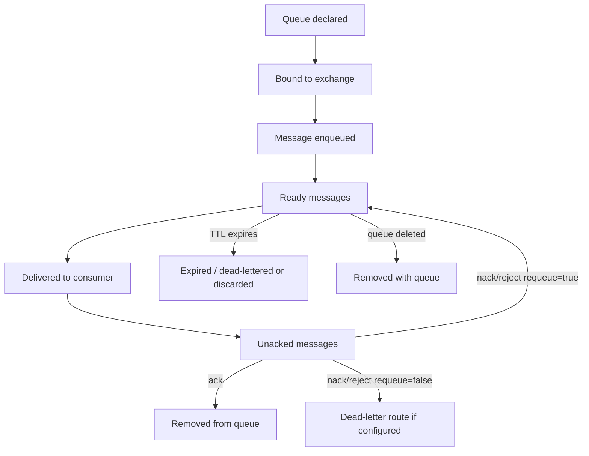
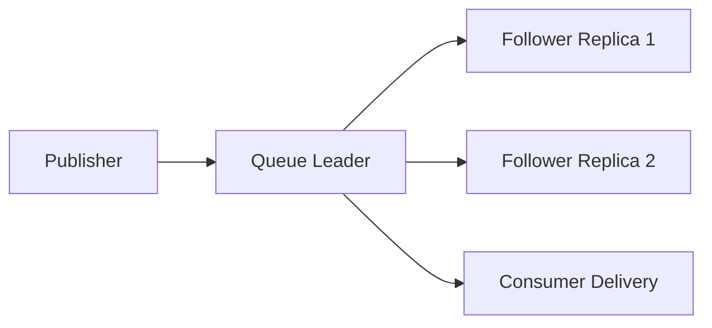

# Queue Types

## 1. Core idea

Queue adalah delivery boundary di RabbitMQ. Exchange menentukan **message harus masuk ke mana**. Queue menentukan **message menunggu siapa, disimpan bagaimana, dideliver ke consumer seperti apa, dan gagal dengan model apa**.

Mental model:

```text
Exchange = routing decision.
Queue = delivery buffer + consumer coordination + persistence/ordering/failure boundary.
Consumer = processing side-effect.
```

Queue type bukan detail kecil. Queue type memengaruhi:

- durability;
- replication;
- ordering;
- throughput;
- latency;
- poison message behavior;
- failover behavior;
- storage usage;
- memory usage;
- operational runbook;
- migration strategy;
- correctness guarantee yang bisa diklaim.

Di enterprise Java/JAX-RS system, queue sering menjadi batas antara HTTP/request lifecycle dan async processing lifecycle:

```text
JAX-RS request -> service transaction -> publisher -> exchange -> queue -> consumer -> DB side effect
```

Jika queue type salah, problem tidak selalu muncul saat development. Problem biasanya muncul saat traffic tinggi, consumer down, broker restart, node failure, retry storm, atau rolling deployment.

---

## 2. Queue lifecycle

Queue lifecycle konseptual:



Queue type memengaruhi semua tahap ini:

- bagaimana message disimpan;
- apakah replicated;
- bagaimana leader dipilih;
- bagaimana consumer delivery diatur;
- bagaimana message expired;
- bagaimana poison message ditangani;
- bagaimana queue behave saat broker restart/failover.

---

## 3. Classic queue

Classic queue adalah queue type historis/default di banyak RabbitMQ usage. Ia cocok untuk banyak workload queue-based messaging yang tidak membutuhkan built-in replicated quorum semantics.

### Cocok untuk

- simple work queue;
- task queue moderate traffic;
- non-critical transient workload;
- local/dev/test topology;
- queue yang tidak membutuhkan quorum replication;
- use case dengan operational trade-off yang dipahami.

### Core behavior

Classic queue menyimpan message dalam queue process/storage miliknya. Message bisa persistent atau transient, queue bisa durable atau non-durable, dan consumer delivery mengikuti model ack/prefetch RabbitMQ.

Important distinction:

```text
Durable queue != persistent message.
Persistent message != replicated queue.
```

Agar message survive broker restart pada basic level:

- queue harus durable;
- exchange harus durable;
- message harus persistent;
- publish harus confirmed;
- storage harus sehat.

### Classic queue risk

Risiko classic queue:

- tidak otomatis memberi HA data safety seperti quorum queue;
- classic mirrored queue adalah legacy/deprecated/removed awareness tergantung versi;
- queue dengan backlog besar bisa menekan memory/disk;
- priority queue overhead bisa tinggi;
- leader/node placement penting dalam cluster;
- migration ke quorum queue tidak selalu sekadar ganti flag.

### Java/JAX-RS implication

Jika Java consumer mengambil task dari classic queue, aplikasi tetap harus:

- manual ack setelah side-effect durable;
- idempotent terhadap duplicate delivery;
- punya retry/DLQ;
- memonitor queue depth dan unacked;
- graceful shutdown saat Kubernetes rolling update.

Queue type tidak menggantikan correctness di consumer.

---

## 4. Quorum queue

Quorum queue adalah queue type modern RabbitMQ untuk durable replicated queue berbasis Raft. Ia dirancang untuk data safety dan high availability yang lebih baik daripada classic mirrored queue legacy.

### Mental model



Publish masuk ke leader, lalu direplikasi ke follower sesuai quorum semantics. Jika leader gagal, queue dapat melakukan leader election.

### Cocok untuk

- critical command queue;
- order/quote state-changing task;
- integration message yang tidak boleh mudah hilang;
- workloads yang butuh HA queue storage;
- replacement untuk mirrored classic queue;
- production queue yang harus survive node failure.

### Trade-off

Quorum queue memberi data safety lebih kuat, tetapi ada biaya:

- write replication overhead;
- disk/storage pressure;
- latency bisa lebih tinggi daripada non-replicated queue untuk beberapa workload;
- cluster health lebih penting;
- quorum sizing dan node placement perlu diperhatikan;
- poison message handling harus dipahami;
- migration perlu rencana.

### Correctness note

Quorum queue membantu broker-side durability dan availability, tetapi tetap tidak memberi exactly-once processing.

Consumer tetap perlu:

- idempotency;
- inbox/processed message table untuk flow penting;
- ack discipline;
- retry/DLQ strategy;
- duplicate-safe state transition.

---

## 5. Stream queue and RabbitMQ Stream

RabbitMQ Stream berbeda dari queue tradisional. Stream lebih dekat ke log-like data structure dengan retention dan offset. Ia digunakan ketika replay/retention/streaming throughput lebih penting daripada pure work queue semantics.

### Queue vs stream mental model

```text
Queue:
  Message delivered and removed after ack.
  Designed for work distribution and task processing.

Stream:
  Message retained for a retention period/size.
  Consumers track offset.
  Designed for replayable stream consumption.
```

### Cocok untuk

- replayable event stream;
- high-throughput append flow;
- multiple consumers reading retained data;
- use case yang membutuhkan offset;
- stream processing ringan di RabbitMQ ecosystem;
- integration where Kafka is not selected but replay is needed.

### Tidak cocok untuk

- simple task queue;
- command queue dengan one-and-done processing;
- use case yang butuh Kafka ecosystem penuh;
- long-term event backbone tanpa menilai Kafka;
- workflow orchestration state.

### RabbitMQ Stream vs Kafka

RabbitMQ Stream memberi stream capability di RabbitMQ, tetapi bukan berarti semua Kafka use case otomatis pindah ke RabbitMQ Stream. Kafka tetap kuat untuk event backbone, ecosystem, partitioned log, stream processing, connector ecosystem, dan large-scale retention use case.

Part khusus RabbitMQ Stream nanti akan membahas lebih dalam.

---

## 6. Priority queue

Priority queue memungkinkan message dengan priority lebih tinggi dideliver lebih dahulu. Di RabbitMQ, priority queue terkait classic queue support dan memiliki overhead karena broker perlu mengelola prioritas internal.

### Cocok untuk

- task queue dengan prioritas terbatas;
- operational command urgent;
- small number of priority levels;
- workload yang memang membutuhkan service differentiation.

### Risiko

Priority queue sering terlihat menarik, tetapi punya risiko:

- starvation untuk message priority rendah;
- ordering normal rusak;
- overhead CPU/memory meningkat;
- producer bisa menyalahgunakan high priority;
- retry message bisa berinteraksi buruk dengan priority;
- debugging menjadi lebih sulit.

### Rule of thumb

Jika menggunakan priority:

```text
Use few priority levels.
Define who is allowed to publish high priority.
Monitor starvation.
Document business meaning of each priority.
```

Jangan pakai priority queue untuk menutupi consumer capacity problem. Jika semua message menjadi high priority, priority tidak berarti lagi.

---

## 7. Lazy queue concept

Lazy queue concept berarti queue lebih agresif menyimpan message ke disk untuk mengurangi memory usage pada backlog besar. Perlu diperhatikan bahwa behavior dan konfigurasi lazy queue berubah antar versi RabbitMQ; verifikasi versi yang dipakai.

### Cocok untuk

- backlog besar;
- batch-like workload;
- consumer downtime yang bisa membuat queue menumpuk;
- workload yang lebih mementingkan memory safety daripada latency minimum.

### Risiko

- latency delivery bisa meningkat;
- disk IO menjadi bottleneck;
- tidak menyelesaikan root cause consumer lambat;
- jika disk hampir penuh, lazy behavior tidak menyelamatkan sistem;
- perlu alert disk dan queue depth yang kuat.

### Review question

- Mengapa queue diperkirakan punya backlog besar?
- Apakah backlog besar normal atau symptom failure?
- Apakah consumer capacity cukup?
- Apakah disk IO dan disk free limit dimonitor?
- Apakah DLQ/retry ikut memperbesar backlog?

---

## 8. Exclusive queue

Exclusive queue hanya bisa digunakan oleh connection yang mendeklarasikannya dan biasanya dihapus ketika connection tersebut tertutup.

### Cocok untuk

- temporary reply queue;
- short-lived consumer-specific queue;
- test/local scenario;
- private callback queue;
- dynamic subscription internal.

### Tidak cocok untuk

- durable command queue;
- production work queue;
- queue yang harus survive application restart;
- shared subscriber queue;
- queue yang menjadi integration contract.

### Failure mode

Jika exclusive queue dipakai untuk flow yang harus durable:

```text
Connection closes -> queue deleted -> messages disappear / route fails / reply lost.
```

Review code yang mendeklarasikan exclusive queue dan pastikan semantic-nya temporary.

---

## 9. Auto-delete queue

Auto-delete queue dihapus ketika tidak lagi digunakan sesuai lifecycle consumer/binding-nya. Ia berguna untuk temporary subscription tetapi berbahaya jika dipakai untuk durable business processing.

### Cocok untuk

- temporary subscription;
- ephemeral integration test;
- transient reply queue;
- short-lived debugging queue jika prosedur mengizinkan.

### Risiko

- queue hilang saat consumer disconnect;
- binding hilang bersama queue;
- publisher tidak tahu route hilang kecuali mandatory/AE disiapkan;
- behavior bisa environment-specific;
- accidental data loss jika dianggap durable.

### Review question

- Apakah queue ini harus menerima message saat consumer offline?
- Apakah message boleh hilang saat queue hilang?
- Apakah queue name generated/dynamic?
- Apakah auto-delete sesuai business requirement?

---

## 10. Temporary queue

Temporary queue adalah kategori desain, bukan hanya satu flag. Biasanya melibatkan queue non-durable, exclusive, auto-delete, dan server-generated name.

### Use case

- RPC reply queue;
- temporary event subscription;
- local testing;
- short-lived session interaction.

### Production warning

Temporary queue tidak boleh menjadi tempat business-critical work menunggu.

Jika message harus survive:

- consumer restart;
- pod reschedule;
- node restart;
- broker restart;
- network glitch;

maka temporary queue biasanya salah.

---

## 11. Durable queue

Durable queue definition bertahan setelah broker restart. Tetapi durable queue tidak berarti semua message aman.

Untuk persistence basic:

```text
Durable exchange
+ Durable queue
+ Persistent message
+ Publisher confirm
+ Healthy storage
= stronger chance message survives broker restart
```

Untuk node failure/HA:

```text
Quorum queue or stream replication must be considered.
```

### Failure mode

Queue durable tetapi message transient:

```text
Broker restart -> queue still exists -> transient messages may be lost.
```

Message persistent tetapi queue non-durable:

```text
Broker restart -> queue gone -> message has nowhere meaningful to survive.
```

### Review question

- Queue durable atau tidak?
- Message delivery mode persistent atau tidak?
- Publisher confirm digunakan atau tidak?
- Queue replicated atau tidak?
- Storage alert tersedia atau tidak?

---

## 12. Non-durable queue

Non-durable queue tidak bertahan setelah broker restart. Ia cocok untuk ephemeral use case, bukan production command/task/event processing yang perlu recovery.

### Cocok untuk

- local dev;
- temporary reply;
- throwaway subscription;
- test harness;
- real-time notification yang boleh hilang.

### Tidak cocok untuk

- order submission task;
- pricing job penting;
- approval workflow task;
- fulfillment integration;
- billing-related message;
- audit/compliance flow;
- retry/DLQ queue.

### Internal verification

Jika menemukan non-durable queue di production, jangan langsung menyimpulkan salah. Tanya:

- apakah queue temporary by design?
- apakah data boleh hilang?
- apakah ada source of truth lain?
- apakah queue hanya cache notification?
- apakah runbook menjelaskan loss tolerance?

---

## 13. Single active consumer

Single active consumer memastikan hanya satu consumer aktif menerima message dari queue pada satu waktu, sementara consumer lain standby. Ini berguna untuk ordering atau exclusive processing tanpa menghilangkan failover consumer.

### Cocok untuk

- per-aggregate ordering;
- sequential workflow step;
- external system yang tidak tahan parallel call;
- job yang harus diproses satu per satu;
- migration processor;
- state transition stream yang butuh serialized handling.

### Trade-off

- throughput terbatas;
- consumer aktif menjadi bottleneck;
- failover perlu diuji;
- backlog bisa cepat naik;
- horizontal scaling tidak meningkatkan parallelism untuk queue itu.

### Design note

Single active consumer bisa menjaga order pada satu queue, tetapi jika satu queue berisi banyak aggregate, semua aggregate ikut serial. Untuk high-throughput, pertimbangkan sharding per aggregate group, consistent hash, atau stream partitioning, tetapi itu menambah complexity.

---

## 14. Mirrored queue legacy awareness

Classic mirrored queue adalah mekanisme HA lama RabbitMQ yang telah deprecated dan pada RabbitMQ 4.x sudah removed. Quorum queue dan stream adalah arah modern untuk replicated queue/stream.

### Kenapa tetap perlu tahu

Enterprise system sering punya legacy cluster atau dokumentasi lama. Anda mungkin menemukan istilah:

```text
ha-mode
ha-sync-mode
mirrored queue
classic mirrored queue
queue master
```

Jangan langsung menyalin pattern lama ke sistem baru.

### Internal verification checklist

- Versi RabbitMQ production berapa?
- Apakah ada policy HA legacy?
- Apakah classic mirrored queue masih ada di environment lama?
- Apakah migration plan ke quorum queue sudah ada?
- Apakah runbook masih memakai istilah queue master lama?

---

## 15. Queue leader

Dalam cluster RabbitMQ, queue/stream memiliki leader/primary replica. Publishing dan delivery akan melalui leader sesuai queue type. Untuk classic queue, leader bisa menjadi satu-satunya replica. Untuk quorum queue/stream, leader mereplikasi ke follower.

### Kenapa penting

Queue leader memengaruhi:

- latency;
- cross-node traffic;
- failover behavior;
- load distribution;
- node hotspot;
- Kubernetes pod placement;
- zone/region traffic.

### Failure mode

Jika banyak queue leader terkonsentrasi pada satu node:

- node tersebut menjadi hotspot;
- memory/disk/network pressure naik;
- consumer latency naik;
- node failure berdampak luas;
- failover storm bisa terjadi.

### Review question

- Bagaimana queue leader didistribusikan?
- Apakah queue leader berada dekat dengan major client traffic?
- Apakah quorum replicas tersebar di node/zone yang benar?
- Apakah rolling restart mengubah leader distribution?

---

## 16. Queue replication

Replication berbeda tergantung queue type:

- classic queue modern umumnya non-replicated;
- quorum queue replicated dengan Raft;
- stream replicated sesuai stream configuration;
- mirrored classic queue adalah legacy awareness.

Replication membantu availability/data safety tetapi menambah cost.

### Cost

- more disk writes;
- more network traffic;
- coordination latency;
- more operational complexity;
- quorum availability dependency;
- cluster sizing requirement.

### Design principle

Tidak semua queue harus replicated. Tetapi queue yang membawa state-changing command penting biasanya perlu replicated atau punya recovery mechanism lain.

Pertanyaan kunci:

```text
If this queue is lost, can we reconstruct messages from database/outbox/source of truth?
If not, why is it not replicated?
```

---

## 17. Queue type trade-off matrix

| Queue type / feature | Strength | Risk | Typical use |
|---|---|---|---|
| Classic queue | Simple, familiar, broad compatibility | Limited HA/data safety unless combined with other mechanisms | General work queue, moderate task flow |
| Quorum queue | Replicated, data safety, HA-oriented | More disk/network/coordination cost | Critical command/task queue |
| Stream | Retention, replay, offset-based consumption | Different model from queue, operational learning curve | Replayable event stream |
| Priority queue | Urgent message ordering | Starvation, overhead, ordering disruption | Limited priority task processing |
| Exclusive queue | Private temporary lifecycle | Deleted with connection | Reply queue, temporary callback |
| Auto-delete queue | Self-cleaning temporary topology | Accidental deletion | Temporary subscription |
| Durable queue | Survives broker restart definition-wise | Does not guarantee message persistence alone | Production stable topology |
| Non-durable queue | Lightweight ephemeral | Lost on restart | Dev/test, transient notification |
| Single active consumer | Serialized processing with standby | Throughput bottleneck | Ordered processing |

---

## 18. Queue selection framework

Use this decision path:

```text
1. Is the message business-critical?
   yes -> durable + persistent + confirm + likely quorum/outbox/inbox
   no  -> classic/non-durable may be acceptable depending use case

2. Must message survive node failure?
   yes -> quorum queue or stream replication
   no  -> classic queue may be sufficient

3. Is replay required?
   yes -> RabbitMQ Stream or Kafka evaluation
   no  -> normal queue

4. Is work distributed among competing consumers?
   yes -> classic/quorum work queue
   no  -> per-subscriber queue or stream consumer model

5. Is strict ordering required?
   yes -> single consumer/single active consumer/per-key sharding/stream partitioning
   no  -> scale consumer concurrency

6. Is queue temporary?
   yes -> exclusive/auto-delete/non-durable possible
   no  -> durable named queue

7. Is priority truly required?
   yes -> limited priority levels and starvation monitoring
   no  -> avoid priority complexity
```

---

## 19. Java/JAX-RS backend impact

Queue type impacts application design.

### Critical command queue

For a command triggered by JAX-RS endpoint:

```text
POST /orders/{id}/submit
```

If processing is async:

- endpoint should return `202 Accepted` if work is not complete;
- command message should be idempotent;
- queue should likely be durable;
- message should be persistent;
- publisher confirm/outbox should be considered;
- consumer should ack after DB side-effect;
- retry/DLQ should exist;
- queue type should support expected HA requirement.

### Background task queue

For non-critical background task:

- classic queue may be enough;
- retry/DLQ still needed;
- queue depth alert based on SLA;
- idempotency still needed if side-effect exists.

### Temporary reply queue

For request-reply:

- exclusive/auto-delete queue may be acceptable;
- correlation ID mandatory;
- timeout handling mandatory;
- lost reply must be acceptable or recoverable.

---

## 20. PostgreSQL/MyBatis/JDBC impact

Queue type does not replace database correctness.

### Outbox relation

If message is derived from DB transaction, outbox is often more important than queue type alone.

```text
DB transaction writes business row + outbox row.
Publisher later publishes outbox row to RabbitMQ.
Queue receives message.
Consumer performs idempotent side-effect.
```

With outbox, even if publish fails, message intent remains in PostgreSQL.

### Inbox relation

With at-least-once delivery, consumer should deduplicate using:

- inbox table;
- processed message table;
- unique business constraint;
- idempotent state transition.

Queue type can reduce loss/failover risk, but cannot prevent duplicate processing.

### Repairability

Ask:

- If queue is lost, can messages be reconstructed from outbox?
- If consumer double-processes, can DB constraint prevent damage?
- If message goes DLQ, can business state be reconciled?
- If queue backlog is huge, can DB handle catch-up load?

---

## 21. Microservices and distributed consistency impact

Queue type shapes distributed consistency behavior.

### Command queue

A command queue usually has one logical owner. Queue type should match criticality.

```text
order.command.queue -> order-service consumer
```

Correctness concern:

- duplicate command;
- lost command;
- command processed after state changed;
- retry command after timeout;
- DLQ command requiring manual intervention.

### Event subscriber queue

Each subscriber should have its own queue to isolate slow consumers.

```text
quote.event.exchange -> notification-service.queue
                     -> audit-service.queue
                     -> integration-service.queue
```

Correctness concern:

- one subscriber down should not block others;
- each queue has its own retry/DLQ;
- event schema compatibility matters;
- replay expectation must be clear.

### Shared queue risk

If multiple services share one queue unintentionally:

- messages load balance instead of broadcast;
- one service may consume message intended for another;
- debugging becomes ambiguous;
- ownership is broken.

Rule:

```text
Competing consumers on one queue should be replicas of the same logical consumer, not different business services.
```

---

## 22. Kubernetes/AWS/Azure/on-prem impact

Queue type interacts with deployment environment.

### Kubernetes

For RabbitMQ broker in Kubernetes:

- quorum queue needs stable storage;
- replicas should spread across nodes/zones;
- pod disruption budgets matter;
- rolling restart affects queue leader/follower;
- PVC performance matters;
- network latency between pods matters.

For Java consumers in Kubernetes:

- replicas multiply concurrency;
- prefetch per replica matters;
- shutdown must drain or nack safely;
- rolling update can cause redelivery;
- single active consumer can limit scale.

### AWS/Azure/cloud-managed

Verify:

- supported RabbitMQ version;
- supported queue types;
- plugin availability;
- storage performance;
- Multi-AZ behavior;
- maintenance window behavior;
- metrics exposed;
- backup/snapshot semantics.

### On-prem/hybrid

Verify:

- disk layout;
- filesystem performance;
- network latency;
- firewall behavior;
- certificate rotation;
- monitoring stack;
- cluster partition handling;
- backup/restore runbook.

---

## 23. Failure modes by queue type/feature

### 23.1 Classic queue node failure

Symptom:

- queue unavailable or data loss depending configuration/version;
- consumers disconnect;
- publish/consume errors;
- queue leader unavailable.

Debug:

- check node health;
- check queue leader;
- check queue durability and message persistence;
- check whether queue was replicated or not;
- check outbox/reconstructability.

### 23.2 Quorum queue quorum loss

Symptom:

- queue unavailable;
- publish blocked/fails;
- consumer cannot receive;
- cluster/node health issue.

Debug:

- check quorum members;
- check leader election;
- check node availability;
- check disk/network;
- avoid unsafe manual intervention without SRE/platform procedure.

### 23.3 Stream retention surprise

Symptom:

- consumer cannot replay older message;
- offset points to data no longer retained;
- expected audit replay unavailable.

Debug:

- check retention policy;
- check stream length/age;
- check consumer offset;
- check whether Kafka should have been used.

### 23.4 Priority starvation

Symptom:

- low priority messages stuck;
- SLA missed for normal work;
- high priority traffic dominates.

Debug:

- inspect priority distribution;
- check consumer capacity;
- check business rules for priority;
- consider separate queues per priority class.

### 23.5 Temporary queue deletion

Symptom:

- reply lost;
- binding gone;
- publisher returns unroutable;
- intermittent failure after consumer reconnect.

Debug:

- check exclusive/auto-delete flags;
- check connection lifecycle;
- check queue declaration logs;
- check reply timeout handling.

---

## 24. Detection and observability

Queue observability minimum:

- ready messages;
- unacked messages;
- total messages;
- publish rate;
- deliver rate;
- ack rate;
- redelivery rate;
- consumer count;
- consumer utilization;
- queue type;
- durable flag;
- auto-delete/exclusive flags;
- memory usage;
- disk usage;
- leader node;
- replica status for quorum/stream;
- DLQ depth;
- retry queue depth;
- oldest message age if available.

### Alert examples

- critical queue depth above threshold for N minutes;
- unacked messages increasing while ack rate low;
- consumer count zero for critical queue;
- DLQ depth increase;
- retry queue age too high;
- quorum queue unavailable;
- node disk alarm;
- redelivery rate spike;
- low priority starvation.

### Logging minimum in consumer

```text
messageId
correlationId
queue
consumerTag
deliveryTag
redelivered
messageType
aggregateId
processingResult
ackNackDecision
processingLatency
```

Avoid logging full payload if it may contain sensitive data.

---

## 25. Debugging workflow: queue depth increasing

When queue depth grows:

```text
1. Identify queue type and criticality.
2. Check consumer count.
3. Check deliver rate vs ack rate.
4. Check unacked count.
5. Check redelivery rate.
6. Check consumer logs/errors.
7. Check downstream DB/API latency.
8. Check retry/DLQ movement.
9. Check broker memory/disk alarm.
10. Check recent deployment/config changes.
11. Decide: scale consumers, stop publishers, drain, replay, or incident escalate.
```

Do not blindly scale consumers if:

- downstream DB is already saturated;
- messages require ordering;
- consumer is failing due to poison message;
- retry storm is active;
- external dependency is down.

---

## 26. Queue type migration

Queue type migration is a production change, not a rename-only refactor.

### Why migration happens

- classic to quorum for HA/data safety;
- classic mirrored legacy to quorum;
- queue to stream for replay;
- priority queue split into separate queues;
- shared queue split per service;
- non-durable to durable queue;
- temporary queue removed from business flow.

### Migration concerns

- queue arguments are immutable for some properties;
- existing messages must be drained or moved;
- producers and consumers may need config change;
- binding must be updated;
- retry/DLQ topology must be preserved;
- monitoring and alerts must be updated;
- rollback must be planned;
- duplicate processing risk during dual-run;
- ordering can break during migration.

### Safe migration pattern

```text
1. Create new queue with desired type/name.
2. Bind new queue carefully.
3. Deploy consumer capable of idempotency.
4. Dual-publish or rebind according to plan.
5. Drain old queue.
6. Disable old binding.
7. Monitor new queue.
8. Remove old queue after retention window.
```

Exact steps depend on internal topology and must be verified with platform/SRE.

---

## 27. Queue type review checklist

### Identity and ownership

- What is the queue name?
- Which vhost?
- Which service owns it?
- Is it command, event subscriber, task, retry, DLQ, reply, audit, or temporary queue?
- Which exchange/binding feeds it?

### Queue type

- Is it classic, quorum, stream, priority, exclusive, auto-delete, durable, non-durable?
- Why this type?
- What failure does this type tolerate?
- What failure does it not tolerate?
- Is the type supported in all environments?

### Durability and persistence

- Is queue durable?
- Are messages persistent?
- Are publisher confirms used?
- Is queue replicated if needed?
- Is outbox used for reconstruction?

### Consumer model

- How many consumers?
- Are they replicas of same logical consumer?
- Is single active consumer needed?
- What is prefetch?
- What happens during rolling update?

### Reliability

- Is retry configured?
- Is DLQ configured?
- Is poison message isolated?
- Is manual replay safe?
- Is idempotency implemented?

### Observability

- Is queue depth monitored?
- Is unacked monitored?
- Is consumer count monitored?
- Is DLQ/retry monitored?
- Is queue age/oldest message monitored?
- Is queue type visible in dashboard/runbook?

### Operations

- Is queue declared as code?
- Is migration plan documented?
- Is queue deletion protected?
- Is owner documented?
- Is runbook available?

---

## 28. Internal verification checklist

Untuk konteks CSG/team, verifikasi hal berikut tanpa mengasumsikan detail internal:

- Daftar queue aktual per vhost.
- Queue type setiap queue: classic, quorum, stream, priority, exclusive, auto-delete, durable/non-durable.
- Queue mana yang business-critical.
- Queue mana yang temporary/reply/test.
- Queue mana yang command queue, event subscriber queue, retry queue, DLQ, parking lot queue.
- Queue leader distribution di cluster.
- Replication factor quorum/stream jika digunakan.
- Apakah classic mirrored queue legacy masih ada.
- Apakah single active consumer digunakan.
- Apakah priority queue digunakan dan berapa priority level.
- Apakah lazy behavior/policy digunakan.
- Apakah queue declaration dilakukan aplikasi, Helm, operator, definitions, Terraform, atau manual UI.
- Apakah queue arguments konsisten antar environment.
- Apakah queue punya DLX/retry/TTL/max length policy.
- Apakah consumer owner jelas.
- Apakah queue depth, unacked, redelivery, DLQ, retry queue dimonitor.
- Apakah ada incident notes terkait queue growth, queue loss, redelivery storm, quorum availability, atau priority starvation.

---

## 29. Senior engineer mental model

Queue type selection harus selalu dimulai dari pertanyaan ini:

```text
What kind of promise does this queue need to provide,
and what is the recovery path when that promise fails?
```

Jangan memilih quorum queue hanya karena terdengar lebih aman. Jangan memilih classic queue hanya karena default. Jangan memilih stream hanya karena ingin replay. Jangan memilih priority karena ingin semua hal penting.

Pilih berdasarkan:

- business criticality;
- loss tolerance;
- replay requirement;
- ordering requirement;
- throughput and latency requirement;
- storage and replication cost;
- operational maturity;
- migration complexity;
- idempotency and repair strategy.

Queue adalah boundary produksi. Treat it like a production data structure, not just a pipe.

---

## 30. Reference map

Gunakan dokumentasi resmi berikut untuk verifikasi detail teknis sesuai versi RabbitMQ yang digunakan team:

- RabbitMQ Queues documentation: `https://www.rabbitmq.com/docs/queues`
- RabbitMQ Classic Queues documentation: `https://www.rabbitmq.com/docs/classic-queues`
- RabbitMQ Quorum Queues documentation: `https://www.rabbitmq.com/docs/quorum-queues`
- RabbitMQ Streams documentation: `https://www.rabbitmq.com/docs/streams`
- RabbitMQ Priority Queues documentation: `https://www.rabbitmq.com/docs/priority`
- RabbitMQ Clustering documentation: `https://www.rabbitmq.com/docs/clustering`
- RabbitMQ Classic Queue Mirroring legacy documentation: `https://www.rabbitmq.com/docs/3.13/ha`
