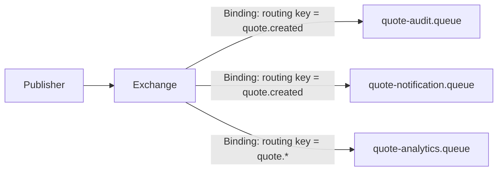
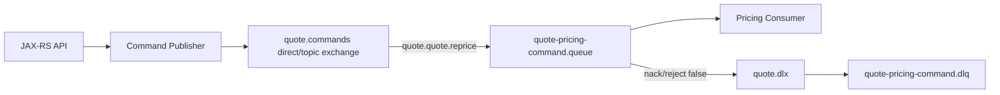
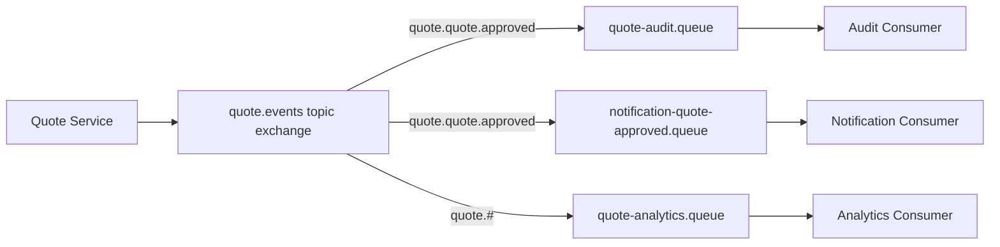
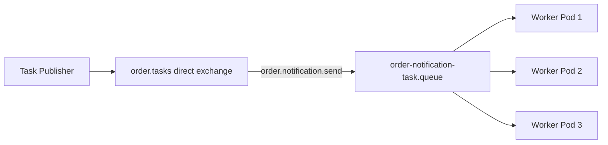
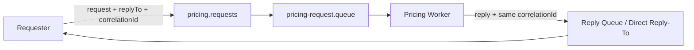
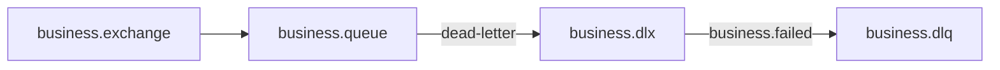
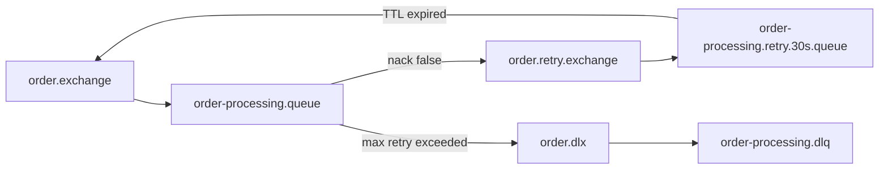
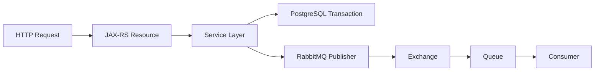

# Binding and Routing Topology Design

## 1. Core idea

RabbitMQ topology adalah desain hubungan antara:

- exchange,
- queue,
- binding,
- routing key,
- dead-letter exchange,
- retry exchange,
- parking lot queue,
- producer ownership,
- consumer ownership,
- vhost,
- policy,
- operational runbook.

Topology bukan sekadar konfigurasi broker. Dalam sistem enterprise, topology adalah **kontrak arsitektur**.

Mental model paling penting:

```text
Producer publishes intent.
Exchange evaluates routing rules.
Binding decides delivery eligibility.
Queue owns buffering and delivery lifecycle.
Consumer owns processing correctness.
Topology connects all of them into an operational contract.
```

Jika topology buruk, masalahnya biasanya tidak langsung terlihat saat development. Ia muncul saat production:

- message tidak sampai ke consumer;
- message masuk queue yang salah;
- queue depth naik tanpa owner jelas;
- DLQ penuh tetapi tidak ada replay process;
- retry loop membuat broker pressure;
- event fanout membuat slow subscriber mengganggu diagnosis;
- routing key berubah tanpa backward compatibility;
- service baru membuat binding wildcard terlalu luas;
- queue dibuat manual di UI dan hilang saat environment rebuild;
- topology staging berbeda dengan production.

Dalam konteks Java/JAX-RS backend, topology menentukan bagaimana HTTP command, domain event, task, integration message, dan retry/DLQ berpindah dari service boundary ke message boundary.

---

## 2. Why topology design exists

RabbitMQ memberi primitive yang sangat fleksibel:

```text
Exchange + Binding + Queue + Routing Key
```

Fleksibilitas ini kuat, tetapi juga berbahaya. Tanpa discipline, topology berubah menjadi invisible distributed coupling.

Topology design ada untuk menjawab pertanyaan berikut:

1. Siapa boleh publish message ini?
2. Exchange mana yang menjadi public routing surface?
3. Routing key apa yang legal?
4. Queue mana yang menerima message?
5. Siapa owner queue?
6. Apakah queue ini command, event subscriber, task, retry, DLQ, atau parking lot?
7. Bagaimana message gagal diproses?
8. Bagaimana message di-retry?
9. Bagaimana message masuk DLQ?
10. Bagaimana message di-replay?
11. Bagaimana topology dipromosikan antar environment?
12. Bagaimana topology dihapus tanpa breaking consumer?

Senior engineer tidak hanya bertanya:

```text
Can this service publish and consume?
```

Pertanyaan yang lebih benar:

```text
Is this topology explicit, owned, observable, secure, evolvable, and safe under failure?
```

---

## 3. Binding mental model

Binding adalah relationship broker-side antara exchange dan queue, atau antara exchange dan exchange.



Binding menjawab:

```text
If a message is published to this exchange,
under which condition should this queue receive it?
```

Berdasarkan exchange type:

- direct exchange: binding key harus match routing key secara exact;
- topic exchange: binding key bisa memakai wildcard `*` dan `#`;
- fanout exchange: binding key biasanya tidak relevan;
- headers exchange: routing berdasarkan header match;
- default exchange: queue otomatis bind menggunakan nama queue sebagai routing key;
- plugin exchange: behavior tergantung plugin.

Binding adalah tempat di mana banyak coupling tersembunyi terjadi. Contoh:

```text
Exchange: order.events
Routing key: order.created
Queue A binding: order.*
Queue B binding: order.#
Queue C binding: #
```

Secara teknis mungkin valid. Secara arsitektur, `#` sering menjadi smell karena queue dapat menerima message yang tidak pernah dirancang untuknya.

---

## 4. Routing key design

Routing key adalah string yang digunakan publisher untuk memberi sinyal routing ke exchange.

Routing key yang baik harus:

- stabil;
- predictable;
- mudah dibaca manusia;
- tidak terlalu granular;
- tidak terlalu broad;
- tidak menyimpan PII;
- tidak mencampur concern teknis dan domain secara sembarangan;
- kompatibel dengan evolution;
- bisa dicari di log, dashboard, dan tracing.

Contoh taxonomy yang cukup sehat:

```text
<domain>.<entity>.<event>
quote.quote.created
quote.quote.approved
order.order.submitted
order.fulfillment.failed
catalog.product.updated
billing.invoice.generated
```

Untuk command:

```text
<domain>.<aggregate>.<command>
quote.quote.reprice
order.order.submit
order.fulfillment.schedule
```

Untuk task:

```text
<domain>.<worker-area>.<task>
quote.pricing.calculate
order.notification.send
integration.crm.sync
```

Hindari routing key seperti:

```text
process
message
event
new
update
service-a
urgent
high
tenant-123.customer.email@example.com
```

Masalahnya:

- terlalu generik;
- tidak jelas ownership;
- sulit dipakai topic wildcard;
- bisa mengandung data sensitif;
- sulit dicari saat incident;
- membuat consumer coupling ke producer implementation detail.

---

## 5. Routing key taxonomy: domain-first vs service-first

Ada dua gaya umum.

### Domain-first

```text
quote.quote.created
quote.quote.approved
order.order.submitted
```

Cocok untuk event dan business-level integration. Producer menyatakan fakta domain, bukan nama service.

Kelebihan:

- consumer tidak tergantung nama producer service;
- cocok untuk event distribution;
- lebih stabil terhadap refactor service;
- mudah dipakai untuk audit dan observability.

Kekurangan:

- perlu governance domain vocabulary;
- rawan overlap jika domain boundary belum jelas;
- butuh versioning strategy.

### Service-first

```text
quote-service.quote.created
order-service.order.submitted
```

Cocok untuk internal technical command atau service-specific task, tetapi berisiko membuat message contract melekat pada nama service.

Kelebihan:

- jelas producer asalnya;
- mudah debugging awal;
- cocok untuk service-owned internal queue.

Kekurangan:

- refactor service bisa memecahkan routing;
- consumer menjadi tergantung producer implementation;
- kurang ideal untuk enterprise event contract.

Rule praktis:

```text
Use domain-first for events.
Use target-capability or service-owned naming for commands/tasks.
Avoid routing keys that encode volatile implementation details.
```

---

## 6. Command queue topology

Command message meminta service melakukan sesuatu.

Contoh:

```text
Exchange: quote.commands
Routing key: quote.quote.reprice
Queue: quote-pricing-command.queue
Consumer: quote-pricing-worker
```

Command memiliki karakteristik:

- biasanya punya single logical owner;
- tidak boleh difanout sembarangan;
- harus idempotent;
- duplicate command bisa berbahaya;
- ordering mungkin penting per aggregate;
- retry perlu hati-hati;
- DLQ harus punya owner jelas.

Topology umum:



Review questions:

- Apakah command punya satu owner yang jelas?
- Apakah producer tahu efek business command?
- Apakah consumer idempotent?
- Apakah retry command bisa menyebabkan double side effect?
- Apakah command membutuhkan ordering per quote/order?
- Apakah command boleh diproses paralel?

---

## 7. Event queue topology

Event message menyatakan bahwa sesuatu telah terjadi.

Contoh:

```text
Exchange: quote.events
Routing key: quote.quote.approved
Queue: approval-audit-subscriber.queue
Queue: notification-subscriber.queue
Queue: downstream-integration-subscriber.queue
```

Event memiliki karakteristik:

- bisa punya banyak subscriber;
- producer tidak tahu semua consumer;
- event harus backward-compatible;
- setiap consumer punya queue sendiri;
- slow subscriber tidak boleh menghambat subscriber lain;
- replay terbatas kecuali memakai stream/log architecture;
- consumer harus idempotent.

Topology umum:



Review questions:

- Apakah setiap subscriber punya queue sendiri?
- Apakah event schema/version jelas?
- Apakah producer tidak bergantung pada jumlah subscriber?
- Apakah slow subscriber punya alert sendiri?
- Apakah event replay expectation terdokumentasi?
- Apakah event tidak membawa field sensitif yang tidak dibutuhkan semua subscriber?

---

## 8. Work queue topology

Work queue dipakai untuk mendistribusikan task ke banyak worker.

Contoh:

```text
Exchange: order.tasks
Routing key: order.notification.send
Queue: order-notification-task.queue
Consumers: N replicas of notification-worker
```

Karakteristik:

- banyak consumer bersaing pada satu queue;
- message diproses oleh satu worker;
- prefetch menentukan fairness;
- task harus idempotent;
- worker shutdown harus drain in-flight message;
- job timeout dan retry harus jelas;
- queue depth adalah backlog signal.

Topology:



Review questions:

- Apakah task boleh berjalan paralel?
- Apakah task punya timeout?
- Apakah worker punya graceful shutdown?
- Apakah prefetch dikalikan replica masih masuk akal?
- Apakah queue depth dimonitor sebagai backlog?
- Apakah retry task bisa menyebabkan duplicate external call?

---

## 9. Reply queue topology

Reply queue dipakai dalam request-reply atau RPC pattern.

Contoh:

```text
Request exchange: pricing.requests
Request routing key: pricing.calculate
Reply-to: amq.rabbitmq.reply-to atau temporary reply queue
Correlation ID: request-id
```

Topology:



Risiko:

- synchronous expectation di atas async system;
- timeout ambiguity;
- duplicate reply;
- lost reply;
- requester mati sebelum reply;
- reply queue lifecycle salah;
- backpressure cascade ke API thread.

Rule praktis:

```text
Use RabbitMQ request-reply only when the asynchronous boundary is intentional.
Use HTTP/gRPC when the interaction is naturally synchronous and low-latency.
```

---

## 10. Dead-letter topology

Dead-letter topology menentukan ke mana message pergi saat gagal secara final dari queue utama.

Message dapat dead-letter karena:

- rejected/nacked dengan requeue=false;
- expired karena TTL;
- queue length limit exceeded;
- quorum queue delivery limit tercapai;
- broker-specific dead-letter condition.

Topology umum:



Prinsip penting:

- DLQ harus punya owner;
- DLQ harus dimonitor;
- DLQ harus punya retention expectation;
- DLQ harus punya replay process;
- DLQ tidak boleh menjadi tempat sampah permanen yang tidak dibaca;
- DLQ bisa mengandung PII dan harus diperlakukan sebagai data store sensitif.

Review questions:

- Apakah DLX dikonfigurasi via policy atau queue argument?
- Apakah DLQ routing key jelas?
- Apakah x-death header dipakai untuk diagnosis?
- Apakah DLQ alert punya threshold?
- Apakah ada manual replay tool/runbook?

---

## 11. Retry topology

Retry topology mengatur message gagal sementara agar tidak langsung masuk DLQ final.

Pola umum TTL retry:



Pola delayed exchange retry:

```text
Main queue failure -> publish to delayed exchange -> delay expires -> route back to main queue
```

Trade-off:

| Pattern | Strength | Risk |
|---|---|---|
| Immediate requeue | Simple | Redelivery storm |
| TTL retry queue | Works without delayed plugin | Ordering can be surprising |
| Delayed exchange | Cleaner delay semantics | Requires plugin and governance |
| Parking lot | Safe isolation | Needs manual/automated replay process |

Retry harus dibatasi. Infinite retry adalah incident yang ditunda.

---

## 12. Parking lot queue

Parking lot queue adalah queue isolasi untuk message yang tidak boleh diproses otomatis lagi.

Contoh:

```text
order-processing.parking-lot.queue
quote-pricing.parking-lot.queue
integration-crm.parking-lot.queue
```

Parking lot dipakai ketika:

- retry count sudah habis;
- payload invalid tetapi perlu investigasi;
- downstream system terus gagal;
- message butuh manual repair;
- replay harus dikontrol manusia atau batch tool.

Bedakan:

```text
DLQ = failed message bucket.
Parking lot = intentionally isolated failed message requiring review/repair.
```

Dalam beberapa team, DLQ dan parking lot sama. Dalam sistem mission-critical, memisahkan keduanya sering membantu operasi.

Review questions:

- Siapa owner parking lot?
- Bagaimana message direpair?
- Apakah replay preserve original metadata?
- Apakah replay bisa menyebabkan duplicate side effect?
- Apakah parking lot punya SLA?

---

## 13. Per-service queue

Per-service queue berarti queue dimiliki oleh satu service atau bounded context.

Contoh:

```text
quote-service.command.queue
order-service.command.queue
notification-service.event.queue
```

Kelebihan:

- ownership jelas;
- alert routing mudah;
- consumer deployment mudah dilacak;
- scaling per service lebih sederhana;
- permission bisa lebih ketat.

Kekurangan:

- queue bisa terlalu coarse;
- satu queue menerima terlalu banyak message type;
- processing slow untuk satu message type bisa menahan message lain;
- retry/DLQ diagnosis bisa tercampur.

Gunakan jika message types relatif homogen atau service punya dispatcher internal yang kuat.

---

## 14. Per-consumer queue

Per-consumer queue berarti setiap subscriber event punya queue sendiri.

Contoh:

```text
quote-events.audit-consumer.queue
quote-events.notification-consumer.queue
quote-events.analytics-consumer.queue
```

Kelebihan:

- subscriber isolation;
- slow consumer tidak menghambat consumer lain;
- retry/DLQ per consumer;
- ownership jelas;
- schema compatibility bisa dikelola per subscriber.

Kekurangan:

- queue count meningkat;
- topology lebih banyak;
- perlu naming/governance;
- observability harus lebih matang.

Untuk event distribution, per-consumer queue biasanya lebih aman daripada satu shared queue untuk banyak logical subscriber.

---

## 15. Per-tenant queue

Per-tenant queue memisahkan traffic per tenant.

Contoh:

```text
tenant-a.order-processing.queue
tenant-b.order-processing.queue
```

Kelebihan:

- isolation lebih kuat;
- noisy tenant bisa dibatasi;
- alert dan replay per tenant;
- akses bisa dipisahkan;
- data residency/compliance lebih mudah dibahas.

Kekurangan:

- queue explosion;
- operational overhead tinggi;
- policy management rumit;
- consumer scaling lebih kompleks;
- topology generation harus automated.

Per-tenant queue tidak boleh dibuat hanya karena “lebih rapi”. Ia harus didorong oleh requirement isolation, compliance, throughput, atau operational control.

Alternatif:

- shared queue dengan tenant ID di payload/header;
- shared exchange dengan tenant-aware routing key;
- per-tenant vhost;
- per-tenant policy;
- per-tenant shard/cluster.

---

## 16. Per-priority queue

Ada dua pendekatan priority:

1. RabbitMQ priority queue.
2. Separate queue per priority.

Priority queue:

```text
order-task.queue with x-max-priority
```

Separate queue:

```text
order-task.high.queue
order-task.normal.queue
order-task.low.queue
```

Separate queue memberi kontrol operasional lebih eksplisit:

- consumer high priority bisa diskalakan terpisah;
- low priority bisa ditahan;
- alert bisa berbeda;
- starvation lebih mudah diamati.

Tetapi separate queue menambah topology dan routing complexity.

Rule praktis:

```text
Use priority only when business truly needs priority.
Avoid priority as a substitute for capacity planning.
```

---

## 17. Naming convention

Naming convention harus membuat topology bisa dibaca saat incident.

Contoh struktur:

```text
<domain>.<purpose>.<type>
quote.commands.exchange
quote.events.exchange
quote.retry.exchange
quote.dlx.exchange

<domain>-<capability>-<purpose>.queue
quote-pricing-command.queue
quote-audit-event.queue
order-fulfillment-task.queue
integration-crm-dlq.queue
```

Atau dengan environment/vhost terpisah:

```text
vhost: prod-cpq
exchange: quote.events
queue: quote-audit-event.queue
```

Hindari memasukkan environment ke nama queue jika vhost/cluster sudah memisahkan environment, kecuali internal standard memang begitu.

Bad naming:

```text
queue1
test
new-queue
serviceAQueue
rabbit-main
important
retry
```

Nama topology harus menjawab:

- domain apa;
- purpose apa;
- owner siapa;
- queue type apa jika relevan;
- apakah ini DLQ/retry/parking lot;
- apakah temporary atau durable.

---

## 18. Topology ownership

Setiap exchange dan queue harus punya owner.

Ownership minimal:

| Artifact | Owner expectation |
|---|---|
| Exchange | Domain/platform/application owner |
| Queue | Consumer owner |
| Binding | Consumer/subscriber owner with exchange governance |
| Routing key | Producer contract owner |
| DLQ | Consumer owner |
| Retry queue | Consumer owner |
| Parking lot | Operational/business owner |
| Policy | Platform/SRE owner with app review |
| Vhost | Platform/application boundary owner |

Prinsip:

```text
The team that consumes from a queue owns its processing, DLQ, retry behavior, and backlog.
The team that publishes a message owns its contract, routing key, and publish reliability.
The platform team owns broker runtime, policy, security, and availability boundary.
```

Tanpa ownership, queue growth menjadi masalah semua orang, yang artinya masalah tidak dimiliki siapa pun.

---

## 19. Topology documentation

Dokumentasi topology harus runnable untuk debugging.

Minimal harus ada:

- diagram exchange → binding → queue → consumer;
- producer list;
- consumer list;
- routing key list;
- message contract link;
- retry/DLQ flow;
- owner team;
- alert dashboard link;
- replay/runbook link;
- environment differences;
- security permission model;
- known failure modes.

Contoh dokumentasi ringkas:

```md
## quote.events

Purpose: distribute quote lifecycle events.
Owner: Quote backend team.
Producer: quote-service.
Consumers:
- quote-audit-event.queue -> audit-service
- quote-notification-event.queue -> notification-service
- quote-analytics-event.queue -> analytics-pipeline
Routing keys:
- quote.quote.created
- quote.quote.approved
- quote.quote.rejected
DLQ:
- quote-audit-event.dlq
- quote-notification-event.dlq
Replay:
- manual replay via platform-approved replay tool
Dashboard:
- RabbitMQ / Quote Events
```

---

## 20. Topology as code

Production topology sebaiknya tidak dibuat manual melalui Management UI kecuali untuk emergency operation yang terdokumentasi.

Possible sources of truth:

- RabbitMQ definitions file;
- Helm values;
- RabbitMQ Cluster Operator custom resource;
- Terraform provider/module;
- application startup declaration;
- internal platform config repository;
- GitOps reconciliation.

Trade-off application declares topology:

Kelebihan:

- service membawa requirement-nya sendiri;
- local development mudah;
- integration test mudah;
- deploy service bisa memastikan queue/exchange ada.

Kekurangan:

- startup permission perlu configure access;
- banyak service bisa race declare topology;
- argument mismatch bisa menyebabkan channel exception;
- production topology drift lebih sulit dikontrol.

Trade-off platform declares topology:

Kelebihan:

- governance kuat;
- least privilege lebih mudah;
- drift detection lebih jelas;
- approval workflow bisa formal.

Kekurangan:

- developer feedback loop lebih lambat;
- perubahan topology perlu koordinasi;
- test environment perlu automation baik.

Rule praktis:

```text
Critical shared topology should be governed as code.
Service-local topology can be declared by application only if arguments are stable and reviewed.
```

---

## 21. Java/JAX-RS lifecycle impact

Dalam JAX-RS service, topology design muncul di boundary berikut:



Pertanyaan lifecycle:

- Apakah endpoint command synchronous atau async?
- Apakah response HTTP `202 Accepted` lebih benar daripada `200 OK`?
- Apakah DB commit terjadi sebelum publish?
- Apakah publish dilakukan via outbox?
- Apakah routing key berasal dari domain event type atau string hardcoded random?
- Apakah queue target adalah implementation detail consumer?
- Apakah idempotency key dari HTTP diteruskan ke message?
- Apakah correlation ID diteruskan ke header?

Jangan biarkan JAX-RS resource langsung tahu terlalu banyak detail topology. Idealnya resource memanggil service/application command, lalu publisher abstraction menangani exchange/routing key berdasarkan message type yang jelas.

---

## 22. PostgreSQL/MyBatis/JDBC impact

Topology design juga memengaruhi database correctness.

Contoh flow berisiko:

```text
1. Insert order row.
2. Publish order.created to RabbitMQ.
3. Commit DB transaction.
```

Jika publish sukses tetapi commit gagal, consumer menerima event untuk order yang tidak ada.

Contoh lain:

```text
1. Commit DB transaction.
2. Publish order.created to RabbitMQ.
3. JVM crashes before publish.
```

Order ada tetapi event hilang.

Topology tidak menyelesaikan masalah ini sendirian. Solusi biasanya:

- transactional outbox;
- inbox/dedup table;
- idempotent consumer;
- reconciliation job;
- state transition table;
- explicit repair process.

Topology review harus bertanya:

- Apakah flow ini membawa business state transition?
- Apakah event adalah side effect dari DB transaction?
- Apakah command processing menulis DB dan publish message lain?
- Apakah failure bisa direpair dari database source of truth?
- Apakah message replay aman terhadap duplicate?

---

## 23. Distributed consistency impact

RabbitMQ topology sering menjadi penghubung antar bounded context.

Contoh:

```text
Quote approved -> Order created -> Fulfillment started -> Billing prepared
```

Jika setiap langkah menggunakan queue, consistency menjadi eventual dan failure harus dimodelkan.

Potential failure:

- event A delivered twice;
- event B delivered before consumer has processed A;
- consumer C down for hours;
- retry queue delays state transition;
- DLQ contains business-critical message;
- human approves quote while async reprice event is delayed;
- downstream integration consumes stale event.

Topology harus mendukung:

- correlation ID;
- causation ID;
- idempotency key;
- retry/DLQ per consumer;
- replay strategy;
- business status visibility;
- compensation/manual repair.

Rule:

```text
Queue topology is not a replacement for state modelling.
If business state matters, persist the state machine somewhere explicit.
```

---

## 24. Kubernetes impact

Di Kubernetes, topology design harus mempertimbangkan scaling dan lifecycle.

Contoh:

```text
Deployment replicas: 10
Prefetch per consumer: 50
Total in-flight capacity: 500 messages
```

Jika tiap message memegang DB connection atau melakukan external call, topology dan consumer config bisa membebani downstream.

Kubernetes-specific concerns:

- rolling update menyebabkan consumer cancellation;
- pod termination perlu drain in-flight message;
- HPA meningkatkan consumer count tiba-tiba;
- connection storm saat many pods start;
- DNS/LB broker endpoint harus stabil;
- secret rotation harus tidak memutus semua consumer sekaligus;
- resource limit CPU/memory memengaruhi processing time;
- queue backlog bisa menjadi autoscaling signal, tetapi harus dipakai hati-hati.

Topology review di Kubernetes harus mengaitkan:

```text
Queue count + consumer replicas + prefetch + DB pool + external dependency capacity
```

---

## 25. AWS/Azure/on-prem/hybrid impact

Topology yang sama bisa memiliki behavior operasional berbeda tergantung deployment.

AWS/Azure managed broker:

- topology creation mungkin dibatasi governance;
- monitoring via CloudWatch/Azure Monitor atau platform dashboard;
- maintenance window memengaruhi failover;
- network security group/private endpoint matters;
- broker sizing dan storage policy menjadi constraint.

Self-managed Kubernetes:

- topology bisa dikelola GitOps;
- storage class dan PVC memengaruhi durability;
- operator policy bisa enforce queue type;
- platform team memegang cluster lifecycle.

On-prem/hybrid:

- latency cross-site memengaruhi publish/consume;
- firewall/cert issue umum;
- DR dan replay process harus eksplisit;
- cross-broker federation/shovel mungkin dipakai;
- ownership boundary lebih kompleks.

Topology design harus menandai environment-specific assumptions. Jangan menganggap behavior dev/staging sama dengan production.

---

## 26. Failure modes

Topology-related failure modes:

### Message published but unroutable

Cause:

- binding tidak ada;
- routing key salah;
- exchange type salah;
- exchange berbeda antar environment.

Detection:

- publisher return listener;
- alternate exchange queue;
- publish metrics;
- broker logs;
- missing consumer side effect.

### Message routed to wrong queue

Cause:

- wildcard terlalu broad;
- binding key salah;
- shared exchange tanpa governance;
- routing key reused untuk semantic berbeda.

Detection:

- unexpected consumer log;
- validation failure;
- DLQ spike;
- message type mismatch.

### Queue has no consumer

Cause:

- deployment down;
- wrong queue name;
- permission issue;
- consumer cancellation;
- version mismatch.

Detection:

- consumer count zero;
- queue depth increasing;
- deployment health;
- connection/channel metrics.

### Retry storm

Cause:

- immediate requeue;
- no retry delay;
- poison message;
- downstream outage;
- retry count missing.

Detection:

- redelivery rate spike;
- CPU/network increase;
- same message ID repeated;
- queue depth oscillation.

### DLQ black hole

Cause:

- DLQ exists but not monitored;
- no owner;
- no replay process;
- alert threshold too high;
- DLQ retention not defined.

Detection:

- DLQ depth slowly increasing;
- old messages in DLQ;
- customer impact before alert.

---

## 27. Production-safe debugging path

Saat message “hilang”, jangan mulai dari asumsi lost. Ikuti topology path.

```text
1. Was the message created by the application?
2. Was publish attempted?
3. Which exchange was used?
4. Which routing key was used?
5. Was mandatory flag enabled?
6. Was there a return callback?
7. Did publisher confirm arrive?
8. Does exchange exist in the target vhost?
9. Does binding match the routing key?
10. Did message enter the expected queue?
11. Was it delivered to consumer?
12. Was it acked, nacked, rejected, or dead-lettered?
13. Is it in retry queue, DLQ, or parking lot?
14. Did consumer perform DB side effect?
15. Is duplicate/idempotency logic suppressing it?
```

Topology debugging requires three data sources:

- application logs/traces;
- RabbitMQ Management UI/metrics;
- database state.

Jika hanya melihat salah satu, diagnosis cenderung salah.

---

## 28. Correctness concerns

Topology can break correctness when:

- command difanout ke beberapa consumer;
- event masuk shared work queue padahal semua subscriber harus menerima;
- retry mengubah ordering;
- dead-letter routing key mengirim message ke wrong DLQ;
- wildcard binding menangkap message yang tidak kompatibel;
- per-tenant routing salah mengirim data tenant;
- reply queue menerima reply dengan correlation ID salah;
- topology berbeda antar environment;
- queue auto-delete hilang saat consumer restart;
- non-durable queue dipakai untuk business-critical command.

Checklist correctness:

- Apakah message type cocok dengan topology pattern?
- Apakah semantic command/event/task jelas?
- Apakah queue owner jelas?
- Apakah retry/DLQ preserve metadata?
- Apakah routing key stable?
- Apakah topology mendukung idempotency?
- Apakah ordering requirement terdokumentasi?

---

## 29. Performance concerns

Topology memengaruhi performa RabbitMQ.

Potential cost:

- terlalu banyak binding di topic exchange;
- wildcard terlalu luas;
- queue terlalu banyak;
- queue per tenant tanpa automation;
- priority queue overhead;
- DLQ/retry queue menumpuk;
- message besar difanout ke banyak queue;
- exchange-to-exchange chain terlalu panjang;
- quorum queue dipakai untuk semua flow tanpa sizing;
- consumer queue terlalu coarse sehingga head-of-line blocking.

Performance review:

- Berapa publish rate per exchange?
- Berapa binding count?
- Berapa queue count?
- Berapa fanout multiplier?
- Berapa message size?
- Berapa queue depth normal?
- Apakah queue type sesuai throughput/latency target?
- Apakah retry topology bisa menggandakan traffic?

---

## 30. Security and privacy concerns

Topology adalah security boundary juga.

Risiko:

- service punya write permission ke semua exchange;
- service punya read permission ke queue milik service lain;
- vhost terlalu shared;
- routing key mengandung tenant/customer data;
- DLQ berisi payload sensitif dan bisa diakses banyak orang;
- Management UI memperlihatkan payload sample ke user yang tidak perlu;
- replay tool bisa mengirim ulang message sensitif ke environment salah;
- per-tenant traffic tidak diisolasi padahal compliance membutuhkan.

Checklist:

- Apakah vhost boundary tepat?
- Apakah configure/write/read permission least privilege?
- Apakah topic permission dipakai jika diperlukan?
- Apakah routing key bebas PII?
- Apakah DLQ access dibatasi?
- Apakah replay audited?

---

## 31. Observability concerns

Topology harus observable.

Minimal dashboard per topology group:

- publish rate per exchange;
- return/unroutable count;
- queue depth;
- ready messages;
- unacked messages;
- deliver rate;
- ack rate;
- redelivery rate;
- consumer count;
- consumer utilization;
- retry queue depth;
- DLQ depth;
- oldest message age;
- connection/channel count per service.

Log minimum per publish:

```json
{
  "event": "rabbitmq.publish",
  "exchange": "quote.events",
  "routingKey": "quote.quote.approved",
  "messageType": "QuoteApproved",
  "messageId": "...",
  "correlationId": "...",
  "tenantId": "..."
}
```

Log minimum per consume:

```json
{
  "event": "rabbitmq.consume",
  "queue": "quote-audit-event.queue",
  "messageType": "QuoteApproved",
  "messageId": "...",
  "correlationId": "...",
  "redelivered": false,
  "deliveryTag": 123
}
```

---

## 32. PR review checklist

Use this when reviewing topology-related PR/ADR.

### Intent

- What business/system intent does this message represent?
- Is it command, event, task, reply, retry, or DLQ flow?
- Why RabbitMQ instead of HTTP/Kafka/DB queue?

### Exchange

- Which exchange?
- Which exchange type?
- Is exchange durable?
- Who owns it?
- Is alternate exchange configured if needed?

### Routing

- What routing key?
- Is it stable and documented?
- Does it contain PII?
- Does wildcard binding match only intended messages?
- Is routing compatible with future message types?

### Queue

- Which queue receives message?
- Who owns the queue?
- What queue type?
- Durable or temporary?
- Does queue have DLX/retry config?

### Retry/DLQ

- What happens on transient failure?
- What happens on permanent failure?
- Is retry bounded?
- Is DLQ monitored?
- Is replay safe?

### Consumer

- Is consumer idempotent?
- Is prefetch configured?
- Is ack after durable side effect?
- Is ordering requirement documented?
- Is graceful shutdown implemented?

### Operations

- Is topology declared as code?
- Is dashboard updated?
- Is alerting defined?
- Is runbook available?
- Is owner documented?

---

## 33. Internal verification checklist

Untuk konteks CSG/team, verifikasi hal berikut tanpa mengasumsikan detail internal:

- Daftar exchange aktual per vhost.
- Daftar queue aktual per vhost.
- Daftar binding dan routing key.
- Exchange type untuk command/event/task/retry/DLX.
- Naming convention exchange/queue/routing key.
- Queue owner dan producer owner.
- Binding owner untuk event subscriber queue.
- Topology source of truth: code, Helm, operator, Terraform, definitions, manual UI, atau platform config.
- Apakah topology berbeda antar dev/staging/prod.
- Apakah retry queue, DLQ, dan parking lot queue ada.
- Apakah DLX dikonfigurasi via policy atau queue argument.
- Apakah delayed exchange plugin digunakan.
- Apakah alternate exchange digunakan untuk unroutable message.
- Apakah topic wildcard terlalu broad.
- Apakah routing key mengandung tenant/customer/PII data.
- Apakah per-tenant topology digunakan.
- Apakah per-service/per-consumer queue ownership jelas.
- Apakah topology terdokumentasi di diagram internal.
- Apakah dashboard/alert mencakup setiap critical queue.
- Apakah replay tool/runbook tersedia.
- Apakah pernah ada incident akibat wrong routing, missing binding, queue no consumer, DLQ spike, atau retry storm.

---

## 34. Senior engineer mental model

Topology design yang baik memiliki lima sifat:

```text
Explicit: topology bisa dibaca dan didokumentasikan.
Owned: setiap exchange/queue/binding punya owner.
Observable: failure terlihat dari metrics/logs/traces.
Recoverable: retry/DLQ/replay path jelas.
Evolvable: contract bisa berubah tanpa breaking consumer secara diam-diam.
```

RabbitMQ topology yang buruk biasanya tampak “cepat jadi” di awal, lalu mahal saat production.

Jangan review RabbitMQ topology hanya dari sisi:

```text
Does the message arrive?
```

Review dari sisi:

```text
When it does not arrive, arrives twice, arrives late, arrives to the wrong queue,
or cannot be processed, can the system detect, contain, and recover safely?
```

Itulah perbedaan antara messaging demo dan production messaging architecture.

---

## 35. Reference map

Gunakan dokumentasi resmi berikut untuk verifikasi detail teknis sesuai versi RabbitMQ yang digunakan team:

- RabbitMQ Exchanges documentation: `https://www.rabbitmq.com/docs/exchanges`
- RabbitMQ Queues documentation: `https://www.rabbitmq.com/docs/queues`
- RabbitMQ AMQP 0-9-1 Model Explained: `https://www.rabbitmq.com/tutorials/amqp-concepts`
- RabbitMQ Publishers documentation: `https://www.rabbitmq.com/docs/publishers`
- RabbitMQ Dead Letter Exchanges documentation: `https://www.rabbitmq.com/docs/dlx`
- RabbitMQ Alternate Exchanges documentation: `https://www.rabbitmq.com/docs/ae`
- RabbitMQ Exchange-to-Exchange Bindings documentation: `https://www.rabbitmq.com/docs/e2e`
