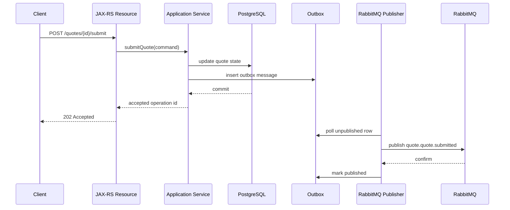

# Producer/Publisher Fundamentals

## 1. Core idea

Publisher adalah bagian aplikasi yang mengubah intent internal menjadi message RabbitMQ.

Dalam Java/JAX-RS service, publisher biasanya berada setelah boundary berikut:

```text
HTTP Request -> JAX-RS Resource -> Application Service -> Transaction Boundary -> Publisher -> RabbitMQ Exchange
```

Publisher yang benar bukan hanya kode yang memanggil `basicPublish`. Publisher production-grade harus memahami:

- connection lifecycle;
- channel lifecycle;
- channel thread safety;
- exchange dan routing key;
- message properties;
- persistence intent;
- mandatory flag;
- unroutable message;
- return listener;
- publisher confirm;
- failure handling;
- metrics;
- tracing;
- shutdown;
- transaction consistency dengan database.

Mental model:

```text
Publishing is not complete when Java code calls basicPublish.
Publishing is only meaningful when the application knows what promise it needs:
fire-and-forget, broker accepted, routed, persisted, replicated, or recoverable through outbox.
```

Part ini fokus pada fundamental publisher. Publisher reliability yang lebih dalam dibahas di Part 009.

---

## 2. Producer vs publisher

Istilah sering bercampur.

Dalam desain sistem:

- **producer** adalah service atau component yang menghasilkan intent/message;
- **publisher** adalah implementation yang mengirim message ke RabbitMQ;
- **message producer** bisa berupa API service, worker, scheduler, outbox poller, CDC bridge, atau integration adapter.

Contoh:

```text
Quote Service = producer
RabbitMqQuoteEventPublisher = publisher implementation
OutboxPublisherJob = producer + publisher process for outbox rows
```

Bedakan ini saat review:

```text
Producer owns business meaning.
Publisher owns broker interaction.
```

Jika business logic bercampur dengan AMQP low-level API di banyak tempat, sistem menjadi sulit direview, sulit dites, dan sulit diganti.

---

## 3. Basic publishing lifecycle

Lifecycle publish sederhana:


Lifecycle production-grade lebih lengkap:

```text
1. Validate business intent.
2. Complete or persist transactional state.
3. Build message payload.
4. Add message metadata.
5. Select exchange and routing key.
6. Set message properties.
7. Publish through channel.
8. Detect immediate client-side failure.
9. Detect unroutable message if mandatory=true.
10. Wait for publisher confirm if required.
11. Record metrics/traces/logs.
12. Retry or persist failure if required.
```

Jangan menganggap step 7 sebagai akhir lifecycle.

---

## 4. Java client building blocks

RabbitMQ Java client menggunakan konsep utama:

```text
ConnectionFactory -> Connection -> Channel -> basicPublish
```

### ConnectionFactory

Membuat connection berdasarkan host, port, credentials, vhost, TLS, heartbeat, recovery, timeout, dan client properties.

### Connection

TCP connection ke broker. Biasanya mahal dibanding channel dan sebaiknya reused.

### Channel

AMQP virtual connection di atas TCP connection. Channel dipakai untuk publish, consume, declare topology, ack/nack, confirm, dan transaksi AMQP.

### BasicProperties

Metadata message seperti content type, delivery mode, message ID, correlation ID, timestamp, expiration, priority, reply-to, headers.

### ReturnListener / ConfirmListener

Callback untuk unroutable message dan publisher confirmation.

---

## 5. Connection lifecycle

Connection adalah resource mahal.

Anti-pattern:

```java
public void publish(Event event) throws Exception {
    Connection connection = factory.newConnection();
    Channel channel = connection.createChannel();
    channel.basicPublish(exchange, routingKey, props, body);
    channel.close();
    connection.close();
}
```

Masalah:

- TCP connection dibuat per publish;
- TLS handshake mahal jika TLS aktif;
- broker connection count naik;
- latency buruk;
- failure handling sulit;
- connection storm saat traffic naik.

Pattern lebih sehat:

```java
public final class RabbitMqPublisher implements AutoCloseable {
    private final Connection connection;

    public RabbitMqPublisher(ConnectionFactory factory) throws Exception {
        this.connection = factory.newConnection("quote-service-publisher");
    }

    @Override
    public void close() throws Exception {
        connection.close();
    }
}
```

Connection biasanya dibuat saat application startup dan ditutup saat graceful shutdown. Untuk service besar, sering dipisahkan connection untuk publisher dan consumer agar blocking/failure di satu concern tidak mengganggu concern lain.

---

## 6. Channel lifecycle

Channel lebih ringan daripada connection, tetapi tetap bukan object bebas risiko.

Prinsip:

```text
Reuse connection.
Use channel carefully.
Do not casually share one channel across concurrent publisher threads.
```

Channel dapat ditutup oleh broker jika terjadi protocol error, misalnya:

- publish ke exchange yang tidak ada;
- declare queue dengan argument berbeda dari existing queue;
- ack delivery tag yang tidak valid;
- permission failure;
- precondition failed.

Publisher abstraction harus siap menangani channel closure.

Pattern sederhana untuk single-thread publisher:

```java
public final class SingleThreadRabbitPublisher implements AutoCloseable {
    private final Channel channel;

    public SingleThreadRabbitPublisher(Connection connection) throws Exception {
        this.channel = connection.createChannel();
    }

    public void publish(byte[] body, AMQP.BasicProperties props) throws IOException {
        channel.basicPublish("quote.events", "quote.quote.approved", props, body);
    }

    @Override
    public void close() throws Exception {
        channel.close();
    }
}
```

Untuk multi-thread publisher, gunakan channel per thread, channel pool yang benar, atau dedicated publisher worker.

---

## 7. Channel thread safety

Channel sharing antar thread adalah salah satu sumber bug paling umum.

Problem:

```java
// Dangerous if called concurrently by many request threads
sharedChannel.basicPublish(exchange, routingKey, props, body);
```

Risiko:

- frame interleaving;
- publisher confirm confusion;
- unexpected channel errors;
- throughput collapse karena synchronization;
- sulit men-debug duplicate/lost publish suspicion.

Pattern lebih aman:

### Option A: channel per publishing thread

```java
private final ThreadLocal<Channel> channels = ThreadLocal.withInitial(() -> {
    try {
        return connection.createChannel();
    } catch (IOException e) {
        throw new IllegalStateException(e);
    }
});

public void publish(MessageEnvelope envelope) throws IOException {
    Channel channel = channels.get();
    channel.basicPublish(
        envelope.exchange(),
        envelope.routingKey(),
        envelope.mandatory(),
        envelope.properties(),
        envelope.body()
    );
}
```

### Option B: dedicated publisher executor

```text
Request thread -> enqueue publish command -> single publisher worker -> RabbitMQ channel
```

Kelebihan:

- channel use serialized;
- confirm tracking lebih sederhana;
- backpressure bisa dikontrol;
- publish latency bisa dimonitor.

Kekurangan:

- perlu internal queue;
- perlu shutdown drain;
- perlu overflow strategy.

### Option C: channel pool

Gunakan hanya jika pool implementation benar:

- borrow channel;
- publish;
- handle channel exception;
- return only healthy channel;
- do not return closed channel;
- integrate confirm tracking per channel.

---

## 8. Publisher abstraction

Jangan sebar `basicPublish` di seluruh codebase.

Bad shape:

```text
JAX-RS Resource A -> basicPublish
Service B -> basicPublish
Scheduler C -> basicPublish
Outbox Job D -> basicPublish
```

Better shape:

```text
Application Service -> DomainEventPublisher -> RabbitMqPublisher
Outbox Poller -> RabbitMqPublisher
Task Scheduler -> TaskPublisher -> RabbitMqPublisher
```

Abstraction minimal:

```java
public interface MessagePublisher {
    void publish(MessageEnvelope envelope) throws PublishException;
}
```

Envelope:

```java
public record MessageEnvelope(
    String exchange,
    String routingKey,
    String messageType,
    String messageId,
    String correlationId,
    String causationId,
    String tenantId,
    byte[] body,
    AMQP.BasicProperties properties,
    boolean mandatory
) {}
```

Tujuannya bukan membuat abstraction rumit. Tujuannya agar:

- metadata konsisten;
- logging konsisten;
- metrics konsisten;
- error handling konsisten;
- exchange/routing key tidak random;
- publisher confirm/return handling bisa distandarkan;
- testing lebih mudah.

---

## 9. Message body

RabbitMQ tidak peduli isi payload. Broker melihat body sebagai byte array.

Aplikasi harus menentukan:

- serialization format;
- schema/versioning;
- content type;
- encoding;
- compression jika perlu;
- encryption jika perlu;
- payload size limit;
- privacy boundary.

Contoh JSON payload:

```json
{
  "eventId": "evt-123",
  "quoteId": "Q-10001",
  "status": "APPROVED",
  "approvedAt": "2026-07-11T10:15:30Z"
}
```

Publisher harus menghindari:

- payload terlalu besar;
- payload berisi object internal tanpa contract;
- payload bergantung pada Java class serialization;
- payload tanpa version;
- payload mengandung PII yang tidak diperlukan consumer;
- payload tanpa idempotency key atau business key.

Rule praktis:

```text
Message payload is an integration contract, not a Java object dump.
```

---

## 10. Message properties

AMQP BasicProperties membantu broker, consumer, dan tooling memahami message.

Properties yang sering penting:

| Property | Purpose |
|---|---|
| `contentType` | Contoh: `application/json` |
| `contentEncoding` | Contoh: `utf-8` |
| `deliveryMode` | Persistent vs transient intent |
| `priority` | Priority queue jika digunakan |
| `correlationId` | Trace business request/workflow |
| `replyTo` | Request-reply/RPC |
| `expiration` | Per-message TTL |
| `messageId` | Dedup/debug identity |
| `timestamp` | Publish/create time awareness |
| `type` | Message type |
| `headers` | Custom metadata |

Contoh:

```java
Map<String, Object> headers = new HashMap<>();
headers.put("traceparent", traceparent);
headers.put("tenant-id", tenantId);
headers.put("message-version", "1");
headers.put("source-service", "quote-service");

AMQP.BasicProperties props = new AMQP.BasicProperties.Builder()
    .contentType("application/json")
    .contentEncoding("utf-8")
    .deliveryMode(2)
    .messageId(messageId)
    .correlationId(correlationId)
    .type("QuoteApproved")
    .timestamp(new Date())
    .headers(headers)
    .build();
```

Do not rely on payload only. Headers/properties make production debugging faster.

---

## 11. Content type

`contentType` menjelaskan format body.

Common examples:

```text
application/json
application/cloudevents+json
application/avro
application/protobuf
text/plain
```

Jika content type kosong, consumer harus menebak. Itu buruk untuk integration.

Review questions:

- Apakah semua publisher mengisi content type?
- Apakah consumer validate content type?
- Apakah schema registry/spec sesuai content type?
- Apakah encoding jelas?
- Apakah compression/encryption ditandai?

---

## 12. Delivery mode

AMQP delivery mode umum:

```text
1 = non-persistent
2 = persistent
```

Persistent message berarti message ditandai untuk disimpan secara durable oleh broker jika queue durable dan broker/queue type mendukung persistence semantics yang sesuai.

Tetapi persistence bukan magic guarantee. Reliability juga dipengaruhi oleh:

- exchange durability;
- queue durability;
- message delivery mode;
- publisher confirm;
- queue type;
- replication;
- broker fsync behavior;
- crash timing;
- outbox/retry strategy.

Review rule:

```text
If the message represents business-critical state transition, non-persistent publishing is usually suspicious.
```

Tetapi persistent message memiliki cost:

- disk IO;
- latency;
- throughput reduction;
- storage pressure;
- confirm latency.

Jangan pakai persistent untuk semua message tanpa capacity planning. Jangan pakai transient untuk critical command/event tanpa conscious decision.

---

## 13. Correlation ID

Correlation ID menghubungkan message dengan request atau workflow.

Dalam JAX-RS flow:

```text
HTTP X-Correlation-ID -> MDC/log -> message correlationId -> consumer log -> downstream call
```

Jika request tidak membawa correlation ID, service bisa generate satu.

Contoh:

```java
String correlationId = requestHeader("X-Correlation-ID")
    .orElse(UUID.randomUUID().toString());
```

Correlation ID bukan idempotency key. Bedakan:

```text
Correlation ID = trace/debug relationship.
Idempotency key = duplicate suppression/business operation identity.
Message ID = identity of this specific message envelope.
Causation ID = message/request that caused this message.
```

Review questions:

- Apakah correlation ID selalu ada?
- Apakah correlation ID diteruskan dari HTTP ke message?
- Apakah consumer mempertahankan correlation ID untuk downstream calls?
- Apakah logs bisa dicari berdasarkan correlation ID?

---

## 14. Message ID

Message ID mengidentifikasi envelope message.

Use cases:

- deduplication;
- inbox table;
- debugging;
- tracing;
- replay audit;
- DLQ analysis.

Tetapi message ID harus punya semantics jelas.

Options:

```text
One unique ID per publish attempt.
One stable event ID per domain event.
One business operation ID per command.
```

Untuk idempotent consumer, sering lebih baik memakai stable event/command ID daripada random publish attempt ID.

Review questions:

- Apakah message ID stable saat retry publish?
- Apakah duplicate publish menghasilkan message ID sama atau berbeda?
- Apakah consumer memakai message ID untuk dedup?
- Apakah replay mempertahankan original message ID atau membuat baru?

Tidak ada satu jawaban universal. Yang penting adalah contract-nya eksplisit.

---

## 15. Reply-to

`replyTo` digunakan untuk request-reply/RPC pattern.

Contoh:

```java
AMQP.BasicProperties props = new AMQP.BasicProperties.Builder()
    .replyTo("amq.rabbitmq.reply-to")
    .correlationId(correlationId)
    .build();
```

Risiko:

- requester timeout;
- reply datang terlambat;
- duplicate reply;
- reply queue hilang;
- correlation ID tidak match;
- request-reply membuat HTTP thread menunggu async system;
- backpressure broker memengaruhi API latency.

Gunakan reply-to hanya jika pattern-nya memang request-reply dan timeout semantics jelas. Untuk long-running process, lebih baik gunakan `202 Accepted` plus status endpoint/event callback.

---

## 16. Expiration

`expiration` pada BasicProperties mengatur per-message TTL.

Contoh:

```java
AMQP.BasicProperties props = new AMQP.BasicProperties.Builder()
    .expiration("60000") // milliseconds as string
    .build();
```

Use cases:

- request yang sudah tidak relevan setelah timeout;
- temporary command;
- retry topology tertentu;
- SLA-limited task.

Risiko:

- message expired sebelum consumer sempat proses;
- expired message masuk DLX dan membingungkan operator;
- TTL merusak expectation ordering;
- TTL berbeda antar producer;
- business-critical message hilang karena TTL terlalu pendek.

Review questions:

- Kenapa message boleh expire?
- Apa yang terjadi setelah expire?
- Apakah masuk DLQ/DLX?
- Apakah consumer tahu message bisa expire?
- Apakah TTL sejalan dengan API/business SLA?

---

## 17. Priority

Priority hanya bermakna jika queue mendukung priority.

Contoh:

```java
AMQP.BasicProperties props = new AMQP.BasicProperties.Builder()
    .priority(5)
    .build();
```

Risk:

- low priority starvation;
- priority level terlalu banyak;
- throughput turun;
- operational debugging lebih sulit;
- producer menyalahgunakan high priority untuk semua message.

Rule:

```text
Priority is a capacity and fairness decision, not a shortcut for urgency.
```

Jika semua message high priority, tidak ada priority.

---

## 18. Headers

Headers membawa metadata custom.

Common headers:

```text
traceparent
tenant-id
actor-id
source-service
message-version
schema-version
idempotency-key
causation-id
retry-count
created-at
```

Headers vs payload:

| Put in headers | Put in payload |
|---|---|
| Routing/trace/technical metadata | Business data |
| Correlation and causation | Domain fields |
| Tenant or source metadata if needed by infrastructure | State transition detail |
| Version/type metadata | Command/event facts |

Security concern:

- headers often appear in logs/tools;
- do not put PII in headers unless explicitly approved;
- do not put secrets in headers;
- tenant ID handling must follow internal policy.

---

## 19. Exchange and routing key selection

Publisher must choose:

```java
channel.basicPublish(exchange, routingKey, props, body);
```

This is architecture, not incidental string selection.

Bad:

```java
channel.basicPublish("", "queue-name", props, body);
```

This publishes to the default exchange and routes by queue name. It can be valid for simple cases, but in enterprise systems it often creates producer-to-queue coupling.

Better for event:

```java
channel.basicPublish("quote.events", "quote.quote.approved", true, props, body);
```

Better for command:

```java
channel.basicPublish("quote.commands", "quote.quote.reprice", true, props, body);
```

Review questions:

- Is exchange name a constant from governed config?
- Is routing key derived from message type intentionally?
- Is default exchange usage deliberate?
- Does producer know queue names? If yes, why?
- Is routing key covered by topology tests?

---

## 20. Mandatory flag

`mandatory=true` tells broker to return message to publisher if it cannot route to any queue.

Example:

```java
channel.basicPublish(
    "quote.events",
    "quote.quote.approved",
    true,
    props,
    body
);
```

If no binding matches and no alternate path handles it, publisher can receive a basic.return callback.

Without mandatory flag, unroutable message may be dropped by routing layer unless alternate exchange is configured.

Mandatory flag does not mean consumer processed the message. It only helps detect routing failure.

Review questions:

- Is `mandatory=true` used for critical publishes?
- Is return listener registered?
- Does return listener fail the operation, log, metric, or store for repair?
- Is alternate exchange used instead or additionally?
- Is mandatory behavior tested?

---

## 21. Return listener

Return listener handles unroutable mandatory messages.

Example shape:

```java
channel.addReturnListener(returned -> {
    String exchange = returned.getExchange();
    String routingKey = returned.getRoutingKey();
    int replyCode = returned.getReplyCode();
    String replyText = returned.getReplyText();

    log.error("RabbitMQ message returned: exchange={}, routingKey={}, code={}, text={}",
        exchange, routingKey, replyCode, replyText);

    metrics.counter("rabbitmq.publisher.returned", "exchange", exchange, "routingKey", routingKey).increment();
});
```

Return listener harus dianggap high-signal. Jika message critical dan returned, itu bukan warning biasa.

Common mistake:

```text
mandatory=true but no return listener
```

Itu seperti memasang alarm tanpa mendengarkannya.

---

## 22. Immediate flag legacy awareness

AMQP pernah memiliki `immediate` flag, tetapi di RabbitMQ modern ini tidak digunakan sebagai pattern normal.

Jangan mendesain reliability berdasarkan asumsi:

```text
Publish only if a consumer is immediately available.
```

RabbitMQ queue semantics memang memisahkan publish dari immediate consumer availability. Jika perlu memastikan ada consumer, gunakan monitoring, consumer count alert, health checks, atau application-level protocol, bukan immediate flag.

Review questions:

- Apakah ada code legacy yang menyebut immediate flag?
- Apakah developer mengira publish gagal jika consumer down?
- Apakah queue durability dan backlog behavior dipahami?

---

## 23. Publisher confirm awareness

Publisher confirm adalah mekanisme broker mengirim acknowledgement ke publisher bahwa message telah diterima oleh broker pada tingkat safety tertentu sesuai topology/queue type.

Basic shape:

```java
channel.confirmSelect();
channel.basicPublish(exchange, routingKey, true, props, body);
boolean confirmed = channel.waitForConfirms(5_000);
```

Ini contoh blocking sederhana, bukan desain final high-throughput.

Confirm menjawab pertanyaan:

```text
Did the broker accept responsibility for this publish?
```

Confirm tidak menjawab:

```text
Did consumer process it?
Did business side effect happen?
Is message not duplicated?
Is DB transaction consistent?
```

Part 009 akan membahas confirm strategy lebih dalam.

---

## 24. Confirm listener

Untuk high-throughput publisher, confirm biasanya asynchronous.

Conceptual shape:

```java
channel.confirmSelect();
ConcurrentNavigableMap<Long, MessageEnvelope> outstanding = new ConcurrentSkipListMap<>();

channel.addConfirmListener(
    (sequenceNumber, multiple) -> {
        if (multiple) {
            outstanding.headMap(sequenceNumber, true).clear();
        } else {
            outstanding.remove(sequenceNumber);
        }
    },
    (sequenceNumber, multiple) -> {
        // nack from broker: mark failed, retry, or persist failure
    }
);

long seqNo = channel.getNextPublishSeqNo();
outstanding.put(seqNo, envelope);
channel.basicPublish(envelope.exchange(), envelope.routingKey(), true, envelope.properties(), envelope.body());
```

Risiko:

- confirm tracking per channel salah;
- channel shared antar thread;
- outstanding map leak;
- confirm timeout tidak ditangani;
- nack dianggap impossible;
- retry menghasilkan duplicate tanpa idempotency.

---

## 25. Publishing failure types

Publisher failure tidak tunggal.

| Failure | Example | Meaning |
|---|---|---|
| Serialization failure | JSON serialization error | Message never sent |
| Validation failure | Missing required field | Message should not be sent |
| Connection failure | Broker unreachable | Publish did not complete |
| Channel failure | Exchange missing / precondition failed | Channel may be closed |
| Permission failure | Write denied | Security/config issue |
| Unroutable | No binding match | Topology/routing issue |
| Confirm timeout | No broker confirm in time | Unknown outcome |
| Broker nack | Broker rejected publish | Failed publish |
| Application crash | Crash after publish before recording success | Ambiguous outcome |

Ambiguous outcome is the hard case. If publisher does not know whether broker accepted message, retry can duplicate. Without retry, message can be lost. This is why outbox/idempotency matter.

---

## 26. Publisher and transaction boundary

Most dangerous publishing question:

```text
What happens if the database commit and RabbitMQ publish do not succeed atomically?
```

Bad flow A:

```text
Publish message -> DB commit
```

Failure:

- message visible to consumer;
- DB commit fails;
- consumer acts on nonexistent/uncommitted state.

Bad flow B:

```text
DB commit -> Publish message
```

Failure:

- DB state committed;
- process crashes before publish;
- event/command missing.

Better pattern for business-critical state changes:

```text
DB transaction: write business row + outbox row
Outbox publisher: publish outbox row with confirm
Mark outbox row published
```

Direct publish can still be acceptable for non-critical telemetry or best-effort notification, but the reliability expectation must be explicit.

---

## 27. JAX-RS request publishing pattern

For async command:



Direct publish inside request thread may be acceptable if:

- operation is non-critical;
- lost message is tolerable;
- duplicate publish is tolerable;
- publish latency is acceptable;
- broker outage should fail the HTTP request;
- architecture decision is explicit.

If those are not true, use outbox.

---

## 28. Publisher metrics

Minimum publisher metrics:

- publish attempts;
- publish success;
- publish failure;
- publish latency;
- publisher confirms latency;
- confirms ack count;
- confirms nack count;
- confirm timeout count;
- returned/unroutable count;
- connection failures;
- channel closures;
- serialization failures;
- message size distribution;
- outbox lag if outbox publisher;
- outstanding confirm count.

Useful dimensions:

- service;
- exchange;
- routing key;
- message type;
- vhost;
- queue type if known;
- environment;
- failure reason.

Be careful with high-cardinality labels. Do not put message ID, quote ID, order ID, tenant ID, or customer ID as metric label unless platform explicitly supports it.

---

## 29. Publisher logs

Good publish log is structured and searchable.

Example:

```json
{
  "event": "rabbitmq.publish.attempt",
  "exchange": "quote.events",
  "routingKey": "quote.quote.approved",
  "messageType": "QuoteApproved",
  "messageId": "evt-123",
  "correlationId": "corr-456",
  "causationId": "cmd-789",
  "tenantId": "tenant-a",
  "contentType": "application/json"
}
```

For success:

```json
{
  "event": "rabbitmq.publish.confirmed",
  "exchange": "quote.events",
  "routingKey": "quote.quote.approved",
  "messageType": "QuoteApproved",
  "messageId": "evt-123",
  "correlationId": "corr-456",
  "confirmLatencyMs": 12
}
```

For returned:

```json
{
  "event": "rabbitmq.publish.returned",
  "exchange": "quote.events",
  "routingKey": "quote.quote.approved",
  "messageType": "QuoteApproved",
  "messageId": "evt-123",
  "replyCode": 312,
  "replyText": "NO_ROUTE"
}
```

Do not log full payload by default, especially if it may contain PII or sensitive commercial/customer data.

---

## 30. Publisher tracing

Trace propagation should connect:

```text
HTTP request span -> application service span -> publish span -> consumer processing span
```

Headers commonly used:

```text
traceparent
tracestate
correlation-id
causation-id
source-service
```

Publisher span should include:

- exchange;
- routing key;
- message type;
- message ID;
- broker endpoint maybe sanitized;
- confirm latency if available;
- returned/unroutable status.

Do not attach payload as span attribute.

---

## 31. Publisher configuration

Configuration usually includes:

```yaml
rabbitmq:
  host: rabbitmq.internal
  port: 5671
  virtualHost: cpq-prod
  username: quote-service
  tls: true
  requestedHeartbeatSeconds: 30
  connectionTimeoutMillis: 10000
  publisher:
    exchange: quote.events
    mandatory: true
    confirms: true
    confirmTimeoutMillis: 5000
```

Configuration concerns:

- credentials from secret manager, not plain config;
- TLS enabled where required;
- vhost correct per environment;
- exchange/routing config not silently defaulting to dev;
- timeout explicit;
- confirm behavior explicit;
- client-provided connection name for observability.

---

## 32. Client-provided connection name

Set a connection name to make RabbitMQ Management UI useful.

Example:

```java
Connection connection = factory.newConnection("quote-service-publisher-prod");
```

Without useful connection names, Management UI may show anonymous connections that are hard to map to pods/services.

Good naming includes:

- service name;
- role: publisher or consumer;
- environment if not already separated;
- pod/instance ID if available.

Avoid putting secrets or PII in connection names.

---

## 33. Graceful shutdown

Publisher shutdown must decide what happens to in-flight publish attempts.

Cases:

- direct request-thread publish;
- async publisher executor;
- outbox poller;
- confirm-tracking publisher;
- application receives Kubernetes SIGTERM.

Shutdown checklist:

- stop accepting new publish jobs;
- drain internal queue if any;
- wait for outstanding confirms within timeout;
- mark uncertain publishes for retry if using outbox;
- close channels;
- close connection;
- emit shutdown metrics/logs.

Do not abruptly close connection while many critical confirms are outstanding unless outbox/retry can recover.

---

## 34. Testing publisher code

Test categories:

### Unit test

- message envelope creation;
- routing key selection;
- properties/header mapping;
- serialization failure;
- config validation.

### Integration test with RabbitMQ

- exchange exists;
- binding receives message;
- mandatory return fires for bad routing;
- publisher confirm works;
- message properties preserved;
- persistent delivery mode set;
- correlation ID propagated.

### Failure test

- broker unavailable;
- exchange missing;
- permission denied;
- confirm timeout;
- channel closed;
- return listener invoked;
- outbox row retried.

Testcontainers RabbitMQ is useful for integration tests, but do not assume it perfectly represents production cluster/quorum/network behavior.

---

## 35. Common publisher anti-patterns

### Anti-pattern 1: direct basicPublish everywhere

Symptoms:

- inconsistent headers;
- no metrics;
- no confirm strategy;
- hardcoded exchange/routing keys;
- error handling differs per caller.

Fix:

- central publisher abstraction.

### Anti-pattern 2: shared channel across request threads

Symptoms:

- intermittent publish failures;
- confirm mismatch;
- channel errors under load.

Fix:

- channel per thread, channel pool, or dedicated publisher worker.

### Anti-pattern 3: ignoring unroutable messages

Symptoms:

- publish seems successful;
- consumer never receives;
- no error until business impact.

Fix:

- mandatory flag + return listener or alternate exchange.

### Anti-pattern 4: publish inside DB transaction without outbox reasoning

Symptoms:

- inconsistent DB/message state;
- lost event after crash;
- consumer sees nonexistent state.

Fix:

- outbox or explicit best-effort decision.

### Anti-pattern 5: no message metadata

Symptoms:

- cannot trace message;
- duplicate diagnosis hard;
- DLQ investigation slow.

Fix:

- message ID, correlation ID, causation ID, type, version, source service, timestamps.

---

## 36. Production debugging path for publisher issues

When publish issue is suspected:

```text
1. Did application attempt publish?
2. Did serialization succeed?
3. Which exchange/routing key was used?
4. Which vhost and broker endpoint?
5. Was channel open?
6. Was connection blocked?
7. Did basicPublish throw?
8. Was mandatory=true?
9. Was message returned?
10. Was publisher confirm received?
11. Did broker route message to expected queue?
12. Did queue depth increase?
13. Did consumer receive delivery?
14. Did DB/outbox mark published?
```

Never jump directly to “RabbitMQ lost the message”. Most lost-message suspicions are actually:

- publish never happened;
- wrong exchange;
- wrong routing key;
- missing binding;
- unroutable ignored;
- publish outcome ambiguous;
- consumer consumed and failed silently;
- idempotency suppressed duplicate;
- looking at wrong vhost/environment.

---

## 37. Internal verification checklist

Untuk konteks CSG/team, verifikasi hal berikut tanpa mengasumsikan detail internal:

- RabbitMQ Java client/library yang digunakan.
- Apakah ada internal wrapper/abstraction untuk publisher.
- ConnectionFactory configuration: host, port, vhost, TLS, heartbeat, timeout, recovery.
- Apakah connection name diset agar terlihat di Management UI.
- Connection lifecycle: per app, per request, per worker, atau pool.
- Channel lifecycle: per thread, shared, pooled, dedicated publisher worker.
- Apakah channel dipakai lintas thread.
- Exchange dan routing key source: config, enum, constants, generated contract, atau hardcoded.
- Apakah default exchange digunakan dan kenapa.
- Apakah mandatory flag digunakan untuk critical publish.
- Apakah return listener diimplementasikan dan dimonitor.
- Apakah publisher confirm digunakan.
- Apakah confirm timeout ditangani.
- Apakah publish failure masuk retry/outbox/error log.
- Apakah direct publish atau outbox pattern digunakan.
- Apakah message properties konsisten: content type, delivery mode, message ID, correlation ID, type, timestamp.
- Apakah headers standar: traceparent, tenant ID, causation ID, source service, schema/message version.
- Apakah payload serialization distandarkan.
- Apakah PII dicegah di headers/logs.
- Apakah publisher metrics tersedia.
- Apakah integration tests mencakup returned message, confirm, routing, dan properties.
- Apakah ada incident terkait message not published, unroutable, confirm timeout, connection blocked, atau channel closed.

---

## 38. Senior engineer mental model

Publisher adalah boundary antara application state dan broker state. Kesalahan di boundary ini sering berubah menjadi:

- lost event;
- duplicate command;
- inconsistent order state;
- invisible failure;
- unreplayable message;
- production-only routing bug;
- incident yang sulit dibuktikan.

Pertanyaan senior engineer:

```text
What does this publisher know after publish returns?
```

Possible answers:

```text
Nothing; it only wrote bytes to a socket.
It knows basicPublish did not throw.
It knows message was not returned as unroutable.
It knows broker confirmed it.
It knows outbox can retry until confirmed.
It knows consumer processed it.
```

Jawaban terakhir hampir tidak pernah benar hanya dari publisher. Consumer processing adalah lifecycle berbeda.

Publisher design yang baik tidak menjanjikan lebih dari yang bisa dibuktikan.

---

## 39. Reference map

Gunakan dokumentasi resmi berikut untuk verifikasi detail teknis sesuai versi RabbitMQ dan Java client yang digunakan team:

- RabbitMQ Java Client API Guide: `https://www.rabbitmq.com/client-libraries/java-api-guide`
- RabbitMQ Publishers documentation: `https://www.rabbitmq.com/docs/publishers`
- RabbitMQ Consumer Acknowledgements and Publisher Confirms: `https://www.rabbitmq.com/docs/confirms`
- RabbitMQ AMQP 0-9-1 Model Explained: `https://www.rabbitmq.com/tutorials/amqp-concepts`
- RabbitMQ Exchanges documentation: `https://www.rabbitmq.com/docs/exchanges`
- RabbitMQ Alternate Exchanges documentation: `https://www.rabbitmq.com/docs/ae`
- RabbitMQ Queues documentation: `https://www.rabbitmq.com/docs/queues`
