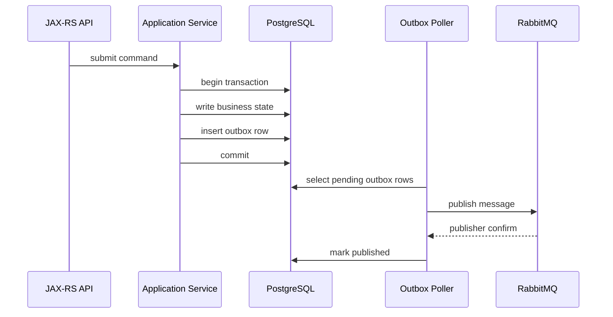
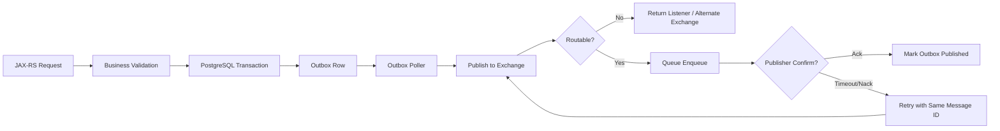

# Publisher Reliability

## 1. Core idea

Publisher reliability adalah kemampuan producer untuk menjawab pertanyaan ini secara jujur:

```text
Setelah service kita mengirim message, janji apa yang benar-benar sudah terpenuhi?
```

Jawabannya tidak boleh otomatis dianggap:

```text
basicPublish returned without exception -> message pasti aman.
```

Itu asumsi berbahaya.

Dalam RabbitMQ, publish call yang berhasil di sisi Java hanya berarti client berhasil menulis frame AMQP ke channel sejauh client tahu. Itu belum otomatis berarti:

- exchange ada;
- message berhasil diroute ke queue;
- queue durable;
- message persistent;
- broker sudah menulis message ke storage;
- quorum queue sudah mereplikasi message;
- consumer nanti akan memproses message;
- business state dan message sudah konsisten;
- retry publish tidak akan membuat duplicate.

Publisher reliability adalah kombinasi dari:

- topology correctness;
- mandatory flag atau alternate exchange;
- publisher confirm;
- durable exchange;
- durable queue;
- persistent message;
- reconnect/recovery discipline;
- retry policy;
- deduplication/idempotency downstream;
- transactional outbox untuk integrasi dengan database.

Mental model:

```text
Publisher reliability is not one feature.
It is a chain of guarantees.
The chain is only as strong as its weakest unchecked boundary.
```

---

## 2. Reliability boundary in Java/JAX-RS systems

Dalam aplikasi Java/JAX-RS, publish biasanya terjadi setelah request masuk:

```text
HTTP request
  -> JAX-RS resource
  -> application service
  -> validation
  -> database transaction
  -> publisher
  -> RabbitMQ exchange
```

Pertanyaan reliability yang harus dijawab:

1. Apakah HTTP request boleh sukses sebelum message aman?
2. Apakah DB commit dan publish harus atomic secara bisnis?
3. Kalau publish gagal, apakah request di-rollback?
4. Kalau DB commit sukses tetapi publish gagal, bagaimana repair?
5. Kalau publish di-retry lalu duplicate terkirim, consumer aman atau tidak?
6. Kalau message unroutable, apakah publisher tahu?
7. Kalau broker menerima tetapi belum durable, apakah acceptable?
8. Kalau broker failover saat publish, siapa yang retry?
9. Kalau confirm tidak diterima, apakah message hilang atau hanya confirm yang hilang?
10. Kalau publisher crash setelah publish tetapi sebelum update status, apa konsekuensinya?

Dalam production system, reliability tidak cukup dengan "catch exception".

Butuh explicit contract:

```text
For this message flow, producer guarantees:
- DB state and message are coordinated via outbox.
- Message is published with persistent delivery mode.
- Exchange and queue are durable.
- Publisher confirm is required before marking outbox row as published.
- Duplicate publish is possible and consumers must be idempotent.
```

---

## 3. Failure windows in publishing

Publisher failure sering terjadi di antara boundary, bukan hanya saat method melempar exception.

### 3.1 Before publish

```text
Application builds message
  -> serialization fails
  -> no message sent
```

Dampak:

- business transaction mungkin sudah berjalan;
- message belum ada;
- retry request bisa membuat duplicate business action jika tidak idempotent.

Mitigation:

- validate payload sebelum commit jika publish inline;
- gunakan outbox agar payload disimpan sebagai bagian DB transaction;
- pastikan serialization deterministik dan contract-tested.

### 3.2 During publish write

```text
basicPublish called
  -> connection breaks
  -> client cannot know whether broker received full publish
```

Dampak:

- message mungkin tidak sampai;
- message mungkin sampai;
- retry bisa membuat duplicate.

Mitigation:

- publisher confirms;
- retry unconfirmed messages;
- consumer idempotency;
- outbox publish status.

### 3.3 After broker accepts, before confirm observed

```text
broker accepts message
  -> confirm sent
  -> network fails before publisher receives confirm
```

Dampak:

- publisher menganggap uncertain;
- retry bisa duplicate;
- consumer harus dedup/idempotent.

Mitigation:

- treat confirm timeout as unknown, not definite failure;
- retry through outbox;
- deduplicate by message ID/business key.

### 3.4 Message accepted but unroutable

```text
publisher sends to exchange
  -> exchange exists
  -> no binding matches routing key
```

Jika tidak ada mandatory flag atau alternate exchange, unroutable message bisa hilang dari perspektif business flow.

Mitigation:

- mandatory flag + return listener;
- alternate exchange;
- topology validation;
- alert on returned/unroutable messages.

### 3.5 DB commit succeeds, publish fails

```text
DB transaction commits order status = SUBMITTED
  -> publish OrderSubmitted fails
```

Dampak:

- state sudah berubah;
- downstream tidak tahu;
- data inconsistency.

Mitigation:

- transactional outbox;
- reconciliation job;
- explicit repair runbook.

### 3.6 Publish succeeds, DB transaction rolls back

```text
publish event inside transaction
  -> message sent
  -> DB transaction rolls back
```

Dampak:

- consumer melihat event untuk state yang tidak pernah committed;
- impossible event;
- downstream corruption.

Mitigation:

- jangan publish externally visible event sebelum DB commit;
- gunakan outbox row dalam transaksi;
- publish setelah commit dari outbox poller.

---

## 4. Publisher confirm

Publisher confirm adalah mekanisme broker memberi acknowledgement ke publisher bahwa message sudah diterima oleh broker pada level tertentu.

Konsep penting:

```text
Consumer ack != publisher confirm
```

- **consumer ack**: consumer memberi tahu broker bahwa delivery selesai diproses.
- **publisher confirm**: broker memberi tahu publisher bahwa publish sudah ditangani broker.

Confirm mode biasanya diaktifkan pada channel publisher.

Pseudo-flow:

```text
channel.confirmSelect()
channel.basicPublish(exchange, routingKey, properties, body)
wait for confirm / async confirm listener
```

Dengan confirm, publisher bisa membedakan:

```text
publish request sent
vs
broker confirmed publish
```

Namun confirm bukan bukti bahwa consumer memproses message.

```text
Publisher confirm stops at broker boundary.
It does not cross into consumer business processing.
```

### What confirm can tell you

Confirm dapat membantu menjawab:

- apakah broker menerima publish;
- apakah broker menolak publish;
- apakah publish masih uncertain karena confirm tidak diterima;
- sequence number mana yang confirmed;
- publish mana yang perlu retry setelah channel/connection failure.

### What confirm cannot tell you

Confirm tidak menjamin:

- consumer menerima message;
- consumer memproses sukses;
- DB downstream update sukses;
- message tidak akan diproses duplicate;
- business workflow selesai;
- exactly-once semantics.

---

## 5. Confirm and durability are different promises

Confirm dan durability sering disalahpahami.

Confirm menjawab:

```text
Did the broker accept responsibility for this publish?
```

Durability/persistence menjawab:

```text
Can the message/topology survive broker restart or failure according to configured durability model?
```

Agar message punya peluang bertahan dari restart, biasanya perlu kombinasi:

- durable exchange;
- durable queue;
- persistent message delivery mode;
- broker storage healthy;
- confirm diterima setelah broker memenuhi aturan safety queue tersebut;
- untuk quorum queue, replication semantics bergantung pada quorum queue behavior.

Jika hanya salah satu yang benar, guarantee bisa runtuh.

Contoh buruk:

```text
Durable queue + transient message
```

Queue-nya bertahan, message-nya bisa tidak.

Contoh buruk lain:

```text
Persistent message + non-durable queue
```

Message berniat persistent, tetapi queue bisa hilang saat restart.

Production rule:

```text
For business-critical messages, durability must be designed at exchange, queue, message, and storage/replication levels.
```

---

## 6. Mandatory flag and unroutable messages

Publisher confirm tidak otomatis berarti message berhasil masuk ke queue yang tepat.

Unroutable case:

```text
exchange exists
routing key = quote.submitted.eu
no binding matches
```

Jika publisher tidak mengaktifkan deteksi unroutable message, message bisa tidak sampai ke queue manapun.

### Mandatory flag

Dengan `mandatory = true`, jika message tidak bisa diroute ke queue manapun, broker mengembalikan message ke publisher menggunakan basic.return.

Mental model:

```text
mandatory flag asks RabbitMQ:
"If you cannot route this message to at least one queue, return it to me."
```

Tanpa mandatory flag:

```text
unroutable message can be silently dropped by the exchange routing step
```

### Return listener

Return listener harus mencatat informasi minimal:

- exchange;
- routing key;
- reply code;
- reply text;
- message ID;
- correlation ID;
- message type;
- producer service;
- environment;
- tenant jika relevan;
- payload reference atau outbox ID.

Return listener tidak boleh hanya log debug.

Production expectation:

```text
Returned message is a correctness signal, not a harmless warning.
```

### Confirm ordering with returned messages

Untuk mandatory unroutable message, broker dapat mengirim return sebelum confirm. Publisher harus menghubungkan return dan confirm secara benar.

Practical implication:

```text
A confirmed publish can still be a publish that was returned as unroutable.
```

Karena confirm berarti broker sudah menangani publish, bukan berarti message masuk ke business queue.

---

## 7. Alternate exchange

Alternate exchange adalah exchange fallback yang menerima message yang tidak bisa diroute oleh exchange utama.

Flow:

```text
Publisher
  -> primary exchange
      -> no binding match
      -> alternate exchange
          -> unroutable capture queue / parking queue / monitoring queue
```

Kapan berguna:

- topology migration;
- collecting unroutable messages;
- detecting bad routing keys;
- protecting against silent routing loss;
- audit for unexpected message types.

Namun alternate exchange bukan pengganti desain routing yang benar.

Risiko:

- alternate queue menjadi tempat sampah tanpa owner;
- monitoring tidak ada;
- message menumpuk tanpa replay process;
- sensitive payload terkumpul di queue fallback;
- publisher merasa sukses padahal message tidak mencapai consumer bisnis.

Production rule:

```text
If alternate exchange exists, it must have owner, retention policy, alert, replay/triage process, and privacy classification.
```

---

## 8. Publisher confirm strategies

Ada beberapa strategi confirm.

### 8.1 Synchronous confirm per message

```text
publish one message
wait for confirm
publish next message
```

Kelebihan:

- sederhana;
- failure handling mudah;
- cocok untuk low-throughput critical path.

Kekurangan:

- throughput rendah;
- latency tinggi;
- buruk untuk high-volume event/task publish.

Use case:

- admin operation;
- rare but critical command;
- control message.

### 8.2 Batch confirm

```text
publish N messages
wait for confirms up to N
```

Kelebihan:

- throughput lebih baik;
- masih relatif sederhana.

Kekurangan:

- failure attribution lebih sulit;
- saat batch gagal, semua message dalam uncertainty window harus diperlakukan carefully.

Use case:

- outbox poller batch;
- event publishing volume sedang.

### 8.3 Asynchronous confirm listener

```text
publish messages continuously
track publish sequence number -> message/outbox id
on ack/nack callback update state
```

Kelebihan:

- throughput tinggi;
- non-blocking;
- cocok untuk publisher service/poller.

Kekurangan:

- implementation complexity tinggi;
- harus track sequence number;
- channel failure membuat pending confirms uncertain;
- concurrent code harus disiplin.

Use case:

- high-throughput outbox publisher;
- event fanout;
- background publication.

---

## 9. Confirm timeout is not proof of failure

Confirm timeout berarti publisher tidak menerima confirm dalam waktu yang diharapkan.

Itu bukan bukti message gagal.

Kemungkinan:

- broker belum confirm karena disk lambat;
- broker under memory/disk pressure;
- network delay;
- connection bermasalah;
- confirm frame hilang;
- broker sudah menerima message tetapi publisher tidak tahu;
- channel closed;
- leader failover;
- queue replication lambat.

Correct handling:

```text
confirm timeout -> state = unknown
unknown -> retry may duplicate
duplicate -> consumer must be idempotent
```

Anti-pattern:

```text
confirm timeout -> assume not published -> publish new message with new message ID
```

Ini buruk karena duplicate detection jadi sulit.

Lebih baik:

```text
same business event id / same message id / same outbox id
```

Sehingga retry tetap bisa didedup.

---

## 10. Retry publish

Retry publish diperlukan ketika publish gagal atau uncertain.

Namun retry publish membawa risiko duplicate.

### Safe retry mindset

```text
A retrying publisher must assume duplicates are possible.
```

Retry publish harus punya:

- stable message ID;
- stable business idempotency key;
- bounded retry;
- backoff;
- dead/outbox failed state;
- operator visibility;
- consumer idempotency;
- no blind infinite loop.

### Retryable vs non-retryable publish failure

Retryable:

- temporary connection failure;
- broker unavailable;
- confirm timeout;
- transient network issue;
- flow control temporary block;
- leader failover.

Usually non-retryable until fixed:

- exchange not found;
- permission denied;
- invalid vhost;
- serialization contract invalid;
- unroutable due to missing binding;
- message too large beyond accepted policy;
- authentication failure.

Production rule:

```text
Retry infrastructure failures.
Do not blindly retry topology, permission, or contract failures.
```

---

## 11. Duplicate publish

Duplicate publish can happen when:

- publisher retries after confirm timeout;
- publisher crashes after broker accepted message but before marking published;
- outbox poller picks same row due to lock bug;
- multiple publisher instances process same outbox row;
- network failure hides confirm;
- manual replay republishes message;
- batch publish partially succeeds.

Duplicate is not exceptional. It is a normal consequence of at-least-once publishing.

Design implication:

```text
Publisher reliability and consumer idempotency are inseparable.
```

Message should include:

- message ID;
- event ID/command ID;
- aggregate ID;
- version if relevant;
- correlation ID;
- outbox ID if used;
- created time;
- producer service.

Consumer should dedup using:

- inbox table;
- processed message table;
- business unique constraint;
- aggregate state version;
- idempotent state transition.

---

## 12. Connection failure and channel failure

RabbitMQ Java publisher must distinguish:

- connection failure;
- channel failure;
- publish exception;
- confirm nack;
- returned message;
- confirm timeout;
- blocked connection.

### Connection failure

Connection failure affects all channels on that connection.

Possible causes:

- broker node down;
- network failure;
- TLS issue;
- heartbeat timeout;
- load balancer idle timeout;
- credential rotation;
- firewall/security group change;
- Kubernetes DNS/service issue.

Handling:

- reconnect using client recovery or application-managed lifecycle;
- mark pending publishes unknown;
- retry via outbox;
- alert if repeated.

### Channel failure

Channel failure can happen because of protocol-level issues:

- publishing to non-existent exchange;
- permission failure;
- precondition failure due to topology mismatch;
- invalid operation;
- frame interleaving due to unsafe channel sharing.

Handling:

- do not treat as transient blindly;
- inspect shutdown reason;
- fix topology/config/code;
- recreate channel if appropriate;
- avoid channel sharing across publisher threads.

---

## 13. Broker failover

Broker failover creates uncertainty.

Cases:

```text
publisher sends message to node A
queue leader on node A fails
client reconnects to node B
publisher did not receive confirm
```

The publisher does not automatically know whether the message was:

- not received;
- received but not persisted;
- persisted but confirm lost;
- replicated but confirm lost;
- routed to some queues but not others in complex topology.

Design response:

- use confirms;
- use durable topology and persistent messages;
- use quorum queues where HA requires replication;
- use retry with same message identity;
- use outbox status `PENDING/IN_FLIGHT/CONFIRMED/FAILED`;
- require consumer idempotency.

---

## 14. Transactional channel vs publisher confirm

AMQP supports transactions, but they are usually not the right answer for high-throughput RabbitMQ publisher reliability.

Transactional channel concept:

```text
txSelect
basicPublish
txCommit / txRollback
```

Problems:

- performance overhead;
- does not solve distributed transaction with PostgreSQL;
- does not make consumer processing exactly-once;
- not a replacement for outbox.

Publisher confirms are generally preferred for publisher-broker reliability.

Important distinction:

```text
RabbitMQ transaction coordinates publish on AMQP channel.
It does not atomically commit PostgreSQL business rows and RabbitMQ message together.
```

For Java/JAX-RS + PostgreSQL/MyBatis systems, the stronger pattern is usually:

```text
DB transaction:
  insert business row
  insert outbox row
commit

outbox publisher:
  publish with confirm
  mark outbox row published
```

---

## 15. Outbox-based publishing

Outbox is the production-grade answer to this problem:

```text
How do we atomically persist business state and the intent to publish a message?
```

Flow:



Outbox improves:

- DB/message consistency;
- retry after publisher crash;
- publish observability;
- manual repair;
- duplicate control;
- auditability.

Outbox does not eliminate duplicates.

It changes failure from:

```text
lost event with no trace
```

to:

```text
pending/failed outbox row that can be retried or repaired
```

That is a major production improvement.

---

## 16. Outbox status model

A practical outbox row can use states such as:

```text
PENDING
IN_PROGRESS
PUBLISHED
FAILED_RETRYABLE
FAILED_PERMANENT
DEAD
```

Fields:

```text
id
message_id
aggregate_type
aggregate_id
message_type
schema_version
exchange
routing_key
payload
headers
created_at
available_at
attempt_count
last_attempt_at
published_at
last_error_code
last_error_message
trace_id
correlation_id
producer_service
```

Important invariant:

```text
Mark published only after publisher confirm is received.
```

If confirm timeout occurs:

```text
Do not mark as published unless you have a defensible reconciliation strategy.
```

Safer default:

```text
leave pending / retry with same message_id
```

Then consumer idempotency handles duplicate if original actually reached broker.

---

## 17. Publisher reliability decision matrix

| Requirement | Minimum pattern | Notes |
|---|---|---|
| Best-effort notification | basic publish + logging | Only for non-critical telemetry-like flows. |
| Need detect unroutable | mandatory flag + return listener | Return must be monitored. |
| Need broker acceptance | publisher confirm | Confirm timeout means unknown. |
| Need survive restart | durable exchange + durable queue + persistent message | Also verify queue type/storage. |
| Need HA queue durability | quorum queue or appropriate HA design | Understand latency/storage cost. |
| Need DB/message consistency | transactional outbox | Consumer still idempotent. |
| Need duplicate-safe processing | inbox/idempotent consumer | Required for retry and failover. |
| Need replayable log | RabbitMQ Stream/Kafka | Classic/quorum queues are not event logs. |

---

## 18. Java publisher implementation sketch

Illustrative structure:

```java
public final class ReliableRabbitPublisher {
    private final Connection connection;
    private final Channel channel;
    private final ConcurrentNavigableMap<Long, PendingPublish> pending = new ConcurrentSkipListMap<>();

    public ReliableRabbitPublisher(Connection connection) throws IOException {
        this.connection = connection;
        this.channel = connection.createChannel();
        this.channel.confirmSelect();

        this.channel.addConfirmListener(
            (deliveryTag, multiple) -> handleAck(deliveryTag, multiple),
            (deliveryTag, multiple) -> handleNack(deliveryTag, multiple)
        );

        this.channel.addReturnListener(returned -> handleReturned(returned));
    }

    public void publish(PublishCommand command) throws IOException {
        long seqNo = channel.getNextPublishSeqNo();
        pending.put(seqNo, PendingPublish.from(command));

        AMQP.BasicProperties props = new AMQP.BasicProperties.Builder()
            .messageId(command.messageId())
            .correlationId(command.correlationId())
            .contentType("application/json")
            .deliveryMode(2)
            .timestamp(new Date())
            .headers(command.headers())
            .build();

        channel.basicPublish(
            command.exchange(),
            command.routingKey(),
            true, // mandatory
            props,
            command.body()
        );
    }
}
```

This is not enough by itself.

Production implementation also needs:

- channel lifecycle management;
- reconnect behavior;
- confirm timeout handling;
- pending map cleanup;
- outbox state update;
- metrics;
- tracing;
- safe shutdown;
- bounded memory;
- backpressure handling;
- permission/topology error classification.

---

## 19. Publisher metrics

Publisher reliability requires metrics.

Minimum metrics:

```text
publish_attempt_total
publish_success_confirmed_total
publish_nack_total
publish_returned_total
publish_confirm_timeout_total
publish_exception_total
publish_latency_ms
confirm_latency_ms
pending_confirm_count
outbox_pending_count
outbox_failed_count
outbox_oldest_pending_age_seconds
connection_blocked_total
connection_recovery_total
channel_closed_total
```

Useful dimensions:

```text
environment
service
exchange
routing_key
message_type
queue_type_if_known
result
exception_type
vhost
```

Alert examples:

```text
publish_returned_total > 0 for critical exchange
outbox_oldest_pending_age_seconds > SLA
publish_confirm_timeout_total spikes
pending_confirm_count continuously grows
connection_blocked active for > N minutes
```

---

## 20. Publisher logs

Log fields for publish failure:

```json
{
  "event": "rabbitmq_publish_failed",
  "service": "quote-service",
  "exchange": "<verify-internal>",
  "routingKey": "<verify-internal>",
  "messageType": "QuoteSubmitted",
  "messageId": "...",
  "correlationId": "...",
  "traceId": "...",
  "outboxId": "...",
  "failureType": "CONFIRM_TIMEOUT | RETURNED | NACK | CHANNEL_CLOSED | CONNECTION_CLOSED | PERMISSION_DENIED",
  "attempt": 3,
  "retryable": true
}
```

Avoid logging full payload if it can contain PII, pricing details, customer data, tenant data, or order details.

---

## 21. Publisher failure classification

A useful classification:

### Retryable infrastructure failure

Examples:

- temporary connection loss;
- broker node restart;
- network timeout;
- confirm timeout;
- connection blocked temporarily;
- leader failover.

Action:

```text
retry with backoff using same message identity
```

### Topology failure

Examples:

- exchange not found;
- unroutable message;
- binding missing;
- queue missing;
- precondition failed due to mismatch.

Action:

```text
stop blind retry, alert owner, inspect topology deployment
```

### Security failure

Examples:

- authentication failed;
- write permission denied;
- vhost access denied;
- TLS handshake failure.

Action:

```text
stop retry storm, alert platform/security, verify credentials/certs/permissions
```

### Contract failure

Examples:

- serialization failed;
- schema incompatible;
- required field missing;
- invalid routing metadata.

Action:

```text
mark permanent failure, fix producer code/data, possibly repair outbox row
```

---

## 22. Reliability anti-patterns

### Anti-pattern 1: publish inside DB transaction before commit

```text
begin transaction
update order
publish OrderSubmitted
commit fails
```

Consumer sees event for uncommitted state.

### Anti-pattern 2: no publisher confirm for business-critical message

```text
basicPublish returned -> mark order notification sent
```

No proof broker accepted message.

### Anti-pattern 3: no mandatory flag or alternate exchange

```text
wrong routing key -> message disappears from business flow
```

### Anti-pattern 4: retry with new message ID every time

Makes duplicate detection much harder.

### Anti-pattern 5: infinite publish retry loop

Can overload broker and hide permanent configuration failure.

### Anti-pattern 6: publisher has no metrics

The team discovers publish failure only after downstream SLA breach.

### Anti-pattern 7: producer assumes exactly-once

RabbitMQ plus confirm plus persistence still does not remove duplicate possibility.

---

## 23. Review checklist for publisher reliability

Use this checklist during PR/design review.

### Business criticality

- Is this message business-critical?
- What happens if it is lost?
- What happens if it is duplicated?
- What happens if it is delayed?
- What happens if it is routed to no consumer?

### Topology

- Is exchange declared/managed by infrastructure or application?
- Is exchange durable?
- Is routing key correct and documented?
- Is queue binding present in all environments?
- Is alternate exchange configured if needed?

### Publish behavior

- Is publisher confirm enabled?
- Is mandatory flag enabled where unroutable detection matters?
- Is return listener implemented?
- Are nacks handled?
- Are confirm timeouts handled as unknown?

### Durability

- Is message persistent?
- Is target queue durable?
- Is queue type appropriate?
- Is replication/HA requirement explicit?

### Retry and duplicate

- Is retry bounded?
- Is backoff used?
- Is same message ID reused on retry?
- Are consumers idempotent?
- Is there an inbox/processed message table if needed?

### Database consistency

- Is outbox needed?
- If no outbox, why is inline publish acceptable?
- Can DB commit and publish diverge?
- Is there a repair/reconciliation process?

### Observability

- Are publish attempts measured?
- Are confirms measured?
- Are returns measured?
- Are nacks measured?
- Is outbox age monitored?
- Are publish failures visible in dashboard/alerts?

### Security/privacy

- Does publisher have least-privilege write permission?
- Are payloads safe to log?
- Are returned/alternate messages protected?

---

## 24. Internal verification checklist

Use this checklist in actual CSG/team investigation. Do not assume the answers.

### Codebase

- Identify all Java publisher implementations.
- Check whether a shared internal RabbitMQ publisher abstraction exists.
- Check whether services publish inline or via outbox.
- Check whether channels are shared across threads.
- Check whether publisher confirms are enabled.
- Check whether mandatory flag is enabled.
- Check whether return listener exists.
- Check whether publish retry is implemented.
- Check whether retry uses stable message ID.
- Check whether publisher failure is classified.

### RabbitMQ topology

- Verify exchange names and types.
- Verify durable exchange setting.
- Verify bindings for each routing key.
- Verify alternate exchanges.
- Verify target queue durability and type.
- Verify DLX/retry topology if publish flow depends on it.

### Database consistency

- Verify outbox table presence.
- Verify outbox transaction boundary.
- Verify outbox publisher confirm integration.
- Verify outbox retry and cleanup.
- Verify reconciliation job or manual repair process.

### Operations

- Check Management UI for returned/unroutable metrics if exposed.
- Check publish rate vs confirm rate.
- Check connection/channel churn.
- Check connection blocked events.
- Check alerting for publisher failures.
- Check incident notes involving missing downstream messages.

### Platform/SRE discussion

- Ask what broker failure modes have occurred before.
- Ask how RabbitMQ upgrades/failovers affect publishers.
- Ask whether managed broker maintenance windows exist.
- Ask whether publisher confirm latency is monitored.
- Ask how topology drift is detected.

---

## 25. Production debugging path

When downstream says: "We did not receive the message."

Follow this order:

```text
1. Did producer create the business action?
2. Was an outbox row created?
3. Was publish attempted?
4. Did publish throw exception?
5. Was publisher confirm received?
6. Was message returned as unroutable?
7. Was exchange/routing key correct?
8. Did binding exist at publish time?
9. Did target queue receive message?
10. Did consumer receive delivery?
11. Was message acked/nacked/dead-lettered?
12. Did consumer side effect commit?
```

Do not jump directly to "RabbitMQ lost it".

Most production cases are one of:

- producer never published;
- DB/publish consistency gap;
- wrong routing key;
- missing binding;
- consumer down;
- consumer failed and requeued/DLQed;
- duplicate ignored unexpectedly;
- observability gap.

---

## 26. Java/JAX-RS implication

For JAX-RS APIs, the HTTP response must reflect the actual reliability boundary.

If API returns `200 OK` after inline publish without confirm:

```text
The API is overpromising.
```

Better options:

### Synchronous command accepted but async processing pending

```text
HTTP 202 Accepted
body: commandId, statusUrl, correlationId
```

Use when backend processing is asynchronous.

### State committed and message queued through outbox

```text
HTTP 201 Created / 200 OK
```

But document that downstream propagation is asynchronous.

### Publish required before response

Use publisher confirm, timeout, and failure mapping carefully.

Example mapping:

| Failure | Possible HTTP behavior |
|---|---|
| Validation failure | 400 |
| Auth failure | 401/403 |
| DB conflict/idempotency conflict | 409 |
| Outbox row committed but not yet published | 202 |
| Broker temporarily unavailable for inline publish | 503 |
| Unroutable critical command | 500/503 depending ownership |

In CPQ/order systems, avoid telling client "order submitted downstream" if the only durable fact is "request accepted and outbox row created".

---

## 27. PostgreSQL/MyBatis/JDBC implication

Publisher reliability intersects with database consistency.

Risky pattern:

```java
orderMapper.updateStatus(orderId, SUBMITTED);
rabbitPublisher.publish(orderSubmitted);
```

Questions:

- Is this inside a transaction?
- What if publish succeeds but transaction rolls back?
- What if transaction commits but publish fails?
- What if publish confirm times out?
- What if request retries?

Safer pattern:

```java
transactionTemplate.execute(status -> {
    orderMapper.updateStatus(orderId, SUBMITTED);
    outboxMapper.insert(eventRow);
    return null;
});
```

Then:

```text
outbox poller publishes with confirm
```

MyBatis/JDBC concerns:

- transaction manager must include business row and outbox row;
- outbox row must have stable message ID;
- poller must lock rows safely;
- update published status must be idempotent;
- failed rows must be visible;
- cleanup must respect audit needs.

---

## 28. Kubernetes/cloud/on-prem implication

Publisher reliability changes under platform dynamics.

### Kubernetes

Watch for:

- pod termination during pending confirms;
- rolling update causing connection churn;
- DNS/service change;
- CPU throttling causing confirm timeout;
- memory pressure killing publisher;
- secret rotation restarting pods;
- connection storm after deployment.

Required practices:

- graceful shutdown waits for pending confirms or stops accepting work;
- outbox prevents lost publish intent;
- readiness should fail if publisher cannot function and API depends on it;
- retry must avoid thundering herd.

### Cloud-managed RabbitMQ

Watch for:

- maintenance window;
- broker failover;
- storage throttling;
- connection limits;
- TLS/cert rotation;
- metrics integration differences.

### On-prem

Watch for:

- disk pressure;
- network partition;
- firewall change;
- certificate expiry;
- OS patch/restart;
- manual topology drift.

---

## 29. Mermaid: reliability chain



Key point:

```text
Every arrow is a failure boundary.
```

---

## 30. Senior engineer heuristics

Use these heuristics:

1. If DB state matters, ask about outbox.
2. If publish matters, ask about publisher confirm.
3. If routing matters, ask about mandatory flag or alternate exchange.
4. If retry exists, ask about duplicate handling.
5. If duplicate matters, ask about idempotency key and inbox.
6. If message is critical, ask about durable exchange/queue/message.
7. If broker is clustered, ask about queue type and failover behavior.
8. If API returns success, ask what boundary has actually succeeded.
9. If there is no metric, assume the team cannot operate it safely.
10. If there is no replay/repair path, assume incidents will be manual and risky.

---

## 31. Common interview/review questions

- What does publisher confirm guarantee?
- Does publisher confirm mean message was consumed?
- What happens to unroutable messages?
- Why use mandatory flag?
- When is alternate exchange useful?
- Why is confirm timeout an unknown state?
- How do duplicates happen even with confirms?
- Why does outbox not eliminate duplicates?
- What must be durable for message survival?
- Why is publishing inside DB transaction dangerous?
- How do you handle broker failover during publish?
- What metrics prove publisher health?
- What is the difference between returned message and nacked publish?
- How do you avoid retrying permanent topology failures forever?

---

## 32. References

- RabbitMQ Publishers: https://www.rabbitmq.com/docs/publishers
- RabbitMQ Consumer Acknowledgements and Publisher Confirms: https://www.rabbitmq.com/docs/confirms
- RabbitMQ Reliability Guide: https://www.rabbitmq.com/docs/reliability
- RabbitMQ Java Client API Guide: https://www.rabbitmq.com/client-libraries/java-api-guide
- RabbitMQ Exchanges and Alternate Exchanges: https://www.rabbitmq.com/docs/exchanges
- RabbitMQ Quorum Queues: https://www.rabbitmq.com/docs/quorum-queues

---

## 33. Closing mental model

Publisher reliability is not about making publish impossible to fail.

It is about making every publish outcome explicit:

```text
confirmed
returned
nacked
timed out
failed before send
unknown
pending retry
permanently failed
```

A senior engineer does not ask:

```text
Did we call basicPublish?
```

A senior engineer asks:

```text
What exact promise did the publisher establish,
where is that promise recorded,
what happens when it is uncertain,
and how do consumers survive duplicates?
```
