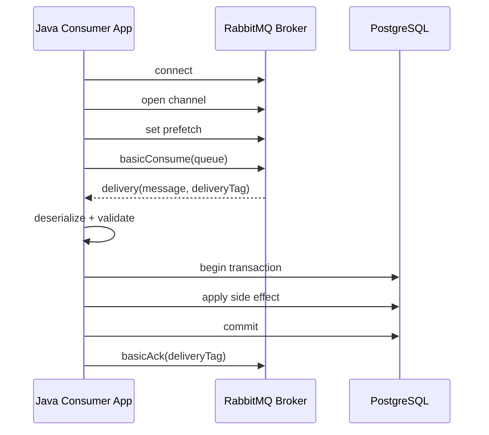
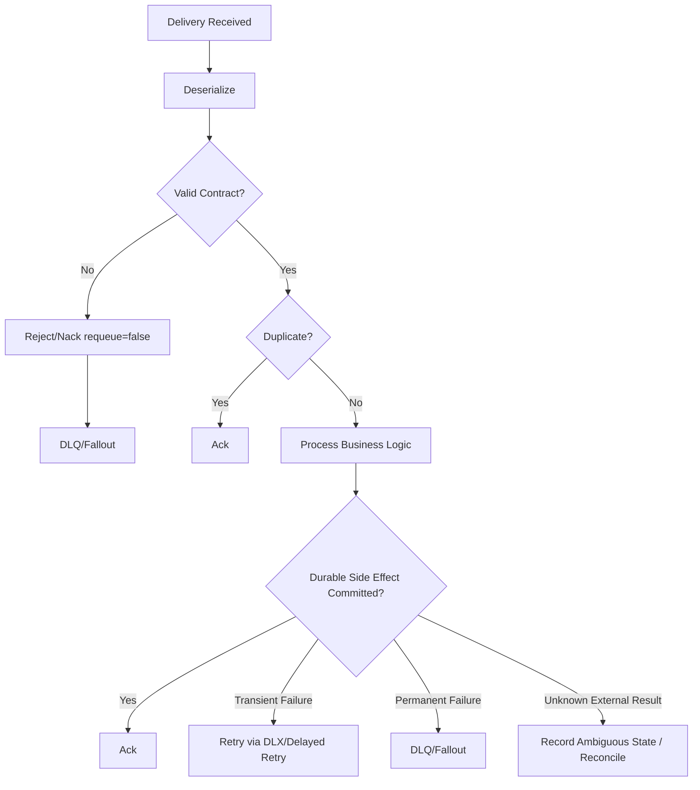

# Consumer Fundamentals

## 1. Core idea

Consumer adalah bagian aplikasi yang menerima delivery dari RabbitMQ dan mengubah message menjadi side effect.

Side effect bisa berupa:

- update PostgreSQL row;
- insert audit/history row;
- call downstream service;
- invalidate Redis cache;
- publish follow-up message;
- move workflow state;
- trigger notification;
- create task/fallout item;
- execute integration adapter.

Mental model:

```text
A consumer is not complete when it receives a message.
A consumer is complete only when its side effect is durably handled and the broker is told the correct outcome.
```

Dalam RabbitMQ, outcome itu biasanya dikomunikasikan dengan:

- ack;
- nack;
- reject;
- requeue;
- dead-lettering.

Consumer fundamentals adalah discipline untuk menjawab:

```text
When do we accept responsibility for this message?
What happens if we crash before, during, or after processing?
```

---

## 2. Consumer in enterprise Java/JAX-RS system

Walaupun consumer sering berjalan di background worker, ia tetap bagian dari application architecture.

Typical flow:

```text
RabbitMQ Queue
  -> Java Consumer Callback
  -> Deserialize Payload
  -> Validate Contract
  -> Load/Update PostgreSQL via MyBatis/JDBC
  -> Call Domain Service
  -> Commit Transaction
  -> Ack/Nack/Reject
```

Consumer bukan JAX-RS resource, tetapi ia harus mengikuti kualitas yang sama:

- contract validation;
- authentication/authorization context jika relevan;
- tenant awareness;
- transaction boundary;
- idempotency;
- metrics;
- tracing;
- error classification;
- graceful shutdown;
- operational visibility.

Dalam CPQ/order systems, consumer failure bisa memengaruhi:

- quote status progression;
- order decomposition;
- approval task movement;
- fulfillment dispatch;
- fallout handling;
- notification delivery;
- downstream BSS/OSS integration.

---

## 3. Consumer lifecycle

Lifecycle dasar:



Failure-aware lifecycle:

```text
start -> subscribe -> receive -> process -> commit side effect -> ack
                         |          |             |
                         |          |             + crash after commit before ack -> redelivery duplicate
                         |          + crash during process -> redelivery
                         + delivery but consumer cancelled -> broker requeues/unacked behavior depends on state
```

Key point:

```text
RabbitMQ tracks delivery acknowledgement, not your business transaction.
```

The application must align both.

---

## 4. basicConsume vs basicGet

RabbitMQ supports push-based consumption and pull-based retrieval.

### basicConsume

`basicConsume` registers a consumer and lets broker push messages as they become available, respecting prefetch and acknowledgement state.

This is the normal production pattern for workers.

Benefits:

- efficient;
- broker can manage delivery flow;
- works with prefetch;
- better throughput;
- standard consumer lifecycle;
- easier metrics and cancellation handling.

### basicGet

`basicGet` polls a queue for one message.

It can be useful for:

- admin/debug tooling;
- very small scripts;
- controlled replay tools;
- tests.

It is usually an anti-pattern for production workers because:

- inefficient polling;
- unnecessary broker round trips;
- poor backpressure behavior;
- easy to implement busy loops;
- weaker lifecycle semantics.

Production rule:

```text
Use basicConsume for services and workers.
Treat basicGet as administrative/debug/test behavior unless explicitly justified.
```

---

## 5. Delivery tag

Delivery tag is a channel-scoped identifier for a delivery.

Important properties:

- assigned by broker;
- monotonically grows on a channel;
- used for ack/nack/reject;
- valid only on the channel where delivery happened;
- not a global message ID;
- not stable across redelivery;
- not a business identifier.

Anti-pattern:

```text
store deliveryTag in database as message identity
```

Correct identity should come from:

- message ID;
- business command/event ID;
- correlation ID;
- outbox ID;
- aggregate ID + version;
- custom idempotency key.

Delivery tag answers:

```text
Which delivery on this channel am I acknowledging?
```

It does not answer:

```text
Which business message is this globally?
```

---

## 6. Consumer tag

Consumer tag identifies a consumer subscription.

It is useful for:

- cancellation;
- logs;
- operational debugging;
- distinguishing multiple consumers on a channel;
- graceful shutdown.

Example mental model:

```text
queue = quote.pricing.request.q
consumerTag = quote-service-pricing-worker-7
```

Consumer tag should be logged during lifecycle events:

- consumer started;
- consumer cancelled;
- consumer shutdown;
- delivery failed;
- channel closed;
- reconnect occurred.

But consumer tag is not a durable business identity.

---

## 7. Auto ack vs manual ack

Acknowledgement mode is one of the most important correctness choices.

### Auto ack

With auto ack, RabbitMQ considers message handled as soon as it sends it to the consumer.

Flow:

```text
broker delivers message
broker removes responsibility immediately
consumer processes later
```

Risk:

```text
consumer crashes after delivery before processing -> message lost
```

Use only for:

- non-critical telemetry;
- disposable events;
- high-throughput best-effort processing;
- cases where loss is explicitly acceptable.

### Manual ack

With manual ack, consumer explicitly tells broker when processing is complete.

Flow:

```text
broker delivers message
message remains unacked
consumer processes
consumer acks after durable success
broker removes message
```

This is the default expectation for business-critical enterprise flows.

Production rule:

```text
For business messages, use manual ack unless loss is explicitly acceptable and documented.
```

---

## 8. Ack discipline

The safest default:

```text
ack after durable side effect succeeds
```

Examples:

### DB update consumer

```text
receive message
begin DB transaction
validate current state
apply idempotent state transition
commit DB transaction
ack message
```

### External call consumer

External calls are harder.

```text
receive message
call downstream system
record result durably
ack message
```

Failure question:

```text
What if downstream call succeeded but consumer crashed before recording result or acking?
```

This can cause duplicate external call on redelivery.

Mitigations:

- downstream idempotency key;
- local inbox table;
- request ledger;
- status reconciliation;
- manual fallout for ambiguous result.

### Publish follow-up message consumer

```text
receive message A
update DB
publish message B
ack message A
```

Risk:

- DB update succeeds;
- publish B fails;
- message A gets retried;
- duplicate DB update or duplicate B.

Safer pattern:

```text
receive A
DB transaction: apply business change + insert outbox row for B
commit
ack A
outbox publisher publishes B
```

---

## 9. Ack before processing risk

Anti-pattern:

```text
receive message
ack immediately
process business logic
```

If processing fails after ack:

```text
RabbitMQ will not redeliver the message.
```

This is at-most-once behavior.

It may be acceptable only when:

- processing is non-critical;
- loss is acceptable;
- message can be reconstructed elsewhere;
- another reconciliation process exists;
- low latency is more important than correctness.

For CPQ/order workflows, ack-before-processing is usually dangerous.

---

## 10. Nack and reject

When processing fails, consumer can negatively acknowledge.

### Reject

Reject usually applies to one delivery.

Concept:

```text
I cannot process this delivery.
```

With requeue true:

```text
reject and put back for redelivery
```

With requeue false:

```text
reject and do not requeue; dead-letter if DLX configured, otherwise discard
```

### Nack

Nack is a RabbitMQ extension that can reject one or multiple deliveries.

Concept:

```text
I cannot process this delivery or batch of deliveries.
```

Nack can use:

- `multiple = true/false`;
- `requeue = true/false`.

Production rule:

```text
Use nack/reject deliberately.
Requeue=true without retry limit can create redelivery storms.
```

---

## 11. Requeue

Requeue means message can be delivered again.

Simple but dangerous:

```text
processing failed
nack requeue=true
same message immediately redelivered
processing failed again
loop forever
```

Requeue true is acceptable for:

- short broker/client interruption;
- graceful shutdown before processing started;
- temporary local resource issue;
- rare transient failure with external retry control.

Requeue true is dangerous for:

- invalid schema;
- missing required data;
- permanent business rule failure;
- permission failure;
- downstream permanent rejection;
- poison message.

Better pattern for business failure:

```text
nack/reject requeue=false -> DLX/retry topology handles delay/count/isolation
```

---

## 12. Redelivery

A message can be redelivered when:

- consumer connection closes before ack;
- channel closes before ack;
- consumer nacks/rejects with requeue true;
- broker recovers unacked messages;
- consumer crashes during processing;
- ack frame is lost;
- message is replayed manually.

Redelivery flag tells consumer this delivery has been delivered before.

But do not rely on redelivery flag as the only duplicate detector.

Why?

- duplicate publish can create separate messages;
- manual replay may not preserve semantics;
- producer retry can send duplicate with same business key;
- redelivery flag is about broker delivery history, not business duplication.

Correct duplicate handling requires idempotency.

---

## 13. Prefetch basics

Prefetch limits how many unacknowledged messages RabbitMQ can deliver to a consumer/channel before waiting for acks.

Mental model:

```text
prefetch = max in-flight messages per consumer/channel scope
```

If prefetch = 10:

```text
consumer can receive 10 messages without acking
broker stops sending more until at least one is acked/nacked
```

Why it matters:

- controls memory pressure in consumer;
- controls fairness between consumers;
- affects throughput;
- affects latency;
- affects ordering;
- affects DB connection pressure;
- affects retry blast radius.

Bad prefetch examples:

```text
prefetch too high -> many unacked messages stuck in one slow consumer
prefetch too low -> throughput underutilized
prefetch unlimited -> consumer memory risk and unfair dispatch
```

Prefetch tuning gets deeper in Part 013.

---

## 14. Consumer concurrency

Concurrency can happen at multiple levels:

- multiple consumer instances;
- multiple JVM pods;
- multiple channels;
- multiple consumers per channel;
- internal worker thread pool;
- async processing inside callback.

Risk:

```text
RabbitMQ delivery model + application thread model can diverge.
```

Examples:

### Simple synchronous consumer

```text
onDelivery callback processes message fully
ack after processing
```

Easy to reason about, lower throughput.

### Callback dispatches to worker pool

```text
onDelivery receives message
submit to executor
return immediately
worker eventually acks
```

Risks:

- ack must happen on correct channel;
- channel thread-safety issues;
- executor queue can grow;
- shutdown complexity;
- delivery tag tracking;
- ordering changes;
- unacked messages accumulate.

Production rule:

```text
Do not add internal parallelism until ack ownership, channel usage, shutdown, and backpressure are explicit.
```

---

## 15. Channel closure and consumer cancellation

Consumer must handle broker/client lifecycle events.

### Channel closure

Channel can close because of:

- protocol exception;
- topology mismatch;
- permission issue;
- application error;
- connection closure;
- broker-side cancellation side effect.

Impact:

- unacked deliveries on that channel can be requeued/redelivered;
- consumer stops receiving;
- ack attempts fail;
- pending processing may become ambiguous.

### Consumer cancellation

Consumer can be cancelled when:

- queue is deleted;
- exclusive consumer conflict occurs;
- broker cancels subscription;
- application cancels during shutdown;
- topology changes.

Consumer cancellation must be logged and monitored.

Production expectation:

```text
A cancelled consumer is not just lifecycle noise.
It can mean a queue disappeared or the worker is no longer processing production messages.
```

---

## 16. Connection recovery

RabbitMQ Java client supports automatic recovery features, but recovery is not a replacement for application-level correctness.

Recovery can help recreate:

- connection;
- channels;
- consumers;
- topology depending on configuration;
- subscriptions.

But recovery cannot automatically make business processing exactly-once.

During connection failure:

- unacked messages may be redelivered;
- in-flight processing may still complete locally;
- ack may fail;
- duplicate processing can occur;
- consumer may need to stop accepting new work until recovered.

Production rule:

```text
Automatic recovery helps availability.
Idempotency handles correctness.
```

---

## 17. Graceful shutdown

Kubernetes rolling update, deployment restart, node drain, and autoscaling all affect consumers.

Unsafe shutdown:

```text
SIGTERM
process exits immediately
in-flight messages unacked
broker redelivers
external side effects may duplicate
```

Safer shutdown:

```text
SIGTERM received
stop accepting new deliveries / cancel consumer
wait for in-flight processing up to timeout
ack completed messages
nack/requeue messages not started if appropriate
close channel/connection cleanly
exit
```

Important:

```text
The shutdown timeout must be aligned with Kubernetes terminationGracePeriodSeconds.
```

If consumer work can take longer than pod shutdown window, design must include:

- resumable work;
- idempotency;
- job leases;
- progress checkpoints;
- DLQ/retry;
- external cancellation handling.

---

## 18. Consumer processing model

A production consumer should usually structure processing as:

```text
1. Receive delivery.
2. Extract metadata.
3. Start trace/span.
4. Deserialize payload.
5. Validate schema and required fields.
6. Check idempotency/inbox if needed.
7. Start DB transaction.
8. Apply domain logic.
9. Commit side effect.
10. Ack.
11. Emit metrics.
```

Failure path:

```text
classification = transient | permanent | poison | duplicate | infrastructure | security | contract
```

Then choose:

- ack duplicate already processed;
- reject/nack false to DLQ for permanent/poison;
- retry through DLX/delay for transient;
- requeue only for carefully bounded cases;
- stop consumer for systemic config/security issues.

---

## 19. Consumer error classification

### Duplicate

Example:

```text
message ID already processed
```

Action:

```text
ack safely
```

### Contract error

Examples:

- invalid JSON;
- missing required field;
- unsupported schema version;
- invalid enum.

Action:

```text
reject/nack requeue=false -> DLQ/parking lot
```

### Business permanent failure

Examples:

- referenced quote does not exist and should exist;
- illegal state transition;
- tenant mismatch;
- command expired.

Action depends on domain:

- DLQ/fallout queue;
- business fallout table;
- manual intervention;
- ack if failure is recorded durably.

### Transient infrastructure failure

Examples:

- DB temporarily unavailable;
- downstream timeout;
- Redis unavailable;
- rate limit;
- deadlock retryable;
- network issue.

Action:

```text
retry with bounded delay, not immediate infinite requeue
```

### Security failure

Examples:

- forbidden tenant;
- credential failure;
- invalid actor context.

Action:

```text
stop/reject depending severity, alert owner, avoid blind retry
```

---

## 20. Consumer metrics

Minimum metrics:

```text
consumer_delivery_total
consumer_ack_total
consumer_nack_total
consumer_reject_total
consumer_redelivery_total
consumer_processing_success_total
consumer_processing_failure_total
consumer_processing_latency_ms
consumer_db_latency_ms
consumer_inflight_count
consumer_deserialization_error_total
consumer_contract_error_total
consumer_duplicate_total
consumer_poison_total
consumer_shutdown_inflight_count
consumer_cancellation_total
```

Queue/broker metrics to correlate:

```text
messages_ready
messages_unacked
consumer_count
consumer_utilization
deliver_rate
ack_rate
redeliver_rate
queue_depth
DLQ depth
retry queue depth
```

Useful dimensions:

```text
service
queue
consumer_tag
message_type
routing_key
tenant_if_allowed
environment
result
failure_class
```

---

## 21. Consumer logs

Log at lifecycle level:

```json
{
  "event": "rabbitmq_consumer_started",
  "service": "pricing-worker",
  "queue": "<verify-internal>",
  "consumerTag": "pricing-worker-3",
  "prefetch": 20
}
```

Log failure with metadata:

```json
{
  "event": "rabbitmq_message_processing_failed",
  "service": "pricing-worker",
  "queue": "<verify-internal>",
  "messageId": "...",
  "correlationId": "...",
  "traceId": "...",
  "messageType": "PricingRequested",
  "deliveryTag": 9912,
  "redelivered": true,
  "failureClass": "TRANSIENT_DB_FAILURE",
  "action": "NACK_REQUEUE_FALSE_TO_RETRY_DLX"
}
```

Avoid full payload logs unless explicitly safe.

---

## 22. Consumer and PostgreSQL/MyBatis

For database side effects, transaction boundary matters.

Safe default:

```java
try {
    transactionTemplate.execute(status -> {
        inboxMapper.insertIfAbsent(messageId);
        domainService.apply(message);
        return null;
    });

    channel.basicAck(deliveryTag, false);
} catch (DuplicateMessageException duplicate) {
    channel.basicAck(deliveryTag, false);
} catch (TransientException transientFailure) {
    channel.basicNack(deliveryTag, false, false); // let retry/DLX handle
} catch (PermanentException permanent) {
    channel.basicReject(deliveryTag, false); // DLQ/fallout
}
```

Key design points:

- insert inbox/processed marker in same transaction as business effect;
- use unique constraint on message ID or business idempotency key;
- ack only after commit;
- classify DB failures;
- avoid holding RabbitMQ callback thread during long blocking operations if concurrency model cannot handle it;
- align DB pool size with consumer concurrency and prefetch.

---

## 23. Consumer and Redis

Redis can support consumers but should not silently replace durable correctness.

Valid uses:

- cache lookup;
- rate limiting;
- short-lived dedup for low-criticality flows;
- distributed lock with careful expiry;
- cache invalidation.

Risks:

- Redis dedup lost after eviction/restart if not durable;
- lock expiry while processing still running;
- consumer crashes after external side effect but before Redis marker;
- Redis outage blocks processing;
- cache stale after message failure.

Production rule:

```text
For business-critical idempotency, prefer durable DB-backed inbox or business unique constraint.
Redis can optimize, but should not be the only correctness boundary unless loss is acceptable.
```

---

## 24. Consumer and Kafka/CDC hybrid systems

Some enterprise systems use RabbitMQ alongside Kafka or CDC.

Patterns:

- RabbitMQ task queue triggered by Kafka event;
- Kafka event generated after RabbitMQ consumer state change;
- CDC publishes DB changes while RabbitMQ handles commands;
- RabbitMQ drives integration task and Kafka stores event log.

Consumer questions:

- Is this message command or event?
- Is it replayable elsewhere?
- If RabbitMQ processing fails, does Kafka/CDC create duplicate recovery path?
- Which system is source of truth?
- Is ordering required across RabbitMQ and Kafka?
- Are correlation IDs propagated across both?

Do not assume RabbitMQ redelivery and Kafka replay are equivalent. They are different models.

---

## 25. Consumer and Kubernetes

Consumer pods in Kubernetes must handle platform lifecycle.

Review these:

- readiness: should pod be ready before RabbitMQ connection and subscriptions exist?
- liveness: should temporary broker outage kill pod?
- preStop: does consumer stop accepting new messages?
- terminationGracePeriodSeconds: enough for in-flight processing?
- HPA: does scaling replicas multiply prefetch too much?
- CPU limit: can throttling cause heartbeat or processing timeout?
- memory limit: can high prefetch cause OOM?
- secret rotation: how do connections recover?
- rolling deployment: does it create connection storms?

Formula to remember:

```text
total possible in-flight messages = replicas * consumers_per_replica * prefetch
```

This number must be compatible with:

- DB pool;
- downstream rate limits;
- memory;
- ordering needs;
- duplicate blast radius.

---

## 26. Consumer anti-patterns

### Anti-pattern 1: auto ack for business message

Can lose message on crash.

### Anti-pattern 2: ack before DB commit

Can lose business update if app crashes after ack.

### Anti-pattern 3: nack requeue true forever

Creates redelivery storm.

### Anti-pattern 4: treating redelivery flag as duplicate detector

Does not catch duplicate publish.

### Anti-pattern 5: unlimited prefetch

Can cause unfair dispatch, memory pressure, and large duplicate blast radius.

### Anti-pattern 6: worker pool without channel discipline

Can ack on wrong channel or create thread-safety bugs.

### Anti-pattern 7: no graceful shutdown

Rolling deploy becomes duplicate/retry storm.

### Anti-pattern 8: logging full payload

Can leak customer, quote, pricing, order, tenant, or PII data.

### Anti-pattern 9: no DLQ/fallout path

Poison message blocks or loops forever.

### Anti-pattern 10: no consumer metrics

Team cannot tell whether consumer is healthy, slow, stuck, or repeatedly failing.

---

## 27. Consumer review checklist

### Subscription

- Which queue does the consumer consume?
- Is the queue durable and correct type?
- Is consumer using basicConsume, not polling basicGet?
- Is consumer tag identifiable?
- Is subscription lifecycle logged?

### Ack mode

- Auto ack or manual ack?
- If auto ack, is loss acceptable?
- Is ack after durable side effect?
- Are ack/nack/reject done on correct channel?
- Is multiple ack used safely?

### Error handling

- Are failures classified?
- Is transient failure retried with delay?
- Is permanent failure sent to DLQ/fallout?
- Is poison message isolated?
- Is infinite requeue prevented?

### Idempotency

- Is message ID present?
- Is idempotency key stable?
- Is inbox/processed message table used if needed?
- Are duplicate messages acked safely?
- Are external calls idempotent?

### Concurrency

- What is prefetch?
- How many consumer instances run?
- Is there internal worker pool?
- Is total in-flight compatible with DB/downstream capacity?
- Does concurrency break ordering?

### Shutdown/recovery

- Is graceful shutdown implemented?
- Are in-flight messages drained?
- Is consumer cancellation handled?
- Is connection recovery understood?
- Are redeliveries expected after restart?

### Observability

- Are delivery/ack/nack/reject metrics emitted?
- Is processing latency measured?
- Is redelivery rate monitored?
- Is DLQ/retry depth monitored?
- Are failure classes visible?

---

## 28. Internal verification checklist

Use this for real CSG/team exploration.

### Codebase

- Find all RabbitMQ consumer implementations.
- Check whether a shared consumer framework exists.
- Check manual ack vs auto ack.
- Check ack location relative to DB commit.
- Check nack/reject behavior.
- Check whether requeue true is used.
- Check prefetch settings.
- Check consumer concurrency model.
- Check worker executor usage.
- Check graceful shutdown implementation.
- Check connection recovery settings.

### Message correctness

- Verify message ID/header standard.
- Verify idempotency key.
- Verify inbox/processed message table if needed.
- Verify duplicate handling.
- Verify poison message handling.
- Verify retry count/death header usage.

### RabbitMQ topology

- Verify consumed queues.
- Verify DLX configured for queues.
- Verify retry queues if used.
- Verify queue type.
- Verify single active consumer if ordering matters.
- Verify consumer count in Management UI.

### Operations

- Check queue depth and unacked messages.
- Check redelivery rate.
- Check consumer utilization.
- Check DLQ depth.
- Check consumer logs for repeated failures.
- Check incident notes for stuck consumers, redelivery loops, or duplicate processing.

### Platform/SRE/backend discussion

- Ask how consumers are deployed and scaled.
- Ask whether rolling updates cause redeliveries.
- Ask whether prefetch is standardized.
- Ask how DLQ replay is performed.
- Ask who owns failed message triage.

---

## 29. Production debugging path

When queue depth increases:

```text
1. Is consumer count > 0?
2. Are consumers connected to the expected queue/vhost?
3. Is deliver rate > 0?
4. Is ack rate lower than deliver rate?
5. Are messages ready or unacked?
6. Are consumers slow or stuck?
7. Is DB/downstream slow?
8. Are consumers repeatedly failing and requeueing?
9. Is prefetch too high?
10. Are pods restarting?
11. Is DLQ/retry growing?
12. Did topology/permission change?
```

When unacked messages increase:

```text
1. Check processing latency.
2. Check consumer thread dump if possible.
3. Check DB pool saturation.
4. Check downstream timeout.
5. Check CPU/memory throttling.
6. Check prefetch too high.
7. Check graceful shutdown stuck.
8. Check ack code path.
```

When redelivery spikes:

```text
1. Check consumer crashes/restarts.
2. Check nack/requeue true loops.
3. Check connection/channel closures.
4. Check poison message.
5. Check deployment rollout timing.
6. Check broker failover.
7. Check duplicate publish vs broker redelivery.
```

---

## 30. Mermaid: consumer outcome model



This model prevents the common mistake:

```text
all exceptions -> requeue true
```

That mistake creates storms.

---

## 31. Senior engineer heuristics

1. Consumer correctness starts with ack timing.
2. Ack after durable side effect unless loss is acceptable.
3. Redelivery is normal, not exceptional.
4. Duplicate publish is different from redelivery.
5. Requeue true is dangerous without bounds.
6. Prefetch is a correctness and capacity lever, not just performance tuning.
7. Scaling consumer pods multiplies in-flight work.
8. External calls require idempotency keys or reconciliation.
9. Consumer shutdown is part of correctness.
10. A consumer without DLQ, metrics, and idempotency is not production-ready.

---

## 32. Common interview/review questions

- What is the difference between auto ack and manual ack?
- When should a consumer ack?
- What happens if consumer crashes after DB commit but before ack?
- What happens if consumer acks before processing and then crashes?
- What is delivery tag scope?
- Why is delivery tag not a message ID?
- What does redelivered flag mean?
- Why is redelivered flag not enough for deduplication?
- When should nack/reject use requeue=false?
- Why can requeue=true cause storms?
- How does prefetch affect unacked messages?
- How does Kubernetes scaling affect consumer concurrency?
- How should graceful shutdown work?
- What metrics show consumer health?
- How do you debug increasing unacked messages?

---

## 33. References

- RabbitMQ Consumers: https://www.rabbitmq.com/docs/consumers
- RabbitMQ Consumer Acknowledgements and Publisher Confirms: https://www.rabbitmq.com/docs/confirms
- RabbitMQ Negative Acknowledgements: https://www.rabbitmq.com/docs/nack
- RabbitMQ Consumer Prefetch: https://www.rabbitmq.com/docs/consumer-prefetch
- RabbitMQ Java Client API Guide: https://www.rabbitmq.com/client-libraries/java-api-guide
- RabbitMQ Reliability Guide: https://www.rabbitmq.com/docs/reliability

---

## 34. Closing mental model

A consumer is a reliability boundary.

It connects broker delivery to business side effect.

The key invariant:

```text
Do not tell RabbitMQ "done" until the business consequence is safely done.
```

But also:

```text
Do not retry blindly when the failure is permanent, poison, or already processed.
```

A senior engineer reviews consumer code by tracing every possible crash point:

```text
before processing
mid processing
after DB commit before ack
after external call before recording result
during shutdown
during redelivery
during retry
```

If the design survives those cases, the consumer is moving toward production readiness.
