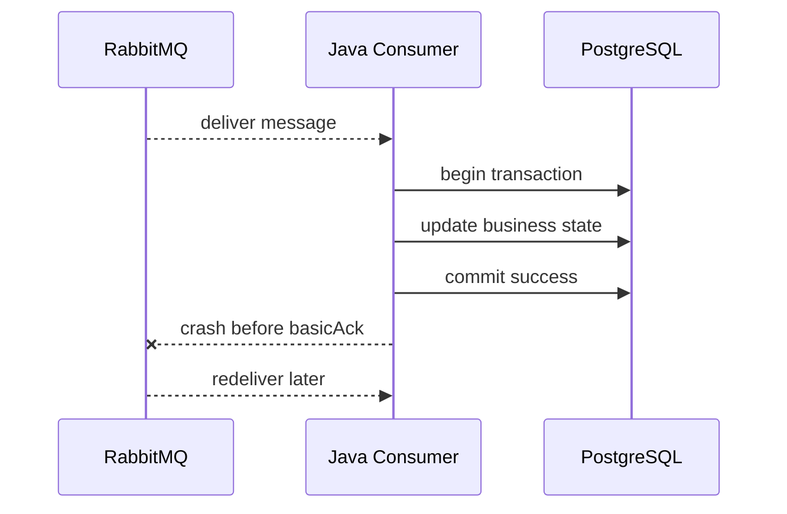
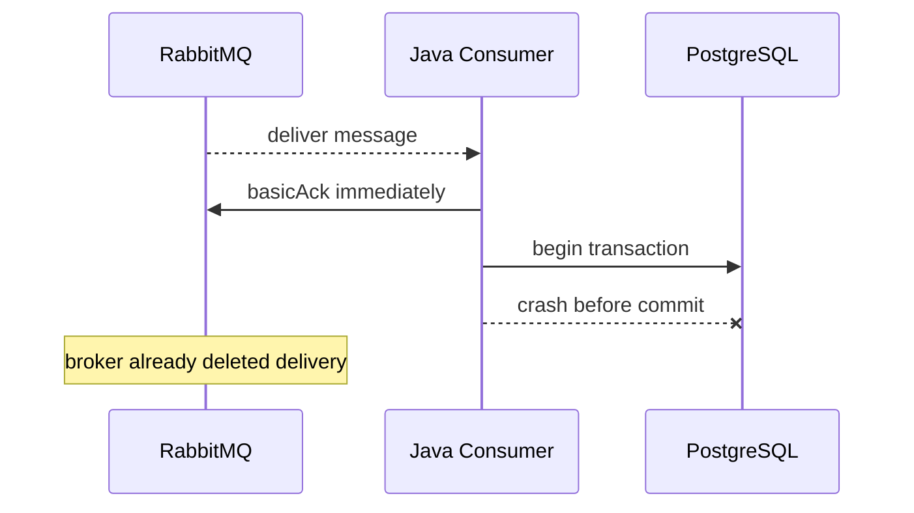
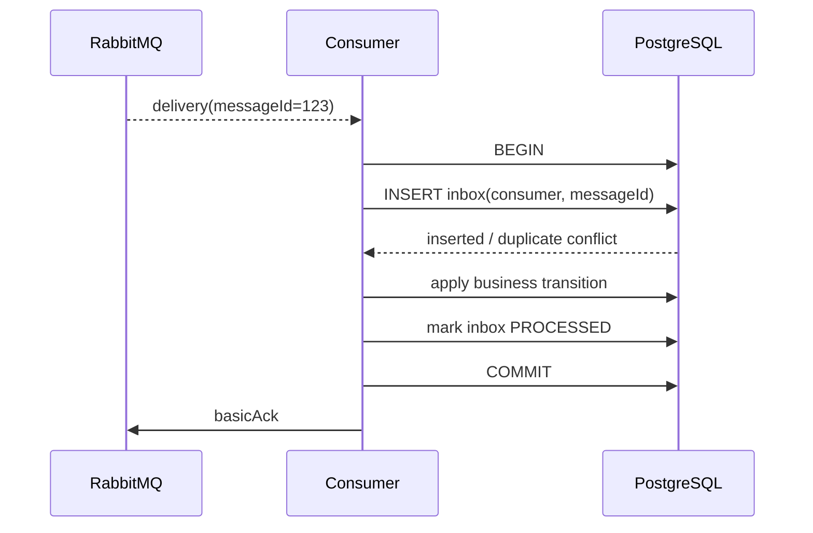
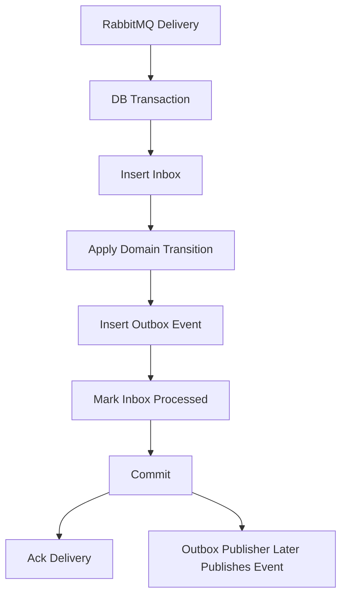
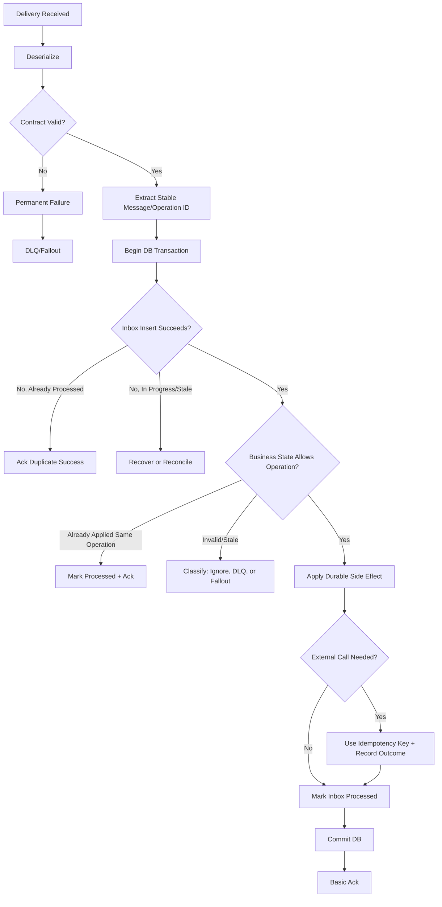

# Consumer Correctness and Idempotency

## 1. Core idea

Consumer correctness adalah kemampuan consumer untuk menghasilkan business side effect yang benar walaupun RabbitMQ, jaringan, aplikasi, database, atau downstream dependency mengalami failure.

Dalam sistem RabbitMQ production, pertanyaan pentingnya bukan:

```text
Can the consumer receive a message?
```

Pertanyaan pentingnya adalah:

```text
Can the consumer process the message exactly as business expects when delivery can be repeated, interrupted, delayed, reordered, or partially completed?
```

RabbitMQ umumnya digunakan dengan **at-least-once delivery** untuk workload penting. Artinya:

```text
A message can be delivered more than once.
```

Maka consumer harus didesain dengan invariant:

```text
Duplicate delivery must not produce duplicate business damage.
```

Untuk enterprise Java/JAX-RS backend, correctness biasanya bergantung pada:

- idempotency key;
- message ID;
- business command ID;
- correlation ID;
- PostgreSQL unique constraint;
- inbox table;
- processed message table;
- deterministic state transition;
- transaction boundary;
- correct ack timing;
- poison message isolation;
- retry/DLQ discipline;
- observability.

---

## 2. Why duplicates are normal

Duplicate message bukan selalu bug RabbitMQ.

Duplicate bisa muncul karena:

- publisher retry setelah confirm timeout;
- network failure setelah broker menerima message tetapi producer tidak menerima confirm;
- consumer crash setelah DB commit tetapi sebelum ack;
- channel/connection close sebelum ack diterima broker;
- broker failover;
- consumer timeout;
- manual replay dari DLQ;
- outbox poller mem-publish ulang row yang belum ditandai published;
- shovel/federation/cross-broker movement;
- deployment rollout saat ada in-flight message;
- consumer menggunakan `nack(requeue=true)`;
- operator melakukan replay batch.

Mental model:

```text
RabbitMQ can help deliver messages reliably.
It cannot know whether your business side effect was safely and uniquely applied.
```

Itu tanggung jawab aplikasi.

---

## 3. RabbitMQ redelivery vs duplicate publish

Ada dua sumber duplicate yang berbeda.

### 3.1 Redelivery

Redelivery terjadi ketika RabbitMQ sudah mengirim message ke consumer, tetapi message belum dianggap selesai oleh broker.

Contoh:

```text
consumer receives message
consumer writes DB
consumer crashes before ack
broker requeues unacked message
message delivered again
```

Dalam kasus ini, message yang sama dikirim lagi.

### 3.2 Duplicate publish

Duplicate publish terjadi ketika producer mengirim message lebih dari sekali.

Contoh:

```text
producer publishes message
broker persists message
broker sends confirm
network fails before producer receives confirm
producer retries publish
broker receives second copy
```

Dalam kasus ini, queue bisa berisi dua message terpisah dengan payload yang secara business sama.

### 3.3 Why this distinction matters

Redelivery flag hanya membantu mendeteksi kemungkinan message pernah dikirim ke consumer sebelumnya.

Tetapi duplicate publish bisa menghasilkan message baru yang tidak selalu terlihat sebagai redelivery.

Maka deduplication tidak boleh hanya bergantung pada `redelivered` flag.

Deduplication harus berbasis business/message identity yang stabil, misalnya:

```text
messageId
commandId
eventId
outboxId
businessOperationId
quoteId + operationType + operationVersion
orderId + transitionId
```

---

## 4. At-least-once delivery and consumer responsibility

At-least-once delivery berarti sistem memilih risiko duplicate dibanding risiko silent loss.

Trade-off-nya:

```text
Message loss is reduced.
Duplicate processing becomes application responsibility.
```

Consumer harus siap terhadap:

- message yang sama diproses ulang;
- message yang pernah berhasil diproses datang lagi;
- side effect yang sudah sebagian terjadi;
- state sudah berubah oleh worker lain;
- downstream sudah menerima request sebelumnya;
- retry datang setelah business state berubah;
- replay manual terhadap payload lama.

Correct consumer tidak bertanya:

```text
Have I seen this delivery tag?
```

Correct consumer bertanya:

```text
Has this business operation already been applied safely?
```

---

## 5. The dangerous crash window

Crash window paling penting:

```text
DB commit succeeds, but ack fails or never happens.
```

Sequence:



Jika consumer tidak idempotent, redelivery bisa menyebabkan:

- duplicate status transition;
- duplicate order submission;
- duplicate fulfillment task;
- duplicate notification;
- duplicate charging/invoicing trigger;
- duplicate external API call;
- duplicate integration request;
- corrupted audit timeline.

Correct design:

```text
On redelivery, consumer detects operation already applied and safely ack.
```

---

## 6. Ack before processing risk

Auto ack atau ack-before-processing bisa membuat message hilang.

Sequence:



Akibat:

```text
RabbitMQ believes message is done.
Business side effect never happened.
```

Rule:

```text
Ack before processing is acceptable only when message loss is explicitly acceptable.
```

Untuk CPQ/order management, biasanya loss tidak acceptable untuk:

- order submission;
- quote approval transition;
- fulfillment dispatch;
- fallout task creation;
- billing/charging integration;
- customer-impacting notification;
- audit-relevant state change.

---

## 7. Idempotency definition

Idempotency berarti operasi bisa dijalankan lebih dari sekali dengan hasil akhir yang sama secara business.

Contoh idempotent:

```text
Set quote status to APPROVED if current status is SUBMITTED.
If already APPROVED with same approval command ID, treat as success.
```

Contoh non-idempotent:

```text
Insert approval record blindly every time message arrives.
Increment retry/attempt/business counter blindly.
Call downstream create-order API without idempotency key.
Send email every time message is consumed.
```

Idempotency bukan berarti tidak melakukan apa pun saat duplicate.

Idempotency berarti:

```text
Repeated processing does not violate the intended business invariant.
```

---

## 8. Technical idempotency vs business idempotency

### 8.1 Technical idempotency

Technical idempotency mencegah message yang sama diproses dua kali secara teknis.

Biasanya menggunakan:

- `message_id`;
- `event_id`;
- `command_id`;
- inbox table;
- processed message table;
- unique constraint.

Contoh:

```sql
CREATE TABLE processed_message (
    consumer_name TEXT NOT NULL,
    message_id TEXT NOT NULL,
    processed_at TIMESTAMPTZ NOT NULL DEFAULT now(),
    PRIMARY KEY (consumer_name, message_id)
);
```

### 8.2 Business idempotency

Business idempotency memastikan operation yang sama tidak merusak domain state walaupun message identity berbeda.

Contoh:

```text
Only one active fulfillment request is allowed for order item X and action Y.
```

atau:

```text
A quote approval command with approvalId A can transition quote Q only once.
```

Business idempotency biasanya menggunakan:

- business unique key;
- state machine guard;
- command ID;
- aggregate version;
- optimistic locking;
- unique constraint on business operation;
- domain-level invariant.

### 8.3 Senior rule

```text
Technical idempotency catches duplicate delivery.
Business idempotency catches duplicate intent.
```

Production-grade consumer sering membutuhkan keduanya.

---

## 9. Idempotency key design

Idempotency key harus stabil, unik, dan bermakna terhadap operation.

Bad keys:

```text
deliveryTag
consumerTag
timestamp
random UUID generated by consumer
traceId only
routingKey only
```

Good candidates:

```text
messageId generated by producer
outboxId
commandId
eventId
businessOperationId
quoteApprovalId
orderSubmissionId
fulfillmentRequestId
externalRequestId
```

Untuk command:

```text
idempotencyKey = commandId
```

Untuk event:

```text
idempotencyKey = eventId
```

Untuk derived task:

```text
idempotencyKey = sourceEventId + taskType + targetAggregateId
```

Untuk integration call:

```text
idempotencyKey = internalOperationId mapped to external idempotency token
```

---

## 10. Inbox table pattern

Inbox table menyimpan message yang diterima consumer agar duplicate bisa dikenali.

Minimal schema:

```sql
CREATE TABLE consumer_inbox (
    consumer_name TEXT NOT NULL,
    message_id TEXT NOT NULL,
    message_type TEXT NOT NULL,
    correlation_id TEXT NULL,
    status TEXT NOT NULL,
    received_at TIMESTAMPTZ NOT NULL DEFAULT now(),
    processed_at TIMESTAMPTZ NULL,
    failure_reason TEXT NULL,
    payload_hash TEXT NULL,
    PRIMARY KEY (consumer_name, message_id)
);
```

Status umum:

```text
RECEIVED
PROCESSING
PROCESSED
FAILED_RETRYABLE
FAILED_PERMANENT
DLQED
IGNORED_DUPLICATE
```

Basic processing model:

```text
1. Start DB transaction.
2. Insert inbox row with unique key.
3. If duplicate key conflict, inspect existing status.
4. Apply business side effect if not processed.
5. Mark inbox PROCESSED.
6. Commit DB transaction.
7. Ack message.
```

---

## 11. Inbox transaction boundary

Correct consumer transaction should include:

- duplicate check;
- business state change;
- inbox status update.

Pattern:

```text
RabbitMQ delivery received
  -> DB transaction starts
       -> insert inbox row or detect duplicate
       -> validate business state
       -> apply side effect
       -> mark inbox processed
     DB commit
  -> basicAck
```

Mermaid:



If duplicate conflict:

```text
If already PROCESSED -> ack.
If PROCESSING is stale -> decide recovery policy.
If FAILED_PERMANENT -> reject/nack false or ack based on DLQ policy.
If FAILED_RETRYABLE -> retry according to bounded policy.
```

---

## 12. Processed message table pattern

Simpler than inbox table:

```sql
CREATE TABLE processed_message (
    consumer_name TEXT NOT NULL,
    message_id TEXT NOT NULL,
    processed_at TIMESTAMPTZ NOT NULL DEFAULT now(),
    PRIMARY KEY (consumer_name, message_id)
);
```

Use when:

- payload does not need to be retained;
- retry state is tracked elsewhere;
- failure audit is not required;
- processing is simple;
- consumer can safely skip if key exists.

Limitations:

- no processing status;
- weaker troubleshooting;
- no payload hash;
- harder replay audit;
- no poison tracking;
- less useful for regulated workflows.

For CPQ/order management, inbox table is often safer than a bare processed table when the flow affects state transitions or external integration.

---

## 13. Unique constraints as correctness tools

Idempotency should be backed by database constraints, not just application checks.

Bad:

```text
SELECT count(*) WHERE message_id = ?
if count == 0 then insert
```

This has race conditions.

Better:

```sql
INSERT INTO consumer_inbox (consumer_name, message_id, message_type, status)
VALUES (?, ?, ?, 'PROCESSING')
ON CONFLICT (consumer_name, message_id) DO NOTHING;
```

Then inspect affected row count.

Business constraints:

```sql
CREATE UNIQUE INDEX uq_fulfillment_request_once
ON fulfillment_request(order_item_id, request_type, source_command_id);
```

Senior rule:

```text
If duplicate processing would be expensive or dangerous, the database must enforce the invariant.
```

---

## 14. State transition idempotency

Many enterprise backend systems are state machines.

RabbitMQ consumers often move entities from one state to another:

```text
QUOTE_DRAFT -> QUOTE_SUBMITTED
QUOTE_SUBMITTED -> APPROVAL_PENDING
APPROVAL_PENDING -> APPROVED
ORDER_CREATED -> ORDER_DECOMPOSED
ORDER_DECOMPOSED -> FULFILLMENT_REQUESTED
```

Idempotent transition rule:

```text
A transition command should be applied only if current state allows it.
```

Example:

```sql
UPDATE quote
SET status = 'APPROVED', approval_command_id = :commandId
WHERE quote_id = :quoteId
  AND status = 'APPROVAL_PENDING'
  AND (approval_command_id IS NULL OR approval_command_id = :commandId);
```

Interpretation:

```text
0 rows updated can mean duplicate, invalid state, stale command, or conflict.
Do not blindly ack without classifying.
```

Consumer should distinguish:

- already processed same command;
- invalid transition;
- stale event;
- concurrent update conflict;
- missing aggregate;
- permanent bad message;
- transient DB issue.

---

## 15. External call idempotency

External calls are harder than DB writes.

Failure window:

```text
consumer calls downstream
external system succeeds
consumer crashes before recording result
message redelivered
consumer calls downstream again
```

Safe pattern:

```text
1. Generate stable external idempotency key.
2. Record outbound attempt before call.
3. Call external system with idempotency key if supported.
4. Record response/result.
5. Ack only after durable record.
```

If downstream does not support idempotency key:

- use internal reconciliation;
- query downstream by business key before retry;
- create pending/ambiguous state;
- escalate to fallout/manual intervention;
- avoid infinite retry.

Never assume:

```text
HTTP timeout means downstream did not process.
```

Timeout means:

```text
unknown outcome
```

---

## 16. Redis as idempotency store: be careful

Redis can be used for fast dedup, but it has risks.

Acceptable use cases:

- short-lived duplicate suppression;
- rate limiting;
- cache invalidation coordination;
- non-critical idempotency hints;
- reducing DB load before durable check.

Risky use cases:

- authoritative idempotency for financial/order state;
- permanent duplicate prevention;
- critical audit trail;
- business invariant enforcement.

Risks:

- TTL expiry;
- eviction;
- failover data loss depending setup;
- split-brain-like stale state;
- lock expiry while processing still running;
- Redis success but DB failure.

Rule:

```text
For mission-critical RabbitMQ consumers, Redis can optimize idempotency but should not be the only source of truth unless the business accepts the risk.
```

---

## 17. Ack after processing

Correct default:

```text
Ack after durable processing completes.
```

Durable processing means:

- DB transaction committed;
- inbox/processed marker stored;
- side effect recorded;
- external ambiguous result captured;
- retry/DLQ decision recorded if needed.

Not enough:

- method returned in memory;
- downstream call was attempted but not recorded;
- log line written;
- message deserialized;
- async task submitted to an executor;
- DB update queued but not committed.

If consumer submits work to another thread and acks immediately, correctness moves to that thread. That usually creates hidden message loss risk.

---

## 18. Async handoff inside consumer

Common mistake:

```text
RabbitMQ consumer callback receives message.
Callback submits task to thread pool.
Callback immediately ack.
Worker later fails.
```

This breaks ownership transfer.

Safer alternatives:

1. Process synchronously inside controlled consumer worker and ack after completion.
2. Use bounded in-process handoff and ack only when worker finishes.
3. Persist task into DB table, commit, then ack RabbitMQ.
4. Use another durable queue intentionally, not accidental memory queue.

Rule:

```text
Do not ack a RabbitMQ message because another in-memory component promised to process it later.
```

---

## 19. Requeue loop and poison message

A poison message is a message that cannot be processed successfully by the current consumer logic.

Causes:

- invalid schema;
- missing required field;
- unsupported version;
- deleted aggregate;
- business rule violation;
- deterministic code bug;
- downstream always rejects request;
- impossible state transition.

Bad pattern:

```text
catch Exception -> basicNack(requeue=true)
```

This can create:

- hot loop;
- CPU waste;
- queue starvation;
- redelivery storm;
- log explosion;
- database pressure;
- downstream pressure;
- hidden incident.

Correct pattern:

```text
Classify failure:
  transient -> bounded retry
  permanent -> DLQ / fallout / reject no requeue
  duplicate -> ack
  ambiguous -> record + reconcile
```

---

## 20. Failure classification

Consumer error handling should classify failure.

### 20.1 Transient failure

Examples:

- DB connection timeout;
- temporary downstream 503;
- RabbitMQ connection interruption during follow-up publish;
- lock timeout;
- temporary rate limit;
- network glitch.

Action:

```text
retry with bounded delay
```

### 20.2 Permanent failure

Examples:

- invalid payload;
- unsupported message version;
- missing required domain entity that should exist;
- illegal state transition;
- authorization/tenant mismatch;
- schema incompatible with consumer.

Action:

```text
DLQ/fallout, no infinite retry
```

### 20.3 Duplicate success

Examples:

- inbox already PROCESSED;
- business operation already applied;
- downstream already has operation result.

Action:

```text
ack as success
```

### 20.4 Ambiguous outcome

Examples:

- external timeout after request body sent;
- DB commit status unknown;
- consumer lost connection after partial side effect;
- downstream returned 202 but no final status.

Action:

```text
record ambiguous state, reconcile, avoid blind retry
```

---

## 21. Consumer decision matrix

```text
Message received
  -> invalid schema?
       yes -> reject/nack requeue=false -> DLQ/fallout
  -> duplicate message ID already processed?
       yes -> ack
  -> valid but business state already at target due same operation?
       yes -> ack
  -> stale event older than aggregate version?
       yes -> ignore + ack or DLQ depending contract
  -> transient dependency failure?
       yes -> bounded retry
  -> permanent business failure?
       yes -> DLQ/fallout + no requeue loop
  -> processing success?
       yes -> commit + ack
  -> outcome ambiguous?
       yes -> record + reconcile + controlled retry/fallout
```

---

## 22. Java/JAX-RS impact

RabbitMQ consumer may not be a JAX-RS endpoint, but it shares the same domain/service layer.

Recommended layering:

```text
RabbitMqConsumerAdapter
  -> MessageDeserializer
  -> MessageContractValidator
  -> IdempotencyService
  -> ApplicationService / DomainService
  -> Repository / MyBatis Mapper
  -> OutboxPublisher or Follow-up Message Service
```

Do not put core business logic inside raw consumer callback.

Bad:

```java
public void handleDelivery(...) {
    // 500 lines of domain logic, SQL, HTTP calls, ack decisions mixed together
}
```

Better:

```java
public void handleDelivery(...) {
    ConsumerResult result = messageHandler.handle(messageContext);
    acknowledgementStrategy.apply(result, deliveryTag);
}
```

Important separation:

- AMQP delivery concern;
- message contract concern;
- idempotency concern;
- domain transition concern;
- persistence concern;
- retry/DLQ concern;
- metrics/logging concern.

---

## 23. PostgreSQL/MyBatis/JDBC impact

Consumer correctness often lives in PostgreSQL.

Key patterns:

- unique constraint for inbox;
- unique constraint for business operation;
- optimistic locking on aggregate version;
- transactional update of inbox + domain state;
- explicit status table for long-running workflow;
- outbox row for follow-up event;
- `SELECT ... FOR UPDATE` only when necessary;
- bounded retry around serialization/deadlock errors;
- clean transaction boundary in service layer.

Common MyBatis/JDBC risks:

- transaction not covering all mapper calls;
- autocommit accidentally enabled;
- duplicate insert handled as generic error;
- SQL exception swallowed then acked;
- update count ignored;
- mapper method updates more rows than intended;
- retry repeats non-idempotent operation;
- connection pool exhaustion from high consumer concurrency.

Review question:

```text
Can two consumers process the same business operation concurrently and both commit?
```

If yes, idempotency is not complete.

---

## 24. Optimistic locking

Optimistic locking helps prevent stale or duplicate transitions.

Example:

```sql
UPDATE orders
SET status = :newStatus,
    version = version + 1,
    updated_at = now()
WHERE order_id = :orderId
  AND version = :expectedVersion;
```

Consumer interpretation:

```text
1 row updated -> transition applied
0 rows updated -> stale, duplicate, conflict, or missing order
```

Do not blindly classify `0 rows updated` as success.

Classify using additional read:

```text
current state == desired state and commandId matches -> duplicate success
current state progressed beyond event -> stale event, maybe ack
current state incompatible -> DLQ/fallout/manual investigation
entity missing -> depends on contract
```

---

## 25. Multi-consumer concurrency

With multiple consumers on one queue:

```text
same queue -> multiple deliveries in parallel -> same aggregate may be modified concurrently
```

Risk:

- race condition on same quote/order;
- out-of-order transition;
- duplicate downstream call;
- deadlock;
- optimistic lock conflict;
- false transient retry storm.

Mitigations:

- idempotency key;
- optimistic locking;
- per-aggregate ordering strategy;
- single active consumer if needed;
- routing by aggregate ID to separate queues if topology supports it;
- DB constraint;
- retry with jitter for optimistic conflict;
- domain state guard.

Do not assume RabbitMQ queue ordering solves aggregate concurrency if there are multiple consumers.

---

## 26. Redelivered flag usage

`redelivered` is a hint that the message may have been delivered before.

Useful for:

- logging;
- metrics;
- failure diagnosis;
- choosing to run expensive duplicate checks only when needed in low-risk systems;
- detecting requeue loop.

Not enough for:

- authoritative idempotency;
- business duplicate prevention;
- compliance/audit;
- exactly-once semantics.

Rule:

```text
Use redelivered as diagnostic metadata, not as the idempotency mechanism.
```

---

## 27. Duplicate-safe side effects

Evaluate every side effect.

### 27.1 Database update

Make it idempotent with constraints and state guards.

### 27.2 Event publish

Use outbox inside same transaction as business state change.

### 27.3 External HTTP call

Use idempotency key or reconciliation.

### 27.4 Email/SMS/notification

Use notification request ID and unique constraint.

### 27.5 Redis cache invalidation

Usually safe to repeat, but cache rebuild stampede must be controlled.

### 27.6 Audit log

Audit can either record each delivery attempt or one business operation. Decide intentionally.

### 27.7 Metrics

Duplicate attempts can increment attempt metrics, but business success metrics must avoid double-counting.

---

## 28. Inbox and outbox together

Consumer can also publish follow-up messages.

Correct pattern:

```text
consume message
  -> insert inbox row
  -> apply business state
  -> insert outbox row for follow-up event
  -> mark inbox processed
  -> commit DB
  -> ack RabbitMQ
  -> separate outbox publisher publishes follow-up
```

This avoids:

```text
DB commit success + follow-up publish failure
```

and avoids:

```text
follow-up publish success + DB rollback
```

Mermaid:



---

## 29. Poison message tracking

A serious consumer should preserve enough context to debug poison messages.

Capture:

- message ID;
- message type;
- schema version;
- correlation ID;
- causation ID;
- routing key;
- exchange;
- queue;
- consumer name;
- tenant ID if applicable;
- error category;
- exception class;
- sanitized error message;
- retry count;
- x-death header if available;
- payload hash;
- payload location if payload cannot be stored directly;
- first failure time;
- last failure time.

Do not log sensitive payload blindly.

For regulated/customer-impacting flows, poison messages should map to:

```text
fallout task / manual investigation / replay procedure / data repair plan
```

---

## 30. Manual replay correctness

Replay is duplicate processing by design.

Before replaying DLQ/parking-lot messages, verify:

- is the consumer idempotent?
- has the business operation already completed?
- is the payload version still supported?
- has the aggregate state moved on?
- will replay trigger duplicate external call?
- should replay preserve original headers?
- should retry count/x-death be reset or preserved?
- does replay need approval?
- can replay be scoped by tenant/customer/order?
- are metrics separated between original and replayed processing?

Rule:

```text
Replay is a production change, not just clicking a button.
```

---

## 31. Observability for idempotency

Metrics to expose:

```text
consumer.messages.received
consumer.messages.processed
consumer.messages.acked
consumer.messages.nacked
consumer.messages.rejected
consumer.messages.duplicates_detected
consumer.messages.redelivered
consumer.messages.invalid_contract
consumer.messages.permanent_failure
consumer.messages.transient_failure
consumer.messages.ambiguous_outcome
consumer.inbox.insert_conflict
consumer.processing.duration
consumer.db.transaction.duration
consumer.external_call.unknown_outcome
```

Logs should include:

- message ID;
- correlation ID;
- message type/version;
- queue;
- routing key;
- consumer name;
- idempotency decision;
- final outcome.

Tracing should connect:

```text
producer request -> outbox -> publish -> RabbitMQ -> consumer -> DB update -> downstream call -> follow-up outbox
```

---

## 32. Kubernetes impact

Kubernetes makes duplicate and shutdown scenarios more common.

Events that can cause redelivery:

- pod termination;
- rolling deployment;
- liveness probe kill;
- node drain;
- OOMKill;
- CPU throttling causing ack timeout;
- network policy change;
- secret rotation;
- autoscaling down;
- broker failover.

Consumer should support:

- graceful shutdown;
- stop consuming new messages;
- finish in-flight work or let it redeliver safely;
- ack only completed work;
- reject/nack according to failure classification;
- expose readiness only when dependencies are usable;
- avoid huge prefetch during rollout.

If prefetch is high and replicas scale down frequently, the system will generate more redelivery pressure.

---

## 33. CPQ/order management examples

These are conceptual examples, not claims about internal CSG topology.

### 33.1 Quote approval command

Risk:

```text
duplicate approval command creates duplicate approval history or moves quote twice
```

Idempotency:

```text
approvalCommandId unique per quote approval operation
```

State guard:

```text
quote must be APPROVAL_PENDING
```

### 33.2 Order submission message

Risk:

```text
duplicate order submission creates duplicate downstream order
```

Idempotency:

```text
orderSubmissionId / external idempotency key
```

### 33.3 Fulfillment task

Risk:

```text
duplicate task dispatch creates duplicate provisioning request
```

Idempotency:

```text
orderItemId + fulfillmentAction + sourceEventId
```

### 33.4 Notification event

Risk:

```text
customer receives duplicate notification
```

Idempotency:

```text
notificationRequestId unique
```

---

## 34. Internal verification checklist

Verify with CSG/team before assuming:

- What message identity is used: `messageId`, `eventId`, `commandId`, `outboxId`, or domain-specific ID?
- Is `redelivered` logged and measured?
- Do consumers use manual ack?
- Is ack performed after DB commit?
- Is there an inbox/processed message table?
- Is idempotency enforced by DB unique constraints?
- Are business operations idempotent beyond message ID?
- Are external calls sent with idempotency keys?
- How are ambiguous downstream outcomes handled?
- What failures go to retry vs DLQ vs fallout?
- Is `nack(requeue=true)` bounded or avoided?
- Is poison message context stored safely?
- How is manual replay approved and audited?
- Are duplicate metrics visible in dashboards?
- Are Kubernetes shutdown hooks configured?
- Does consumer concurrency exceed DB/downstream capacity?
- Are tenant IDs included in message and logs?
- Is PII redacted in logs/DLQ payload views?

---

## 35. Consumer PR review checklist

Ask these questions before approving consumer code:

### Identity

- What is the stable message identity?
- What is the business operation identity?
- Is identity generated by producer, not consumer?
- Is identity unique across retries and replays?

### Transaction

- What database transaction includes idempotency and side effect?
- Is ack after commit?
- Are mapper calls under the same transaction?
- Is autocommit disabled where required?

### Duplicate handling

- What happens when the same message arrives twice?
- What happens when same business operation arrives with different message ID?
- Is duplicate success acked safely?
- Are duplicate metrics emitted?

### Failure classification

- Which failures are transient?
- Which failures are permanent?
- Which failures are ambiguous?
- What goes to DLQ?
- What is never requeued blindly?

### External side effects

- Are downstream calls idempotent?
- Are timeout outcomes recorded?
- Is there reconciliation?
- Could replay duplicate customer impact?

### Observability

- Are correlation ID and message ID logged?
- Are redelivery and duplicate metrics visible?
- Is poison context recorded without leaking sensitive data?
- Can support/SRE trace from message to business entity?

---

## 36. Common anti-patterns

### 36.1 Ack immediately then process

```text
Fast but unsafe for important messages.
```

### 36.2 Blind requeue on every exception

```text
Creates infinite retry and redelivery storms.
```

### 36.3 Use deliveryTag as idempotency key

```text
Wrong because delivery tag is channel-scoped and delivery-scoped.
```

### 36.4 Rely only on redelivered flag

```text
Misses duplicate publish and manual replay scenarios.
```

### 36.5 In-memory dedup only

```text
Lost on restart and useless across replicas.
```

### 36.6 Redis-only idempotency for critical business state

```text
Can fail under TTL, eviction, failover, or persistence gaps.
```

### 36.7 Consumer callback owns too much logic

```text
Hard to test, hard to classify failures, hard to observe.
```

### 36.8 No unique constraints

```text
Application-level checks alone do not survive concurrency.
```

### 36.9 Replay without idempotency review

```text
Replay can amplify damage.
```

---

## 37. Debugging duplicate processing

When duplicate processing is suspected:

```text
1. Identify business entity affected.
2. Find message ID, correlation ID, command/event ID.
3. Check producer logs for duplicate publish.
4. Check RabbitMQ redelivery flag and redelivery metrics.
5. Check consumer restart/deployment timing.
6. Check inbox/processed table entries.
7. Check DB unique constraint violations or absence of constraints.
8. Check ack timing around crash window.
9. Check DLQ/manual replay history.
10. Check external downstream idempotency records.
```

Important distinction:

```text
Duplicate business result may be caused by duplicate message, duplicate publish, replay, race condition, or missing domain guard.
```

Do not stop investigation after seeing one redelivery.

---

## 38. Debugging lost side effect suspicion

When user says "message was consumed but nothing happened":

```text
1. Check if message was auto-acked.
2. Check consumer logs by correlation ID.
3. Check DB transaction commit/rollback.
4. Check inbox status.
5. Check exception swallowed after ack.
6. Check async handoff after ack.
7. Check external call timeout/unknown result.
8. Check consumer shutdown during processing.
9. Check DLQ/retry path.
10. Check whether business state guard rejected as stale/invalid.
```

A message can be consumed at AMQP level but fail to produce business effect due to application logic.

---

## 39. Correctness invariants

Use these invariants in design reviews:

```text
Every business-relevant message has a stable identity.
```

```text
Every dangerous side effect has an idempotency guard.
```

```text
Ack occurs after durable decision, not before.
```

```text
Duplicate delivery produces duplicate-safe outcome.
```

```text
Permanent failure does not enter infinite retry.
```

```text
Ambiguous external outcome is recorded and reconciled.
```

```text
Replay is safe because consumer is idempotent.
```

```text
Database constraints enforce the critical invariants.
```

---

## 40. Mermaid: correctness decision flow



---

## 41. Senior engineer heuristics

1. Treat duplicate as a normal mode, not an exception.
2. Use stable message identity; never use delivery tag for deduplication.
3. Ack only after durable processing or durable decision.
4. Put idempotency near the database boundary.
5. Use unique constraints for critical invariants.
6. Separate technical duplicate detection from business idempotency.
7. Assume HTTP timeout means unknown outcome.
8. Do not requeue poison messages forever.
9. Make replay safe before you need replay.
10. Design metrics for duplicate, redelivery, and ambiguous outcomes.

---

## 42. References

- RabbitMQ Reliability Guide: https://www.rabbitmq.com/docs/reliability
- RabbitMQ Consumer Acknowledgements and Publisher Confirms: https://www.rabbitmq.com/docs/confirms
- RabbitMQ Consumers: https://www.rabbitmq.com/docs/consumers
- RabbitMQ Negative Acknowledgements: https://www.rabbitmq.com/docs/nack
- RabbitMQ Dead Lettering: https://www.rabbitmq.com/docs/dlx
- RabbitMQ Java Client API Guide: https://www.rabbitmq.com/client-libraries/java-api-guide

---

## 43. Closing mental model

Consumer correctness is not a RabbitMQ feature you turn on.

It is a design discipline across:

```text
AMQP acknowledgement
message identity
business invariant
PostgreSQL transaction
idempotency table
external side effect
retry/DLQ policy
observability
replay procedure
```

The senior-level question is:

```text
If this message is delivered twice, interrupted halfway, or replayed next week, will the system still preserve the business invariant?
```

If the answer is unclear, the consumer is not production-ready.
